## Genel Bakış  
AdminProductsPage, ürün yönetimi için tek sayfa arayüzünü sunar. Kullanıcıların ürünleri listelemesi, seçmesi, düzenlemesi, toplu işlemler yapması ve teknik özellikleri görüntülemesi için gerekli tüm etkileşimleri sağlar. Sayfa, React bileşeni olarak yapılandırılmış olup, durum yönetimi ve API çağrılarıyla bütünleşir.

## Fonksiyon Grupları  

### Görünüm ve Durum Yönetimi  
Bu grup, sayfanın görünümünü kontrol eden ve bileşenin durumunu güncelleyen fonksiyonları içerir.  
- `AdminProductsPage`  
- `toggleSelect`  
- `toggleSelectAll`  
- `toggleExpand`  
- `toggleSort`  
- `sortIndicator`  
- `statusBadge`  

### İşlem Başlatıcıları  
Kullanıcı eylemlerini başlatan ve ilgili API çağrılarını tetikleyen fonksiyonlar.  
- `handleCreate`  
- `handleEdit`  
- `handleModalSuccess`  

### Tekil Ürün İşlemleri  
Bireysel ürün üzerinde yapılan değişiklikleri yöneten fonksiyonlar.  
- `remove`  

### Toplu İşlemler  
Birden fazla üründe aynı anda değişiklik yapılmasını sağlayan fonksiyonlar.  
- `bulkStatusChange`  
- `bulkFeatureToggle`  
- `bulkDelete`  
- `bulkPriceAdjust`  

### Veri Yükleme ve Güncelleme  
Veri çekme ve satır içi düzenlemeleri kaydetme işlemlerini kapsar.  
- `loadTechSpecs`  
- `saveInlineEdit`

---

## AXIOMS – Mimari Varsayımlar
Bu modül, yönetim panelinde ürün listesinin görüntülenmesi, seçilmesi, düzenlenmesi ve toplu işlemlerin yürütülmesi için UI‑mantığı sağlar.  

**Aksiyom 1**: Eğer `toggleSelect(id)` çağrısında verilen **id** mevcut bir ürün kaydına karşılık gelmiyorsa, seçim durumu değişmez ve UI’da bir hata/uyarı gösterilmez.  

**Aksiyom 2**: Eğer `toggleSelectAll()` çağrıldığında listede **hiç ürün bulunmuyorsa**, hiçbir seçim durumu değişmez.  

**Aksiyom 3**: Eğer `toggleExpand(id)` içinde verilen **id** listede bulunmuyorsa, genişletme/katlama durumu değişmez ve UI’da bir değişiklik olmaz.  

**Aksiyom 4**: Eğer `handleCreate()` çalıştırıldığında **gerekli modal/form bileşenleri yüklenemezse**, yeni ürün oluşturma süreci başlatılamaz ve UI’da “create” aksiyonu başarısız olur.  

**Aksiyom 5**: Eğer `handleEdit(id)` içinde verilen **id** geçerli bir ürün kaydı değilse, düzenleme modalı açılmaz ve UI’da bir değişiklik olmaz.  

**Aksiyom 6**: Eğer `handleModalSuccess()` çağrısı **aktif bir modal** olmadan gerçekleşirse, hiçbir veri kaydedilmez ve UI’da bir yan etki oluşmaz.  

**Aksiyom 7**: Eğer `remove(id)` içinde verilen **id** listede bulunmuyorsa, silme işlemi gerçekleşmez ve UI’da bir değişiklik olmaz.  

**Aksiyom 8**: Eğer `bulkStatusChange(status)` içinde verilen **status** değeri geçerli bir durum (ör. “active”, “inactive” vb.) değilse, seçili ürünlerin durumu değiştirilmez.  

**Aksiyom 9**: Eğer `bulkFeatureToggle(featured)` çağrısı **hiç ürün seçilmemişse**, “featured” özelliği hiçbir ürüne uygulanmaz.  

**Aksiyom 10**: Eğer `bulkDelete()` çağrısı **seçili ürün yoksa**, silme işlemi gerçekleşmez ve UI’da bir değişiklik olmaz.  

**Aksiyom 11**: Eğer `bulkPriceAdjust(mode, value)` içinde **mode** `'percent'` ya da `'fixed'` dışındaki bir değer alırsa, fiyat ayarlaması uygulanmaz.  

**Aksiyom 12**: Eğer `bulkPriceAdjust` için **value** `null` ya da `undefined` ise, fiyat ayarlaması uygulanmaz.  

**Aksiyom 13**: Eğer `saveInlineEdit()` sırasında **veri doğrulama hatası** oluşursa, değişiklikler kaydedilmez ve UI’da hatalı alanlar işaretlenir.  

**Aksiyom 14**: Eğer `loadTechSpecs(_productId)` içinde verilen **_productId** geçerli bir ürün kimliği değilse, teknik özellikler yüklenmez ve UI’da boş bir alan gösterilir.  

**Aksiyom 15**: Eğer `toggleSort(key)` içinde verilen **key** geçerli bir `SortKey` (ör. `name`, `price`, `status` vb.) değilse, sıralama düzeni değişmez.  

**Aksiyom 16**: Eğer `sortIndicator(key)` içinde verilen **key** mevcut bir sıralama anahtarı değilse, varsayılan (boş) sıralama göstergesi döndürülür.  

**Aksiyom 17**: Eğer `statusBadge(s)` çağrısında **s** `null` ya da `undefined` ise, varsayılan (bilinmeyen) durum rozeti gösterilir.  

### Domain‑specific kurallar
- `bulkPriceAdjust`‑de **mode** yalnızca `'percent'` ya da `'fixed'` olabilir; başka bir değer kabul edilmez.  
- `statusBadge`‑de **s** parametresi opsiyoneldir; `null`/`undefined` olduğunda “bilinmiyor” badge’ı gösterilir.  

*Bu aksiyomlar, yalnızca fonksiyon imzalarından türetilmiş olup, modülün doğru çalışması için gerekli koşulları tanımlar.*

---

## FONKSİYON DETAYLARI

### AdminProductsPage
**Ne yapar**: Uygulamanın yönetim panelinde ürünlerin listelendiği ve yönetildiği ana sayfa bileşenini tanımlar.  
**Nasıl yapar**: React fonksiyonel bileşeni olarak tanımlanır ve içinde ürün tablosu, seçim ve eylem kontrolleri gibi alt bileşenleri barındırır.  
**Parametreler**: *Yok*  
**Dönüş**: `React.FC` – bir React fonksiyonel bileşeni.

### toggleSelect
**Ne yapar**: Tek bir ürünün seçili durumunu tersine çevirir.  
**Nasıl yapar**: Verilen `id` parametresiyle ilgili ürünün seçili/seçili değil durumunu günceller.  
**Parametreler**:
- `id`: `string` — seçimin değiştirileceği ürünün benzersiz kimliği.  
**Dönüş**: Belirtilmemiş (muhtemelen `void`).

### toggleSelectAll
**Ne yapar**: Listede bulunan tüm ürünlerin seçili durumunu toplu olarak tersine çevirir.  
**Nasıl yapar**: Seçim durumunu kontrol eder ve tüm öğeler için aynı seçimi uygular.  
**Parametreler**: *Yok*  
**Dönüş**: Belirtilmemiş (muhtemelen `void`).

### toggleExpand
**Ne yapar**: Belirli bir ürün satırının detay (expand) görünümünü açar veya kapatır.  
**Nasıl yapar**: `id` ile eşleşen satırın genişletme durumunu değiştirir ve aynı zamanda `loadTechSpecs` fonksiyonunu çağırarak teknik özellikleri yükler.  
**Parametreler**:
- `id`: `string` — genişletme durumunun değiştirileceği ürünün kimliği.  
**Dönüş**: Belirtilmemiş (muhtemelen `void`).

### handleCreate
**Ne yapar**: Yeni bir ürün oluşturma sürecini başlatır.  
**Nasıl yapar**: Kullanıcı “Yeni Ürün” eylemini tetiklediğinde ilgili modal veya formu açar.  
**Parametreler**: *Yok*  
**Dönüş**: Belirtilmemiş (muhtemelen `void`).

### handleEdit
**Ne yapar**: Mevcut bir ürünün düzenleme moduna geçişi sağlar.  
**Nasıl yapar**: Verilen `id` ile eşleşen ürünün bilgilerini düzenleme formuna yükler.  
**Parametreler**:
- `id`: `string` — düzenlenecek ürünün kimliği.  
**Dönüş**: Belirtilmemiş (muhtemelen `void`).

### handleModalSuccess
**Ne yapar**: Ürün oluşturma veya düzenleme modalı başarılı bir şekilde tamamlandığında tetiklenir.  
**Nasıl yapar**: Modal kapanışını yönetir ve listeyi güncelleyerek yeni/ güncellenmiş veriyi yansıtır.  
**Parametreler**: *Yok*  
**Dönüş**: Belirtilmemiş (muhtemelen `void`).

### remove
**Ne yapar**: Belirli bir ürünü sistemden siler.  
**Nasıl yapar**: `id` parametresiyle eşleşen ürünün silinmesini başlatır ve ardından listeyi yeniler.  
**Parametreler**:
- `id`: `string` — silinecek ürünün kimliği.  
**Dönüş**: Belirtilmemiş (muhtemelen `void`).

### bulkStatusChange
**Ne yapar**: Seçili ürünlerin durumunu toplu olarak değiştirir.  
**Nasıl yapar**: `status` parametresiyle belirtilen yeni durumu tüm seçili ürünlere uygular.  
**Parametreler**:
- `status`: `string` — uygulanacak yeni durum değeri.  
**Dönüş**: Belirtilmemiş (muhtemelen `void`).

### bulkFeatureToggle
**Ne yapar**: Seçili ürünlerin “featured” (öne çıkarılmış) özelliğini toplu olarak açar veya kapatır.  
**Nasıl yapar**: `featured` parametresiyle belirlenen boolean değeri tüm seçili ürünlere atar.  
**Parametreler**:
- `featured`: `boolean` — ürünlerin öne çıkarılıp çıkarılmayacağını belirten değer.  
**Dönüş**: Belirtilmemiş (muhtemelen `void`).

### bulkDelete
**Ne yapar**: Birden fazla ürünün silinmesini toplu olarak başlatır.  
**Nasıl yapar**: Fonksiyonun iç mantığı kodda verilmemiştir; genellikle seçili ürün ID'lerini toplayıp bir API çağrısı yaparak silme işlemini gerçekleştirir.  
**Parametreler**:  
- *Yok*  
**Dönüş**: Bilinmiyor (muhtemelen `void`).

### bulkPriceAdjust
**Ne yapar**: Seçili ürünlerin fiyatlarını toplu olarak yüzde ya da sabit tutar üzerinden ayarlar.  
**Nasıl yapar**: `mode` parametresi yüzde (`percent`) ya da sabit (`fixed`) değer tipini belirler; `value` ise uygulanacak yüzde artışı/azalışını ya da sabit fiyat farkını temsil eder. Fonksiyon bu değerleri alıp ilgili ürünlerin fiyatlarını günceller.  
**Parametreler**:  
- `mode`: `'percent' | 'fixed'` — Fiyat ayarlama yöntemini belirler.  
- `value`: `number` — Uygulanacak yüzde ya da sabit tutar.  
**Dönüş**: Bilinmiyor (muhtemelen `void`).

### saveInlineEdit
**Ne yapar**: Satır içi düzenleme modunda yapılan değişiklikleri kaydeder.  
**Nasıl yapar**: Kullanıcı `Enter` tuşuna bastığında bu fonksiyon çağrılır; `Escape` tuşuna basıldığında ise satır içi düzenleme iptal edilerek `setInlineEdit(null)` çalıştırılır.  
**Parametreler**:  
- *Yok*  
**Dönüş**: Bilinmiyor (muhtemelen `void`).

### loadTechSpecs
**Ne yapar**: Belirtilen ürün kimliği için teknik özellikleri yükler.  
**Nasıl yapar**: Fonksiyon, bir ürün satırının genişletilmesi (`toggleExpand`) ile birlikte çağrılır; ürün ID'si (`_productId`) parametresi üzerinden ilgili teknik veri çekilir.  
**Parametreler**:  
- `_productId`: `string` — Teknik özelliklerin yükleneceği ürünün kimliği.  
**Dönüş**: Bilinmiyor (muhtemelen `void`).

### toggleSort
**Ne yapar**: Belirtilen anahtara göre tablo ya da liste sıralamasını değiştirir.  
**Nasıl yapar**: Mevcut sıralama yönünü kontrol eder; aynı anahtar tekrar seçildiğinde yön tersine çevrilir, farklı bir anahtar seçildiğinde yeni anahtar ve varsayılan yön ile sıralama yapılır.  
**Parametreler**:  
- `key`: `SortKey` — Sıralama yapılacak alanın anahtarı.  
**Dönüş**: Bilinmiyor (muhtemelen `void`).

### sortIndicator
**Ne yapar**: Belirli bir sıralama anahtarının mevcut sıralama yönünü gösteren görsel işaretçi üretir.  
**Nasıl yapar**: `key` parametresi ile eşleşen sıralama durumunu kontrol eder ve UI’da ok ya da benzeri bir gösterge döndürür.  
**Parametreler**:  
- `key`: `SortKey` — İncelenecek sıralama anahtarı.  
**Dönüş**: Bilinmiyor (muhtemelen bir JSX/React öğesi).

### statusBadge
**Ne yapar**: Ürün ya da işlem durumunu görsel bir rozet (badge) olarak sunar.  
**Nasıl yapar**: Opsiyonel `s` parametresi üzerinden durum değeri alınır; değer `null` ya da `undefined` ise varsayılan bir durum gösterilir.  
**Parametreler**:  
- `s` (opsiyonel): `string | null` — Gösterilecek durum metni.  
**Dönüş**: Bilinmiyor (muhtemelen bir JSX/React öğesi).

---

## INTERFACES

### CategoryOpt
- `id: string`
- `name: string`

---

## AST POINTERS

### [N1_NASIL] AST Pointer: src\views\admin\AdminProductsPage.tsx::toggleSelect
- **params**: (id: string)
- **ic_degiskenler**:
  - `selectedIds` — component state `Set<string>`; used to check current selection size.
  - `rows` — component state `DomainProduct[]`; used to map all row ids.
  - `setSelectedIds` — state setter; updates the selection set.
- **Dönüş**: yok (state günceller)

### [N2_NASIL] AST Pointer: src\views\admin\AdminProductsPage.tsx::toggleSelectAll
- **params**: (parametre yok)
- **ic_degiskenler**:
  - `selectedIds` — component state `Set<string>`; compared with `rows.length`.
  - `rows` — component state `DomainProduct[]`; used to build a new set of all ids.
  - `setSelectedIds` — state setter; replaces the selection set.
- **Dönüş**: yok

### [N3_NASIL] AST Pointer: src\views\admin\AdminProductsPage.tsx::toggleExpand
- **params**: (id: string)
- **ic_degiskenler**:
  - `expandedIds` — component state `Set<string>`; toggles presence of `id`.
  - `setExpandedIds` — state setter; updates the expanded set.
- **Dönüş**: yok

### [N4_NASIL] AST Pointer: src\views\admin\AdminProductsPage.tsx::handleCreate
- **params**: (parametre yok)
- **ic_degiskenler**:
  - `setEditingId` — state setter; sets `null` for create mode.
  - `setIsModalOpen` — state setter; opens the modal.
- **Dönüş**: yok

### [N5_NASIL] AST Pointer: src\views\admin\AdminProductsPage.tsx::handleEdit
- **params**: (id: string)
- **ic_degiskenler**:
  - `setEditingId` — state setter; stores the id of the product to edit.
  - `setIsModalOpen` — state setter; opens the modal.
- **Dönüş**: yok

### [N6_NASIL] AST Pointer: src\views\admin\AdminProductsPage.tsx::handleModalSuccess
- **params**: (parametre yok)
- **ic_degiskenler**:
  - `load` — function reference; triggers data reload.
- **Dönüş**: yok

### [N7_NASIL] AST Pointer: src\views\admin\AdminProductsPage.tsx::remove
- **params**: (id: string)
- **ic_degiskenler**:
  - `rows` — component state; used to find the row before deletion (`before`).
  - `supabase` — imported client; performs `delete` on `products`.
  - `logAdminAction` — dynamically imported; logs the delete action.
  - `load` — reloads data after deletion.
  - `setError`, `setRows`, `setTotal` — state setters used in error handling (not in success path).
- **Dönüş**: yok

### [N8_NASIL] AST Pointer: src\views\admin\AdminProductsPage.tsx::bulkStatusChange
- **params**: (status: string)
- **ic_degiskenler**:
  - `selectedIds` — `Set<string>`; determines which rows to update.
  - `supabase` — client; updates `status` for all selected ids.
  - `setSelectedIds` — clears selection after successful update.
  - `load` — reloads data.
- **Dönüş**: yok

### [N9_NASIL] AST Pointer: src\views\admin\AdminProductsPage.tsx::bulkFeatureToggle
- **params**: (featured: boolean)
- **ic_degiskenler**:
  - `selectedIds` — `Set<string>`; ids to update.
  - `supabase` — client; updates `is_featured`.
  - `setSelectedIds` — clears selection.
  - `load` — reloads data.
- **Dönüş**: yok

### [N10_NASIL] AST Pointer: src\views\admin\AdminProductsPage.tsx::bulkDelete
- **params**: (parametre yok)
- **ic_degiskenler**:
  - `selectedIds` — `Set<string>`; ids to delete.
  - `supabase` — client; performs bulk delete.
  - `setSelectedIds` — clears selection.
  - `load` — reloads data.
- **Dönüş**: yok

### [N11_NASIL] AST Pointer: src\views\admin\AdminProductsPage.tsx::bulkPriceAdjust
- **params**: (mode: 'percent' | 'fixed', value: number)
- **ic_degiskenler**:
  - `selectedIds` — `Set<string>`; ids to adjust.
  - `supabase` — client; fetches current prices and applies updates.
  - `mode`, `value` — control calculation (percentage or fixed amount).
  - `updates` — array of `{id, price}` objects with new calculated price.
  - `results` — array of Supabase update responses; checked for errors.
  - `setSelectedIds` — clears selection after success.
  - `load` — reloads data.
- **Dönüş**: yok

### [N12_NASIL] AST Pointer: src\views\admin\AdminProductsPage.tsx::saveInlineEdit
- **params**: (parametre yok)
- **ic_degiskenler**:
  - `inlineEdit` — state object `{id, field, value}`; contains edited field/value.
  - `parseFloat`, `isNaN` — validate numeric input.
  - `payload` — `Partial<DomainProduct>` built from edited field.
  - `supabase` — client; updates the product.
  - `setRows` — updates local rows with new value.
  - `setInlineEdit` — clears edit state.
- **Dönüş**: yok

### [N13_NASIL] AST Pointer: src\views\admin\AdminProductsPage.tsx::loadTechSpecs
- **params**: (_productId: string)
- **ic_degiskenler**:
  - `techSpecs` — component state map of productId → specs; checked before fetch.
  - `supabase` — client; selects `technical_specs` for the product.
  - `setTechSpecs` — stores fetched specs or empty object on failure.
- **Dönüş**: yok

### [N14_NASIL] AST Pointer: src\views\admin\AdminProductsPage.tsx::toggleSort
- **params**: (key: SortKey)
- **ic_degiskenler**:
  - `sortKey`, `sortDir` — component state; updated based on current key.
  - `setSortKey`, `setSortDir` — state setters.
  - `setPage` — resets pagination to first page.
- **Dönüş**: yok

### [N15_NASIL] AST Pointer: src\views\admin\AdminProductsPage.tsx::sortIndicator
- **params**: (key: SortKey)
- **ic_degiskenler**:
  - `sortKey`, `sortDir` — component state; used to decide indicator direction.
- **Dönüş**: yok (JSX element returned)

### [N16_NASIL] AST Pointer: src\views\admin\AdminProductsPage.tsx::statusBadge
- **params**: (s?: string | null)
- **ic_degiskenler**:
  - `s` — status string; normalized to lower case.
  - `baseClass` — base CSS class string.
  - `t` — translation function (from i18n context) used in rendered spans.
- **Dönüş**: yok (JSX element)

### [N17_NASIL] AST Pointer: src\views\admin\AdminProductsPage.tsx::handleCategoryChange
- **params**: (value: string)
- **ic_degiskenler**:
  - `setSelectedCategoryFilter` — state setter; stores selected category id.
- **Dönüş**: yok

### [N18_NASIL] AST Pointer: src\views\admin\AdminProductsPage.tsx::categorySelectProps
- **params**: (parametre yok)
- **ic_degiskenler**:
  - `selectedCategoryFilter` — current filter value.
  - `handleCategoryChange` — change handler.
  - `cats` — array of category options; mapped to `{value, label}`.
- **Dönüş**: object with `value`, `onChange`, `options`.

### [N19_NASIL] AST Pointer: src\views\admin\AdminProductsPage.tsx::exportCsv
- **params**: (parametre yok)
- **ic_degiskenler**:
  - `sorted` — currently sorted rows.
  - `cols` — column identifiers.
  - `header` — CSV header line.
  - `lines` — array of CSV rows built from each product.
  - `csv` — final CSV string with BOM.
  - `blob`, `url`, `a` — DOM objects used to trigger download.
- **Dönüş**: yok

### [N20_NASIL] AST Pointer: src\views\admin\AdminProductsPage.tsx::mapCategories
- **params**: (parametre yok)
- **ic_degiskenler**:
  - `cats` — array of category objects.
  - `map` — `Map<string, string>` mapping id → name.
- **Dönüş**: `Map<string, string>`

### [N21_NASIL] AST Pointer: src\views\admin\AdminProductsPage.tsx::applySorting
- **params**: (parametre yok)
- **ic_degiskenler**:
  - `filtered` — set of rows after filters.
  - `sortKey`, `sortDir` — sorting criteria.
  - `catsMap` — map of category ids to names.
  - `arr` — copy of filtered rows.
- **Dönüş**: sorted array of `DomainProduct`

### [N22_NASIL] AST Pointer: src\views\admin\AdminProductsPage.tsx::compareRows
- **params**: (a, b)
- **ic_degiskenler**:
  - `sortKey`, `sortDir` — used to compute direction.
  - `catsMap` — for category comparison.
- **Dönüş**: number (comparison result for `Array.sort`)

### [N23_NASIL] AST Pointer: src\views\admin\AdminProductsPage.tsx::load
- **params**: (parametre yok)
- **ic_degiskenler**:
  - `setLoading`, `setError`, `setRows`, `setTotal`, `setCats`, `setCovers` — state setters.
  - `ensureSessionFresh` — ensures session validity.
  - `debouncedQ`, `page`, `PAGE_SIZE`, `selectedCategoryFilter`, `featuredOnly`, `statusFilter` — query parameters.
  - `adminSearchProducts` — RPC for full‑text search.
  - `toUIProductList` — converts DB rows to UI model.
  - `supabase` — used for normal queries, categories, settings, images.
  - `sortKey`, `sortDir` — sorting.
  - `ids`, `chunks`, `results`, `map` — image‑fetching logic.
  - `setTechSpecs` — not used here but part of component state.
- **Dönüş**: yok (state updates)

### [N24_NASIL] AST Pointer: src\views\admin\AdminProductsPage.tsx::useDebounceEffect
- **params**: (parametre yok)
- **ic_degiskenler**:
  - `q` — search input.
  - `setDebouncedQ`, `setPage` — state setters.
  - `setTimeout`, `clearTimeout` — timer handling.
- **Dönüş**: cleanup function for effect.

### [N25_NASIL] AST Pointer: src\views\admin\AdminProductsPage.tsx::onSearchChange
- **params**: (parametre yok)
- **ic_degiskenler**:
  - `setDebouncedQ`, `setPage` — reset pagination on manual search change.
- **Dönüş**: yok

### [N26_NASIL] AST Pointer: src\views\admin\AdminProductsPage.tsx::openCreateModal
- **params**: (parametre yok)
- **ic_degiskenler**:
  - `setEditingId(null)`, `setIsModalOpen(true)` — open modal for creation.
- **Dönüş**: yok

### [N27_NASIL] AST Pointer: src\views\admin\AdminProductsPage.tsx::openEditModal
- **params**: (id: string)
- **ic_degiskenler**:
  - `setEditingId(id)`, `setIsModalOpen(true)` — open modal for editing.
- **Dönüş**: yok

### [N28_NASIL] AST Pointer: src\views\admin\AdminProductsPage.tsx::loadOnMount
- **params**: (parametre yok)
- **ic_degiskenler**:
  - `load` — invoked once on component mount.
- **Dönüş**: yok

### [N29_NASIL] AST Pointer: src\views\admin\AdminProductsPage.tsx::rowRenderer
- **params**: (r: DomainProduct)
- **ic_degiskenler**:
  - `expandedIds`, `selectedIds`, `hasWriteAccess`, `covers`, `visibleCols`, `catsMap`, `statusBadge`, `inlineEdit`, `saveInlineEdit`, `setInlineEdit`, `formatCurrency`, `lang`, `t` — all used to render a table row with actions, inline editing, expand/collapse, images, etc.
- **Dönüş**: JSX `<React.Fragment>` representing a table row (and optional expanded row).

### [N30_NASIL] AST Pointer: src\views\admin\AdminProductsPage.tsx::techSpecRenderer
- **params**: ([key, val])
- **ic_degiskenler**:
  - `key`, `val` — entry from `techSpecs[productId]`; rendered inside a styled div.
- **Dönüş**: JSX element for a single tech‑spec key/value pair.

---

## MERMAID CALL GRAPH

```mermaid
graph TD
    AdminProductsPage_tsx__AdminProductsPage["AdminProductsPage"]
    AdminProductsPage_tsx__bulkDelete["bulkDelete"]
    AdminProductsPage_tsx__bulkFeatureToggle["bulkFeatureToggle"]
    AdminProductsPage_tsx__bulkPriceAdjust["bulkPriceAdjust"]
    AdminProductsPage_tsx__bulkStatusChange["bulkStatusChange"]
    AdminProductsPage_tsx__handleCreate["handleCreate"]
    AdminProductsPage_tsx__handleEdit["handleEdit"]
    AdminProductsPage_tsx__handleModalSuccess["handleModalSuccess"]
    AdminProductsPage_tsx__loadTechSpecs["loadTechSpecs"]
    AdminProductsPage_tsx__remove["remove"]
    AdminProductsPage_tsx__saveInlineEdit["saveInlineEdit"]
    AdminProductsPage_tsx__sortIndicator["sortIndicator"]
    AdminProductsPage_tsx__statusBadge["statusBadge"]
    AdminProductsPage_tsx__toggleExpand["toggleExpand"]
    AdminProductsPage_tsx__toggleSelect["toggleSelect"]
    AdminProductsPage_tsx__toggleSelectAll["toggleSelectAll"]
    AdminProductsPage_tsx__toggleSort["toggleSort"]
    AdminProductsPage_tsx__AdminProductsPage --> AdminProductsPage_tsx__toggleSort
    AdminProductsPage_tsx__AdminProductsPage --> AdminProductsPage_tsx__sortIndicator
    AdminProductsPage_tsx__AdminProductsPage --> AdminProductsPage_tsx__saveInlineEdit
    AdminProductsPage_tsx__AdminProductsPage --> AdminProductsPage_tsx__handleEdit
    AdminProductsPage_tsx__AdminProductsPage --> AdminProductsPage_tsx__statusBadge
    AdminProductsPage_tsx__AdminProductsPage --> AdminProductsPage_tsx__toggleExpand
    AdminProductsPage_tsx__AdminProductsPage --> AdminProductsPage_tsx__loadTechSpecs
    AdminProductsPage_tsx__AdminProductsPage --> AdminProductsPage_tsx__remove
    AdminProductsPage_tsx__AdminProductsPage --> AdminProductsPage_tsx__toggleSelect
```

## NODE ID STANDARD

  file: src\views\admin\AdminProductsPage.tsx
  function: src\views\admin\AdminProductsPage.tsx::AdminProductsPage
  function: src\views\admin\AdminProductsPage.tsx::toggleSelect
  function: src\views\admin\AdminProductsPage.tsx::toggleSelectAll
  function: src\views\admin\AdminProductsPage.tsx::toggleExpand
  function: src\views\admin\AdminProductsPage.tsx::handleCreate
  function: src\views\admin\AdminProductsPage.tsx::handleEdit
  function: src\views\admin\AdminProductsPage.tsx::handleModalSuccess
  function: src\views\admin\AdminProductsPage.tsx::remove
  function: src\views\admin\AdminProductsPage.tsx::bulkStatusChange
  function: src\views\admin\AdminProductsPage.tsx::bulkFeatureToggle
  function: src\views\admin\AdminProductsPage.tsx::bulkDelete
  function: src\views\admin\AdminProductsPage.tsx::bulkPriceAdjust
  function: src\views\admin\AdminProductsPage.tsx::saveInlineEdit
  function: src\views\admin\AdminProductsPage.tsx::loadTechSpecs
  function: src\views\admin\AdminProductsPage.tsx::toggleSort
  function: src\views\admin\AdminProductsPage.tsx::sortIndicator
  function: src\views\admin\AdminProductsPage.tsx::statusBadge

---

## DISA AKTARILANLAR (EXPORTS)
  export: AdminProductsPage

---

## STİL TOKENLERİ

### Arbitrary Değerler (token'a geçirilmemiş)
Yok — tüm stiller token'a geçirilmiş. ✅

### Kullanılan Token'lar (zaten token'a geçirilmiş)
- `tracking-hvac-relaxed`

### Tailwind Sınıf Özeti
- **Renkler:** `bg-cyan-400`, `bg-cyan-400/10`, `bg-cyan-400/3`, `bg-emerald-500/10`, `bg-gradient-to-r`, `bg-rose-500`, `bg-rose-500/10`, `bg-slate-500/10`, `bg-surface-deep`, `bg-white/1`, `bg-white/2`, `bg-white/3`, `bg-white/5`, `border-2`, `border-b`
- **Layout:** `custom-scrollbar`, `flex`, `flex-col`, `from-transparent`, `gap-0.5`, `gap-2`, `gap-3`, `gap-4`, `grid`, `grid-cols-2`, `group-hover/btn:text-cyan-400`, `group-hover/btn:text-slate-400`, `group-hover/spec:text-cyan-400/70`, `group-hover:border-white/10`, `group-hover:rotate-90`
- **Responsive:** `lg:`, `md:` prefix kullanımları