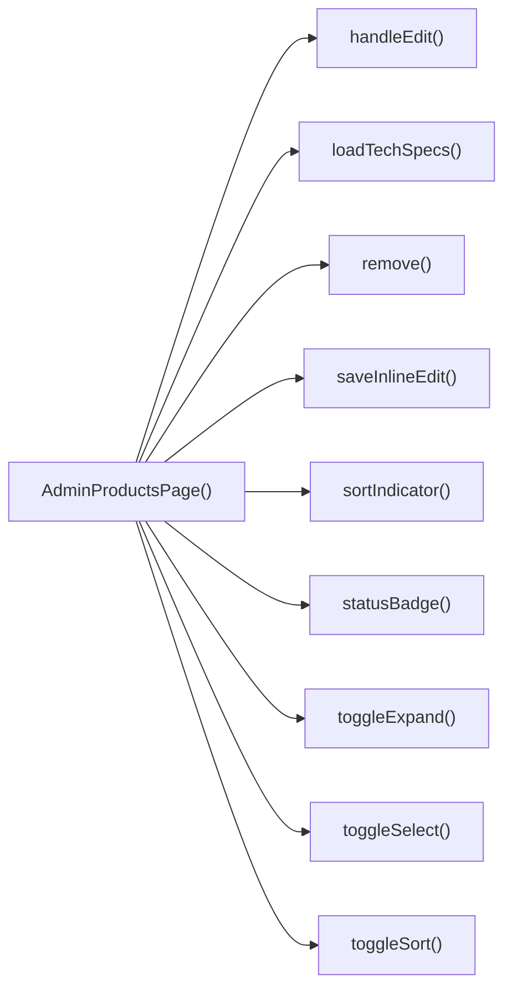

## Genel Bakış
Bu modül, VentHub HVAC platformunun yönetici panelinde ürün yönetimi sayfasını oluşturan React bileşenidir. Yöneticilerin tüm ürünleri listeleyip tekil veya toplu olarak düzenleme, silme, durumlarını değiştirme gibi tüm temel ürün yönetimi işlemlerini gerçekleştirmesini sağlar. Sayfa içi sıralama, satır içi düzenleme ve detaylı ürün görünümü gibi kullanıcı deneyimini iyileştiren özellikleri bünyesinde barındırır.

## Fonksiyon Grupları
### Ana Sayfa Bileşeni
Tüm ürün yönetimi sayfasının durum ve iş akışlarını yöneten ana bileşendir, tüm alt fonksiyonları ve arayüz yapısını oluşturur.
- AdminProductsPage

### Ürün Seçim ve Görünüm Yönetimi
Kullanıcıların listelenen ürünleri tek tek veya toplu olarak seçmesini, ürün detaylarını görüntülemek için kartları genişletmesini sağlayan işlemleri yönetir.
- toggleSelect, toggleSelectAll, toggleExpand

### Kullanıcı Etkileşim Tetikleyicileri
Ürün ekleme, düzenleme, sıralama değiştirme, satır içi düzenleme kaydetme gibi kullanıcı eylemlerini tetikleyen iş akışı başlatan fonksiyonlardır.
- handleCreate, handleEdit, handleModalSuccess, toggleSort, saveInlineEdit

### Tekil Ürün İşlemleri
Sadece tek bir ürün üzerinde gerçekleştirilen silme, teknik özellikleri yükleme gibi özel işlemleri yapan asenkron fonksiyonlardır.
- remove, loadTechSpecs

### Toplu Ürün Yönetimi İşlemleri
Birden fazla seçili ürün üzerinde aynı anda çalışan, durum güncelleme, öne çıkarma, toplu silme ve toplu fiyat düzenleme gibi işlemleri gerçekleştirir.
- bulkStatusChange, bulkFeatureToggle, bulkDelete, bulkPriceAdjust

### Yardımcı Arayüz Fonksiyonları
Arayüzde kullanılan görsel öğeleri oluşturan, sıralama göstergesi ve durum etiketi gibi yardımcı işlevleri yerine getirir.
- sortIndicator, statusBadge

---

## AXIOMS – Mimari Varsayımlar
Bu modül VentHub HVAC platformunun admin paneli ürün yönetimi sayfasıdır; tüm tekil ve toplu ürün seçimi, düzenleme, silme, durum değiştirme, sıralama, fiyat ayarlama ve teknik spesifikasyon yükleme işlemlerinin kesintisiz çalışması için gerekli tüm istemci state yönetimi, yetki sistemleri ve arka plan API erişiminin sürekliliği zorunludur.

[Aksiyom 1]: Eğer ürün listesi ve kullanıcı etkileşimlerini yöneten istemci tarafı state yönetim sistemi yoksa, toggleSelect, toggleSelectAll, toggleExpand, toggleSort gibi tüm yerel durum değişikliği gerektiren işlemler başarısız olur.
[Aksiyom 2]: Eğer ürün kalıcı değişikliklerini destekleyen arka plan API servisleri erişilebilir değilse, handleCreate, handleEdit, remove, bulkStatusChange, bulkPriceAdjust gibi veritabanı değişikliği gerektiren tüm işlemler başarısız olur.
[Aksiyom 3]: Eğer admin kullanıcısının bu sayfadaki değişiklik işlemlerini gerçekleştirmek için gerekli yetkileri yoksa, tüm silme, düzenleme, toplu işlem fonksiyonları yetki hatasıyla sonuçlanır.
[Aksiyom 4]: Eğer bulkPriceAdjust fonksiyonuna geçirilen mode parametresi tanımlı 'percent' | 'fixed' değerleri dışında bir değer alırsa, toplu fiyat ayarlama işlemi çalışmaz.
[Aksiyom 5]: Eğer loadTechSpecs fonksiyonuna geçerli formatta bir _productId string değeri sağlanmazsa, ürün teknik spesifikasyonları yüklenemez.
[Aksiyom 6]: Eğer toggleSort ve sortIndicator fonksiyonlarında kullanılan SortKey tipinde geçerli bir sıralama anahtarı sağlanmazsa, ürün listesi sıralama işlemi başarısız olur.
[Aksiyom 7]: Eğer toplu işlemler için seçilen ürünlerin kimlik listesi state'te tutulmuyorsa, tüm bulk ile başlayan toplu işlem fonksiyonları hedef ürün olmadan başarısız olur.
[Aksiyom 8]: Eğer işlem sonrası başarı modallerini yöneten state yapısı yoksa, handleModalSuccess fonksiyonu çalışmaz ve işlem sonrası bildirimler gösterilemez.
[Aksiyom 9]: Eğer statusBadge fonksiyonuna tanımlı string|null türleri dışında bir değer gönderilirse, ürün durumunu gösteren rozet bileşeni düzgün render edilemez.

---

## FONKSIYON DETAYLARI

### AdminProductsPage
**Ne yapar**: VentHub HVAC projesinin yönetici paneline ait ürün yönetimi sayfasını oluşturan ana React bileşenidir. Tüm ürün listeleme, seçim, düzenleme, silme ve toplu işlem gibi yönetim işlevlerini tek bir arayüzde toplayarak yöneticilere sunar. Sayfa içindeki tüm yardımcı işlevlerin barındığı ana bileşendir.
**Nasıl yapar**: React.FC türünde tanımlanmış, sayfa içindeki tüm yardımcı fonksiyonları (toggleSelect, handleCreate, bulkStatusChange vb.) kendi bünyesinde barındırır, bileşen içi state yönetimini gerçekleştirir ve tüm yönetim işlevlerini içeren kullanıcı arayüzünü JSX olarak render eder.
**Parametreler**: Yoktur
**Dönüş**: React bileşeni olarak tamamen işlevsel yönetici ürünler sayfası arayüzünü döndürür.

### toggleSelect
**Ne yapar**: Tek bir ürün öğesinin seçili olma durumunu tersine çeviren işlemcidir. Ürün listesinden herhangi bir ürünün tek başına seçilmesini veya seçiminin kaldırılmasını sağlar, tekil seçim işlemlerini yönetir.
**Nasıl yapar**: Aldığı ürün kimliği ile bileşen içi seçili ürünler state'ini günceller. Eğer ilgili ürün id'si seçili ürünler listesinde mevcutsa listeden çıkarır, mevcut değilse listeye ekleyerek seçim durumunu tersine çevirir.
**Parametreler**:
- name: id, type: string — Seçim durumu değiştirilecek ürünün benzersiz kimlik değeri
**Dönüş**: Hiçbir değer döndürmez, yalnızca bileşen içi seçili ürünler state'ini günceller.

### toggleSelectAll
**Ne yapar**: Ürün listesindeki tüm ürünlerin aynı anda seçilmesi veya tüm seçimlerin kaldırılması işlemini gerçekleştiren toplu seçim fonksiyonudur. Tüm ürünleri tek tıkla seçmeyi veya seçimleri iptal etmeyi sağlar.
**Nasıl yapar**: Sayfada listelenen tüm ürünlerin benzersiz id'lerini toplar, eğer tüm ürünler zaten seçili state'de ise tümünü seçili ürünler listesinden çıkarır, herhangi biri seçili değilse tüm ürün id'lerini seçili listesine ekler.
**Parametreler**: Yoktur
**Dönüş**: Hiçbir değer döndürmez, yalnızca seçili ürünler state'ini günceller.

### toggleExpand
**Ne yapar**: Tek bir ürün öğesinin detaylarının görünürlük durumunu tersine çeviren genişletme/küçültme fonksiyonudur. Ürün kartının ek detaylarının yöneticiye gösterilmesini veya gizlenmesini sağlar.
**Nasıl yapar**: Aldığı ürün kimliği ile genişletilmiş öğeler listesini günceller. Eğer ilgili id genişletilmiş listede mevcutsa listeden çıkararak ürün detaylarını gizler, mevcut değilse listeye ekleyerek detayları görünür hale getirir.
**Parametreler**:
- name: id, type: string — Genişletme/küçültme işlemi yapılacak ürünün benzersiz kimlik değeri
**Dönüş**: Hiçbir değer döndürmez, yalnızca bileşen içi genişletilmiş öğeler state'ini günceller.

### handleCreate
**Ne yapar**: Yeni ürün oluşturma işlemini başlatan işlemcidir. Ürün ekleme formunu içeren modal penceresini açarak yöneticiye yeni ürün bilgilerini girebileceği arayüzü sunar.
**Nasıl yapar**: Bileşen içinde tanımlı ürün oluşturma modalının görünürlük state'ini aktif hale getirir, tüm alanları boş olan sıfırlanmış bir ürün formunu kullanıcıya sunar.
**Parametreler**: Yoktur
**Dönüş**: Hiçbir değer döndürmez, yalnızca modal state'ini güncelleyerek ürün ekleme formunu açar.

### handleEdit
**Ne yapar**: Mevcut bir ürünün düzenleme işlemini başlatan işlemcidir. Seçilen ürünün mevcut tüm bilgileriyle dolu olan düzenleme formunu içeren modal penceresini açar.
**Nasıl yapar**: Aldığı ürün kimliği ile ilgili ürün verisini çeker, düzenleme formunu bu mevcut verilerle doldurur ve düzenleme modalının görünürlüğünü aktif hale getirir.
**Parametreler**:
- name: id, type: string — Düzenlenecek ürünün benzersiz kimlik değeri
**Dönüş**: Hiçbir değer döndürmez, yalnızca ilgili state'leri güncelleyerek ürün düzenleme formunu açar.

### handleModalSuccess
**Ne yapar**: Ürün oluşturma veya düzenleme işlemlerinde başarılı bir kayıt sonrası çalışan temizleme ve yenileme fonksiyonudur. Yeni veya güncellenmiş ürünün ürün listesinde anında görünmesini sağlar.
**Nasıl yapar**: Açık olan modal penceresini kapatır, ürün listesinin güncel verilerle yeniden yüklenmesi için ilgili veri çekme fonksiyonunu tetikler, formdaki eski verileri tamamen temizler.
**Parametreler**: Yoktur
**Dönüş**: Hiçbir değer döndürmez, yalnızca işlem sonrası bileşen state'lerini sıfırlar ve ürün listesini yeniler.

### remove
**Ne yapar**: Tek bir ürünün sistemden kalıcı olarak silinmesi işlemini gerçekleştiren fonksiyondur. Silme işlemi öncesi yönetici onayı alarak güvenli silme işlemi sunar.
**Nasıl yapar**: Önce yöneticiye silme işlemini onaylaması için bir onay penceresi sunar, onay alınması halinde aldığı ürün kimliği ile silme API çağrısını yapar, işlem başarılı olursa ürün listesini güncel verilerle yeniler.
**Parametreler**:
- name: id, type: string — Silinecek ürünün benzersiz kimlik değeri
**Dönüş**: Hiçbir değer döndürmez, yalnızca silme işlemini tamamlayarak ürün listesini günceller.

### bulkStatusChange
**Ne yapar**: Önceden seçilmiş tüm ürünlerin aktif/pasif gibi durumlarını tek seferde değiştiren toplu işlem fonksiyonudur. Birden fazla ürünün durumunu tek işlemle yönetmeyi sağlar.
**Nasıl yapar**: Seçili ürünler listesindeki tüm ürün id'lerini toplar, aldığı yeni durum değeri ile toplu durum güncelleme API çağrısını yapar, işlem başarılı olursa ürün listesini yeniler ve seçili ürünler listesini sıfırlar.
**Parametreler**:
- name: status, type: string — Tüm seçili ürünlere atanacak yeni durum değeri
**Dönüş**: Hiçbir değer döndürmez, yalnızca toplu durum güncelleme işlemini gerçekleştirerek ilgili state'leri ve ürün listesini günceller.

### bulkFeatureToggle
**Ne yapar**: Önceden seçilmiş tüm ürünlerin öne çıkarılmış (featured) durumunu tek seferde ayarlayan toplu işlem fonksiyonudur. Birden fazla ürünün platformda öne çıkarılma durumunu toplu olarak yönetmek için kullanılır.
**Nasıl yapar**: Seçili ürünler listesindeki tüm ürün id'lerini toplar, aldığı boolean değer ile tüm seçili ürünlerin öne çıkarılmış durumunu güncelleyen API çağrısını yapar, işlem başarılı olursa ürün listesini yeniler ve seçili ürünler listesini sıfırlar.
**Parametreler**:
- name: featured, type: boolean — Tüm seçili ürünlere atanacak öne çıkarılmış durum değeri, true ise ürünler öne çıkarılır, false ise öne çıkarılmış durumu kaldırılır
**Dönüş**: Hiçbir değer döndürmez, yalnızca toplu özellik ayarlama işlemini tamamlayarak ilgili state'leri ve ürün listesini günceller.

---

### bulkDelete
**Ne yapar**: VentHub HVAC platformunun yönetici ürünler sayfasında, kullanıcı tarafından arayüzde seçilen birden fazla ürünü tek işlemde toplu olarak silmek için tetiklenen fonksiyondur. Yöneticilerin ürün yönetimi süreçlerini hızlandırmak için tasarlanmış toplu işlem fonksiyonlarından biridir.
**Nasıl yapar**: Öncelikle arayüzde seçilen tüm ürünlerin benzersiz ID'lerini toplar, kullanıcıdan silme işlemi için onay aldıktan sonra bu ID listesini arka uç API'ye gönderir. İşlem sonrası yerel ürün listesini güncelleyerek silinen ürünleri listeden kaldırır, işlem başarısı veya hatası durumunda kullanıcıya uygun bildirim gösterir.
**Parametreler**: Herhangi bir parametre almaz
**Dönüş**: Tanımlı bir dönüş tipi bulunmamaktadır, void olarak çalışır.

### bulkPriceAdjust
**Ne yapar**: Seçilen birden fazla ürünün fiyatını toplu olarak güncellemek için kullanılan fonksiyondur. Yöneticilerin yüzdesel veya sabit tutarlı fiyat ayarlamalarını tüm seçili ürünlere tek seferde uygulamasını sağlar.
**Nasıl yapar**: Aldığı mod ve value parametrelerine göre her seçili ürünün mevcut fiyatını güncelleyecek şekilde hesaplama yapar. 'percent' modunda belirtilen oranda fiyat artışı veya düşüşü hesaplar, 'fixed' modunda belirtilen sabit tutarı doğrudan fiyatlara ekler veya çıkarır. Hesaplanan yeni fiyatları arka uca kaydeder ve yerel ürün listesini güncelleyerek değişikliklerin arayüzde görünmesini sağlar.
**Parametreler**:
- mode: 'percent' | 'fixed' — Fiyat ayarlama işleminin türünü belirten parametre, 'percent' değeri yüzdesel, 'fixed' değeri sabit tutarlı fiyat ayarlaması yapılacağını belirtir.
- value: number — Fiyat ayarlama miktarını taşıyan sayısal parametre, pozitif değer fiyat artışı, negatif değer fiyat düşüşü işlemini tetikler.
**Dönüş**: Tanımlı bir dönüş tipi bulunmamaktadır, void olarak çalışır.

### saveInlineEdit
**Ne yapar**: Ürün listesi üzerinde satır içi (inline) olarak düzenlenen ürün bilgilerini kaydetmek için tetiklenen fonksiyondur. Yöneticilerin ürün listesini terk etmeden hızlıca ürün detaylarını güncelleyebilmesini sağlar.
**Nasıl yapar**: Düzenleme sırasında kullanıcı tarafından girilen tüm yeni değerleri toplar, öncelikle gerekli format ve doğrulama kontrollerinden geçirir. Doğrulamaları geçen verileri arka uç API'ye kaydetme isteği olarak gönderir, işlem başarılı olursa yerel ürün listesindeki ilgili ürünün bilgilerini günceller. Hata durumunda kullanıcıya hatanın kaynağını açıklayan bildirim gösterir.
**Parametreler**: Herhangi bir parametre almaz
**Dönüş**: Tanımlı bir dönüş tipi bulunmamaktadır, void olarak çalışır.

### loadTechSpecs
**Ne yapar**: Belirtilen ID'ye sahip ürünün teknik spesifikasyonlarını arka uçtan yüklemek için kullanılan fonksiyondur. Ürün detaylarının görüntülendiği bölümde teknik özelliklerin kullanıcıya sunulmasını sağlar.
**Nasıl yapar**: Aldığı ürün ID'sini kullanarak arka uç API'den ilgili ürünün teknik spesifikasyonlarını ister, gelen veriyi yerel uygulama state'ine kaydederek arayüzde render edilmesini sağlar. Yükleme sırasında oluşabilecek hataları yakalar, kullanıcıya yükleme başarısızlığı hakkında bildirim gösterir.
**Parametreler**:
- _productId: string — Teknik spesifikasyonları yüklenecek ürünün benzersiz kimliğini taşıyan string tipinde parametre, başındaki alt çizgi parametrenin dahili kullanım için tanımlandığını belirtir.
**Dönüş**: Tanımlı bir dönüş tipi bulunmamaktadır, void olarak çalışır.

### toggleSort
**Ne yapar**: Ürün listesinin sıralama kriterini veya mevcut kritere göre sıralama yönünü değiştirmek için kullanılan fonksiyondur. Kullanıcıların istedikleri kritere göre ürün listesini yeniden sıralayabilmesini sağlar.
**Nasıl yapar**: Aldığı sıralama anahtarının mevcut aktif sıralama anahtarı olup olmadığını kontrol eder. Eğer aynı anahtar tekrar tetiklenirse sıralama yönünü (artan/azalan) tersine çevirir, farklı bir anahtar seçilmişse sıralama kriterini yeni anahtarla güncelleyerek ürün listesini yeniden sıralar ve yerel state'i günceller.
**Parametreler**:
- key: SortKey — Sıralama işlemi için kullanılacak kriteri temsil eden, önceden tanımlanmış izin verilen değerlerden oluşan SortKey tipinde parametre.
**Dönüş**: Tanımlı bir dönüş tipi bulunmamaktadır, void olarak çalışır.

### sortIndicator
**Ne yapar**: Arayüzde aktif sıralama kriterine göre uygun sıralama göstergesinin (artan/azalan yönünü gösteren ok vb. görsel öğe) render edilmesini sağlayan yardımcı fonksiyondur. Kullanıcıların hangi kritere göre ve hangi yönde sıralama yapıldığını hızlıca anlamasını sağlar.
**Nasıl yapar**: Aldığı sıralama anahtarının mevcut aktif sıralama anahtarı olup olmadığını kontrol eder. Eğer ilgili anahtar aktifse, güncel sıralama yönüne uygun olarak artan veya azalan sırayı gösteren görsel öğeyi arayüze ekler, aktif değilse varsayılan boş göstergeyi render eder.
**Parametreler**:
- key: SortKey - Sıralama göstergesinin oluşturulacağı sıralama kriterini temsil eden SortKey tipinde parametre.
**Dönüş**: Tanımlı bir dönüş tipi bulunmamaktadır, void olarak çalışır.

### statusBadge
**Ne yapar**: Ürünün stok durumu, onay durumu veya satış durumu gibi metrikleri temsil eden renkli etiket (badge) bileşeninin oluşturulmasını sağlayan yardımcı fonksiyondur. Ürün listesinde her ürünün durumunun hızlıca fark edilmesini sağlar.
**Nasıl yapar**: Aldığı durum string'ine göre önceden tanımlanmış renk ve metne sahip badge bileşenini hazırlar. Eğer gelen durum değeri null veya undefined ise varsayılan "bilinmeyen durum" etiketini render eder. Her durum değerine atanan özel renkler ile stokta/stokta değil, aktif/pasif gibi durumları görsel olarak ayırt eder.
**Parametreler**:
- s?: string | null — Ürünün durumunu temsil eden opsiyonel string veya null değerli parametre, geçerli bir durum değeri almadığında varsayılan durum gösterimi kullanılır.
**Dönüş**: Tanımlı bir dönüş tipi bulunmamaktadır, void olarak çalışır.

---

## INTERFACES

### CategoryOpt
- `id: string`
- `name: string`

---

## AST POINTERS

### [N1_NASIL] AST Pointer: C:\Users\alize\venthub-hvac\src\views\admin\AdminProductsPage.tsx::toggleSelectAll
- **params**: (parametre yok)
- **ic_degiskenler**:
  - `selectedIds` — Tüm seçili ürün ID'lerini depolayan Set nesnesi
  - `rows` — Tüm ürün listesini tutan dizi
  - `setSelectedIds` — Seçili ID'ler state'ini güncelleyen setter fonksiyonu
- **Dönüş**: yok

### [N2_NASIL] AST Pointer: C:\Users\alize\venthub-hvac\src\views\admin\AdminProductsPage.tsx::loadLocalStoragePrefs
- **params**: (parametre yok)
- **ic_degiskenler**:
  - `window` — Tarayıcı window nesnesi, SSR kontrolü için kullanılır
  - `localStorage.getItem(`${STORAGE_KEY}:cols`)` — localStorage'dan kaydedilmiş görünür sütun ayarlarını çeken metod
  - `c` - localStorage'dan okunan sütun ayarları ham string değeri
  - `setVisibleCols` — Görünür sütunlar state'ini güncelleyen setter fonksiyonu
  - `JSON.parse(c)` — Okunan sütun ayarları stringini nesneye dönüştüren metod
  - `localStorage.getItem(`${STORAGE_KEY}:density`)` — localStorage'dan kaydedilmiş tablo yoğunluğu ayarını çeken metod
  - `d` — localStorage'dan okunan yoğunluk ayarı string değeri
  - `setDensity` — Tablo yoğunluğu state'ini güncelleyen setter fonksiyonu
- **Dönüş**: yok

### [N3_NASIL] AST Pointer: C:\Users\alize\venthub-hvac\src\views\admin\AdminProductsPage.tsx::saveVisibleColsToStorage
- **params**: (parametre yok)
- **ic_degiskenler**:
  - `window` — Tarayıcı window nesnesi, SSR kontrolü için kullanılır
  - `localStorage.setItem(`${STORAGE_KEY}:cols`, JSON.stringify(visibleCols))` — Güncel görünür sütun ayarlarını localStorage'a kaydeden metod
  - `visibleCols` — Mevcut görünür sütunlar state değeri
- **Dönüş**: yok

### [N4_NASIL] AST Pointer: C:\Users\alize\venthub-hvac\src\views\admin\AdminProductsPage.tsx::saveDensityToStorage
- **params**: (parametre yok)
- **ic_degiskenler**:
  - `window` — Tarayıcı window nesnesi, SSR kontrolü için kullanılır
  - `localStorage.setItem(`${STORAGE_KEY}:density`, density)` — Mevcut tablo yoğunluğu ayarını localStorage'a kaydeden metod
  - `density` — Mevcut tablo yoğunluğu state değeri
- **Dönüş**: yok

### [N5_NASIL] AST Pointer: C:\Users\alize\venthub-hvac\src\views\admin\AdminProductsPage.tsx::getSavedSortKey
- **params**: (parametre yok)
- **ic_degiskenler**:
  - `localStorage.getItem(SORT_KEY_STORAGE)` — localStorage'dan kaydedilmiş sıralama anahtarını çeken metod
  - `v` — localStorage'dan okunan sıralama anahtarı değeri
- **Dönüş**: SortKey ('name' | 'sku' | 'category' | 'status' | 'price' | 'stock')

### [N6_NASIL] AST Pointer: C:\Users\alize\venthub-hvac\src\views\admin\AdminProductsPage.tsx::getSavedSortDir
- **params**: (parametre yok)
- **ic_degiskenler**:
  - `localStorage.getItem(SORT_DIR_STORAGE)` — localStorage'dan kaydedilmiş sıralama yönünü çeken metod
  - `v` — localStorage'dan okunan sıralama yönü değeri
- **Dönüş**: 'asc' | 'desc'

### [N7_NASIL] AST Pointer: C:\Users\alize\venthub-hvac\src\views\admin\AdminProductsPage.tsx::processDeepLinkQuery
- **params**: (parametre yok)
- **ic_degiskenler**:
  - `deepLinkAppliedRef.current` — Derin bağlantının sadece bir kez işlenmesini kontrol eden referans değeri
  - `searchParams?.get('q')` — URL sorgu parametrelerinden arama terimini çeken metod
  - `queryParam` — URL'den okunan arama terimi değeri
  - `setQ` — Arama terimi state'ini güncelleyen setter fonksiyonu
  - `setDebouncedQ` — Gecikmeli arama terimi state'ini güncelleyen setter fonksiyonu
- **Dönüş**: yok

### [N8_NASIL] AST Pointer: C:\Users\alize\venthub-hvac\src\views\admin\AdminProductsPage.tsx::loadProducts
- **params**: (parametre yok)
- **ic_degiskenler**:
  - `setLoading` — Yükleme durumu state'ini güncelleyen setter fonksiyonu
  - `setError` — Hata mesajı state'ini güncelleyen setter fonksiyonu
  - `await ensureSessionFresh()` — Kullanıcı oturumunun geçerliliğini kontrol eden asenkron metod
  - `debouncedQ.trim()` — Gecikmeli arama teriminin temizlenmiş hali
  - `term` — Kullanılabilir arama terimi değeri
  - `list` — UI'a uyarlanmış ürün listesi depolayan değişken
  - `totalCount` — Toplam ürün sayısını depolayan değişken
  - `offset` — Sayfalama için hesaplanan başlangıç indeksi
  - `await adminSearchProducts(...)` — FTS ile ürün arayan asenkron admin metodu
  - `PAGE_SIZE` — Sayfa başına gösterilecek ürün sayısı sabiti
  - `selectedCategoryFilter` — Seçili kategori filtresi değeri
  - `results` — Arama metodundan dönen ham sonuçlar
  - `filtered` — İstemci tarafı filtrelerinden geçirilmiş sonuç listesi
  - `anyStatus` - Aktif herhangi bir durum filtresi olup olmadığını kontrol eden boolean
  - `statusFilter` — Durum filtreleri state değeri
  - `statuses` — Filtrelemede kullanılacak aktif durum değerleri listesi
  - `featuredOnly` — Sadece öne çıkan ürünleri gösterme durumu boolean değeri
  - `toUIProductList` — Veritabanı ürün nesnelerini UI formatına dönüştüren metod
  - `(results[0] as { total_count?: number }).total_count` — RPC'den dönen toplam ürün sayısı değeri
  - `supabase.from('products').select(...)` — Supabase üzerinden ürünleri çeken sorgu
  - `query` — Ürün sorgusunu depolayan değişken
  - `sortableMap` — Sıralama anahtarlarını veritabanı sütun isimlerine eşleyen nesne
  - `col` — Sıralama için kullanılacak veritabanı sütun ismi
  - `sortKey` — Mevcut sıralama anahtarı state değeri
  - `sortDir` — Mevcut sıralama yönü state değeri
  - `from` — Sayfalama için sorgu aralığı başlangıç indeksi
  - `to` — Sayfalama için sorgu aralığı bitiş indeksi
  - `await query.range(from, to)` — Sorguya sayfalama aralığı ekleyen metot
  - `{ data, error, count }` — Supabase sorgusundan dönen yanıt nesneleri
  - `setRows` — Ürün listesi state'ini güncelleyen setter fonksiyonu
  - `setTotal` — Toplam ürün sayısı state'ini güncelleyen setter fonksiyonu
  - `await Promise.all([supabase.from('categories').select(...), supabase.from('inventory_settings').select(...)])` — Kategori ve stok ayarlarını paralel olarak çeken metot
  - `c` — Kategoriler sorgusundan dönen yanıt
  - `s` — Envanter ayarları sorgusundan dönen yanıt
  - `setCats` — Kategori listesi state'ini güncelleyen setter fonksiyonu
  - `ids = list.map(x => x.id)` — Mevcut sayfadaki ürün ID'lerini içeren dizi
  - `chunkSize` — Ürün ID'lerini bölmek için kullanılan parça boyutu sabiti
  - `chunks` — ID listesinin parçalara ayrılmış hali
  - `await Promise.all(chunks.map(c => supabase.from('product_images').select(...).in('product_id', c)))` — Ürün resimlerini paralel olarak çeken metot
  - `map` — Ürün ID'lerini kapak resmi yoluna eşleyen nesne
  - `setCovers` — Kapak resimleri eşleştirmesi state'ini güncelleyen setter fonksiyonu
  - `e` — Try bloğunda yakalanan hata nesnesi
- **Dönüş**: yok

### [N9_NASIL] AST Pointer: C:\Users\alize\venthub-hvac\src\views\admin\AdminProductsPage.tsx::processImageResults
- **params**: ({ data })
- **ic_degiskenler**:
  - `data` — Supabase'den dönen ürün resimleri listesi
  - `map` — Ürün ID'lerini kapak resmi yoluna eşleyen ana nesne
  - `r.product_id` — İterasyon edilen resmin ait olduğu ürün ID'si
  - `r.path` — İterasyon edilen resmin dosya yolu
- **Dönüş**: yok

### [N10_NASIL] AST Pointer: C:\Users\alize\venthub-hvac\src\views\admin\AdminProductsPage.tsx::assignCoverImage
- **params**: (r)
- **ic_degiskenler**:
  - `r` — İterasyon edilen ürün resmi nesnesi
  - `r.product_id` — Resmin ait olduğu ürün ID'si
  - `r.path` — Resmin dosya yolu
  - `map` — Ürün ID'lerini kapak resmi yoluna eşleyen ana nesne
- **Dönüş**: yok

## AST POINTERS

### [N1_NASIL] AST Pointer: C:\Users\alize\venthub-hvac\src\views\admin\AdminProductsPage.tsx::debounce cleanup effect
- **params**: (parametre yok)
- **ic_degiskenler**:
  - `t` — 300ms gecikmeli setTimeout nesnesi, arama sorgusu ve sayfa ayarlarını tetiklemek için kullanılır
  - `setDebouncedQ` — nihai arama sorgusunu ayarlayan state setter fonksiyonu
  - `q` — işlenecek ham arama sorgusu değişkeni, trim() ile baştaki/sondaki boşlukları temizlenir
  - `setPage` — aktif sayfa numarasını ayarlayan state setter fonksiyonu
- **Dönüş**: setTimeout'u temizleyen React effect temizlik fonksiyonu

### [N2_NASIL] AST Pointer: C:\Users\alize\venthub-hvac\src\views\admin\AdminProductsPage.tsx::immediate search update
- **params**: (parametre yok)
- **ic_degiskenler**:
  - `setDebouncedQ` — nihai arama sorgusunu ayarlayan state setter fonksiyonu
  - `q` — işlenecek ham arama sorgusu değişkeni
  - `setPage` — aktif sayfa numarasını 1 olarak ayarlayan state setter fonksiyonu
- **Dönüş**: yok

### [N3_NASIL] AST Pointer: C:\Users\alize\venthub-hvac\src\views\admin\AdminProductsPage.tsx::handleCreate
- **params**: (parametre yok)
- **ic_degiskenler**:
  - `setEditingId` — düzenlenen ürün id'sini ayarlayan state setter fonksiyonu
  - `setIsModalOpen` — ürün ekleme/düzenleme modalının açılma durumunu ayarlayan state setter
- **Dönüş**: yok

### [N4_NASIL] AST Pointer: C:\Users\alize\venthub-hvac\src\views\admin\AdminProductsPage.tsx::handleEdit
- **params**: id: string
- **ic_degiskenler**:
  - `id` — düzenlenecek ürünün benzersiz veritabanı kimliği
  - `setEditingId` — düzenlenen ürün id'sini parametreden gelen id olarak ayarlayan state setter
  - `setIsModalOpen` — ürün düzenleme modalını açmak için true olarak ayarlayan state setter
- **Dönüş**: yok

### [N5_NASIL] AST Pointer: C:\Users\alize\venthub-hvac\src\views\admin\AdminProductsPage.tsx::handleModalSuccess
- **params**: (parametre yok)
- **ic_degiskenler**:
  - `load` — ürün listesini veritabanından yeniden yükleyen asenkron veri çekme fonksiyonu
- **Dönüş**: yok

### [N6_NASIL] AST Pointer: C:\Users\alize\venthub-hvac\src\views\admin\AdminProductsPage.tsx::remove
- **params**: id: string
- **ic_degiskenler**:
  - `id` — silinecek ürünün benzersiz veritabanı kimliği
  - `confirm` — kullanıcıdan silme işlemi onayı alan tarayıcı API'si
  - `t` — yerelleştirme için kullanılan çeviri fonksiyonu
  - `before` — silinmeden önce ürünün mevcut verilerini tutan değişken, ürün listesinden id ile eşleşen kaydı alır
  - `rows` — ekranda listelenen mevcut ürünlerin dizisi
  - `supabase` — veritabanı işlemleri için kullanılan Supabase istemcisi
  - `error` — Supabase silme işlemi sırasında dönen hata nesnesi
  - `logAdminAction` — denetim kaydı tutmak için içe aktarılan audit modülü fonksiyonu
  - `load` — silme işleminden sonra ürün listesini yeniden yükleyen fonksiyon
  - `e` — catch bloğunda yakalanan işlem hatası nesnesi
  - `alert` — kullanıcıya hata mesajı gösteren tarayıcı API'si
- **Dönüş**: yok

### [N7_NASIL] AST Pointer: C:\Users\alize\venthub-hvac\src\views\admin\AdminProductsPage.tsx::bulkStatusChange
- **params**: status: string
- **ic_degiskenler**:
  - `status` — tüm seçili ürünlere uygulanacak yeni durum değeri
  - `selectedIds` — kullanıcı tarafından seçilen ürünlerin id'lerini tutan Set nesnesi
  - `confirm` — kullanıcıdan toplu güncelleme onayı alan tarayıcı API'si
  - `ids` — selectedIds Set'inden diziye dönüştürülen ürün id listesi
  - `supabase` — veritabanı işlemleri için kullanılan Supabase istemcisi
  - `error` — Supabase güncelleme işlemi sırasında oluşan hata nesnesi
  - `setSelectedIds` — seçili id'leri sıfırlamak için kullanılan state setter
  - `load` — güncellemeden sonra ürün listesini yeniden yükleyen fonksiyon
  - `e` — catch bloğunda yakalanan işlem hatası nesnesi
  - `alert` — kullanıcıya hata mesajı gösteren tarayıcı API'si
- **Dönüş**: yok

### [N8_NASIL] AST Pointer: C:\Users\alize\venthub-hvac\src\views\admin\AdminProductsPage.tsx::bulkFeatureToggle
- **params**: featured: boolean
- **ic_degiskenler**:
  - `featured` — seçili ürünlerin vitinde gösterilip gösterilmeyeceğini belirten boolean değer
  - `selectedIds` — kullanıcı tarafından seçilen ürünlerin id'lerini tutan Set nesnesi
  - `ids` — selectedIds Set'inden diziye dönüştürülen ürün id listesi
  - `supabase` — veritabanı işlemleri için kullanılan Supabase istemcisi
  - `error` — Supabase güncelleme işlemi sırasında oluşan hata nesnesi
  - `setSelectedIds` — seçili id'leri sıfırlamak için kullanılan state setter
  - `load` — güncellemeden sonra ürün listesini yeniden yükleyen fonksiyon
  - `e` — catch bloğunda yakalanan işlem hatası nesnesi
  - `alert` — kullanıcıya hata mesajı gösteren tarayıcı API'si
- **Dönüş**: yok

### [N9_NASIL] AST Pointer: C:\Users\alize\venthub-hvac\src\views\admin\AdminProductsPage.tsx::bulkDelete
- **params**: (parametre yok)
- **ic_degiskenler**:
  - `selectedIds` — kullanıcı tarafından seçilen ürünlerin id'lerini tutan Set nesnesi
  - `confirm` — kullanıcıdan toplu silme onayı alan tarayıcı API'si
  - `ids` — selectedIds Set'inden diziye dönüştürülen ürün id listesi
  - `supabase` — veritabanı işlemleri için kullanılan Supabase istemcisi
  - `error` — Supabase silme işlemi sırasında oluşan hata nesnesi
  - `setSelectedIds` — seçili id'leri sıfırlamak için kullanılan state setter
  - `load` — silme işleminden sonra ürün listesini yeniden yükleyen fonksiyon
  - `e` — catch bloğunda yakalanan işlem hatası nesnesi
  - `alert` — kullanıcıya hata mesajı gösteren tarayıcı API'si
- **Dönüş**: yok

### [N10_NASIL] AST Pointer: C:\Users\alize\venthub-hvac\src\views\admin\AdminProductsPage.tsx::bulkPriceAdjust
- **params**: mode: 'percent' | 'fixed', value: number
- **ic_degiskenler**:
  - `mode` — fiyat güncelleme modu, yüzde veya sabit tutar artırımı
  - `value` — uygulanacak fiyat güncelleme miktarı
  - `selectedIds` — kullanıcı tarafından seçilen ürünlerin id'lerini tutan Set nesnesi
  - `label` — kullanıcı onayı mesajında gösterilecek güncelleme etiketi
  - `confirm` — kullanıcıdan fiyat güncelleme onayı alan tarayıcı API'si
  - `ids` — selectedIds Set'inden diziye dönüştürülen ürün id listesi
  - `supabase` — veritabanı işlemleri için kullanılan Supabase istemcisi
  - `data` — güncellenecek ürünlerin verilerini içeren Supabase dönüş nesnesi
  - `fetchErr` — ürün verilerini çekerken oluşan hata nesnesi
  - `products` — güncellenecek ürünlerin listesi
  - `updates` — her ürün için hesaplanan yeni fiyatı içeren güncelleme nesnelerinin listesi
  - `currentPrice` — ürünün mevcut fiyatı, null ise 0 olarak atanır
  - `newPrice` — mod ve değere göre hesaplanan yeni fiyat
  - `results` — tüm ürünlerin ayrı ayrı güncelleme işlemlerinin sonuçlarını tutan dizi
  - `errorResult` — sonuçlar arasında hata içeren ilk güncelleme sonucu
  - `setSelectedIds` — seçili id'leri sıfırlamak için kullanılan state setter
  - `load` — güncellemeden sonra ürün listesini yeniden yükleyen fonksiyon
  - `e` — catch bloğunda yakalanan işlem hatası nesnesi
  - `alert` — kullanıcıya hata mesajı gösteren tarayıcı API'si
- **Dönüş**: yok

## AST POINTERS

### [N1_NASIL] AST Pointer: C:\Users\alize\venthub-hvac\src\views\admin\AdminProductsPage.tsx::bulkPriceAdjust_map_callback
- **params**: (p: { id: string; price: number | null; name: string; sku: string; brand: string }, mode: 'percent' | 'fixed', value: number)
- **ic_degiskenler**:
  - `currentPrice` — Ürünün mevcut fiyatı, null ise 0 olarak varsayılır
  - `newPrice` — Moda göre hesaplanan yeni fiyat, yüzdelik veya sabit artış uygulanıp 2 ondalık basamağa yuvarlanır
- **Dönüş**: { id: string; price: number } tipinde güncellenmiş ürün fiyat nesnesi

### [N2_NASIL] AST Pointer: C:\Users\alize\venthub-hvac\src\views\admin\AdminProductsPage.tsx::saveInlineEdit
- **params**: (parametre yok)
- **ic_degiskenler**:
  - `inlineEdit` — Açık olan satır içi düzenleme verisi, mevcut değilse fonksiyon erken sonlanır
  - `numVal` — Düzenlenen metin değerinin sayısal karşılığı, parseFloat ile dönüştürülür
  - `payload` — Supabase'e gönderilecek güncelleme yükü, düzenlenen alana göre price veya stock_qty içerir
  - `error` — Supabase güncelleme işlemi sırasında dönen hata nesnesi
  - `e` — Try bloğunda yakalanan genel işlem hatası
- **Dönüş**: yok

### [N3_NASIL] AST Pointer: C:\Users\alize\venthub-hvac\src\views\admin\AdminProductsPage.tsx::loadTechSpecs
- **params**: (_productId: string)
- **ic_degiskenler**:
  - `techSpecs` - Tüm ürünlerin teknik özelliklerini saklayan genel nesne, tekrar yüklemeyi engellemek için kontrol edilir
  - `data` - Supabase'den çekilen ürün teknik özellikleri yanıt verisi
- **Dönüş**: yok

### [N4_NASIL] AST Pointer: C:\Users\alize\venthub-hvac\src\views\admin\AdminProductsPage.tsx::toggleSort
- **params**: (key: SortKey)
- **ic_degiskenler**:
  - `sortKey` - Mevcut aktif sıralama anahtarı
  - `setSortDir` - Sıralama yönünü (asc/desc) güncelleyen state setter fonksiyonu
  - `setSortKey` - Sıralama anahtarını güncelleyen state setter fonksiyonu
  - `setPage` - Sayfa numarasını 1'e sıfırlayan state setter fonksiyonu
- **Dönüş**: yok

### [N5_NASIL] AST Pointer: C:\Users\alize\venthub-hvac\src\views\admin\AdminProductsPage.tsx::category_map_builder
- **params**: (parametre yok)
- **ic_degiskenler**:
  - `map` - Kategori id'lerini isimlerle eşleyen Map nesnesi
  - `c` - cats dizisinde dönülen her bir kategori öğesi
  - `cats` - Tüm kategori listesi
- **Dönüş**: Kategori eşleştirmelerini içeren Map<string, string> nesnesi

### [N6_NASIL] AST Pointer: C:\Users\alize\venthub-hvac\src\views\admin\AdminProductsPage.tsx::sorted_array_builder
- **params**: (parametre yok)
- **ic_degiskenler**:
  - `arr` - Filtrelenmiş ürün listesinin kopyası, sıralama işlemi için kullanılır
  - `filtered` - Filtrelenmiş ham ürün listesi
  - `sortDir` - Mevcut sıralama yönü (asc/desc)
  - `sortKey` - Mevcut sıralama anahtarı
  - `a` - Sıralama karşılaştırmasındaki ilk ürün öğesi
  - `b` - Sıralama karşılaştırmasındaki ikinci ürün öğesi
  - `dir` - Sıralama yönüne göre çarpan olarak kullanılan 1 veya -1 değeri
  - `an` - Karşılaştırmadaki ilk ürünün kategori ismi
  - `bn` - Karşılaştırmadaki ikinci ürünün kategori ismi
  - `catsMap` - Kategori id'lerini isimlerle eşleyen Map nesnesi
- **Dönüş**: Sıralanmış ürün dizisi

### [N7_NASIL] AST Pointer: C:\Users\alize\venthub-hvac\src\views\admin\AdminProductsPage.tsx::sort_compare_callback
- **params**: (a, b)
- **ic_degiskenler**:
  - `sortDir` - Mevcut sıralama yönü (asc/desc)
  - `sortKey` - Mevcut sıralama anahtarı
  - `dir` - Sıralama yönüne göre çarpan olarak kullanılan 1 veya -1 değeri
  - `an` - Karşılaştırmadaki ilk ürünün kategori ismi
  - `bn` - Karşılaştırmadaki ikinci ürünün kategori ismi
  - `catsMap` - Kategori id'lerini isimlerle eşleyen Map nesnesi
- **Dönüş**: karşılaştırma sonucu dönen sayısal değer

### [N8_NASIL] AST Pointer: C:\Users\alize\venthub-hvac\src\views\admin\AdminProductsPage.tsx::statusBadge
- **params**: (s?: string | null)
- **ic_degiskenler**:
  - `v` - Gelen durum string'inin küçük harfe dönüştürülmüş hali, boşsa boş string olarak atanır
  - `baseClass` - Tüm durum etiketlerinde kullanılan ortak CSS sınıfları
  - `t` - Çeviri sistemi fonksiyonu, durum etiketlerinin yerelleştirilmiş metinlerini çeker
- **Dönüş**: Duruma göre stilendirilmiş React JSX span elementi

### [N9_NASIL] AST Pointer: C:\Users\alize\venthub-hvac\src\views\admin\AdminProductsPage.tsx::handleCategoryChange
- **params**: (value: string)
- **ic_degiskenler**:
  - `setSelectedCategoryFilter` - Seçili kategori filtresini güncelleyen state setter fonksiyonu
- **Dönüş**: yok

### [N10_NASIL] AST Pointer: C:\Users\alize\venthub-hvac\src\views\admin\AdminProductsPage.tsx::category_select_props_builder
- **params**: (parametre yok)
- **ic_degiskenler**:
  - `selectedCategoryFilter` - Mevcut seçili kategori filtresi değeri
  - `handleCategoryChange` - Kategori değişikliğini yöneten event handler fonksiyonu
  - `cats` - Tüm kategori listesi, select seçeneklerini oluşturmak için kullanılır
  - `t` - Çeviri sistemi fonksiyonu, select varsayılan etiketinin yerelleştirilmiş metnini çeker
- **Dönüş**: Kategori select bileşeninin ihtiyaç duyduğu value, onChange ve options alanlarını içeren nesne

## AST POINTERS

### [N1_NASIL] AST Pointer: C:\Users\alize\venthub-hvac\src\views\admin\AdminProductsPage.tsx::anonim_csv_uret_indir
- **params**: (parametre yok)
- **ic_degiskenler**:
  - `cols` — CSV dosyasının sütun başlıklarını tutan dizi
  - `header` — cols dizisinin virgülle birleştirilerek oluşturulan CSV başlık satırı
  - `sorted` — Sıralanmış ürün listesi, üzerinde map ile dönülerek CSV satırları oluşturulur
  - `lines` — Her ürün için CSV formatına dönüştürülmüş satırların listesi
  - `r.id` — İşlenen ürünün kimliği, CSV satırına eklenir
  - `r.name` — İşlenen ürünün adı, CSV'de tırnak sorunlarını önlemek için temizlenir
  - `r.sku` — İşlenen ürünün stok kodu, CSV satırına eklenir
  - `r.category_id` — İşlenen ürünün kategori kimliği, boşsa boş string olarak eklenir
  - `r.status` — İşlenen ürünün durumu, boşsa boş string olarak eklenir
  - `r.price` — İşlenen ürünün fiyatı, string'e çevrilerek CSV'ye eklenir
  - `r.stock_qty` — İşlenen ürünün stok miktarı, string'e çevrilerek CSV'ye eklenir
  - `csv` — BOM etiketli, başlık ve tüm satırları içeren tam CSV içeriği
  - `blob` — CSV içeriğinden oluşturulan indirme için Blob nesnesi
  - `url` — Blob'dan oluşturulan geçici indirme URL'si
  - `a` — Dinamik olarak oluşturulan <a> indirme linki DOM elementi
- **Dönüş**: yok (yan etki: `products.csv` dosyasını tarayıcıda indirme işlemini tetikler)

### [N2_NASIL] AST Pointer: C:\Users\alize\venthub-hvac\src\views\admin\AdminProductsPage.tsx::anonim_csv_urun_satiri_cevir
- **params**: r (işlenen ürün nesnesi)
- **ic_degiskenler**:
  - `r.id` — Ürün kimliği, CSV satırına eklenir
  - `r.name` — Ürün adı, CSV formatına uygun olarak tırnak işaretleri temizlenir
  - `r.sku` — Ürün stok kodu, CSV satırına eklenir
  - `r.category_id` — Ürün kategori kimliği, boşsa boş string olarak atanır
  - `r.status` — Ürün durumu, boşsa boş string olarak atanır
  - `r.price` — Ürün fiyatı, null değilse string'e çevrilerek CSV'ye eklenir
  - `r.stock_qty` — Ürün stok miktarı, null değilse string'e çevrilerek CSV'ye eklenir
- **Dönüş**: string (virgülle birleştirilmiş tek ürün CSV satırı)

### [N3_NASIL] AST Pointer: C:\Users\alize\venthub-hvac\src\views\admin\AdminProductsPage.tsx::anonim_tablo_satiri_olustur
- **params**: r (işlenen ürün nesnesi)
- **ic_degiskenler**:
  - `isExpanded` — Ürün satırının teknik özellikler için genişletilip genişletilmediğini belirten boolean
  - `expandedIds` — Genişletilmiş tüm ürün kimliklerini saklayan Set nesnesi
  - `isSelected` — Ürünün toplu işlemler için seçilip seçilmediğini belirten boolean
  - `selectedIds` — Seçilmiş tüm ürün kimliklerini saklayan Set nesnesi
  - `toggleSelect` — Ürün seçim durumunu tersine çeviren fonksiyon
  - `toggleExpand` — Ürün satırının genişletme durumunu tersine çeviren fonksiyon
  - `loadTechSpecs` — Ürün teknik özelliklerini yükleyen asenkron fonksiyon
  - `hasWriteAccess` — Kullanıcının ürün üzerinde değişiklik yapma yetkisi olup olmadığını belirten boolean
  - `adminTableCellClass` — Tüm tablo hücreleri için ortak CSS sınıfı
  - `cellPad` — Tablo hücreleri için iç dolgu CSS sınıfı
  - `visibleCols` — Hangi tablo sütunlarının görüntüleneceğini belirten nesne
  - `covers` — Ürün kapak görseli dosya isimlerini saklayan nesne, ürün kimliği ile erişilir
  - `process.env.NEXT_PUBLIC_SUPABASE_URL` — Supabase depolama temel URL'si, ürün görseli bağlantısı oluşturmak için kullanılır
  - `r.brand` — Ürün markası, tabloda görüntülenir
  - `r.model_code` — Ürün model kodu, tabloda görüntülenir
  - `catsMap` — Kategori kimliklerini kategori isimlerine eşleyen Map nesnesi
  - `statusBadge` — Ürün durumu için renkli etiket bileşeni oluşturan fonksiyon
  - `r.low_stock_threshold` — Düşük stok uyarısı için eşik değeri
  - `inlineEdit` — Aktif satır içi düzenleme nesnesi, null ise açık düzenleme yok
  - `setInlineEdit` — Satır içi düzenleme state'ini güncelleyen setter fonksiyonu
  - `saveInlineEdit` — Satır içi düzenleme değişikliklerini kaydeden asenkron fonksiyon
  - `formatCurrency` — Fiyatı kullanıcı diline göre para formatına çeviren fonksiyon
  - `lang` — Kullanıcı arayüzü dili, para formatlaması için kullanılır
  - `handleEdit` — Ürün düzenleme modalını açan fonksiyon
  - `remove` — Ürün silme işlemini başlatan asenkron fonksiyon
  - `t` — Arayüz metinlerini yerelleştiren çeviri fonksiyonu
  - `techSpecs` — Ürün teknik özelliklerini saklayan nesne, ürün kimliği ile erişilir
- **Dönüş**: React.ReactFragment (ürün ana satırı ve genişletilmişse teknik özellikler alt satırını içeren JSX fragmenti)

### [N4_NASIL] AST Pointer: C:\Users\alize\venthub-hvac\src\views\admin\AdminProductsPage.tsx::anonim_teknik_ozellik_olustur
- **params**: [key, val] (teknik özellik anahtar-değer çifti)
- **ic_degiskenler**:
  - `key` — Teknik özelliğin tanımlayıcı anahtarı, arayüzde başlık olarak görüntülenir
  - `val` — Teknik özelliğin değeri, string'e çevrilerek arayüzde gösterilir
- **Dönüş**: JSX.Element (tek bir teknik özelliği görüntüleyen div elementi)

---

## ÇAĞRI HARİTASI

### Disariya Cagrilar (Outgoing)
Dosya içindeki ana AdminProductsPage() fonksiyonu, ürün yönetimi sayfasındaki tüm işlevleri çalıştırmak üzere toggleSort, handleEdit, statusBadge, remove, saveInlineEdit, toggleExpand, loadTechSpecs, sortIndicator ve toggleSelect olmak üzere 9 dosya içi yardımcı fonksiyonu çağırır.

### Disaridan Cagrilanlar (Incoming)
Sağlanan çağrı verisinde bu modülü kullanan herhangi bir dış dosya veya fonksiyon bilgisi paylaşılmamıştır.

### Ic Ice Fonksiyonlar (Nested)
Yok

---

## DOSYA-İÇİ ÇAĞRI GRAFİĞİ
  AdminProductsPage() → handleEdit()
  AdminProductsPage() → loadTechSpecs()
  AdminProductsPage() → remove()
  AdminProductsPage() → saveInlineEdit()
  AdminProductsPage() → sortIndicator()
  AdminProductsPage() → statusBadge()
  AdminProductsPage() → toggleExpand()
  AdminProductsPage() → toggleSelect()
  AdminProductsPage() → toggleSort()

---

## NODE ID STANDARD

  file: src\views\admin\AdminProductsPage.tsx
  function: src\views\admin\AdminProductsPage.tsx::AdminProductsPage
  function: src\views\admin\AdminProductsPage.tsx::toggleSelect
  function: src\views\admin\AdminProductsPage.tsx::toggleSelectAll
  function: src\views\admin\AdminProductsPage.tsx::toggleExpand
  function: src\views\admin\AdminProductsPage.tsx::handleCreate
  function: src\views\admin\AdminProductsPage.tsx::handleEdit
  function: src\views\admin\AdminProductsPage.tsx::handleModalSuccess
  function: src\views\admin\AdminProductsPage.tsx::remove
  function: src\views\admin\AdminProductsPage.tsx::bulkStatusChange
  function: src\views\admin\AdminProductsPage.tsx::bulkFeatureToggle
  function: src\views\admin\AdminProductsPage.tsx::bulkDelete
  function: src\views\admin\AdminProductsPage.tsx::bulkPriceAdjust
  function: src\views\admin\AdminProductsPage.tsx::saveInlineEdit
  function: src\views\admin\AdminProductsPage.tsx::loadTechSpecs
  function: src\views\admin\AdminProductsPage.tsx::toggleSort
  function: src\views\admin\AdminProductsPage.tsx::sortIndicator
  function: src\views\admin\AdminProductsPage.tsx::statusBadge

---

## DISA AKTARILANLAR (EXPORTS)
  export: AdminProductsPage