## Genel Bakış
AdminProductsPage, yönetici panelinde ürünlerin kapsamlı bir şekilde yönetildiği ana sayfadır. Bu bileşen, ürün listesini sunma, bireysel ve toplu CRUD (Oluştur, Oku, Güncelle, Sil) işlemleri yürütme, sıralama ve filtreleme yapma ile teknik özelliklerin detaylı bir şekilde görüntülenmesini sağlama gibi temel sorumlulukları bir arada yönetir.

## Fonksiyon Grupları
### Sayfa Temeli ve Görünüm Yönetimi
Ana bileşeni oluşturan ve sayfanın genel görünümü, seçim durumları, sıralama göstergeleri ile durum rozetlerini yöneten temel fonksiyonlar.
- AdminProductsPage, toggleSelect, toggleSelectAll, toggleExpand, toggleSort, sortIndicator, statusBadge

### Tekil Ürün İşlemleri
Bireysel ürünlerle ilgili temel işlemleri başlatan ve yöneten fonksiyonlar.
- handleCreate, handleEdit, handleModalSuccess, remove, saveInlineEdit, loadTechSpecs

### Toplu İşlemler
Birden fazla ürünün aynı anda seçilerek toplu olarak durum değiştirme, öne çıkarma, fiyat ayarlama veya silinmesini sağlayan fonksiyonlar.
- bulkStatusChange, bulkFeatureToggle, bulkDelete, bulkPriceAdjust

---

## AXIOMS – Mimari Varsayımlar

Bu modül için özel aksiyom tanımlanmamıştır.

---

## FONKSİYON DETAYLARI

### AdminProductsPage
**Ne yapar**: Uygulamanın yönetim panelinde ürünlerin listelendiği ve yönetildiği ana sayfa bileşenini tanımlar.  
**Nasıl yapar**: React fonksiyonel bileşeni olarak tanımlanır ve içinde ürün tablosu, seçim ve eylem kontrolleri gibi alt bileşenleri barındırır.  
**Parametreler**: *Yok*  
**Dönüş**: `React.FC` – bir React fonksiyonel bileşeni.

### toggleSelect
**Ne yapar**: Tek bir ürünün seçili durumunu tersine çevirir.  
**Nasıl yapar**: Verilen `id` parametresiyle ilgili ürünün seçili/seçili değil durumunu günceller.  
**Parametreler**:
- `id`: `string` — seçimin değiştirileceği ürünün benzersiz kimliği.  
**Dönüş**: Belirtilmemiş (muhtemelen `void`).

### toggleSelectAll
**Ne yapar**: Listede bulunan tüm ürünlerin seçili durumunu toplu olarak tersine çevirir.  
**Nasıl yapar**: Seçim durumunu kontrol eder ve tüm öğeler için aynı seçimi uygular.  
**Parametreler**: *Yok*  
**Dönüş**: Belirtilmemiş (muhtemelen `void`).

### toggleExpand
**Ne yapar**: Belirli bir ürün satırının detay (expand) görünümünü açar veya kapatır.  
**Nasıl yapar**: `id` ile eşleşen satırın genişletme durumunu değiştirir ve aynı zamanda `loadTechSpecs` fonksiyonunu çağırarak teknik özellikleri yükler.  
**Parametreler**:
- `id`: `string` — genişletme durumunun değiştirileceği ürünün kimliği.  
**Dönüş**: Belirtilmemiş (muhtemelen `void`).

### handleCreate
**Ne yapar**: Yeni bir ürün oluşturma sürecini başlatır.  
**Nasıl yapar**: Kullanıcı “Yeni Ürün” eylemini tetiklediğinde ilgili modal veya formu açar.  
**Parametreler**: *Yok*  
**Dönüş**: Belirtilmemiş (muhtemelen `void`).

### handleEdit
**Ne yapar**: Mevcut bir ürünün düzenleme moduna geçişi sağlar.  
**Nasıl yapar**: Verilen `id` ile eşleşen ürünün bilgilerini düzenleme formuna yükler.  
**Parametreler**:
- `id`: `string` — düzenlenecek ürünün kimliği.  
**Dönüş**: Belirtilmemiş (muhtemelen `void`).

### handleModalSuccess
**Ne yapar**: Ürün oluşturma veya düzenleme modalı başarılı bir şekilde tamamlandığında tetiklenir.  
**Nasıl yapar**: Modal kapanışını yönetir ve listeyi güncelleyerek yeni/ güncellenmiş veriyi yansıtır.  
**Parametreler**: *Yok*  
**Dönüş**: Belirtilmemiş (muhtemelen `void`).

### remove
**Ne yapar**: Belirli bir ürünü sistemden siler.  
**Nasıl yapar**: `id` parametresiyle eşleşen ürünün silinmesini başlatır ve ardından listeyi yeniler.  
**Parametreler**:
- `id`: `string` — silinecek ürünün kimliği.  
**Dönüş**: Belirtilmemiş (muhtemelen `void`).

### bulkStatusChange
**Ne yapar**: Seçili ürünlerin durumunu toplu olarak değiştirir.  
**Nasıl yapar**: `status` parametresiyle belirtilen yeni durumu tüm seçili ürünlere uygular.  
**Parametreler**:
- `status`: `string` — uygulanacak yeni durum değeri.  
**Dönüş**: Belirtilmemiş (muhtemelen `void`).

### bulkFeatureToggle
**Ne yapar**: Seçili ürünlerin “featured” (öne çıkarılmış) özelliğini toplu olarak açar veya kapatır.  
**Nasıl yapar**: `featured` parametresiyle belirlenen boolean değeri tüm seçili ürünlere atar.  
**Parametreler**:
- `featured`: `boolean` — ürünlerin öne çıkarılıp çıkarılmayacağını belirten değer.  
**Dönüş**: Belirtilmemiş (muhtemelen `void`).

### bulkDelete
**Ne yapar**: Birden fazla ürünün silinmesini toplu olarak başlatır.  
**Nasıl yapar**: Fonksiyonun iç mantığı kodda verilmemiştir; genellikle seçili ürün ID'lerini toplayıp bir API çağrısı yaparak silme işlemini gerçekleştirir.  
**Parametreler**:  
- *Yok*  
**Dönüş**: Bilinmiyor (muhtemelen `void`).

### bulkPriceAdjust
**Ne yapar**: Seçili ürünlerin fiyatlarını toplu olarak yüzde ya da sabit tutar üzerinden ayarlar.  
**Nasıl yapar**: `mode` parametresi yüzde (`percent`) ya da sabit (`fixed`) değer tipini belirler; `value` ise uygulanacak yüzde artışı/azalışını ya da sabit fiyat farkını temsil eder. Fonksiyon bu değerleri alıp ilgili ürünlerin fiyatlarını günceller.  
**Parametreler**:  
- `mode`: `'percent' | 'fixed'` — Fiyat ayarlama yöntemini belirler.  
- `value`: `number` — Uygulanacak yüzde ya da sabit tutar.  
**Dönüş**: Bilinmiyor (muhtemelen `void`).

### saveInlineEdit
**Ne yapar**: Satır içi düzenleme modunda yapılan değişiklikleri kaydeder.  
**Nasıl yapar**: Kullanıcı `Enter` tuşuna bastığında bu fonksiyon çağrılır; `Escape` tuşuna basıldığında ise satır içi düzenleme iptal edilerek `setInlineEdit(null)` çalıştırılır.  
**Parametreler**:  
- *Yok*  
**Dönüş**: Bilinmiyor (muhtemelen `void`).

### loadTechSpecs
**Ne yapar**: Belirtilen ürün kimliği için teknik özellikleri yükler.  
**Nasıl yapar**: Fonksiyon, bir ürün satırının genişletilmesi (`toggleExpand`) ile birlikte çağrılır; ürün ID'si (`_productId`) parametresi üzerinden ilgili teknik veri çekilir.  
**Parametreler**:  
- `_productId`: `string` — Teknik özelliklerin yükleneceği ürünün kimliği.  
**Dönüş**: Bilinmiyor (muhtemelen `void`).

### toggleSort
**Ne yapar**: Belirtilen anahtara göre tablo ya da liste sıralamasını değiştirir.  
**Nasıl yapar**: Mevcut sıralama yönünü kontrol eder; aynı anahtar tekrar seçildiğinde yön tersine çevrilir, farklı bir anahtar seçildiğinde yeni anahtar ve varsayılan yön ile sıralama yapılır.  
**Parametreler**:  
- `key`: `SortKey` — Sıralama yapılacak alanın anahtarı.  
**Dönüş**: Bilinmiyor (muhtemelen `void`).

### sortIndicator
**Ne yapar**: Belirli bir sıralama anahtarının mevcut sıralama yönünü gösteren görsel işaretçi üretir.  
**Nasıl yapar**: `key` parametresi ile eşleşen sıralama durumunu kontrol eder ve UI’da ok ya da benzeri bir gösterge döndürür.  
**Parametreler**:  
- `key`: `SortKey` — İncelenecek sıralama anahtarı.  
**Dönüş**: Bilinmiyor (muhtemelen bir JSX/React öğesi).

### statusBadge
**Ne yapar**: Ürün ya da işlem durumunu görsel bir rozet (badge) olarak sunar.  
**Nasıl yapar**: Opsiyonel `s` parametresi üzerinden durum değeri alınır; değer `null` ya da `undefined` ise varsayılan bir durum gösterilir.  
**Parametreler**:  
- `s` (opsiyonel): `string | null` — Gösterilecek durum metni.  
**Dönüş**: Bilinmiyor (muhtemelen bir JSX/React öğesi).

---

## INTERFACES

### CategoryOpt
- `id: string`
- `name: string`

---

## AST POINTERS

### [N1_NASIL] AST Pointer: `src/views/admin/AdminProductsPage.tsx`::toggleSelectAll
- **params**: (parametre yok)
- **ic_degiskenler**:
  - `selectedIds` — mevcut seçili ürün ID seti, `size` ile eleman sayısı kontrol edilir
  - `rows` — tabloda listelenen tüm ürünlerin dizisi, `length` ile toplam satır sayısı alınır
- **Dönüş**: yok (setSelectedIds çağrısı ile state güncellenir)

---

## MERMAID CALL GRAPH

```mermaid
graph TD
    AdminProductsPage_tsx__AdminProductsPage["AdminProductsPage"]
    AdminProductsPage_tsx__bulkDelete["bulkDelete"]
    AdminProductsPage_tsx__bulkFeatureToggle["bulkFeatureToggle"]
    AdminProductsPage_tsx__bulkPriceAdjust["bulkPriceAdjust"]
    AdminProductsPage_tsx__bulkStatusChange["bulkStatusChange"]
    AdminProductsPage_tsx__handleCreate["handleCreate"]
    AdminProductsPage_tsx__handleEdit["handleEdit"]
    AdminProductsPage_tsx__handleModalSuccess["handleModalSuccess"]
    AdminProductsPage_tsx__loadTechSpecs["loadTechSpecs"]
    AdminProductsPage_tsx__remove["remove"]
    AdminProductsPage_tsx__saveInlineEdit["saveInlineEdit"]
    AdminProductsPage_tsx__sortIndicator["sortIndicator"]
    AdminProductsPage_tsx__statusBadge["statusBadge"]
    AdminProductsPage_tsx__toggleExpand["toggleExpand"]
    AdminProductsPage_tsx__toggleSelect["toggleSelect"]
    AdminProductsPage_tsx__toggleSelectAll["toggleSelectAll"]
    AdminProductsPage_tsx__toggleSort["toggleSort"]
    AdminProductsPage_tsx__AdminProductsPage --> AdminProductsPage_tsx__remove
    AdminProductsPage_tsx__AdminProductsPage --> AdminProductsPage_tsx__toggleSort
    AdminProductsPage_tsx__AdminProductsPage --> AdminProductsPage_tsx__loadTechSpecs
    AdminProductsPage_tsx__AdminProductsPage --> AdminProductsPage_tsx__toggleSelect
    AdminProductsPage_tsx__AdminProductsPage --> AdminProductsPage_tsx__toggleExpand
    AdminProductsPage_tsx__AdminProductsPage --> AdminProductsPage_tsx__saveInlineEdit
    AdminProductsPage_tsx__AdminProductsPage --> AdminProductsPage_tsx__statusBadge
    AdminProductsPage_tsx__AdminProductsPage --> AdminProductsPage_tsx__handleEdit
    AdminProductsPage_tsx__AdminProductsPage --> AdminProductsPage_tsx__sortIndicator
```

## NODE ID STANDARD

  file: src\views\admin\AdminProductsPage.tsx
  function: src\views\admin\AdminProductsPage.tsx::AdminProductsPage
  function: src\views\admin\AdminProductsPage.tsx::toggleSelect
  function: src\views\admin\AdminProductsPage.tsx::toggleSelectAll
  function: src\views\admin\AdminProductsPage.tsx::toggleExpand
  function: src\views\admin\AdminProductsPage.tsx::handleCreate
  function: src\views\admin\AdminProductsPage.tsx::handleEdit
  function: src\views\admin\AdminProductsPage.tsx::handleModalSuccess
  function: src\views\admin\AdminProductsPage.tsx::remove
  function: src\views\admin\AdminProductsPage.tsx::bulkStatusChange
  function: src\views\admin\AdminProductsPage.tsx::bulkFeatureToggle
  function: src\views\admin\AdminProductsPage.tsx::bulkDelete
  function: src\views\admin\AdminProductsPage.tsx::bulkPriceAdjust
  function: src\views\admin\AdminProductsPage.tsx::saveInlineEdit
  function: src\views\admin\AdminProductsPage.tsx::loadTechSpecs
  function: src\views\admin\AdminProductsPage.tsx::toggleSort
  function: src\views\admin\AdminProductsPage.tsx::sortIndicator
  function: src\views\admin\AdminProductsPage.tsx::statusBadge

---

## DISA AKTARILANLAR (EXPORTS)
  export: AdminProductsPage

---

## STİL TOKENLERİ

### Arbitrary Değerler (token'a geçirilmemiş)
Yok — tüm stiller token'a geçirilmiş. ✅

### Kullanılan Token'lar (zaten token'a geçirilmiş)
- `tracking-hvac-relaxed`

### Tailwind Sınıf Özeti
- **Renkler:** `bg-cyan-400`, `bg-cyan-400/10`, `bg-cyan-400/3`, `bg-emerald-500/10`, `bg-gradient-to-r`, `bg-rose-500`, `bg-rose-500/10`, `bg-slate-500/10`, `bg-surface-deep`, `bg-white/1`, `bg-white/2`, `bg-white/3`, `bg-white/5`, `border-2`, `border-b`
- **Layout:** `custom-scrollbar`, `flex`, `flex-col`, `from-transparent`, `gap-0.5`, `gap-2`, `gap-3`, `gap-4`, `grid`, `grid-cols-2`, `h-0.5`, `h-1.5`, `h-12`, `h-4`, `h-6`
- **Varyant/Responsive:** `:`, `disabled:`, `focus-visible:`, `group-hover/btn:`, `group-hover/spec:`, `group-hover:`, `hover:`, `lg:`, `md:` önekleri
- **Yardımcı Sınıflar:** `$`, `${Number(r.stock_qty`, `${adminButtonPrimaryClass`, `${adminButtonSecondaryClass`, `${adminTableCellClass`, `${adminTableHeadCellClass`, `${baseClass`, `${cellPad`, `${headPad`, `${isExpanded`, `${isSelected`, `10`, `:`, `<`, `Number(r.stock_qty`