## Genel Bakış
AdminProductsPage, yönetici panelinde ürünlerin kapsamlı bir şekilde yönetildiği ana sayfadır. Bu bileşen, ürün listesini sunma, bireysel ve toplu CRUD (Oluştur, Oku, Güncelle, Sil) işlemleri yürütme, sıralama ve filtreleme yapma ile teknik özelliklerin detaylı bir şekilde görüntülenmesini sağlama gibi temel sorumlulukları bir arada yönetir.

## Fonksiyon Grupları
### Sayfa Temeli ve Görünüm Yönetimi
Ana bileşeni oluşturan ve sayfanın genel görünümü, seçim durumları, sıralama göstergeleri ile durum rozetlerini yöneten temel fonksiyonlar.
- `AdminProductsPage`, `toggleSelect`, `toggleSelectAll`, `toggleExpand`, `toggleSort`, `sortIndicator`, `statusBadge`

### Tekil Ürün İşlemleri
Bireysel ürünlerle ilgili temel işlemleri başlatan ve yöneten fonksiyonlar.
- `handleCreate`, `handleEdit`, `handleModalSuccess`, `remove`, `saveInlineEdit`, `loadTechSpecs`

### Toplu İşlemler
Birden fazla ürünün aynı anda seçilerek toplu olarak durum değiştirme, öne çıkarma, fiyat ayarlama veya silinmesini sağlayan fonksiyonlar.
- `bulkStatusChange`, `bulkFeatureToggle`, `bulkDelete`, `bulkPriceAdjust`

---

---

## FONKSİYON DETAYLARI

### AdminProductsPage
**Ne yapar**: Uygulamanın yönetim panelinde ürünlerin listelendiği ve yönetildiği ana sayfa bileşenini tanımlar.  
**Nasıl yapar**: React fonksiyonel bileşeni olarak tanımlanır ve içinde ürün tablosu, seçim ve eylem kontrolleri gibi alt bileşenleri barındırır.  
**Parametreler**: *Yok*  
**Dönüş**: `React.FC` – bir React fonksiyonel bileşeni.

### toggleSelect
**Ne yapar**: Tek bir ürünün seçili durumunu tersine çevirir.  
**Nasıl yapar**: Verilen `id` parametresiyle ilgili ürünün seçili/seçili değil durumunu günceller.  
**Parametreler**:
- `id`: `string` — seçimin değiştirileceği ürünün benzersiz kimliği.  
**Dönüş**: Belirtilmemiş (muhtemelen `void`).

### toggleSelectAll
**Ne yapar**: Listede bulunan tüm ürünlerin seçili durumunu toplu olarak tersine çevirir.  
**Nasıl yapar**: Seçim durumunu kontrol eder ve tüm öğeler için aynı seçimi uygular.  
**Parametreler**: *Yok*  
**Dönüş**: Belirtilmemiş (muhtemelen `void`).

### toggleExpand
**Ne yapar**: Belirli bir ürün satırının detay (expand) görünümünü açar veya kapatır.  
**Nasıl yapar**: `id` ile eşleşen satırın genişletme durumunu değiştirir ve aynı zamanda `loadTechSpecs` fonksiyonunu çağırarak teknik özellikleri yükler.  
**Parametreler**:
- `id`: `string` — genişletme durumunun değiştirileceği ürünün kimliği.  
**Dönüş**: Belirtilmemiş (muhtemelen `void`).

### handleCreate
**Ne yapar**: Yeni bir ürün oluşturma sürecini başlatır.  
**Nasıl yapar**: Kullanıcı “Yeni Ürün” eylemini tetiklediğinde ilgili modal veya formu açar.  
**Parametreler**: *Yok*  
**Dönüş**: Belirtilmemiş (muhtemelen `void`).

### handleEdit
**Ne yapar**: Mevcut bir ürünün düzenleme moduna geçişi sağlar.  
**Nasıl yapar**: Verilen `id` ile eşleşen ürünün bilgilerini düzenleme formuna yükler.  
**Parametreler**:
- `id`: `string` — düzenlenecek ürünün kimliği.  
**Dönüş**: Belirtilmemiş (muhtemelen `void`).

### handleModalSuccess
**Ne yapar**: Ürün oluşturma veya düzenleme modalı başarılı bir şekilde tamamlandığında tetiklenir.  
**Nasıl yapar**: Modal kapanışını yönetir ve listeyi güncelleyerek yeni/ güncellenmiş veriyi yansıtır.  
**Parametreler**: *Yok*  
**Dönüş**: Belirtilmemiş (muhtemelen `void`).

### remove
**Ne yapar**: Belirli bir ürünü sistemden siler.  
**Nasıl yapar**: `id` parametresiyle eşleşen ürünün silinmesini başlatır ve ardından listeyi yeniler.  
**Parametreler**:
- `id`: `string` — silinecek ürünün kimliği.  
**Dönüş**: Belirtilmemiş (muhtemelen `void`).

### bulkStatusChange
**Ne yapar**: Seçili ürünlerin durumunu toplu olarak değiştirir.  
**Nasıl yapar**: `status` parametresiyle belirtilen yeni durumu tüm seçili ürünlere uygular.  
**Parametreler**:
- `status`: `string` — uygulanacak yeni durum değeri.  
**Dönüş**: Belirtilmemiş (muhtemelen `void`).

### bulkFeatureToggle
**Ne yapar**: Seçili ürünlerin “featured” (öne çıkarılmış) özelliğini toplu olarak açar veya kapatır.  
**Nasıl yapar**: `featured` parametresiyle belirlenen boolean değeri tüm seçili ürünlere atar.  
**Parametreler**:
- `featured`: `boolean` — ürünlerin öne çıkarılıp çıkarılmayacağını belirten değer.  
**Dönüş**: Belirtilmemiş (muhtemelen `void`).

### bulkDelete
**Ne yapar**: Birden fazla ürünün silinmesini toplu olarak başlatır.  
**Nasıl yapar**: Fonksiyonun iç mantığı kodda verilmemiştir; genellikle seçili ürün ID'lerini toplayıp bir API çağrısı yaparak silme işlemini gerçekleştirir.  
**Parametreler**:  
- *Yok*  
**Dönüş**: Bilinmiyor (muhtemelen `void`).

### bulkPriceAdjust
**Ne yapar**: Seçili ürünlerin fiyatlarını toplu olarak yüzde ya da sabit tutar üzerinden ayarlar.  
**Nasıl yapar**: `mode` parametresi yüzde (`percent`) ya da sabit (`fixed`) değer tipini belirler; `value` ise uygulanacak yüzde artışı/azalışını ya da sabit fiyat farkını temsil eder. Fonksiyon bu değerleri alıp ilgili ürünlerin fiyatlarını günceller.  
**Parametreler**:  
- `mode`: `'percent' | 'fixed'` — Fiyat ayarlama yöntemini belirler.  
- `value`: `number` — Uygulanacak yüzde ya da sabit tutar.  
**Dönüş**: Bilinmiyor (muhtemelen `void`).

### saveInlineEdit
**Ne yapar**: Satır içi düzenleme modunda yapılan değişiklikleri kaydeder.  
**Nasıl yapar**: Kullanıcı `Enter` tuşuna bastığında bu fonksiyon çağrılır; `Escape` tuşuna basıldığında ise satır içi düzenleme iptal edilerek `setInlineEdit(null)` çalıştırılır.  
**Parametreler**:  
- *Yok*  
**Dönüş**: Bilinmiyor (muhtemelen `void`).

### loadTechSpecs
**Ne yapar**: Belirtilen ürün kimliği için teknik özellikleri yükler.  
**Nasıl yapar**: Fonksiyon, bir ürün satırının genişletilmesi (`toggleExpand`) ile birlikte çağrılır; ürün ID'si (`_productId`) parametresi üzerinden ilgili teknik veri çekilir.  
**Parametreler**:  
- `_productId`: `string` — Teknik özelliklerin yükleneceği ürünün kimliği.  
**Dönüş**: Bilinmiyor (muhtemelen `void`).

### toggleSort
**Ne yapar**: Belirtilen anahtara göre tablo ya da liste sıralamasını değiştirir.  
**Nasıl yapar**: Mevcut sıralama yönünü kontrol eder; aynı anahtar tekrar seçildiğinde yön tersine çevrilir, farklı bir anahtar seçildiğinde yeni anahtar ve varsayılan yön ile sıralama yapılır.  
**Parametreler**:  
- `key`: `SortKey` — Sıralama yapılacak alanın anahtarı.  
**Dönüş**: Bilinmiyor (muhtemelen `void`).

### sortIndicator
**Ne yapar**: Belirli bir sıralama anahtarının mevcut sıralama yönünü gösteren görsel işaretçi üretir.  
**Nasıl yapar**: `key` parametresi ile eşleşen sıralama durumunu kontrol eder ve UI’da ok ya da benzeri bir gösterge döndürür.  
**Parametreler**:  
- `key`: `SortKey` — İncelenecek sıralama anahtarı.  
**Dönüş**: Bilinmiyor (muhtemelen bir JSX/React öğesi).

### statusBadge
**Ne yapar**: Ürün ya da işlem durumunu görsel bir rozet (badge) olarak sunar.  
**Nasıl yapar**: Opsiyonel `s` parametresi üzerinden durum değeri alınır; değer `null` ya da `undefined` ise varsayılan bir durum gösterilir.  
**Parametreler**:  
- `s` (opsiyonel): `string | null` — Gösterilecek durum metni.  
**Dönüş**: Bilinmiyor (muhtemelen bir JSX/React öğesi).

---

## INTERFACES

### CategoryOpt
- `id: string`
- `name: string`

---

## AST POINTERS

### [N1_NASIL] AST Pointer: `src/views/admin/AdminProductsPage.tsx`::toggleSelectAll
- **params**: (yok)
- **ic_degiskenler**:
  - `selectedIds` — mevcut seçili ürün ID seti; `size === rows.length` kontrolü ile tümü seçili mi bakılır
  - `rows` — ürün satır listesi; `r.id` değerleri `new Set` içine map edilerek tümü seçilir
- **Dönüş**: yok (state updater: `setSelectedIds`)

### [N2_NASIL] AST Pointer: `src/views/admin/AdminProductsPage.tsx`::loadVisibleColsFromStorage
- **params**: (yok)
- **ic_degiskenler**:
  - `c` — `localStorage.getItem(\`${STORAGE_KEY}:cols\`)` ile okunan JSON string; görünür sütun tercihlerini tutar
  - `d` — `localStorage.getItem(\`${STORAGE_KEY}:density\`)` ile okunan string; `'compact'` veya `'comfortable'` olabilir
  - `STORAGE_KEY` — localStorage anahtarı kökü (dışarıdan referans)
  - `visibleCols` — mevcut sütun görünürlük state'i; `...JSON.parse(c)` ile genişletilir
  - `setDensity` — density state setter
  - `setVisibleCols` — visibleCols state setter
- **Dönüş**: yok (yan etki: state güncelleme)

### [N3_NASIL] AST Pointer: `src/views/admin/AdminProductsPage.tsx`::saveVisibleColsToStorage
- **params**: (yok)
- **ic_degiskenler**:
  - `visibleCols` — mevcut sütun görünürlük nesnesi; `JSON.stringify` ile serialize edilip localStorage'a yazılır
  - `STORAGE_KEY` — localStorage anahtarı kökü
- **Dönüş**: yok (yan etki: localStorage yazma)

### [N4_NASIL] AST Pointer: `src/views/admin/AdminProductsPage.tsx`::saveDensityToStorage
- **params**: (yok)
- **ic_degiskenler**:
  - `density` — mevcut yoğunluk modu string'i (`'compact'` | `'comfortable'`); localStorage'a doğrudan yazılır
  - `STORAGE_KEY` — localStorage anahtarı kökü
- **Dönüş**: yok (yan etki: localStorage yazma)

### [N5_NASIL] AST Pointer: `src/views/admin/AdminProductsPage.tsx`::getInitialSortKey
- **params**: (yok)
- **ic_degiskenler**:
  - `v` — `localStorage.getItem(SORT_KEY_STORAGE) as SortKey | null` ile okunan sıralama sütunu adı; `'name' | 'sku' | 'category' | 'status' | 'price' | 'stock'` olabilir
  - `SORT_KEY_STORAGE` — localStorage sıralama anahtarı
- **Dönüş**: `SortKey` — geçerli bir sort key veya `'name'` (varsayılan)

### [N6_NASIL] AST Pointer: `src/views/admin/AdminProductsPage.tsx`::getInitialSortDir
- **params**: (yok)
- **ic_degiskenler**:
  - `v` — `localStorage.getItem(SORT_DIR_STORAGE) as 'asc' | 'desc' | null` ile okunan sıralama yönü
  - `SORT_DIR_STORAGE` — localStorage sıralama yönü anahtarı
- **Dönüş**: `'asc' | 'desc'` — geçerli yön veya `'asc'` (varsayılan)

### [N7_NASIL] AST Pointer: `src/views/admin/AdminProductsPage.tsx`::applyDeepLink
- **params**: (yok)
- **ic_degiskenler**:
  - `deepLinkAppliedRef` — ref nesnesi; deep link'in daha önce uygulanıp uygulanmadığını takip eder, `current` boolean
  - `searchParams` — Next.js `useSearchParams` hook'undan gelen URL query parametreleri nesnesi
  - `queryParam` — `searchParams?.get('q') || ''` ile alınan URL'deki arama terimi
- **Dönüş**: yok (yan etki: `setQ`, `setDebouncedQ`, `deepLinkAppliedRef.current` güncelleme)

### [N8_NASIL] AST Pointer: `src/views/admin/AdminProductsPage.tsx`::load
- **params**: (yok)
- **ic_degiskenler**:
  - `term` — `debouncedQ.trim()` ile elde edilentrimmed arama terimi
  - `list` — `DomainProduct[]` tipinde ürün listesi; API veya DB sorgusundan dönen verilerle doldurulur
  - `totalCount` — toplam ürün sayısı; RPC `total_count` alanından veya `count`'tan alınır
  - `offset` — `(page - 1) * PAGE_SIZE` hesaplaması ile sayfalama ofseti
  - `results` — `adminSearchProducts(...)` RPC çağrısından dönen arama sonuçları
  - `filtered` — `DbAdminSearchResult[]` tipinde; RPC sonuçları client-side status/featured filtresi uygulanmış hali
  - `statuses` — `string[]`; aktif filtre durumlarının toplandığı dizi (`'active'`, `'inactive'`, `'out_of_stock'`)
  - `anyStatus` — boolean; herhangi bir status filtresinin aktif olup olmadığı
  - `query` — Supabase `from('products').select(...)` sorgu builder nesnesi
  - `sortableMap` — `Record<SortKey, string | null>`; sıralama sütunu adlarını DB kolon adlarına eşler
  - `col` — sıralama için kullanılacak DB kolon adı veya null
  - `from` — sayfalama başlangıç indeksi `(page - 1) * PAGE_SIZE`
  - `to` — sayfalama bitiş indeksi `from + PAGE_SIZE - 1`
  - `data` — Supabase query.raw() sonucundan dönen satır verisi
  - `error` — Supabase sorgu hatası
  - `count` — Supabase count option sonucu (toplam satır)
  - `c` — `Promise.all` içindeki categories sorgu sonucu; `{ data, error }` shape
  - `s` — `Promise.all` içindeki inventory_settings sorgu sonucu; `{ data, error }` shape
  - `ids` — `list.map(x => x.id)` ile elde edilen ürün ID dizisi (kapak görselleri için)
  - `chunkSize` — `20`; ID'leri parçalama boyutu
  - `chunks` — `string[][]`; ID'lerin parçalanmış hali (URL uzunluğu kısıtlaması için)
  - `results` (cover images) — `Promise.all(chunks.map(...))` ile gelen product_images sorgu sonuçları
  - `map` — `Record<string, string>`; `{ productId → coverPath }` eşleme nesnesi
  - `e` — try-catch yakalanan hata nesnesi
  - `ensureSessionFresh` — oturum tazeleme fonksiyonu (import)
  - `adminSearchProducts` — FTS RPC arama fonksiyonu (import)
  - `toUIProductList` — DB satırlarını domain tiplerine dönüştürücü (import)
  - `PAGE_SIZE` — sayfa başına satır sabiti
- **Dönüş**: yok (yan etki: `setLoading`, `setError`, `setRows`, `setTotal`, `setCats`, `setCovers` state güncellemeleri ve DB/FSH okuma)

### [N9_NASIL] AST Pointer: `src/views/admin/AdminProductsPage.tsx`::coverImageResultHandler
- **params**: `{ data }` — Supabase sorgu sonucu; `data` option'u `{ product_id, path, sort_order }[]` shape'inde
- **ic_degiskenler**:
  - `data` — product_images tablosundan dönen satır dizisi; her satır `{ product_id: string; path: string; sort_order: number }`
  - `map` — kapsama alanı haritası; `r.product_id` key'ine ilk `r.path` yazılır
  - `r` — forEach içindeki her bir ürün görseli satırı
- **Dönüş**: yok (yan etki: `map` nesnesini doldurma)

### [N10_NASIL] AST Pointer: `src/views/admin/AdminProductsPage.tsx`::coverImageRowHandler
- **params**: `r` — `{ product_id: string; path: string; sort_order: number }` tipinde ürün görseli satırı
- **ic_degiskenler**:
  - `map` — kapsama alanı haritası; `r.product_id` key'ine `r.path` yazılır (yalnızca ilk kez看到lduysa)
- **Dönüş**: yok (yan etki: `map` mutasyonu)

### [N11_NASIL] AST Pointer: `src/views/admin/AdminProductsPage.tsx`::useEffectDebounce
- **params**: (yok — useEffect callback)
- **ic_degiskenler**:
  - `t` — `setTimeout` sonucu; 300ms debounce timer ID'si
  - `q` — mevcut arama terimi state'i; `trim()` edilip `setDebouncedQ`'ya yazılır
  - `setDebouncedQ` — debounce edilmiş arama terimi setter
  - `setPage` — sayfa numarası setter; 1'e resetlenir
- **Dönüş**: temizlik fonksiyonu `() => clearTimeout(t)` (cleanup)

### [N12_NASIL] AST Pointer: `src/views/admin/AdminProductsPage.tsx`::debouncedHandler
- **params**: (yok)
- **ic_degiskenler**:
  - `q` — mevcut arama terimi state'i; trim edilip `setDebouncedQ`'ya yazılır
  - `setDebouncedQ` — debounce edilmiş arama terimi setter
  - `setPage` — sayfa numarası setter; 1'e resetlenir
- **Dönüş**: yok (yan etki: state güncelleme)

### [N13_NASIL] AST Pointer: `src/views/admin/AdminProductsPage.tsx`::handleCreate
- **params**: (yok)
- **ic_degiskenler**: (yok)
- **Dönüş**: yok (yan etki: `setEditingId(null)`, `setIsModalOpen(true)`)

### [N14_NASIL] AST Pointer: `src/views/admin/AdminProductsPage.tsx`::handleEdit
- **params**: `id: string` — düzenlenecek ürünün benzersiz tanımlayıcısı
- **ic_degiskenler**: (yok — parametre doğrudan kullanılır)
- **Dönüş**: yok (yan etki: `setEditingId(id)`, `setIsModalOpen(true)`)

### [N15_NASIL] AST Pointer: `src/views/admin/AdminProductsPage.tsx`::handleModalSuccess
- **params**: (yok)
- **ic_degiskenler**: (yok)
- **Dönüş**: yok (yan etki: `load()` çağrısı ile listeyi yeniler)

### [N16_NASIL] AST Pointer: `src/views/admin/AdminProductsPage.tsx`::remove
- **params**: `id: string` — silinecek ürünün ID'si
- **ic_degiskenler**:
  - `before` — silinmeden önceki ürün verisi; `rows.find(r => r.id === id)` ile bulunan satır veya `null`
  - `error` — Supabase delete sorgu hatası
  - `logAdminAction` — dinamik import ile yüklenen audit loglama fonksiyonu
  - `e` — try-catch yakalanan hata nesnesi
  - `t` — i18n çeviri fonksiyonu; confirmation mesajı ve alert metinleri için
  - `confirm` — tarayıcı onay dialogu
- **Dönüş**: yok (yan etki: DB silme, audit loglama, `load()` ile liste yenileme)

### [N17_NASIL] AST Pointer: `src/views/admin/AdminProductsPage.tsx`::bulkStatusChange
- **params**: `status: string` — hedef durum değeri (`'active'`, `'inactive'`, `'out_of_stock'`)
- **ic_degiskenler**:
  - `ids` — `Array.from(selectedIds)` ile Set'ten diziye dönüştürülmüş seçili ID'ler
  - `error` — Supabase update sorgu hatası
  - `e` — try-catch yakalanan hata nesnesi
  - `selectedIds` — seçili ürün ID seti; güncelleme sonrası `new Set()` ile temizlenir
- **Dönüş**: yok (yan etki: DB toplu güncelleme, `setSelectedIds`, `load()`)

### [N18_NASIL] AST Pointer: `src/views/admin/AdminProductsPage.tsx`::bulkFeatureToggle
- **params**: `featured: boolean` — vitrine ekleme/çıkarma bayrağı
- **ic_degiskenler**:
  - `ids` — `Array.from(selectedIds)` ile elde edilen seçili ID dizisi
  - `error` — Supabase update sorgu hatası
  - `e` — try-catch yakalanan hata nesnesi
- **Dönüş**: yok (yan etki: DB toplu güncelleme, `setSelectedIds`, `load()`)

### [N19_NASIL] AST Pointer: `src/views/admin/AdminProductsPage.tsx`::bulkDelete
- **params**: (yok)
- **ic_degiskenler**:
  - `ids` — `Array.from(selectedIds)` ile elde edilen seçili ID dizisi
  - `error` — Supabase delete sorgu hatası
  - `e` — try-catch yakalanan hata nesnesi
- **Dönüş**: yok (yan etki: DB toplu silme, `setSelectedIds`, `load()`)

### [N20_NASIL] AST Pointer: `src/views/admin/AdminProductsPage.tsx`::bulkPriceAdjust
- **params**: `mode: 'percent' | 'fixed'` — fiyat ayarlama modu (yüzde veya sabit tutar), `value: number` — uygulanacak değer
- **ic_degiskenler**:
  - `label` — onay mesajı için formatlanmış fiyat etiketi; `%` veya `₺` prefix ile
  - `ids` — `Array.from(selectedIds)` ile elde edilen seçili ID dizisi
  - `products` — `supabase.from('products').select('id,price,name,sku,brand').in('id', ids)` ile çekilen mevcut ürün verileri
  - `fetchErr` — ürün çekme sorgu hatası
  - `updates` — her ürün için `{ id, price }` güncellemesi içeren dizi; `products.map(...)` ile hesaplanır
  - `results` — `Promise.all(updates.map(...))` ile gerçekleştirilen toplu update sorgu sonuçları
  - `errorResult` — hatalı sonuçlardan ilk bulunan
  - `e` — try-catch yakalanan hata nesnesi
- **Dönüş**: yok (yan etki: DB toplu fiyat güncelleme, `setSelectedIds`, `load()`)

### [N21_NASIL] AST Pointer: `src/views/admin/AdminProductsPage.tsx`::bulkPriceAdjustMapper
- **params**: `p` — `{ id: string; price: number | null; name: string; sku: string; brand: string }` tekil ürün verisi
- **ic_degiskenler**:
  - `currentPrice` — mevcut fiyat; `p.price ?? 0` ile null-safe
  - `newPrice` — mod'a göre hesaplanan yeni fiyat; percent: `Math.round(currentPrice * (1 + value / 100) * 100) / 100`, fixed: `Math.round((currentPrice + value) * 100) / 100`
  - `mode` — parent'tan gelen fiyat ayarlama modu
  - `value` — parent'tan gelen fiyat değeri
- **Dönüş**: `{ id: string; price: number }` — güncellenmiş fiyat objesi (negatif fiyat `Math.max(0, ...)` ile engellenir)

### [N22_NASIL] AST Pointer: `src/views/admin/AdminProductsPage.tsx`::saveInlineEdit
- **params**: (yok)
- **ic_degiskenler**:
  - `inlineEdit` — inline düzenleme state'i; `{ id: string; field: 'price' | 'stock_qty'; value: string }` shape
  - `numVal` — `parseFloat(inlineEdit.value)` ile parse edilmiş sayısal değer
  - `payload` — `Partial<DomainProduct>`; field'a göre `{ price: numVal }` veya `{ stock_qty: numVal }`
  - `error` — Supabase update sorgu hatası
  - `e` — try-catch yakalanan hata nesnesi
- **Dönüş**: yok (yan etki: DB güncelleme, `setRows` ile local state patch, `setInlineEdit(null)`)

### [N23_NASIL] AST Pointer: `src/views/admin/AdminProductsPage.tsx`::loadTechSpecs
- **params**: `_productId: string` — teknik özellikleri yüklenecek ürünün ID'si
- **ic_degiskenler**:
  - `techSpecs` — mevcut teknik özellikler nesnesi; `{ [productId]: Record<string, string> }`
  - `data` — `supabase.from('products').select('technical_specs').eq('id', _productId).maybeSingle()` sonucu
- **Dönüş**: yok (yan etki: `setTechSpecs` ile cache doldurma; `{ [key]: {} }` fallback)

### [N24_NASIL] AST Pointer: `src/views/admin/AdminProductsPage.tsx`::toggleSort
- **params**: `key: SortKey` — sıralanacak sütun anahtarı
- **ic_degiskenler**:
  - `sortKey` — mevcut sıralama sütunu; aynı key ise yön terslenir, farklı ise yeni key ile `'asc'` başlanır
  - `sortDir` — mevcut sıralama yönü; toggle edilir
- **Dönüş**: yok (yan etki: `setSortKey`, `setSortDir`, `setPage(1)`)

### [N25_NASIL] AST Pointer: `src/views/admin/AdminProductsPage.tsx`::sortIndicator
- **params**: (yok)
- **ic_degiskenler**:
  - `map` — `Map<string, string>`; category ID → category name eşlemesi
  - `cats` — `CategoryOpt[]` dizisi; her eleman `{ id, name }` shape'inde
- **Dönüş**: `Map<string, string>` — category ID'lerinden isimlere eşleme haritası

### [N26_NASIL] AST Pointer: `src/views/admin/AdminProductsPage.tsx`::sorted
- **params**: (yok)
- **ic_degiskenler**:
  - `arr` — `filtered` dizisinin sıralanmış kopyası; spread ile shallow copy
  - `filtered` — filtrelenmiş ürün listesi
  - `sortDir` — sıralama yönü (`'asc' | 'desc'`); `dir = sortDir === 'asc' ? 1 : -1` ile çarpan
  - `sortKey` — sıralama sütunu (`'name' | 'sku' | 'category' | 'status' | 'price' | 'stock'`)
  - `catsMap` — category ID → name Map'i
- **Dönüş**: `DomainProduct[]` — sıralanmış ürün listesi

### [N27_NASIL] AST Pointer: `src/views/admin/AdminProductsPage.tsx`::sortComparator
- **params**: `a` — `DomainProduct` sol eleman, `b` — `DomainProduct` sağ eleman
- **ic_degiskenler**:
  - `dir` — sıralama çarpanı (`1` veya `-1`)
  - `sortKey` — sıralama sütunu
  - `sortDir` — sıralama yönü
  - `an` — `a.category_id` için catsMap'ten alınan kategori adı
  - `bn` — `b.category_id` için catsMap'ten alınan kategori adı
- **Dönüş**: `number` — negatif/sıfır/pozitif sıralama karşılaştırma sonucu

### [N28_NASIL] AST Pointer: `src/views/admin/AdminProductsPage.tsx`::statusBadge
- **params**: `s?: string | null` — ürün durum string'i
- **ic_degiskenler**:
  - `v` — `(s || '').toLowerCase()` ile normalize edilmiş durum değeri
  - `baseClass` — ortak CSS class'ları (`"px-2.5 py-1 text-xs font-black uppercase tracking-wider rounded-lg border"`)
- **Dönüş**: `JSX.Element` — duruma göre renklendirilmiş badge `` elemanı veya varsayılan `'-'` badge

### [N29_NASIL] AST Pointer: `src/views/admin/AdminProductsPage.tsx`::handleCategoryChange
- **params**: `value: string` — seçilen kategori ID'si (boş string = tümü)
- **ic_degiskenler**: (yok — parametre doğrudan kullanılır)
- **Dönüş**: yok (yan etki: `setSelectedCategoryFilter(value)`)

### [N30_NASIL] AST Pointer: `src/views/admin/AdminProductsPage.tsx`::categoryFilterProps
- **params**: (yok)
- **ic_degiskenler**:
  - `selectedCategoryFilter` — mevcut kategori filtresi state'i; `value` alanına atanır
  - `cats` — kategori dizisi; `.map(c => ({ value: c.id, label: c.name.toUpperCase() }))` ile options'a dönüştürülür
  - `t` — i18n çeviri fonksiyonu; varsayılan label metni için
- **Dönüş**: `{ value: string; onChange: Function; options: { value: string; label: string }[] }` — AdminToolbar'a geçirilen kategori filtre prop'u

### [N31_NASIL] AST Pointer: `src/views/admin/AdminProductsPage.tsx`::exportCSV
- **params**: (yok)
- **ic_degiskenler**:
  - `cols` — CSV sütun başlıkları dizisi: `['id', 'name', 'sku', 'category_id', 'status', 'price', 'stock_qty']`
  - `header` — `cols.join(',')` ile oluşturulan CSV başlık satırı
  - `lines` — `sorted.map(...)` ile her satırın virgülle ayrılmış değerleri
  - `csv` — BOM (`\ufeff`) + header + lines ile tam CSV string
  - `blob` — `new Blob([csv], { type: 'text/csv;charset=utf-8;' })` ile oluşturulan CSV dosyası
  - `url` — `URL.createObjectURL(blob)` ile elde edilen geçici dosya URL'i
  - `a` — `document.createElement('a')` ile oluşturulan gizli link elemanı
  - `sorted` — sıralanmış ürün listesi (parent scope'tan referans)
- **Dönüş**: yok (yan etki: CSV dosya indirme tetikleme)

### [N32_NASIL] AST Pointer: `src/views/admin/AdminProductsPage.tsx`::exportCSVRowMapper
- **params**: `r` — `DomainProduct` satır nesnesi
- **ic_degiskenler**:
  - `r.name` — ürün adı; `replace(/"/g, '""')` ile CSV escape uygulanır, çift tırnak içine alınır
  - `r.id`, `r.sku`, `r.category_id`, `r.status`, `r.price`, `r.stock_qty` — sırasıyla CSV hücre değerlerine map edilir
- **Dönüş**: `string` — virgülle ayrılmış CSV satır string'i

### [N33_NASIL] AST Pointer: `src/views/admin/AdminProductsPage.tsx`::renderRow
- **params**: `r` — `DomainProduct` satır nesnesi
- **ic_degiskenler**:
  - `isExpanded` — `expandedIds.has(r.id)` ile teknik özellik panelinin açık olup olmadığı
  - `isSelected` — `selectedIds.has(r.id)` ile satırın seçili olup olmadığı
  - `covers` — `{ [productId]: imagePath }` haritası; `covers[r.id]` ile kapak görseli alınır
  - `catsMap` — category ID → name haritası; `catsMap.get(r.category_id)` ile kategori adı
  - `techSpecs` — teknik özellikler cache'i; `techSpecs[r.id]` ile ürünün teknik özellikleri
  - `visibleCols` — görünür sütun tercihleri nesnesi; hangi sütunların render edileceğini kontrol eder
  - `inlineEdit` — inline düzenleme state'i; fiyat/stock hücrelerinde edit modu kontrolü
  - `hasWriteAccess` — yazma yetkisi boolean; checkbox ve aksiyon butonlarının gösterilmesini kontrol eder
  - `process.env.NEXT_PUBLIC_SUPABASE_URL` — Supabase Storage URL kökü; kapak görselleri için
  - `adminTableCellClass`, `cellPad` — tablo hücresi CSS sınıfları
  - `adminTableActionClass`, `adminTableActionDangerClass` — buton CSS sınıfları
  - `t` — i18n çeviri fon

---

## MERMAID CALL GRAPH

```mermaid
graph TD
    AdminProductsPage_tsx__AdminProductsPage["AdminProductsPage"]
    AdminProductsPage_tsx__bulkDelete["bulkDelete"]
    AdminProductsPage_tsx__bulkFeatureToggle["bulkFeatureToggle"]
    AdminProductsPage_tsx__bulkPriceAdjust["bulkPriceAdjust"]
    AdminProductsPage_tsx__bulkStatusChange["bulkStatusChange"]
    AdminProductsPage_tsx__handleCreate["handleCreate"]
    AdminProductsPage_tsx__handleEdit["handleEdit"]
    AdminProductsPage_tsx__handleModalSuccess["handleModalSuccess"]
    AdminProductsPage_tsx__loadTechSpecs["loadTechSpecs"]
    AdminProductsPage_tsx__remove["remove"]
    AdminProductsPage_tsx__saveInlineEdit["saveInlineEdit"]
    AdminProductsPage_tsx__sortIndicator["sortIndicator"]
    AdminProductsPage_tsx__statusBadge["statusBadge"]
    AdminProductsPage_tsx__toggleExpand["toggleExpand"]
    AdminProductsPage_tsx__toggleSelect["toggleSelect"]
    AdminProductsPage_tsx__toggleSelectAll["toggleSelectAll"]
    AdminProductsPage_tsx__toggleSort["toggleSort"]
    AdminProductsPage_tsx__AdminProductsPage --> AdminProductsPage_tsx__statusBadge
    AdminProductsPage_tsx__AdminProductsPage --> AdminProductsPage_tsx__remove
    AdminProductsPage_tsx__AdminProductsPage --> AdminProductsPage_tsx__toggleExpand
    AdminProductsPage_tsx__AdminProductsPage --> AdminProductsPage_tsx__saveInlineEdit
    AdminProductsPage_tsx__AdminProductsPage --> AdminProductsPage_tsx__toggleSelect
    AdminProductsPage_tsx__AdminProductsPage --> AdminProductsPage_tsx__toggleSort
    AdminProductsPage_tsx__AdminProductsPage --> AdminProductsPage_tsx__sortIndicator
    AdminProductsPage_tsx__AdminProductsPage --> AdminProductsPage_tsx__handleEdit
    AdminProductsPage_tsx__AdminProductsPage --> AdminProductsPage_tsx__loadTechSpecs
```

## NODE ID STANDARD

  file: src\views\admin\AdminProductsPage.tsx
  function: src\views\admin\AdminProductsPage.tsx::AdminProductsPage
  function: src\views\admin\AdminProductsPage.tsx::toggleSelect
  function: src\views\admin\AdminProductsPage.tsx::toggleSelectAll
  function: src\views\admin\AdminProductsPage.tsx::toggleExpand
  function: src\views\admin\AdminProductsPage.tsx::handleCreate
  function: src\views\admin\AdminProductsPage.tsx::handleEdit
  function: src\views\admin\AdminProductsPage.tsx::handleModalSuccess
  function: src\views\admin\AdminProductsPage.tsx::remove
  function: src\views\admin\AdminProductsPage.tsx::bulkStatusChange
  function: src\views\admin\AdminProductsPage.tsx::bulkFeatureToggle
  function: src\views\admin\AdminProductsPage.tsx::bulkDelete
  function: src\views\admin\AdminProductsPage.tsx::bulkPriceAdjust
  function: src\views\admin\AdminProductsPage.tsx::saveInlineEdit
  function: src\views\admin\AdminProductsPage.tsx::loadTechSpecs
  function: src\views\admin\AdminProductsPage.tsx::toggleSort
  function: src\views\admin\AdminProductsPage.tsx::sortIndicator
  function: src\views\admin\AdminProductsPage.tsx::statusBadge

---

## DISA AKTARILANLAR (EXPORTS)
  export: AdminProductsPage

---

## STİL TOKENLERİ

### Arbitrary Değerler (token'a geçirilmemiş)
Yok — tüm stiller token'a geçirilmiş. ✅

### Kullanılan Token'lar (zaten token'a geçirilmiş)
- `tracking-hvac-relaxed`

### Tailwind Sınıf Özeti
- **Renkler:** `bg-cyan-400`, `bg-cyan-400/10`, `bg-cyan-400/3`, `bg-emerald-500/10`, `bg-gradient-to-r`, `bg-rose-500`, `bg-rose-500/10`, `bg-slate-500/10`, `bg-surface-deep`, `bg-white/1`, `bg-white/2`, `bg-white/3`, `bg-white/5`, `border-2`, `border-b`
- **Layout:** `custom-scrollbar`, `flex`, `flex-col`, `from-transparent`, `gap-0.5`, `gap-2`, `gap-3`, `gap-4`, `grid`, `grid-cols-2`, `h-0.5`, `h-1.5`, `h-12`, `h-4`, `h-6`
- **Varyant/Responsive:** `:`, `disabled:`, `focus-visible:`, `group-hover/btn:`, `group-hover/spec:`, `group-hover:`, `hover:`, `lg:`, `md:` önekleri
- **Yardımcı Sınıflar:** `$`, `${Number(r.stock_qty`, `${adminButtonPrimaryClass`, `${adminButtonSecondaryClass`, `${adminTableCellClass`, `${adminTableHeadCellClass`, `${baseClass`, `${cellPad`, `${headPad`, `${isExpanded`, `${isSelected`, `10`, `:`, `<`, `Number(r.stock_qty`