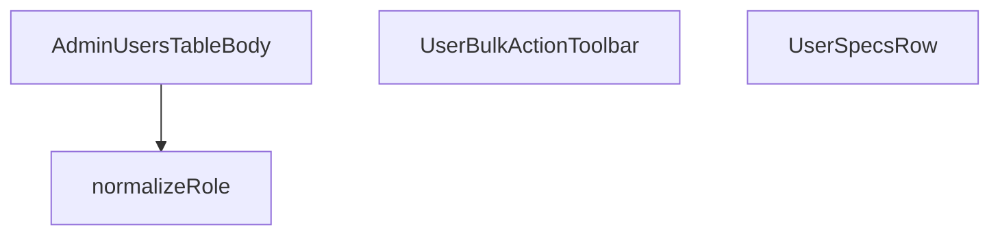

## Genel Bakış
Bu modül, admin panelindeki kullanıcı tablosunun satırlarını ve toplu seçim işlemlerini yöneten React bileşenlerini içerir. Kullanıcı verilerini安全 ve okunabilir bir şekilde sunarken, rol bilgisini standartlaştırmak için yardımcı bir işlev sağlar. Modül, AdminYetkisine göre tablo içeriğini dinamik olarak belirler ve kullanıcılara toplu işlem seçenekleri sunar.

## Fonksiyon Grupları
### Veri Hazırlama ve Yardımcı İşlevler
Kullanıcı rolü gibi ham verileri işleyen ve bileşenler tarafından kullanılacak standart formata dönüştüren yardımcı fonksiyonları kapsar.
- normalizeRole

### Kullanıcı Tablosu Gövdesi ve Satırları
Kullanıcı listesini tablo yapısında satır satır gösteren ana bileşen ve onun alt bileşenlerini oluşturur.
- AdminUsersTableBody, UserSpecsRow

### Toplu İşlem Araç Çubuğu
Seçili kullanıcılar için toplu rol değişimi ve seçim temizleme gibi işlemleri yöneten etkileşimli araç çubuğu bileşenidir.
- UserBulkActionToolbar

---

## AXIOMS – Mimari Varsayımlar

Bu modül, admin paneli kullanıcı tablosu ve rol yönetimi için UI bileşenleri sunar. Aşağıda modülün doğru çalışması için gerekli mimari varsayımlar listelenmiştir.

---

**[Aksiyom 1]:** Eğer `normalizeRole` fonksiyonu `null` veya `undefined` değer alırsa, geçerli bir (küçük harf formatında) rol dizgesi döndürür; aksi takdirde bileşenlerde rol gösterimi hata verir.

**[Aksiyom 2]:** Eğer `normalizeRole` fonksiyonu geçersiz veya tanımsız bir rol dizgesi alırsa, tanımlı bir varsayılan rol değerine eşlenir; aksi takdirde `ROLE_BUTTON_ICON` ve `ROLE_BUTTON_TONE` nesnelerinde eşleşme bulunamaz ve render bozulur.

**[Aksiyom 3]:** Eğer `AdminUsersTableBody` bileşeni `isAdmin` prop'u `false` veya `undefined` olarak alırsa, admin Yetkilendirme gerektiren alanlar (örn. toplu işlem araç çubuğu) gösterilmez; aksi takdirde yetkisiz kullanıcı arayüz bileşenlerine erişir.

**[Aksiyom 4]:** Eğer `UserBulkActionToolbar` bileşeni `selectedCount` parametresi `0` veya negatif bir değer olarak verilirse, toplu rol değiştirme ve seçim temizleme işlemleri işlevsel olmaz.

**[Aksiyom 5]:** Eğer `onRoleChange` veya `onClearSelection` callback'leri `UserBulkActionToolbar`'a tanımlanmamışsa (undefined/missing), kullanıcı rol değişikliği yapamaz veya seçim temizleyemez; aksi takdirde interaction hata fırlatır.

**[Aksiyom 6]:** Eğer `UserSpecsRow` bileşeni `userRow` prop'u olmadan çağrılırsa, kullanıcının profil bilgileri render edilemez; bileşen geçerli bir `userRow` objesi bekler.

**[Aksiyom 7]:** Eğer `ROLE_BUTTON_ICON` sabit nesnesi tanımsızsa veya ilgili rol anahtarını içermiyorsa, rol butonlarında ikon gösterilmez; benzer şekilde `ROLE_BUTTON_TONE` tanımsızsa buton renklendirmesi uygulanmaz.

---

## FONKSİYON DETAYLARI

### normalizeRole
**Ne yapar**: Ham rol değerini (null, undefined veya boş dize) standart bir formata dönüştürerek geçerli bir rol dizesi döndürür. Geçersiz veya eksik girişler için varsayılan 'user' rolünü atar.

**Nasıl yapar**: Fonksiyon, input olarak aldığı `raw` değerinin varlığını ve uzunluğunu kontrol eder. Eğer `raw` truthy (null veya undefined değilse) ve uzunluğu sıfırdan büyükse, olduğu gibi döndürülür. Aksi takdirde, varsayılan değer olarak 'user' dizesi döndürülür. Bu, uygulama genelinde tutarlı rol formatı sağlar ve eksik veri durumlarını güvenli bir şekilde işler.

**Parametreler**:
- raw: string | null | undefined — Normalize edilecek ham rol değeri. null, undefined veya boş bir dize olabilir.

**Dönüş**: string — Normalize edilmiş rol dizesi. Girdi geçerliyse o değer, değilse 'user' döndürülür.

### UserSpecsRow
**Ne yapar**: Bu bileşen, bir kullanıcının temel bilgilerini (örneğin avatar, ad, e-posta) tek bir tablo satırında görsel olarak sunmak için tasarlanmış bir React bileşenidir. Kullanıcı listesi görünümünde her bir kullanıcıyı temsil eden satırı oluşturma görevini üstlenir.
**Nasıl yapar**: Fonksiyonel bir React bileşeni (`React.FC`) olarak tanımlanmıştır. `userRow` adında bir prop alır ve bu prop'un içindeki verileri (ad, e-posta, avatar vb.) kullanarak JSX ile bir satır yapısı döndürür. Bileşenin iç mantığı, gelen veriyi formatlayıp sunmak üzerine kuruludur.
**Parametreler**:
- `userRow`: `UserSpecsRowProps` - Bileşene iletilen, kullanıcının tüm bilgilerini (ad, e-posta, avatar yolu, benzersiz ID vb.) içeren bir nesne. Bileşen bu verileri kullanarak satırı render eder.
**Dönüş**: `React.FC<UserSpecsRowProps>` - Bu, `UserSpecsRow` prop'larını alan ve React Element (`JSX.Element`) döndüren fonksiyonel bir React bileşeni olduğunu belirtir. Dönüş tipi doğrudan bileşenin kendisidir.

### UserBulkActionToolbar
**Ne yapar**: Bu bileşen, kullanıcı listesindeki birden fazla kullanıcının (seçili olanlar) toplu olarak değiştirilebilir eylemleri (örneğin rol güncelleme) gerçekleştirmek için üst kısımda yer alan bir araç çubuğu (toolbar) oluşturur.
**Nasıl yapar**: Fonksiyonel bir React bileşeni olarak tanımlanmıştır. Seçili kullanıcı sayısını (`selectedCount`), bir rol değişikliği eylemini tetikleyecek bir callback fonksiyonunu (`onRoleChange`) ve seçimi temizleyecek bir callback fonksiyonunu (`onClearSelection`) prop olarak alır. Bu prop'ları kullanarak, kullanıcının toplu işlem yapmasına olanak tanıyan bir arayüz (butonlar, seçim sayısı göstergesi vb.) render eder.
**Parametreler**:
- `selectedCount`: `number` - O an seçili olan toplam kullanıcı sayısını tutar. Bu değer, araç çubuğunda gösterilecek "X kullanıcı seçildi" bilgisi veya butonların aktif/pasif durumu için kullanılır.
- `onRoleChange`: `(newRole: string) => void` - Seçili tüm kullanıcıların rolünü güncellemek istendiğinde çağrılacak geri çağırım (callback) fonksiyonu. Parametre olarak yeni rol bilgisini (`string`) alır.
- `onClearSelection`: `() => void` - Tüm seçimlerin kaldırılması (seçimin sıfırlanması) istendiğinde çağrılacak geri çağırım fonksiyonu. Parametre almaz.
**Dönüş**: `React.FC<UserBulkActionToolbarProps>` - Bu, `UserBulkActionToolbar` prop'larını alan ve React Element döndüren fonksiyonel bir React bileşeni olduğunu belirtir. Dönüş tipi doğrudan bileşenin kendisidir.

### AdminUsersTableBody
**Ne yapar**: Admin kullanıcılar tablosunun gövde (tbody) bölümünü render eden bir React fonksiyonel bileşenidir. Bileşen, kullanıcının admin olup olmadığını belirleyen bir prop alır ve tablonun satırlarını buna göre oluşturur.

**Nasıl yapar**: Bu bir React fonksiyonel bileşenidir. Fonksiyon, `{ isAdmin }` destructuring ile prop'ları alır. Fonksiyonun dönüş tipi `React.FC<{ isAdmin: boolean }>` olarak belirtilmiştir; bu da fonksiyonun bir React Functional Component olduğunu ve `isAdmin` adında boolean bir prop aldığını ifade eder. Bileşen, `isAdmin` prop'una bağlı olarak tablonun içeriğini veya yapısını dinamik olarak belirleyen JSX kodunu döndürür.

**Parametreler**:
- isAdmin: boolean — Kullanıcının admin yetkisine sahip olup olmadığını belirten bayrak. true ise admin, false ise normal kullanıcı视图。

**Dönüş**: React.FC<{ isAdmin: boolean }> — React Functional Component. Bileşen, `isAdmin` boolean prop'unu kabul eden ve JSX döndüren bir React bileşenidir.

---

## İTHALATLAR (IMPORTS)
- import: ../../components/admin/AdminEmptyState::AdminEmptyState
- import: ../../components/admin/AdminToolbar::AdminToolbar
- import: ../../components/admin/ExportMenu::ExportMenu
- import: ../../components/admin/data-table/DataTableKit::DataTableKit
- import: ../../components/admin/data-table/types::type { AdminColumn }
- import: ../../components/admin/overlay/ConfirmProvider::useConfirm
- import: ../../config/admin::listAdminUsers
- import: ../../config/admin::setUserAdminRole
- import: ../../hooks/useAdminTable::type FetchParams
- import: ../../hooks/useAdminTable::type FetchResult
- import: ../../hooks/useAdminTable::useAdminTable
- import: ../../hooks/useAuth::useAuth
- import: ../../hooks/useRole::useRole
- import: ../../i18n/I18nProvider::useI18n
- import: ../../i18n/datetime::formatDate
- import: ../../lib/ensureSessionFresh::ensureSessionFresh
- import: ../../types/database.types::type { Database }
- import: @/lib/admin/mutateWithAudit::AdminPermissionError
- import: @/lib/admin/mutateWithAudit::mutateWithAudit
- import: @/lib/supabase/client::supabaseBrowserClient
- import: @supabase/supabase-js::type { SupabaseClient }
- import: react::React
- import: react::useCallback
- import: react::useEffect
- import: react::useMemo
- import: react::useRef
- import: react::useState
- import: sonner::toast

---

## INTERFACES

### UserRow
- `id: string`
- `email?: string`
- `full_name?: string`
- `role: string`
- `created_at: string`

### ProfileLite
RPC profil satırı (full_name zenginleştirmesi için)
- `id: string`
- `full_name?: string | null`

### AllProfileRow
- `id: string`
- `role?: string | null`
- `created_at: string`
- `full_name?: string | null`

### UserSpecsRowProps
- `userRow: UserRow`

### UserBulkActionToolbarProps
- `selectedCount: number`
- `onRoleChange: (role: UserRoleCode) => void`
- `onClearSelection: () => void`

---

## TYPE ALIASES

### UserRoleCode
```typescript
type UserRoleCode = 'user' | 'admin' | 'super_admin' | 'warehouse' | 'sales' | 'viewer'
```

### UsersTab
```typescript
type UsersTab = 'admins' | 'all'
```

---

## SABİTLER
- **ROLE_BUTTON_ICON** (object) — `{
  super_admin: <Crown size={14} />,
  admin: <Shield size={14} />,
  wareho...`
- **ROLE_BUTTON_TONE** (object) — `{
  super_admin: 'text-amber-500 hover:bg-amber-500/10 hover:border-amber-500...`

---

## AST POINTERS

### [N1_NASIL] AST Pointer: `src/views/admin/AdminUsersTableBody.tsx`::normalizeRole
- **params**: `raw` (string | null | undefined) — ham rol değeri, null veya undefined olabilir
- **ic_degiskenler**: yok
- **Dönüş**: `string` — raw geçerliyse aynen döner, değilse `'user'`

---

### [N2_NASIL] AST Pointer: `src/views/admin/AdminUsersTableBody.tsx`::UserSpecsRow
- **params**: `{ userRow }` — kullanıcının satır verisi (id, full_name vb. içerir)
- **ic_degiskenler**:
  - `t` — `useI18n()` hook'undan gelen çeviri fonksiyonu
  - `profile` — `useState` ile tutulan user_profiles verisi (phone, organization_id, updated_at); varsayılan `null`
  - `setProfile` — profile state setter'ı
- **Dönüş**: `React.FC<UserSpecsRowProps>` — kullanıcı detay grid'ini render eder

---

### [N2a_NASIL] AST Pointer: `src/views/admin/AdminUsersTableBody.tsx`::UserSpecsRow/useEffect_callback
- **params**: yok
- **ic_degiskenler**:
  - `active` — `let` ile tanımlı temizlik flag'i; component unmount olduktan sonra state güncellemesini engeller
- **Dönüş**: cleanup fonksiyonu (active'i false yapar)

---

### [N2b_NASIL] AST Pointer: `src/views/admin/AdminUsersTableBody.tsx`::UserSpecsRow/useEffect_async_IIFE
- **params**: yok
- **ic_degiskenler**:
  - `data` — Supabase'den dönen `user_profiles` satırı (phone, organization_id, updated_at); `.maybeSingle()` ile tek satır
- **Erişilen dış değişkenler**: `active`, `userRow.id`, `supabaseBrowserClient`, `setProfile`
- **API**: `supabaseBrowserClient.from('user_profiles').select('phone, organization_id, updated_at').eq('id', userRow.id).maybeSingle()`
- **Dönüş**: `void`

---

### [N2c_NASIL] AST Pointer: `src/views/admin/AdminUsersTableBody.tsx`::UserSpecsRow/useEffect_cleanup
- **params**: yok
- **ic_degiskenler**: yok
- **Erişilen dış değişkenler**: `active` (false'a set edilir)
- **Dönüş**: `void`

---

### [N3_NASIL] AST Pointer: `src/views/admin/AdminUsersTableBody.tsx`::UserBulkActionToolbar
- **params**: `{ selectedCount, onRoleChange, onClearSelection }` — seçili satır sayısı, rol değiştirme callback'i, seçimi temizleme callback'i
- **ic_degiskenler**:
  - `t` — `useI18n()` hook'undan çeviri fonksiyonu
  - `showRolePanel` — `useState(false)` — rol seçme panelinin açık/kapalı durumu
- **Dönüş**: `React.FC` — `selectedCount === 0` ise `null`, değilse sticky toolbar JSX'i

---

### [N3a_NASIL] AST Pointer: `src/views/admin/AdminUsersTableBody.tsx`::UserBulkActionToolbar/roleButton_render
- **params**: `targetRole` — hedef rol kodu (string)
- **ic_degiskenler**: yok
- **Erişilen dış değişkenler**: `onRoleChange`, `setShowRolePanel`, `ROLE_BUTTON_ICON`, `t`
- **Dönüş**: JSX button element

---

### [N3b_NASIL] AST Pointer: `src/views/admin/AdminUsersTableBody.tsx`::UserBulkActionToolbar/roleButtonClick
- **params**: yok
- **ic_degiskenler**: yok
- **Erişilen dış değişkenler**: `targetRole` (closure'dan), `onRoleChange`, `setShowRolePanel`
- **Dönüş**: `void` — `onRoleChange(targetRole)` çağırır, paneli kapatır

---

### [N4_NASIL] AST Pointer: `src/views/admin/AdminUsersTableBody.tsx`::fetchData
- **params**: `supabase` (SupabaseClient<Database>), `_params` (FetchParams) — tablodan veri çekme
- **ic_degiskenler**:
  - `data` — `tabRef.current === 'admins'` dalında `listAdminUsers()` sonucu; tüm admin kullanıcıların listesi
  - `ids` — admin kullanıcıların ID dizisi (`data.map(u => u.id)`)
  - `profiles` — `ProfileLite[]` tipinde user_profiles verisi (id, full_name); başlangıçta boş dizi
  - `profileData` — Supabase'den dönen user_profiles satırları (admin dalında `.in('id', ids)` sorgusu)
  - `rows` — `UserRow[]` dizisi, her iki dalda da dönüştürülen nihai satırlar
  - `error` — `'all'` dalında Supabase sorgu hatası
- **Erişilen dış değişkenler**: `tabRef`, `ensureSessionFresh`, `listAdminUsers`, `normalizeRole`
- **API**: `supabase.from('user_profiles').select('id, full_name').in('id', ids)` (admin dalı); `supabase.from('user_profiles').select('id, role, created_at, full_name')` (all dalı)
- **Dönüş**: `Promise<FetchResult<UserRow>>` — `{ rows, totalMatched: rows.length }`

---

### [N4a_NASIL] AST Pointer: `src/views/admin/AdminUsersTableBody.tsx`::fetchData/adminUser_map
- **params**: `u` — tek bir admin kullanıcısı nesnesi (id, email, full_name, role, created_at)
- **ic_degiskenler**: yok (expression-bodied arrow)
- **Erişilen dış değişkenler**: `profiles` (closure'dan, `full_name` eşleştirmesi için kullanılır)
- **Dönüş**: `UserRow` nesnesi — id, email, full_name (profile'dan eşleştirilmiş), role (normalizeRole ile), created_at

---

### [N4b_NASIL] AST Pointer: `src/views/admin/AdminUsersTableBody.tsx`::fetchData/allUser_map
- **params**: `p` — `AllProfileRow` tipinde user_profiles satırı (id, role, created_at, full_name)
- **ic_degiskenler**: yok
- **Erişilen dış değişkenler**: `normalizeRole`
- **Dönüş**: `UserRow` nesnesi — id, email: undefined, full_name, role, created_at

---

### [N5_NASIL] AST Pointer: `src/views/admin/AdminUsersTableBody.tsx`::switchTab
- **params**: `next` (UsersTab) — geçilecek sekme kodu
- **ic_degiskenler**: yok
- **Erişilen dış değişkenler**: `tabRef` (mevcut sekme kontrolü ve güncelleme), `setActiveTab` (state setter), `table.reload` (tabloyu yeniden yükleme)
- **Dönüş**: `void` — aynı sekme ise noop, değilse tab Ref'i günceller, state'i set eder, tabloyu reload eder

---

### [N6_NASIL] AST Pointer: `src/views/admin/AdminUsersTableBody.tsx`::handleRoleChange
- **params**: `row` (UserRow) — hedef kullanıcı satırı, `newRole` (UserRoleCode) — atanacak yeni rol
- **ic_degiskenler**: yok (explicit değişken bildirimi yok; `e` catch bloğunda implicit)
- **Erişilen dış değişkenler**:
  - `hasWriteAccess` — yazma izni flag'i, false ise toast.error ile izin hatası gösterir
  - `toast` — sonner toast bildirim fonksiyonu
  - `t` — çeviri fonksiyonu
  - `setUpdatingRole` — güncellenen rolün ID'sini set eder (busy state)
  - `mutateWithAudit` — audit log ile birlikte veri değiştirme fonksiyonu
  - `supabaseBrowserClient` — Supabase istemcisi
  - `table` — DataTable instance'ı, `table.reload()` ile yenilenir
  - `setUserAdminRole` — gerçek rol güncelleme API çağrısı
  - `AdminPermissionError` — izin hatası sınıfı (catch'de kontrol edilir)
- **API**: `mutateWithAudit(supabaseBrowserClient, {...})` → içerde `setUserAdminRole(row.id, newRole)`
- **Dönüş**: `void` (Promise<void>) — başarılıysa toast.success + reload, hata ise toast.error

---

### [N6a_NASIL] AST Pointer: `src/views/admin/AdminUsersTableBody.tsx`::handleRoleChange/mutateFn
- **params**: yok
- **ic_degiskenler**:
  - `success` — `setUserAdminRole` çağrısının sonucu (boolean); false ise hata fırlatır
- **Erişilen dış değişkenler**: `row.id`, `newRole`
- **API**: `setUserAdminRole(row.id, newRole)`
- **Dönüş**: `void` — success false ise `throw new Error('role_update_failed')`

---

### [N7_NASIL] AST Pointer: `src/views/admin/AdminUsersTableBody.tsx`::handleBulkRoleChange
- **params**: `newRole` (UserRoleCode) — toplu olarak atanacak rol
- **ic_degiskenler**:
  - `ids` — `table.selection.selectedIds` — seçili tüm kullanıcının ID dizisi
  - `ok` — `confirm()` sonucu (boolean); kullanıcı onayladı mı
- **Erişilen dış değişkenler**:
  - `hasWriteAccess` — yazma izni flag'i
  - `toast` — bildirim fonksiyonu
  - `t` — çeviri fonksiyonu
  - `table` — DataTable instance; `table.selection.clear()`, `table.reload()` kullanılır
  - `confirm` — onay dialog fonksiyonu
  - `mutateWithAudit` — audit log'lu mutate
  - `supabaseBrowserClient` — Supabase istemcisi
  - `setUserAdminRole` — rol güncelleme API'si
  - `AdminPermissionError` — izin hatası sınıfı
- **API**: `mutateWithAudit(...)` → içerde `Promise.all(ids.map(id => setUserAdminRole(id, newRole)))`
- **Dönüş**: `void` — başarılıysa selection.clear + reload + toast.success

---

### [N7a_NASIL] AST Pointer: `src/views/admin/AdminUsersTableBody.tsx`::handleBulkRoleChange/mutateFn
- **params**: yok
- **ic_degiskenler**:
  - `results` — `Promise.all` sonucu; her bir `setUserAdminRole` çağrısının boolean sonucu dizisi
  - `failedIdx` — `results.findIndex(success => !success)` ile bulunan başarısız index; -1 ise tümü başarılı
- **Erişilen dış değişkenler**: `ids` (seçili ID'ler), `setUserAdminRole`, `newRole`
- **API**: `Promise.all(ids.map(id => setUserAdminRole(id, newRole)))`
- **Dönüş**: `void` — başarısız varsa `throw new Error('role_update_failed_for_${ids[failedIdx]}')`

---

### [N8_NASIL] AST Pointer: `src/views/admin/AdminUsersTableBody.tsx`::handleExport
- **params**: yok
- **ic_degiskenler**:
  - `rows` — `table.fetchAllForExport()` sonucu; tüm satırlar (id, email, full_name, role, created_at)
  - `cols` — CSV sütun adları dizisi: `['id', 'email', 'full_name', 'role', 'created_at']`
  - `header` — sütun adlarının comma-joined hali
  - `lines` — her satırın CSV formatına dönüştürülmüş hali (map ile)
  - `csv` — BOM (`\uFEFF`) + header + lines, tam CSV içeriği
  - `blob` — CSV string'inden oluşturulmuş Blob (text/csv;charset=utf-8)
  - `url` — `URL.createObjectURL(blob)` ile oluşturulan geçici dosya URL'i
  - `a` — `document.createElement('a')` ile oluşturulan geçici link elementi
- **Erişilen dış değişkenler**: `table.fetchAllForExport`
- **Yan etkiler**: tarayıcıda CSV dosya indirme tetikler
- **Dönüş**: `void`

---

### [N8a_NASIL] AST Pointer: `src/views/admin/AdminUsersTableBody.tsx`::handleExport/rowMap
- **params**: `r` — tek bir UserRow satırı
- **ic_degiskenler**: yok
- **Dönüş**: `string` — CSV satırı (virgülle ayrılmış, email/full_name tırnak içine alınmış, escape edilmiş)

---

### [N9_NASIL] AST Pointer: `src/views/admin/AdminUsersTableBody.tsx`::getRoleIcon
- **params**: `roleCode` (string) — rol kodu
- **ic_degiskenler**: yok
- **Erişilen dış değişkenler**: `Crown`, `Shield`, `ShieldCheck`, `Users` (lucide-react icon bileşenleri)
- **Dönüş**: JSX element — `'super_admin'` → Crown (purple), `'admin'` → Shield (indigo), `'warehouse'/'sales'` → ShieldCheck (cyan), default → Users (slate)

---

### [N10_NASIL] AST Pointer: `src/views/admin/AdminUsersTableBody.tsx`::UserAvatar
- **params**: `{ name, email }` — name?: string, email?: string; kullanıcının adı veya email'i
- **ic_degiskenler**:
  - `initial` — `(name || email || '?').charAt(0).toUpperCase()` — avatar içinde gösterilen ilk harf
- **Dönüş**: JSX element — gradient arka planlı, ilk harfi gösteren daire

---

### [N11_NASIL] AST Pointer: `src/views/admin/AdminUsersTableBody.tsx`::RoleButton
- **params**: `{ row, target, disabled }` — row: UserRow, target: UserRoleCode (hedef rol), disabled: boolean
- **ic_degiskenler**: yok
- **Erişilen dış değişkenler**:
  - `handleRoleChange` — tek satır rol değiştirme fonksiyonu
  - `ROLE_BUTTON_TONE` — rol bazlı renk/tone CSS sınıfı sözlüğü
  - `ROLE_BUTTON_ICON` — rol bazlı icon sözlüğü
  - `t` — çeviri fonksiyonu (title ve aria-label için)
- **Dönüş**: JSX element — rol değiştirme butonu, disabled state'e göre tıklanabilirlik

---

### [N12_NASIL] AST Pointer: `src/views/admin/AdminUsersTableBody.tsx`::columns_definition
- **params**: yok
- **ic_degiskenler**: yok (array literal return)
- **Erişilen dış değişkenler**:
  - `t` — çeviri fonksiyonu (tüm header/cell metinleri için)
  - `UserAvatar` — avatar bileşeni (user sütunu için)
  - `getRoleIcon` — rol ikonu getiren fonksiyon (role sütunu için)
  - `formatDate` — tarih formatlama fonksiyonu (created_at sütunu için)
  - `lang` — mevcut dil kodu ('tr' | 'en')
  - `RoleButton` — rol değiştirme butonu (actions sütunu için)
  - `role` — mevcut kullanıcının rolü (super_admin/admin kontrolü)
  - `user` — mevcut kullanıcı nesnesi (self-check için `user?.id`)
  - `updatingRole` — şu an güncellenen kullanıcının ID'si (busy state)
  - `hasWriteAccess` — yazma izni flag'i
- **Dönüş**: `AdminColumn[]` — 4 sütun: user, role, created_at, actions

---

### [N12a_NASIL] AST Pointer: `src/views/admin/AdminUsersTableBody.tsx`::columns/userCell
- **params**: `r` — UserRow satırı
- **ic_degiskenler**: yok
- **Erişilen dış değişkenler**: `UserAvatar`, `t`
- **Dönüş**: JSX — avatar + email (veya 'noEmail' fallback) + full_name

---

### [N12b_NASIL] AST Pointer: `src/views/admin/AdminUsersTableBody.tsx`::columns/roleCell
- **params**: `r` — UserRow satırı
- **ic_degiskenler**: yok
- **Erişilen dış değişkenler**: `getRoleIcon`, `t`
- **Dönüş**: JSX — rol ikonu + çevrilmiş rol adı, glass-stil badge

---

### [N12c_NASIL] AST Pointer: `src/views/admin/AdminUsersTableBody.tsx`::columns/created_atCell
- **params**: `r` — UserRow satırı
- **ic_degiskenler**: yok
- **Erişilen dış değişkenler**: `formatDate`, `lang`, `t`
- **Dönüş**: JSX — formatlanmış tarih + "Oluşturulma" etiketi

---

### [N12d_NASIL] AST Pointer: `src/views/admin/AdminUsersTableBody.tsx`::columns/actionsCell
- **params**: `r` — UserRow satırı
- **ic_degiskenler**:
  - `isActor` — `role === 'super_admin' || role === 'admin'` — mevcut kullanıcının aksiyon alabilirrolde olup olmadığı
  - `isSelf` — `r.id === user?.id` — satırın mevcut kullanıcıya ait olup olmadığı
  - `targetProtected` — `r.role === 'super_admin' && role !== 'super_admin'` — hedef süper_admin ise ve actor süper_admin değilse korumalı
  - `busy` — `updatingRole === r.id` — bu satırda şu an rol güncellemesi yapılıp yapılmadığı
- **Erişilen dış değişkenler**: `role`, `user`, `updatingRole`, `hasWriteAccess`, `RoleButton`
- **Dönüş**: JSX — mevcut rolün hedef role göre RoleButton'lar dizisi; süper_admin sadece süper_admin tarafından değiştirilebilir

---

### [N13_NASIL] AST Pointer: `src/views/admin/AdminUsersTableBody.tsx`::roleFilters_definition
- **params**: yok
- **ic_degiskenler**: yok (array.map return)
- **Erişilen dış değişkenler**:
  - `ROLE_KEYS` — tüm rol kodlarının dizisi
  - `t` — çeviri fonksiyonu
  - `activeRoles` — şu an filtrelenen aktif roller dizisi
  - `setFilter` — filtre state setter fonksiyonu
- **Dönüş**: filtre item dizisi — her rol için `{ key, label, active, onToggle }` nesneleri

---

### [N13a_NASIL] AST Pointer: `src/views/admin/AdminUsersTableBody.tsx`::roleFilters/mapItem
- **params**: `r` — tek bir rol kodu string'i
- **ic_degiskenler**: yok
- **Erişilen dış değişkenler**: `t`, `activeRoles`, `setFilter`
- **Dönüş**: `{ key: r, label, active: activeRoles.includes(r), onToggle }` nesnesi

---

### [N13b_NASIL] AST Pointer: `src/views/admin/AdminUsersTableBody.tsx`::roleFilters/onToggle
- **params**: yok
- **ic_degiskenler**:
  - `next` — güncellenmiş aktif roller dizisi; `r` zaten aktifse çıkarılmış, değilse eklenmiş hali
- **Erişilen dış değişkenler**: `activeRoles`, `r` (toggulanacak rol), `setFilter`
- **Dönüş**: `void` — `setFilter('role', next)` çağırarak filtre state'ini günceller

---


## MERMAID CALL GRAPH


## NODE ID STANDARD

  file: src\views\admin\AdminUsersTableBody.tsx
  function: src\views\admin\AdminUsersTableBody.tsx::normalizeRole
  function: src\views\admin\AdminUsersTableBody.tsx::UserSpecsRow
  function: src\views\admin\AdminUsersTableBody.tsx::UserBulkActionToolbar
  function: src\views\admin\AdminUsersTableBody.tsx::AdminUsersTableBody

---

## DISA AKTARILANLAR (EXPORTS)
  export: AdminUsersTableBody
  export: UserBulkActionToolbar
  export: UserSpecsRow
  export: normalizeRole

---

## STİL TOKENLERİ

### Arbitrary Değerler (token'a geçirilmemiş)
Yok — tüm stiller token'a geçirilmiş. ✅

### Kullanılan Token'lar (zaten token'a geçirilmiş)
- `rounded-hvac-2xl`, `rounded-hvac-lg`, `rounded-hvac-xl`, `shadow-glow-md`, `tracking-hvac-normal`, `tracking-hvac-relaxed`, `tracking-hvac-snug`

### Tailwind Sınıf Özeti
- **Renkler:** `bg-cyan-400`, `bg-cyan-400/5`, `bg-cyan-500/80`, `bg-gradient-to-br`, `bg-primary-navy`, `bg-red-500/10`, `bg-surface-deep`, `bg-white/20`, `bg-white/5`, `border-red-500/20`, `border-white/10`, `border-white/5`, `from-white/10`, `group-hover/spec:text-cyan-400/70`, `group-hover:bg-cyan-400/10`
- **Layout:** `absolute`, `bottom-4`, `bottom-full`, `flex`, `flex-1`, `flex-col`, `flex-wrap`, `from-white/10`, `gap-1.5`, `gap-2`, `gap-3`, `gap-4`, `gap-8`, `grid`, `grid-cols-1`
- **Varyant/Responsive:** `:`, `active:`, `disabled:`, `group-hover/item:`, `group-hover/spec:`, `group-hover:`, `hover:`, `lg:`, `md:`, `sm:` önekleri
- **Yardımcı Sınıflar:** `$`, `${ROLE_BUTTON_TONE[target]`, `-mr-48`, `-mt-48`, `:`, `===`, `active:scale-95`, `activeTab`, `admins`, `all`, `animate-slide-up`, `blur-120`, `border`, `break-all`, `disabled:cursor-not-allowed`