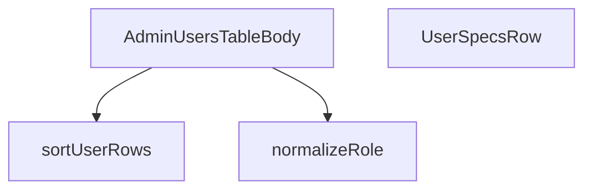

## Genel Bakış
Bu modül, admin panelindeki kullanıcılar tablosunun gövde kısmını oluşturan React bileşenlerini ve yardımcı fonksiyonları içerir. Kullanıcı satırlarının sıralanması, rol bilgilerinin normalize edilmesi ve her bir kullanıcının tablo satırı olarak görüntülenmesi bu modülün temel sorumluluklarıdır.

## Fonksiyon Grupları

### Yardımcı Fonksiyonlar
Kullanıcı rollerinin farklı formatlardaki ham değerlerini standart bir biçime dönüştürür ve kullanıcı satırlarının sıralama mantığını yönetir.
- normalizeRole, sortUserRows

### Bileşenler
Admin kullanıcılar tablosunun gövdesini ve her bir kullanıcıya ait satırı render eder. Ana bileşen, isAdmin prop'u aracılığıyla yetki kontrolü yapar ve sıralanmış kullanıcı listesini UserSpecsRow bileşenleriyle ekrana yansıtır.
- UserSpecsRow, AdminUsersTableBody

---

## AXIOMS – Mimari Varsayımlar

Bu modül, admin kullanıcı tablosunun gövdesini render etmek ve kullanıcı

---

## FONKSİYON DETAYLARI

### normalizeRole
**Ne yapar**: Verilen ham rol kodunu normalize eder. Eğer girdi null, undefined veya boş bir string ise varsayılan olarak 'user' değerini döndürür.
**Nasıl yapar**: Fonksiyon, `raw` parametresinin varlığını ve uzunluğunu kontrol eden basit bir koşul ifadesi kullanır. `raw` truthy (null, undefined veya boş string değil) ise ve uzunluğu sıfırdan büyükse bu değeri aynen döndürür; aksi halde 'user' string'ini döndürür.
**Parametreler**:
- raw: string | null | undefined — Normalize edilecek ham rol kodu. Null veya undefined olabilir.
**Dönüş**: string — Normalize edilmiş rol kodu. Girdi geçerli bir string ise o değer, değilse 'user' döndürülür.

### UserSpecsRow
**Ne yapar**: Belirli bir kullanıcı satırının verilerini görüntülemek için kullanılan bir React bileşenidir.
**Nasıl yapar**: Bileşen, bir `userRow` prop'u alır ve bu veriyi kullanarak kullanıcı bilgilerini gösteren bir JSX yapısı oluşturur. Bileşenin iç mantığı ve render ettiği spesifik alanlar verilen kaynakta belirtilmemiştir.
**Parametreler**:
- userRow: UserSpecsRowProps — Bileşenin görüntüleyeceği kullanıcı satırı verisini içeren nesne. `UserSpecsRowProps` tipinin yapısı verilen kaynakta tanımlanmamıştır.
**Dönüş**: React.FC<UserSpecsRowProps> — Kullanıcı satırını temsil eden bir React fonksiyonel bileşeni döndürür.

### AdminUsersTableBody
**Ne yapar**: Admin kullanıcılar tablosunun gövde kısmını oluşturan bir React bileşenidir.
**Nasıl yapar**: Bileşen, bir `isAdmin` prop'u alır ve bu bilgiye bağlı olarak tablo gövdesinin içeriğini veya davranışını şekillendirir. Bileşenin iç mantığı, hangi kullanıcı verilerini çektiği veya nasıl bir liste yapısı oluşturduğu verilen kaynakta belirtilmemiştir.
**Parametreler**:
- isAdmin: boolean — Mevcut kullanıcının yönetici olup olmadığını belirten bayrak. Bileşenin görünümünü veya erişim kontrolünü etkileyebilir.
**Dönüş**: React.FC<{ isAdmin: boolean }> — Admin kullanıcılar tablosunun gövdesini temsil eden bir React fonksiyonel bileşeni döndürür.

### sortUserRows
**Ne yapar**: Verilen kullanıcı satırları dizisini, belirtilen sıralama kriterine göre sıralar. `admins` veri dalı için istemci tarafı sıralama işlemini gerçekleştirir.
**Nasıl yapar**: Fonksiyon, sıralama anahtarını ve yönünü belirleyen bir `sort` nesnesi alır. Anahtar erişimi için bir switch ifadesi kullanır; bu, desteklenmeyen bir anahtar girilmesi durumunda varsayılan `created_at` alanına düşmeyi görünür kılar ve dinamik indekslemenin yasak olduğu proje kuralına uyar. Sıralama, `localeCompare` metodu ile Türkçe (`'tr') yerel ayarına göre yapılır ve sıralama yönüne (`asc` veya `desc`) bağlı olarak bir çarpan (`factor`) ile çarpılır. Orijinal diziyi değiştirmemek için önce bir kopyası oluşturulur.
**Parametreler**:
- rows: UserRow[] — Sıralanacak kullanıcı satırlarının dizisi.
- sort: { key: string; dir: 'asc' | 'desc' } | null | undefined — Sıralama kriteri. `key` sıralama alanını (örneğin 'full_name', 'role', 'email', 'created_at'), `dir` sıralama yönünü belirtir. Null veya undefined olabilir.
**Dönüş**: UserRow[] — Verilen sıralama kriterine göre sıralanmış yeni bir kullanıcı satırları dizisi döndürür. Orijinal dizi değiştirilmez.

---

## İTHALATLAR (IMPORTS)
- import: ../../components/admin/AdminEmptyState::AdminEmptyState
- import: ../../components/admin/AdminToolbar::AdminToolbar
- import: ../../components/admin/ExportMenu::ExportMenu
- import: ../../components/admin/data-table/BulkBar::BulkBar
- import: ../../components/admin/data-table/BulkBar::type BulkAction
- import: ../../components/admin/data-table/BulkRolePanel::BulkRolePanel
- import: ../../components/admin/data-table/DataTableKit::DataTableKit
- import: ../../components/admin/data-table/types::type { AdminColumn }
- import: ../../components/admin/overlay/ConfirmProvider::useConfirm
- import: ../../config/admin::listAdminUsers
- import: ../../config/admin::setUserAdminRole
- import: ../../hooks/useAdminTable::type FetchParams
- import: ../../hooks/useAdminTable::type FetchResult
- import: ../../hooks/useAdminTable::useAdminTable
- import: ../../hooks/useAuth::useAuth
- import: ../../hooks/useRole::useRole
- import: ../../i18n/I18nProvider::useI18n
- import: ../../i18n/datetime::formatDate
- import: ../../lib/ensureSessionFresh::ensureSessionFresh
- import: ../../types/database.types::type { Database }
- import: ../../utils/adminUi::adminTableActionClass
- import: @/lib/admin/mutateWithAudit::AdminPermissionError
- import: @/lib/admin/mutateWithAudit::mutateWithAudit
- import: @/lib/supabase/client::supabaseBrowserClient
- import: @supabase/supabase-js::type { SupabaseClient }
- import: next/link::Link
- import: next::type { Route }
- import: react::React
- import: react::useCallback
- import: react::useEffect
- import: react::useMemo
- import: react::useRef
- import: react::useState
- import: sonner::toast

---

## INTERFACES

### UserRow
- `id: string`
- `email?: string`
- `full_name?: string`
- `role: string`
- `created_at: string`

### ProfileLite
RPC profil satırı (full_name zenginleştirmesi için)
- `id: string`
- `full_name?: string | null`

### AllProfileRow
- `id: string`
- `role?: string | null`
- `created_at: string`
- `full_name?: string | null`

### UserSpecsRowProps
- `userRow: UserRow`

---

## TYPE ALIASES

### UserRoleCode
```typescript
type UserRoleCode = 'user' | 'admin' | 'super_admin' | 'warehouse' | 'sales' | 'viewer'
```

### UsersTab
```typescript
type UsersTab = 'admins' | 'all'
```

---

## SABİTLER
- **ROLE_BUTTON_ICON** (object) — `{
  super_admin: <Crown size={14} />,
  admin: <Shield size={14} />,
  war...`
- **ROLE_BUTTON_TONE** (object) — `{
  super_admin: 'text-admin-warning hover:bg-admin-warning-weak hover:borde...`

---

## AST POINTERS

### [N1_NASIL] AST Pointer: AdminUsersTableBody.tsx::normalizeRole
- **params**: `raw` (string | null | undefined)
- **ic_degiskenler**: yok
- **Dönüş**: string — `raw` doluysa `raw`, boşsa `'user'`

### [N2_NASIL] AST Pointer: AdminUsersTableBody.tsx::UserSpecsRow
- **params**: `userRow` — satır verisi (id, full_name vb. alanlar içerir)
- **ic_degiskenler**:
  - `t` — `useI18n()` ile alınan çeviri fonksiyonu
  - `profile` — useState ile tutulan nesne; `phone`, `organization_id`, `updated_at` alanlarını içerir, başlangıçta `null`
  - `setProfile` — `profile` state'ini güncelleyen setter fonksiyonu
  - `active` — useEffect cleanup bayrağı; bileşen unmount olduğunda `false` yapılır, async işlem sonucunun işlenip işlenmeyeceğini denetler
  - `data` — `supabaseBrowserClient` üzerinden `user_profiles` tablosundan çekilen `phone`, `organization_id`, `updated_at` alanlarını içeren nesne; `maybeSingle()` sonucu
- **Dönüş**: JSX — kullanıcının profil detaylarını (id, full_name, phone, organization_id) kartlar halinde gösteren bileşen

### [N3_NASIL] AST Pointer: AdminUsersTableBody.tsx::sortUserRows
- **params**: `rows` (UserRow[]), `sort` ({ key: string; dir: 'asc' | 'desc' } | null | undefined)
- **ic_degiskenler**:
  - `key` — sıralama anahtarı; `sort?.key` varsa onu kullanır, yoksa `'created_at'` varsayılır
  - `factor` — sıralama yönü katsayısı; `'asc'` ise `1`, diğer durumda `-1`
  - `valueOf` — `(row: UserRow) => string` fonksiyonu; `key` değerine göre satırdan sıralama metni çıkarır: `'full_name'` → `row.full_name ?? ''`, `'role'` → `row.role`, `'email'` → `row.email ?? ''`, diğer → `row.created_at`
- **Dönüş**: UserRow[] — sıralanmış yeni dizi (orijinal diziyi değiştirmez, spread ile kopyalar)

### [N4_NASIL] AST Pointer: AdminUsersTableBody.tsx::AdminUsersTableBody
- **params**: `isAdmin` (boolean)
- **ic_degiskenler**:
  - `t` — `useI18n()` ile alınan çeviri fonksiyonu
  - `lang` — `useI18n()` ile alınan dil kodu
  - `role` — mevcut kullanıcının rolü (UserRoleCode)
  - `user` — mevcut kullanıcı nesnesi (id vb. içerir)
  - `hasWriteAccess` — yazma yetkisi olup olmadığını gösteren boolean
  - `confirm` — onay dialogu açan fonksiyon
  - `tabRef` — useRef ile tutulan aktif sekme referansı ('admins' | 'all')
  - `activeTab` — useState ile tutulan aktif sekme durumu
  - `setActiveTab` — aktif sekme state'ini güncelleyen setter
  - `updatingRole` — useState ile tutulan, rolü güncellenen kullanıcının id'si (veya null)
  - `setUpdatingRole` — updatingRole state'ini güncelleyen setter
  - `activeRoles` — filtrelenmiş aktif roller dizisi
  - `setFilter` — filtre güncelleyen fonksiyon
  - `table` — tablo nesnesi; `reload()`, `selection.selectedIds`, `selection.clear()`, `fetchAllForExport()` metotlarını içerir
  - `supabaseBrowserClient` — Supabase istemcisi
  - `ensureSessionFresh` — oturumu tazeleyen async fonksiyon
  - `listAdminUsers` — admin kullanıcı listesini getiren async fonksiyon
  - `setUserAdminRole` — kullanıcı rolünü güncelleyen async fonksiyon
  - `formatDate` — tarih biçimlendirme fonksiyonu
  - `adminTableActionClass` — tablo aksiyon butonları için CSS sınıfı
  - `ROLE_KEYS` — tüm rol anahtarlarını içeren sabit dizi
- **Dönüş**: JSX — admin kullanıcılar tablosunu render eden bileşen

### [N5_NASIL] AST Pointer: AdminUsersTableBody.tsx::fetchData (AdminUsersTableBody içinde)
- **params**: `supabase` (SupabaseClient<Database>), `_params` (FetchParams)
- **ic_degiskenler**:
  - `data` — `listAdminUsers()` sonucu (admins sekmesi) veya `supabase.from('user_profiles').select(...).range(...)` sonucu (all sekmesi)
  - `ids` — admin kullanıcı id'lerinden oluşan dizi
  - `profiles` — `user_profiles` tablosundan çekilen `id`, `full_name` alanlarını içeren ProfileLite dizisi
  - `profileData` — `supabase.from('user_profiles').select('id, full_name').in('id', ids)` sorgusunun `data` sonucu
  - `allRows` — admin sekmesinde `data.map(...)` ile oluşturulan UserRow dizisi
  - `term` — arama terimi; `_params.query.trim().toLocaleLowerCase('tr')` (admins) veya `_params.query.trim()` (all)
  - `filtered` — `term` doluysa `allRows` üzerinde full_name ve email alanlarında filtrelenmiş dizi
  - `sorted` — `sortUserRows(filtered, _params.sort)` sonucu sıralanmış dizi
  - `offset` — sayfa ofseti; `(_params.page - 1) * _params.pageSize`
  - `sortColumn` — `USER_SORT_COLUMNS[_params.sort?.key ?? ''] ?? 'created_at'`
  - `allQuery` — `supabase.from('user_profiles').select(...)` sorgu nesnesi; `.order()`, `.ilike()`, `.range()` zinciri
  - `error` — sorgu hatası
  - `count` — `count: 'exact'` ile gelen toplam kayıt sayısı
  - `emailByeId` — `Map<string, string>`; id → email eşlemesi
  - `emailsComplete` — e-posta eşlemesinin tamamlanıp tamamlanmadığını gösteren boolean
  - `rpcRows` — `supabase.rpc('admin_list_all_users')` sonucu
  - `rpcError` — RPC hatası
  - `list` — RPC'den dönen `{ id, email }` dizisi
  - `u` — list içindeki her bir kullanıcı nesnesi (döngü)
  - `rows` — nihai UserRow dizisi; `data.map(...)` ile oluşturulur
  - `p` — map içindeki her bir profil nesnesi
- **Dönüş**: Promise<FetchResult<UserRow>> — `{ rows: UserRow[], totalMatched: number }`

### [N6_NASIL] AST Pointer: AdminUsersTableBody.tsx::handleTabChange (AdminUsersTableBody içinde)
- **params**: `next` (UsersTab)
- **ic_degiskenler**: yok
- **Dönüş**: yok — `tabRef.current`'i günceller, `setActiveTab(next)` çağırır, `table.reload()` tetikler

### [N7_NASIL] AST Pointer: AdminUsersTableBody.tsx::handleRoleChange (AdminUsersTableBody içinde)
- **params**: `row` (UserRow), `newRole` (UserRoleCode)
- **ic_degiskenler**:
  - `touchesSuperAdmin` — `newRole === 'super_admin' || row.role === 'super_admin'` koşulu; onay dialogu tonunu belirler
  - `ok` — `confirm()` dialogundan dönen boolean
  - `success` — `setUserAdminRole(row.id, newRole)` sonucu
  - `e` — catch bloğundaki hata nesnesi
- **Dönüş**: Promise<void> — yan etkiler: `setUserRole` çağırır, toast gösterir, `table.reload()` tetikler

### [N8_NASIL] AST Pointer: AdminUsersTableBody.tsx::bulkRoleChange (AdminUsersTableBody içinde)
- **params**: `newRole` (UserRoleCode)
- **ic_degiskenler**:
  - `ids` — `table.selection.selectedIds`; seçili kullanıcı id'leri dizisi
  - `ok` — `confirm()` dialogundan dönen boolean
  - `results` — `Promise.all(ids.map(id => setUserAdminRole(id, newRole)))` sonucu; boolean dizisi
  - `failedIdx` — `results.findIndex(success => !success)`; başarısız olan ilk indeks (-1 ise tümü başarılı)
  - `e` — catch bloğundaki hata nesnesi
- **Dönüş**: Promise<void> — yan etkiler: toplu rol değişikliği yapar, seçimi temizler, tabloyu yeniden yükler, toast gösterir

### [N9_NASIL] AST Pointer: AdminUsersTableBody.tsx::getBulkActions (AdminUsersTableBody içinde)
- **params**: yok
- **ic_degiskenler**:
  - `close` — panel kapatma fonksiyonu; `BulkRolePanel`'e `onClose` prop'u olarak geçilir
- **Dönüş**: dizi — tek elemanlı; `{ key: 'role', label, tone: 'default', panel }` nesnesi içerir

### [N10_NASIL] AST Pointer: AdminUsersTableBody.tsx::exportCsv (AdminUsersTableBody içinde)
- **params**: yok
- **ic_degiskenler**:
  - `rows` — `table.fetchAllForExport()` sonucu; dışa aktarılacak tüm satırlar
  - `cols` — `['id', 'email', 'full_name', 'role', 'created_at']` sütun adları dizisi
  - `header` — `cols.join(',')` sonucu CSV başlık satırı
  - `lines` — her satırı CSV formatına dönüştüren map sonucu
  - `r` — map içindeki her bir satır nesnesi
  - `csv` — BOM + başlık + satırlar; tam CSV metni
  - `blob` — `new Blob([csv], { type: 'text/csv;charset=utf-8;' })`
  - `url` — `URL.createObjectURL(blob)` sonucu
  - `a` — `document.createElement('a')` ile oluşturulan geçici bağlantı elemanı
- **Dönüş**: yok — yan etki: tarayıcıda `users.csv` dosyası indirilir

### [N11_NASIL] AST Pointer: AdminUsersTableBody.tsx::getRoleIcon (AdminUsersTableBody içinde)
- **params**: `roleCode` (string)
- **ic_degiskenler**: yok
- **Dönüş**: JSX — role göre ikon bileşeni: `'super_admin'` → `<Crown>`, `'admin'` → `<Shield>`, `'warehouse'`/`'sales'` → `<ShieldCheck>`, diğer → `<Users>`

### [N12_NASIL] AST Pointer: AdminUsersTableBody.tsx::UserAvatar (AdminUsersTableBody içinde)
- **params**: `{ name, email }` — name?: string, email?: string
- **ic_degiskenler**:
  - `initial` — `(name || email || '?').charAt(0).toUpperCase()`; avatar içinde gösterilen harf
- **Dönüş**: JSX — yuvarlak avatar bileşeni; kullanıcının adının veya e-postasının baş harfini gösterir

### [N13_NASIL] AST Pointer: AdminUsersTableBody.tsx::RoleButton (AdminUsersTableBody içinde)
- **params**: `{ row, target, disabled }` — row: UserRow, target: UserRoleCode, disabled: boolean
- **ic_degiskenler**: yok
- **Dönüş**: JSX — rol değiştirme butonu; `ROLE_BUTTON_TONE[target]` sınıfı ve `ROLE_BUTTON_ICON[target]` ikonu ile render edilir, tıklanınca `handleRoleChange(row, target)` çağırır

### [N14_NASIL] AST Pointer: AdminUsersTableBody.tsx::getColumns (AdminUsersTableBody içinde)
- **params**: yok
- **ic_degiskenler**:
  - `r` — cell render fonksiyonlarındaki satır nesnesi (UserRow)
  - `isActor` — `role === 'super_admin' || role === 'admin'`; aksiyon butonlarının görünürlüğünü denetler
  - `isSelf` — `r.id === user?.id`; kullanıcının kendisi olup olmadığını denetler
  - `targetProtected` — `r.role === 'super_admin' && role !== 'super_admin'`; super_admin koruması
  - `busy` — `updatingRole === r.id`; o satırda rol güncellemesi devam ediyor mu
- **Dönüş**: dizi — 5 sütun tanımı: `user`, `role`, `created_at`, `orders`, `actions`

### [N15_NASIL] AST Pointer: AdminUsersTableBody.tsx::getRoleFilterItems (AdminUsersTableBody içinde)
- **params**: yok
- **ic_degiskenler**:
  - `r` — `ROLE_KEYS.map()` içindeki her bir rol anahtarı
  - `next` — `onToggle` içinde hesaplanan yeni aktif roller dizisi; mevcut listede varsa çıkarır, yoksa ekler
- **Dönüş**: dizi — her rol için `{ key, label, active, onToggle }` nesneleri

---


## MERMAID CALL GRAPH


## NODE ID STANDARD

  file: AdminUsersTableBody.tsx
  function: AdminUsersTableBody.tsx::normalizeRole
  function: AdminUsersTableBody.tsx::UserSpecsRow
  function: AdminUsersTableBody.tsx::AdminUsersTableBody
  function: AdminUsersTableBody.tsx::sortUserRows

---

## DISA AKTARILANLAR (EXPORTS)
  export: AdminUsersTableBody
  export: UserSpecsRow
  export: normalizeRole

---

## STİL TOKENLERİ

### Arbitrary Değerler (token'a geçirilmemiş)
Yok — tüm stiller token'a geçirilmiş. ✅

### Kullanılan Token'lar (zaten token'a geçirilmiş)
- (yok)

### Tailwind Sınıf Özeti
- **Renkler:** `bg-admin-accent`, `bg-admin-accent-weak`, `bg-admin-danger-weak`, `bg-admin-surface`, `bg-admin-surface-2`, `bg-gradient-to-br`, `border-admin-border`, `border-admin-danger/30`, `from-white/10`, `group-hover/spec:text-admin-accent`, `group-hover:bg-admin-accent-weak`, `group-hover:border-admin-accent/30`, `group-hover:text-admin-accent`, `hover:bg-admin-surface-2`, `hover:border-admin-accent/30`
- **Layout:** `absolute`, `flex`, `flex-1`, `flex-col`, `flex-wrap`, `from-white/10`, `gap-1.5`, `gap-2`, `gap-3`, `gap-4`, `gap-8`, `grid`, `grid-cols-1`, `h-0.5`, `h-10`
- **Varyant/Responsive:** `:`, `active:`, `disabled:`, `group-hover/item:`, `group-hover/spec:`, `group-hover:`, `hover:`, `lg:`, `md:`, `sm:` önekleri
- **Yardımcı Sınıflar:** `$`, `${ROLE_BUTTON_TONE[target]`, `${adminTableActionClass`, `-mr-48`, `-mt-48`, `:`, `===`, `active:scale-95`, `activeTab`, `admins`, `all`, `blur-120`, `border`, `break-all`, `disabled:cursor-not-allowed`