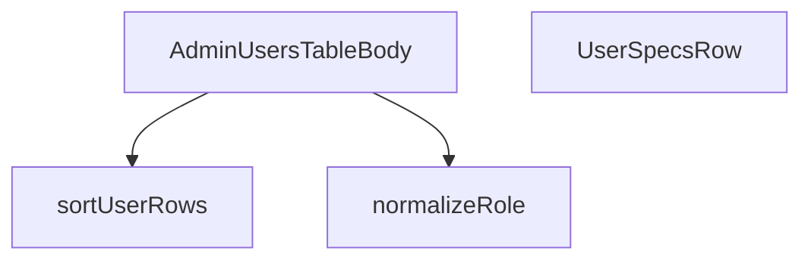

## Genel Bakış
Bu modül, admin panelindeki kullanıcı tablosunun satırlarını ve verilerini oluşturan, sıralayan ve gösteren React bileşenlerini içerir. Modül, kullanıcı rolü gibi ham verileri işleyerek standart bir forma getirir, tablonun gövdesini ve satırlarını oluşturur ve verileri istenen sıraya göre sıralar.

## Fonksiyon Grupları
### Veri Dönüştürme ve Sıralama Yardımcıları
Kullanıcı verilerini bileşenler tarafından kullanılabilecek düzenli ve tutarlı bir forma dönüştüren, sıralama mantığını içeren yardımcı işlevleri kapsar.
- normalizeRole, sortUserRows

### Kullanıcı Tablosu Bileşenleri
Kullanıcı listesini tablo yapısında satır satır oluşturan ve gösteren ana bileşen ile her bir satırın içeriğini belirleyen alt bileşeni barındırır.
- AdminUsersTableBody, UserSpecsRow

---

## AXIOMS – Mimari Varsayımlar

Bu modül, admin paneli kullanıcı tablosunu render eden React bileşenlerini ve rol verisini normalize eden yardımcı fonksiyonları içerir. Aşağıda modülün doğru çalışması için gerekli mimari varsayımlar listelenmiştir.

---

**[Aksiyom 1 - Rol Normalizasyonu Girdi Gereksinimi]:** Eğer `normalizeRole` fonksiyonuna verilen `raw` parametresi `null` veya `undefined` ise, fonksiyon geçerli bir `string` döndürmelidir; aksi halde调用layan bileşenlerde rol gösterim hatası oluşur.

**[Aksiyom 2 - Sıralama Yapılandırması Gereksinimi]:** Eğer `sortUserRows` fonksiyonuna verilen `sort` parametresi `null` veya `undefined` ise, fonksiyon sıralama yapılmamış (orijinal sıradaki) `UserRow[]` dizisini döndürmelidir; aksi halde tablo satırlarının sırası tutarsız olur.

**[Aksiyom 3 - Admin Yetki Kontrolü]:** Eğer `AdminUsersTableBody` bileşenine verilen `isAdmin` parametresi `false` ise, tabloda yalnızca admin yetkisine uygun veriler render edilmelidir; aksi halde yetkisiz veri sızıntısı oluşur.

**[Aksiyom 4 - Kullanıcı Satır Verisi Gereksinimi]:** Eğer `UserSpecsRow` bileşenine geçirilen `userRow` prop'u tanımsız veya geçersiz bir yapıda ise, bileşen düzgün render edilemez ve hata oluşur.

**[Aksiyom 5 - Rol Buton Sabitleri Eşleme]:** Eğer bir kullanıcının normalized rolü `ROLE_BUTTON_ICON` veya `ROLE_BUTTON_TONE` nesnelerinde karşılık gelen bir anahtara sahip değilse, ilgili rol butonu için varsayılan icon/tone değeri kullanılmalıdır; aksi halde UI'da undefined gösterim hatası oluşur.

**[Aksiyom 6 - Sıralama Anahtarı Geçerliliği]:** Eğer `sortUserRows` fonksiyonuna verilen `sort.key` değeri `UserRow` modelinde geçerli bir alan adı değilse, sıralama sonuçları beklenmeyen şekilde davranacaktır (sıralanmamış veya bozuk sıralı dizi döner).

---

## FONKSİYON DETAYLARI

### normalizeRole
**Ne yapar**: Ham rol değerini (null, undefined veya boş dize) standart bir role dönüştürerek, sistemde her zaman geçerli bir rol kodu olmasını sağlar.
**Nasıl yapar**: Gelen `raw` parametresinin var olup olmadığını ve boş olmadığını kontrol eder. Eğer `raw` bir değer taşıyorsa ve uzunluğu sıfırdan büyükse o değeri döndürür; aksi halde ('user') varsayılan rolü döndürür.
**Parametreler**:
- raw: string | null | undefined — Normalize edilecek ham rol değeri. Null, undefined veya boş dize olabilir.
**Dönüş**: string — Geçerli ve boş olmayan bir rol kodu. Girdi geçersizse 'user' döner.

### UserSpecsRow
**Ne yapar**: Bu bileşen, bir kullanıcının temel bilgilerini (örneğin avatar, ad, e-posta) tek bir tablo satırında görsel olarak sunmak için tasarlanmış bir React bileşenidir. Kullanıcı listesi görünümünde her bir kullanıcıyı temsil eden satırı oluşturma görevini üstlenir.
**Nasıl yapar**: Fonksiyonel bir React bileşeni (`React.FC`) olarak tanımlanmıştır. `userRow` adında bir prop alır ve bu prop'un içindeki verileri (ad, e-posta, avatar vb.) kullanarak JSX ile bir satır yapısı döndürür. Bileşenin iç mantığı, gelen veriyi formatlayıp sunmak üzerine kuruludur.
**Parametreler**:
- `userRow`: `UserSpecsRowProps` - Bileşene iletilen, kullanıcının tüm bilgilerini (ad, e-posta, avatar yolu, benzersiz ID vb.) içeren bir nesne. Bileşen bu verileri kullanarak satırı render eder.
**Dönüş**: `React.FC<UserSpecsRowProps>` - Bu, `UserSpecsRow` prop'larını alan ve React Element (`JSX.Element`) döndüren fonksiyonel bir React bileşeni olduğunu belirtir. Dönüş tipi doğrudan bileşenin kendisidir.

### AdminUsersTableBody
**Ne yapar**: Admin kullanıcılar tablosunun gövde (tbody) bölümünü render eden bir React fonksiyonel bileşenidir. Bileşen, kullanıcının admin olup olmadığını belirleyen bir prop alır ve tablonun satırlarını buna göre oluşturur.

**Nasıl yapar**: Bu bir React fonksiyonel bileşenidir. Fonksiyon, `{ isAdmin }` destructuring ile prop'ları alır. Fonksiyonun dönüş tipi `React.FC<{ isAdmin: boolean }>` olarak belirtilmiştir; bu da fonksiyonun bir React Functional Component olduğunu ve `isAdmin` adında boolean bir prop aldığını ifade eder. Bileşen, `isAdmin` prop'una bağlı olarak tablonun içeriğini veya yapısını dinamik olarak belirleyen JSX kodunu döndürür.

**Parametreler**:
- isAdmin: boolean — Kullanıcının admin yetkisine sahip olup olmadığını belirten bayrak. true ise admin, false ise normal kullanıcı视图。

**Dönüş**: React.FC<{ isAdmin: boolean }> — React Functional Component. Bileşen, `isAdmin` boolean prop'unu kabul eden ve JSX döndüren bir React bileşenidir.

### sortUserRows
**Ne yapar**: Kullanıcı satırlarını belirli bir sıralama kriterine göre alfabetik olarak sıralar, RPC'ye bağımlı olmadan istemci tarafında sıralama yapar.
**Nasıl yapar**: Sıralama parametresinden anahtarı ve yönü alır. Anahtar yoksa 'created_at' varsayılır. Yön 'asc' ise çarpan 1, 'asc' değilse -1 olur. `valueOf` adlı iç yardımcı fonksiyon, desteklenen sıralama anahtarlarına (`full_name`, `role`, `email`) göre satırdaki değeri döndürür; desteklenmeyen bir anahtar gelirse varsayılan olarak `created_at` alanını kullanır. Orijinal diziyi değiştirmemek için `[...rows]` ile bir kopya oluşturur, `localeCompare` metoduyla 'tr' (Türkçe) diline göre sıralama yapar ve yön çarpanıyla çarpar.
**Parametreler**:
- rows: UserRow[] — Sıralanacak kullanıcı satırları dizisi.
- sort: { key: string; dir: 'asc' | 'desc' } | null | undefined — Sıralama kriteri. `key`, sıralanacak alanı; `dir`, sıralama yönünü belirtir. Null veya undefined ise varsayılan sıralama (`created_at`, azalan) uygulanır.
**Dönüş**: UserRow[] — Belirtilen kritere göre sıralanmış, yeni bir UserRow dizisi.

---

## İTHALATLAR (IMPORTS)
- import: ../../components/admin/AdminEmptyState::AdminEmptyState
- import: ../../components/admin/AdminToolbar::AdminToolbar
- import: ../../components/admin/ExportMenu::ExportMenu
- import: ../../components/admin/data-table/BulkBar::BulkBar
- import: ../../components/admin/data-table/BulkBar::type BulkAction
- import: ../../components/admin/data-table/BulkRolePanel::BulkRolePanel
- import: ../../components/admin/data-table/DataTableKit::DataTableKit
- import: ../../components/admin/data-table/types::type { AdminColumn }
- import: ../../components/admin/overlay/ConfirmProvider::useConfirm
- import: ../../config/admin::listAdminUsers
- import: ../../config/admin::setUserAdminRole
- import: ../../hooks/useAdminTable::type FetchParams
- import: ../../hooks/useAdminTable::type FetchResult
- import: ../../hooks/useAdminTable::useAdminTable
- import: ../../hooks/useAuth::useAuth
- import: ../../hooks/useRole::useRole
- import: ../../i18n/I18nProvider::useI18n
- import: ../../i18n/datetime::formatDate
- import: ../../lib/ensureSessionFresh::ensureSessionFresh
- import: ../../types/database.types::type { Database }
- import: ../../utils/adminUi::adminTableActionClass
- import: @/lib/admin/mutateWithAudit::AdminPermissionError
- import: @/lib/admin/mutateWithAudit::mutateWithAudit
- import: @/lib/supabase/client::supabaseBrowserClient
- import: @supabase/supabase-js::type { SupabaseClient }
- import: next/link::Link
- import: next::type { Route }
- import: react::React
- import: react::useCallback
- import: react::useEffect
- import: react::useMemo
- import: react::useRef
- import: react::useState
- import: sonner::toast

---

## INTERFACES

### UserRow
- `id: string`
- `email?: string`
- `full_name?: string`
- `role: string`
- `created_at: string`

### ProfileLite
RPC profil satırı (full_name zenginleştirmesi için)
- `id: string`
- `full_name?: string | null`

### AllProfileRow
- `id: string`
- `role?: string | null`
- `created_at: string`
- `full_name?: string | null`

### UserSpecsRowProps
- `userRow: UserRow`

---

## TYPE ALIASES

### UserRoleCode
```typescript
type UserRoleCode = 'user' | 'admin' | 'super_admin' | 'warehouse' | 'sales' | 'viewer'
```

### UsersTab
```typescript
type UsersTab = 'admins' | 'all'
```

---

## SABİTLER
- **ROLE_BUTTON_ICON** (object) — `{
  super_admin: <Crown size={14} />,
  admin: <Shield size={14} />,
  war...`
- **ROLE_BUTTON_TONE** (object) — `{
  super_admin: 'text-admin-warning hover:bg-admin-warning-weak hover:borde...`

---

## AST POINTERS

### [N1_NASIL] AST Pointer: src/views/admin/AdminUsersTableBody.tsx::normalizeRole
- **params**: `(raw: string | null | undefined)`
- **ic_degiskenler**:
  - (yok — tek_satırlık ternary, harici değişken yok)
- **Dönüş**: `string` — boş/null/undefined ise `'user'`, aksi halde `raw`'ın kendisi

---

### [N2_NASIL] AST Pointer: src/views/admin/AdminUsersTableBody.tsx::UserSpecsRow
- **params**: `({ userRow })` — tek bir `userRow: UserRow` prop'u
- **ic_degiskenler**:
  - `t` — `useI18n()` hook'undan gelen çeviri fonksiyonu
  - `profile` — `useState` ile yönetilen, `user_profiles` tablosundan çekilen profil verisi (phone, organization_id, updated_at); başlangıçta `null`
- **Dönüş**: JSX — kullanıcının id, full_name, phone, organization_id değerlerini grid içinde gösteren genişletme bileşeni

---

### [N3_NASIL] AST Pointer: src/views/admin/AdminUsersTableBody.tsx::UserSpecsRow.useEffect_callback
- **params**: `()` — useEffect callback (boş bağımlılık dizisi, sadece `userRow.id` değişiminde çalışır)
- **ic_degiskenler**:
  - `active` — boolean bayrak; bileşen unmount edildiğinde `false` olur, böylece state güncellemesi engellenir
- **Dönüş**: cleanup fonksiyonu — `active = false` ayarlar

---

### [N4_NASIL] AST Pointer: src/views/admin/AdminUsersTableBody.tsx::UserSpecsRow.useEffect_asyncIIFE
- **params**: `()` — async IIFE (useEffect içinde `void (async () => { ... })()` çağrılır)
- **ic_degiskenler**:
  - `data` — `supabaseBrowserClient.from('user_profiles').select('phone, organization_id, updated_at').eq('id', userRow.id).maybeSingle()` sorgusunun sonucu; `null`/`undefined` ise boş obje atanır
- **Dönüş**: `void` — `setProfile(data)` veya `setProfile({})` ile yan etki

---

### [N5_NASIL] AST Pointer: src/views/admin/AdminUsersTableBody.tsx::UserSpecsRow.useEffect_cleanup
- **params**: `()` — cleanup fonksiyonu
- **ic_degiskenler**:
  - (yok)
- **Dönüş**: `void` — sadece `active = false` atar

---

### [N6_NASIL] AST Pointer: src/views/admin/AdminUsersTableBody.tsx::sortUserRows
- **params**: `(rows: UserRow[], sort: { key: string; dir: 'asc' | 'desc' } | null | undefined)`
- **ic_degiskenler**:
  - `key` — sıralama anahtarı; `sort?.key` yoksa `'created_at'` varsayılır
  - `factor` — sıralama yönü çarpanı; `asc` ise `1`, `desc` ise `-1`
  - `valueOf` — inner fonksiyon; bir satırın sıralama değerini string olarak döndürür (switch ile `full_name`, `role`, `email` veya `created_at`)
- **Dönüş**: `UserRow[]` — sıralanmış kopya dizi

---

### [N7_NASIL] AST Pointer: src/views/admin/AdminUsersTableBody.tsx::sortUserRows_valueOf
- **params**: `(row: UserRow)`
- **ic_degiskenler**:
  - (yok — closure'daki `key` değişkenini okur, switch ile `row.full_name`, `row.role`, `row.email` veya `row.created_at` değerini döndürür)
- **Dönüş**: `string` — sıralama için kullanılacak değer

---

### [N8_NASIL] AST Pointer: src/views/admin/AdminUsersTableBody.tsx::dataFetcher
- **params**: `(supabase: SupabaseClient<Database>, _params: FetchParams)`
- **ic_degiskenler**:
  - `tabRef.current === 'admins` dalı:
    - `data` — `listAdminUsers()` RPC çağrısının sonucu (admin kullanıcı listesi)
    - `ids` — `data.map(u => u.id)` ile elde edilen id dizisi
    - `profiles` — `ProfileLite[]` dizisi; `user_profiles` tablosundan `id, full_name` sorgulanır
    - `profileData` — supabase sorgusunun `data` alanı (profiles için)
    - `allRows` — `data.map(u => ({...}))` ile zenginleştirilmiş tam satır dizisi; email/full_name/profillerden eşleştirilir, role `normalizeRole` ile normalize edilir
    - `term` — `_params.query.trim().toLocaleLowerCase('tr')` — arama terimi
    - `filtered` — `term` varsa `allRows` içinde full_name veya email eşleşenler, yoksa `allRows`'un kendisi
    - `sorted` — `sortUserRows(filtered, _params.sort)` çağrısıyla sıralanmış dizi
    - `offset` — sayfa başlangıç indeksi: `(_params.page - 1) * _params.pageSize`
  - `tab !== 'admins` dalı:
    - `offset` — aynı hesaplama ile sayfa başlangıç indeksi
    - `sortColumn` — `USER_SORT_COLUMNS` dict'inden sıralama sütunu; bulunamazsa `'created_at'`
    - `allQuery` — `supabase.from('user_profiles')...` ile zincirlenen sorgu nesnesi; `select`, `order`, `ilike`, `range` eklenir
    - `term` — `_params.query.trim()` — arama terimi (lowercase yok, ilike kullanılır)
    - `data` — sorgu sonucu (`AllProfileRow[]` veya null)
    - `error` — sorgu hatası
    - `count` — `count: 'exact'` ile elde edilen toplam eşleşme sayısı
    - `emailByeId` — `Map<string, string>`; user id → email eşlemesi (RPC'den)
    - `emailsComplete` — boolean bayrak; RPC tüm e-postaları döndüyse `true`
    - `rpcRows` — `admin_list_users()` RPC sonucu (id + email dizisi)
    - `rpcError` — RPC hatası
    - `list` — `rpcRows` dizisi (id + email)
    - `rows` — `data.map(p => ({...}))` ile oluşturulmuş `UserRow[]` dizisi; email`emailByeId`'den alınır
- **Dönüş**: `Promise<FetchResult<UserRow>>` — `{ rows, totalMatched }` objesi

---

### [N9_NASIL] AST Pointer: src/views/admin/AdminUsersTableBody.tsx::dataFetcher_adminTab_mapping
- **params**: `(u)` — admin kullanıcısı objesi (id, email, role, created_at, full_name)
- **ic_degiskenler**:
  - (yok — `profiles.find(p => p.id === u.id)?.full_name` inline kullanılır)
- **Dönüş**: `UserRow` objesi — `{ id, email, full_name, role, created_at }`; full_name önce profile'dan, sonra `u.full_name`'den alınır

---

### [N10_NASIL

---


## MERMAID CALL GRAPH


## NODE ID STANDARD

  file: src\views\admin\AdminUsersTableBody.tsx
  function: src\views\admin\AdminUsersTableBody.tsx::normalizeRole
  function: src\views\admin\AdminUsersTableBody.tsx::UserSpecsRow
  function: src\views\admin\AdminUsersTableBody.tsx::AdminUsersTableBody
  function: src\views\admin\AdminUsersTableBody.tsx::sortUserRows

---

## DISA AKTARILANLAR (EXPORTS)
  export: AdminUsersTableBody
  export: UserSpecsRow
  export: normalizeRole

---

## STİL TOKENLERİ

### Arbitrary Değerler (token'a geçirilmemiş)
Yok — tüm stiller token'a geçirilmiş. ✅

### Kullanılan Token'lar (zaten token'a geçirilmiş)
- (yok)

### Tailwind Sınıf Özeti
- **Renkler:** `bg-admin-accent`, `bg-admin-accent-weak`, `bg-admin-danger-weak`, `bg-admin-surface`, `bg-admin-surface-2`, `bg-gradient-to-br`, `border-admin-border`, `border-admin-danger/30`, `from-white/10`, `group-hover/spec:text-admin-accent`, `group-hover:bg-admin-accent-weak`, `group-hover:border-admin-accent/30`, `group-hover:text-admin-accent`, `hover:bg-admin-surface-2`, `hover:border-admin-accent/30`
- **Layout:** `absolute`, `flex`, `flex-1`, `flex-col`, `flex-wrap`, `from-white/10`, `gap-1.5`, `gap-2`, `gap-3`, `gap-4`, `gap-8`, `grid`, `grid-cols-1`, `h-0.5`, `h-10`
- **Varyant/Responsive:** `:`, `active:`, `disabled:`, `group-hover/item:`, `group-hover/spec:`, `group-hover:`, `hover:`, `lg:`, `md:`, `sm:` önekleri
- **Yardımcı Sınıflar:** `$`, `${ROLE_BUTTON_TONE[target]`, `${adminTableActionClass`, `-mr-48`, `-mt-48`, `:`, `===`, `active:scale-95`, `activeTab`, `admins`, `all`, `blur-120`, `border`, `break-all`, `disabled:cursor-not-allowed`