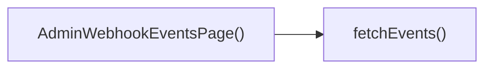

## Genel Bakış
Venthub HVAC projesinin yönetici paneline ait bu modül, webhook tetiklemelerinin takibini yapmak için tasarlanmış bir frontend sayfa bileşenidir. Sadece yetkili yönetici kullanıcıların erişebildiği bu sayfa, sistemde gerçekleşen tüm webhook olaylarını listeleyerek şeffaf bir takip imkanı sunar. Sayfa, ihtiyaç duyduğu olay verilerini sistem kaynağından çekerek güncel içerik sunmayı hedefler.

## Fonksiyon Grupları
### Ana Sayfa Bileşeni
Webhook olayları sayfasının kullanıcı arayüzünü render eden, sayfanın genel çalışma akışını ve tüm alt işlevleri koordine eden ana bileşendir. Yönetici kullanıcıya eksiksiz bir webhook takibi deneyimi sunar.
- AdminWebhookEventsPage

### Webhook Verisi Yönetimi
Sistemde kayıtlı tüm webhook olaylarını asenkron olarak çeken işlevdir, sayfanın ihtiyaç duyduğu güncel ve geçmiş olay verilerini sağlayarak içeriğin doğru şekilde görüntülenmesini destekler.
- fetchEvents

---

## AXIOMS – Mimari Varsayımlar
Bu modül, sadece yönetici (admin) yetkisine sahip kullanıcıların sistemdeki tüm webhook tetikleme olaylarını görüntülemesine olanak tanıyan React tabanlı bir sayfa bileşenidir; doğru ve güvenli çalışması için erişim kontrolleri, veri çekme altyapısı ve veri formatı uyumluluğu varsayımlarının tam olarak sağlanması zorunludur.

[Aksiyom 1]: Eğer uygulama rota yönetiminde bu sayfanın sadece admin yetkisine sahip kullanıcılara sunulmasını engelleyen rota koruması yoksa, yetkisiz kullanıcılar doğrudan rota adresi üzerinden sayfaya erişerek hassas webhook olay verilerini görüntüleyebilir, veri sızdırma ve güvenlik ihlali gerçekleşir.
[Aksiyom 2]: Eğer sayfa içindeki fetchEvents fonksiyonunun istek gönderdiği backend webhook olayları listeleme API endpointi erişilebilir değilse, sayfa hiçbir olay verisini yükleyemez, kullanıcı boş veya sürekli yükleme durumunda kalan bir arayüzle karşılaşır.
[Aksiyom 3]: Eğer frontend uygulamasının çalıştığı origin ile fetchEvents'in eriştiği backend API arasında gerekli CORS politikaları tanımlı değilse, tarayıcı güvenlik kısıtlamaları nedeniyle veri çekme işlemi engellenir, sayfa içeriği hiçbir zaman yüklenemez.
[Aksiyom 4]: Eğer backend API'den fetchEvents ile çekilen webhook olay verileri, sayfa bileşeninin beklediği veri yapısıyla (alan isimleri, veri tipleri) uyumlu değilse, arayüzde olaylar doğru listelenemez, React render hataları oluşur.
[Aksiyom 5]: Eğer kullanıcının oturum doğrulama jetonu (auth token) fetchEvents isteklerine eklenmiyorsa, backend API yetkisiz istekleri reddeder, sayfa hiçbir veri çekemez ve kullanıcı erişim hatası alır.

---

## FONKSIYON DETAYLARI

### AdminWebhookEventsPage
**Ne yapar**: VentHub HVAC projesinin yönetici paneline ait webhook olayları görüntüleme sayfasını oluşturan ana React bileşenidir. Sadece yetkili yönetici kullanıcıların erişebildiği bu sayfa, sistemde tetiklenen tüm webhook etkinliklerini listeleme ve inceleme imkanı sunar. Kaynak kodunda `C:\Users\alize\venthub-hvac\src\views\admin\AdminWebhookEventsPage.tsx` dosyasında tanımlıdır ve genel domain kapsamında yöneticiye özel işlevler sunar.
**Nasıl yapar**: React tabanlı bir sayfa bileşeni olarak çalışan bu yapı, kendi state yönetimini gerçekleştirir, tüm kullanıcı arayüzü elemanlarını doğru şekilde render eder ve sayfa ilk yüklendiğinde içerdiği `fetchEvents` fonksiyonunu çağırarak görüntülenecek webhook olaylarını veri kaynağından çeker. Yönetici paneline ait tüm sayfalarla uyumlu erişim kontrolü mekanizmalarıyla entegre çalışarak yetkisiz erişimleri engeller.
**Parametreler**: Bu bileşenin tanımlı herhangi bir parametresi bulunmamaktadır.
**Dönüş**: Tanımlarda dönüş tipi belirsiz (void veya bilinmiyor) olarak işaretlenmiştir. Tipik bir React sayfa bileşeni olarak ekranda görüntülenecek JSX içeriği döndürmesi beklenir.

### fetchEvents
**Ne yapar**: Yönetici panelinin webhook olayları sayfasında görüntülenecek tüm kayıtlı geçmiş ve güncel webhook olaylarını sistemin arka uç veri kaynağından çeken yardımcı veri çekme fonksiyonudur. Sadece `AdminWebhookEventsPage` bileşeni tarafından kullanılarak sayfanın ihtiyaç duyduğu olay listesinin elde edilmesini sağlar.
**Nasıl yapar**: Aynı dosya içinde ana sayfa bileşenine destek olmak üzere tanımlanan bu fonksiyon, arka uç servisine yetkilendirme başlıklarıyla donatılmış bir HTTP isteği gönderir. Gelen sunucu yanıtını işler, başarılı veri çekimi sonrasında elde edilen olay listesini sayfa bileşeninin state'ine aktarır. Olası ağ kesintileri veya sunucu kaynaklı hatalarda gerekli hata yönetimi süreçlerini devreye sokarak kullanıcıya bildirim sağlar.
**Parametreler**: Bu fonksiyonun tanımlı herhangi bir parametresi bulunmamaktadır.
**Dönüş**: Tanımlarda dönüş tipi belirsiz (void veya bilinmiyor) olarak işaretlenmiştir. Asenkron veri çekme işlemi gerçekleştiren bir fonksiyon olarak Promise nesnesi döndürmesi beklenir ancak resmi tip tanımında bu durum belirtilmemiştir.

---

## INTERFACES

### AdminDatabase
- `public: Omit<Database['public'], 'Tables'> & {
`

---

## TYPE ALIASES

### WebhookEventRow

---

## AST POINTERS

### [N1_NASIL] AST Pointer: C:\Users\alize\venthub-hvac\src\views\admin\AdminWebhookEventsPage.tsx::AdminWebhookEventsPage
- **params**: (parametre yok)
- **ic_degiskenler**:
  - `loading` — Veri yükleme durumunu tutan state, yenileme butonunda dönme animasyonu için kullanılır
  - `setLoading` — loading state değerini güncellemek için kullanılan state setter fonksiyonu
  - `events` — Tüm webhook olaylarını saklayan dizi state'i, tabloda listelemek için kullanılır
  - `setEvents` — events state değerini güncellemek için kullanılan state setter fonksiyonu
  - `selectedEvent` — Kullanıcının detaylarını görüntülemek için seçtiği webhook olayını tutan state
  - `setSelectedEvent` — selectedEvent state değerini güncellemek için kullanılan state setter fonksiyonu
  - `fetchEvents` - Webhook olaylarını veritabanından çekmek için tanımlanan async iç fonksiyon
  - `useEffect` - Bileşen ilk mount olduğunda fetchEvents'i tetiklemek için kullanılan React hook'u
- **Dönüş**: Webhook olayları yönetim sayfası JSX elementi

### [N2_NASIL] AST Pointer: C:\Users\alize\venthub-hvac\src\views\admin\AdminWebhookEventsPage.tsx::fetchEvents
- **params**: (parametre yok)
- **ic_degiskenler**:
  - `adminClient` — `webhook_events` tablosuna tip güvenli erişim için supabase client'ına tip dönüşümü yapılarak oluşturulan genişletilmiş veritabanı istemcisi
  - `query` — adminClient üzerinden `webhook_events` tablosu için oluşturulan veritabanı sorgusu nesnesi
  - `data` — Sorgu sonucu dönen ham webhook olayları verisi
  - `fetchErr` — Sorgu çalışması sırasında oluşan hatayı saklayan değişken
  - `eventsData` - Gelen data'ya tip dönüşümü yapılarak oluşturulan, events state'ine atanacak formatlanmış olay dizisi
  - `err` — Try bloğunda fırlatılan tüm hataları yakalayan catch bloğu hata nesnesi
- **Dönüş**: yok

### [N3_NASIL] AST Pointer: C:\Users\alize\venthub-hvac\src\views\admin\AdminWebhookEventsPage.tsx::useEffect_mount_callback
- **params**: (parametre yok)
- **ic_degiskenler**:
  - `fetchEvents` — Bileşen ilk yüklendiğinde webhook olaylarını çekmek için tetiklenen veri çekme fonksiyonu
- **Dönüş**: yok

### [N4_NASIL] AST Pointer: C:\Users\alize\venthub-hvac\src\views\admin\AdminWebhookEventsPage.tsx::events_map_callback
- **params**: `event` - map döngüsünde işlenen tekil WebhookEventRow tipinde webhook olayı nesnesi
- **ic_degiskenler**:
  - `event.id` — React listesi için benzersiz anahtar olarak, ayrıca seçili olay ile eşleştirme için kullanılır
  - `selectedEvent?.id` — Mevcut döngüdeki olayın kullanıcı tarafından seçili olup olmadığını anlamak için karşılaştırmada kullanılır
  - `setSelectedEvent` — Satıra tıklandığında mevcut olayı seçili olay olarak ayarlamak için kullanılır
  - `event.event_type` — Tablo sütununda olayın tipini görüntülemek için kullanılır
  - `event.provider` — Tablo sütununda olayın geldiği kaynağı göstermek için kullanılır
  - `event.status` — Olayın işlenme durumuna (processed/failed/bekliyor) göre uygun etiketi göstermek için kullanılır
  - `event.created_at` — Türkçe locale ile formatlanarak olayın oluşturulma tarihini tabloda göstermek için kullanılır
- **Dönüş**: Tek bir webhook olayı için tablo satırı `<tr>` JSX elementi

---

## ÇAĞRI HARİTASI

### Disariya Cagrilar (Outgoing)
AdminWebhookEventsPage() fonksiyonu, webhook etkinliklerini çekmek amacıyla dosya içindeki fetchEvents fonksiyonunu çağırır.

### Disaridan Cagrilanlar (Incoming)
Verilen çağrı grafiği verisinde bu modülü kullanan herhangi bir dış modül, dosya veya fonksiyon bilgisi belirtilmemiştir.

### Ic Ice Fonksiyonlar (Nested)
Yok

---

## DOSYA-İÇİ ÇAĞRI GRAFİĞİ
  AdminWebhookEventsPage() → fetchEvents()

---

## NODE ID STANDARD

  file: src\views\admin\AdminWebhookEventsPage.tsx
  function: src\views\admin\AdminWebhookEventsPage.tsx::AdminWebhookEventsPage
  function: src\views\admin\AdminWebhookEventsPage.tsx::fetchEvents

---

## DISA AKTARILANLAR (EXPORTS)
  export: AdminWebhookEventsPage