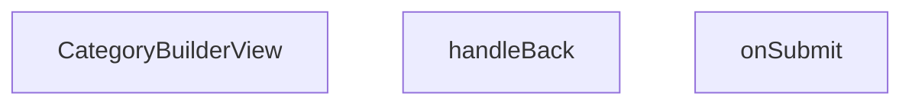

## Genel Bakış
VentHub HVAC admin panelinde kategorilerin oluşturulmasını ve düzenlenmesini sağlayan React görünüm bileşenidir. Tek bir bileşen üzerinden yeni kategori ekleme veya mevcut kategoriyi yeniden yapılandırma süreçlerini koordine eder.

## Fonksiyon Grupları
### Ana Görünüm Bileşeni
Kullanıcıya kategori verilerini düzenleyebileceği interaktif bir arayüz sunar ve bileşenin yaşam döngüsünü yönetir.
- CategoryBuilderView

### Navigasyon Kontrolü
Kullanıcının kategori düzenleme sayfasından önceki sayfaya veya listeye güvenli bir şekilde dönmesini sağlar.
- handleBack

### Veri Kaydetme İşleyicisi
Formda düzenlenen kategori bilgilerinin doğrulanmasını ve sunucuya gönderilerek veritabanında kalıcı hale getirilmesini sağlar.
- onSubmit

---

## AXIOMS – Mimari Varsayımlar
- Bu modül davranışsal mantık içermez (salt veri / konfigürasyon / tip tanımı).
- [Aksiyom 1]: Modülün dışa açtığı yapı (anahtar kümesi / şema) bir sözleşmedir; tüketiciler bu sabit yapıya bağlıdır — kırıcı değişiklik tüm tüketicileri etkiler.
- [Aksiyom 2]: Bir öğe ekleme/çıkarma yapısal-uyumlu olmalı; ilgili tipler ve seçiciler aynı commit'te güncel tutulmalıdır.

---

## FONKSİYON DETAYLARI

### CategoryBuilderView
**Ne yapar**: VentHub HVAC projesinin admin panelinde kategori oluşturma ve düzenleme işlemlerini sunan React bileşenidir. Sıfırdan yeni kategori ekleme veya var olan bir kategoriyi güncelleme işlemleri için gerekli kullanıcı arayüzünü ekrana render eder.
**Nasıl yapar**: Kendisine prop olarak iletilen categoryId değerini temel alarak çalışma modunu belirler. Eğer categoryId değeri mevcutsa ilgili kategorinin verilerini yükleyerek düzenleme modunu aktif eder, kategoriId yoksa sıfırdan kategori oluşturma modunda boş form arayüzünü hazırlar. React component mimarisi üzerinden tüm form alanları ve aksiyon butonlarını bir araya getirerek admin kullanıcısının kullanımına sunar.
**Parametreler**:
- name: categoryId, type: string | number | undefined — Düzenlenecek mevcut kategorinin sistemdeki benzersiz kimlik değeridir. Eğer bu değer tanımsızsa bileşen otomatik olarak yeni kategori oluşturma modunda çalışır.
**Dönüş**: React.FC<CategoryBuilderViewProps> tipinde geçerli bir React bileşeni döndürür. Bu bileşen admin paneli içerisinde kategori işlemleri için tüm gerekli arayüz öğelerini barındırır.

### handleBack
**Ne yapar**: Kategori oluşturucu sayfasında kullanıcının bir önceki sayfaya veya listings sayfasına geri dönmesini sağlar.

**Nasıl yapar**: React Router'ın navigasyon metodlarını kullanarak kullanıcıyı bir önceki sayfaya yönlendirir. Genellikle browser history'sindeki bir önceki konuma gitmek veya belirli bir rotaya yönlendirme yapmak için kullanılır. Bu fonksiyon bir event handler olarak buton tıklamalarında tetiklenir.

**Parametreler**:
Bu fonksiyon herhangi bir parametre almaz.

**Dönüş**: void — Fonksiyon herhangi bir değer döndürmez, sadece navigasyon side-effect'i gerçekleştirir.

### onSubmit
**Ne yapar**: Kategori formu doldurulduktan sonra form verilerini alır ve yeni bir kategori kaydı oluşturmak için API isteği gönderir.

**Nasıl yapar**: Async bir fonksiyon olarak çalışır ve CategoryFormValues tipindeki form verilerini alır. Bu verileri backend API'sine post isteği olarak göndererek kategori oluşturur. İşlem başarılı olduğunda kullanıcıya bildirim verebilir ve sayfayı yenileyebilir veya listing sayfasına yönlendirebilir. Form validasyonu başarılı olduktan sonra tetiklenir.

**Parametreler**:
- values: CategoryFormValues — Kategori form alanlarının değerlerini içeren nesne. Kategori adı, açıklama, üst kategori ID'si gibi alanları barındırır.

**Dönüş**: void — Fonksiyon asenkron olarak çalışır ancak doğrudan bir değer döndürmez, API yanıtını side-effect olarak işler.

---

## İTHALATLAR (IMPORTS)
- import: @/components/admin/authority-builder/AuthorityBuilder::AuthorityBuilder
- import: @/components/authority/AuthorityRenderer::AuthorityRenderer
- import: @/hooks/useRole::useRole
- import: @/i18n/I18nProvider::useI18n
- import: @/lib/admin/mutateWithAudit::mutateWithAudit
- import: @/lib/supabase/client::supabaseBrowserClient
- import: @/types/authority::AuthorityBlock
- import: @/types/authority::SpecsBlock
- import: @/types/db-rows::CategoryMetadata
- import: @/types/db-rows::DbCategory
- import: @/types/db-rows::DbJson
- import: @hookform/resolvers/zod::zodResolver
- import: next/navigation::useRouter
- import: react-hook-form::useForm
- import: react::React
- import: react::useCallback
- import: react::useEffect
- import: react::useState
- import: sonner::toast
- import: zod::z

---

## INTERFACES

### CategoryBuilderViewProps
- `categoryId: string`

### CategoryFormValues
- `name: string`
- `slug: string`
- `parent_id: string | null`
- `sort_order: number`
- `description: string`
- `is_active: boolean`

---

## AST POINTERS

### [N1_NASIL] AST Pointer: CategoryBuilderView.tsx::formSchema
- **params**: none
- **ic_degiskenler**:
  - `t` — i18n çeviri fonksiyonu, zod hata mesajları için kullanılır (ör: `t('admin.categories.nameRequired')`)
- **Dönüş**: `z.object({ name, slug, parent_id, sort_order, description, is_active })` — form validasyon şeması döner

---

### [N2_NASIL] AST Pointer: CategoryBuilderView.tsx::useEffect_fetchParents_callback
- **params**: none
- **ic_degiskenler**:
  - `fetchParents` — supabase'den parent_id'si null olan ve mevcut kategoriden farklı kategorileri çeken async fonksiyon
  - `supabase` — Supabase istemcisi, `.from('categories').select('id, name')` sorgusu çalıştırır
  - `categoryId` — props'tan gelen mevcut kategori ID'si, `.neq('id', categoryId)` ile dışlanır
  - `data` — supabase sorgusundan dönen kategori listesi, `setParentIdOptions(data)` ile state'e yazılır
  - `setParentIdOptions` — üst kategori seçeneklerini tutan state setter'ı
- **Dönüş**: yok (yan etki: state günceller, fetch çağırır)

---

### [N3_NASIL] AST Pointer: CategoryBuilderView.tsx::fetchParents
- **params**: none
- **ic_degiskenler**:
  - `data` — supabase `.from('categories').select('id, name').is('parent_id', null).neq('id', categoryId)` sorgusundan dönen satırlar, `{ id, name }` yapısında
- **Dönüş**: yok (yan etki: `setParentIdOptions(data)` çağırarak parent listesini günceller)

---

### [N4_NASIL] AST Pointer: CategoryBuilderView.tsx::useEffect_loadCategory
- **params**: none
- **ic_degiskenler**:
  - `data` — supabase'den tek kategori kaydını seçen sorgu sonucu (tüm alanlar: `id, name, parent_id, slug, is_active, sort_order, level, image_url, seo_title, seo_desc, created_at, updated_at, description, display_mode, is_featured, marketing_title, menu_label, metadata, translation_key, authority_content`)
  - `error` — supabase sorgu hatası, `throw error` ile yakalanır
  - `cat` — `data`'nın `DbCategory` tipine cast edilmiş hali, `setCategory(cat)` ile state'e yazılır
  - `form` — react-hook-form instance'ı, `form.reset(...)` ile form alanları doldurulur
  - `initialBlocks` — `cat.authority_content`'ten türetilen `AuthorityBlock[]` dizisi, yoksa boş dizi
  - `legacyBlocks` — eski veri yapısından yeni blok formatına dönüştürülen `AuthorityBlock[]` dizisi
  - `meta` — `cat.metadata`'nın `CategoryMetadata` tipine cast edilmiş hali, `metric1` ve `metric2` alanlarını tutar
  - `rows` — `SpecsBlock['content']['rows']` tipinde teknik özet satırları dizisi, `meta.metric1` ve `meta.metric2`'den doldurulur
  - `e` — catch bloğundaki hata nesnesi
- **Dönüş**: yok (yan etki: `setLoading`, `setCategory`, `form.reset`, `setBlocks`, `toast.success/error` çağırır)

---

### [N5_NASIL] AST Pointer: CategoryBuilderView.tsx::useEffect_beforeunload_setup
- **params**: none
- **ic_degiskenler**:
  - `handleBeforeUnload` — `beforeunload` olayı için handler fonksiyonu, form kirliyse tarayıcı çıkışını engeller
  - `e` — `BeforeUnloadEvent` parametresi, `e.preventDefault()` ve `e.returnValue = ''` ile doğrulama kutusu gösterir
- **Dönüş**: cleanup fonksiyonu döner — `window.removeEventListener('beforeunload', handleBeforeUnload)` çağırarak event listener'ı temizler

---

### [N6_NASIL] AST Pointer: CategoryBuilderView.tsx::handleBeforeUnload
- **params**: `(e: BeforeUnloadEvent)`
- **ic_degiskenler**:
  - `e` — BeforeUnloadEvent, `e.preventDefault()` ve `e.returnValue = ''` ile tarayıcı native onay kutusu tetiklenir
  - `isFormDirty` — boolean, formda kaydedilmemiş değişiklik olup olmadığını kontrol eder
- **Dönüş**: string `''` veya yok (yan etki: `e.preventDefault()` çağırır)

---

### [N7_NASIL] AST Pointer: CategoryBuilderView.tsx::beforeunload_cleanup
- **params**: none
- **ic_degiskenler**:
  - `handleBeforeUnload` — kaldırılacak event handler referansı, closure'dan gelir
- **Dönüş**: yok (yan etki: `window.removeEventListener` çağırarak listener temizler)

---

### [N8_NASIL] AST Pointer: CategoryBuilderView.tsx::handleBack
- **params**: none
- **ic_degiskenler**:
  - `isFormDirty` — boolean, formda kaydedilmemiş değişiklik varsa `window.confirm` ile onay ister
  - `router` — Next.js useRouter hook'undan dönen instance, `router.back()` ile önceki sayfaya gider
  - `t` — i18n çeviri fonksiyonu, `t('admin.categories.unsavedChangesConfirm')` onay mesajı için kullanılır
- **Dönüş**: yok (yan etki: `router.back()` çağırarak navigasyon yapar)

---

### [N9_NASIL] AST Pointer: CategoryBuilderView.tsx::onSubmit
- **params**: `(values: CategoryFormValues)` — formdan gelen değerler: `name, slug, parent_id, sort_order, description, is_active`
- **ic_degiskenler**:
  - `hasWriteAccess` — boolean, kullanıcının yazma izni olup olmadığını kontrol eder; yoksa `toast.error` ile hata gösterir ve fonksiyon erken döner
  - `mutateWithAudit` — audit logging ile birlikte supabase mutation yapan fonksiyon, `resource: 'categories'`, `action: 'UPDATE'`, `rowPk: categoryId` parametreleriyle çağrılır
  - `categoryId` — props'tan gelen kategori ID'si, `before` ve `after` kayıtlarında `rowPk` olarak, `.eq('id', categoryId)` filtresinde kullanılır
  - `category` — mevcut kategori state'i, `before` objesinde eski değerler (`name, slug, parent_id, sort_order, description, is_active, authority_content`) için referans olarak kullanılır
  - `blocks` — `AuthorityBlock[]` state'i, hem `after.authority_content` hem de supabase update'in `authority_content` alanına `blocks as DbJson` cast ile yazılır
  - `values` — parametre, `after` objesinde ve supabase `.update({...})` çağrısında güncel form değerleri olarak kullanılır
  - `updatedCategory` — `category`'yi spread edip güncel `values` ve `blocks` ile merge eden `DbCategory` nesnesi, `setCategory(updatedCategory)` ile state güncellenir
  - `form` — react-hook-form instance'ı, `form.reset(values)` ile form durumu kaydedilen değerlerle senkronize edilir
  - `e` — catch bloğundaki hata nesnesi
- **Dönüş**: yok (yan etki: `setSaving`, `mutateWithAudit`, `setCategory`, `form.reset`, `toast.success/error` çağırır)

---

### [N10_NASIL] AST Pointer: CategoryBuilderView.tsx::onSubmit_fn_supabaseUpdate
- **params**: none
- **ic_degiskenler**:
  - `values` — closure'dan gelen `CategoryFormValues`, supabase `.update({...})` içinde `name, slug, parent_id, sort_order, description, is_active` alanlarına yazılır
  - `blocks` — closure'dan gelen `AuthorityBlock[]`, `authority_content: blocks as DbJson` cast ile supabase'e yazılır
  - `categoryId` — props'tan gelen kategori ID'si, `.eq('id', categoryId)` filtresinde kullanılır
  - `error` — supabase `.update()` sonucundaki hata, varsa `throw error` ile fırlatılır
- **Dönüş**: yok (yan etki: supabase `categories` tablosunu günceller)

---

### [N11_NASIL] AST Pointer: CategoryBuilderView.tsx::parentOption_render
- **params**: `(p)` — `{ id: string; name: string }` yapısında üst kategori nesnesi
- **ic_degiskenler**:
  - `p` — tek bir üst kategori objesi, `p.id` `<option>`'un `value` ve `key`'i, `p.name` option metni olarak kullanılır
- **Dönüş**: `JSX.Element` — `<option>` JSX elementi döner, `className="bg-surface-deep"` ile stillendirilir

---

## MERMAID CALL GRAPH

## NODE ID STANDARD

  file: src\views\admin\CategoryBuilderView.tsx
  function: src\views\admin\CategoryBuilderView.tsx::CategoryBuilderView
  function: src\views\admin\CategoryBuilderView.tsx::handleBack
  function: src\views\admin\CategoryBuilderView.tsx::onSubmit

---

## DISA AKTARILANLAR (EXPORTS)
  export: CategoryBuilderView

---

## STİL TOKENLERİ

### Arbitrary Değerler (token'a geçirilmemiş)
Yok — tüm stiller token'a geçirilmiş. ✅

### Kullanılan Token'lar (zaten token'a geçirilmiş)
- `tracking-hvac-loose`, `tracking-hvac-relaxed`

### Tailwind Sınıf Özeti
- **Renkler:** `bg-black/40`, `bg-cyan-500`, `bg-emerald-500`, `bg-emerald-500/10`, `bg-slate-950`, `bg-surface-darkest`, `bg-surface-deep`, `bg-white`, `bg-white/10`, `bg-white/2`, `bg-white/3`, `bg-white/5`, `border-4`, `border-b`, `border-cyan-400/20`
- **Layout:** `custom-scrollbar`, `custom-scrollbar-light`, `flex`, `flex-1`, `flex-col`, `gap-2`, `gap-3`, `gap-4`, `gap-6`, `grid`, `grid-cols-1`, `h-1.5`, `h-12`, `h-14`, `h-16`
- **Varyant/Responsive:** `:`, `active:`, `disabled:`, `focus-visible:`, `focus:`, `group-hover:`, `hover:`, `md:`, `placeholder:` önekleri
- **Yardımcı Sınıflar:** `${adminContentMaxWidthClass`, `${adminSidebarWidthClass`, `${previewMode`, `${showPreview`, `:`, `===`, `active:scale-95`, `animate-in`, `animate-pulse`, `animate-spin`, `appearance-none`, `border`, `cursor-pointer`, `desktop`, `disabled:opacity-50`