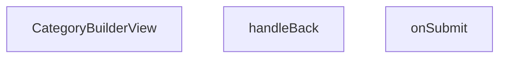

## Genel Bakış
VentHub HVAC admin panelinde kategorilerin oluşturulmasını ve düzenlenmesini sağlayan bir React görünüm bileşenidir. Yeni kategori ekleme veya mevcut kategoriyi güncelleme iş akışlarını tek bir bileşen üzerinden yönetir. Bileşen, aldığı `categoryId` prop'una göre çalışma modunu belirler ve form gönderimi ile navigasyon kontrolü gibi asenkron işlemleri içerir.

## Fonksiyon Grupları

### Ana Görünüm Bileşeni
Kullanıcıya kategori düzenleme arayüzünü sunar ve bileşenin yaşam döngüsünü yönetir. `categoryId` prop'una bağlı olarak yeni kategori ekleme veya mevcut kategoriyi düzenleme modunda çalışır.
- CategoryBuilderView

### Navigasyon Kontrolü
Kullanıcının kategori düzenleme sayfasından önceki sayfaya güvenli bir şekilde dönmesini sağlar.
- handleBack

### Veri Kaydetme İşleyicisi
Formda düzenlenen kategori bilgilerinin sunucuya gönderilerek veritabanında kalıcı hale getirilmesini sağlar. `CategoryFormValues` tipinde form değerlerini alır.
- onSubmit

---

## AXIOMS – Mimari Varsayımlar
Bu modül için fonksiyon gövdeleri sağlanmadığından mimari varsayımlar üretilememektedir. Aksiyomlar yalnızca fonksiyon gövdelerinden türetilebilir; imza, docstring veya değişken isimlerinden çıkarım yapılmaz.

---

## FONKSİYON DETAYLARI

### CategoryBuilderView
**Ne yapar**: VentHub HVAC projesinin admin panelinde kategori oluşturma ve düzenleme işlemlerini sunan React bileşenidir. Sıfırdan yeni kategori ekleme veya var olan bir kategoriyi güncelleme işlemleri için gerekli kullanıcı arayüzünü ekrana render eder.
**Nasıl yapar**: Kendisine prop olarak iletilen categoryId değerini temel alarak çalışma modunu belirler. Eğer categoryId değeri mevcutsa ilgili kategorinin verilerini yükleyerek düzenleme modunu aktif eder, kategoriId yoksa sıfırdan kategori oluşturma modunda boş form arayüzünü hazırlar. React component mimarisi üzerinden tüm form alanları ve aksiyon butonlarını bir araya getirerek admin kullanıcısının kullanımına sunar.
**Parametreler**:
- name: categoryId, type: string | number | undefined — Düzenlenecek mevcut kategorinin sistemdeki benzersiz kimlik değeridir. Eğer bu değer tanımsızsa bileşen otomatik olarak yeni kategori oluşturma modunda çalışır.
**Dönüş**: React.FC<CategoryBuilderViewProps> tipinde geçerli bir React bileşeni döndürür. Bu bileşen admin paneli içerisinde kategori işlemleri için tüm gerekli arayüz öğelerini barındırır.

### handleBack
**Ne yapar**: Formda kaydedilmemiş (kirli) değişiklikler varsa kullanıcıdan kapatma onayı isteyen bir guard fonksiyonudur. Kullanıcının sayfadan çıkarken bilinçli bir şekilde değişiklikleri atmayı kabul edip etmediğini kontrol eder. Değişikliklerin geri alınamaz şekilde kaybolacağı konusunda kullanıcıyı uyarır.

**Nasıl yapar**: Eskiden `window.confirm` ile senkron bir şekilde bloklama yaparak onay alıyordu; artık ConfirmDialog bileşeni kullanılarak asenkron bir akış izlenir. Kapatma isteği önce yakalanır, ardından kullanıcıya bir ConfirmDialog gösterilir ve onay beklenir. Kullanıcı onay verirse kapatma işlemi gerçekten gerçekleştirilir. Dialog'ta `tone: 'danger'` ayarı kullanılır çünkü form değişikliklerini atmak geri alınamaz bir işlemdir ve kullanıcıya bu durumun ciddiyeti vurgulanır. Fonksiyon `async` olarak tanımlanmıştır çünkü ConfirmDialog'un kullanıcı yanıtını beklemesi gerekir.

**Parametreler**:
- Bu fonksiyon parametre almaz.

**Dönüş**: Dönüş tipi belirtilmemiştir. Fonksiyon `async` olduğundan bir Promise döndürmesi beklenir ancak kesin dönüş değeri kaynakta tanımlı değildir.

### onSubmit
**Ne yapar**: Kategori formu doldurulduktan sonra form verilerini alır ve yeni bir kategori kaydı oluşturmak için API isteği gönderir.

**Nasıl yapar**: Async bir fonksiyon olarak çalışır ve CategoryFormValues tipindeki form verilerini alır. Bu verileri backend API'sine post isteği olarak göndererek kategori oluşturur. İşlem başarılı olduğunda kullanıcıya bildirim verebilir ve sayfayı yenileyebilir veya listing sayfasına yönlendirebilir. Form validasyonu başarılı olduktan sonra tetiklenir.

**Parametreler**:
- values: CategoryFormValues — Kategori form alanlarının değerlerini içeren nesne. Kategori adı, açıklama, üst kategori ID'si gibi alanları barındırır.

**Dönüş**: void — Fonksiyon asenkron olarak çalışır ancak doğrudan bir değer döndürmez, API yanıtını side-effect olarak işler.

---

## İTHALATLAR (IMPORTS)
- import: @/components/admin/authority-builder/AuthorityBuilder::AuthorityBuilder
- import: @/components/admin/overlay/ConfirmProvider::useConfirm
- import: @/components/authority/AuthorityRenderer::AuthorityRenderer
- import: @/hooks/useRole::useRole
- import: @/i18n/I18nProvider::useI18n
- import: @/lib/admin/mutateWithAudit::mutateWithAudit
- import: @/lib/supabase/client::supabaseBrowserClient
- import: @/types/authority::AuthorityBlock
- import: @/types/authority::SpecsBlock
- import: @/types/db-rows::CategoryMetadata
- import: @/types/db-rows::DbCategory
- import: @/types/db-rows::DbJson
- import: @hookform/resolvers/zod::zodResolver
- import: next/navigation::useRouter
- import: react-hook-form::useForm
- import: react::React
- import: react::useCallback
- import: react::useEffect
- import: react::useState
- import: sonner::toast
- import: zod::z

---

## INTERFACES

### CategoryBuilderViewProps
- `categoryId: string`

### CategoryFormValues
- `name: string`
- `slug: string`
- `parent_id: string | null`
- `sort_order: number`
- `description: string`
- `is_active: boolean`

---

## AST POINTERS

### [N1_NASIL] AST Pointer: src/views/admin/CategoryBuilderView.tsx::CategoryBuilderView
- **params**: `{ categoryId }` — düzenleme yapılan kategorinin ID'si
- **ic_degiskenler**:
  - `fetchParents` — useEffect içinde tanımlanan async fonksiyon; üst kategorileri (parent_id null olan) supabase'den çeker ve `setParentIdOptions` ile state'e yazar
  - `handleBeforeUnload` — beforeunload event handler; `isFormDirty` true ise sayfadan çıkış engellenir, `e.preventDefault()` çağrılır ve `e.returnValue` boş string olarak ayarlanır
  - `cleanup` — useEffect return fonksiyonu; `window.removeEventListener('beforeunload', handleBeforeUnload)` çağrısıyla event listener temizlenir
  - `handleBack` — async fonksiyon; form kirliyse confirm dialog gösterir, onaylanırsa `router.back()` ile geri gider
  - `onSubmit` — async fonksiyon; form değerlerini alır, yazma yetkisi kontrolü yapar, `mutateWithAudit` ile kategori kaydını günceller
  - `initialBlocks` — useEffect içinde; `cat.authority_content`'ten türetilen `AuthorityBlock[]` dizisi, boşsa legacy migration çalışır
  - `legacyBlocks` — legacy migration sırasında oluşturulan `AuthorityBlock[]` dizisi; eski açıklama ve metrikleri blok formatına dönüştürür
  - `meta` — `cat.metadata`'dan türetilen `CategoryMetadata | null`; metric1 ve metric2 alanlarını kontrol eder
  - `rows` — `SpecsBlock['content']['rows']` tipinde dizi; meta.metric1 ve meta.metric2 label/value çiftlerinden oluşur
  - `updatedCategory` — onSubmit içinde; mevcut category ile form değerlerinin birleşimiyle oluşturulan `DbCategory` nesnesi
  - `data` — fetchParents içinde; supabase sorgu sonucu dönen üst kategori listesi (id, name)
  - `error` — onSubmit içindeki mutateWithAudit fn fonksiyonunda; supabase update hatası
- **Dönüş**: `React.FC<CategoryBuilderViewProps>`

### [N2_NASIL] AST Pointer: src/views/admin/CategoryBuilderView.tsx::handleBack
- **params**: yok
- **ic_degiskenler**:
  - `ok` — `confirm()` fonksiyonundan dönen boolean; kullanıcının değişiklikleri atmayı onaylayıp onaylamadığını belirtir
- **Dönüş**: yok

### [N3_NASIL] AST Pointer: src/views/admin/CategoryBuilderView.tsx::onSubmit
- **params**: `values: CategoryFormValues` — form alanları (name, slug, parent_id, sort_order, description, is_active)
- **ic_degiskenler**:
  - `updatedCategory` — `DbCategory` tipinde nesne; mevcut category ile form değerlerinin ve blocks'un birleşimi
  - `error` — mutateWithAudit fn içinde; supabase update sorgu hatası
- **Dönüş**: yok

### [N4_NASIL] AST Pointer: src/views/admin/CategoryBuilderView.tsx::fetchParents
- **params**: yok
- **ic_degiskenler**:
  - `data` — supabase sorgu sonucu; `categories` tablosundan `parent_id` null olan ve `id` categoryId'ye eşit olmayan kayıtlar (id, name alanları)
- **Dönüş**: yok

### [N5_NASIL] AST Pointer: src/views/admin/CategoryBuilderView.tsx::handleBeforeUnload
- **params**: `e: BeforeUnloadEvent` — tarayıcı unload event nesnesi
- **ic_degiskenler**: yok
- **Dönüş**: `string` (boş string) veya `undefined`

### [N6_NASIL] AST Pointer: src/views/admin/CategoryBuilderView.tsx::cleanup
- **params**: yok
- **ic_degiskenler**: yok
- **Dönüş**: yok

### [N7_NASIL] AST Pointer: src/views/admin/CategoryBuilderView.tsx::mutateWithAudit_fn
- **params**: yok
- **ic_degiskenler**:
  - `error` — supabase `.update().eq()` sorgu sonucu oluşan hata; varsa throw ile fırlatılır
- **Dönüş**: yok

### [N8_NASIL] AST Pointer: src/views/admin/CategoryBuilderView.tsx::option_render
- **params**: `p` — üst kategori nesnesi (id ve name alanlarına sahip)
- **ic_degiskenler**: yok
- **Dönüş**: `JSX.Element` — `<option>` elementi; `key={p.id}`, `value={p.id}`, className="bg-admin-bg", içeriği `{p.name}`

---

## MERMAID CALL GRAPH

## NODE ID STANDARD

  file: src\views\admin\CategoryBuilderView.tsx
  function: src\views\admin\CategoryBuilderView.tsx::CategoryBuilderView
  function: src\views\admin\CategoryBuilderView.tsx::handleBack
  function: src\views\admin\CategoryBuilderView.tsx::onSubmit

---

## DISA AKTARILANLAR (EXPORTS)
  export: CategoryBuilderView

---

## STİL TOKENLERİ

### Arbitrary Değerler (token'a geçirilmemiş)
Yok — tüm stiller token'a geçirilmiş. ✅

### Kullanılan Token'lar (zaten token'a geçirilmiş)
- (yok)

### Tailwind Sınıf Özeti
- **Renkler:** `bg-admin-accent`, `bg-admin-bg`, `bg-admin-success`, `bg-admin-success-weak`, `bg-admin-surface`, `bg-admin-surface-2`, `bg-admin-surface-3`, `bg-black/40`, `bg-white`, `border-4`, `border-admin-accent/30`, `border-admin-border`, `border-admin-success/30`, `border-b`, `border-l`
- **Layout:** `custom-scrollbar-light`, `flex`, `flex-1`, `flex-col`, `gap-2`, `gap-3`, `gap-4`, `gap-6`, `grid`, `grid-cols-1`, `h-1.5`, `h-12`, `h-14`, `h-4`, `h-5`
- **Varyant/Responsive:** `:`, `active:`, `disabled:`, `focus-visible:`, `group-hover:`, `hover:`, `md:`, `placeholder:` önekleri
- **Yardımcı Sınıflar:** `${adminContentMaxWidthClass`, `${adminSidebarWidthClass`, `${previewMode`, `${showPreview`, `:`, `===`, `active:scale-95`, `animate-in`, `animate-pulse`, `animate-spin`, `appearance-none`, `border`, `cursor-pointer`, `desktop`, `disabled:opacity-50`