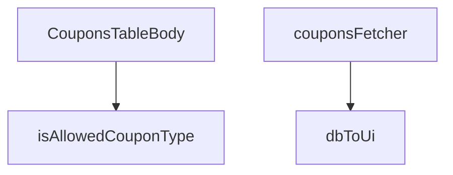

## Genel Bakış
Bu modül, admin panelinde kuponların tablo halinde listelenmesi ve yönetilmesi için kullanılan bir React bileşenidir. Veritabanından gelen kupon verilerini UI formatına dönüştürerek, filtrelenerek ve doğrulanarak tablonun gövdesini render eder.

## Fonksiyon Grupları
### Veri Doğrulama ve Dönüştürme
Bu grup, ham verilerin formatını kontrol eden ve UI için uygun forma dönüştüren yardımcı fonksiyonları içerir.
- isAllowedCouponType, dbToUi

### Veri Çekme
Bu grup, Supabase veritabanından kupon verilerini çekmek için kullanılan asenkron veri getirici fonksiyonu barındırır.
- couponsFetcher

### Bileşen Gösterimi
Bu grup, kupon tablosunun gövdesini oluşturan ana React fonksiyonel bileşenidir.
- CouponsTableBody

---

## AXIOMS – Mimari Varsayımlar

Bu modül, kupon listeleme ve filtreleme职能ini yerine getiren bir tablo bileşenidir. Doğru çalışması için aşağıdaki mimari varsayımlar geçerlidir:

**[Aksiyom 1]:** Eğer Supabase client (`Database` tipi ile) düzgün başlatılmamış ve kupon tablosuna erişilebilir durumda değilse, `couponsFetcher` fonksiyonu Promise reddetme (rejection) ile sonuçlanır ve kuponlar hiç yüklenemez.

**[Aksiyom 2]:** Eğer Supabase `Database` tipindeki şema, `DbCouponRow` yapısının beklediği alanları (en azından filtre ve dönüşüm için gerekli alanları) içermiyorsa, `couponsFetcher` çalışma zamanında tip uyumsuzluğu hatası verir veya `dbToUi` beklenmeyen alan erişimiyle başarısız olur.

**[Aksiyom 3]:** Eğer `FetchParams` yapısı, `couponsFetcher` içindeki Supabase sorgu parametreleriyle (ör. sayfalama, filtre, sıralama) uyumlu değilse, veriler eksik/yanlış getirilir veya sorgu hata verir.

**[Aksiyom 4]:** Eğer `DbCouponRow` yapısı `dbToUi` fonksiyonunun beklediği alanları (dönüştürme için gerekli tüm alanlar) içermiyorsa, UI katmanına geçiş sırasında veri kaybı veya `undefined`/`null` değer hatası oluşur.

**[Aksiyom 5]:** Eğer `isAllowedCouponType` fonksiyonunun dayandığı izin verilen kupon tipleri listesi tanımsız veya boş bırakılmışsa, tüm tipler reddedilebilir veya tüm tipler kabul edilebilir — hangisi olduğu uygulama mantığına bağlıdır, modül içinden bilinmiyor.

**[Aksiyom 6]:** Eğer `CouponsTableBody` bileşeni, üst bileşen tarafından `CouponRow[]` tipinde veri almıyorsa veya veri henüz yüklenmemiş (yükleme durumunda) ise bileşenin boş/bozuk render etmesi beklenir — bu durumun üst bileşen tarafından ele alınması gerekir.

---

## FONKSİYON DETAYLARI

### isAllowedCouponType
**Ne yapar**: Verilen bir değerin (`x`) izin verilen kupon türlerinden biri olup olmadığını kontrol eden bir **type guard** fonksiyonudur.
**Nasıl yapar**: Fonksiyon, `x` parametresinin `'percent'` veya `'fixed'` literal değerlerine eşit olup olmadığını test eder. Eşleşme durumunda `true` döndürür ve TypeScript'e `x` parametresinin `AllowedCouponType` tipi olduğunu guarantee eder (bu, bir *type narrowing* işlemidir).
**Parametreler**:
- x: unknown — Kontrol edilecek değer. Herhangi bir tipte olabilir ancak fonksiyon sadece belirli string değerleri kabul eder.
**Dönüş**: boolean — Değer `'percent'` veya `'fixed'` ise `true`, aksi halde `false`. Fonksiyonun dönüş tipi teknik olarak `x is AllowedCouponType` olarak belirtilmiştir; bu, bir type guard olduğunu gösterir.

### dbToUi
**Ne yapar**: Veritabanından (`DbCouponRow`) gelen bir kupon satırını, arayüz tarafında kullanılacak olan (`CouponRow`) formata dönüştürür.
**Nasıl yapar**: Fonksiyon, veritabanı alanlarını UI formatına eşler. `discount_type` alanını `'percentage'` -> `'percent'` veya `'fixed'` olarak map eder, sayısal değerleri `Number()` ile dönüştürür, boşluk (`null`) değerleri için varsayılanlar atar ve boolean dönüşümü yapar.
**Parametreler**:
- row: DbCouponRow — Veritabanından gelen, belirli alanlara (id, code, discount_type, vb.) sahip kupon satırı nesnesi.
**Dönüş**: CouponRow — UI tarafında使用准备的, standartlaştırılmış kupon verisi nesnesi. `DbCouponRow`'daki alan isimleri ve tipleri, UI'ın beklediği forma dönüştürülmüştür.

### couponsFetcher
**Ne yapar**: Supabase veritabanından kuponların bir listesini asenkron olarak çeken ve UI için formatlanmış halde döndüren ana veri获取函数ıdır.
**Nasıl yapar**: Fonksiyon önce oturumun taze olduğunu kontrol eder (`ensureSessionFresh`). Ardından, `supabase.from('coupons')` sorgusu başlatır, sadece gerekli sütunları seçer, `created_at` alanına göre azalan sırayla sıralar ve maksimum 200 satır ile sınırlar. Gelen veriyi `dbToUi` fonksiyonuyla dönüştürerek `CouponRow` dizisine map eder. Sonuç olarak hem satırları hem de toplam eşleşen sayısını (`totalMatched`) içeren bir `FetchResult` nesnesi döndürür.
**Parametreler**:
- supabase: SupabaseClient<Database> — Supabase istemcisi instance'ı. Veritabanı bağlantısını ve sorgu methodlarını sağlar.
- _params: FetchParams — Sayfalama veya filtreleme parametreleri. Bu fonksiyonda kullanılmamıştır (adında alt çizgi ile belirtilmiştir).
**Dönüş**: Promise<FetchResult<CouponRow>> — Asenkron bir promise. Çözüldüğünde, `rows` (dönüştürülmüş kupon satırları dizisi) ve `totalMatched` (toplam satır sayısı) alanlarını içeren bir nesne döndürür.

### CouponsTableBody
**Ne yapar**: Kuponların yer aldığı tablonun gövdesini render eden bir React bileşenidir.
**Nasıl yapar**: Fonksiyonun gövdesi verilmemiştir, ancak isminden ve dönüş tipinden (`React.FC`), bir React Fonksiyonel Bileşeni olduğu anlaşılmaktadır. Bu bileşen muhtemelen `couponsFetcher` hook'unu kullanarak verileri çeker ve her bir kupon satırı için bir `<tr>` veya benzeri bir tablo satırı oluşturur.
**Parametreler**: Parametre almamaktadır (React bileşenleri props alabilir ancak bu tanımda belirtilmemiştir).
**Dönüş**: React.FC — React Fonksiyonel Bileşeni. Bileşenin render edeceği JSX'i döndürür.

---

## INTERFACES

### CouponRow
- `id: string`
- `code: string`
- `type: 'percent' | 'fixed' | string`
- `value: number`
- `starts_at?: string | null`
- `ends_at?: string | null`
- `active: boolean`
- `usage_limit?: number | null`
- `used_count?: number | null`
- `created_at: string`

### DbCouponRow
- `id: string`
- `code: string`
- `discount_type: 'percentage' | 'fixed_amount' | string`
- `discount_value: number`
- `valid_from?: string | null`
- `valid_until?: string | null`
- `is_active: boolean`
- `usage_limit?: number | null`
- `used_count?: number | null`
- `created_at: string`

---

## TYPE ALIASES

### AllowedCouponType
```typescript
type AllowedCouponType = 'percent' | 'fixed'
```

---

## AST POINTERS

### [N1_NASIL] AST Pointer: `src/views/admin/CouponsTableBody.tsx`::isAllowedCouponType
- **params**: `(x: unknown)`
- **ic_degiskenler**: (yok — parametre üzerinde doğrudan kontrol yapılır)
- **Dönüş**: `boolean` — type guard; `x`'in `'percent'` veya `'fixed'` değerlerinden biri olup olmadığını test eder

---

### [N2_NASIL] AST Pointer: `src/views/admin/CouponsTableBody.tsx`::dbToUi
- **params**: `(row: DbCouponRow)`
- **ic_degiskenler**:
  - `row.id` — DB'den gelen kupon benzersiz kimliği, `CouponRow.id`'ye doğrudan eşlenir
  - `row.code` — DB'den gelen kupon kodu, `CouponRow.code`'a doğrudan eşlenir
  - `row.discount_type` — DB'deki indirim türü (`'percentage'` vs diğer); `'percentage'` ise `'percent'`, aksi halde `'fixed'` değerine dönüştürülür
  - `row.discount_value` — DB'deki indirim değeri (string/numeric); `Number()` ile sayıya çevrilerek `value`'ye atanır
  - `row.valid_from` — geçerlilik başlangıç tarihi; `?? null` ile nullish coalescing uygulanır → `starts_at`
  - `row.valid_until` — geçerlilik bitiş tarihi; `?? null` ile nullish coalescing uygulanır → `ends_at`
  - `row.is_active` — DB'deki aktiflik durumu (boolean veya truthy); `!!` ile kesin boolean'a çevrilir → `active`
  - `row.usage_limit` — kupon kullanım limiti; `?? null` ile nullish coalescing uygulanır → `usage_limit`
  - `row.used_count` — kuponun kaç kez kullanıldığı; `?? 0` ile varsayılan 0 atanır → `used_count`
  - `row.created_at` — kuponun oluşturulma zaman damgası → `created_at`
- **Dönüş**: `CouponRow` — DB satırını UI formatına dönüştüren mapped obje; `{ id, code, type, value, starts_at, ends_at, active, usage_limit, used_count, created_at }`

---

### [N3_NASIL] AST Pointer: `src/views/admin/CouponsTableBody.tsx`::couponsFetcher
- **params**: `(supabase: SupabaseClient<Database>, _params: FetchParams)`
- **ic_degiskenler**:
  - `data` — `supabase.from('coupons').select(...)` sorgusundan dönen ham satır verisi; `null` olabilir
  - `error` — Supabase sorgu hatası; `throw error` ile yukarı fırlatılır
  - `rows` — `(data || []).map((d) => dbToUi(d as DbCouponRow))` ile dönüştürülmüş `CouponRow[]` dizisi; boş dizi fallback'i uygulanır
- **Kullanılan dış bağımlılıklar**: `ensureSessionFresh()` — oturum tazeliği kontrolü (sorgudan önce çağrılır)
- **API çağrıları**: `supabase.from('coupons').select('id, code, discount_type, discount_value, valid_from, valid_until, is_active, usage_limit, used_count, created_at').order('created_at', { ascending: false }).limit(200)`
- **Dönüş**: `Promise<FetchResult<CouponRow>>` — `{ rows: CouponRow[], totalMatched: number }` objesi; `totalMatched` her zaman `rows.length`'e eşittir (sayfalama yapılmadığından)

---

### [N4_NASIL] AST Pointer: `src/views/admin/CouponsTableBody.tsx`::CouponsTableBody (toggleActive handler)
- **params**: `(row: CouponRow)`
- **ic_degiskenler**: (yerel değişken yok — tüm mantık `try/catch` ve closure değişkenleri üzerindendir)
- **Closure değişkenleri**:
  - `hasWriteAccess` — boolean, kuponlar üzerinde yazma izni olup olmadığını belirler; `!hasWriteAccess` ise `toast.error` ile hata gösterilir
  - `toast` — `sonner` kütüphanesinden import edilen toast bildirim fonksiyonu
  - `t` — i18n çeviri fonksiyonu; `admin.coupons.toasts.noPermission`, `admin.coupons.toasts.activated`, `admin.coupons.toasts.deactivated` anahtarları kullanılır
  - `mutateWithAudit` — audit loglu mutasyon yardımcısı; `'coupons'` resource'u, `'UPDATE'` action'ı ile çağrılır
  - `supabaseBrowserClient` — tarayıcı tarafı Supabase istemcisi; `mutateWithAudit`'e ve inner `fn`'deki `update` sorgusuna verilir
  - `table` — DataTable instance; `table.reload()` ile veri yenilenir
- **API çağrıları**: `mutateWithAudit(supabaseBrowserClient, { resource: 'coupons', canWrite: hasWriteAccess, action: 'UPDATE', rowPk: row.id, before: { is_active: row.active }, after: { is_active: !row.active }, auditedByEdge: false, fn: ... })`
- **Inner fn API çağrısı**: `supabaseBrowserClient.from('coupons').update({ is_active: !row.active }).eq('id', row.id)`
- **Hata yönetimi**: `catch (e)` bloğu; `e instanceof AdminPermissionError` kontrolü ile `noPermission` veya `statusFailed` toast gösterilir
- **Dönüş**: `void` — yan etki: toast bildirimi + kupon durumu toggling + tablo reload

---

### [N5_NASIL] AST Pointer: `src/views/admin/C

---


## MERMAID CALL GRAPH


## NODE ID STANDARD

  file: src\views\admin\CouponsTableBody.tsx
  function: src\views\admin\CouponsTableBody.tsx::isAllowedCouponType
  function: src\views\admin\CouponsTableBody.tsx::dbToUi
  function: src\views\admin\CouponsTableBody.tsx::couponsFetcher
  function: src\views\admin\CouponsTableBody.tsx::CouponsTableBody

---

## DISA AKTARILANLAR (EXPORTS)
  export: CouponsTableBody
  export: couponsFetcher
  export: dbToUi
  export: isAllowedCouponType

---

## STİL TOKENLERİ

### Arbitrary Değerler (token'a geçirilmemiş)
Yok — tüm stiller token'a geçirilmiş. ✅

### Kullanılan Token'lar (zaten token'a geçirilmiş)
- (yok)

### Tailwind Sınıf Özeti
- **Renkler:** `bg-cyan-500`, `bg-cyan-500/10`, `bg-emerald-500`, `bg-emerald-500/10`, `bg-gradient-to-r`, `bg-slate-500`, `bg-slate-500/10`, `bg-slate-800`, `bg-white/5`, `border-cyan-500/20`, `border-emerald-500/20`, `border-white/10`, `border-white/5`, `from-cyan-500`, `hover:bg-white/5`
- **Layout:** `flex`, `flex-col`, `from-cyan-500`, `gap-1`, `gap-1.5`, `gap-2`, `gap-3`, `gap-5`, `grid`, `grid-cols-1`, `h-1`, `h-1.5`, `h-4`, `h-42px`, `h-full`
- **Varyant/Responsive:** `:`, `focus-visible:`, `hover:`, `md:` önekleri
- **Yardımcı Sınıflar:** `$`, `${adminButtonPrimaryClass`, `${adminCardPaddedClass`, `${adminInputClass`, `${hasWriteAccess`, `${r.active`, `${r.type`, `:`, `===`, `border`, `cursor-default`, `cursor-pointer`, `duration-1000`, `focus-visible:ring-cyan-500/20`, `font-black`