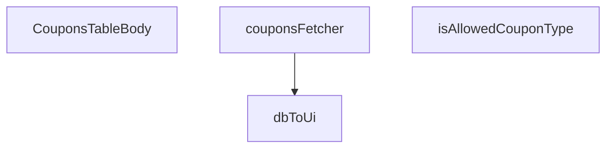

## Genel Bakış
Bu modül, admin panelinde kuponların tablo halinde listelenmesi ve yönetilmesi için kullanılan bir React bileşenidir. Veritabanından gelen kupon verilerini UI formatına dönüştürerek, filtrelenerek ve doğrulanarak tablonun gövdesini render eder.

## Fonksiyon Grupları
### Veri Doğrulama ve Dönüştürme
Bu grup, ham verilerin formatını kontrol eden ve UI için uygun forma dönüştüren yardımcı fonksiyonları içerir.
- isAllowedCouponType, dbToUi

### Veri Çekme
Bu grup, Supabase veritabanından kupon verilerini çekmek için kullanılan asenkron veri getirici fonksiyonu barındırır.
- couponsFetcher

### Bileşen Gösterimi
Bu grup, kupon tablosunun gövdesini oluşturan ana React fonksiyonel bileşenidir.
- CouponsTableBody

---

## AXIOMS – Mimari Varsayımlar

Bu modül, kupon listeleme ve filtreleme fonksiyonunu yerine getiren bir tablo bileşenidir. Doğru çalışması için aşağıdaki mimari varsayımlar geçerlidir:

**[Aksiyom 1]:** Eğer Supabase client (`Database` tipi ile) düzgün başlatılmamış ve kupon tablosuna erişilebilir durumda değilse, `couponsFetcher` fonksiyonu Promise reddetme ile sonuçlanır ve kuponlar hiç yüklenemez.

**[Aksiyom 2]:** Eğer Supabase `Database` tipindeki şema, `DbCouponRow` yapısının beklediği alanları (en azından filtre ve dönüşüm için gerekli alanları) içermiyorsa, `couponsFetcher` çalışma zamanında tip uyumsuzluğu hatası verir veya `dbToUi` beklenmeyen alan erişimiyle başarısız olur.

**[Aksiyom 3]:** Eğer `FetchParams` yapısı, `couponsFetcher` içindeki Supabase sorgu parametreleriyle uyumlu değilse, kupon verisi filtrelenemez veya sayfalanamaz, bu da bileşenin boş veya hatalı veri göstermesine neden olur.

---

## AXIOMS – Mimari Varsayımlar

Bu modül, veritabanı kupon verilerini UI formatına dönüştürerek admin panelinde listeleyen bir React bileşenidir. Doğru çalışması için aşağıdaki mimari varsayımlar geçerlidir:

**[Aksiyom 1 - Kupon Tipi Doğrulama Kapsamı]:** Eğer `isAllowedCouponType` tarafından kabul edilmeyen bir kupon tipi `dbToUi` fonksiyonuna girerse, beklenmeyen bir UI dönüşümü veya hata oluşur.

**[Aksiyom 2 - Veritabanı Şema Uyumluluğu]:** Eğer `DbCouponRow` tipi ile Supabase veritabanındaki gerçek kupon tablosu yapısı uyumlu değilse, `couponsFetcher` çalışma zamanında hata fırlatır veya eksik alanlarla sonuç döner.

**[Aksiyom 3 - Supabase Bağlantı Zorunluluğu]:** Eğer `couponsFetcher` fonksiyonuna geçersiz veya yapılandırılmamış bir `SupabaseClient<Database>` nesnesi verilirse, kupon verileri çekilemez ve `FetchResult<CouponRow>` geçersiz bir sonuç döner.

**[Aksiyom 4 - Kupon Oluşturma Şeması Varlığı]:** Eğer `createCouponSchema` modülde tanımlı değilse, kupon oluşturma/flitreleme işlemleri için doğrulama yapılamaz ve invalid veri UI'a sızabilir.

**[Aksiyom 5 - DB-to-UI Alan Eşleşme Zorunluluğu]:** Eğer `DbCouponRow` ile `CouponRow` tipleri arasındaki alan dönüşümleri tam eşleşmiyorsa (örn: `dbToUi` mapping'i eksik alan bırakıyorsa), `CouponsTableBody` bileşeni render sırasında hata verir veya eksik veri gösterir.

**[Aksiyom 6 - FetchParams Yapısı]:** Eğer `couponsFetcher`'a geçilen `_params: FetchParams` yapısı Supabase sorgusu tarafından beklenen filtreleme/sayfalama parametrelerini içermiyorsa, istenen kayıt kümesiyle sonuç dönmez.

---

## FONKSİYON DETAYLARI

### isAllowedCouponType
**Ne yapar**: Verilen bir değerin, izin verilen kupon türlerinden biri olup olmadığını doğrular. Bu bir "type guard" fonksiyonudur ve TypeScript'in type narrowing özelliğini kullanarak TypeScript derleyicisine, koşul sağlanırsa `x` parametresinin `AllowedCouponType` türünde olduğunu bildirir.

**Nasıl yapar**: Fonksiyon, gelen `x` parametresinin `'percent'` veya `'fixed'` string değerlerinden birine eşit olup olmadığını basit bir eşitlik kontrolü ile test eder. Eşleşme durumunda `true` döner, aksi halde `false` döner. Bu kontrol, TypeScript'te bir literal union tipini doğrulamak için tipik bir kalıp kullanır.

**Parametreler**:
- `x`: `unknown` — Doğrulanacak değer. Fonksiyon, bu değerin `AllowedCouponType` (muhtemelen `'percent' | 'fixed'` union tipi) olup olmadığını test eder.

**Dönüş**: `x is AllowedCouponType` — Boolean döner. `true` dönüşü, `x` parametresinin aslında `AllowedCouponType` tipinde olduğunu garanti eder.

### dbToUi
**Ne yapar**: Veritabanından (`DbCouponRow`) gelen bir kupon satırını, arayüz tarafında kullanılacak olan (`CouponRow`) formata dönüştürür.
**Nasıl yapar**: Fonksiyon, veritabanı alanlarını UI formatına eşler. `discount_type` alanını `'percentage'` -> `'percent'` veya `'fixed'` olarak map eder, sayısal değerleri `Number()` ile dönüştürür, boşluk (`null`) değerleri için varsayılanlar atar ve boolean dönüşümü yapar.
**Parametreler**:
- row: DbCouponRow — Veritabanından gelen, belirli alanlara (id, code, discount_type, vb.) sahip kupon satırı nesnesi.
**Dönüş**: CouponRow — UI tarafında使用准备的, standartlaştırılmış kupon verisi nesnesi. `DbCouponRow`'daki alan isimleri ve tipleri, UI'ın beklediği forma dönüştürülmüştür.

### couponsFetcher
**Ne yapar**: Supabase veritabanından kuponların bir listesini asenkron olarak çeken ve UI için formatlanmış halde döndüren ana veri获取函数ıdır.
**Nasıl yapar**: Fonksiyon önce oturumun taze olduğunu kontrol eder (`ensureSessionFresh`). Ardından, `supabase.from('coupons')` sorgusu başlatır, sadece gerekli sütunları seçer, `created_at` alanına göre azalan sırayla sıralar ve maksimum 200 satır ile sınırlar. Gelen veriyi `dbToUi` fonksiyonuyla dönüştürerek `CouponRow` dizisine map eder. Sonuç olarak hem satırları hem de toplam eşleşen sayısını (`totalMatched`) içeren bir `FetchResult` nesnesi döndürür.
**Parametreler**:
- supabase: SupabaseClient<Database> — Supabase istemcisi instance'ı. Veritabanı bağlantısını ve sorgu methodlarını sağlar.
- _params: FetchParams — Sayfalama veya filtreleme parametreleri. Bu fonksiyonda kullanılmamıştır (adında alt çizgi ile belirtilmiştir).
**Dönüş**: Promise<FetchResult<CouponRow>> — Asenkron bir promise. Çözüldüğünde, `rows` (dönüştürülmüş kupon satırları dizisi) ve `totalMatched` (toplam satır sayısı) alanlarını içeren bir nesne döndürür.

### CouponsTableBody
**Ne yapar**: Kuponların yer aldığı tablonun gövdesini render eden bir React bileşenidir.
**Nasıl yapar**: Fonksiyonun gövdesi verilmemiştir, ancak isminden ve dönüş tipinden (`React.FC`), bir React Fonksiyonel Bileşeni olduğu anlaşılmaktadır. Bu bileşen muhtemelen `couponsFetcher` hook'unu kullanarak verileri çeker ve her bir kupon satırı için bir `<tr>` veya benzeri bir tablo satırı oluşturur.
**Parametreler**: Parametre almamaktadır (React bileşenleri props alabilir ancak bu tanımda belirtilmemiştir).
**Dönüş**: React.FC — React Fonksiyonel Bileşeni. Bileşenin render edeceği JSX'i döndürür.

---

## İTHALATLAR (IMPORTS)
- import: ../../components/admin/AdminEmptyState::AdminEmptyState
- import: ../../components/admin/AdminToolbar::AdminToolbar
- import: ../../components/admin/ExportMenu::ExportMenu
- import: ../../components/admin/data-table/BulkBar::BulkBar
- import: ../../components/admin/data-table/BulkBar::type BulkAction
- import: ../../components/admin/data-table/DataTableKit::DataTableKit
- import: ../../components/admin/data-table/FacetedFilter::FacetedFilter
- import: ../../components/admin/data-table/types::type { AdminColumn, DataTableFacet }
- import: ../../hooks/useAdminTable::type FetchParams
- import: ../../hooks/useAdminTable::type FetchResult
- import: ../../hooks/useAdminTable::useAdminTable
- import: ../../hooks/useRole::useRole
- import: ../../hooks/useTenant::useTenant
- import: ../../i18n/I18nProvider::useI18n
- import: ../../i18n/datetime::formatDateTime
- import: ../../i18n/format::formatCurrency
- import: ../../lib/ensureSessionFresh::ensureSessionFresh
- import: ../../types/database.types::type { Database }
- import: @/lib/admin/mutateWithAudit::AdminPermissionError
- import: @/lib/admin/mutateWithAudit::mutateWithAudit
- import: @/lib/supabase/client::supabaseBrowserClient
- import: @supabase/supabase-js::type { SupabaseClient }
- import: lucide-react::SearchX
- import: lucide-react::Ticket
- import: react::React
- import: react::useCallback
- import: react::useEffect
- import: react::useMemo
- import: react::useRef
- import: react::useState
- import: sonner::toast
- import: zod::z

---

## INTERFACES

### CouponRow
- `id: string`
- `code: string`
- `type: 'percent' | 'fixed' | string`
- `value: number`
- `starts_at?: string | null`
- `ends_at?: string | null`
- `active: boolean`
- `usage_limit?: number | null`
- `used_count?: number | null`
- `created_at: string`

### DbCouponRow
- `id: string`
- `code: string`
- `discount_type: 'percentage' | 'fixed_amount' | string`
- `discount_value: number`
- `valid_from?: string | null`
- `valid_until?: string | null`
- `is_active: boolean`
- `usage_limit?: number | null`
- `used_count?: number | null`
- `created_at: string`

---

## TYPE ALIASES

### AllowedCouponType
```typescript
type AllowedCouponType = 'percent' | 'fixed'
```

---

## SABİTLER
- **createCouponSchema** (call) — `z.object({
  code: z
    .string()
    .min(3, { message: 'admin.coupons.v...`

---

## AST POINTERS

### [N1_NASIL] AST Pointer: CouponsTableBody.tsx::isAllowedCouponType
- **params**: (x: unknown)
- **ic_degiskenler**: (yok)
- **Dönüş**: boolean — x değerinin 'percent' veya 'fixed' olup olmadığını kontrol eden type guard

### [N2_NASIL] AST Pointer: CouponsTableBody.tsx::dbToUi
- **params**: (row: DbCouponRow)
- **ic_degiskenler**: (yok — doğrudan return edilen object literal içinde tüm dönüşümler yapılır)
- **Dönüş**: CouponRow — Veritabanı satırını UI formatına dönüştürülmüş kupon nesnesi

### [N3_NASIL] AST Pointer: CouponsTableBody.tsx::couponsFetcher
- **params**: (supabase: SupabaseClient<Database>, _params: FetchParams)
- **ic_degiskenler**:
  - `data` — Supabase sorgusundan dönen kupon verileri
  - `error` — Supabase sorgusu hata nesnesi
  - `rows` — dbToUi ile dönüştürülmüş kupon satırları dizisi
- **Dönüş**: Promise<FetchResult<CouponRow>> — Kupon listesi ve toplam eşleşme sayısı

### [N4_NASIL] AST Pointer: CouponsTableBody.tsx::CouponsTableBody
- **params**: (parametre yok)
- **ic_degiskenler**:
  - `ch` — Supabase real-time kanalı, kupon tablosundaki değişiklikleri dinler
  - `refetchTimer` — useRef ile oluşturulan timer, yeniden yükleme için debounce yapar
- **Dönüş**: React.FC — Kupon tablosunu gösteren React bileşeni (yan etkiler: Supabase real-time aboneliği, toast bildirimleri, veritabanı güncellemeleri)

---


## MERMAID CALL GRAPH


## NODE ID STANDARD

  file: src\views\admin\CouponsTableBody.tsx
  function: src\views\admin\CouponsTableBody.tsx::isAllowedCouponType
  function: src\views\admin\CouponsTableBody.tsx::dbToUi
  function: src\views\admin\CouponsTableBody.tsx::couponsFetcher
  function: src\views\admin\CouponsTableBody.tsx::CouponsTableBody

---

## DISA AKTARILANLAR (EXPORTS)
  export: CouponsTableBody
  export: couponsFetcher
  export: dbToUi
  export: isAllowedCouponType

---

## STİL TOKENLERİ

### Arbitrary Değerler (token'a geçirilmemiş)
Yok — tüm stiller token'a geçirilmiş. ✅

### Kullanılan Token'lar (zaten token'a geçirilmiş)
- (yok)

### Tailwind Sınıf Özeti
- **Renkler:** `bg-cyan-500`, `bg-cyan-500/10`, `bg-emerald-500`, `bg-emerald-500/10`, `bg-gradient-to-r`, `bg-slate-500`, `bg-slate-500/10`, `bg-slate-800`, `bg-white/5`, `border-cyan-500/20`, `border-emerald-500/20`, `border-rose-500/50`, `border-white/10`, `border-white/5`, `focus:border-rose-500/50`
- **Layout:** `flex`, `flex-col`, `from-cyan-500`, `gap-1`, `gap-1.5`, `gap-2`, `gap-3`, `gap-5`, `grid`, `grid-cols-1`, `h-1`, `h-1.5`, `h-10`, `h-4`, `h-full`
- **Varyant/Responsive:** `:`, `focus-visible:`, `focus:`, `hover:`, `md:` önekleri
- **Yardımcı Sınıflar:** `$`, `${adminButtonPrimaryClass`, `${adminCardPaddedClass`, `${adminInputClass`, `${adminSelectClass`, `${errors.code`, `${errors.ends_at`, `${errors.starts_at`, `${errors.type`, `${errors.usage_limit`, `${errors.value`, `${hasWriteAccess`, `${r.active`, `${r.type`, `:`