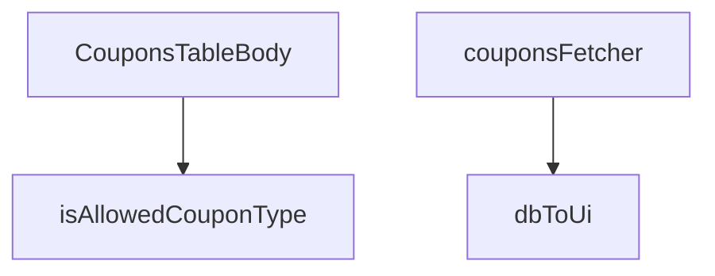

## Genel Bakış
Bu modül, admin panelinde kuponların listelendiği tablonun gövdesini oluşturan React bileşenini ve ona destek veren yardımcı fonksiyonları içerir. Veritabanından kupon verilerini çeker, bu veriyi arayüzde kullanılacak formata dönüştürür ve tablo içinde görüntüler.

## Fonksiyon Grupları
### Veri Doğrulama ve Dönüştürme
Veritabanından gelen ham kupon verisini arayüz bileşenlerinin kullanabileceği formata çevirir ve kupon tiplerinin geçerliliğini kontrol eder.
- isAllowedCouponType, dbToUi

### Veri Çekme
Supabase istemcisini kullanarak kupon kayıtlarını veritabanından asenkron olarak getirir ve sonuçları döndürür.
- couponsFetcher

### Bileşen
Kuponlar tablosunun gövdesini oluşturan ana React bileşenidir; veri çekme ve görüntüleme mantığını bir arada yönetir.
- CouponsTableBody

---

## AXIOMS – Mimari Varsayımlar
- Bu modül davranışsal mantık içermez (salt veri / konfigürasyon / tip tanımı).
- [Aksiyom 1]: Modülün dışa açtığı yapı (anahtar kümesi / şema) bir sözleşmedir; tüketiciler bu sabit yapıya bağlıdır — kırıcı değişiklik tüm tüketicileri etkiler.
- [Aksiyom 2]: Bir öğe ekleme/çıkarma yapısal-uyumlu olmalı; ilgili tipler ve seçiciler aynı commit'te güncel tutulmalıdır.

---

## FONKSİYON DETAYLARI

### isAllowedCouponType
**Ne yapar**: Verilen değerin geçerli bir kupon tipi olup olmadığını kontrol eden bir type guard fonksiyonudur. TypeScript tip daraltma (type narrowing) sağlar; fonksiyon `true` döndürdüğünde `x` parametresi `AllowedCouponType` tipine daraltılır.

**Nasıl yapar**: Parametre olarak aldığı `x` değerini `'percent'` ve `'fixed'` string değerleriyle karşılaştırır. Her iki değerden biriyle eşleşiyorsa `true`, aksi halde `false` döndürür. Strict equality (`===`) kullanarak tip dönüşümü olmadan kesin karşılaştırma yapar.

**Parametreler**:
- x: unknown — Kontrol edilecek değer; herhangi bir türde olabilir

**Dönüş**: `x is AllowedCouponType` — TypeScript tip predicate dönüşü; `true` döndüğünde `x` parametresi `AllowedCouponType` tipinde kabul edilir

### dbToUi
**Ne yapar**: Geliştirildi ancak detay üretilemedi.

### couponsFetcher
**Ne yapar**: Geliştirildi ancak detay üretilemedi.

### CouponsTableBody
**Ne yapar**: Geliştirildi ancak detay üretilemedi.

---

## İTHALATLAR (IMPORTS)
- import: ../../components/admin/AdminEmptyState::AdminEmptyState
- import: ../../components/admin/AdminToolbar::AdminToolbar
- import: ../../components/admin/ExportMenu::ExportMenu
- import: ../../components/admin/data-table/BulkBar::BulkBar
- import: ../../components/admin/data-table/BulkBar::type BulkAction
- import: ../../components/admin/data-table/DataTableKit::DataTableKit
- import: ../../components/admin/data-table/FacetedFilter::FacetedFilter
- import: ../../components/admin/data-table/types::type { AdminColumn, DataTableFacet }
- import: ../../hooks/useAdminTable::type FetchParams
- import: ../../hooks/useAdminTable::type FetchResult
- import: ../../hooks/useAdminTable::useAdminTable
- import: ../../hooks/useRole::useRole
- import: ../../hooks/useTenant::useTenant
- import: ../../i18n/I18nProvider::useI18n
- import: ../../i18n/currency::SYSTEM_CURRENCY
- import: ../../i18n/datetime::formatDateTime
- import: ../../i18n/format::formatCurrency
- import: ../../lib/ensureSessionFresh::ensureSessionFresh
- import: ../../types/database.types::type { Database }
- import: @/lib/admin/mutateWithAudit::AdminPermissionError
- import: @/lib/admin/mutateWithAudit::mutateWithAudit
- import: @/lib/supabase/client::supabaseBrowserClient
- import: @supabase/supabase-js::type { SupabaseClient }
- import: lucide-react::SearchX
- import: lucide-react::Ticket
- import: react::React
- import: react::useCallback
- import: react::useEffect
- import: react::useMemo
- import: react::useRef
- import: react::useState
- import: sonner::toast
- import: zod::z

---

## INTERFACES

### CouponRow
- `id: string`
- `code: string`
- `type: 'percent' | 'fixed' | string`
- `value: number`
- `starts_at?: string | null`
- `ends_at?: string | null`
- `active: boolean`
- `usage_limit?: number | null`
- `used_count?: number | null`
- `created_at: string`

### DbCouponRow
- `id: string`
- `code: string`
- `discount_type: 'percentage' | 'fixed_amount' | string`
- `discount_value: number`
- `valid_from?: string | null`
- `valid_until?: string | null`
- `is_active: boolean`
- `usage_limit?: number | null`
- `used_count?: number | null`
- `created_at: string`

---

## TYPE ALIASES

### AllowedCouponType
```typescript
type AllowedCouponType = 'percent' | 'fixed'
```

---

## SABİTLER
- **createCouponSchema** (call) — `z.object({
  code: z
    .string()
    .min(3, { message: 'admin.coupons.v...`

---

## AST POINTERS

### [N1_NASIL] AST Pointer: src/views/admin/CouponsTableBody.tsx::isAllowedCouponType
- **params**: `x` — kontrol edilecek değer
- **ic_degiskenler**: yok
- **Dönüş**: boolean (x is AllowedCouponType)

### [N2_NASIL] AST Pointer: src/views/admin/CouponsTableBody.tsx::dbToUi
- **params**: `row` — veritabanından gelen kupon satırı (DbCouponRow)
- **ic_degiskenler**: yok
- **Dönüş**: CouponRow objesi — `id`, `code`, `type`, `value`, `starts_at`, `ends_at`, `active`, `usage_limit`, `used_count`, `created_at` alanlarını içerir

### [N3_NASIL] AST Pointer: src/views/admin/CouponsTableBody.tsx::couponsFetcher
- **params**: `supabase` — Supabase istemcisi (SupabaseClient<Database>), `_params` — getirme parametreleri (FetchParams, kullanılmıyor)
- **ic_degiskenler**:
  - `data` — `supabase.from('coupons').select(...)` sorgusundan dönen veri
  - `error` — sorgu hatası
  - `rows` — `data` dizisinin her elemanını `dbToUi` ile dönüştürmesiyle oluşan CouponRow dizisi
- **Dönüş**: Promise<FetchResult<CouponRow>> — `{ rows, totalMatched }` objesi

### [N4_NASIL] AST Pointer: src/views/admin/CouponsTableBody.tsx::anonymous_1 (percent validasyonu)
- **params**: `data` — doğrulanacak kupon verisi
- **ic_degiskenler**: yok
- **Dönüş**: boolean — tip 'percent' ise `data.value <= 100` kontrolü, aksi halde `true`

### [N5_NASIL] AST Pointer: src/views/admin/CouponsTableBody.tsx::anonymous_2 (tarih validasyonu)
- **params**: `data` — doğrulanacak kupon verisi
- **ic_degiskenler**: yok
- **Dönüş**: boolean — `starts_at` ve `ends_at` varsa başlangıç < bitiş kontrolü, aksi halde `true`

### [N6_NASIL] AST Pointer: src/views/admin/CouponsTableBody.tsx::anonymous_3 (useEffect cleanup fonksiyonu)
- **params**: yok
- **ic_degiskenler**:
  - `ch` — `supabaseBrowserClient.channel(...)` ile oluşturulan ve `.subscribe()` ile dinlemeye alınan Supabase realtime kanalı
- **Dönüş**: cleanup fonksiyonu — `supabaseBrowserClient.removeChannel(ch)` çağırır, `refetchTimer.current` varsa temizler

### [N7_NASIL] AST Pointer: src/views/admin/CouponsTableBody.tsx::anonymous_4 (postgres_changes callback)
- **params**: yok
- **ic_degiskenler**: yok
- **Dönüş**: yok — `refetchTimer.current` varsa temizler, 400ms gecikmeyle `reloadRef.current()` çağırır

### [N8_NASIL] AST Pointer: src/views/admin/CouponsTableBody.tsx::anonymous_5 (toggleActive)
- **params**: `row` — CouponRow
- **ic_degiskenler**: yok
- **Dönüş**: Promise<void> — `mutateWithAudit` ile `coupons` tablosundaki `is_active` alanını tersine çevirir, başarılıysa `table.reload()` çağırır

### [N9_NASIL] AST Pointer: src/views/admin/CouponsTableBody.tsx::anonymous_6 (toggleActive içindeki fn)
- **params**: yok
- **ic_degiskenler**: yok
- **Dönüş**: Promise<void> — `supabaseBrowserClient.from('coupons').update({ is_active: !row.active }).eq('id', row.id)` sorgusu

### [N10_NASIL] AST Pointer: src/views/admin/CouponsTableBody.tsx::anonymous_7 (bulkSetActive)
- **params**: `active` — boolean (yeni aktiflik durumu)
- **ic_degiskenler**:
  - `ids` — `table.selection.selectedIds` ile alınan seçili satır ID'leri dizisi
- **Dönüş**: Promise<void> — `mutateWithAudit` ile seçili satırların `is_active` alanını günceller, başarılıysa `table.selection.clear()` ve `table.reload()` çağırır

### [N11_NASIL] AST Pointer: src/views/admin/CouponsTableBody.tsx::anonymous_8 (bulkSetActive içindeki fn)
- **params**: yok
- **ic_degiskenler**: yok
- **Dönüş**: Promise<void> — `supabaseBrowserClient.from('coupons').update({ is_active: active }).in('id', ids)` sorgusu

### [N12_NASIL] AST Pointer: src/views/admin/CouponsTableBody.tsx::anonymous_9 (handleSubmit)
- **params**: yok
- **ic_degiskenler**:
  - `parsedValue` — `form.value` değerinin `Number()` ile dönüştürülmüş hali; boşsa `undefined`
  - `parsedLimit` — `form.usage_limit` değerinin `Number()` ile dönüştürülmüş hali; boşsa `null`
  - `result` — `createCouponSchema.safeParse(...)` sonucu
  - `fieldErrors` — `result.error.issues` dizisinden üretilen alan-hata eşleştirmesi (Record<string, string>)
  - `validatedData` — `result.data` (başarılı parse sonucu)
- **Dönüş**: Promise<void> — `mutateWithAudit` ile `admin-create-coupon` edge function'ını çağırır, başarılıysa formu sıfırlar ve `table.reload()` çağırır

### [N13_NASIL] AST Pointer: src/views/admin/CouponsTableBody.tsx::anonymous_10 (handleSubmit içindeki fn)
- **params**: yok
- **ic_degiskenler**:
  - `response` — `supabaseBrowserClient.functions.invoke('admin-create-coupon', { body: {...} })` sonucu
  - `data` — `response.data` (DbCouponRow | null)
  - `error` — `response.error`
- **Dönüş**: Promise<void> — hata varsa fırlatır, `data` yoksa `'no_data'` hatası fırlatır

### [N14_NASIL] AST Pointer: src/views/admin/CouponsTableBody.tsx::anonymous_11 (columns)
- **params**: yok
- **ic_degiskenler**: yok
- **Dönüş**: Column[] dizisi — `code`, `type`, `value`, `active`, `validity`, `usage`, `created_at` sütunlarını içerir

### [N15_NASIL] AST Pointer: src/views/admin/CouponsTableBody.tsx::anonymous_12 (filters)
- **params**: yok
- **ic_degiskenler**:
  - `percent` — `table.allRows` içinde `type === 'percent'` olan satır sayısı
  - `fixed` — `table.allRows` içinde `type === 'fixed'` olan satır sayısı
  - `active` — `table.allRows` içinde `active === true` olan satır sayısı
  - `passive` — `table.allRows` içinde `active === false` olan satır sayısı
- **Dönüş**: Filter[] dizisi — `type` ve `active` facet'larını içerir

### [N16_NASIL] AST Pointer: src/views/admin/CouponsTableBody.tsx::anonymous_13 (bulkActions)
- **params**: yok
- **ic_degiskenler**: yok
- **Dönüş**: BulkAction[] dizisi — `activate` ve `deactivate` aksiyonlarını içerir

### [N17_NASIL] AST Pointer: src/views/admin/CouponsTableBody.tsx::anonymous_14 (exportToCsv)
- **params**: yok
- **ic_degiskenler**:
  - `rows` — `table.fetchAllForExport()` ile alınan tüm satırlar
  - `cols` — CSV sütun başlıkları dizisi (`['id', 'code', 'type', 'value', 'active', 'usage_limit', 'used_count', 'created_at']`)
  - `escape` — değerleri CSV formatına uygun hale getiren fonksiyon (çift tırnak escape)
  - `lines` — her satırı CSV formatına dönüştüren dizi
  - `csv` — BOM + sütun başlıkları + satırlar birleştirilmiş CSV string'i
  - `blob` — `new Blob([csv], { type: 'text/csv;charset=utf-8;' })` ile oluşturulan Blob nesnesi
  - `url` — `URL.createObjectURL(blob)` ile oluşturulan geçici URL
  - `a` — `document.createElement('a')` ile oluşturulan indirme bağlantısı elementi
- **Dönüş**: Promise<void> — CSV dosyasını tarayıcıda indirir

### [N18_NASIL] AST Pointer: src/views/admin/CouponsTableBody.tsx::anonymous_15 (code onChange)
- **params**: `e` — ChangeEvent<HTMLInputElement>
- **ic_degiskenler**: yok
- **Dönüş**: void — `form.code` alanını büyük harfe çevirerek günceller, `errors.code` sıfırlar

### [N19_NASIL] AST Pointer: src/views/admin/CouponsTableBody.tsx::anonymous_16 (type onChange)
- **params**: `e` — ChangeEvent<HTMLSelectElement>
- **ic_degiskenler**:
  - `nextType` — `e.target.value` ile alınan yeni tip değeri
- **Dönüş**: void — `isAllowedCouponType(nextType)` kontrolü yapar, geçerliyse `form.type` günceller, `errors.type` sıfırlar

### [N20_NASIL] AST Pointer: src/views/admin/CouponsTableBody.tsx::anonymous_17 (value onChange)
- **params**: `e` — ChangeEvent<HTMLInputElement>
- **ic_degiskenler**: yok
- **Dönüş**: void — `form.value` alanını `Number()` ile dönüştürerek günceller, boşsa `undefined`, `errors.value` sıfırlar

### [N21_NASIL] AST Pointer: src/views/admin/CouponsTableBody.tsx::anonymous_18 (starts_at onChange)
- **params**: `e` — ChangeEvent<HTMLInputElement>
- **ic_degiskenler**: yok
- **Dönüş**: void — `form.starts_at` alanını günceller, `errors.starts_at` ve `errors.ends_at` sıfırlar

### [N22_NASIL] AST Pointer: src/views/admin/CouponsTableBody.tsx::anonymous_19 (ends_at onChange)
- **params**: `e` — ChangeEvent<HTMLInputElement>
- **ic_degiskenler**: yok
- **Dönüş**: void — `form.ends_at` alanını günceller, `errors.ends_at` ve `errors.starts_at` sıfırlar

### [N23_NASIL] AST Pointer: src/views/admin/CouponsTableBody.tsx::anonymous_20 (usage_limit onChange)
- **params**: `e` — ChangeEvent<HTMLInputElement>
- **ic_degiskenler**:
  - `raw` — `e.target.value` değerinin `Number()` ile dönüştürülmüş hali; boşsa `null`
- **Dönüş**: void — `form.usage_limit` alanını günceller (`raw > 0` ise `raw`, aksi halde `null`), `errors.usage_limit` sıfırlar

### [N24_NASIL] AST Pointer: src/views/admin/CouponsTableBody.tsx::anonymous_21 (facet render)
- **params**: `facet` — filtre facet objesi
- **ic_degiskenler**: yok
- **Dönüş**: JSX.Element — `<FacetedFilter>` bileşeni, `table.filtering.filters[facet.key]` ile seçili değerleri ve `table.filtering.setFilter` ile onChange handler'ını iletir

---


## MERMAID CALL GRAPH


## NODE ID STANDARD

  file: CouponsTableBody.tsx
  function: CouponsTableBody.tsx::isAllowedCouponType
  function: CouponsTableBody.tsx::dbToUi
  function: CouponsTableBody.tsx::couponsFetcher
  function: CouponsTableBody.tsx::CouponsTableBody

---

## DISA AKTARILANLAR (EXPORTS)
  export: CouponsTableBody
  export: couponsFetcher
  export: dbToUi
  export: isAllowedCouponType

---

## STİL TOKENLERİ

### Arbitrary Değerler (token'a geçirilmemiş)
Yok — tüm stiller token'a geçirilmiş. ✅

### Kullanılan Token'lar (zaten token'a geçirilmiş)
- (yok)

### Tailwind Sınıf Özeti
- **Renkler:** `bg-admin-accent`, `bg-admin-accent-weak`, `bg-admin-success`, `bg-admin-success-weak`, `bg-admin-surface`, `bg-admin-surface-2`, `bg-admin-surface-3`, `bg-gradient-to-r`, `border-admin-accent/30`, `border-admin-border`, `border-admin-danger/30`, `border-admin-success/30`, `focus-visible:border-admin-danger/30`, `from-cyan-500`, `hover:bg-admin-surface-2`
- **Layout:** `flex`, `flex-col`, `flex-wrap`, `from-cyan-500`, `gap-1`, `gap-1.5`, `gap-2`, `gap-3`, `gap-5`, `grid`, `grid-cols-1`, `h-1`, `h-1.5`, `h-10`, `h-4`
- **Varyant/Responsive:** `:`, `focus-visible:`, `hover:`, `md:` önekleri
- **Yardımcı Sınıflar:** `$`, `${adminButtonPrimaryClass`, `${adminCardPaddedClass`, `${adminInputClass`, `${adminSelectClass`, `${errors.code`, `${errors.ends_at`, `${errors.starts_at`, `${errors.type`, `${errors.usage_limit`, `${errors.value`, `${hasWriteAccess`, `${r.active`, `${r.type`, `:`