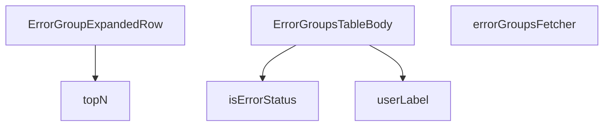

## Genel Bakış
Bu modül, VentHub HVAC admin panelinde hata gruplarını yönetmek için kullanılan tablo arayüzünü ve ilgili yardımcı fonksiyonları tanımlar. Supabase veritabanından hata kayıtlarını çekip gruplar, yönetici kullanıcılara bu verileri filtreleme, detaylı görüntüleme ve not ekleme imkanı sunar.

## Fonksiyon Grupları
### Yardımcı Fonksiyonlar
Temel veri dönüştürme ve kontrol işlemleri sağlar.
- isErrorStatus, userLabel

### Veri İşleme ve Çekme
Supabase'den hata gruplarını asenkron olarak çeker ve gerekli veri toplama/analiz işlemlerini yapar.
- errorGroupsFetcher, topN

### Bileşenler
Ana tablo yapısını ve genişletilebilir satır detaylarını oluşturan React bileşenleri.
- ErrorGroupExpandedRow, ErrorGroupsTableBody

---

## AXIOMS – Mimari Varsayımlar

Bu modül, hata gruplarını Supabase'den çekip tabloda gösteren bir admin bileşenidir.

**[Aksiyom 1]**: Eğer `errorGroupsFetcher` çağrısında `supabase` parametresi geçerli bir Supabase bağlantısı değilse, fetch işlemi başarısız olur.

**[Aksiyom 2]**: Eğer `topN` fonksiyonuna boş bir `arr` dizisi verilirse veya `n` 0 veya negatif bir değer ise, sonuç boş bir dizi olur.

**[Aksiyom 3]**: Eğer `userLabel` fonksiyonuna `null` veya `undefined` değerinde bir `AdminUserOpt` verilse, fonksiyonun dönüş davranışı bilinmiyor (varsayılan olarak bir fallback string döndürmesi beklenir).

**[Aksiyom 4]**: Eğer `isErrorStatus` fonksiyonuna geçerli bir durum stringi yerine `null`, `undefined` veya boş string verilirse, fonksiyonun dönüş davranışı bilinmiyor.

**[Aksiyom 5]**: Eğer `ErrorGroupExpandedRow` bileşenine `group` prop'u verilmezse, bileşen doğru çalışmaz.

**[Aksiyom 6]**: Eğer `ErrorGroupExpandedRow` bileşenine `onSaveNotes` callback'i verilmezse, not kaydetme işlevi çalışmaz.

**[Aksiyom 7]**: `ErrorGroupsTableBody` bileşeni, `GROUP_SELECT` sabitine bağımlıdır; bu sabit tanımlı değilse bileşen düzgün çalışamaz.

**[Aksiyom 8]**: Eğer `hasWriteAccess` `false` ise, `ErrorGroupExpandedRow` içinde not kaydetme arayüzü kullanıcıya sunulmamalıdır.

**[Aksiyom 9]**: `topN` fonksiyonundaki `key` parametresi, her `ClientErrorRow` için string döndüren bir fonksiyon olmalıdır; eğer key fonksiyonu bir eleman için hata fırlatırsa, tüm sonuç etkilenir.

---

## FONKSİYON DETAYLARI

### isErrorStatus

**Ne yapar**: Verilen bir string değerinin geçerli bir hata durumu (ErrorStatus) olup olmadığını kontrol eden bir tip koruma (type guard) fonksiyonudur. TypeScript'in `x is ErrorStatus` dönüş tipi sayesinde, fonksiyon çağrıldıktan sonra `if (isErrorStatus(val))` bloğu içinde `val`'ın `ErrorStatus` tipinde olduğu garanti edilir.

**Nasıl yapar**: Fonksiyon, gelen `x` parametresinin `'open'`, `'resolved'` veya `'ignored'` değerlerinden birine eşit olup olmadığını doğrudan bir OR (||) zinciriyle test eder. Herhangi bir dönüşüm veya hesaplama yapmaz; saf bir karşılaştırma gerçekleştirilir. JavaScript/TypeScript'te string karşılaştırmaları case-sensitive olduğundan, büyük/küçük harf duyarlılığı mevcuttur.

**Parametreler**:
- `x: string` — Kontrol edilecek değer. Bir hata durumu durumunu temsil ettiği varsayılan bir string ifadesidir.

**Dönüş**: `x is ErrorStatus` — Boolean döner. `true` dönerse TypeScript derleyicisi `x`'in `ErrorStatus` tipinde (yani `'open' | 'resolved' | 'ignored'`) olduğunu statik olarak garanti eder. `false` dönerse değer bu tiplerden biri değildir.

### userLabel
**Ne yapar**: Geliştirildi ancak detay üretilemedi.

### errorGroupsFetcher
**Ne yapar**: Geliştirildi ancak detay üretilemedi.

### topN
**Ne yapar**: Geliştirildi ancak detay üretilemedi.

### ErrorGroupExpandedRow
**Ne yapar**: Geliştirildi ancak detay üretilemedi.

### ErrorGroupsTableBody
**Ne yapar**: Geliştirildi ancak detay üretilemedi.

---

## İTHALATLAR (IMPORTS)
- import: ../../components/admin/AdminEmptyState::AdminEmptyState
- import: ../../components/admin/AdminToolbar::AdminToolbar
- import: ../../components/admin/ExportMenu::ExportMenu
- import: ../../components/admin/data-table/BulkBar::BulkBar
- import: ../../components/admin/data-table/BulkBar::type BulkAction
- import: ../../components/admin/data-table/DataTableKit::DataTableKit
- import: ../../components/admin/data-table/types::type { AdminColumn }
- import: ../../hooks/useAdminTable::type FetchParams
- import: ../../hooks/useAdminTable::type FetchResult
- import: ../../hooks/useAdminTable::useAdminTable
- import: ../../hooks/useRole::useRole
- import: ../../hooks/useTenant::useTenant
- import: ../../i18n/I18nProvider::useI18n
- import: ../../i18n/datetime::formatDateTime
- import: ../../types/database.types::type { Database }
- import: @/lib/admin/mutateWithAudit::AdminPermissionError
- import: @/lib/admin/mutateWithAudit::mutateWithAudit
- import: @/lib/supabase/client::supabaseBrowserClient
- import: @supabase/supabase-js::type { SupabaseClient }
- import: lucide-react::SearchX
- import: lucide-react::ShieldAlert
- import: react::React
- import: react::useCallback
- import: react::useEffect
- import: react::useMemo
- import: react::useRef
- import: react::useState
- import: sonner::toast

---

## INTERFACES

### ErrorGroupRow
- `id: string`
- `signature: string`
- `level: string | null`
- `last_message: string | null`
- `url_sample: string | null`
- `env: string | null`
- `release: string | null`
- `first_seen: string`
- `last_seen: string`
- `count: number`
- `status: string`
- `assigned_to: string | null`
- `notes: string | null`

### AdminUserOpt
- `id: string`
- `email: string`
- `full_name: string | null`

### ClientErrorRow
- `id: string`
- `at: string`
- `url: string | null`
- `message: string`
- `stack: string | null`
- `user_agent: string | null`
- `release: string | null`
- `env: string | null`
- `level: string`

### ExpandedRowProps
- `group: ErrorGroupRow`
- `users: AdminUserOpt[]`
- `hasWriteAccess: boolean`
- `onSaveNotes: (group: ErrorGroupRow, notes: string) => Promise<void>`

---

## TYPE ALIASES

### ErrorStatus
```typescript
type ErrorStatus = 'open' | 'resolved' | 'ignored'
```

---

## SABİTLER
- **GROUP_SELECT** (str) — `'id, signature, level, last_message, url_sample, env, release, first_seen, la...`

---

## AST POINTERS

### [N1_NASIL] AST Pointer: ErrorGroupsTableBody.tsx::isErrorStatus
- **params**: `(x: string)` - Kontrol edilecek string değer
- **ic_degiskenler**: (yok)
- **Dönüş**: `x is ErrorStatus` - x'in ErrorStatus türünde olduğunu belirten type guard

### [N2_NASIL] AST Pointer: ErrorGroupsTableBody.tsx::userLabel
- **params**: `(u: AdminUserOpt)` - Kullanıcı nesnesi (full_name ve email alanları içerir)
- **ic_degiskenler**: (yok)
- **Dönüş**: `string` - Kullanıcının formatlanmış etiketi (full_name varsa "Full Name <email>", yoksa sadece email)

### [N3_NASIL] AST Pointer: ErrorGroupsTableBody.tsx::errorGroupsFetcher
- **params**: `(supabase: SupabaseClient<Database>, params: FetchParams)` - Supabase istemcisi ve filtreleme/sayfalama parametreleri
- **ic_degiskenler**:
  - `level` — params.filters.level[0] değerinden çıkarılan hata seviyesi filtresi (ör: 'error', 'warn')
  - `status` — params.filters.status[0] değerinden çıkarılan durum filtresi (ör: 'open', 'resolved')
  - `from` — params.filters.from[0] değerinden çıkarılan başlangıç tarihi filtresi
  - `to` — params.filters.to[0] değerinden çıkarılan bitiş tarihi filtresi
  - `assigned` — params.filters.assigned[0] değerinden çıkarılan atanan kullanıcı filtresi
  - `query` — params.query değerinden çıkarılan metin arama sorgusu
  - `query` — Supabase sorgu nesnesi (select, order, filtreler ve sayfalama uygulanır)
  - `sortKey` — Sıralama anahtarı ('count' veya 'last_seen')
  - `offset` — Sayfalama için hesaplanan başlangıç indeksi
  - `data` — Sorgu sonucu döndürülen veri satırları (ErrorGroupRow[])
  - `error` — Sorgu hatası (varsa)
  - `count` — Toplam eşleşen satır sayısı
- **Dönüş**: `Promise<FetchResult<ErrorGroupRow>>` - rows (ErrorGroupRow[]) ve totalMatched (toplam eşleşme sayısı) içeren nesne

### [N4_NASIL] AST Pointer: ErrorGroupsTableBody.tsx::topN
- **params**: `(arr: ClientErrorRow[], key: (e: ClientErrorRow) => string, n = 5)` - Dizi, anahtar fonksiyonu ve üst N limiti
- **ic_degiskenler**:
  - `m` — Anahtar-sayı sayacı için Map nesnesi (her anahtarın occurrence sayısını tutar)
  - `it` — Dizideki her bir ClientErrorRow öğesi
  - `k` — Mevcut öğenin key fonksiyonu ile hesaplanan anahtarı
- **Dönüş**: `[string, number][]` - En çok tekrar eden N anahtar-çiftini içeren dizi (azalan sırayla)

### [N5_NASIL] AST Pointer: ErrorGroupsTableBody.tsx::ErrorGroupExpandedRow
- **params**: `({ group, hasWriteAccess, onSaveNotes })` - Genişletilmiş satır verileri: group (hata grubu nesnesi), hasWriteAccess (yazma izni flag'i), onSaveNotes (not kaydetme callback fonksiyonu)
- **ic_degiskenler**:
  - `t, lang` — useI18n hook'undan alınan çeviri fonksiyonu ve dil bilgisi
  - `errors` — useState ile yönetilen hata satırları dizisi (ClientErrorRow[])
  - `aggregations` — useMemo ile hesaplanan aggregation verileri (URL, release, env, user_agent için top N istatistikleri)
  - `e` — errors.map içindeki her bir hata satırı (ClientErrorRow)
  - `block` — aggregations.map içindeki her bir aggregation bloğu (title ve items içerir)
  - `k, c` — block.items.map destructuring ile açılan anahtar-değer çifti
- **Dönüş**: `React.FC` - Genişletilmiş hata grubu satırının JSX içeriğini döndüren React fonksiyonel bileşeni

### [N6_NASIL] AST Pointer: ErrorGroupsTableBody.tsx::ErrorGroupsTableBody
- **params**: (parametre yok)
- **ic_degiskenler**:
  - `table` — DataTableKit tarafından sağlanan tablo kontrol nesnesi (selection, reload, fetchAllForExport metodlarını içerir)
  - `tenantId` — Kiracı ID'si (Supabase real-time kanal adı için kullanılır)
  - `users` — useState ile yönetilen kullanıcı listesi (AdminUserOpt[])
  - `bulkStatus` — useState ile yönetilen toplu işlem durum değeri (ErrorStatus türünde)
  - `hasWriteAccess` — Yazma izni flag'i
  - `refetchTimer` — useRef ile yönetilen yeniden getirme zamanlayıcı ID'si
  - `reloadRef` — useRef ile yönetilen reload fonksiyonu referansı
  - `updateStatus` — useCallback ile tanımlanan durum güncelleme fonksiyonu (satır ve yeni durum alır)
  - `updateAssignedTo` — useCallback ile tanımlanan atama güncelleme fonksiyonu (satır ve kullanıcı ID alır)
  - `saveNotes` — useCallback ile tanımlanan not kaydetme fonksiyonu (satır ve not metni alır)
  - `bulkApplyStatus` — useCallback ile tanımlanan toplu durum uygulama fonksiyonu (yeni durum alır)
  - `columns` — useMemo ile hesaplanan tablo sütun tanımları dizisi
  - `bulkActions` — useMemo ile hesaplanan toplu işlem tanımları dizisi
  - `expandedRow` — useCallback ile tanımlanan genişletilmiş satır render fonksiyonu
  - `handleExport` — useCallback ile tanımlanan CSV dışa aktarma fonksiyonu
  - `escape` — handleExport içinde tanımlanan CSV kaçış fonksiyonu
  - `rows` — handleExport içinde tablodan alınan tüm satırlar
  - `cols` — handleExport içinde tanımlanan sütun adları dizisi
  - `csv` — handleExport içinde oluşturulan CSV dizesi
  - `blob` — handleExport içinde oluşturulan Blob nesnesi
  - `url` — handleExport içinde oluşturulan nesne URL'i
  - `a` — handleExport içinde oluşturulan download link elementi
  - `s, u` — bulkActions ve columns içindeki map callback parametreleri
- **Dönüş**: `React.FC` - Ana tablo bileşeninin JSX içeriğini döndüren React fonksiyonel bileşeni

---


## MERMAID CALL GRAPH


## NODE ID STANDARD

  file: src\views\admin\ErrorGroupsTableBody.tsx
  function: src\views\admin\ErrorGroupsTableBody.tsx::isErrorStatus
  function: src\views\admin\ErrorGroupsTableBody.tsx::userLabel
  function: src\views\admin\ErrorGroupsTableBody.tsx::errorGroupsFetcher
  function: src\views\admin\ErrorGroupsTableBody.tsx::topN
  function: src\views\admin\ErrorGroupsTableBody.tsx::ErrorGroupExpandedRow
  function: src\views\admin\ErrorGroupsTableBody.tsx::ErrorGroupsTableBody

---

## DISA AKTARILANLAR (EXPORTS)
  export: ErrorGroupExpandedRow
  export: ErrorGroupsTableBody
  export: errorGroupsFetcher
  export: isErrorStatus
  export: topN
  export: userLabel

---

## STİL TOKENLERİ

### Arbitrary Değerler (token'a geçirilmemiş)
Yok — tüm stiller token'a geçirilmiş. ✅

### Kullanılan Token'lar (zaten token'a geçirilmiş)
- (yok)

### Tailwind Sınıf Özeti
- **Renkler:** `bg-amber-500/10`, `bg-cyan-500/10`, `bg-rose-500/10`, `bg-sky-500/10`, `bg-surface-deep`, `bg-surface-deep/40`, `border-b`, `border-cyan-500/20`, `border-white/5`, `last:border-b-0`, `text-amber-300/80`, `text-amber-400`, `text-cyan-400`, `text-rose-400`, `text-sky-400`
- **Layout:** `!h-10`, `!h-8`, `block`, `custom-scrollbar`, `flex`, `flex-col`, `gap-1`, `gap-2`, `gap-3`, `gap-6`, `grid`, `grid-cols-1`, `h-7`, `inline-flex`, `items-center`
- **Varyant/Responsive:** `:`, `last:`, `md:` önekleri
- **Yardımcı Sınıflar:** `!pl-3`, `!pl-4`, `!py-1`, `!text-xs`, `$`, `${adminButtonPrimaryClass`, `${adminInputClass`, `${adminSelectClass`, `${glassStrongClass`, `:`, `===`, `border`, `break-all`, `break-words`, `cursor-pointer`