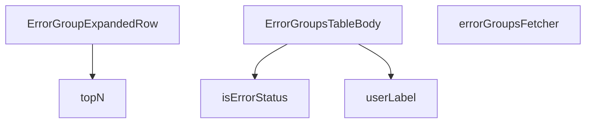

## Genel Bakış
Bu modül, VentHub HVAC admin arayüzünde hata gruplarını gösteren ana tablo bileşenini ve ilişkili yardımcı fonksiyonlarını tanımlar. Supabase'den hata verilerini çekip düzenler, gruplar halinde sunar ve yönetici kullanıcıların hata detaylarını görüntülemesine ve not eklemesine olanak tanır.

## Fonksiyon Grupları
### Veri İşleme Yardımcıları
Bu fonksiyonlar, hata durumlarını kontrol etme ve kullanıcı bilgilerini metne dönüştürme gibi temel yardımcı işlemler sağlar.
- isErrorStatus, userLabel

### Veri Çekme ve Toplama
Bu grup, Supabase'den hata gruplarını asenkron olarak çeker ve istatistiksel analiz (örn. en sık görülen hatalar) için verileri işler.
- errorGroupsFetcher, topN

### Bileşenler
React bileşenleri, hata gruplarının tablo içinde gösterimi için yapıyı ve genişletilebilir satır detaylarını oluşturur.
- ErrorGroupExpandedRow, ErrorGroupsTableBody

---

## AXIOMS – Mimari Varsayımlar

Bu modül, Supabase üzerinden hata gruplarını çekip tablo halinde gösteren bir admin paneli bileşenidir.

[Aksiyom 1]: Eğer `SupabaseClient<Database>` bağlantısı yoksa, `errorGroupsFetcher` fonksiyonu veri çekemez ve tablo veri gösteremez.

[Aksiyom 2]: Eğer `FetchParams` parametresi geçerli bir sayfalama/filtre yapısı içermiyorsa, `errorGroupsFetcher` beklenmeyen sonuç döner.

[Aksiyom 3]: Eğer `GROUP_SELECT` sabiti Supabase sorgusunda kullanılacak alanları tanımlamıyorsa, hata grupları eksik veya hatalı alanlarla döner.

[Aksiyom 4]: Eğer `ClientErrorRow[]` boş bir dizi ise, `topN` boş bir `[string, number][]` döner.

[Aksiyom 5]: Eğer `topN` parametresi olan `n` geçerli bir pozitif sayı değilse, sonuç tanımsız olur.

[Aksiyom 6]: Eğer `AdminUserOpt` nesnesi `undefined` veya alanları eksik ise, `userLabel` fonksiyonu geçerli bir etiket üretemez.

[Aksiyom 7]: Eğer `hasWriteAccess` `false` ise, `ErrorGroupExpandedRow` bileşeni kaydetme işlemlerine izin vermemelidir.

[Aksiyom 8]: Eğer `onSaveNotes` callback'i tanımlı değilse, kullanıcının not kaydetme işlemi başarısız olur.

[Aksiyom 9]: Eğer `ErrorGroupRow` (sunucu tarafı) ile `ClientErrorRow` (istemci tarafı) yapıları arasında alan eşleşmesi sağlanamazsa, veri dönüşümü hata verir.

[Aksiyom 10]: Eğer `group` prop'u `ErrorGroupExpandedRow` bileşenine geçirilmiyorsa, genişletilmiş satır boş gösterilir.

---

## FONKSİYON DETAYLARI

### isErrorStatus
**Ne yapar**: Verilen string değerin geçerli bir hata durumu olup olmadığını kontrol eden bir type guard fonksiyonudur. `x is ErrorStatus` dönüş tipi sayesinde TypeScript derleyicisi, bu fonksiyon true döndüğünde parametrenin `ErrorStatus` tipinde olduğunu garanti altına alır.

**Nasıl yapar**: Girdi olarak aldığı string değerini, izin verilen üç durum sabitine (`'open'`, `'resolved'`, `'ignored'`) eşitlik operatörü (`===`) ile sırasıyla karşılaştırır. Herhangi birine eşitse `true`, aksi halde `false` döner. JavaScript'in短路 (short-circuit) `||` operatörünü kullanarak ilk eşleşmede durur.

**Parametreler**:
- `x: string` — Kontrol edilecek durum değeri. Bir hata grubunun durumunu temsil eden string beklenir.

**Dönüş**: `x is ErrorStatus` — Boolean bir type guard dönüşü. `true` olduğunda TypeScript, `x` parametresinin `'open' | 'resolved' | 'ignored'` literal birleşik tipi olduğunu bilir.

### userLabel
**Ne yapar**: Geliştirildi ancak detay üretilemedi.

### errorGroupsFetcher
**Ne yapar**: Geliştirildi ancak detay üretilemedi.

### topN
**Ne yapar**: Geliştirildi ancak detay üretilemedi.

### ErrorGroupExpandedRow
**Ne yapar**: Geliştirildi ancak detay üretilemedi.

### ErrorGroupsTableBody
**Ne yapar**: Geliştirildi ancak detay üretilemedi.

---

## INTERFACES

### ErrorGroupRow
- `id: string`
- `signature: string`
- `level: string | null`
- `last_message: string | null`
- `url_sample: string | null`
- `env: string | null`
- `release: string | null`
- `first_seen: string`
- `last_seen: string`
- `count: number`
- `status: string`
- `assigned_to: string | null`
- `notes: string | null`

### AdminUserOpt
- `id: string`
- `email: string`
- `full_name: string | null`

### ClientErrorRow
- `id: string`
- `at: string`
- `url: string | null`
- `message: string`
- `stack: string | null`
- `user_agent: string | null`
- `release: string | null`
- `env: string | null`
- `level: string`

### ExpandedRowProps
- `group: ErrorGroupRow`
- `users: AdminUserOpt[]`
- `hasWriteAccess: boolean`
- `onSaveNotes: (group: ErrorGroupRow, notes: string) => Promise<void>`

---

## TYPE ALIASES

### ErrorStatus
```typescript
type ErrorStatus = 'open' | 'resolved' | 'ignored'
```

---

## SABİTLER
- **GROUP_SELECT** (str) — `'id, signature, level, last_message, url_sample, env, release, first_seen, la...`

---

## AST POINTERS

### [N1_NASIL] AST Pointer: `ErrorGroupsTableBody.tsx::isErrorStatus`
- **params**: `(x: string)`
- **ic_degiskenler**:
  - `x` — fonksiyona giren string, bir hata durumunu temsil eder (örn: 'open', 'resolved', 'ignored').
- **Dönüş**: `boolean` — `x`'in ('open', 'resolved', 'ignored') değerlerinden biri olup olmadığını kontrol eden predicate.

### [N2_NASIL] AST Pointer: `ErrorGroupsTableBody.tsx::userLabel`
- **params**: `(u: AdminUserOpt)`
- **ic_degiskenler**:
  - `u` — bir kullanıcının tam adı ve e-posta adresini içeren optsiyonel nesne.
- **Dönüş**: `string` — `u` nesnesinden oluşturulmuş kullanıcı etiketi (örn: "Ad Soyad <eposta>").

### [N3_NASIL] AST Pointer: `ErrorGroupsTableBody.tsx::errorGroupsFetcher`
- **params**: `(supabase: SupabaseClient<Database>, params: FetchParams)`
- **ic_degiskenler**:
  - `supabase` — Supabase istemcisi, veritabanı sorguları için kullanılır.
  - `params` — filtreleme, sıralama ve sayfalama parametrelerini içeren nesne.
  - `level` — `params.filters.level` dizisinden alınan ilk eleman, hata seviyesi filtresi.
  - `status` — `params.filters.status` dizisinden alınan ilk eleman, durum filtresi.
  - `from` — `params.filters.from` dizisinden alınan ilk eleman, başlangıç tarihi filtresi.
  - `to` — `params.filters.to` dizisinden alınan ilk eleman, bitiş tarihi filtresi.
  - `assigned` — `params.filters.assigned` dizisinden alınan ilk eleman, atanan kullanıcı filtresi.
  - `query` — `params.query` alanından gelen arama metni, imza ve son mesajda eşleşme arar.
  - `like` — `query` metnini `%` ile sarılmış hali, veritabanı `LIKE` operatörü için hazırlanır.
  - `sortKey` — sıralama anahtarı: `params.sort?.key` 'count' ise 'count', değilse 'last_seen' olur.
  - `offset` — sayfalama için hesaplanan satır başlangıç indeksi.
  - `query` (devam) — `supabase.from('error_groups').select(...)` ile başlayan zincir sorgu nesnesi.
- **Dönüş**: `Promise<FetchResult<ErrorGroupRow>>` — `rows` ve `totalMatched` içeren nesne.

### [N4_NASIL] AST Pointer: `ErrorGroupsTableBody.tsx::topN`
- **params**: `(arr: ClientErrorRow[], key: (e: ClientErrorRow) => string, n = 5)`
- **ic_degiskenler**:
  - `arr` — elemanları sayılacak hata satırları dizisi.
  - `key` — her satırdan sayılacak anahtarı (string) çıkaran fonksiyon.
  - `n` — döndürülecek maksimum eleman sayısı, varsayılanı 5.
  - `m` — elemanların frekansını sayan `Map<string, number>` nesnesi.
  - `it` — `arr` dizisi üzerindeki döngüdeki mevcut satır.
  - `k` — `key` fonksiyonuyla elde edilen veya fallback olarak '-' olan anahtar.
- **Dönüş**: `[string, number][]` — en yüksek frekanslı `n` çiftinin (anahtar, sayacı) dizisi.

### [N5_NASIL] AST Pointer: `ErrorGroupsTableBody.tsx::ErrorGroupExpandedRow`
- **params**: `({ group, hasWriteAccess, onSaveNotes })` — prop'tan destructure.
- **ic_degiskenler**:
  - `group` — genişletilen hata grubu nesnesi (ID, notlar, URL örneği vb. içerir).
  - `hasWriteAccess` — kullanıcının yazma izni olup olmadığını belirten boolean.
  - `onSaveNotes` — notları kaydetmek için çağrılacak asenkron fonksiyon.
  - `t` — useI18n hook'undan gelen çeviri fonksiyonu.
  - `lang` — useI18n hook'undan gelen mevcut dil kodu.
  - `errors` — `useState` ile yönetilen, bu gruba ait hata satırları dizisi (ClientErrorRow[]).
  - `aggregations` — `useMemo` ile hesaplanan, URL, release, env ve user_agent için en çok tekrar eden 5'li aggregasyonlar dizisi.
  - `active` — `useEffect` içindeki asenkron işlemin hâlâ geçerli olup olmadığını takip eden boolean (cleanup için).
  - `data` — Supabase sorgusundan dönen hata satırları.
  - `error` — Supabase sorgusundan dönen hata nesnesi.
- **Dönüş**: `React.JSX.Element` — hata grubu detaylarını gösteren React bileşeni (JSX).

### [N6_NASIL] AST Pointer: `ErrorGroupsTableBody.tsx::ErrorGroupsTableBody`
- **params**: `(yok)`
- **ic_degiskenler**:
  - `t` — useI18n hook'undan gelen çeviri fonksiyonu.
  - `lang` — useI18n hook'undan gelen mevcut dil kodu.
  - `hasWriteAccess` — kullanıcının yazma izni olup olmadığını belirten boolean.
  - `users` — `useState` ile yönetilen, tüm admin kullanıcılarının dizisi (AdminUserOpt[]).
  - `bulkStatus` — `useState` ile yönetilen, toplu işlem panelinde seçilen durum (ErrorStatus).
  - `table` — `useState` ile yönetilen, `DataTableKit` instance'ı (satır verisi, seçim, yeniden yükleme, dışa aktarma metodları içerir).
  - `reloadRef` — `useRef` ile tutulan, tabloyu yeniden yükleme fonksiyonuna referans.
  - `refetchTimer` — `useRef` ile tutulan, real-time yeniden yükleme zamanlayıcısı.
  - `tenantId` — `useTenant` hook'undan gelen kiracı (tenant) ID'si.
  - `active` — `useEffect` içindeki asenkron işlemin hâlâ geçerli olup olmadığını takip eden boolean.
  - `data` — `admin_list_users` RPC'sinden dönen kullanıcı verisi.
  - `error` — `admin_list_users` RPC'sinden dönen hata nesnesi.
  - `ch` — Supabase real-time kanal aboneliği.
  - `row` — `updateStatus` callback'ine giren hata grubu satırı.
  - `next` — `updateStatus` callback'ine giren yeni durum stringi.
  - `notes` — `saveNotes` callback'ine giren not metni.
  - `ids` — `bulkApplyStatus` callback'inde, `table.selection.selectedIds` ile alınan seçili satır ID'leri dizisi.
  - `next` — `bulkApplyStatus` callback'ine giren toplu durum güncelleme değeri.
  - `rows` — `exportToCsv` callback'inde, `table.fetchAllForExport()` ile alınan tüm satırlar.
  - `cols` — CSV sütun başlıkları dizisi.
  - `escape` — CSV hücresi için değerleri temizleyen ve sarmalayan fonksiyon.
  - `lines` — `rows` dizisini CSV satırlarına dönüştüren `map` sonucu.
  - `csv` — tam CSV metni, BOM ile başlar.
  - `blob` — CSV verisinden oluşturulan `Blob` nesnesi.
  - `url` — Blob için oluşturulan URL.
  - `a` — indirme tetiklemek için oluşturulan `<a>` DOM elemanı.
- **Dönüş**: `React.JSX.Element` — ana hata grupları tablosu arayüzünü döndüren React bileşeni (JSX).

---


## MERMAID CALL GRAPH


## NODE ID STANDARD

  file: src\views\admin\ErrorGroupsTableBody.tsx
  function: src\views\admin\ErrorGroupsTableBody.tsx::isErrorStatus
  function: src\views\admin\ErrorGroupsTableBody.tsx::userLabel
  function: src\views\admin\ErrorGroupsTableBody.tsx::errorGroupsFetcher
  function: src\views\admin\ErrorGroupsTableBody.tsx::topN
  function: src\views\admin\ErrorGroupsTableBody.tsx::ErrorGroupExpandedRow
  function: src\views\admin\ErrorGroupsTableBody.tsx::ErrorGroupsTableBody

---

## DISA AKTARILANLAR (EXPORTS)
  export: ErrorGroupExpandedRow
  export: ErrorGroupsTableBody
  export: errorGroupsFetcher
  export: isErrorStatus
  export: topN
  export: userLabel

---

## STİL TOKENLERİ

### Arbitrary Değerler (token'a geçirilmemiş)
Yok — tüm stiller token'a geçirilmiş. ✅

### Kullanılan Token'lar (zaten token'a geçirilmiş)
- (yok)

### Tailwind Sınıf Özeti
- **Renkler:** `bg-amber-500/10`, `bg-cyan-500/10`, `bg-rose-500/10`, `bg-sky-500/10`, `bg-surface-deep`, `bg-surface-deep/40`, `border-b`, `border-cyan-500/20`, `border-white/5`, `last:border-b-0`, `text-amber-300/80`, `text-amber-400`, `text-cyan-400`, `text-rose-400`, `text-sky-400`
- **Layout:** `!h-10`, `!h-8`, `block`, `custom-scrollbar`, `flex`, `flex-col`, `gap-1`, `gap-2`, `gap-3`, `gap-6`, `grid`, `grid-cols-1`, `h-7`, `inline-flex`, `items-center`
- **Varyant/Responsive:** `:`, `last:`, `md:` önekleri
- **Yardımcı Sınıflar:** `!pl-3`, `!pl-4`, `!py-1`, `!text-xs`, `$`, `${adminButtonPrimaryClass`, `${adminInputClass`, `${adminSelectClass`, `${glassStrongClass`, `:`, `===`, `border`, `break-all`, `break-words`, `cursor-pointer`