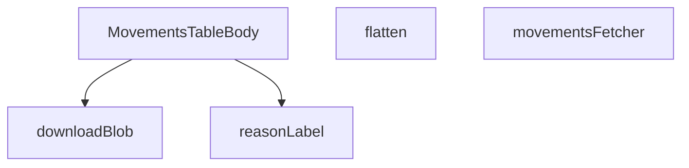

## Genel Bakış

Bu modül, admin panelindeHVAC ekipman hareketlerinin (sevk, kurulum, bakım vb.) tabloda listelenmesinden sorumludur. Supabase üzerinden ham veriyi çeker, ilişkisel veri yapısını düzleştirerek bileşenlerin kullanabileceği forma dönüştürür ve yerelleştirilmiş etiketlerle birlikte satır bazlı olarak sunar.

## Fonksiyon Grupları

### Veri Çekme ve Dönüştürme
Bu grup, Supabase'den hareket kayıtlarını çeker ve birleşik (join) satır yapısını düz, tablo dostu forma dönüştürür.
- `movementsFetcher` — Supabase istemcisi ve filtre parametrelerini alarak hareket verilerini asenkron olarak çeker, sayfalama metadata'sı ile birlikte sonuç döndürür.
- `flatten` — İlişkisel olarak zenginleştirilmiş MovementJoinRow yapısını, tabloda doğrudan kullanılabilecek daha basit MovementRow yapısına dönüştürür.

### Sunum ve Bileşen
Bu grup, veriyi tarayıcıda kullanıcıya görsel olarak sunan React bileşenini kapsar.
- `MovementsTableBody` — Admin tablosunun gövde kısmını render eden ana React bileşenidir; satırları haritalandırarak hücreleri oluşturur.

### Yardımcı Araçlar
Bu grup, yerelleştirme ve dosya indirme gibi destekleyen küçük yardımcı fonksiyonları barındırır.
- `reasonLabel` — Hareket sebebi anahtarlarını (ör. "maintenance", "transfer") çeviri fonksiyonu ile birlikte insan okunabilir etiketlere dönüştürür.
- `downloadBlob` — Blob nesnesini tarayıcıda belirtilen dosya adıyla kullanıcıya indirilir hale getirir (muhtemelen dışa aktarma işlevi için).

---

## AXIOMS – Mimari Varsayımlar

Bu modül, hareket kayıtlarının (movements) gösterimi, filtrelenmesi ve dışa aktarılmasını sağlayan bir admin tablosu bileşenidir.

---

**[Aksiyom 1]**: `flatten(row: MovementJoinRow) -> MovementRow`
Eğer `MovementJoinRow` yapısında ilişkili tablo verileri (movement_type, reason, user profile vb.) join ile getirilmemişse, `flatten` fonksiyonu beklenen alanları bulamaz ve eksik/hatalı veri içeren `MovementRow` oluşur.

**[Aksiyom 2]**: `movementsFetcher(supabase: SupabaseClient<Database>, params: FetchParams) -> Promise<FetchResult<MovementRow>>`
Eğer `supabase` istemcisi `Database` tipi ile doğru yapılandırılmamışsa veya `params` geçerli sayfalama/filtre parametreleri içermiyorsa, veritabanı sorgusu başarısız olur veya beklenmeyen veri döner.

**[Aksiyom 3]**: `reasonLabel(key: string | null | undefined, t: (k: string) => string) -> string`
Eğer `t` (çeviri fonksiyonu) parametresi, `ALL_REASONS` içindeki anahtarları desteklemeyen bir çeviri sözlüğü ile çağrılıysa, `key`'e karşılık gelen etiket bulunamaz ve hatalı/görünmeyen metin döner.

**[Aksiyom 4]**: `ALL_REASONS (as_expression)`
Eğer `ALL_REASONS` sabiti, `reasonLabel` fonksiyonunun beklediği anahtar formatıyla uyumlu değilse veya runtime'daevaluate edilemezse, `reasonLabel` tüm geçerli sebep anahtarlarını doğru şekilde etiketleyemez.

**[Aksiyom 5]**: `downloadBlob(blob: Blob, filename: string)`
Eğer tarayıcı `Blob` URL'leri (URL.createObjectURL) için destek sağlamıyorsa veya `blob` geçerli bir içeriğe sahip değilse, dosya indirme işlemi başarısız olur.

**[Aksiyom 6]**: `MovementsTableBody() -> React.FC`
Eğer bu bileşen, `movementsFetcher` tarafından döndürülen `MovementRow[]` verisini alamıyorsa (bağlam/prop eksikliği), tablo gövdesi boş render edilir.

---

## FONKSİYON DETAYLARI

### reasonLabel
**Ne yapar**: Verilen bir sebep anahtarını (key), uluslararasılaştırılmış (i18n) bir kullanıcı arayüzü etiketine dönüştürür. Envanter hareket kayıtlarında yer alan sebep kodlarının (örn: 'sale', 'po_receipt') kullanıcıya okunabilir ve本地leştirilmiş karşılıklarını üretir.

**Nasıl yapar**: Gelen `key` parametresini önce string'e çevirir. Eğer bu değer 'undo' ile başlıyorsa doğrudan 'undo' i18n etiketini döndürür. Diğer durumlarda bir switch-case yapısıyla tanımlı sebep anahtarlarını ilgili `t()` fonksiyonu (i18n çeviri fonksiyonu) ile eşleştirir. Eşleşmeyen tanımsız değerler için varsayılan olarak '-' döndürür.

**Parametreler**:
- key: string | null | undefined — Hareket kaydının sebep kodunu temsil eder (örn: 'sale', 'po_receipt', 'undo_batch_xxx'). Null veya undefined olabilir.
- t: (k: string) => string — Uluslararasılaştırma (i18n) çeviri fonksiyonudur. Verilen anahtar dizgesini yerelleştirilmiş çeviriye dönüştürür.

**Dönüş**: string — Sebep koduna karşılık gelen yerelleştirilmiş etiket dizesi veya eşleşme bulunamadığında '-'

### flatten
**Ne yapar**: Geliştirildi ancak detay üretilemedi.

### movementsFetcher
**Ne yapar**: Geliştirildi ancak detay üretilemedi.

### MovementsTableBody
**Ne yapar**: Geliştirildi ancak detay üretilemedi.

### downloadBlob
**Ne yapar**: Geliştirildi ancak detay üretilemedi.

---

## INTERFACES

### MovementProduct
- `id: string`
- `name: string`
- `sku: string | null`
- `category_id: string | null`

### MovementJoinRow
Embedded inner-join satırı (select sırasıyla aynı).
- `id: string`
- `product_id: string`
- `delta: number`
- `reason: string | null`
- `order_id: string | null`
- `created_at: string`
- `batch_id: string | null`
- `products: MovementProduct`

### MovementRow
Kit'in kullandığı düzleştirilmiş satır (cell'ler product.name/sku okur).
- `id: string`
- `product_id: string`
- `delta: number`
- `reason: string | null`
- `order_id: string | null`
- `created_at: string`
- `batch_id: string | null`
- `product: MovementProduct`

### CategoryRow
- `id: string`
- `name: string`

---

## SABİTLER
- **ALL_REASONS** (as_expression) — `[
  'sale',
  'po_receipt',
  'manual_in',
  'manual_out',
  'adjust',
  'ret...`

---

## AST POINTERS

### [N1_NASIL] AST Pointer: src/views/admin/MovementsTableBody.tsx::reasonLabel
- **params**: (`key`: string | null | undefined, `t`: (k: string) => string)
- **ic_degiskenler**:
  - `val` — key parametresinin null/undefined durumlarını güvenli bir string'e dönüştürmüş hali; switch/if kontrolünde kullanılır
- **Dönüş**: string — reason anahtar kelimesinin çevrilmiş label'ı; eşleşme yoksa `'-'`

---

### [N2_NASIL] AST Pointer: src/views/admin/MovementsTableBody.tsx::flatten
- **params**: (`row`: MovementJoinRow)
- **ic_degiskenler**: (yok)
- **Dönüş**: MovementRow — join edilmiş satırı düz MovementRow nesnesine mapleme; `row.products` objesini `product` alanına atar

---

### [N3_NASIL] AST Pointer: src/views/admin/MovementsTableBody.tsx::movementsFetcher
- **params**: (`supabase`: SupabaseClient<Database>, `params`: FetchParams)
- **ic_degiskenler**:
  - `query` — Supabase sorgu builder; başlangıçta `inventory_movements` tablosunu `products` join'iyle select eder, ardından sıralama/filtreleme/sayfalama zincirlenir
  - `sortKey` — sıralama anahtarı; `params.sort?.key` varsa onu, yoksa `'date'` kullanır
  - `ascending` — sıralama yönü; `params.sort?.dir === 'asc'` sonucu boolean
  - `colMap` — frontend sıralama anahtarlarını (`date`, `delta`, `reason`, `ref`) veritabanı kolon adlarına (`created_at`, `delta`, `reason`, `order_id`) eşleyen lookup nesnesi
  - `like` — ürün adı/SKU araması için `%query%` formatında LIKE pattern string'i
  - `category` — `params.filters.category` dizisinin ilk elemanı; products.category_id eşitlik filtresi için kullanılır
  - `reasons` — `params.filters.reason` dizisi; boş değilse `.in('reason', reasons)` ile çoklu seçim filtresi uygular
  - `from` — `params.filters.from` dizisinin ilk elemanı; `created_at >= from` alt sınır filtresi
  - `to` — `params.filters.to` dizisinin ilk elemanı; `created_at <= to` üst sınır filtresi
  - `batch` — `params.filters.batch` dizisinin ilk elemanı; `batch_id` eşitlik filtresi
  - `offset` — `(params.page - 1) * params.pageSize` hesaplamasıyla sayfalama başlangıç indeksi
  - `joinRows` — sorgu sonucu `data`'nın null olma durumuna karşı `?? []` ile güvenceye alınmış MovementJoinRow dizisi
- **Dönüş**: `{ rows: MovementRow[], totalMatched: number }` — flatten edilmiş satırlar ve toplam eşleşme sayısı

---

### [N4_NASIL] AST Pointer: src/views/admin/MovementsTableBody.tsx::MovementsTableBody
- **params**: (yok)
- **ic_degiskenler**:
  - `t` — `useI18n()` hook'undan gelen çeviri fonksiyonu; tüm UI metinlerinde kullanılır
  - `lang` — `useI18n()` hook'undan gelen mevcut dil kodu; `formatDateTime` çağrısına `'tr' | 'en'` olarak cast edilir
  - `searchParams` — `useSearchParams()` hook'undan gelen URL query parametreleri nesnesi; batch deep-link okuması için kullanılır
  - `batchParam` — `searchParams` içinden `?batch=...` değerinin trim edilmiş hali; initial filtre tohumu olarak kullanılır
  - `initialFilters` — `useMemo` ile memoize edilmiş `Record<string, string[]>` nesnesi; `batchParam` varsa `{ batch: [batchParam] }` döndürür
  - `table` — `useAdminTable<MovementRow>()` hook'undan dönen tablo yönetimi nesnesi; `movementsFetcher`, sıralama, sayfalama, filtreleme ve URL senkronizasyonunu kapsar
  - `setFilter` — `table.filtering` nesnesinden alınan filtre güncelleme fonksiyonu; belirli bir filtre anahtarının değerini ayarlar
  - `setQuery` — `table.filtering` nesnesinden alınan arama sorgusu güncelleme fonksiyonu
  - `filters` — `table.filtering.filters` üzerinden erişilen mevcut tüm aktif filtreler nesnesi
  - `categoryVal` — `filters.category?.[0]` değeri veya boş string; kategori select bileşeninin mevcut değeri
  - `activeReasons` — `useMemo` ile memoize edilmiş `filters.reason ?? []` dizisi; aktif reason chip'lerini belirler
  - `batchVal` — `filters.batch?.[0]` değeri; batch deep-link banner'ının gösterilip gösterilmeyeceğini belirler
  - `categories` — `useState<CategoryRow[]>([])` state'i; Supabase'den çekilen tüm kategoriler dizisi; select dropdown seçenekleri için kullanılır
  - `dateRange` — `useMemo` ile memoize edilmiş `DateRange | undefined` nesnesi; `filters.from` ve `filters.to` string'lerinden türetilmiş `Date` nesneleri; date-range picker'ın mevcut değeri
  - `onDateChange` — `useCallback` ile memoize edilmiş `(range?: DateRange) => void` callback'i; date-range picker'dan gelen aralığı `filters.from` ve `filters.to` olarak ISO string ile günceller; `endOfDay` kullanarak bitiş tarihini gün sonuna ayarlar
  - `resetFilters` — `useCallback` ile memoize edilmiş callback; tüm filtreleri (`category`, `reason`, `from`, `to`, `batch`) boş diziye ve arama sorgusunu boş string'e sıfırlar
  - `buildExportRows` — `useCallback` ile memoize edilmiş `(rows: MovementRow[]) => exportObject[]` callback'i; her MovementRow'u dışa aktarılabilir objeye (date, product, sku, delta, reason, ref) dönüştürür
  - `exportHeaders` — `useMemo` ile memoize edilmiş çevrilmiş dışa aktarım başlık stringleri dizisi (6 başlık)
  - `columns` — `useMemo` ile memoize edilmiş `AdminColumn<MovementRow>[]` dizisi; tablonun 5 kolon tanımını (date, product, delta, reason, ref) içerir; her biri header, sortable ve cell render fonksiyonu tanımlar
  - `reasonChips` — `useMemo` ile memoize edilmiş chip toggle objeleri dizisi; `ALL_REASONS` dizisi üzerinden her reason için `{ key, label, active, onToggle }` oluşturur; `onToggle` callback'i mevcut aktif reason'u ekler/çıkararak `setFilter('reason', next)` çağırır
  - `categoryOptions` — `useMemo` ile memoize edilmiş select seçenekleri dizisi; boş value ile "tümü" etiketini ve `categories` state'inden türetilen her kategoriyi `{ value, label }` formatında içerir
  - `exportCsv` — `useCallback` ile memoize edilmiş async callback; `table.fetchAllForExport()` ile tüm veriyi çeker, `buildExportRows` ile dönüştürür, CSV formatına çevirir ve `downloadBlob` ile indirir
  - `exportXls` — `useCallback` ile memoize edilmiş async callback; aynı veriyi HTML tablo formatında XLS'e dönüştürür ve `downloadBlob` ile indirir
- **Dönüş**: JSX — DataTableKit, AdminToolbar, AdminEmptyState, DateRangePicker ve ExportMenu bileşenlerinden oluşan admin stok hareketleri tablo görünümü

---

### [N5_NASIL] AST Pointer: src/views/admin/MovementsTableBody.tsx::downloadBlob
- **params**: (`blob`: Blob, `filename`: string)
- **ic_degiskenler**:
  - `url` — `URL.createObjectURL(blob)` ile oluşturulan tarayıcı içi nesne URL'i; link href olarak atanır
  - `link` — `document.createElement('a')` ile oluşturulan görünmez anchor elementi; programatik tıklama ile dosya indirmeyi tetikler
- **Dönüş**: yok — yan etki olarak dosya indirme başlatır ve `URL.revokeObjectURL` ile URL'i temizler

---

## MERMAID CALL GRAPH

## NODE ID STANDARD

  file: src\views\admin\MovementsTableBody.tsx
  function: src\views\admin\MovementsTableBody.tsx::reasonLabel
  function: src\views\admin\MovementsTableBody.tsx::flatten
  function: src\views\admin\MovementsTableBody.tsx::movementsFetcher
  function: src\views\admin\MovementsTableBody.tsx::MovementsTableBody
  function: src\views\admin\MovementsTableBody.tsx::downloadBlob

---

## DISA AKTARILANLAR (EXPORTS)
  export: MovementsTableBody
  export: flatten
  export: movementsFetcher
  export: reasonLabel

---

## STİL TOKENLERİ

### Arbitrary Değerler (token'a geçirilmemiş)
Yok — tüm stiller token'a geçirilmiş. ✅

### Kullanılan Token'lar (zaten token'a geçirilmiş)
- `tracking-hvac-tight`

### Tailwind Sınıf Özeti
- **Renkler:** `bg-amber-500`, `bg-cyan-500/50`, `bg-emerald-500/10`, `bg-rose-500/10`, `bg-white/5`, `border-amber-500/20`, `border-emerald-500/20`, `border-rose-500/20`, `border-white/5`, `text-amber-400`, `text-brand-cyan`, `text-emerald-400`, `text-rose-500`, `text-slate-400`, `text-slate-500`
- **Layout:** `flex`, `flex-col`, `gap-0.5`, `gap-1`, `gap-2`, `h-1`, `h-1.5`, `inline-flex`, `items-center`, `justify-between`, `p-4`, `w-1`, `w-1.5`, `w-fit`
- **Varyant/Responsive:** `:` önekleri
- **Yardımcı Sınıflar:** `$`, `${adminTableActionWarningClass`, `0`, `:`, `<`, `>`, `animate-pulse`, `border`, `font-black`, `font-bold`, `font-mono`, `glass-strong`, `m.delta`, `ml-1`, `px-2`