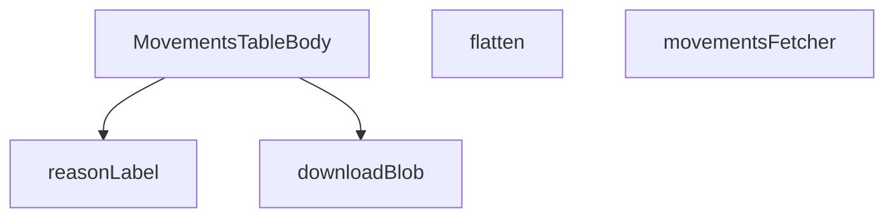

## Genel Bakış
Bu modül, admin panelinde hareket verilerini listeleyen bir tablo bileşeni sağlar. Veritabanından hareket verilerini çeker, dönüştürür ve kullanıcıya sunar. Ayrıca verileri dışa aktarma işlevi sunar.

## Fonksiyon Grupları
### Veri Çekme ve Dönüştürme
Veritabanından ham hareket verilerini alır ve tabloda gösterilmek üzere daha basit bir forma dönüştürür.
- movementsFetcher, flatten

### Yardımcı Fonksiyonlar
Hareket nedenlerini insan tarafından okunabilir etiketlere dönüştürür ve verilerin dosya olarak indirilmesini sağlar.
- reasonLabel, downloadBlob

### Ana Bileşen
Tablonun gövdesini oluşturur, diğer fonksiyonları kullanarak veriyi çeker, dönüştürür ve görüntüler.
- MovementsTableBody

---

## AXIOMS – Mimari Varsayımlar

[Aksiyom 1]: Eğer `supabase` istemcisi yoksa, `movementsFetcher` fonksiyonu veritabanından hareket verilerini çekemez ve `FetchResult<MovementRow>` üretilmez.

[Aksiyom 2]: Eğer `params` (FetchParams) yoksa, `movementsFetcher` fonksiyonu hangi hareket kayıtlarının getirileceğini bilemez ve sorgu oluşturulamaz.

[Aksiyom 3]: Eğer `MovementJoinRow` tipinde geçerli bir satır yoksa, `flatten` fonksiyonu düzleştirilmiş `MovementRow` üretemez.

[Aksiyom 4]: Eğer `t` çeviri fonksiyonu yoksa, `reasonLabel` fonksiyonu neden etiketlerini kullanıcı diline çeviremez.

[Aksiyom 5]: Eğer `ALL_REASONS` sabiti yoksa, `reasonLabel` fonksiyonu bilinen neden anahtarlarını eşleştirecek bir başvuru kaynağına sahip olmaz.

[Aksiyom 6]: Eğer `blob` nesnesi yoksa, `downloadBlob` fonksiyonu indirilecek dosya içeriğine erişemez ve dosya indirme işlemi gerçekleştirilemez.

[Aksiyom 7]: Eğer `filename` parametresi yoksa, `downloadBlob` fonksiyonu indirilen dosyaya bir ad veremez.

---

## FONKSİYON DETAYLARI

### reasonLabel
**Ne yapar**: Stok hareketi neden kodunu (reason key) alır ve uluslararasılaştırma (i18n) fonksiyonu aracılığıyla kullanıcıya gösterilecek Türkçe/yerelleştirilmiş etiket metnine dönüştürür. Geçerli bir eşleşme bulunamadığında tire (`-`) karakteri döndürür.

**Nasıl yapar**: Gelen `key` değeri önce `String()` ile metne dönüştürülür; `null` veya `undefined` gelirse boş string elde edilir. Eğer değer `undo` ile başlıyorsa, `switch` bloğuna girmeden doğrudan `admin.movements.reasons.undo` anahtarının çevirisini döndürür. Aksi halde `switch` yapısıyla `sale`, `po_receipt`, `manual_in`, `manual_out`, `adjust`, `return_in`, `transfer_out`, `transfer_in` değerleri tek tek kontrol edilir ve eşleşen durum için karşılık gelen i18n anahtarı `t` fonksiyonuna gönderilir. Hiçbir case eşleşmezse `default` dalı çalışır ve `-` döndürülür.

**Parametreler**:
- key: `string | null | undefined` — Hareket nedenini temsil eden kod. `null` veya `undefined` olabilir; bu durumda boş string olarak işlenir.
- t: `(k: string) => string` — Uluslararasılaştırma (i18n) çeviri fonksiyonu. Verilen anahtar string'ini alır ve yerelleştirilmiş metin döndürür.

**Dönüş**: `string` — Karşılık gelen i18n etiketi ya da eşleşme bulunamadığında `-` karakteri.

### flatten
**Ne yapar**: Geliştirildi ancak detay üretilemedi.

### movementsFetcher
**Ne yapar**: Geliştirildi ancak detay üretilemedi.

### MovementsTableBody
**Ne yapar**: Geliştirildi ancak detay üretilemedi.

### downloadBlob
**Ne yapar**: Geliştirildi ancak detay üretilemedi.

---

## İTHALATLAR (IMPORTS)
- import: ../../components/admin/AdminEmptyState::AdminEmptyState
- import: ../../components/admin/AdminToolbar::AdminToolbar
- import: ../../components/admin/DateRangePicker::DateRangePicker
- import: ../../components/admin/ExportMenu::ExportMenu
- import: ../../components/admin/data-table/DataTableKit::DataTableKit
- import: ../../components/admin/data-table/types::type { AdminColumn }
- import: ../../hooks/useAdminTable::type FetchParams
- import: ../../hooks/useAdminTable::type FetchResult
- import: ../../hooks/useAdminTable::useAdminTable
- import: ../../i18n/I18nProvider::useI18n
- import: ../../i18n/datetime::formatDateTime
- import: ../../types/database.types::type { Database }
- import: ../../utils/adminUi::adminTableActionWarningClass
- import: @/lib/supabase/client::supabaseBrowserClient
- import: @supabase/supabase-js::type { SupabaseClient }
- import: date-fns::endOfDay
- import: lucide-react::ArrowDownRight
- import: lucide-react::ArrowUpRight
- import: lucide-react::PackageMinus
- import: lucide-react::SearchX
- import: next/navigation::useSearchParams
- import: react-day-picker::type { DateRange }
- import: react::React
- import: react::useCallback
- import: react::useEffect
- import: react::useMemo
- import: react::useState

---

## INTERFACES

### MovementProduct
- `id: string`
- `name: string`
- `sku: string | null`
- `category_id: string | null`

### MovementJoinRow
Embedded inner-join satırı (select sırasıyla aynı).
- `id: string`
- `product_id: string`
- `delta: number`
- `reason: string | null`
- `order_id: string | null`
- `created_at: string`
- `batch_id: string | null`
- `products: MovementProduct`

### MovementRow
Kit'in kullandığı düzleştirilmiş satır (cell'ler product.name/sku okur).
- `id: string`
- `product_id: string`
- `delta: number`
- `reason: string | null`
- `order_id: string | null`
- `created_at: string`
- `batch_id: string | null`
- `product: MovementProduct`

### CategoryRow
- `id: string`
- `name: string`

---

## SABİTLER
- **ALL_REASONS** (as_expression) — `[
  'sale',
  'po_receipt',
  'manual_in',
  'manual_out',
  'adjust',
...`

---

## AST POINTERS

### [N1_NASIL] AST Pointer: src/views/admin/MovementsTableBody.tsx::reasonLabel
- **params**: `key` (string | null | undefined), `t` ((k: string) => string)
- **ic_degiskenler**:
  - `val` — `key` parametresini string'e dönüştürür, boşsa `''` kullanılır; `startsWith('undo')` kontrolü ve `switch` ifadesinde eşleştirme için kullanılır
- **Dönüş**: string — çevrilmiş reason etiketi veya eşleşme yoksa `'-'`

### [N2_NASIL] AST Pointer: src/views/admin/MovementsTableBody.tsx::flatten
- **params**: `row` (MovementJoinRow)
- **ic_degiskenler**: yok
- **Dönüş**: MovementRow — `row.id`, `row.product_id`, `row.delta`, `row.reason`, `row.order_id`, `row.created_at`, `row.batch_id` alanlarını doğrudan aktarır; `row.products` alanını `product` anahtarıyla eşler

### [N3_NASIL] AST Pointer: src/views/admin/MovementsTableBody.tsx::movementsFetcher
- **params**: `supabase` (SupabaseClient<Database>), `params` (FetchParams)
- **ic_degiskenler**:
  - `query` — `supabase.from('inventory_movements').select(...)` ile oluşturulan sorgu zinciri; sıralama, filtreleme ve arama eklemeleri bu değişken üzerinden yapılır
  - `sortKey` — `params.sort?.key` değeri, tanımsızsa `'date'` kullanılır; hangi alana göre sıralama yapılacağını belirler
  - `ascending` — `params.sort?.dir === 'asc'` sonucu boolean; sıralama yönünü belirler
  - `colMap` — `date`→`created_at`, `delta`→`delta`, `reason`→`reason`, `ref`→`order_id` eşleştirmelerini içeren Record; `sortKey`'i veritabanı sütun adına çevirir
  - `like` — `params.query` etrafına `%` eklenerek oluşturulmuş arama deseni; `name.ilike` ve `sku.ilike` filtrelerinde kullanılır
  - `category` — `params.filters.category?.[0]` değeri; tanımlıysa `products.category_id` üzerinden eşitlik filtresi ekler
  - `reasons` — `params.filters.reason ?? []` dizisi; boş değilse `reason` alanı üzerinde `in` filtresi uygular
  - `from` — `params.filters.from?.[0]` değeri; tanımlıysa `created_at` için `gte` filtresi ekler
  - `to` — `params.filters.to?.[0]` değeri; tanımlıysa `created_at` için `lte` filtresi ekler
  - `batch` — `params.filters.batch?.[0]` değeri; tanımlıysa `batch_id` için `eq` filtresi ekler
  - `offset` — `(params.page - 1) * params.pageSize` hesaplaması; sayfalama için aralık başlangıcı
  - `data` — sorgu sonucu dönen satırlar dizisi
  - `error` — sorgu sırasında oluşan hata; tanımlıysa throw edilir
  - `count` — eşleşen toplam satır sayısı
  - `joinRows` — `data ?? []` ataması; `MovementJoinRow[]` tipinde ham satırlar
- **Dönüş**: Promise<FetchResult<MovementRow>> — `rows` (joinRows.map(flatten)) ve `totalMatched` (count veya 0) alanlarını içerir

### [N4_NASIL] AST Pointer: src/views/admin/MovementsTableBody.tsx::downloadBlob
- **params**: `blob` (Blob), `filename` (string)
- **ic_degiskenler**:
  - `url` — `URL.createObjectURL(blob)` ile oluşturulan geçici URL; indirme bağlantısının hedefi
  - `link` — `document.createElement('a')` ile oluşturulan DOM öğesi; `href`, `download` özellikleri atanır ve `click()` ile tetiklenir
- **Dönüş**: yok — yan etki olarak dosya indirme iletişim kutusunu açar, ardından `URL.revokeObjectURL(url)` ile geçici URL'yi temizler

### [N5_NASIL] AST Pointer: src/views/admin/MovementsTableBody.tsx::MovementsTableBody (filters objesi oluşturma)
- **params**: yok
- **ic_degiskenler**:
  - `f` — boş `Record<string, string[]>` olarak başlatılır; `batchParam` tanımlıysa `f.batch = [batchParam]` atanır
  - `batchParam` — kapsamdan erişilen değer; tanımlıysa filters objesine eklenir
- **Dönüş**: Record<string, string[]> — filtre objesi

### [N6_NASIL] AST Pointer: src/views/admin/MovementsTableBody.tsx::MovementsTableBody (useEffect kategori yükleme)
- **params**: yok
- **ic_degiskenler**:
  - `cancelled` — boolean, bileşen unmount olduğunda true yapılır; asenkron yanıt geldiğinde state güncellemesini engellemek için kullanılır
  - `data` — `supabaseBrowserClient.from('categories').select('id,name').order('name', { ascending: true })` sorgusundan dönen kategori satırları
  - `error` — sorgu sırasında oluşan hata
- **Dönüş**: () => void — cleanup fonksiyonu, `cancelled = true` atar

### [N7_NASIL] AST Pointer: src/views/admin/MovementsTableBody.tsx::MovementsTableBody (async kategori yükleme)
- **params**: yok
- **ic_degiskenler**:
  - `data` — `supabaseBrowserClient.from('categories').select('id,name').order('name', { ascending: true })` sorgusundan dönen kategori satırları
  - `error` — sorgu sırasında oluşan hata
- **Dönüş**: Promise<void> — `cancelled` false ve `error` yoksa `setCategories(data as CategoryRow[])` çağrısı yapar

### [N8_NASIL] AST Pointer: src/views/admin/MovementsTableBody.tsx::MovementsTableBody (cleanup fonksiyonu)
- **params**: yok
- **ic_degiskenler**: yok
- **Dönüş**: yok — `cancelled = true` ataması yapar

### [N9_NASIL] AST Pointer: src/views/admin/MovementsTableBody.tsx::MovementsTableBody (dateRange hesaplama)
- **params**: yok
- **ic_degiskenler**:
  - `from` — `filters.from?.[0]` değeri; ISO tarih string'i
  - `to` — `filters.to?.[0]` değeri; ISO tarih string'i
- **Dönüş**: DateRange | undefined — `from` ve `to` yoksa undefined; varsa `{ from: new Date(from), to: new Date(to) }` objesi döner

### [N10_NASIL] AST Pointer: src/views/admin/MovementsTableBody.tsx::MovementsTableBody (tarih aralığı setter)
- **params**: `range` (DateRange, opsiyonel)
- **ic_degiskenler**: yok
- **Dönüş**: yok — `setFilter('from', ...)` ve `setFilter('to', ...)` çağrısı yapar; `range.from` varsa ISO string dizisi, yoksa boş dizi; `range.to` varsa `endOfDay(range.to).toISOString()` ile bitiş günü hesaplanır

### [N11_NASIL] AST Pointer: src/views/admin/MovementsTableBody.tsx::MovementsTableBody (reset fonksiyonu)
- **params**: yok
- **ic_degiskenler**: yok
- **Dönüş**: yok — `setQuery('')` ve tüm filtreleri (`category`, `reason`, `from`, `to`, `batch`) boş diziye sıfırlar

### [N12_NASIL] AST Pointer: src/views/admin/MovementsTableBody.tsx::MovementsTableBody (buildExportRows)
- **params**: `rows` (MovementRow[])
- **ic_degiskenler**: yok
- **Dönüş**: Array<{ date, product, sku, delta, reason, ref }> — her satırı dışa aktarım formatına dönüştürür; `date` için `formatDateTime(m.created_at, lang)`, `product` için `m.product?.name || m.product_id`, `sku` için `m.product?.sku || ''`, `delta` için `m.delta`, `reason` için `reasonLabel(m.reason, t)`, `ref` için `m.order_id` varsa son 8 karakteri büyük harf

### [N13_NASIL] AST Pointer: src/views/admin/MovementsTableBody.tsx::MovementsTableBody (satır map fonksiyonu)
- **params**: `m` (MovementRow)
- **ic_degiskenler**: yok
- **Dönüş**: { date, product, sku, delta, reason, ref } — dışa aktarım satırı formatı

### [N14_NASIL] AST Pointer: src/views/admin/MovementsTableBody.tsx::MovementsTableBody (exportHeaders)
- **params**: yok
- **ic_degiskenler**: yok
- **Dönüş**: string[] — `t('admin.movements.export.headers.date')`, `t('admin.movements.export.headers.product')`, `t('admin.movements.export.headers.sku')`, `t('admin.movements.export.headers.delta')`, `t('admin.movements.export.headers.reason')`, `t('admin.movements.export.headers.ref')` çevirileri

### [N15_NASIL] AST Pointer: src/views/admin/MovementsTableBody.tsx::MovementsTableBody (CSV export)
- **params**: yok
- **ic_degiskenler**:
  - `data` — `buildExportRows(await table.fetchAllForExport())` sonucu dışa aktarım satırları
  - `escape` — her hücredeki çift tırnakları `""` ile escape eden, null/undefined değerleri `''` ile değiştiren fonksiyon
  - `lines` — her satırı virgülle birleştirilmiş escape edilmiş hücreler dizisi
  - `csv` — BOM (``) + başlık satırı + veri satırları; `text/csv;charset=utf-8;` MIME tipiyle Blob oluşturur
- **Dönüş**: Promise<void> — `downloadBlob` çağrısı ile `inventory_movements.csv` dosyasını indirir

### [N16_NASIL] AST Pointer: src/views/admin/MovementsTableBody.tsx::MovementsTableBody (Excel export)
- **params**: yok
- **ic_degiskenler**:
  - `data` — `buildExportRows(await table.fetchAllForExport())` sonucu dışa aktarım satırları
  - `head` — `<th>` etiketleriyle sarılmış başlık hücreleri HTML string'i
  - `body` — `<tr><td>` etiketleriyle sarılmış veri hücreleri HTML string'i
  - `html` — tam HTML belgesi; `application/vnd.ms-excel` MIME tipiyle Blob oluşturur
- **Dönüş**: Promise<void> — `downloadBlob` çağrısı ile `inventory_movements.xls` dosyasını indirir

### [N17_NASIL] AST Pointer: src/views/admin/MovementsTableBody.tsx::MovementsTableBody (columns tanımı)
- **params**: yok
- **ic_degiskenler**: yok
- **Dönüş**: Array<{ key, header, sortable, hideable?, align?, cell }> — tablo sütun tanımları dizisi; her sütun `key` (sıralama anahtarı), `header` (çevrilmiş başlık), `sortable` (true), opsiyonel `hideable` ve `align`, `cell` (satır render fonksiyonu) içerir

### [N18_NASIL] AST Pointer: src/views/admin/MovementsTableBody.tsx::MovementsTableBody (date cell)
- **params**: `m` (MovementRow)
- **ic_degiskenler**: yok
- **Dönüş**: JSX.Element — `formatDateTime(m.created_at, lang)` ile biçimlendirilmiş tarih, `text-admin-fg-muted text-xs` sınıflarıyla

### [N19_NASIL] AST Pointer: src/views/admin/MovementsTableBody.tsx::MovementsTableBody (product cell)
- **params**: `m` (MovementRow)
- **ic_degiskenler**: yok
- **Dönüş**: JSX.Element — ürün adı (`m.product?.name || m.product_id`) ve varsa SKU (`m.product.sku`) gösteren iki satırlı düzen

### [N20_NASIL] AST Pointer: src/views/admin/MovementsTableBody.tsx::MovementsTableBody (delta cell)
- **params**: `m` (MovementRow)
- **ic_degiskenler**:
  - `deltaText` — `m.delta > 0` ise `+${m.delta}`, değilse `${m.delta}` string'i
- **Dönüş**: JSX.Element — pozitif/negatif/sıfır durumuna göre renkli badge; `ArrowUpRight` veya `ArrowDownRight` ikonu ekler

### [N21_NASIL] AST Pointer: src/views/admin/MovementsTableBody.tsx::MovementsTableBody (reason cell)
- **params**: `m` (MovementRow)
- **ic_degiskenler**: yok
- **Dönüş**: JSX.Element — `reasonLabel(m.reason, t)` ile çevrilmiş reason etiketi, solunda küçük turuncu nokta

### [N22_NASIL] AST Pointer: src/views/admin/MovementsTableBody.tsx::MovementsTableBody (ref cell)
- **params**: `m` (MovementRow)
- **ic_degiskenler**:
  - `orderRef` — `m.order_id` varsa `#${m.order_id.slice(-8).toUpperCase()}`, yoksa `''`
- **Dönüş**: JSX.Element — `m.order_id` varsa monospace fontlu badge, yoksa `-` metni

### [N23_NASIL] AST Pointer: src/views/admin/MovementsTableBody.tsx::MovementsTableBody (reasonOptions)
- **params**: yok
- **ic_degiskenler**: yok
- **Dönüş**: Array<{ key, label, active, onToggle }> — `ALL_REASONS` dizisi üzerinde map; her reason için `reasonLabel` ile etiket, `activeReasons.includes(r)` ile aktif durumu, `onToggle` ile filtre ekleme/çıkarma fonksiyonu

### [N24_NASIL] AST Pointer: src/views/admin/MovementsTableBody.tsx::MovementsTableBody (reason option map)
- **params**: `r` (string — ALL_REASONS elemanı)
- **ic_degiskenler**: yok
- **Dönüş**: { key: string, label: string, active: boolean, onToggle: () => void }

### [N25_NASIL] AST Pointer: src/views/admin/MovementsTableBody.tsx::MovementsTableBody (onToggle)
- **params**: yok
- **ic_degiskenler**:
  - `next` — `activeReasons.includes(r)` true ise `r` çıkarılmış dizi, false ise `r` eklenmiş dizi
- **Dönüş**: yok — `setFilter('reason', next)` çağrısı yapar

### [N26_NASIL] AST Pointer: src/views/admin/MovementsTableBody.tsx::MovementsTableBody (categoryOptions)
- **params**: yok
- **ic_degiskenler**: yok
- **Dönüş**: Array<{ value: string, label: string }> — ilk eleman `{ value: '', label: t('admin.movements.toolbar.allCategories') }`, ardından `categories.map(c => ({ value: c.id, label: c.name }))` dizisi

---

## MERMAID CALL GRAPH

## NODE ID STANDARD

  file: MovementsTableBody.tsx
  function: MovementsTableBody.tsx::reasonLabel
  function: MovementsTableBody.tsx::flatten
  function: MovementsTableBody.tsx::movementsFetcher
  function: MovementsTableBody.tsx::MovementsTableBody
  function: MovementsTableBody.tsx::downloadBlob

---

## DISA AKTARILANLAR (EXPORTS)
  export: MovementsTableBody
  export: flatten
  export: movementsFetcher
  export: reasonLabel

---

## STİL TOKENLERİ

### Arbitrary Değerler (token'a geçirilmemiş)
Yok — tüm stiller token'a geçirilmiş. ✅

### Kullanılan Token'lar (zaten token'a geçirilmiş)
- `tracking-hvac-tight`

### Tailwind Sınıf Özeti
- **Renkler:** `bg-admin-accent-weak`, `bg-admin-danger-weak`, `bg-admin-success-weak`, `bg-admin-surface`, `bg-admin-surface-2`, `bg-admin-warning`, `border-admin-border`, `border-admin-danger/30`, `border-admin-success/30`, `border-admin-warning/30`, `text-admin-danger`, `text-admin-fg`, `text-admin-fg-muted`, `text-admin-success`, `text-admin-warning`
- **Layout:** `flex`, `flex-col`, `flex-wrap`, `gap-0.5`, `gap-1`, `gap-2`, `h-1`, `h-1.5`, `inline-flex`, `items-center`, `justify-between`, `justify-end`, `p-4`, `w-1`, `w-1.5`
- **Varyant/Responsive:** `:` önekleri
- **Yardımcı Sınıflar:** `$`, `${adminTableActionWarningClass`, `0`, `:`, `<`, `>`, `animate-pulse`, `border`, `font-bold`, `font-mono`, `font-semibold`, `m.delta`, `ml-1`, `px-2`, `px-3`