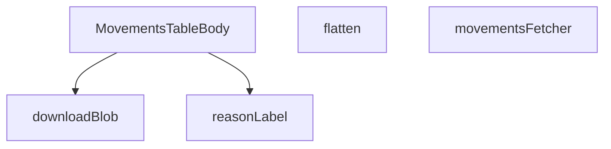

## Genel Bakış

Bu modül, admin panelindeHVAC ekipman hareketlerinin (sevk, kurulum, bakım vb.) tabloda listelenmesinden sorumludur. Supabase üzerinden ham veriyi çeker, ilişkisel veri yapısını düzleştirerek bileşenlerin kullanabileceği forma dönüştürür ve yerelleştirilmiş etiketlerle birlikte satır bazlı olarak sunar.

## Fonksiyon Grupları

### Veri Çekme ve Dönüştürme
Bu grup, Supabase'den hareket kayıtlarını çeker ve birleşik (join) satır yapısını düz, tablo dostu forma dönüştürür.
- `movementsFetcher` — Supabase istemcisi ve filtre parametrelerini alarak hareket verilerini asenkron olarak çeker, sayfalama metadata'sı ile birlikte sonuç döndürür.
- `flatten` — İlişkisel olarak zenginleştirilmiş MovementJoinRow yapısını, tabloda doğrudan kullanılabilecek daha basit MovementRow yapısına dönüştürür.

### Sunum ve Bileşen
Bu grup, veriyi tarayıcıda kullanıcıya görsel olarak sunan React bileşenini kapsar.
- `MovementsTableBody` — Admin tablosunun gövde kısmını render eden ana React bileşenidir; satırları haritalandırarak hücreleri oluşturur.

### Yardımcı Araçlar
Bu grup, yerelleştirme ve dosya indirme gibi destekleyen küçük yardımcı fonksiyonları barındırır.
- `reasonLabel` — Hareket sebebi anahtarlarını (ör. "maintenance", "transfer") çeviri fonksiyonu ile birlikte insan okunabilir etiketlere dönüştürür.
- `downloadBlob` — Blob nesnesini tarayıcıda belirtilen dosya adıyla kullanıcıya indirilir hale getirir (muhtemelen dışa aktarma işlevi için).

---

## AXIOMS – Mimari Varsayımlar

Bu modül, hareket kayıtlarının (movements) gösterimi, filtrelenmesi ve dışa aktarılmasını sağlayan bir admin tablosu bileşenidir.

---

## FONKSİYON DETAYLARI

### reasonLabel
**Ne yapar**: Bir envanter hareketi sebebi anahtarını (örn: 'sale', 'po_receipt'), kullanıcının anlayabileceği uluslararasılaştırılmış (i18n) bir etikete dönüştürür. Bu, UI tablosunda "Sebep" sütununda gösterilecek metni üretir.

**Nasıl yapar**: Fonksiyon, bir `key` string'i ve bir çeviri fonksiyonu `t` alır. Öncelikle `key`'yi boş bir string'e çevirir. Eğer bu string `'undo'` ile başlıyorsa doğrudan ilgili çeviri anahtarını döner. Aksi halde, `switch` yapısıyla belirli sebep anahtarlarını kontrol eder ve karşılık gelen çeviri anahtarını `t()` fonksiyonuna gönderir. Eşleşme bulunamazsa varsayılan olarak '-' döner.

**Parametreler**:
- `key`: `string | null | undefined` — Dönüştürülecek envanter hareketi sebebi anahtarı. Null veya undefined olabilir, bu durumda boş string olarak işlenir.
- `t`: `(k: string) => string` — Belirtilen bir çeviri anahtarını, o dildeki metne çeviren i18n fonksiyonu (örn: react-i18next `useTranslation` hook'unun `t` fonksiyonu).

**Dönüş**: `string` — Verilen sebep anahtarının localized etiketi veya tanınamazsa '-'.

### flatten
**Ne yapar**: Supabase'den `inventory_movements` tablosunu `products` tablosuyla birleştiren (JOIN) satır verisini (`MovementJoinRow`), uygulamanın içinde kullandığı düz (`MovementRow`) veri yapısına dönüştürür. Bu, veriyi işleyen bileşenlerin daha basit bir yapıya erişmesini sağlar.

**Nasıl yapar**: Fonksiyon, girdi olarak alınan `row` nesnesinin belirli alanlarını (`id`, `product_id`, `delta`, vb.) doğrudan kullanarak yeni bir nesne oluşturur. Kritik dönüşüm, birleşik tablodan gelen `products` (ürün) verisinin, hedef nesnede `product` adıyla eşlenmesidir.

**Parametreler**:
- `row`: `MovementJoinRow` — Supabase sorgusundan dönen ve `products` tablosunu içeren birleşik (joined) satır verisi.

**Dönüş**: `MovementRow` — Uygulamanın UI katmanında kullanacağı düzleştirilmiş, sadece gerekli alanları içeren hareket satırı nesnesi.

### movementsFetcher
**Ne yapar**: Supabase istemcisini kullanarak `inventory_movements` tablosundan sayfalanmış, sıralanmış, filtrelenmiş ve aranmış verileri çeker. Bu, bir admin tablosu için ana veri getirme (fetching) fonksiyonudur.

**Nasıl yapar**: Fonksiyon, `supabase` istemcisi ve `params` (sayfalama, sıralama, arama ve filtre parametreleri) alır. İlk olarak `inventory_movements` tablosunu, ilgili `products` alanlarıyla (`id`, `name`, `sku`, `category_id`) birleştirerek bir sorgu başlatır ve toplam eşleşen kayıt sayısını (`count: 'exact'`) ister. Ardından sıralama (`order`) parametresine göre sorguyu düzenler; `'product'` sıralama anahtarı özel olarak `products` tablosunun `name` alanına göre sıralama yapar. Arama (`query`) varsa, `products` tablosundaki `name` ve `sku` alanlarında `ILIKE` kullanarak eşleşen kayıtları filtreler. Kategori (`category`), sebep (`reason`), tarih aralığı (`from`, `to`) ve parti ID'si (`batch`) filtrelerini sorguya ekler. Son olarak `range` metodunu kullanarak sayfalama yapar ve hata yönetimi sonrası, ham JOIN verisini `flatten` fonksiyonuyla dönüştürerek sonuç döner.

**Parametreler**:
- `supabase`: `SupabaseClient<Database>` — Veritabanı işlemleri için yapılandırılmış Supabase istemcisi.
- `params`: `FetchParams` — İsteğe bağlı sıralama, sayfalama, arama sorgusu ve filtreleri içeren parametre nesnesi.

**Dönüş**: `Promise<FetchResult<MovementRow>>` — Bir `Promise` olarak, `rows` (dönüşmüş `MovementRow` dizisi) ve `totalMatched` (tüm filtrelemeye rağmen toplam eşleşen kayıt sayısı) alanlarını içeren sonuç nesnesi. Sorgu hatası oluşursa bir `error` fırlatır.

### MovementsTableBody
**Ne yapar**: Geliştirildi ancak detay üretilemedi.

### downloadBlob
**Ne yapar**: Geliştirildi ancak detay üretilemedi.

---

## İTHALATLAR (IMPORTS)
- import: ../../components/admin/AdminEmptyState::AdminEmptyState
- import: ../../components/admin/AdminToolbar::AdminToolbar
- import: ../../components/admin/DateRangePicker::DateRangePicker
- import: ../../components/admin/ExportMenu::ExportMenu
- import: ../../components/admin/data-table/DataTableKit::DataTableKit
- import: ../../components/admin/data-table/types::type { AdminColumn }
- import: ../../hooks/useAdminTable::type FetchParams
- import: ../../hooks/useAdminTable::type FetchResult
- import: ../../hooks/useAdminTable::useAdminTable
- import: ../../i18n/I18nProvider::useI18n
- import: ../../i18n/datetime::formatDateTime
- import: ../../types/database.types::type { Database }
- import: ../../utils/adminUi::adminTableActionWarningClass
- import: @/lib/supabase/client::supabaseBrowserClient
- import: @supabase/supabase-js::type { SupabaseClient }
- import: date-fns::endOfDay
- import: lucide-react::ArrowDownRight
- import: lucide-react::ArrowUpRight
- import: lucide-react::PackageMinus
- import: lucide-react::SearchX
- import: next/navigation::useSearchParams
- import: react-day-picker::type { DateRange }
- import: react::React
- import: react::useCallback
- import: react::useEffect
- import: react::useMemo
- import: react::useState

---

## INTERFACES

### MovementProduct
- `id: string`
- `name: string`
- `sku: string | null`
- `category_id: string | null`

### MovementJoinRow
Embedded inner-join satırı (select sırasıyla aynı).
- `id: string`
- `product_id: string`
- `delta: number`
- `reason: string | null`
- `order_id: string | null`
- `created_at: string`
- `batch_id: string | null`
- `products: MovementProduct`

### MovementRow
Kit'in kullandığı düzleştirilmiş satır (cell'ler product.name/sku okur).
- `id: string`
- `product_id: string`
- `delta: number`
- `reason: string | null`
- `order_id: string | null`
- `created_at: string`
- `batch_id: string | null`
- `product: MovementProduct`

### CategoryRow
- `id: string`
- `name: string`

---

## SABİTLER
- **ALL_REASONS** (as_expression) — `[
  'sale',
  'po_receipt',
  'manual_in',
  'manual_out',
  'adjust',
...`

---

## AST POINTERS

### [N1_NASIL] AST Pointer: src/views/admin/MovementsTableBody.tsx::reasonLabel
- **params**: `key: string | null | undefined` — hareket sebebi anahtarı (örn: 'sale', 'manual_in'), `t: (k: string) => string` — i18n çeviri fonksiyonu
- **ic_degiskenler**:
  - `val` — key'in null/undefined olma durumunu güvenlik altına alan, boş string'e fallback edilmiş string karşılığı
- **Dönüş**: `string` — verilen key'e karşılık gelen lokalize edilmiş insan-okunabilir sebep etiketi; bilinmeyen keyler için `'-'`

---

### [N2_NASIL] AST Pointer: src/views/admin/MovementsTableBody.tsx::flatten
- **params**: `row: MovementJoinRow` — Supabase'den `products!inner` join ile çekilmiş, products nesnesini içeren hammadde satır verisi
- **ic_degiskenler**: (yok — inline object literal döndürür)
- **Dönüş**: `MovementRow` — join edilmiş satırı düzleştirilmiş, product alanını `row.products` referansıyla eşlemiş MovementRow objesine dönüştürür

---

### [N3_NASIL] AST Pointer: src/views/admin/MovementsTableBody.tsx::movementsFetcher
- **params**: `supabase: SupabaseClient<Database>` — Supabase istemci实例, `params: FetchParams` — sayfalama, sıralama, arama ve filtre parametrelerini taşıyan nesne
- **ic_degiskenler**:
  - `query` — `inventory_movements` tablosu üzerinde zincirleme filtre/sıralama uygulanan Supabase sorgu builder nesnesi
  - `sortKey` — sıralama için kullanılacak前端 anahtarı; `params.sort?.key` veya varsayılan `'date'`
  - `ascending` — sıralama yönü boolean'ı; `params.sort?.dir === 'asc'` karşılaştırmasından türetilir
  - `colMap` — frontend sıralama anahtarlarını (`date`, `delta`, `reason`, `ref`) veritabanı kolon adlarına (`created_at`, `delta`, `reason`, `order_id`) eşleyen harita
  - `like` — ürün adı/SKU araması için `%query%` formatında SQL LIKE kalıbı
  - `category` — kategori filtresinin ilk değeri (`params.filters.category?.[0]`), undefined ise filtre uygulanmaz
  - `reasons` — çoklu sebep filtresi dizisi (`params.filters.reason ?? []`), boş değilse `query.in` ile uygulanır
  - `from` — tarih aralığı başlangıcı (`params.filters.from?.[0]`), ISO string formatında
  - `to` — tarih aralığı bitişi (`params.filters.to?.[0]`), ISO string formatında
  - `batch` — parti (batch) deep-link filtresi değeri (`params.filters.batch?.[0]`)
  - `offset` — sayfalama offset'i; `(params.page - 1) * params.pageSize` hesaplamasıyla elde edilir
  - `joinRows` — Supabase yanıtının `data` alanından türetilen `MovementJoinRow[]` dizisi; null ise boş diziye fallback edilir
- **Dönüş**: `Promise<FetchResult<MovementRow>>` — `rows` (düzleştirilmiş satırlar) ve `totalMatched` (toplam eşleşme sayısı) içeren sonuç nesnesi; Supabase hataları `throw` ile yükseltilir

---

### [N4_NASIL] AST Pointer: src/views/admin/MovementsTableBody.tsx::MovementsTableBody
- **params**: (yok — React functional component, props almaz)
- **ic_degiskenler** (closure'lardan çıkarılan):
  - `batchParam` — URL search parametrelerinden gelen batch filtresi değeri; varsa `filters` nesnesine `batch` alanı olarak eklenir
  - `filters` — aktif filtrelerin tutulduğu state nesnesi (from, to, category, reason, batch alanları içerir)
  - `setFilter` — filters state'ini güncelleyen setter fonksiyonu; belirli bir filtre anahtarını yeni değerle yazar
  - `setQuery` — arama sorgusu state'ini güncelleyen setter fonksiyonu
  - `categories` — Supabase'den çekilmiş kategori satırları dizisi (`CategoryRow[]`); toolbar'da kategori dropdown'ını besler
  - `setCategories` — categories state'ini güncelleyen setter fonksiyonu
  - `supabaseBrowserClient` — tarayıcı tarafı Supabase istemcisi; kategori listesini çekmek için kullanılır
  - `table` — DataTableKit tarafından sağlanan tablo kontrol nesnesi; `fetchAllForExport()` ile tüm veriyi dışa aktarma için çeker
  - `exportHeaders` — CSV/XLS dışa aktarımında kullanılacak sütun başlıkları dizisi (t() ile çevrilmiş)
  - `buildExportRows` — `MovementRow[]` dizisini dışa aktarım formatına (date, product, sku, delta, reason, ref) dönüştüren mapper fonksiyonu
  - `formatDateTime` — ISO tarih stringlerini lokalize edilmiş insan-okunabilir formata dönüştüren yardımcı fonksiyon
  - `lang` — mevcut dil kodu (`'tr'` veya `'en'`); `formatDateTime` ve sıralama tercihlerine paslanır
  - `t` — i18n çeviri fonksiyonu; tüm UI etiketlerini ve başlıkları çevirir
  - `activeReasons` — aktif/seçili sebep filtrelerinin dizisi; reason toggle'larında okunup yazılır
  - `cancelled` — useEffect cleanup flag'i; async kategori çekme işleminin bileşen unmount sonrası state güncellemesini engeller
  - `dateRange` — filtrelerden türetilen DateRange objesi (from/to); react-day-picker bileşenine bağlanır
- **Dönüş**: `React.FC` — admin panelinde envanter hareketlerini tablo halinde gösteren, filtre/sıralama/sayfalama/dışa aktarma özellikli React bileşeni

---

### [N5_NASIL] AST Pointer: src/views/admin/MovementsTableBody.tsx::downloadBlob
- **params**: `blob: Blob` — indirilecek dosyanın Blob nesnesi (CSV veya HTML içeriği), `filename: string` — kullanıcının dosya sistemine kaydedilecek dosya adı (örn: 'inventory_movements.csv')
- **ic_degiskenler**:
  - `url` — Blob nesnesinden oluşturulan geçici object URL'i; tarayıcı tarafında dosyaya erişim sağlar
  - `link` — programatik olarak oluşturulan `<a>` DOM elemanı; `href` ve `download` öznitelikleri ayarlanıp otomatik tıklanır
- **Dönüş**: yok (void) — dosya indirmeyi tetikler, `URL.revokeObjectURL` ile object URL'i temizler; yan etki olarak tarayıcıya dosya kaydetme diyaloğu açtırır

---

## MERMAID CALL GRAPH

## NODE ID STANDARD

  file: src\views\admin\MovementsTableBody.tsx
  function: src\views\admin\MovementsTableBody.tsx::reasonLabel
  function: src\views\admin\MovementsTableBody.tsx::flatten
  function: src\views\admin\MovementsTableBody.tsx::movementsFetcher
  function: src\views\admin\MovementsTableBody.tsx::MovementsTableBody
  function: src\views\admin\MovementsTableBody.tsx::downloadBlob

---

## DISA AKTARILANLAR (EXPORTS)
  export: MovementsTableBody
  export: flatten
  export: movementsFetcher
  export: reasonLabel

---

## STİL TOKENLERİ

### Arbitrary Değerler (token'a geçirilmemiş)
Yok — tüm stiller token'a geçirilmiş. ✅

### Kullanılan Token'lar (zaten token'a geçirilmiş)
- `tracking-hvac-tight`

### Tailwind Sınıf Özeti
- **Renkler:** `bg-amber-500`, `bg-cyan-500/50`, `bg-emerald-500/10`, `bg-rose-500/10`, `bg-white/5`, `border-amber-500/20`, `border-emerald-500/20`, `border-rose-500/20`, `border-white/5`, `text-amber-400`, `text-brand-cyan`, `text-emerald-400`, `text-rose-500`, `text-slate-400`, `text-slate-500`
- **Layout:** `flex`, `flex-col`, `gap-0.5`, `gap-1`, `gap-2`, `h-1`, `h-1.5`, `inline-flex`, `items-center`, `justify-between`, `p-4`, `w-1`, `w-1.5`, `w-fit`
- **Varyant/Responsive:** `:` önekleri
- **Yardımcı Sınıflar:** `$`, `${adminTableActionWarningClass`, `0`, `:`, `<`, `>`, `animate-pulse`, `border`, `font-black`, `font-bold`, `font-mono`, `glass-strong`, `m.delta`, `ml-1`, `px-2`