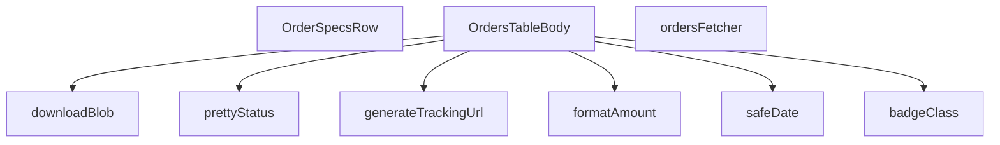

## Genel Bakış
Bu modül, yönetici panelindeki siparişlerin tablo görünümünü oluşturan ve yöneten bir React bileşenidir. Sipariş verilerini Supabase'den çeker, formatsız verileri insan tarafından okunabilir formata dönüştürür, kargo takip URL'leri üretir ve dosya indirme işlemleri gibi yardımcı işlevleri sunar. Modül, sipariş yönetimi için gerekli tüm görünüm ve veri işleme mantığını merkezi olarak yönetir.

## Fonksiyon Grupları

### Görünüm ve Biçimlendirme Yardımcıları
Ham verileri (para, tarih, durum) kullanıcı dostu gösterime dönüştüren ve görsel durum sınıflandırması yapan yardımcı fonksiyonlar.
- formatAmount, safeDate, prettyStatus, badgeClass

### Veri Kaynağı
Supabase istemcisi aracılığıyla admin siparişlerini filtreleme, sıralama ve sayfalama ile çeken asenkron veri获取 fonksiyonu.
- ordersFetcher

### Kargo Entegrasyonu
Kargo firması ve takip numarasından geçerli bir takip URL'i oluşturarak kullanıcının kargo durumunu izlemesini sağlayan fonksiyon.
- generateTrackingUrl

### Dosya İşlemleri
Oluşturulan blob nesnelerini tarayıcıda indirilebilir dosyaya dönüştüren fonksiyon (fatura, rapor gibi).
- downloadBlob

### Ana Bileşenler
Tüm bu yardımcıları ve veri kaynaklarını bir araya getirerek sipariş tablosunu ve satır içi detayları render eden React fonksiyonel bileşenleri.
- OrdersTableBody, OrderSpecsRow

---

## AXIOMS – Mimari Varsayımlar

Bu modül, admin sipariş tablosunu oluşturan React bileşenleri ve yardımcı fonksiyonlardan oluşur. Aşağıdaki varsayımlar fonksiyon imzalarından ve modül sabitlerinden türetilmiştir.

**[Aksiyom 1]:** `formatAmount` fonksiyonu yalnızca `number` veya `null`/`undefined` türünde `v` parametresi ile çağrılabilir. Eğer `v` geçerli bir sayısal değer değilse (örn. `NaN`, `Infinity`), formatlanmış tutar yerine hata veya beklenmeyen çıktı üretilebilir.

**[Aksiyom 2]:** `safeDate` fonksiyonu yalnızca geçerli bir ISO 8601 formatında tarih dizesi ile çağrılmalıdır. Eğer `iso` parametresi geçerli bir tarih dizesi değilse, formatlanmış tarih yerine geçersiz veya boş bir çıktı üretilebilir.

**[Aksiyom 3]:** `prettyStatus` fonksiyonu, bir durum kodunu (`s`) görüntü metnine dönüştürmek için `t` çeviri fonksiyonunu kullanır. Eğer `s` parametresi bilinen bir durum kodu değilse (`ORDER_STATUS_KEYS` içinde yer almıyorsa), çeviri fonksiyonu tanımsız anahtar hatası döndürebilir.

**[Aksiyom 4]:** `badgeClass` fonksiyonu, durum kodunu CSS sınıf adına eşler. Eğer `s` parametresi beklenmeyen bir durum kodu ise, varsayılan veya boş bir CSS sınıfı döndürülebilir (modül içindeki karşılığı bilinmiyor).

**[Aksiyom 5]:** `generateTrackingUrl` fonksiyonu, `carrier` ve `tracking` parametreleri her ikisi de dolu ve geçerli olduğunda bir URL döndürür. Eğer herhangi bir parametre boş string, `null` veya `undefined` ise, fonksiyon `null` döndürür.

**[Aksiyom 6]:** `ordersFetcher` fonksiyonu, geçerli bir `SupabaseClient<Database>` instance'ı gerektirir. Eğer `supabase` parametresi geçersiz veya oturumsuz bir client ise, veri çekme işlemi başarısız olur ve `FetchResult<AdminOrderRow>` Promise'i reject edilir.

**[Aksiyom 7]:** `OrderSpecsRow` React bileşeni yalnızca `orderId` prop'u ile çağrılabilir. Eğer `orderId` sağlanmamışsa, bileşen sipariş detaylarını getiremez ve hata durumuna düşebilir.

**[Aksiyom 8]:** `downloadBlob` fonksiyonu, yalnızca geçerli bir `Blob` nesnesi ve boş olmayan bir `filename` dizesi ile çağrılmalıdır. Eğer `blob` geçersiz bir Blob değilse veya `filename` boş string ise, tarayıcı indirme tetiklenemez.

**[Aksiyom 9]:** `SORT_COLUMN_MAP` sabiti, tablo sütun adlarını veritabanı alanlarıyla eşler. Eğer `OrdersTableBody` bileşeninde sıralama isteği geldiğinde sütun adı `SORT_COLUMN_MAP` içinde tanımlı değilse, sıralama yapılamaz (modül içindeki karşılığı bilinmiyor).

**[Aksiyom 10]:** `ORDER_SELECT` sabiti, `ordersFetcher` tarafından Supabase sorgusunda kullanılan alan listesini tanımlar. Bu liste ile `AdminOrderRow` tipi tutarlı olmalıdır; aksi takdirde TypeScript derleme hatası veya çalışma zamanı veri kaybı oluşur.

---

## FONKSİYON DETAYLARI

### formatAmount
**Ne yapar**: Bir sayısal değeri para birimi formatına dönüştürerek kullanıcıya gösterir. Değer geçerli bir sayı değilse, bir tire (-) karakteri döndürerek eksik veya tanımsız bir miktarı temsil eder.
**Nasıl yapar**: Fonksiyon, verilen `v` parametresinin `number` tipinde olup olmadığını `typeof` kontrolü ile doğrular. Eğer sayı ise, dışarıdan import edilen `formatCurrency` yardımcısını çağırır ve `maximumFractionDigits: 0` seçeneğiyle ondalıklı basamak göstermeden para birimi formatına dönüştürür. Değer `number` tipinde değilse (null, undefined veya diğer tipler), sabit bir '-' karakteri döndürür.
**Parametreler**:
- `v`: `number | null | undefined` — Formatlanacak para miktarı. Geçerli bir sayısal değer içermeyebilir.
- `lang`: `Lang` — Para birimi formatında kullanılacak dil/kültür ayarı (örn. 'tr', 'en'). Varsayılan olarak 'tr' alınır.
**Dönüş**: `string` — Biçimlendirilmiş para birimi dizesi veya eksik değerleri temsil eden '-' karakteri.

### safeDate
**Ne yapar**: ISO formatındaki bir tarih dizesini, belirli bir dil için formatlanmış bir tarih-saat dizesine dönüştürür. Geçersiz bir tarih girilmesi durumunda hata fırlatmak yerine ham ISO dizesini güvenli bir şekilde döndürür.
**Nasıl yapar**: Fonksiyon, bir `try-catch` bloğu içinde çalışır. `try` bloğunda, dışarıdan import edilen `formatDateTime` yardımcısını çağırarak ISO dizesini formatlamaya çalışır. Herhangi bir hata (örn. geçersiz tarih formatı) oluşursa, `catch` bloğu yakalar ve hataya yol açan ham `iso` dizesini olduğu gibi döndürerek uygulamanın çökmesini önler.
**Parametreler**:
- `iso`: `string` — Biçimlendirilecek tarih ve saat bilgisini içeren ISO 8601 formatında dize.
- `lang`: `Lang` — Tarih formatında kullanılacak dil/kültür ayarı. Varsayılan olarak 'tr' alınır.
**Dönüş**: `string` — Biçimlendirilmiş tarih-saat dizesi veya geçersiz girdi durumunda orijinal ISO dizesi.

### prettyStatus
**Ne yapar**: Ham durum string'lerini (örn. 'pending', 'shipped') insan tarafından okunabilir, yerelleştirilmiş etiketlere dönüştürür. Bu işlem, bir çeviri fonksiyonu (`t`) kullanılarak dinamik dil desteğiyle yapılır.
**Nasıl yapar**: Fonksiyon, gelen `s` durum string'inin boş olup olmadığını kontrol eder. Boşsa, olduğu gibi döndürür. Değilse, string'i küçük harfe dönüştürerek bir `switch-case` yapısına sokar. Her bilinen durum anahtarı için, önceden tanımlanmış bir çeviri yolunu (örn. 'admin.orders.statusLabels.pending') `t` çeviri fonksiyonuna parametre olarak verir ve çevirilmiş etiketi döndürür. Tanınmayan bir durum gelirse, orijinal `s` string'i döndürülür.
**Parametreler**:
- `s`: `string` — Çevrilecek ham durum kodu (örn. 'pending', 'delivered').
- `t`: `(key: string, params?: Record<string, unknown>) => string` — Çeviri anahtarını ve opsiyonel parametreleri alıp, güncel dil ayarına göre çevrilmiş bir dize döndüren çeviri fonksiyonu.
**Dönüş**: `string` — Çevrilmiş durum etiketi veya tanınamayan durum için orijinal ham dize.

### badgeClass
**Ne yapar**: Bir sipariş durumu string'ine karşılık gelen, görsel olarak ayırt edici CSS sınıf dizesini üretir. Bu sınıflar, arayüzde durum etiketlerinin rengi, stili ve gölgelendirmesi için kullanılır.
**Nasıl yapar**: Fonksiyon, gelen `s` string'inin boş olup olmadığını kontrol eder. Boşsa, nötr gri tonlarında bir stil dizesi döndürür. Doluysa, string'i küçük harfe dönüştürerek bir `switch-case` yapısına sokar. Her bilinen durum (pending, paid, confirmed, vb.) için, önceden tanımlanmış bir `base` stil dizesine (yaygın sınıflar) ek olarak, o duruma özgü renk ve gölge sınıflarını dinamik bir dize oluşturarak ekler. 'refunded' ve 'partial_refunded' durumları aynı stil setini paylaşır. Tanınmayan durumlar için varsayılan bir stil dizesi döndürülür.
**Parametreler**:
- `s`: `string` — Stil için kullanılacak durum kodu (örn. 'paid', 'cancelled').
**Dönüş**: `string` — Tailwind CSS sınıflarını içeren, doğrudan JSX'e uygulanabilecek stil dizesi.

### generateTrackingUrl
**Ne yapar**: Verilen kargo firması ve takip numarası bilgilerine göre, o firmaya özel kargo takip sayfasının URL'sini oluşturur. Desteklenmeyen bir firma girilmesi durumunda null döndürerek takip linkinin oluşturulamayacağını belirtir.
**Nasıl yapar**: Fonksiyon, öncelikle `carrier` ve `tracking` parametrelerinin her ikisinin de dolu olup olmadığını kontrol eder. Herhangi biri boşsa `null` döndürür. Kargo firması adını küçük harfe dönüştürerek (`carrier.toLowerCase()`) bir dizi `if` kontrolü yapar. Adın içinde belirli anahtar kelimeler ('yurtici', 'aras', 'mng', 'ptt') arar. Eşleşme bulunursa, ilgili kargo firmasının bilinen takip URL yapısını ve verilen `tracking` numarasını birleştirerek bir dize oluşturur. Hiçbir eşleşme olmazsa `null` döndürür.
**Parametreler**:
- `carrier`: `string` — Kargo firmanın adı (örn. 'Yurtiçi Kargo', 'Aras Kargo').
- `tracking`: `string` — Kargonun takip numarası.
**Dönüş**: `string | null` — Oluşturulmuş takip URL'si veya desteklenmeyen firma/eksik bilgi durumunda `null`.

### ordersFetcher
**Ne yapar**: Supabase veritabanından admin paneli için sipariş listesini çeker. Çekme işlemini, sayfalama, sıralama, metin araması ve çeşitli filtreleme (durum, tarih aralığı) kriterlerine göre sunucu tarafında (server-side) yapılandırarak verimli ve doğru sonuçlar döndürür.
**Nasıl yapar**: Fonksiyon, önce `ensureSessionFresh` ile oturumun taze olduğundan emin olur. Ardından `view_admin_orders` görünümünden `ORDER_SELECT` sabitinde tanımlı sütunları seçerek bir sorgu başlatır. `params` nesnesindeki bilgilere göre sorguyu zincirleme olarak modifiye eder:
1. **Sıralama**: `params.sort.key` ve `params.sort.dir` değerlerine göre, `SORT_COLUMN_MAP` kullanarak sunucu tarafında sıralama uygular.
2. **Arama**: `params.query` içindeki metni, `search_text` sütununda `ilike` ile arar.
3. **Durum Filtresi**: `params.filters.status` dizisine göre tekli (`eq`) veya çoklu (`in`) durum filtresi uygular. Özel bir `preset` ('pendingShipments') varsa, belirli durumlarda `shipped_at` alanı boş olan kayıtları filtreler.
4. **Tarih Filtresi**: `params.filters.from` ve `params.filters.to` ile `created_at` sütunu üzerinde aralık filtresi (`gte`, `lte`) uygular.
Son olarak, `params.page` ve `params.pageSize` kullanarak sorguya `range` uygular ve sayfalı veriyi çeker. Sonuçta oluşabilecek bir hatayı `throw` ile yeniden fırlatır. Başarılı olursa, `AdminOrderRow` tipindeki satırları ve toplam eşleşme sayısını içeren bir nesne döndürür.
**Parametreler**:
- `supabase`: `SupabaseClient<Database>` — Veritabanı işlemleri için kullanılacak, `Database` tipinde şemaya sahip Supabase istemcisi.
- `params`: `FetchParams` — Sorgu parametrelerini içeren nesne. İçinde `page`, `pageSize`, `sort` (sıralama), `query` (arama metni) ve `filters` (durum, tarih, preset) alanları bulunur.
**Dönüş**: `Promise<FetchResult<AdminOrderRow>>` — Asenkron bir Promise. Çözüldüğünde `{ rows: AdminOrderRow[], totalMatched: number }` yapısında bir nesne döndürür. `rows`, sayfalı sipariş verisini; `totalMatched`, filtreleme ve arama kriterlerine uyan toplam kayıt sayısını temsil eder.

### OrderSpecsRow
**Ne yapar**: Bu bir React fonksiyonel bileşenidir. Verilen bir sipariş ID'sine ait sipariş detaylarını (örn. ürün listesi, miktarlar, birim fiyatlar) gösteren bir satır (row) veya bölüm oluşturur.
**Nasıl yapar**: Fonksiyon, bir React bileşeni döndürür. Bileşen, props olarak `orderId` alır ve bu ID'ye karşılık gelen sipariş detaylarını göstermek için kullanılacak JSX yapısını (`React.FC<OrderSpecsRowProps>` olarak tanımlı) render eder. Bileşenin iç mantığı, verilen kaynak kodunda belirtilmemiştir, bu nedenle sadece bileşenin temel amacını ve kabul ettiği props'u biliyoruz.
**Parametreler**:
- `orderId`: `OrderSpecsRowProps` içinde tanımlı, siparişin benzersiz tanımlayıcısı. Bileşenin hangi siparişin detaylarını göstereceğini belirler.
**Dönüş**: `React.FC<OrderSpecsRowProps>` — Sipariş detaylarını görüntüleyen bir React bileşeni.

### OrdersTableBody
**Ne yapar**: Admin siparişlerini tablo içinde listeleyen React bileşenidir.

**Nasıl yapar**: Bu bir React fonksiyonel bileşenidir (`React.FC`). Sipariş verilerini alarak her bir satırı tablo hücreleri formatında render eder. Sipariş durumu, tutar, tarih ve kargo takip gibi bilgileri görsel olarak düzenler. Durum etiketleri için `prettyStatus` ve `badgeClass` yardımcı fonksiyonlarını, para birimi gösterimi için `formatAmount`'ı, tarih gösterimi için `safeDate`'i ve kargo takip linkleri için `generateTrackingUrl`'yi kullanır.

**Parametreler**:
- Bu bileşen doğrudan parametre almaz, props veya bağlam (context) üzerinden verileri edinir.

**Dönüş**: `React.FC` — Render edilmiş tablo gövdesi JSX'i.

### downloadBlob
**Ne yapar**: Tarayıcı tarafında bir `Blob` nesnesini kullanıcıya indirme olarak sunar.

**Nasıl yapar**: Verilen `Blob` nesnesinden geçici bir URL.createObjectURL oluşturur, bu URL'yi bir `<a>` etiketinin `href` öelliğine atar, `download` niteliğini dosya adıyla ayarlar, etiketi programatik olarak tıklatır ve ardından hem URL'yi `revokeObjectURL` ile serbest bırakır hem de `<a>` etriketini DOM'dan kaldırır. Bu sayede harici bir kütüphane kullanmadan dosya indirme işlemi gerçekleştirilir.

**Parametreler**:
- `blob`: `Blob` — İndirilecek veriyi içeren Blob nesnesi (örn: PDF, CSV, resim dosyası).
- `filename`: `string` — Kullanıcıya sunulacak dosya adı (örn: `"siparisler.pdf"`).

**Dönüş**: `void` — Değer döndürmez, tarayıcıda dosya indirme tetikler.

---

## İTHALATLAR (IMPORTS)
- import: ../../components/admin/AdminEmptyState::AdminEmptyState
- import: ../../components/admin/AdminToolbar::AdminToolbar
- import: ../../components/admin/DateRangePicker::DateRangePicker
- import: ../../components/admin/ExportMenu::ExportMenu
- import: ../../components/admin/data-table/BulkBar::BulkBar
- import: ../../components/admin/data-table/BulkBar::type BulkAction
- import: ../../components/admin/data-table/DataTableKit::DataTableKit
- import: ../../components/admin/data-table/types::type { AdminColumn }
- import: ../../components/admin/orders/OrderFormModal::OrderFormModal
- import: ../../hooks/useAdminTable::type FetchParams
- import: ../../hooks/useAdminTable::type FetchResult
- import: ../../hooks/useAdminTable::useAdminTable
- import: ../../hooks/useRole::useRole
- import: ../../i18n/I18nContext::type { Lang }
- import: ../../i18n/I18nProvider::useI18n
- import: ../../i18n/datetime::formatDateTime
- import: ../../i18n/format::formatCurrency
- import: ../../lib/ensureSessionFresh::ensureSessionFresh
- import: ../../types/database.types::type { Database }
- import: @/lib/admin/mutateWithAudit::AdminPermissionError
- import: @/lib/admin/mutateWithAudit::mutateWithAudit
- import: @/lib/supabase/client::supabaseBrowserClient
- import: @supabase/supabase-js::type { SupabaseClient }
- import: date-fns::endOfDay
- import: lucide-react::Info
- import: lucide-react::ShoppingCart
- import: lucide-react::X
- import: react-day-picker::type { DateRange }
- import: react::React
- import: react::useCallback
- import: react::useEffect
- import: react::useMemo
- import: react::useState
- import: sonner::toast

---

## INTERFACES

### AdminOrderRow
- `id: string`
- `status: 'pending' | 'paid' | 'confirmed' | 'shipped' | 'cancelled' | 'refunded' | 'partial_refunded' | string`
- `conversation_id?: string | null`
- `total_amount?: number | null`
- `created_at: string`
- `order_number?: string | null`
- `customer_name?: string | null`
- `customer_email?: string | null`
- `customer_phone?: string | null`

### EmailLog
- `subject: string`
- `email_to: string`
- `provider_message_id: string | null`
- `created_at: string`
- `carrier: string | null`
- `tracking_number: string | null`

### OrderNote
- `id: string`
- `note: string`
- `created_at: string`
- `user_id: string | null`

### DetailOrderItem
- `id: string`
- `product_id?: string | null`
- `product_name: string`
- `quantity: number`
- `price_at_time: number`
- `product_image_url?: string | null`

### DetailOrder
- `id: string`
- `total_amount: number | null`
- `status: string`
- `payment_status?: string | null`
- `created_at: string`
- `customer_name?: string | null`
- `customer_email?: string | null`
- `shipping_address?: unknown`
- `order_number?: string | null`
- `conversation_id?: string | null`
- `carrier?: string | null`
- `tracking_number?: string | null`
- `tracking_url?: string | null`
- `shipped_at?: string | null`
- `delivered_at?: string | null`
- `shipping_method?: string | null`
- `invoice_type?: string | null`
- `invoice_info?: unknown`
- `legal_consents?: unknown`
- `venthub_order_items: DetailOrderItem[]`

### ShippingAddress
- `fullAddress?: string`
- `street?: string`
- `city?: string`
- `district?: string`
- `state?: string`
- `postalCode?: string`
- `postal_code?: string`

### InvoiceInfo
- `companyName?: string`
- `company_name?: string`
- `taxOffice?: string`
- `tax_office?: string`
- `taxNumber?: string`
- `tax_no?: string`
- `tcNo?: string`
- `tc_no?: string`
- `national_id?: string`

### OrderSpecsRowProps
- `orderId: string`

---

## SABİTLER
- **ORDER_SELECT** (str) — `'id,status,conversation_id,total_amount,created_at,order_number,customer_name...`
- **SORT_COLUMN_MAP** (object) — `{
  created: 'created_at',
  id: 'id',
  status: 'status',
  conversation...`
- **ORDER_STATUS_KEYS** (as_expression) — `[
  'pending',
  'paid',
  'confirmed',
  'shipped',
  'delivered',
  '...`

---

## AST POINTERS

### [N1_NASIL] AST Pointer: src/views/admin/OrdersTableBody.tsx::formatAmount
- **params**: (v?: number | null, lang: Lang = 'tr')
- **ic_degiskenler**: 
  - `v` — Formatlanacak sayısal tutar, undefined veya null olabilir
  - `lang` — Para birimi formatı için dil kodu
- **Dönüş**: string — Biçimlendirilmiş para birimi stringi veya '-' ifadesi

### [N2_NASIL] AST Pointer: src/views/admin/OrdersTableBody.tsx::safeDate
- **params**: (iso: string, lang: Lang = 'tr')
- **ic_degiskenler**:
  - `iso` — Biçimlendirilecek ISO tarih stringi
  - `lang` — Tarih formatı için dil kodu
- **Dönüş**: string — Biçimlendirilmiş tarih veya hata durumunda ham ISO string

### [N3_NASIL] AST Pointer: src/views/admin/OrdersTableBody.tsx::prettyStatus
- **params**: (s: string, t: (key: string, params?: Record<string, unknown>) => string)
- **ic_degiskenler**:
  - `s` — Ham sipariş durumu stringi
  - `t` — Çeviri fonksiyonu
  - `key` — Küçük harfe dönüştürülmüş durum anahtarı
- **Dönüş**: string — Çevrilmiş durum etiketi

### [N4_NASIL] AST Pointer: src/views/admin/OrdersTableBody.tsx::badgeClass
- **params**: (s: string)
- **ic_degiskenler**:
  - `s` — Durum stringi
  - `base` — Ortak CSS sınıfları (font, padding, border vb.)
  - `key` — Küçük harfe dönüştürülmüş durum anahtarı
- **Dönüş**: string — Duruma göre renklendirilmiş CSS sınıfları

### [N5_NASIL] AST Pointer: src/views/admin/OrdersTableBody.tsx::generateTrackingUrl
- **params**: (carrier: string, tracking: string)
- **ic_degiskenler**:
  - `carrier` — Kargo şirketi adı
  - `tracking` — Kargo takip numarası
  - `c` — Küçük harfe dönüştürülmüş kargo şirketi adı
- **Dönüş**: string | null — Kargo sorgulama URL'i veya null

### [N6_NASIL] AST Pointer: src/views/admin/OrdersTableBody.tsx::ordersFetcher
- **params**: (supabase: SupabaseClient<Database>, params: FetchParams)
- **ic_degiskenler**:
  - `supabase` — Supabase istemcisi
  - `params` — SorguParametreleri (sıralama, sayfalama, filtreleme)
  - `ascending` — Sıralama yönü (true: artan, false: azalan)
  - `q` — Trim edilmişarama metni
  - `statuses` — Durum filtreleri dizisi
  - `preset` — Hazır filtre adı
  - `from` — Başlangıç tarihi
  - `to` — Bitiş tarihi
  - `offset` — Sayfalama için satır ofseti
  - `data` — Supabase sorgu sonucu satırlar
  - `error` — Sorgu hatası
  - `count` — Toplam eşleşen satır sayısı
- **Dönüş**: Promise<FetchResult<AdminOrderRow>> — Sipariş satırları ve toplam sayı

### [N7_NASIL] AST Pointer: src/views/admin/OrdersTableBody.tsx::OrderSpecsRow
- **params**: ({ orderId })
- **ic_degiskenler**:
  - `orderId` — Detayları getirilecek sipariş ID'si
  - `t` — Çeviri fonksiyonu
  - `lang` — Dil kodu
  - `loading` — Yüklenme durumu (boolean state)
  - `order` — Sipariş detayı (DetailOrder | null state)
  - `active` — Bileşen aktiflik bayrağı (cleanup için)
  - `data` — Supabase sorgu sonucu
  - `error` — Sorgu hatası
  - `rawItems` — Ham sipariş kalemleri dizisi
  - `mappedItems` — Dönüştürülmüş sipariş kalemleri dizisi
  - `items` — Sipariş kalemleri (order?.venthub_order_items)
  - `addr` — Teslimat adresi (ShippingAddress | null)
  - `invoice` — Fatura bilgisi (InvoiceInfo | null)
- **Dönüş**: React.FC — Sipariş detaylarını gösteren JSX bileşeni

### [N8_NASIL] AST Pointer: src/views/admin/OrdersTableBody.tsx::OrdersTableBody
- **params**: ()
- **ic_degiskenler**:
  - `activeStatuses` — Aktif durum filtreleri dizisi
  - `setFilter` — Filtre güncelleme fonksiyonu
  - `bulkMode` — Toplu işlem modu (boolean state)
  - `shipId` — Kargoya verilecek sipariş ID'si (string state)
  - `carrier` — Kargo şirketi (string state)
  - `tracking` — Takip numarası (string state)
  - `sendEmail` — E-posta gönderme seçeneği (boolean state)
  - `shipOpen` — Kargo modal durumu (boolean state)
  - `logsOpen` — Log modal durumu (boolean state)
  - `logsLoading` — Log yüklenme durumu (boolean state)
  - `emailLogs` — E-posta logları dizisi (EmailLog[] state)
  - `notesOpen` — Not modal durumu (boolean state)
  - `notesOrderId` — Not eklenen sipariş ID'si (string state)
  - `notes` — Sipariş notları dizisi (OrderNote[] state)
  - `noteInput` — Yeni not metni (string state)
  - `hasWriteAccess` — Yazma izni (boolean)
  - `table` — Tablo instance (tablo işlemleri için)
  - `query` — Arama metni (string)
  - `setSearchQuery` — Arama metni güncelleme
  - `setQuery` — Arama metni state setter
  - `exportHeaders` — CSV/XLS export başlıkları dizisi
- **Dönüş**: React.FC — Sipariş tablosu ve ilgili modalları gösteren JSX bileşeni

### [N9_NASIL] AST Pointer: src/views/admin/OrdersTableBody.tsx::downloadBlob
- **params**: (blob: Blob, filename: string)
- **ic_degiskenler**:
  - `blob` — İndirilecek dosya verisi
  - `filename` — İndirilecek dosya adı
  - `url` — Blob için oluşturulan URL
  - `link` — İndirme bağlantısı HTML elemanı
- **Dönüş**: void — Tarayıcıda dosya indirme tetikler

---

## MERMAID CALL GRAPH

## NODE ID STANDARD

  file: src\views\admin\OrdersTableBody.tsx
  function: src\views\admin\OrdersTableBody.tsx::formatAmount
  function: src\views\admin\OrdersTableBody.tsx::safeDate
  function: src\views\admin\OrdersTableBody.tsx::prettyStatus
  function: src\views\admin\OrdersTableBody.tsx::badgeClass
  function: src\views\admin\OrdersTableBody.tsx::generateTrackingUrl
  function: src\views\admin\OrdersTableBody.tsx::ordersFetcher
  function: src\views\admin\OrdersTableBody.tsx::OrderSpecsRow
  function: src\views\admin\OrdersTableBody.tsx::OrdersTableBody
  function: src\views\admin\OrdersTableBody.tsx::downloadBlob

---

## DISA AKTARILANLAR (EXPORTS)
  export: OrderSpecsRow
  export: OrdersTableBody
  export: badgeClass
  export: formatAmount
  export: generateTrackingUrl
  export: ordersFetcher
  export: prettyStatus
  export: safeDate

---

## STİL TOKENLERİ

### Arbitrary Değerler (token'a geçirilmemiş)
Yok — tüm stiller token'a geçirilmiş. ✅

### Kullanılan Token'lar (zaten token'a geçirilmiş)
- `rounded-hvac-2xl`, `rounded-hvac-xl`, `shadow-glow-md`, `tracking-hvac-normal`, `tracking-hvac-relaxed`

### Tailwind Sınıf Özeti
- **Renkler:** `bg-clip-text`, `bg-cyan-400`, `bg-cyan-500`, `bg-cyan-500/10`, `bg-emerald-500`, `bg-gradient-to-r`, `bg-surface-darker/40`, `bg-surface-deep`, `bg-white/2`, `bg-white/3`, `bg-white/5`, `border-2`, `border-b`, `border-cyan-500/20`, `border-rose-500/20`
- **Layout:** `backdrop-blur-xl`, `bg-clip-text`, `block`, `custom-scrollbar`, `fixed`, `flex`, `flex-1`, `flex-col`, `flex-wrap`, `from-white`, `gap-1`, `gap-2`, `gap-3`, `gap-4`, `gap-8`
- **Varyant/Responsive:** `active:`, `focus-visible:`, `group-hover:`, `hover:`, `lg:`, `placeholder:` önekleri
- **Yardımcı Sınıflar:** `active:scale-95`, `animate-in`, `animate-spin`, `border`, `divide-white/2`, `divide-white/5`, `divide-y`, `duration-300`, `duration-500`, `fade-in`, `focus-visible:outline-none`, `focus-visible:ring-2`, `focus-visible:ring-cyan-500/20`, `focus-visible:ring-cyan-500/50`, `font-black`