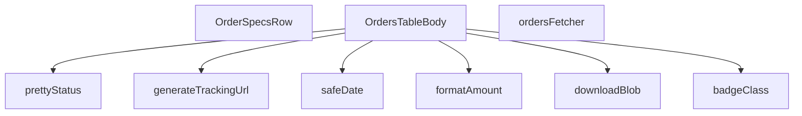

## Genel Bakış
Bu modül, yönetici panelindeki siparişlerin tablo görünümünü oluşturan React bileşenidir. Supabase'den sipariş verilerini çekme, ham verileri (para, tarih, durum) okunabilir biçime dönüştürme, kargo takip URL'leri üretme ve dosya indirme gibi yardımcı işlevleri merkezi olarak sunar.

## Fonksiyon Grupları

### Veri Biçimlendirme Yardımcıları
Para birimi, tarih ve sipariş durumu gibi ham verileri kullanıcının anlayabileceği, yerelleştirilmiş forma dönüştüren saf fonksiyonlar.
- formatAmount, safeDate, prettyStatus, badgeClass

### Veri Kaynağı
Supabase istemcisi ile sayfalama ve filtreleme parametrelerini kullanarak admin siparişlerini çeken asenkron veri获取 fonksiyonu.
- ordersFetcher

### Kargo Entegrasyonu
Kargo firması ve takip numarasından geçerli bir izleme URL'i üreten yardımcı fonksiyon.
- generateTrackingUrl

### Dosya İşlemleri
Tarayıcı tarafında oluşturulan blob nesnelerini indirilebilir dosyaya dönüştüren fonksiyon.
- downloadBlob

### Ana Bileşenler
Tüm yardımcı fonksiyonları ve veri kaynağını bir araya getirerek sipariş tablosunu ve satır içi detay satırlarını render eden React fonksiyonel bileşenleri.
- OrdersTableBody, OrderSpecsRow

---

## AXIOMS – Mimari Varsayımlar

Bu modül, yönetici sipariş tablosunu render eden ve veri çekme/formatlama yardımcı fonksiyonlarını içeren bir React bileşen kümesidir. Aşağıda, fonksiyon imzalarından türetilebilen mimari varsayımlar listelenmektedir.

[Aksiyom 1]: Eğer `formatAmount` fonksiyonuna geçilen `v` parametresi `undefined` veya `null` ise, fonksiyon geçerli bir varsayılan değer kullanmalıdır (örn: "0" formatı) — aksi halde formatlanmış çıktı tutarsız veya hatalı olur.

[Aksiyom 2]: Eğer `safeDate` fonksiyonuna geçilen `iso` parametresi geçerli bir ISO 8601 tarih dizgesi değilse, fonksiyon安全 bir şekilde hata yutmali veya geçersiz bir gösterim döndürmelidir — aksi halde tarih gösterimi kırılır.

[Aksiyom 3]: Eğer `prettyStatus` fonksiyonuna geçilen `t` çeviri fonksiyonu, verilen `s` durum anahtarı için bir çeviri tanımlamamışsa, döndürülen metin tanımsız veya ham anahtar metni olur — aksi halde kullanıcıya anlamsız durum gösterilir.

[Aksiyom 4]: Eğer `badgeClass` fonksiyonuna geçilen `s` durum dizgesi, bilinen bir durum anahtarı değilse, fonksiyon nötr bir varsayılan CSS sınıfı döndürmelidir — aksi halde badge stilinde hata oluşur.

[Aksiyom 5]: Eğer `generateTrackingUrl` fonksiyonuna geçilen `carrier` dizgesi bilinen bir kargo firması değilse, fonksiyon `null` döndürmelidir — aksi halde geçersiz bir takip URL'si oluşur.

[Aksiyom 6]: Eğer `ordersFetcher` fonksiyonuna geçilen `supabase` istemcisi geçerli bir `Database` şemasına sahip değilse, Supabase sorgusu hata verir — aksi halde veri çekme başarısız olur.

[Aksiyom 7]: Eğer `ordersFetcher` fonksiyonuna geçilen `params` nesnesi gerekli sayfalama/sıralama alanlarını içermiyorsa, Supabase sorgusu eksik parametrelerle çalışır — aksi halde beklenmeyen tüm kayıtlar veya hiç kayıt dönmez.

[Aksiyom 8]: Eğer `OrderSpecsRow` bileşenine geçilen `orderId` geçerli bir sipariş tanımlayıcısı değilse, bileşen içermesi gereken sipariş detaylarını gösteremez — aksi halde boş veya hatalı bir detay satırı render edilir.

[Aksiyom 9]: Eğer `SORT_COLUMN_MAP` sabiti, sıralama için kullanılabilecek tüm sütun anahtarlarını içermiyorsa, kullanıcı belirli sütunlara göre sıralama yapamaz — aksi halde sıralama işlevi eksik çalışır.

[Aksiyom 10]: Eğer `ORDER_STATUS_KEYS` sabiti tüm olası sipariş durumlarını kapsamiyorsa, `badgeClass` ve `prettyStatus` fonksiyonları tanımsız durumlar için stil/metin üretemez — aksi halde bazı durumlar için badge rengi veya metin eksik olur.

[Aksiyom 11]: Eğer `ORDER_SELECT` sabiti ile belirtilen Supabase select sorgusu `AdminOrderRow` tipini karşılayacak tüm alanları içermiyorsa, `ordersFetcher` dönüş tipiyle uyumsuz veri döner — aksi halde tip hatası veya çalışma zamanı hatası oluşur.

[A

---

## FONKSİYON DETAYLARI

### formatAmount
**Ne yapar**: Bir sayısal değeri para birimi formatına dönüştürerek kullanıcıya gösterir. Değer geçerli bir sayı değilse, bir tire (-) karakteri döndürerek eksik veya tanımsız bir miktarı temsil eder.
**Nasıl yapar**: Fonksiyon, verilen `v` parametresinin `number` tipinde olup olmadığını `typeof` kontrolü ile doğrular. Eğer sayı ise, dışarıdan import edilen `formatCurrency` yardımcısını çağırır ve `maximumFractionDigits: 0` seçeneğiyle ondalıklı basamak göstermeden para birimi formatına dönüştürür. Değer `number` tipinde değilse (null, undefined veya diğer tipler), sabit bir '-' karakteri döndürür.
**Parametreler**:
- `v`: `number | null | undefined` — Formatlanacak para miktarı. Geçerli bir sayısal değer içermeyebilir.
- `lang`: `Lang` — Para birimi formatında kullanılacak dil/kültür ayarı (örn. 'tr', 'en'). Varsayılan olarak 'tr' alınır.
**Dönüş**: `string` — Biçimlendirilmiş para birimi dizesi veya eksik değerleri temsil eden '-' karakteri.

### safeDate
**Ne yapar**: ISO formatındaki bir tarih dizesini, belirli bir dil için formatlanmış bir tarih-saat dizesine dönüştürür. Geçersiz bir tarih girilmesi durumunda hata fırlatmak yerine ham ISO dizesini güvenli bir şekilde döndürür.
**Nasıl yapar**: Fonksiyon, bir `try-catch` bloğu içinde çalışır. `try` bloğunda, dışarıdan import edilen `formatDateTime` yardımcısını çağırarak ISO dizesini formatlamaya çalışır. Herhangi bir hata (örn. geçersiz tarih formatı) oluşursa, `catch` bloğu yakalar ve hataya yol açan ham `iso` dizesini olduğu gibi döndürerek uygulamanın çökmesini önler.
**Parametreler**:
- `iso`: `string` — Biçimlendirilecek tarih ve saat bilgisini içeren ISO 8601 formatında dize.
- `lang`: `Lang` — Tarih formatında kullanılacak dil/kültür ayarı. Varsayılan olarak 'tr' alınır.
**Dönüş**: `string` — Biçimlendirilmiş tarih-saat dizesi veya geçersiz girdi durumunda orijinal ISO dizesi.

### prettyStatus
**Ne yapar**: Ham durum string'lerini (örn. 'pending', 'shipped') insan tarafından okunabilir, yerelleştirilmiş etiketlere dönüştürür. Bu işlem, bir çeviri fonksiyonu (`t`) kullanılarak dinamik dil desteğiyle yapılır.
**Nasıl yapar**: Fonksiyon, gelen `s` durum string'inin boş olup olmadığını kontrol eder. Boşsa, olduğu gibi döndürür. Değilse, string'i küçük harfe dönüştürerek bir `switch-case` yapısına sokar. Her bilinen durum anahtarı için, önceden tanımlanmış bir çeviri yolunu (örn. 'admin.orders.statusLabels.pending') `t` çeviri fonksiyonuna parametre olarak verir ve çevirilmiş etiketi döndürür. Tanınmayan bir durum gelirse, orijinal `s` string'i döndürülür.
**Parametreler**:
- `s`: `string` — Çevrilecek ham durum kodu (örn. 'pending', 'delivered').
- `t`: `(key: string, params?: Record<string, unknown>) => string` — Çeviri anahtarını ve opsiyonel parametreleri alıp, güncel dil ayarına göre çevrilmiş bir dize döndüren çeviri fonksiyonu.
**Dönüş**: `string` — Çevrilmiş durum etiketi veya tanınamayan durum için orijinal ham dize.

### badgeClass
**Ne yapar**: Bir sipariş durumu string'ine karşılık gelen, görsel olarak ayırt edici CSS sınıf dizesini üretir. Bu sınıflar, arayüzde durum etiketlerinin rengi, stili ve gölgelendirmesi için kullanılır.
**Nasıl yapar**: Fonksiyon, gelen `s` string'inin boş olup olmadığını kontrol eder. Boşsa, nötr gri tonlarında bir stil dizesi döndürür. Doluysa, string'i küçük harfe dönüştürerek bir `switch-case` yapısına sokar. Her bilinen durum (pending, paid, confirmed, vb.) için, önceden tanımlanmış bir `base` stil dizesine (yaygın sınıflar) ek olarak, o duruma özgü renk ve gölge sınıflarını dinamik bir dize oluşturarak ekler. 'refunded' ve 'partial_refunded' durumları aynı stil setini paylaşır. Tanınmayan durumlar için varsayılan bir stil dizesi döndürülür.
**Parametreler**:
- `s`: `string` — Stil için kullanılacak durum kodu (örn. 'paid', 'cancelled').
**Dönüş**: `string` — Tailwind CSS sınıflarını içeren, doğrudan JSX'e uygulanabilecek stil dizesi.

### generateTrackingUrl
**Ne yapar**: Verilen kargo firması ve takip numarası bilgilerine göre, o firmaya özel kargo takip sayfasının URL'sini oluşturur. Desteklenmeyen bir firma girilmesi durumunda null döndürerek takip linkinin oluşturulamayacağını belirtir.
**Nasıl yapar**: Fonksiyon, öncelikle `carrier` ve `tracking` parametrelerinin her ikisinin de dolu olup olmadığını kontrol eder. Herhangi biri boşsa `null` döndürür. Kargo firması adını küçük harfe dönüştürerek (`carrier.toLowerCase()`) bir dizi `if` kontrolü yapar. Adın içinde belirli anahtar kelimeler ('yurtici', 'aras', 'mng', 'ptt') arar. Eşleşme bulunursa, ilgili kargo firmasının bilinen takip URL yapısını ve verilen `tracking` numarasını birleştirerek bir dize oluşturur. Hiçbir eşleşme olmazsa `null` döndürür.
**Parametreler**:
- `carrier`: `string` — Kargo firmanın adı (örn. 'Yurtiçi Kargo', 'Aras Kargo').
- `tracking`: `string` — Kargonun takip numarası.
**Dönüş**: `string | null` — Oluşturulmuş takip URL'si veya desteklenmeyen firma/eksik bilgi durumunda `null`.

### ordersFetcher
**Ne yapar**: Supabase veritabanından admin paneli için sipariş listesini çeker. Çekme işlemini, sayfalama, sıralama, metin araması ve çeşitli filtreleme (durum, tarih aralığı) kriterlerine göre sunucu tarafında (server-side) yapılandırarak verimli ve doğru sonuçlar döndürür.
**Nasıl yapar**: Fonksiyon, önce `ensureSessionFresh` ile oturumun taze olduğundan emin olur. Ardından `view_admin_orders` görünümünden `ORDER_SELECT` sabitinde tanımlı sütunları seçerek bir sorgu başlatır. `params` nesnesindeki bilgilere göre sorguyu zincirleme olarak modifiye eder:
1. **Sıralama**: `params.sort.key` ve `params.sort.dir` değerlerine göre, `SORT_COLUMN_MAP` kullanarak sunucu tarafında sıralama uygular.
2. **Arama**: `params.query` içindeki metni, `search_text` sütununda `ilike` ile arar.
3. **Durum Filtresi**: `params.filters.status` dizisine göre tekli (`eq`) veya çoklu (`in`) durum filtresi uygular. Özel bir `preset` ('pendingShipments') varsa, belirli durumlarda `shipped_at` alanı boş olan kayıtları filtreler.
4. **Tarih Filtresi**: `params.filters.from` ve `params.filters.to` ile `created_at` sütunu üzerinde aralık filtresi (`gte`, `lte`) uygular.
Son olarak, `params.page` ve `params.pageSize` kullanarak sorguya `range` uygular ve sayfalı veriyi çeker. Sonuçta oluşabilecek bir hatayı `throw` ile yeniden fırlatır. Başarılı olursa, `AdminOrderRow` tipindeki satırları ve toplam eşleşme sayısını içeren bir nesne döndürür.
**Parametreler**:
- `supabase`: `SupabaseClient<Database>` — Veritabanı işlemleri için kullanılacak, `Database` tipinde şemaya sahip Supabase istemcisi.
- `params`: `FetchParams` — Sorgu parametrelerini içeren nesne. İçinde `page`, `pageSize`, `sort` (sıralama), `query` (arama metni) ve `filters` (durum, tarih, preset) alanları bulunur.
**Dönüş**: `Promise<FetchResult<AdminOrderRow>>` — Asenkron bir Promise. Çözüldüğünde `{ rows: AdminOrderRow[], totalMatched: number }` yapısında bir nesne döndürür. `rows`, sayfalı sipariş verisini; `totalMatched`, filtreleme ve arama kriterlerine uyan toplam kayıt sayısını temsil eder.

### OrderSpecsRow
**Ne yapar**: Bu bir React fonksiyonel bileşenidir. Verilen bir sipariş ID'sine ait sipariş detaylarını (örn. ürün listesi, miktarlar, birim fiyatlar) gösteren bir satır (row) veya bölüm oluşturur.
**Nasıl yapar**: Fonksiyon, bir React bileşeni döndürür. Bileşen, props olarak `orderId` alır ve bu ID'ye karşılık gelen sipariş detaylarını göstermek için kullanılacak JSX yapısını (`React.FC<OrderSpecsRowProps>` olarak tanımlı) render eder. Bileşenin iç mantığı, verilen kaynak kodunda belirtilmemiştir, bu nedenle sadece bileşenin temel amacını ve kabul ettiği props'u biliyoruz.
**Parametreler**:
- `orderId`: `OrderSpecsRowProps` içinde tanımlı, siparişin benzersiz tanımlayıcısı. Bileşenin hangi siparişin detaylarını göstereceğini belirler.
**Dönüş**: `React.FC<OrderSpecsRowProps>` — Sipariş detaylarını görüntüleyen bir React bileşeni.

### OrdersTableBody
**Ne yapar**: Admin siparişlerini tablo içinde listeleyen React bileşenidir.

**Nasıl yapar**: Bu bir React fonksiyonel bileşenidir (`React.FC`). Sipariş verilerini alarak her bir satırı tablo hücreleri formatında render eder. Sipariş durumu, tutar, tarih ve kargo takip gibi bilgileri görsel olarak düzenler. Durum etiketleri için `prettyStatus` ve `badgeClass` yardımcı fonksiyonlarını, para birimi gösterimi için `formatAmount`'ı, tarih gösterimi için `safeDate`'i ve kargo takip linkleri için `generateTrackingUrl`'yi kullanır.

**Parametreler**:
- Bu bileşen doğrudan parametre almaz, props veya bağlam (context) üzerinden verileri edinir.

**Dönüş**: `React.FC` — Render edilmiş tablo gövdesi JSX'i.

### downloadBlob
**Ne yapar**: Tarayıcı tarafında bir `Blob` nesnesini kullanıcıya indirme olarak sunar.

**Nasıl yapar**: Verilen `Blob` nesnesinden geçici bir URL.createObjectURL oluşturur, bu URL'yi bir `<a>` etiketinin `href` öelliğine atar, `download` niteliğini dosya adıyla ayarlar, etiketi programatik olarak tıklatır ve ardından hem URL'yi `revokeObjectURL` ile serbest bırakır hem de `<a>` etriketini DOM'dan kaldırır. Bu sayede harici bir kütüphane kullanmadan dosya indirme işlemi gerçekleştirilir.

**Parametreler**:
- `blob`: `Blob` — İndirilecek veriyi içeren Blob nesnesi (örn: PDF, CSV, resim dosyası).
- `filename`: `string` — Kullanıcıya sunulacak dosya adı (örn: `"siparisler.pdf"`).

**Dönüş**: `void` — Değer döndürmez, tarayıcıda dosya indirme tetikler.

---

## İTHALATLAR (IMPORTS)
- import: ../../components/admin/AdminEmptyState::AdminEmptyState
- import: ../../components/admin/AdminToolbar::AdminToolbar
- import: ../../components/admin/DateRangePicker::DateRangePicker
- import: ../../components/admin/ExportMenu::ExportMenu
- import: ../../components/admin/data-table/BulkBar::BulkBar
- import: ../../components/admin/data-table/BulkBar::type BulkAction
- import: ../../components/admin/data-table/DataTableKit::DataTableKit
- import: ../../components/admin/data-table/types::type { AdminColumn }
- import: ../../components/admin/orders/OrderFormModal::OrderFormModal
- import: ../../components/admin/overlay/ConfirmProvider::useConfirm
- import: ../../hooks/useAdminTable::type FetchParams
- import: ../../hooks/useAdminTable::type FetchResult
- import: ../../hooks/useAdminTable::useAdminTable
- import: ../../hooks/useRole::useRole
- import: ../../i18n/I18nContext::type { Lang }
- import: ../../i18n/I18nProvider::useI18n
- import: ../../i18n/datetime::formatDateTime
- import: ../../i18n/format::formatCurrency
- import: ../../lib/ensureSessionFresh::ensureSessionFresh
- import: ../../types/database.types::type { Database }
- import: @/lib/admin/mutateWithAudit::AdminPermissionError
- import: @/lib/admin/mutateWithAudit::mutateWithAudit
- import: @/lib/supabase/client::supabaseBrowserClient
- import: @supabase/supabase-js::type { SupabaseClient }
- import: date-fns::endOfDay
- import: lucide-react::Info
- import: lucide-react::ShoppingCart
- import: lucide-react::X
- import: react-day-picker::type { DateRange }
- import: react::React
- import: react::useCallback
- import: react::useEffect
- import: react::useMemo
- import: react::useState
- import: sonner::toast

---

## INTERFACES

### AdminOrderRow
- `id: string`
- `status: 'pending' | 'paid' | 'confirmed' | 'shipped' | 'cancelled' | 'refunded' | 'partial_refunded' | string`
- `conversation_id?: string | null`
- `total_amount?: number | null`
- `created_at: string`
- `order_number?: string | null`
- `customer_name?: string | null`
- `customer_email?: string | null`
- `customer_phone?: string | null`

### EmailLog
- `subject: string`
- `email_to: string`
- `provider_message_id: string | null`
- `created_at: string`
- `carrier: string | null`
- `tracking_number: string | null`

### OrderNote
- `id: string`
- `note: string`
- `created_at: string`
- `user_id: string | null`

### DetailOrderItem
- `id: string`
- `product_id?: string | null`
- `product_name: string`
- `quantity: number`
- `price_at_time: number`
- `product_image_url?: string | null`

### DetailOrder
- `id: string`
- `total_amount: number | null`
- `status: string`
- `payment_status?: string | null`
- `created_at: string`
- `customer_name?: string | null`
- `customer_email?: string | null`
- `shipping_address?: unknown`
- `order_number?: string | null`
- `conversation_id?: string | null`
- `carrier?: string | null`
- `tracking_number?: string | null`
- `tracking_url?: string | null`
- `shipped_at?: string | null`
- `delivered_at?: string | null`
- `shipping_method?: string | null`
- `invoice_type?: string | null`
- `invoice_info?: unknown`
- `legal_consents?: unknown`
- `venthub_order_items: DetailOrderItem[]`

### ShippingAddress
- `fullAddress?: string`
- `street?: string`
- `city?: string`
- `district?: string`
- `state?: string`
- `postalCode?: string`
- `postal_code?: string`

### InvoiceInfo
- `companyName?: string`
- `company_name?: string`
- `taxOffice?: string`
- `tax_office?: string`
- `taxNumber?: string`
- `tax_no?: string`
- `tcNo?: string`
- `tc_no?: string`
- `national_id?: string`

### OrderSpecsRowProps
- `orderId: string`

---

## SABİTLER
- **ORDER_SELECT** (str) — `'id,status,conversation_id,total_amount,created_at,order_number,customer_name...`
- **SORT_COLUMN_MAP** (object) — `{
  created: 'created_at',
  id: 'id',
  status: 'status',
  conversation...`
- **ORDER_STATUS_KEYS** (as_expression) — `[
  'pending',
  'paid',
  'confirmed',
  'shipped',
  'delivered',
  '...`

---

## AST POINTERS

### [N1_NASIL] AST Pointer: src/views/admin/OrdersTableBody.tsx::formatAmount
- **params**: `v?: number | null` — formatlanacak tutar, `lang: Lang` — dil kodu, varsayılan 'tr'
- **ic_degiskenler**:
  - yok (doğrudan return)
- **Dönüş**: `string` — formatlanmış para birimi stringi veya '-'

---

### [N2_NASIL] AST Pointer: src/views/admin/OrdersTableBody.tsx::safeDate
- **params**: `iso: string` — ISO tarih stringi, `lang: Lang` — dil kodu, varsayılan 'tr'
- **ic_degiskenler**:
  - yok (try/catch içinde doğrudan return)
- **Dönüş**: `string` — formatlanmış tarih veya ham iso stringi

---

### [N3_NASIL] AST Pointer: src/views/admin/OrdersTableBody.tsx::prettyStatus
- **params**: `s: string` — ham durum stringi, `t: (key: string, params?: Record<string, unknown>) => string` — çeviri fonksiyonu
- **ic_degiskenler**:
  - `key` — `s.toLowerCase()` ile elde edilen küçük harfli durum anahtarı, switch case eşleştirmesi için kullanılır
- **Dönüş**: `string` — çevrilmiş durum etiketi veya ham s

---

### [N4_NASIL] AST Pointer: src/views/admin/OrdersTableBody.tsx::badgeClass
- **params**: `s: string` — durum stringi
- **ic_degiskenler**:
  - `base` — tüm badge'ler ortak olan temel CSS class stringi
  - `key` — `s.toLowerCase()` ile elde edilen küçük harfli durum anahtarı
- **Dönüş**: `string` — duruma göre Tailwind CSS class stringi

---

### [N5_NASIL] AST Pointer: src/views/admin/OrdersTableBody.tsx::generateTrackingUrl
- **params**: `carrier: string` — kargo şirketi adı, `tracking: string` — takip numarası
- **ic_degiskenler**:
  - `c` — `carrier.toLowerCase()` ile elde edilen küçük harfli kargo şirketi adı, includes kontrolü için kullanılır
- **Dönüş**: `string | null` — kargo takip URL'i veya null

---

### [N6_NASIL] AST Pointer: src/views/admin/OrdersTableBody.tsx::ordersFetcher
- **params**: `supabase: SupabaseClient<Database>` — Supabase istemcisi, `params: FetchParams` — filtre/sayfalama parametreleri
- **ic_degiskenler**:
  - `query` — `supabase.from('view_admin_orders').select(...)` ile oluşturulan sorgu builder, filtreler ve sıralama zincirlenerek inşa edilir
  - `ascending` — `params.sort?.dir === 'asc'` sonucu, sıralama yönünü belirler
  - `q` — `params.query.trim()` ile elde edilen arama metni, ilike filtresi için kullanılır
  - `statuses` — `params.filters.status ?? []` ile elde edilen durum filtre dizisi
  - `preset` — `params.filters.preset?.[0]` ile elde edilen hazır filtre adı
  - `from` — `params.filters.from?.[0]` ile elde edilen başlangıç tarihi
  - `to` — `params.filters.to?.[0]` ile elde edilen bitiş tarihi
  - `offset` — `(params.page - 1) * params.pageSize` hesaplaması ile elde edilen sayfalama ofseti
  - `data` — Supabase sorgu sonucu dönen satır verisi
  - `error` — Supabase sorgu hatası
  - `count` — toplam eşleşen satır sayısı
- **Dönüş**: `Promise<FetchResult<AdminOrderRow>>` — `{ rows, totalMatched }`

---

### [N7_NASIL] AST Pointer: src/views/admin/OrdersTableBody.tsx::OrderSpecsRow
- **params**: `{ orderId }` — sipariş ID'si
- **ic_degiskenler**:
  - `t, lang` — `useI18n()` hook'undan gelen çeviri fonksiyonu ve dil kodu
  - `loading` — `useState(true)` — sipariş yüklenme durumu flag'i
  - `order` — `useState<DetailOrder | null>(null)` — yüklenen sipariş detay nesnesi
  - `active` — useEffect içinde async operation'ın hala geçerli olup olmadığını takip eden flag
  - `rawItems` — `data.venthub_order_items` ham verisi, DetailOrderItem tipine cast edilir
  - `mappedItems` — `rawItems.map(...)` ile transform edilmiş `DetailOrderItem[]` dizisi
  - `items` — `order.venthub_order_items || []` fallback'li ürün dizisi, JSX'te map edilir
  - `addr` — `order.shipping_address as ShippingAddress | null` cast'li teslimat adresi
  - `invoice` — `order.invoice_info as InvoiceInfo | null` cast'li fatura bilgisi
  - `it` — map callback içindeki her bir `DetailOrderItem`
  - `qty` — `Number(it.quantity) || 0` ürün miktarı
  - `unitPrice` — `Number(it.price_at_time) || 0` birim fiyat
  - `totalPrice` — `qty * unitPrice` toplam tutar hesaplaması
- **Dönüş**: `React.FC` — JSX render sonucu (loading spinner, boş state veya sipariş detay tablosu)

---

### [N8_NASIL] AST Pointer: src/views/admin/OrdersTableBody.tsx::OrdersTableBody
- **params**: (yok — React functional component, props almaz)
- **ic_degiskenler**:
  - `active` — useEffect cleanup flag'i, async operasyonun hala aktif olup olmadığını kontrol eder
  - `rawItems` — `data.venthub_order_items` ham verisi
  - `mappedItems` — transform edilmiş `DetailOrderItem[]`
  - `qty` — `Number(it.quantity) || 0` ürün miktarı, map callback içinde hesaplanır
  - `unitPrice` — `Number(it.price_at_time) || 0` birim fiyat, map callback içinde hesaplanır
  - `totalPrice` — `qty * unitPrice` toplam tutar, map callback içinde hesaplanır
  - `shortId` — `r.id.slice(0, 8)` kısaltılmış sipariş ID'si, tablo hücreleri içinde gösterilir
  - `activeStatuses` — aktif durum filtreleri dizisi
  - `s` — ORDER_STATUS_KEYS dizisi üzerindeki map callback parametresi
  - `next` — toggle edilmiş yeni durum filtresi dizisi
  - `selected` — `table.selection.selectedIds` toplu seçimde seçili ID'ler
  - `targets` — seçili ve filtrelenmiş hedef sipariş ID'leri
  - `shipId` — kargo modal'ında düzenlenecek sipariş ID'si
  - `carrier` — kargo şirketi input değeri
  - `tracking` — takip numarası input değeri
  - `sendEmail` — e-posta gönderim flag'i
  - `notesOrderId` — not modal'ında düzenlenecek sipariş ID'si
  - `noteInput` — yeni not input değeri
  - `noteId` — silinecek not ID'si
  - `target` — silinecek not nesnesi `notes.find(...)` ile bulunur
  - `inserted` — `mutateWithAudit` sonucu eklenen not nesnesi
  - `text` — `noteInput.trim()` ile elde edilen temiz not metni
  - `curRow` — `table.rows.find(...)` ile bulunan mevcut satır
  - `cur` — mevcut sipariş durumu
  - `isShipped` — durumun 'shipped' olup olmadığı boolean
  - `turl` — `generateTrackingUrl(carrier, tracking)` ile üretilen takip URL'i
  - `results` — `Promise.all(...)` ile toplu kargo işleme sonuçları boolean dizisi
  - `range` — DateRange callback parametresi
  - `from, to` — `filters.from?.[0]` ve `filters.to?.[0]` tarih filtreleri
  - `id` — fonksiyonel parametre, sipariş/sipariş notu ID'si
  - `l` — email log satırı, map callback parametresi
  - `n` — not nesnesi, map callback parametresi
  - `v` — toggle callback parametresi, pendingShipments preset durumu
- **Dönüş**: `React.FC` — tüm admin sipariş tablosu JSX'i (tablo, filtreler, modallar, toplu işlemler dahil)

---

### [N9_NASIL] AST Pointer: src/views/admin/OrdersTableBody.tsx::downloadBlob
- **params**: `blob: Blob` — indirilecek dosya blob'u, `filename: string` — indirme dosya adı
- **ic_degiskenler**:
  - `url` — `URL.createObjectURL(blob)` ile oluşturulan geçici nesne URL'i
  - `link` — `document.createElement('a')` ile oluşturulan geçici anchor elementi, tıklama tetiklemesi için kullanılır
- **Dönüş**: `void` — tarayıcı dosya indirme tetikler, yan etki olarak dosya kaydedilir

---

## MERMAID CALL GRAPH

## NODE ID STANDARD

  file: src\views\admin\OrdersTableBody.tsx
  function: src\views\admin\OrdersTableBody.tsx::formatAmount
  function: src\views\admin\OrdersTableBody.tsx::safeDate
  function: src\views\admin\OrdersTableBody.tsx::prettyStatus
  function: src\views\admin\OrdersTableBody.tsx::badgeClass
  function: src\views\admin\OrdersTableBody.tsx::generateTrackingUrl
  function: src\views\admin\OrdersTableBody.tsx::ordersFetcher
  function: src\views\admin\OrdersTableBody.tsx::OrderSpecsRow
  function: src\views\admin\OrdersTableBody.tsx::OrdersTableBody
  function: src\views\admin\OrdersTableBody.tsx::downloadBlob

---

## DISA AKTARILANLAR (EXPORTS)
  export: OrderSpecsRow
  export: OrdersTableBody
  export: badgeClass
  export: formatAmount
  export: generateTrackingUrl
  export: ordersFetcher
  export: prettyStatus
  export: safeDate

---

## STİL TOKENLERİ

### Arbitrary Değerler (token'a geçirilmemiş)
Yok — tüm stiller token'a geçirilmiş. ✅

### Kullanılan Token'lar (zaten token'a geçirilmiş)
- `rounded-hvac-2xl`, `rounded-hvac-xl`, `shadow-glow-md`, `tracking-hvac-normal`, `tracking-hvac-relaxed`

### Tailwind Sınıf Özeti
- **Renkler:** `bg-clip-text`, `bg-cyan-400`, `bg-cyan-500`, `bg-cyan-500/10`, `bg-emerald-500`, `bg-gradient-to-r`, `bg-surface-darker/40`, `bg-surface-deep`, `bg-white/2`, `bg-white/3`, `bg-white/5`, `border-2`, `border-b`, `border-cyan-500/20`, `border-rose-500/20`
- **Layout:** `backdrop-blur-xl`, `bg-clip-text`, `block`, `custom-scrollbar`, `fixed`, `flex`, `flex-1`, `flex-col`, `flex-wrap`, `from-white`, `gap-1`, `gap-2`, `gap-3`, `gap-4`, `gap-8`
- **Varyant/Responsive:** `active:`, `focus-visible:`, `group-hover:`, `hover:`, `lg:`, `placeholder:` önekleri
- **Yardımcı Sınıflar:** `active:scale-95`, `animate-in`, `animate-spin`, `border`, `divide-white/2`, `divide-white/5`, `divide-y`, `duration-300`, `duration-500`, `fade-in`, `focus-visible:outline-none`, `focus-visible:ring-2`, `focus-visible:ring-cyan-500/20`, `focus-visible:ring-cyan-500/50`, `font-black`