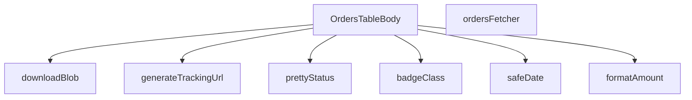

## Genel Bakış
Bu modül, yönetici panelindeki siparişlerin tablo görünümünü oluşturan bir React bileşenidir. Sipariş verilerini Supabase'den çeker, formatsız verileri kullanıcı dostu gösterime dönüştürür ve kargo takip, dosya indirme gibi yardımcı işlevler sunar. Modül, sipariş yönetimi için gerekli tüm gösterim mantığını merkezi olarak yönetir.

## Fonksiyon Grupları

### Görünüm Yardımcıları
Ham verileri insan tarafından okunabilir formata dönüştüren ve görsel durum sınıflandırması yapan yardımcı fonksiyonlar.
- formatAmount, safeDate, prettyStatus, badgeClass

### Veri Kaynağı
Supabase istemcisi aracılığıyla admin siparişlerini filtreleme, sıralama ve sayfalama ile çeken asenkron veri获取 fonksiyonu.
- ordersFetcher

### Kargo Entegrasyonu
Kargo firması ve takip numarasından geçerli bir takip URL'i oluşturarak kullanıcının kargo durumunu izlemesini sağlayan fonksiyon.
- generateTrackingUrl

### Dosya İşlemleri
Oluşturulan blob nesnelerini tarayıcıda indirilebilir dosyaya dönüştüren fonksiyon (fatura, rapor gibi).
- downloadBlob

### Ana Bileşen
Tüm bu yardımcıları bir araya getiren ve sipariş tablosunu render eden ana React fonksiyonel bileşeni.
- OrdersTableBody

---

## AXIOMS – Mimari Varsayımlar

Bu modül, admin sipariş tablosunun gösterimi, durum çevirisi, takip URL üretimi ve veri çekme işlemleri için yardımcı fonksiyonlar ve bir React bileşeni içerir. Aşağıda fonksiyon gövdelerinden türetilen mimari varsayımlar yer almaktadır.

[Aksiyom 1]: Eğer `lang` parametresi geçerli bir `Lang` değeri değilse, `formatAmount` tutarsız para birimi formatı üretir.

[Aksiyom 2]: Eğer `v` parametresi `null` veya `undefined` ise, `format boş bir değer göstergesi (örn. "-")` üretir — fonksiyon imzasındaki `v?: number | null` optionallığı buna izin verir.

[Aksiyom 3]: Eğer `safeDate`'e geçirilen `iso` parametresi geçerli bir ISO tarih dizgesi değilse, fonksiyon geçersiz veya boş bir tarih stringi döner.

[Aksiyom 4]: Eğer `prettyStatus`'a verilen çeviri fonksiyonu `t`, mevcut tüm sipariş durum değerleri için karşılık gelen çeviri anahtarlarına sahip değilse, çevrilmemiş ham anahtarlar ekranda görüntülenir.

[Aksiyom 5]: Eğer `badgeClass`'e bilinmeyen bir durum stringi verilirse, geçerli bir CSS sınıfı üretilemeyebilir ve varsayılan/boş bir sınıf döner.

[Aksiyom 6]: Eğer `generateTrackingUrl`'a desteklenmeyen bir kargo firması (`carrier`) verilirse, fonksiyon `null` döner — yalnızca bilinen kargo firmaları için geçerli URL üretilir.

[Aksiyom 7]: Eğer `generateTrackingUrl`'a boş bir `tracking` değeri verilirse, fonksiyon `null` döner.

[Aksiyom 8]: Eğer `ordersFetcher`'a verilen `supabase` istemcisi admin rolüne sahip yetkilendirilmiş bir oturum içermiyorsa, veri çekme başarısız olur veya boş sonuç döner.

[Aksiyom 9]: Eğer `ordersFetcher`'a verilen `params` içindeki sıralama alanı `SORT_COLUMN_MAP`'te eşleşmeyen bir sütun adı içeriyorsa, sıralama beklenmedik şekilde çalışır veya hata oluşur.

[Aksiyom 10]: Eğer `OrdersTableBody` bileşeni, gerekli React context sağlayıcılarının (Supabase client, çeviri fonksiyonu, tema vb.) bulunduğu bir bileşen ağacı içinde render edilmiyorsa, bileşen zaman aşımı hatası veya bağlantı hatası verir.

[Aksiyom 11]: Eğer `downloadBlob` tarayıcı dışı bir ortamda (Node.js, SSR) çağrılırsa, indirme gerçekleştirilmez — fonksiyon tarayıcı Blob API'si ve `<a download>` mekanizmasına bağımlıdır.

[Aksiyom 12]: Eğer `prettyStatus`'a verilen durum stringi `s`, uygulamada tanımlı durum setinin dışında bir değer ise, çeviri fonksiyonu o durum için bir karşılık bulamayabilir ve ham değer görünür.

[Aksiyom 13]: Eğer `formatAmount`'a para birimi sembolü veya binlik ayracı için geçersiz bir `lang` değeri verilirse, yanlış locale formatında çıktı üretilir.

---

## FONKSİYON DETAYLARI

### formatAmount
**Ne yapar**: Sayısal bir tutarı para birimi formatında gösterilecek metne dönüştürür. Sayısal değer yoksa veya geçersizse tire işareti döner.

**Nasıl yapar**: Gelen `v` parametresinin `number` tipinde olup olmadığını kontrol eder. Sayısal değer mevcutsa harici bir `formatCurrency` fonksiyonunu çağırarak Para birimi formatlamasını gerçekleştirir ve ondalık basamakları sıfırlar (`maximumFractionDigits: 0`). Sayısal değer `null`, `undefined` veya farklı bir tipteyse varsayılan olarak tire (`-`) karakterini döner.

**Parametreler**:
- `v`: `number | null | undefined` — Formatlanacak tutar. Opsiyonel olup, sayısal değer içermelidir.
- `lang`: `Lang` — Para birimi formatında kullanılacak dil kodu (varsayılan: `'tr'`).

**Dönüş**: `string` — Formatlanmış para birimi metni veya değer yoksa `'-'`.

### safeDate
**Ne yapar**: ISO formatındaki bir tarih dizesini yerelleştirilmiş okunabilir tarih-zaman metnine dönüştürür. Biçimlendirme sırasında bir hata oluşursa ham ISO dizesini döner.

**Nasıl yapar**: Gelen ISO tarih dizesini `try-catch` bloğu içinde `formatDateTime` fonksiyonuna iletir. Fonksiyon başarıyla çalışırsa biçimlendirilmiş tarih döner. Herhangi bir istisna yakalanırsa, hata yutulur ve ham `iso` parametresinin kendisi döner. Bu sayede geçersiz tarih formatlarında bile bileşen çökmez.

**Parametreler**:
- `iso`: `string` — Biçimlendirilecek ISO formatında tarih-zaman dizesi.
- `lang`: `Lang` — Tarih formatında kullanılacak dil kodu (varsayılan: `'tr'`).

**Dönüş**: `string` — Biçimlendirilmiş tarih metni veya hata durumunda ham ISO dizesi.

### prettyStatus
**Ne yapar**: Ham sipariş durum dizesini (örn: `'pending'`, `'shipped'`) uluslararasılaştırılmış kullanıcı dostu bir etikete dönüştürür.

**Nasıl yapar**: Gelen durum dizesini küçük harfe çevirir ve `switch` yapısıyla tanımlı durum anahtarlarına eşler. Eşleşme olduğunda `t` fonksiyonunu ilgili çeviri anahtarıyla (`admin.orders.statusLabels.*`) çağırarak yerelleştirilmiş metni döner. Tanınmayan bir durum gelirse ham durum dizesinin kendisini döner. `t` parametresi, bir çeviri fonksiyonudur ve anahtar ile opsiyonel parametreler alarak çevrilmiş metni üretir.

**Parametreler**:
- `s`: `string` — Ham sipariş durum dizesi (örn: `'pending'`, `'paid'`, `'delivered'`).
- `t`: `(key: string, params?: Record<string, unknown>) => string` — Çeviri fonksiyonu. Verilen anahtar ile uluslararasılaştırılmış metni döner.

**Dönüş**: `string` — Durum etiketinin yerelleştirilmiş karşılığı veya tanınamayan durum için ham değer.

### badgeClass
**Ne yapar**: Sipariş durumuna göre stil rozeti (badge) için uygun Tailwind CSS sınıf dizesini döner.

**Nasıl yapar**: Durum dizesini küçük harfe çevirerek `switch` yapısında tanımlı durumlara göre renk paletini belirler. Her durum için arka plan rengi (`bg-*`), metin rengi (`text-*`), kenarlık rengi (`border-*`), iç halka rengi (`ring-*`) ve gölge efekti (`shadow-*`) tanımlı bir CSS sınıf şablonu döner. `refunded` ve `partial_refunded` durumları aynı turuncu tonunu paylaşır. Boş veya tanımsız durum geldiğinde nötr gri tonlarında varsayılan stil döner. Sınıflar之间ında `group-hover:scale-105` geçiş efekti ve `tracking-hvac-snug` özel harf aralığı gibi UI detayları mevcuttur.

**Parametreler**:
- `s`: `string` — Stil rozeti oluşturulacak sipariş durum dizesi.

**Dönüş**: `string` — Duruma karşılık gelen Tailwind CSS sınıf dizesi.

### generateTrackingUrl
**Ne yapar**: Kargo firması adına ve takip numarasına göre ilgili kargo firmasının resmi takip sayfasına yönlendiren URL üretir.

**Nasıl yapar**: Kargo firması adını küçük harfe çevirerek içinde arama yapar. `yurtici`, `aras`, `mng` veya `ptt` dizeleri eşleşirse ilgili kargo firmasının takip URL'sini sorgu parametreleriyle birlikte döner. Tanınmayan bir firma gelirse `null` döner. Bu fonksiyon harici bir API çağrısı yapmaz, sadece statik URL şablonları üretir. Takip numarası URL içinde `code`, `sorgu_no`, `gonderino` veya `id` parametreleri olarak eklenir.

**Parametreler**:
- `carrier`: `string` — Kargo firması adı (örn: `'Yurtiçi Kargo'`, `'Aras Kargo'`).
- `tracking`: `string` — Kargo takip numarası.

**Dönüş**: `string | null` — Kargo takip URL'si veya tanınmayan firma/eksik veri durumunda `null`.

### ordersFetcher
**Ne yapar**: Supabase veritabanından admin siparişlerini filtreleme, sıralama,arama ve sayfalama ile çeker.

**Nasıl yapar**: İlk olarak `ensureSessionFresh` çağrısıyla oturumun taze olduğundan emin olur. Ardından `view_admin_orders` view'ından `ORDER_SELECT` sabitiyle tanımlı alanları seçer ve toplam kayıt sayısını (`count: 'exact'`) hesaplar. Sıralama `params.sort.key` değerini `SORT_COLUMN_MAP` haritasıyla eşleştirerek sunucu tarafında uygulanır, eşleşme yoksa `created_at` alanına göre azalan sıralama yapılır. Arama filtresi varsa `ilike` operatörüyle `search_text` alanında case-insensitive arama yapar. Durum filtresi tek tek `eq` ile veya `pendingShipments` ön ayarıyla `in` operatörüyle uygulanır. Tarih aralığı filtreleri `gte` ve `lte` operatörleriyle `created_at` alanına uygulanır. Son olarak `range` ile istenen sayfa aralığı alınır ve sonuç `FetchResult` formatında döner. Hata oluşursa exception fırlatılır.

**Parametreler**:
- `supabase`: `SupabaseClient<Database>` — Supabase istemcisi. Veritabanı şeması `Database` tipiyle tanımlıdır.
- `params`: `FetchParams` — Sıralama, arama, filtre ve sayfalama parametrelerini içeren nesne. İçerisinde `sort`, `query`, `filters`, `page` ve `pageSize` alanları bulunur.

**Dönüş**: `Promise<FetchResult<AdminOrderRow>>` — `rows` (sipariş satırları dizisi) ve `totalMatched` (toplam eşleşen kayıt sayısı) alanlarını içeren promise.

### OrdersTableBody
**Ne yapar**: Admin siparişlerini tablo içinde listeleyen React bileşenidir.

**Nasıl yapar**: Bu bir React fonksiyonel bileşenidir (`React.FC`). Sipariş verilerini alarak her bir satırı tablo hücreleri formatında render eder. Sipariş durumu, tutar, tarih ve kargo takip gibi bilgileri görsel olarak düzenler. Durum etiketleri için `prettyStatus` ve `badgeClass` yardımcı fonksiyonlarını, para birimi gösterimi için `formatAmount`'ı, tarih gösterimi için `safeDate`'i ve kargo takip linkleri için `generateTrackingUrl`'yi kullanır.

**Parametreler**:
- Bu bileşen doğrudan parametre almaz, props veya bağlam (context) üzerinden verileri edinir.

**Dönüş**: `React.FC` — Render edilmiş tablo gövdesi JSX'i.

### downloadBlob
**Ne yapar**: Tarayıcı tarafında bir `Blob` nesnesini kullanıcıya indirme olarak sunar.

**Nasıl yapar**: Verilen `Blob` nesnesinden geçici bir URL.createObjectURL oluşturur, bu URL'yi bir `<a>` etiketinin `href` öelliğine atar, `download` niteliğini dosya adıyla ayarlar, etiketi programatik olarak tıklatır ve ardından hem URL'yi `revokeObjectURL` ile serbest bırakır hem de `<a>` etriketini DOM'dan kaldırır. Bu sayede harici bir kütüphane kullanmadan dosya indirme işlemi gerçekleştirilir.

**Parametreler**:
- `blob`: `Blob` — İndirilecek veriyi içeren Blob nesnesi (örn: PDF, CSV, resim dosyası).
- `filename`: `string` — Kullanıcıya sunulacak dosya adı (örn: `"siparisler.pdf"`).

**Dönüş**: `void` — Değer döndürmez, tarayıcıda dosya indirme tetikler.

---

## INTERFACES

### AdminOrderRow
- `id: string`
- `status: 'pending' | 'paid' | 'confirmed' | 'shipped' | 'cancelled' | 'refunded' | 'partial_refunded' | string`
- `conversation_id?: string | null`
- `total_amount?: number | null`
- `created_at: string`
- `order_number?: string | null`
- `customer_name?: string | null`
- `customer_email?: string | null`
- `customer_phone?: string | null`

### EmailLog
- `subject: string`
- `email_to: string`
- `provider_message_id: string | null`
- `created_at: string`
- `carrier: string | null`
- `tracking_number: string | null`

### OrderNote
- `id: string`
- `note: string`
- `created_at: string`
- `user_id: string | null`

---

## SABİTLER
- **ORDER_SELECT** (str) — `'id,status,conversation_id,total_amount,created_at,order_number,customer_name...`
- **SORT_COLUMN_MAP** (object) — `{
  created: 'created_at',
  id: 'id',
  status: 'status',
  conversation: 'c...`

---

## AST POINTERS

### [N1_NASIL] AST Pointer: src/views/admin/OrdersTableBody.tsx::formatAmount
- **params**: `(v?: number | null, lang: Lang)`
- **ic_degiskenler**:
  - `v` — Formatlanacak tutar değeri (opsiyonel, null olabilir)
  - `lang` — Para birimi formatı için dil kodu (varsayılan: 'tr')
- **Dönüş**: `string` — Biçimlendirilmiş tutar veya '-'

### [N2_NASIL] AST Pointer: src/views/admin/OrdersTableBody.tsx::safeDate
- **params**: `(iso: string, lang: Lang)`
- **ic_degiskenler**:
  - `iso` — Biçimlendirilecek ISO tarih stringi
  - `lang` — Tarih formatı için dil kodu (varsayılan: 'tr')
- **Dönüş**: `string` — Biçimlendirilmiş tarih veya orijinal ISO stringi

### [N3_NASIL] AST Pointer: src/views/admin/OrdersTableBody.tsx::prettyStatus
- **params**: `(s: string, t: (key: string, params?: Record<string, unknown>) => string)`
- **ic_degiskenler**:
  - `s` — Ham durum stringi (örn: 'pending', 'paid')
  - `t` — Çeviri fonksiyonu
  - `key` — Küçük harfe çevrilmiş durum anahtarı
- **Dönüş**: `string` — Çevrilmiş/güzel durum etiketi

### [N4_NASIL] AST Pointer: src/views/admin/OrdersTableBody.tsx::badgeClass
- **params**: `(s: string)`
- **ic_degiskenler**:
  - `s` — Durum stringi (örn: 'pending', 'shipped')
  - `base` — Tüm durumlar için ortak CSS sınıfı
  - `key` — Küçük harfe çevrilmiş durum anahtarı
- **Dönüş**: `string` — Duruma göre renkli CSS badge sınıfı

### [N5_NASIL] AST Pointer: src/views/admin/OrdersTableBody.tsx::generateTrackingUrl
- **params**: `(carrier: string, tracking: string)`
- **ic_degiskenler**:
  - `carrier` — Kargo firması adı (örn: 'yurtici kargo')
  - `tracking` — Kargo takip numarası
  - `c` — Küçük harfe çevrilmiş kargo firması adı
- **Dönüş**: `string | null` — Kargo takip URL'si veya null (desteklenmeyen firma)

### [N6_NASIL] AST Pointer: src/views/admin/OrdersTableBody.tsx::ordersFetcher
- **params**: `(supabase: SupabaseClient<Database>, params: FetchParams)`
- **ic_degiskenler**:
  - `supabase` — Supabase istemcisi
  - `params` — Filtre, sıralama ve sayfalama parametreleri
  - `ascending` — Sıralama yönü (true: artan, false: azalan)
  - `q` — Arama metni (boşlukları trimlenmiş)
  - `status` — Tek durum filtresi
  - `preset` — Hazır durum filtresi (örn: 'pendingShipments')
  - `from` — Başlangıç tarihi filtresi
  - `to` — Bitiş tarihi filtresi
  - `offset` — Sayfalama başlangıç indeksi
  - `data` — Supabase'den gelen ham veri
  - `error` — Supabase hata nesnesi
  - `count` — Toplam eşleşen kayıt sayısı
- **Dönüş**: `Promise<FetchResult<AdminOrderRow>>` — Sipariş satırları ve toplam sayı

### [N7_NASIL] AST Pointer: src/views/admin/OrdersTableBody.tsx::statusFilterOptions
- **params**: `()`
- **ic_degiskenler**:
  - `t` — Çeviri fonksiyonu (closure'dan erişilen)
- **Dönüş**: Array<{value: string, label: string}> — Durum filtreleme seçenekleri

### [N8_NASIL] AST Pointer: src/views/admin/OrdersTableBody.tsx::openShipModal
- **params**: `(id: string)`
- **ic_degiskenler**:
  - `id` — Sipariş ID'si
  - `data` — Supabase'den gelen kargo bilgisi
  - `dto` — Tip güvenli kargo verisi (carrier ve tracking_number)
- **Dönüş**: `Promise<void>` — Ship modal'ını açar

### [N9_NASIL] AST Pointer: src/views/admin/OrdersTableBody.tsx::openLogsModal
- **params**: `(id: string)`
- **ic_degiskenler**:
  - `id` — Sipariş ID'si
  - `data` — Supabase'den gelen e-posta logları
  - `error` — Supabase hata nesnesi
- **Dönüş**: `Promise<void>` — Log modal'ını açar

### [N10_NASIL] AST Pointer: src/views/admin/OrdersTableBody.tsx::openNotesModal
- **params**: `(id: string)`
- **ic_degiskenler**:
  - `id` — Sipariş ID'si
  - `data` — Supabase'den gelen notlar
  - `error` — Supabase hata nesnesi
- **Dönüş**: `Promise<void>` — Notlar modal'ını açar

### [N11_NASIL] AST Pointer: src/views/admin/OrdersTableBody.tsx::addNote
- **params**: `()`
- **ic_degiskenler**:
  - `text` — Trimlenmiş not metni
  - `inserted` — Yeni eklenen not verisi
- **Dönüş**: `Promise<void>` — Not ekler

### [N12_NASIL] AST Pointer: src/views/admin/OrdersTableBody.tsx::insertNoteFunction
- **params**: `()`
- **ic_degiskenler**:
  - `notesOrderId` — Not eklenecek sipariş ID'si
  - `text` — Trimlenmiş not metni
  - `data` — Yeni eklenen not verisi
  - `error` — Supabase hata nesnesi
- **Dönüş**: `Promise<OrderNote>` — Eklenen not verisi

### [N13_NASIL] AST Pointer: src/views/admin/OrdersTableBody.tsx::deleteNote
- **params**: `(noteId: string)`
- **ic_degiskenler**:
  - `noteId` — Silinecek not ID'si
  - `target` — Silinecek not nesnesi (notes array'inden bulunur)
- **Dönüş**: `Promise<void>` — Not siler

### [N14_NASIL] AST Pointer: src/views/admin/OrdersTableBody.tsx::deleteNoteFunction
- **params**: `()`
- **ic_degiskenler**:
  - `noteId` — Silinecek not ID'si
  - `error` — Supabase hata nesnesi
- **Dönüş**: `Promise<void>` — Not silme işlemini gerçekleştirir

### [N15_NASIL] AST Pointer: src/views/admin/OrdersTableBody.tsx::handleShippingSubmit
- **params**: `()`
- **ic_degiskenler**:
  - `shipId` — Kargo güncellenecek sipariş ID'si
  - `carrier` — Kargo firması
  - `tracking` — Kargo takip numarası
  - `sendEmail` — E-posta gönderilsin mi flag'i
  - `bulkMode` — Toplu kargo modu flag'i
  - `table` — Tablo verisi ve işlemleri
  - `curRow` — Mevcut sipariş satırı
  - `cur` — Mevcut durum
  - `isShipped` — Kargoya verilmiş mi flag'i
  - `turl` — Kargo takip URL'si
  - `selected` — Seçili sipariş ID'leri
  - `targets` — Kargo işlemi yapılacak siparişler
  - `results` — Toplu kargo sonuçları
- **Dönüş**: `Promise<void>` — Kargo bilgilerini günceller

### [N16_NASIL] AST Pointer: src/views/admin/OrdersTableBody.tsx::singleShippingUpdateFunction
- **params**: `()`
- **ic_degiskenler**:
  - `shipId` — Sipariş ID'si
  - `carrier` — Kargo firması
  - `tracking` — Kargo takip numarası
  - `sendEmail` — E-posta gönderilsin mi flag'i
  - `turl` — Kargo takip URL'si
  - `fnErr` — Edge function hatası
- **Dönüş**: `Promise<void>` — Tek sipariş kargo güncelleme

### [N17_NASIL] AST Pointer: src/views/admin/OrdersTableBody.tsx::bulkShippingUpdateFunction
- **params**: `()`
- **ic_degiskenler**:
  - `targets` — Kargo güncellenecek sipariş ID'leri
  - `carrier` — Kargo firması
  - `tracking` — Kargo takip numarası
  - `sendEmail` — E-posta gönderilsin mi flag'i
  - `turl` — Kargo takip URL'si
  - `results` — Promise.all sonuçları
- **Dönüş**: `Promise<void>` — Toplu kargo güncelleme

### [N18_NASIL] AST Pointer: src/views/admin/OrdersTableBody.tsx::bulkShippingMapFunction
- **params**: `(id)`
- **ic_degiskenler**:
  - `id` — Sipariş ID'si
  - `carrier` — Kargo firması
  - `tracking` — Kargo takip numarası
  - `sendEmail` — E-posta gönderilsin mi flag'i
  - `turl` — Kargo takip URL'si
  - `fnErr` — Edge function hatası
- **Dönüş**: `Promise<boolean>` — İşlem başarılı mı

### [N19_NASIL] AST Pointer: src/views/admin/OrdersTableBody.tsx::bulkCancelShipping
- **params**: `()`
- **ic_degiskenler**:
  - `selected` — Seçili sipariş ID'leri
  - `targets` — Kargo iptal edilecek siparişler
  - `results` — Promise.all sonuçları
- **Dönüş**: `Promise<void>` — Toplu kargo iptali

### [N20_NASIL] AST Pointer: src/views/admin/OrdersTableBody.tsx::bulkCancelShippingMapFunction
- **params**: `(id)`
- **ic_degiskenler**:
  - `id` — Sipariş ID'si
  - `fnErr` — Edge function hatası
- **Dönüş**: `Promise<boolean>` — İptal başarılı mı

### [N21_NASIL] AST Pointer: src/views/admin/OrdersTableBody.tsx::bulkCancelShippingInnerMapFunction
- **params**: `(id)`
- **ic_degiskenler**:
  - `id` — Sipariş ID'si
  - `fnErr` — Edge function hatası
- **Dönüş**: `Promise<boolean>` — İptal başarılı mı

### [N22_NASIL] AST Pointer: src/views/admin/OrdersTableBody.tsx::getDateRangeFromFilters
- **params**: `()`
- **ic_degiskenler**:
  - `from` — Başlangıç tarihi filtresi
  - `to` — Bitiş tarihi filtresi
- **Dönüş**: `DateRange | undefined` — Tarih aralığı nesnesi veya undefined

### [N23_NASIL] AST Pointer: src/views/admin/OrdersTableBody.tsx::handleDateRangeChange
- **params**: `(range?: DateRange)`
- **ic_degiskenler**:
  - `range` — Seçilen tarih aralığı
  - `endOfDay` — date-fns endOfDay fonksiyonu
- **Dönüş**: `void` — Tarih filtrelerini günceller

### [N24_NASIL] AST Pointer: src/views/admin/OrdersTableBody.tsx::resetFilters
- **params**: `()`
- **ic_degiskenler**: (yok)
- **Dönüş**: `void` — Tüm filtreleri sıfırlar

### [N25_NASIL] AST Pointer: src/views/admin/OrdersTableBody.tsx::exportHeaders
- **params**: `()`
- **ic_degiskenler**:
  - `t` — Çeviri fonksiyonu (closure'dan erişilen)
- **Dönüş**: `string[]` — CSV/XLS dışa aktarma başlıkları

### [N26_NASIL] AST Pointer: src/views/admin/OrdersTableBody.tsx::downloadBlob
- **params**: `(blob: Blob, filename: string)`
- **ic_degiskenler**:
  - `blob` — Dışa aktarılacak dosya blob'u
  - `filename` — Dosya adı
  - `url` — Blob URL'si (.createObjectURL)
  - `link` — Oluşturulan link elementi
- **Dönüş**: `void` — Blob'u dosya olarak indirir

### [N27_NASIL] AST Pointer: src/views/admin/OrdersTableBody.tsx::exportCsv
- **params**: `()`
- **ic_degiskenler**:
  - `rows` — Dışa aktarılacak tüm satırlar
  - `escape` — CSV kaçış fonksiyonu
  - `lines` — CSV satırları
  - `csv` — Tam CSV içeriği (BOM ile)
- **Dönüş**: `Promise<void>` — CSV dosyası indirir

### [N28_NASIL] AST Pointer: src/views/admin/OrdersTableBody.tsx::exportXls
- **params**: `()`
- **ic_degiskenler**:
  - `rows` — Dışa aktarılacak tüm satırlar
  - `head` — HTML tablo başlık satırı
  - `body` — HTML tablo gövde satırları
  - `html` — Tam HTML tablosu
- **Dönüş**: `Promise<void>` — XLS dosyası indirir

### [N29_NASIL] AST Pointer: src/views/admin/OrdersTableBody.tsx::columnDefinitions
- **params**: `()`
- **ic_degiskenler**:
  - `t` — Çeviri fonksiyonu (closure'dan erişilen)
  - `hasWriteAccess` — Yazma izni flag'i
  - `lang` — Dil kodu
  - `badgeClass` — Badge CSS sınıfı fonksiyonu
  - `prettyStatus` — Güzel durum etiketi fonksiyonu
  - `formatAmount` — Tutar formatlama fonksiyonu
  - `safeDate` — Tarih formatlama fonksiyonu
  - `openShipModal` — Ship modal açma fonksiyonu
  - `openLogsModal` — Logs modal açma fonksiyonu
  - `openNotesModal` — Notes modal açma fonksiyonu
- **Dönüş**: Array<ColumnConfig> — Tablo sütun tanımları

### [N30_NASIL] AST Pointer: src/views/admin/OrdersTableBody.tsx::idCellRenderer
- **params**: `(r)`
- **ic_degiskenler**:
  - `r` — Sipariş satırı verisi (AdminOrderRow)
- **Dönüş**: JSX.Element — Sipariş ID hücresi

### [N31_NASIL] AST Pointer: src/views/admin/OrdersTableBody.tsx::conversationCellRenderer
- **params**: `(r)`
- **ic_degiskenler**:
  - `r` — Sipariş satırı verisi
- **Dönüş**: JSX.Element — Konuşma ID hücresi

### [N32_NASIL] AST Pointer: src/views/admin/OrdersTableBody.tsx::amountCellRenderer
- **params**: `(r)`
- **ic_degiskenler**:
  - `r` — Sipariş satırı verisi
- **Dönüş**: JSX.Element — Tutar hücresi

### [N33_NASIL] AST Pointer: src/views/admin/OrdersTableBody.tsx::createdCellRenderer
- **params**: `(r)`
- **ic_degiskenler**:
  - `r` — Sipariş satırı verisi
- **Dönüş**: JSX.Element — Oluşturma tarihi hücresi

### [N34_NASIL] AST Pointer: src/views/admin/OrdersTableBody.tsx::actionsCellRenderer
- **params**: `(r)`
- **ic_degiskenler**:
  - `r` — Sipariş satırı verisi
  - `hasWriteAccess` — Yazma izni flag'i
- **Dönüş**: JSX.Element — Aksiyon butonları hücresi

### [N35_NASIL] AST Pointer: src/views/admin/OrdersTableBody.tsx::bulkActions
- **params**: `()`
- **ic_degiskenler**:
  - `t` — Çeviri fonksiyonu (closure'dan erişilen)
  - `setBulkMode` — Bulk mod state setter'ı
  - `setCarrier` — Kargo firması state setter'ı
  - `setTracking` — Takip numarası state setter'ı
  - `setSendEmail` — E-posta flag state setter'ı
  - `setShipOpen` — Ship modal state setter'ı
  - `bulkCancelShipping` — Toplu kargo iptal fonksiyonu
- **Dönüş**: Array<BulkAction> — Toplu işlem tanımları

### [N36_NASIL] AST Pointer: src/views/admin/OrdersTableBody.tsx::handleBulkShip
- **params**: `()`
- **ic_degiskenler**:
  - `setBulkMode` — Bulk mod state setter'ı
  - `setCarrier` — Kargo firması state setter'ı
  - `setTracking` — Takip numarası state setter'ı
  - `setSendEmail` — E-posta flag state setter'ı
  - `setShipOpen` — Ship modal state setter'ı
- **Dönüş**: `Promise<void>` — Toplu kargo modal'ını açar

### [N37_NASIL] AST Pointer: src/views/admin/OrdersTableBody.tsx::handlePendingShipmentsToggle
- **params**: `(v)`
- **ic_degiskenler**:
  - `v` — Toggle değeri (boolean)
- **Dönüş**: `void` — Pending shipments filtresini ayarlar

### [N38_NASIL] AST Pointer: src/views/admin/OrdersTableBody.tsx::emailLogRowRenderer
- **params**: `(l, i)`
- **ic_degiskenler**:
  - `l` — E-posta log satırı verisi
  - `i` — Satır indeksi
  - `lang` — Dil kodu
- **Dönüş**: JSX.Element — E-posta log satırı

### [N39_NASIL] AST Pointer: src/views/admin/OrdersTableBody.tsx::noteItemRenderer
- **params**: `(n)`
- **ic_degiskenler**:
  - `n` — Not nesnesi
  - `hasWriteAccess` — Yazma izni flag'i
  - `lang` — Dil kodu
- **Dönüş**: JSX.Element — Not öğesi

---

## MERMAID CALL GRAPH

## NODE ID STANDARD

  file: src\views\admin\OrdersTableBody.tsx
  function: src\views\admin\OrdersTableBody.tsx::formatAmount
  function: src\views\admin\OrdersTableBody.tsx::safeDate
  function: src\views\admin\OrdersTableBody.tsx::prettyStatus
  function: src\views\admin\OrdersTableBody.tsx::badgeClass
  function: src\views\admin\OrdersTableBody.tsx::generateTrackingUrl
  function: src\views\admin\OrdersTableBody.tsx::ordersFetcher
  function: src\views\admin\OrdersTableBody.tsx::OrdersTableBody
  function: src\views\admin\OrdersTableBody.tsx::downloadBlob

---

## DISA AKTARILANLAR (EXPORTS)
  export: OrdersTableBody
  export: badgeClass
  export: formatAmount
  export: generateTrackingUrl
  export: ordersFetcher
  export: prettyStatus
  export: safeDate

---

## STİL TOKENLERİ

### Arbitrary Değerler (token'a geçirilmemiş)
Yok — tüm stiller token'a geçirilmiş. ✅

### Kullanılan Token'lar (zaten token'a geçirilmiş)
- `rounded-hvac-2xl`, `rounded-hvac-xl`, `shadow-glow-md`, `tracking-hvac-normal`, `tracking-hvac-relaxed`

### Tailwind Sınıf Özeti
- **Renkler:** `bg-clip-text`, `bg-cyan-500`, `bg-emerald-500`, `bg-gradient-to-r`, `bg-surface-darker/40`, `bg-surface-deep`, `bg-white/2`, `bg-white/5`, `border-2`, `border-b`, `border-cyan-500/20`, `border-rose-500/20`, `border-t`, `border-t-cyan-500`, `border-white/10`
- **Layout:** `backdrop-blur-xl`, `bg-clip-text`, `custom-scrollbar`, `fixed`, `flex`, `flex-1`, `flex-col`, `flex-wrap`, `from-white`, `gap-1`, `gap-2`, `gap-3`, `gap-4`, `gap-8`, `grid`
- **Varyant/Responsive:** `active:`, `focus-visible:`, `group-hover:`, `hover:`, `placeholder:` önekleri
- **Yardımcı Sınıflar:** `active:scale-95`, `animate-in`, `animate-spin`, `border`, `divide-white/2`, `divide-white/5`, `divide-y`, `duration-500`, `fade-in`, `focus-visible:outline-none`, `focus-visible:ring-2`, `focus-visible:ring-cyan-500/20`, `focus-visible:ring-cyan-500/50`, `font-black`, `font-bold`