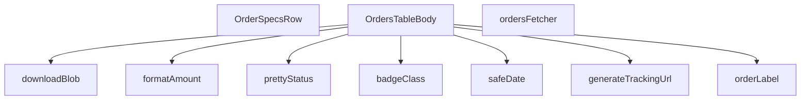

## Genel Bakış
Bu modül, yönetici panelindeki siparişlerin tablo görünümünü oluşturan ve yöneten React bileşenidir. Supabase'den sipariş verilerini çekmek, bu verileri (para birimi, tarih, durum) okunabilir ve yerelleştirilmiş biçime dönüştürmek, kargo takip bilgileri üretmek ve dosya indirme işlevselliği sunmak gibi sorumlulukları merkezi bir noktada toplar. Modül, veri çekme ile arayüz oluşturma işlerini ayrı fonksiyonlara ayırarak temiz bir sorumluluk dağılımı sunar.

## Fonksiyon Grupları

### Veri Biçimlendirme ve Sunum Yardımcıları
Para birimi, tarih ve sipariş durumu gibi ham verileri kullanıcı arayüzünde gösterilmek üzere yerelleştirilmiş, okunabilir ve stilize edilmiş (örneğin rozet sınıfı) formatlara dönüştüren yardımcı fonksiyonlardır.
- formatAmount, safeDate, prettyStatus, badgeClass, orderLabel

### Veri Kaynağı ve Çekme
Supabase istemcisiyle iletişim kuran, sayfalama ve filtreleme parametrelerini işleyerek yönetici siparişlerini asenkron olarak çeken fonksiyondur.
- ordersFetcher

### Entegrasyon ve Araç Fonksiyonları
Dış hizmetlerle (kargo firması) entegrasyon için URL üretimi ve tarayıcı tarafında dosya indirme gibi yardımcı işlevler sunan fonksiyonlardır.
- generateTrackingUrl, downloadBlob

### Ana Bileşenler
Tüm yardımcı fonksiyonları ve veri kaynağını bir araya getirerek sipariş tablosunu ve satır detaylarını oluşturan React bileşenleridir. OrdersTableBody ana tablo yapısını, OrderSpecsRow ise tek bir siparişin detay satırını render eder.
- OrderSpecsRow, OrdersTableBody

---

## AXIOMS – Mimari Varsayımlar
- Bu modül davranışsal mantık içermez (salt veri / konfigürasyon / tip tanımı).
- [Aksiyom 1]: Modülün dışa açtığı yapı (anahtar kümesi / şema) bir sözleşmedir; tüketiciler bu sabit yapıya bağlıdır — kırıcı değişiklik tüm tüketicileri etkiler.
- [Aksiyom 2]: Bir öğe ekleme/çıkarma yapısal-uyumlu olmalı; ilgili tipler ve seçiciler aynı commit'te güncel tutulmalıdır.

---

## FONKSİYON DETAYLARI

### formatAmount
**Ne yapar**: Sayısal bir sipariş tutarını, belirtilen dile göre para birimi formatında okunabilir bir string'e dönüştürür. Değer tanımsız, null veya sayı tipinde değilse tire (`-`) karakteri döndürür.

**Nasıl yapar**: Gelen değer `number` tipinde ise `formatCurrency` yardımcı fonksiyonunu çağırarak biçimlendirme yapar. Bu çağrıda para birimi olarak `SYSTEM_CURRENCY` sabiti kullanılır ve ondalık basamak sayısı sıfırla sınırlandırılır (`maximumFractionDigits: 0`). Sayısal olmayan durumlarda doğrudan `'-'` dizesi döndürülür.

**Parametreler**:
- `v`: `number | null` (opsiyonel) — Biçimlendirilecek sayısal tutar değeri. Tanımsız veya null olabilir.
- `lang`: `Lang` — Biçimlendirmenin yapılacağı dil kodu. Varsayılan değeri `'tr'` olarak atanmıştır.

**Dönüş**: `string` — Biçimlendirilmiş para birimi dizesi (örneğin `"₺1.500"`) veya değer mevcut değilse `"-"`.

### safeDate
**Ne yapar**: ISO formatındaki bir tarih dizesini, belirli bir dil için formatlanmış bir tarih-saat dizesine dönüştürür. Geçersiz bir tarih girilmesi durumunda hata fırlatmak yerine ham ISO dizesini güvenli bir şekilde döndürür.
**Nasıl yapar**: Fonksiyon, bir `try-catch` bloğu içinde çalışır. `try` bloğunda, dışarıdan import edilen `formatDateTime` yardımcısını çağırarak ISO dizesini formatlamaya çalışır. Herhangi bir hata (örn. geçersiz tarih formatı) oluşursa, `catch` bloğu yakalar ve hataya yol açan ham `iso` dizesini olduğu gibi döndürerek uygulamanın çökmesini önler.
**Parametreler**:
- `iso`: `string` — Biçimlendirilecek tarih ve saat bilgisini içeren ISO 8601 formatında dize.
- `lang`: `Lang` — Tarih formatında kullanılacak dil/kültür ayarı. Varsayılan olarak 'tr' alınır.
**Dönüş**: `string` — Biçimlendirilmiş tarih-saat dizesi veya geçersiz girdi durumunda orijinal ISO dizesi.

### prettyStatus
**Ne yapar**: Ham durum string'lerini (örn. 'pending', 'shipped') insan tarafından okunabilir, yerelleştirilmiş etiketlere dönüştürür. Bu işlem, bir çeviri fonksiyonu (`t`) kullanılarak dinamik dil desteğiyle yapılır.
**Nasıl yapar**: Fonksiyon, gelen `s` durum string'inin boş olup olmadığını kontrol eder. Boşsa, olduğu gibi döndürür. Değilse, string'i küçük harfe dönüştürerek bir `switch-case` yapısına sokar. Her bilinen durum anahtarı için, önceden tanımlanmış bir çeviri yolunu (örn. 'admin.orders.statusLabels.pending') `t` çeviri fonksiyonuna parametre olarak verir ve çevirilmiş etiketi döndürür. Tanınmayan bir durum gelirse, orijinal `s` string'i döndürülür.
**Parametreler**:
- `s`: `string` — Çevrilecek ham durum kodu (örn. 'pending', 'delivered').
- `t`: `(key: string, params?: Record<string, unknown>) => string` — Çeviri anahtarını ve opsiyonel parametreleri alıp, güncel dil ayarına göre çevrilmiş bir dize döndüren çeviri fonksiyonu.
**Dönüş**: `string` — Çevrilmiş durum etiketi veya tanınamayan durum için orijinal ham dize.

### badgeClass

**Ne yapar**: Verilen sipariş durum string'ine göre badge (rozet) stilini döndürür. Her durum için farklı renk ve border kombinasyonu üreterek UI'da siparişlerin görsel olarak ayırt edilmesini sağlar.

**Nasıl yapar**: Fonksiyon gelen string'i boşluk veya `null/undefined` kontrolünden geçirir; boşsa varsayılan "nötr" sınıf dizesini döndürür. Doluysa string'i küçük harfe çevirip `switch` bloğuna sokar. Her `case` dalında CSS utility class'larından oluşan bir template literal döndürür. `base` değişkeni tüm durumlar tarafından paylaşılan ortak stilleri (inline-flex, gap, rounded-full, transition-colors vb.) tutar; `group-hover:scale-105` sınıfı tablo satırında hover efekti yaratır. `pending`, `paid`, `confirmed`, `shipped`, `delivered`, `cancelled`, `refunded` ve `partial_refunded` durumları ayrı renk paletleriyle (`bg-admin-success-weak`, `bg-admin-danger-weak` vb.) stillendirilir. `refunded` ve `partial_refunded` aynı stili paylaşır. Tanınmayan durumlar için `default` dalı nötr bir stil döndürür.

**Parametreler**:
- `s: string` — Sipariş durumunu temsil eden metin. Boş string, `undefined` veya `null` gelebilir; bu durumda varsayılan nötr stil döndürülür. Tanıma değerleri: `pending`, `paid`, `confirmed`, `shipped`, `delivered`, `cancelled`, `refunded`, `partial_refunded`.

**Dönüş**: `string` — Tamamen CSS utility class'larından oluşan ve doğrudan `className` ögesine verilebilecek bir stil dizesi.

### orderLabel
**Ne yapar**: Geliştirildi ancak detay üretilemedi.

### generateTrackingUrl
**Ne yapar**: Verilen kargo firması ve takip numarası bilgilerine göre, o firmaya özel kargo takip sayfasının URL'sini oluşturur. Desteklenmeyen bir firma girilmesi durumunda null döndürerek takip linkinin oluşturulamayacağını belirtir.
**Nasıl yapar**: Fonksiyon, öncelikle `carrier` ve `tracking` parametrelerinin her ikisinin de dolu olup olmadığını kontrol eder. Herhangi biri boşsa `null` döndürür. Kargo firması adını küçük harfe dönüştürerek (`carrier.toLowerCase()`) bir dizi `if` kontrolü yapar. Adın içinde belirli anahtar kelimeler ('yurtici', 'aras', 'mng', 'ptt') arar. Eşleşme bulunursa, ilgili kargo firmasının bilinen takip URL yapısını ve verilen `tracking` numarasını birleştirerek bir dize oluşturur. Hiçbir eşleşme olmazsa `null` döndürür.
**Parametreler**:
- `carrier`: `string` — Kargo firmanın adı (örn. 'Yurtiçi Kargo', 'Aras Kargo').
- `tracking`: `string` — Kargonun takip numarası.
**Dönüş**: `string | null` — Oluşturulmuş takip URL'si veya desteklenmeyen firma/eksik bilgi durumunda `null`.

### ordersFetcher
**Ne yapar**: Supabase veritabanından admin paneli için sipariş listesini çeker. Çekme işlemini, sayfalama, sıralama, metin araması ve çeşitli filtreleme (durum, tarih aralığı) kriterlerine göre sunucu tarafında (server-side) yapılandırarak verimli ve doğru sonuçlar döndürür.
**Nasıl yapar**: Fonksiyon, önce `ensureSessionFresh` ile oturumun taze olduğundan emin olur. Ardından `view_admin_orders` görünümünden `ORDER_SELECT` sabitinde tanımlı sütunları seçerek bir sorgu başlatır. `params` nesnesindeki bilgilere göre sorguyu zincirleme olarak modifiye eder:
1. **Sıralama**: `params.sort.key` ve `params.sort.dir` değerlerine göre, `SORT_COLUMN_MAP` kullanarak sunucu tarafında sıralama uygular.
2. **Arama**: `params.query` içindeki metni, `search_text` sütununda `ilike` ile arar.
3. **Durum Filtresi**: `params.filters.status` dizisine göre tekli (`eq`) veya çoklu (`in`) durum filtresi uygular. Özel bir `preset` ('pendingShipments') varsa, belirli durumlarda `shipped_at` alanı boş olan kayıtları filtreler.
4. **Tarih Filtresi**: `params.filters.from` ve `params.filters.to` ile `created_at` sütunu üzerinde aralık filtresi (`gte`, `lte`) uygular.
Son olarak, `params.page` ve `params.pageSize` kullanarak sorguya `range` uygular ve sayfalı veriyi çeker. Sonuçta oluşabilecek bir hatayı `throw` ile yeniden fırlatır. Başarılı olursa, `AdminOrderRow` tipindeki satırları ve toplam eşleşme sayısını içeren bir nesne döndürür.
**Parametreler**:
- `supabase`: `SupabaseClient<Database>` — Veritabanı işlemleri için kullanılacak, `Database` tipinde şemaya sahip Supabase istemcisi.
- `params`: `FetchParams` — Sorgu parametrelerini içeren nesne. İçinde `page`, `pageSize`, `sort` (sıralama), `query` (arama metni) ve `filters` (durum, tarih, preset) alanları bulunur.
**Dönüş**: `Promise<FetchResult<AdminOrderRow>>` — Asenkron bir Promise. Çözüldüğünde `{ rows: AdminOrderRow[], totalMatched: number }` yapısında bir nesne döndürür. `rows`, sayfalı sipariş verisini; `totalMatched`, filtreleme ve arama kriterlerine uyan toplam kayıt sayısını temsil eder.

### OrderSpecsRow
**Ne yapar**: Bu bir React fonksiyonel bileşenidir. Verilen bir sipariş ID'sine ait sipariş detaylarını (örn. ürün listesi, miktarlar, birim fiyatlar) gösteren bir satır (row) veya bölüm oluşturur.
**Nasıl yapar**: Fonksiyon, bir React bileşeni döndürür. Bileşen, props olarak `orderId` alır ve bu ID'ye karşılık gelen sipariş detaylarını göstermek için kullanılacak JSX yapısını (`React.FC<OrderSpecsRowProps>` olarak tanımlı) render eder. Bileşenin iç mantığı, verilen kaynak kodunda belirtilmemiştir, bu nedenle sadece bileşenin temel amacını ve kabul ettiği props'u biliyoruz.
**Parametreler**:
- `orderId`: `OrderSpecsRowProps` içinde tanımlı, siparişin benzersiz tanımlayıcısı. Bileşenin hangi siparişin detaylarını göstereceğini belirler.
**Dönüş**: `React.FC<OrderSpecsRowProps>` — Sipariş detaylarını görüntüleyen bir React bileşeni.

### OrdersTableBody
**Ne yapar**: Admin siparişlerini tablo içinde listeleyen React bileşenidir.

**Nasıl yapar**: Bu bir React fonksiyonel bileşenidir (`React.FC`). Sipariş verilerini alarak her bir satırı tablo hücreleri formatında render eder. Sipariş durumu, tutar, tarih ve kargo takip gibi bilgileri görsel olarak düzenler. Durum etiketleri için `prettyStatus` ve `badgeClass` yardımcı fonksiyonlarını, para birimi gösterimi için `formatAmount`'ı, tarih gösterimi için `safeDate`'i ve kargo takip linkleri için `generateTrackingUrl`'yi kullanır.

**Parametreler**:
- Bu bileşen doğrudan parametre almaz, props veya bağlam (context) üzerinden verileri edinir.

**Dönüş**: `React.FC` — Render edilmiş tablo gövdesi JSX'i.

### downloadBlob
**Ne yapar**: Tarayıcı tarafında bir `Blob` nesnesini kullanıcıya indirme olarak sunar.

**Nasıl yapar**: Verilen `Blob` nesnesinden geçici bir URL.createObjectURL oluşturur, bu URL'yi bir `<a>` etiketinin `href` öelliğine atar, `download` niteliğini dosya adıyla ayarlar, etiketi programatik olarak tıklatır ve ardından hem URL'yi `revokeObjectURL` ile serbest bırakır hem de `<a>` etriketini DOM'dan kaldırır. Bu sayede harici bir kütüphane kullanmadan dosya indirme işlemi gerçekleştirilir.

**Parametreler**:
- `blob`: `Blob` — İndirilecek veriyi içeren Blob nesnesi (örn: PDF, CSV, resim dosyası).
- `filename`: `string` — Kullanıcıya sunulacak dosya adı (örn: `"siparisler.pdf"`).

**Dönüş**: `void` — Değer döndürmez, tarayıcıda dosya indirme tetikler.

---

## İTHALATLAR (IMPORTS)
- import: ../../components/admin/AdminEmptyState::AdminEmptyState
- import: ../../components/admin/AdminToolbar::AdminToolbar
- import: ../../components/admin/DateRangePicker::DateRangePicker
- import: ../../components/admin/ExportMenu::ExportMenu
- import: ../../components/admin/data-table/BulkBar::BulkBar
- import: ../../components/admin/data-table/BulkBar::type BulkAction
- import: ../../components/admin/data-table/DataTableKit::DataTableKit
- import: ../../components/admin/data-table/types::type { AdminColumn }
- import: ../../components/admin/orders/OrderFormModal::OrderFormModal
- import: ../../components/admin/overlay/AdminModal::AdminModal
- import: ../../components/admin/overlay/AdminSidePanel::AdminSidePanel
- import: ../../components/admin/overlay/ConfirmProvider::useConfirm
- import: ../../hooks/useAdminTable::type FetchParams
- import: ../../hooks/useAdminTable::type FetchResult
- import: ../../hooks/useAdminTable::useAdminTable
- import: ../../hooks/useRole::useRole
- import: ../../i18n/I18nContext::type { Lang }
- import: ../../i18n/I18nProvider::useI18n
- import: ../../i18n/currency::SYSTEM_CURRENCY
- import: ../../i18n/datetime::formatDateTime
- import: ../../i18n/format::formatCurrency
- import: ../../lib/ensureSessionFresh::ensureSessionFresh
- import: ../../types/database.types::type { Database }
- import: @/lib/admin/mutateWithAudit::AdminPermissionError
- import: @/lib/admin/mutateWithAudit::mutateWithAudit
- import: @/lib/admin/orderStatusLabels::orderStatusLabel
- import: @/lib/supabase/client::supabaseBrowserClient
- import: @/utils/adminShipping::SharedTrackingDeclinedError
- import: @/utils/adminShipping::invokeShippingUpdate
- import: @supabase/supabase-js::type { SupabaseClient }
- import: date-fns::endOfDay
- import: lucide-react::Info
- import: lucide-react::ShoppingCart
- import: react-day-picker::type { DateRange }
- import: react::React
- import: react::useCallback
- import: react::useEffect
- import: react::useMemo
- import: react::useState
- import: sonner::toast

---

## INTERFACES

### AdminOrderRow
- `id: string`
- `status: OrderDbStatus | string`
- `payment_status?: string | null`
- `conversation_id?: string | null`
- `total_amount?: number | null`
- `created_at: string`
- `order_number?: string | null`
- `customer_name?: string | null`
- `customer_email?: string | null`
- `customer_phone?: string | null`

### EmailLog
- `subject: string`
- `email_to: string`
- `provider_message_id: string | null`
- `created_at: string`
- `carrier: string | null`
- `tracking_number: string | null`

### OrderNote
- `id: string`
- `note: string`
- `created_at: string`
- `user_id: string | null`

### DetailOrderItem
- `id: string`
- `product_id?: string | null`
- `product_name: string`
- `quantity: number`
- `price_at_time: number`
- `product_image_url?: string | null`

### DetailOrder
- `id: string`
- `total_amount: number | null`
- `status: string`
- `payment_status?: string | null`
- `created_at: string`
- `customer_name?: string | null`
- `customer_email?: string | null`
- `shipping_address?: unknown`
- `order_number?: string | null`
- `conversation_id?: string | null`
- `carrier?: string | null`
- `tracking_number?: string | null`
- `tracking_url?: string | null`
- `shipped_at?: string | null`
- `delivered_at?: string | null`
- `shipping_method?: string | null`
- `invoice_type?: string | null`
- `invoice_info?: unknown`
- `legal_consents?: unknown`
- `venthub_order_items: DetailOrderItem[]`

### ShippingAddress
- `fullAddress?: string`
- `street?: string`
- `city?: string`
- `district?: string`
- `state?: string`
- `postalCode?: string`
- `postal_code?: string`

### InvoiceInfo
- `companyName?: string`
- `company_name?: string`
- `taxOffice?: string`
- `tax_office?: string`
- `taxNumber?: string`
- `tax_no?: string`
- `tcNo?: string`
- `tc_no?: string`
- `national_id?: string`

### OrderSpecsRowProps
- `orderId: string`

---

## SABİTLER
- **ORDER_SELECT** (str) — `'id,status,payment_status,conversation_id,total_amount,created_at,order_numbe...`
- **SORT_COLUMN_MAP** (object) — `{
  created: 'created_at',
  id: 'id',
  status: 'status',
  conversation...`
- **ORDER_DB_STATUSES** (unknown)

---

## AST POINTERS

### [N1_NASIL] AST Pointer: src/views/admin/OrdersTableBody.tsx::formatAmount
- **params**: `v` (number | null | undefined), `lang` (Lang, varsayılan `'tr'`)
- **ic_degiskenler**: yok
- **Dönüş**: string — para birimi formatlanmış değer veya `'-'`

### [N2_NASIL] AST Pointer: src/views/admin/OrdersTableBody.tsx::safeDate
- **params**: `iso` (string), `lang` (Lang, varsayılan `'tr'`)
- **ic_degiskenler**: yok
- **Dönüş**: string — formatlanmış tarih veya hata durumunda ham `iso` değeri

### [N3_NASIL] AST Pointer: src/views/admin/OrdersTableBody.tsx::prettyStatus
- **params**: `s` (string), `t` (fonksiyon: (key: string, params?: Record<string, unknown>) => string)
- **ic_degiskenler**: yok
- **Dönüş**: string — `orderStatusLabel(s, t)` çağrısının dönüşü

### [N4_NASIL] AST Pointer: src/views/admin/OrdersTableBody.tsx::badgeClass
- **params**: `s` (string)
- **ic_degiskenler**:
  - `base` — tüm durumlar için ortak CSS sınıfı dizesi (inline-flex, rounded-full, border, transition-colors)
  - `key` — `s.toLowerCase()` ile küçük harfe dönüştürülmüş durum anahtarı
- **Dönüş**: string — duruma göre CSS sınıfı dizesi

### [N5_NASIL] AST Pointer: src/views/admin/OrdersTableBody.tsx::orderLabel
- **params**: `row` (AdminOrderRow)
- **ic_degiskenler**: yok
- **Dönüş**: string — `row.order_number` varsa onu, yoksa `row.id.slice(0, 8)` değerini döndürür

### [N6_NASIL] AST Pointer: src/views/admin/OrdersTableBody.tsx::generateTrackingUrl
- **params**: `carrier` (string), `tracking` (string)
- **ic_degiskenler**:
  - `c` — `carrier.toLowerCase()` ile küçük harfe dönüştürülmüş kargo adı
- **Dönüş**: string | null — kargo firmasına göre takip URL'i veya null

### [N7_NASIL] AST Pointer: src/views/admin/OrdersTableBody.tsx::ordersFetcher
- **params**: `supabase` (SupabaseClient<Database>), `params` (FetchParams)
- **ic_degiskenler**:
  - `query` — Supabase sorgu nesnesi, `view_admin_orders` tablosundan `ORDER_SELECT` ile seçilir
  - `ascending` — `params.sort?.dir === 'asc'` sonucu boolean
  - `q` — `params.query.trim()` ile boşluklardan arındırılmış arama metni
  - `statuses` — `params.filters.status ?? []` ile durum filtresi dizisi
  - `preset` — `params.filters.preset?.[0]` ile ön ayar filtresi
  - `from` — `params.filters.from?.[0]` ile tarih aralığı başlangıcı (ISO)
  - `to` — `params.filters.to?.[0]` ile tarih aralığı bitişi (ISO)
  - `customerId` — `params.filters.customer?.[0]` ile müşteri filtresi
  - `offset` — `(params.page - 1) * params.pageSize` ile sayfalama ofseti
  - `data` — sorgu sonucu satırlar
  - `error` — sorgu hatası
  - `count` — eşleşen toplam kayıt sayısı
- **Dönüş**: Promise<FetchResult<AdminOrderRow>> — `{ rows, totalMatched }` nesnesi

### [N8_NASIL] AST Pointer: src/views/admin/OrdersTableBody.tsx::OrderSpecsRow
- **params**: `{ orderId }` (OrderSpecsRowProps)
- **ic_degiskenler**:
  - `t` — `useI18n()` ile uluslararasılaştırma fonksiyonu
  - `lang` — `useI18n()` ile dil kodu
  - `loading` — `useState(true)` ile yükleme durumu
  - `setLoading` — yükleme durumunu güncelleyen setter
  - `order` — `useState<DetailOrder | null>(null)` ile sipariş detayı
  - `setOrder` — sipariş detayını güncelleyen setter
  - `active` — useEffect içinde bileşen aktiflik durumunu takip eden boolean
  - `data` — Supabase sorgu sonucu sipariş verisi
  - `error` — Supabase sorgu hatası
  - `rawItems` — `data.venthub_order_items` dizisi (tip dönüşümü uygulanmış)
  - `mappedItems` — `rawItems.map(...)` ile DetailOrderItem dizisine dönüştürülmüş ürünler
  - `items` — `order.venthub_order_items || []` ile sipariş kalemleri
  - `addr` — `order.shipping_address as ShippingAddress | null` ile teslimat adresi
  - `invoice` — `order.invoice_info as InvoiceInfo | null` ile fatura bilgisi
- **Dönüş**: JSX.Element — sipariş detay görünümü (ürünler tablosu, müşteri bilgileri, fatura bilgileri)

### [N9_NASIL] AST Pointer: src/views/admin/OrdersTableBody.tsx::OrdersTableBody
- **params**: yok
- **ic_degiskenler**:
  - `t` — uluslararasılaştırma fonksiyonu
  - `lang` — dil kodu
  - `hasWriteAccess` — yazma yetkisi boolean'ı
  - `table` — tablo durumu ve yöntemleri (rows, reload, selection, fetchAllForExport)
  - `query` / `setQuery` — arama metni state'i
  - `filters` / `setFilter` — filtre state'i (status, preset, from, to, customer)
  - `activeStatuses` — aktif durum filtreleri dizisi
  - `editOrderId` / `setEditOrderId` — düzenlenen sipariş ID'si
  - `editOpen` / `setEditOpen` — düzenleme modalı açık/kapalı durumu
  - `shipId` / `setShipId` — kargo modalındaki sipariş ID'si
  - `shipOpen` / `setShipOpen` — kargo modalı açık/kapalı durumu
  - `bulkMode` / `setBulkMode` — toplu kargo modu
  - `carrier` / `setCarrier` — kargo firması
  - `tracking` / `setTracking` — takip numarası
  - `carrierError` / `setCarrierError` — kargo firması hata durumu
  - `sendEmail` / `setSendEmail` — e-posta gönderme tercihi
  - `bulkTracking` / `setBulkTracking` — toplu kargo takip numaraları (sipariş ID → takip no)
  - `missingTrackingIds` / `setMissingTrackingIds` — eksik takip numaralı sipariş ID'leri
  - `logsOpen` / `setLogsOpen` — e-posta logları modalı durumu
  - `logsLoading` / `setLogsLoading` — log yükleme durumu
  - `emailLogs` / `setEmailLogs` — e-posta logları dizisi
  - `notesOrderId` / `setNotesOrderId` — notlar modalındaki sipariş ID'si
  - `notesOpen` / `setNotesOpen` — notlar modalı durumu
  - `notes` / `setNotes` — sipariş notları dizisi
  - `noteInput` / `setNoteInput` — yeni not giriş metni
  - `confirm` — onay dialogu fonksiyonu
  - `openEditModal` — düzenleme modalını açan fonksiyon (id parametreli)
  - `openShipModal` — kargo modalını açan async fonksiyon (id parametreli)
  - `openLogsModal` — e-posta logları modalını açan async fonksiyon (id parametreli)
  - `openNotesModal` — notlar modalını açan async fonksiyon (id parametreli)
  - `setTrackingFor` — toplu kargo için belirli siparişin takip numarasını ayarlayan fonksiyon
  - `addNote` — yeni not ekleyen async fonksiyon
  - `deleteNote` — not silen async fonksiyon (noteId parametreli)
  - `handleShip` — kargo bilgilerini kaydeden async fonksiyon (tekli ve toplu mod)
  - `bulkCancelShipping` — toplu kargo iptali async fonksiyonu
  - `dateRange` — filtrelerden türetilen DateRange nesnesi
  - `handleDateRangeChange` — tarih aralığı değişiklik handler'ı
  - `resetFilters` — tüm filtreleri sıfırlayan fonksiyon
  - `exportHeaders` — dışa aktarma başlık dizisi
  - `downloadBlob` — dosya indirme yardımcı fonksiyonu
  - `exportCsv` — CSV dışa aktarma async fonksiyonu
  - `exportXls` — XLS dışa aktarma async fonksiyonu
  - `columns` — tablo sütun tanımları dizisi
  - `bulkActions` — toplu işlem tanımları dizisi
  - `statusItems` — durum filtresi öğeleri dizisi
- **Dönüş**: JSX.Element — siparişler tablosu, filtreler, modallar ve aksiyon butonları

### [N10_NASIL] AST Pointer: src/views/admin/OrdersTableBody.tsx::downloadBlob
- **params**: `blob` (Blob), `filename` (string)
- **ic_degiskenler**:
  - `url` — `URL.createObjectURL(blob)` ile oluşturulan geçici URL
  - `link` — `document.createElement('a')` ile oluşturulan indirme bağlantısı elementi
- **Dönüş**: void — dosya indirme tetiklenir, geçici URL temizlenir

---

## MERMAID CALL GRAPH

## NODE ID STANDARD

  file: src\views\admin\OrdersTableBody.tsx
  function: src\views\admin\OrdersTableBody.tsx::formatAmount
  function: src\views\admin\OrdersTableBody.tsx::safeDate
  function: src\views\admin\OrdersTableBody.tsx::prettyStatus
  function: src\views\admin\OrdersTableBody.tsx::badgeClass
  function: src\views\admin\OrdersTableBody.tsx::orderLabel
  function: src\views\admin\OrdersTableBody.tsx::generateTrackingUrl
  function: src\views\admin\OrdersTableBody.tsx::ordersFetcher
  function: src\views\admin\OrdersTableBody.tsx::OrderSpecsRow
  function: src\views\admin\OrdersTableBody.tsx::OrdersTableBody
  function: src\views\admin\OrdersTableBody.tsx::downloadBlob

---

## DISA AKTARILANLAR (EXPORTS)
  export: OrderSpecsRow
  export: OrdersTableBody
  export: badgeClass
  export: formatAmount
  export: generateTrackingUrl
  export: orderLabel
  export: ordersFetcher
  export: prettyStatus
  export: safeDate

---

## STİL TOKENLERİ

### Arbitrary Değerler (token'a geçirilmemiş)
Yok — tüm stiller token'a geçirilmiş. ✅

### Kullanılan Token'lar (zaten token'a geçirilmiş)
- (yok)

### Tailwind Sınıf Özeti
- **Renkler:** `accent-admin-accent`, `bg-admin-accent`, `bg-admin-accent-weak`, `bg-admin-surface`, `bg-admin-surface-2`, `border-2`, `border-admin-accent/30`, `border-admin-border`, `border-t-cyan-500`, `hover:bg-admin-accent`, `hover:bg-admin-surface-2`, `hover:bg-admin-surface-3`, `hover:bg-admin-warning`, `hover:text-admin-accent-fg`, `hover:text-admin-fg`
- **Layout:** `block`, `flex`, `flex-1`, `flex-col`, `flex-wrap`, `gap-1`, `gap-1.5`, `gap-2`, `gap-3`, `gap-4`, `gap-8`, `grid`, `grid-cols-1`, `h-0.5`, `h-4`
- **Varyant/Responsive:** `focus-visible:`, `hover:`, `lg:`, `sm:` önekleri
- **Yardımcı Sınıflar:** `${adminInputClass`, `${adminTableActionClass`, `${adminTableCellClass`, `animate-in`, `animate-spin`, `border`, `divide-admin-border`, `divide-y`, `duration-300`, `fade-in`, `focus-visible:outline-none`, `focus-visible:ring-2`, `focus-visible:ring-admin-ring`, `font-bold`, `font-medium`