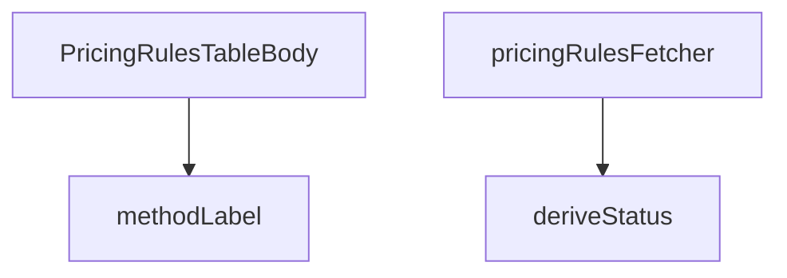

## Genel Bakış

Bu modül, yönetim panelindeki fiyatlandırma kuralları tablosunun gövdesini oluşturan React bileşenini ve yardımcı fonksiyonlarını içerir. Supabase veritabanından fiyatlandırma kurallarını çeker, her kuralın geçerlilik durumunu hesaplar ve ödeme yöntemlerini kullanıcıya gösterilebilir etiketlere dönüştürür.

## Fonksiyon Grupları

### Veri Çekme
Supabase istemcisi üzerinden fiyatlandırma kurallarını asenkron olarak sorgular ve tablo bileşeninin tüketebileceği formatta sonuç döndürür.
- pricingRulesFetcher

### Veri Dönüştürme ve Durum Hesaplama
Ham kural verisini kullanıcı arayüzüne uygun hale getirir. Bir kuralın bugün için geçerli, geçmişte kalmış veya gelecekte başlayacak olup olmadığını belirler; ödeme yöntemlerini ise i18n desteğiyle insan tarafından okunabilir etiketlere çevirir.
- deriveStatus, methodLabel

### Bileşen
Fiyatlandırma kuralları tablosunun gövdesini render eden ana bileşendir. Üst gruplardaki fonksiyonları kullanarak veriyi çeker, durum ve etiket bilgilerini hesaplar ve satırları oluşturur.
- PricingRulesTableBody

## Bağımlılıklar

**Dış Bağımlılıklar:**
- SupabaseClient: Veritabanı bağlantısı ve sorguları için
- i18n fonksiyonu (t parametresi): Çoklu dil desteği ve etiket çevirileri için
- React: Bileşen yapısı ve yaşam döngüsü için

**İç İlişkiler:**
- PricingRulesTableBody bileşeni, veri çekmek için pricingRulesFetcher fonksiyonunu çağırır
- Tablo satırlarının durumunu belirlemek için deriveStatus kullanılır
- Ödeme yöntemi sütununda okunabilir metin göstermek için methodLabel kullanılır

---

## AXIOMS – Mimari Varsayımlar
- Bu modül davranışsal mantık içermez (salt veri / konfigürasyon / tip tanımı).
- [Aksiyom 1]: Modülün dışa açtığı yapı (anahtar kümesi / şema) bir sözleşmedir; tüketiciler bu sabit yapıya bağlıdır — kırıcı değişiklik tüm tüketicileri etkiler.
- [Aksiyom 2]: Bir öğe ekleme/çıkarma yapısal-uyumlu olmalı; ilgili tipler ve seçiciler aynı commit'te güncel tutulmalıdır.

---

## FONKSİYON DETAYLARI

### methodLabel
**Ne yapar**: Verilen fiyatlandırma yöntemini (method) kullanıcı arayüzünde gösterilecek çevrilmiş bir etiket string'ine dönüştürür. Uluslararasılaştırma (i18n) desteği sağlar; yöntem için tanımlı bir çeviri anahtarı varsa çeviriyi döndürür, yoksa orijinal method string'ini olduğu gibi geri verir.

**Nasıl yapar**: Öncelikle `METHOD_I18N_KEYS` sözlüğünde verilen `method` parametresine karşılık gelen bir i18n anahtarı arar. Eğer bu anahtar mevcutsa, `t` fonksiyonu aracılığıyla `admin.pricing.common.method.${key}` yolundaki çeviri metni çözümlenir ve döndürülür. Anahtar bulunamazsa, ham `method` değeri aynen döndürülür.

**Parametreler**:
- method: string — Fiyatlandırma yöntemini temsil eden kod adı (örneğin `'cost_plus'`, `'fixed'` gibi değerler).
- t: (key: string) => string — Uluslararasılaştırma fonksiyonu; verilen çeviri anahtarına karşılık gelen yerelleştirilmiş metni döndürür.

**Dönüş**: string — Yöntemin çevrilmiş etiketi ya da çeviri bulunamadığında orijinal `method` değeri.

### deriveStatus
**Ne yapar**: Geliştirildi ancak detay üretilemedi.

### pricingRulesFetcher
**Ne yapar**: Geliştirildi ancak detay üretilemedi.

### PricingRulesTableBody
**Ne yapar**: Geliştirildi ancak detay üretilemedi.

---

## İTHALATLAR (IMPORTS)
- import: ../../components/admin/AccessDenied::AccessDenied
- import: ../../components/admin/AdminEmptyState::AdminEmptyState
- import: ../../components/admin/AdminToolbar::AdminToolbar
- import: ../../components/admin/ExportMenu::ExportMenu
- import: ../../components/admin/data-table/BulkBar::BulkBar
- import: ../../components/admin/data-table/BulkBar::type BulkAction
- import: ../../components/admin/data-table/DataTableKit::DataTableKit
- import: ../../components/admin/data-table/FacetedFilter::FacetedFilter
- import: ../../components/admin/data-table/types::type { AdminColumn, DataTableFacet }
- import: ../../components/admin/overlay/ConfirmProvider::useConfirm
- import: ../../components/admin/pricing/CostRefreshModal::CostRefreshModal
- import: ../../components/admin/pricing/MaterializePricesModal::MaterializePricesModal
- import: ../../components/admin/pricing/PricingRuleFormModal::PricingRuleFormModal
- import: ../../hooks/useAdminTable::type FetchParams
- import: ../../hooks/useAdminTable::type FetchResult
- import: ../../hooks/useAdminTable::useAdminTable
- import: ../../hooks/useRole::useRole
- import: ../../i18n/I18nProvider::useI18n
- import: ../../i18n/datetime::formatDate
- import: ../../i18n/format::formatCurrency
- import: ../../i18n/format::formatNumber
- import: ../../lib/ensureSessionFresh::ensureSessionFresh
- import: ../../lib/services/pricing.service::type { PricingRuleRow }
- import: ../../types/database.types::type { Database }
- import: @/lib/admin/mutateWithAudit::AdminPermissionError
- import: @/lib/admin/mutateWithAudit::mutateWithAudit
- import: @/lib/supabase/client::supabaseBrowserClient
- import: @supabase/supabase-js::type { SupabaseClient }
- import: lucide-react::Coins
- import: lucide-react::Percent
- import: lucide-react::Plus
- import: lucide-react::RefreshCw
- import: lucide-react::SearchX
- import: next/link::Link
- import: next::type { Route }
- import: react::React
- import: react::useCallback
- import: react::useMemo
- import: react::useState
- import: sonner::toast

---

## INTERFACES

### RuleRow
- `id: string`
- `scope: number`
- `scopeKey: ScopeKey`
- `targetName: string`
- `method: string`
- `supported: boolean`
- `marginPct: number | null`
- `fixedPrice: number | null`
- `vatInclusive: boolean`
- `priority: number`
- `validFrom: string | null`
- `validTo: string | null`
- `status: RuleStatus`
- `productId: string | null`
- `raw: PricingRuleRow`

---

## TYPE ALIASES

### ScopeKey
Marj kuralları tablosu (W3-T2). Kural = fiyatın SSOT'u: burada yapılan her değişiklik vitrin fiyatını türetir. Bu yüzden tablo "hangi kural neyi kapsıyor + hangi oranla" sorusunu tek bakışta cevaplar; kanonik `margin_pct` yanında katsayı karşılığı (×1,40) da gösterilir — saha dili katsayıdır, veri d
```typescript
type ScopeKey = 'variant' | 'product' | 'brand' | 'category' | 'global'
```

### RuleStatus
```typescript
type RuleStatus = 'active' | 'scheduled' | 'expired'
```

---

## SABİTLER
- **SCOPE_KEYS** (object) — `{
  0: 'variant',
  1: 'product',
  2: 'brand',
  3: 'category',
  4: 'g...`
- **METHOD_I18N_KEYS** (object) — `{
  cost_plus: 'costPlus',
  fixed: 'fixed',
  percent_off_list: 'percentO...`

---

## AST POINTERS

### [N1_NASIL] AST Pointer: PricingRulesTableBody.tsx::methodLabel
- **params**: `method` (string) — fiyatlandırma yöntemi anahtarı, `t` ((key: string) => string) — çeviri fonksiyonu
- **ic_degiskenler**:
  - `key` — `METHOD_I18N_KEYS[method]` ile elde edilen i18n çeviri anahtarı; tanımlı değilse undefined olur
- **Dönüş**: string — `key` varsa `t('admin.pricing.common.method.${key}')` sonucu, yoksa ham `method` değeri

---


## MERMAID CALL GRAPH


## NODE ID STANDARD

  file: src\views\admin\PricingRulesTableBody.tsx
  function: src\views\admin\PricingRulesTableBody.tsx::methodLabel
  function: src\views\admin\PricingRulesTableBody.tsx::deriveStatus
  function: src\views\admin\PricingRulesTableBody.tsx::pricingRulesFetcher
  function: src\views\admin\PricingRulesTableBody.tsx::PricingRulesTableBody

---

## DISA AKTARILANLAR (EXPORTS)
  export: PricingRulesTableBody
  export: deriveStatus
  export: methodLabel
  export: pricingRulesFetcher

---

## STİL TOKENLERİ

### Arbitrary Değerler (token'a geçirilmemiş)
Yok — tüm stiller token'a geçirilmiş. ✅

### Kullanılan Token'lar (zaten token'a geçirilmiş)
- (yok)

### Tailwind Sınıf Özeti
- **Renkler:** `bg-admin-accent-weak`, `bg-admin-success-weak`, `bg-admin-surface-3`, `bg-admin-warning-weak`, `border-admin-accent/30`, `border-admin-border`, `border-admin-success/30`, `border-admin-warning/30`, `text-admin-accent`, `text-admin-fg`, `text-admin-fg-muted`, `text-admin-fg-subtle`, `text-admin-success`, `text-admin-warning`, `text-sm`
- **Layout:** `flex`, `flex-col`, `flex-wrap`, `gap-0.5`, `gap-1`, `gap-2`, `inline-flex`, `items-center`, `items-end`, `justify-end`, `w-fit`
- **Varyant/Responsive:** `:`, `disabled:` önekleri
- **Yardımcı Sınıflar:** `$`, `${adminTableActionClass`, `${adminTableActionDangerClass`, `:`, `===`, `active`, `border`, `disabled:cursor-not-allowed`, `disabled:opacity-40`, `expired`, `font-bold`, `font-semibold`, `opacity-50`, `px-2`, `px-2.5`