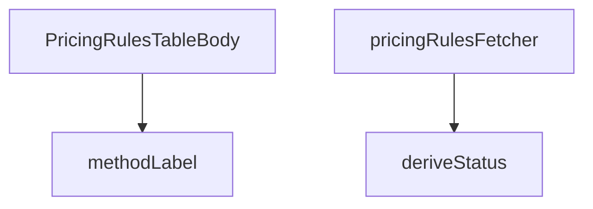

## Genel Bakış

Bu modül, yöneticilik panelindeki fiyatlandırma kurallarının tablo görünümünü oluşturmakla sorumludur. Modül, Supabase üzerinden veri çekme sürecini yöneten, kuralların durumunu tarihsel olarak hesaplayan, ödeme yöntemlerini okunabilir etiketlere dönüştüren yardımcı fonksiyonları içeren bir React bileşenidir.

## Fonksiyon Grupları

### Veri Çekme ve Yönetimi
Bu grup, fiyatlandırma kurallarının uzak veri kaynağından güvenilir bir şekilde çekilmesini ve bileşenin kullanabileceği formata dönüştürülmesini sağlar.
- pricingRulesFetcher: Supabase istemcisi ile fiyatlandırma kurallarını çeken ve Promise formatında sonuç döndüren asenkron veri getirme fonksiyonudur.

### Veri İşleme ve Dönüştürme
Bu grup, ham verileri kullanıcıya gösterim için anlamlı ve tutarlı biçimlere dönüştüren yardımcı fonksiyonları kapsar.
- deriveStatus: Bir kuralın, bugünkü tarihe göre "aktif", "pasif" veya "gelecek" gibi durumunu hesaplayan tarih tabanlı mantık fonksiyonudur.
- methodLabel: Ödeme yöntemi kodunu kullanıcı arayüzünde gösterilecek lokalize etikete dönüştüren harita fonksiyonudur.

### Ana Bileşen
Bu grup, modülün dışarıya sunduğu ve tüm diğer fonksiyonları bir araya getirerek arayüzü oluşturan temel React bileşenini ifade eder.
- PricingRulesTableBody: Fiyatlandırma kurallarını tablo satırları olarak oluşturan ve veri çekme ile işleme fonksiyonlarını bir arada kullanan fonksiyonel React bileşenidir.

---

## AXIOMS – Mimari Varsayımlar
Bu modül için, yalnızca sağlanan fonksiyon imzalarına dayalı kesin aksiyomlar çıkarılamamaktadır. Fonksiyon gövdesi içeriği bilinmediğinden, aşağıda modülün temel bağımlılıklarına ve genel yapısına ilişkin gerekli koşullar listelenmektedir.

[Aksiyom 1]: Eğer `methodLabel` fonksiyonuna sağlanan `t` (çeviri fonksiyonu), `METHOD_I18N_KEYS` içindeki anahtarları dönüştüremezse, metin gösterimi hatalı veya eksik olur.
[Aksiyom 2]: Eğer `deriveStatus` fonksiyonuna verilen `rule` (`PricingRuleRow`) nesnesinde tarih karşılaştırması için gerekli alanlar (örn. `start_date`, `end_date`) yoksa veya `today` string'i beklenen formatta (örn. `YYYY-MM-DD`) değilse, kuralın durumu (aktif, pasif, gelecek) hatalı hesaplanır.
[Aksiyom 3]: Eğer `pricingRulesFetcher` fonksiyonuna geçirilen `supabase` istemcisi (`SupabaseClient<Database>`), veritabanına erişim iznine sahip değilse veya ilgili tablo (pricing_rules) mevcut değilse, veri çekme başarısız

---

## FONKSİYON DETAYLARI

### methodLabel

**Ne yapar**: Verilen fiyatlandırma yöntem kodunu (örn: `"cost_plus"`, `"fixed"`) uluslararasılaştırılmış (i18n) bir insan-okunabilir etikete dönüştürür. Eğer yöntem kodu bilinen bir key ile eşleşmezse, ham kodun kendisini döndürerek güvenli bir geri dönüş sağlar.

**Nasıl yapar**: `METHOD_I18N_KEYS` adlı harita nesnesinde metodun eşdeğer i18n key'ini arar. Bulunan key'i `t()` çeviri fonksiyonuna `admin.pricing.common.method.${key}` yoluyla送ar. Haritada eşleşme yoksa metodun kendisini doğrudan döndürür. `t` parametresi bir çeviri fonksiyonudur ve bir key alarak lokalize edilmiş metin döndürür.

**Parametreler**:
- `method: string` — Fiyatlandırma yöntem kodu (örn: `"cost_plus"`, `"fixed"`, `"manual"`). `METHOD_I18N_KEYS` haritasında tanımlı olmayan değerler için fallback olarak kullanılır.
- `t: (key: string) => string` —Uluslararasılaştırma (i18n) çeviri fonksiyonu. Verilen key'e karşılık gelen lokalize metni döndürür. Örneğin `react-i18next` kütüphanesinden gelen `useTranslation` hook'unun `t` fonksiyonu olabilir.

**Dönüş**: `string` — Lokalize edilmiş yöntem etiketi veya tanınmayan method kodları için ham değer.

### deriveStatus
**Ne yapar**: Geliştirildi ancak detay üretilemedi.

### pricingRulesFetcher
**Ne yapar**: Geliştirildi ancak detay üretilemedi.

### PricingRulesTableBody
**Ne yapar**: Geliştirildi ancak detay üretilemedi.

---

## İTHALATLAR (IMPORTS)
- import: ../../components/admin/AccessDenied::AccessDenied
- import: ../../components/admin/AdminEmptyState::AdminEmptyState
- import: ../../components/admin/AdminToolbar::AdminToolbar
- import: ../../components/admin/ExportMenu::ExportMenu
- import: ../../components/admin/data-table/BulkBar::BulkBar
- import: ../../components/admin/data-table/BulkBar::type BulkAction
- import: ../../components/admin/data-table/DataTableKit::DataTableKit
- import: ../../components/admin/data-table/FacetedFilter::FacetedFilter
- import: ../../components/admin/data-table/types::type { AdminColumn, DataTableFacet }
- import: ../../components/admin/pricing/CostRefreshModal::CostRefreshModal
- import: ../../components/admin/pricing/MaterializePricesModal::MaterializePricesModal
- import: ../../components/admin/pricing/PricingRuleFormModal::PricingRuleFormModal
- import: ../../hooks/useAdminTable::type FetchParams
- import: ../../hooks/useAdminTable::type FetchResult
- import: ../../hooks/useAdminTable::useAdminTable
- import: ../../hooks/useRole::useRole
- import: ../../i18n/I18nProvider::useI18n
- import: ../../i18n/datetime::formatDate
- import: ../../i18n/format::formatCurrency
- import: ../../i18n/format::formatNumber
- import: ../../lib/ensureSessionFresh::ensureSessionFresh
- import: ../../lib/services/pricing.service::type { PricingRuleRow }
- import: ../../types/database.types::type { Database }
- import: @/lib/admin/mutateWithAudit::AdminPermissionError
- import: @/lib/admin/mutateWithAudit::mutateWithAudit
- import: @/lib/supabase/client::supabaseBrowserClient
- import: @supabase/supabase-js::type { SupabaseClient }
- import: lucide-react::Coins
- import: lucide-react::Percent
- import: lucide-react::Plus
- import: lucide-react::RefreshCw
- import: lucide-react::SearchX
- import: next/link::Link
- import: next::type { Route }
- import: react::React
- import: react::useCallback
- import: react::useMemo
- import: react::useState
- import: sonner::toast

---

## INTERFACES

### RuleRow
- `id: string`
- `scope: number`
- `scopeKey: ScopeKey`
- `targetName: string`
- `method: string`
- `supported: boolean`
- `marginPct: number | null`
- `fixedPrice: number | null`
- `vatInclusive: boolean`
- `priority: number`
- `validFrom: string | null`
- `validTo: string | null`
- `status: RuleStatus`
- `productId: string | null`
- `raw: PricingRuleRow`

---

## TYPE ALIASES

### ScopeKey
Marj kuralları tablosu (W3-T2). Kural = fiyatın SSOT'u: burada yapılan her değişiklik vitrin fiyatını türetir. Bu yüzden tablo "hangi kural neyi kapsıyor + hangi oranla" sorusunu tek bakışta cevaplar; kanonik `margin_pct` yanında katsayı karşılığı (×1,40) da gösterilir — saha dili katsayıdır, veri d
```typescript
type ScopeKey = 'variant' | 'product' | 'brand' | 'category' | 'global'
```

### RuleStatus
```typescript
type RuleStatus = 'active' | 'scheduled' | 'expired'
```

---

## SABİTLER
- **SCOPE_KEYS** (object) — `{
  0: 'variant',
  1: 'product',
  2: 'brand',
  3: 'category',
  4: 'g...`
- **METHOD_I18N_KEYS** (object) — `{
  cost_plus: 'costPlus',
  fixed: 'fixed',
  percent_off_list: 'percentO...`

---

## AST POINTERS

### [N1_NASIL] AST Pointer: PricingRulesTableBody.tsx::methodLabel
- **params**: `method: string`, `t: (key: string) => string`
- **ic_degiskenler**:
  - `key` — `METHOD_I18N_KEYS[method]` ile elde edilen i18n anahtar sözlüğü mapped değeri; method string'ini iç localization key'ine dönüştürür
- **Dönüş**: `string` — yerelleştirilmiş yöntem etiketi; eşleşme yoksa ham `method` döner

### [N2_NASIL] AST Pointer: PricingRulesTableBody.tsx::deriveStatus
- **params**: `rule: PricingRuleRow`, `today: string`
- **ic_degiskenler**: yok
- **Dönüş**: `RuleStatus` — `'expired'` | `'scheduled'` | `'active'`; `valid_to < today` ise expired, `valid_from > today` ise scheduled, aksi halde active

### [N3_NASIL] AST Pointer: PricingRulesTableBody.tsx::pricingRulesFetcher
- **params**: `supabase: SupabaseClient<Database>`, `_params: FetchParams`
- **ic_degiskenler**:
  - `rules` — `listPricingRules(supabase)` çağrısının sonucu; veritabanından çekilen tüm fiyatlandırma kuralları dizisi
  - `brands` — `Promise.all` destructuring'inden elde edilen `data` alanı; `supabase.from('brands').select('id, name')` sonucu
  - `categories` — `Promise.all` destructuring'inden elde edilen `data` alanı; `supabase.from('categories').select('id, name')` sonucu
  - `productIds` — `rules` dizisinden `product_id`'leri benzersizleştiren `new Set` + `filter` ile elde edilen `string[]`; null olanları dışlar
  - `products` — `productIds` boş değilse `supabase.from('products').select('id, name, sku').in('id', productIds)` sonucu; boşsa `[]` döner
  - `brandName` — `Map<string, string>`; `(brands ?? []).map(b => [b.id, b.name])` ile marka ID → isim eşleme haritası
  - `categoryName` — `Map<string, string>`; `(categories ?? []).map(c => [c.id, c.name])` ile kategori ID → isim eşleme haritası
  - `productName` — `Map<string, string>`; `products.map(p => [p.id, p.name + ' (' + p.sku + ')'])` ile ürün ID → "isim (sku)" eşleme haritası
  - `today` — `new Date().toISOString().slice(0, 10)` ile elde edilen `YYYY-MM-DD` biçiminde bugünün tarih dizgesi
  - `rows` — `rules.map(rule => { ... })` ile her kuralı `RuleRow` objesine dönüştüren sonuç dizisi; her eleman `scopeKey`, `targetName`, `status` gibi zenginleştirilmiş alanları içerir
- **Dönüş**: `Promise<FetchResult<RuleRow>>` — `{ rows, totalMatched: rows.length }` objesi

### [N4_NASIL] AST Pointer: PricingRulesTableBody.tsx::(rule map — pricingRulesFetcher içindeki dönüştürme callback'i)
- **params**: `rule` — tek bir kural nesnesi (rules dizisinin bir elemanı)
- **ic_degiskenler**:
  - `scopeKey` — `SCOPE_KEYS[rule.scope] ?? 'global'`; sayısal scope değerini okunabilir string anahtarına dönüştürür (variant, product, brand, category, global)
  - `targetName` — scope türüne göre koşullu zincirleme: `scope === 2` ise `brandName.get(rule.brand_id ?? '')`, `scope === 3` ise `categoryName.get(rule.category_id ?? '')`, `scope === 0 || scope === 1` ise `productName.get(rule.product_id ?? '')`, aksi halde boş string
- **Dönüş**: `RuleRow` objesi — `{ id, scope, scopeKey, targetName, method, supported, marginPct, fixedPrice, vatInclusive, priority, validFrom, validTo, status, productId, raw }` alanlarını içeren tam nesne

### [N5_NASIL] AST Pointer: PricingRulesTableBody.tsx::PricingRulesTableBody
- **params**: yok (React bileşeni)
- **ic_degiskenler** (callback'lerden çıkarılan):
  - `setEditing` — `useState` setter; düzenleme modunda açık olan kuralı tutar
  - `setModalOpen` — `useState` setter; modalın açık/kapalı durumunu kontrol eder
  - `table` — tablo durum/hook nesnesi; `.reload()`, `.selection`, `.allRows`, `.fetchAllForExport()`, `.filtering` üyelerini içerir
  - `hasWriteAccess` — `boolean`; kullanıcının yazma iznini belirler,但 silme/düzenleme butonlarının `disabled` durumunu kontrol eder
  - `locale` — dil/bölge ayarı; `formatNumber`, `formatCurrency`, `formatDate` yardımcılarına geçilir
  - `t` — çeviri fonksiyonu; tüm UI metinleri için kullanılır
  - `supabaseBrowserClient` — import edilen tarayıcı tarafı Supabase istemcisi; silme işlemlerinde kullanılır
  - `openCreate` — callback; `setEditing(null)` ve `setModalOpen(true)` çağırarak yeni kural ekleme modunu açar
  - `openEdit` — `(row) => { setEditing(row.raw); setModalOpen(true); }` callback'i; var olan kuralı düzenleme modunda açar
  - `removeRule` — tekil kural silme callback'i (detaylı aşağıda)
  - `bulkDelete` — toplu silme callback'i (detaylı aşağıda)
  - `columns` — tablo sütun tanımları dizisi (detaylı aşağıda)
  - `facets` — filtre facet tanımları (detaylı aşağıda)
  - `bulkActions` — toplu işlem menüsü dizisi
  - `onExport` — CSV dışa aktarma callback'i (detaylı aşağıda)
- **Dönüş**: JSX bileşeni; tablo, filtreler, toplu işlemler ve modal'ı render eder

### [N6_NASIL] AST Pointer: PricingRulesTableBody.tsx::removeRule (tekil silme callback'i)
- **params**: `row: RuleRow` — silinecek kural
- **ic_degiskenler**:
  - `window.confirm(...)` — `t('admin.pricing.rules.confirm.delete')` ile onay diyaloğu; false dönerse işlev iptal
  - `mutateWithAudit(...)` — audit loglu silme çağrısı parametreleri: `resource: 'pricing_rule'`, `canWrite: hasWriteAccess`, `action: 'DELETE'`, `rowPk: row.id`, `before: { scope, method, margin_pct, priority }`, `after: null`, `auditedByEdge: false`
  - `fn` (iç callback) — `async () => { await deletePricingRule(supabaseBrowserClient, row.id) }` asıl silme işlemini yürütür
  - `e` — catch bloğu yakaladığı hata; `AdminPermissionError` instance ise izin hatası, diğerleri silme hatası
- **Dönüş**: `void` — başarıyla `toast.success` gösterir ve `table.reload()` ile tabloyu yeniler; hata durumunda `toast.error`

### [N7_NASIL] AST Pointer: PricingRulesTableBody.tsx::bulkDelete (toplu silme callback'i)
- **params**: yok
- **ic_degiskenler**:
  - `ids` — `table.selection.selectedIds`; kullanıcının seçtiği kural ID'leri dizisi; boşsa işlev iptal
  - `window.confirm(...)` — `t('admin.pricing.rules.confirm.bulkDelete', { count: ids.length })` ile onay diyaloğu
  - `mutateWithAudit(...)` — audit loglu toplu silme: `resource: 'pricing_rule'`, `action: 'DELETE'`, `rowPk: null`, `before: { ids }`, `after: null`
  - `fn` (iç callback) — `async () => { await deletePricingRules(supabaseBrowserClient, ids) }` toplu silme işlemini yürütür
  - `e` — catch bloğu; `AdminPermissionError` kontrolü
- **Dönüş**: `void` — başarıyla `table.selection.clear()`, `toast.success`, `table.reload()`; hata durumunda `toast.error`

### [N8_NASIL] AST Pointer: PricingRulesTableBody.tsx::columns (tablo sütun tanımları)
- **params**: yok (closure olarak `t`, `locale`, `openEdit`, `removeRule`, `hasWriteAccess` gibi dış değişkenlere erişir)
- **ic_degiskenler**: yok (düz array return)
- **Dönüş**: `Array<{ key, header, sortable?, align?, hideable?, cell: (r) => JSX }> ` — 8 sütun tanımları:
  - `scopeKey` — cyan badge ile kapsam etiketi
  - `targetName` — hedef adı veya "Tüm Ürünler" fallback
  - `method` — yöntem etiketi + desteklenmeyen yöntem uyarısı
  - `rate` — cost_plus için `%margin × katsayı`, fixed için para birimli fiyat + KDV bilgisi
  - `priority` — öncelik sayısı
  - `validity` — geçerlilik tarih aralığı (başlangıç/bitiş)
  - `status` — renkli badge ile durum (active/scheduled/expired)
  - `actions` — preview linki (scope 0/1 ve productId varsa) + düzenle + sil butonları

### [N9_NASIL] AST Pointer: PricingRulesTableBody.tsx::facets (filtre tanımı)
- **params**: yok (closure)
- **ic_degiskenler**:
  - `scopeCount` — `Map<string, number>`; `table.allRows` üzerinden her `scopeKey`'in sayısını sayar
  - `methodCount` — `Map<string, number>`; her yöntem tipinin sayısını sayar
  - `statusCount` — `Map<string, number>`; her durum tipinin sayısını sayar
  - `scopeOptions` — `['variant', 'product', 'brand', 'category', 'global']` sabit dizisi
  - `methodOptions` — `['cost_plus', 'fixed', 'percent_off_list']` sabit dizisi
  - `statusOptions` — `['active', 'scheduled', 'expired']` sabit dizisi
- **Dönüş**: `Array<{ key, label, options: Array<{ value, label, count }> }>` — 3 facet objesi (scope, method, status); her biri seçeneklerin sayısını ve etiketlerini içerir

### [N10_NASIL] AST Pointer: PricingRulesTableBody.tsx::onExport (CSV dışa aktarma)
- **params**: yok (closure)
- **ic_degiskenler**:
  - `rows` — `table.fetchAllForExport()` sonucu; dışa aktarılacak tüm satırlar
  - `cols` — `['id', 'scope', 'target', 'method', 'margin_pct', 'fixed_price', 'priority', 'valid_from', 'valid_to']` CSV sütun başlıkları
  - `escape` — `(v: unknown) => '"' + String(v ?? '').replace(/"/g, '""') + '"'` CSV hücre kaçış fonksiyonu; tırnak işaretlerini çiftler
  - `lines` — `rows.map(r => [...].map(escape).join(','))` ile her satırı CSV satırına dönüştüren dizi; `r.marginPct ?? ''` ve `r.fixedPrice ?? ''` ile null değerleri boş string'e çevirir
  - `csv` — BOM (`\uFEFF`) + başlık satırı + veri satırları birleştirilmiş tam CSV dizgesi
  - `blob` — `new Blob([csv], { type: 'text/csv;charset=utf-8;' })` ile oluşturulan CSV blob nesnesi
  - `url` — `URL.createObjectURL(blob)` ile oluşturulan geçici dosya URL'i
  - `a` — `document.createElement('a')` ile oluşturulan geçici anchor elementi; `href = url`, `download = 'pricing-rules.csv'`, `.click()` ile indirme tetiklenir
- **Dönüş**: `void` — dosya indirmeyi tetikler; sonunda `URL.revokeObjectURL(url)` ile URL'i serbest bırakır

---


## MERMAID CALL GRAPH


## NODE ID STANDARD

  file: src\views\admin\PricingRulesTableBody.tsx
  function: src\views\admin\PricingRulesTableBody.tsx::methodLabel
  function: src\views\admin\PricingRulesTableBody.tsx::deriveStatus
  function: src\views\admin\PricingRulesTableBody.tsx::pricingRulesFetcher
  function: src\views\admin\PricingRulesTableBody.tsx::PricingRulesTableBody

---

## DISA AKTARILANLAR (EXPORTS)
  export: PricingRulesTableBody
  export: deriveStatus
  export: methodLabel
  export: pricingRulesFetcher

---

## STİL TOKENLERİ

### Arbitrary Değerler (token'a geçirilmemiş)
Yok — tüm stiller token'a geçirilmiş. ✅

### Kullanılan Token'lar (zaten token'a geçirilmiş)
- (yok)

### Tailwind Sınıf Özeti
- **Renkler:** `bg-amber-500/10`, `bg-blue-500/10`, `bg-cyan-500/10`, `bg-emerald-500/10`, `bg-slate-500/10`, `border-amber-500/20`, `border-blue-500/20`, `border-cyan-500/20`, `border-emerald-500/20`, `border-white/5`, `text-amber-400`, `text-blue-400`, `text-cyan-400`, `text-emerald-400`, `text-slate-300`
- **Layout:** `flex`, `flex-col`, `gap-0.5`, `gap-1`, `gap-2`, `inline-flex`, `items-center`, `items-end`, `justify-end`, `w-fit`
- **Varyant/Responsive:** `:`, `disabled:` önekleri
- **Yardımcı Sınıflar:** `$`, `${adminTableActionClass`, `${adminTableActionDangerClass`, `:`, `===`, `active`, `border`, `disabled:cursor-not-allowed`, `disabled:opacity-40`, `expired`, `font-black`, `font-bold`, `opacity-50`, `px-2`, `px-2.5`