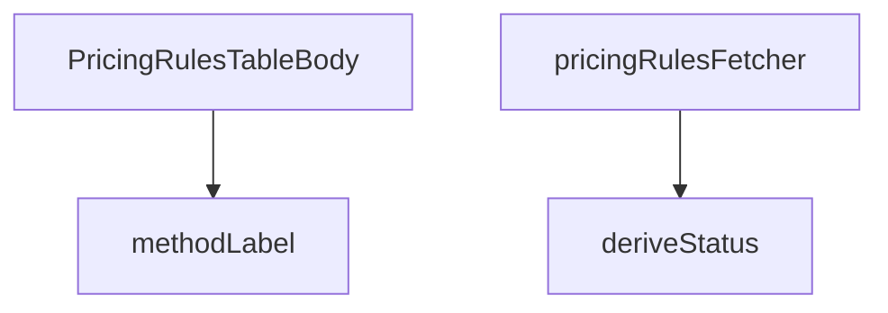

## Genel Bakış

Bu modül, fiyatlandırma kuralları tablosunun her bir satırını (body) oluşturmak ve sunmakla sorumludur. Modül, arka planda veri çekme işlemini yöneten, bir kuralın durumunu (aktif, pasif, gelecek) tarihe göre hesaplayan ve ödeme yöntemi etiketlerini dönüştüren yardımcı fonksiyonları içererek ana bileşene destek verir.

## Fonksiyon Grupları

### Veri Çekme ve Hazırlama
Bu grup, modülün dış veri kaynağından (Supabase) fiyatlandırma kurallarını çekmekle ve UI bileşenine sunulacak formata hazırlamakla sorumludur.
- pricingRulesFetcher: Supabase istemcisini kullanarak fiyatlandırma kurallarını çeken ve tablonun gerektirdiği formatta sonuç döndüren ana veri çekme fonksiyonudur.

### Yardımcı İşlem Fonksiyonları
Bu grup, çekilen verilerin bireysel satırlar üzerinde anlaşılabilir ve anlamlı bir şekilde gösterilmesi için gerekli dönüşümleri ve hesaplamaları yapar.
- methodLabel: Ödeme yöntemi kodunu (örn: "credit_card") kullanıcıya gösterilecek etikete (örn: "Kredi Kartı") dönüştürür.
- deriveStatus: Bir kuralın, bugünün tarihine göre "aktif", "pasif" veya "gelecek" gibi durumunu hesaplar.

### Ana Bileşen
Bu grup, modülün dışarıya sunduğu ve React içinde kullanılan temel UI bileşenidir.
- PricingRulesTableBody: Fiyatlandırma kurallarının her birini tablo satırı olarak render eden ana React fonksiyonel bileşenidir.

---

## AXIOMS – Mimari Varsayımlar

Bu modül, fiyatlandırma kurallarının tablo halinde sunulmasını sağlayan bir React bileşen modülüdür. Aşağıdaki mimari varsayımlar fonksiyon imzalarından ve modül sabitlerinden türetilmiştir.

[Aksiyom 1]: Eğer `deriveStatus` fonksiyonuna `PricingRuleRow` tipinde bir `rule` nesnesi verilmezse veya `today` parametresi geçerli bir tarih stringi formatında değilse, fonksiyonun `today` ve `rule` alanlarını tarih karşılaştırması için kullanacağı garanti edilemez; bu durumda `RuleStatus` dönüş değeri tutarsız olur.

[Aksiyom 2]: Eğer `methodLabel` fonksiyonuna verilen `method` parametresi `METHOD_I18N_KEYS` nesnesinde bir alan olarak mevcut değilse, i18n çevirisi yapılamaz ve döndürülen string ham anahtar olur veya tanımsız bir değere işaret eder.

[Aksiyom 3]: Eğer `pricingRulesFetcher` fonksiyonuna verilen `supabase` istemcisi `Database` tipiyle uyumlu bir Supabase bağlantısı içermiyorsa veya `_params` parametresi `FetchParams` formatına uymuyorsa, veritabanı sorgusu başarısız olur ve `Promise<FetchResult<RuleRow>>` reddedilir.

[Aksiyom 4]: Eğer `deriveStatus` fonksiyonundaki tarih karşılaştırması için `PricingRuleRow` nesnesinin `valid_from` veya `valid_to` alanları (veya benzer tarih alanları) tanımsız veya `null` ise, kuralın bugün itibarıyla aktif/pasif durumu doğru hesaplanamaz.

[Aksiyom 5]: Eğer `SCOPE_KEYS` nesnesi modül içinde bir kapsam (scope) filtreleme veya gruplama amacıyla kullanılıyorsa ve bu nesnenin değerleri veritabanındaki gerçek kapsam değerleriyle eşleşmiyorsa, tabloda filtreleme sonuçları boş veya eksik olur.

---

## FONKSİYON DETAYLARI

### methodLabel

**Ne yapar**: Verilen fiyatlandırma yöntem kodunu (örn: `"cost_plus"`, `"fixed"`) uluslararasılaştırılmış (i18n) bir insan-okunabilir etikete dönüştürür. Eğer yöntem kodu bilinen bir key ile eşleşmezse, ham kodun kendisini döndürerek güvenli bir geri dönüş sağlar.

**Nasıl yapar**: `METHOD_I18N_KEYS` adlı harita nesnesinde metodun eşdeğer i18n key'ini arar. Bulunan key'i `t()` çeviri fonksiyonuna `admin.pricing.common.method.${key}` yoluyla送ar. Haritada eşleşme yoksa metodun kendisini doğrudan döndürür. `t` parametresi bir çeviri fonksiyonudur ve bir key alarak lokalize edilmiş metin döndürür.

**Parametreler**:
- `method: string` — Fiyatlandırma yöntem kodu (örn: `"cost_plus"`, `"fixed"`, `"manual"`). `METHOD_I18N_KEYS` haritasında tanımlı olmayan değerler için fallback olarak kullanılır.
- `t: (key: string) => string` —Uluslararasılaştırma (i18n) çeviri fonksiyonu. Verilen key'e karşılık gelen lokalize metni döndürür. Örneğin `react-i18next` kütüphanesinden gelen `useTranslation` hook'unun `t` fonksiyonu olabilir.

**Dönüş**: `string` — Lokalize edilmiş yöntem etiketi veya tanınmayan method kodları için ham değer.

### deriveStatus
**Ne yapar**: Geliştirildi ancak detay üretilemedi.

### pricingRulesFetcher
**Ne yapar**: Geliştirildi ancak detay üretilemedi.

### PricingRulesTableBody
**Ne yapar**: Geliştirildi ancak detay üretilemedi.

---

## İTHALATLAR (IMPORTS)
- import: ../../components/admin/AccessDenied::AccessDenied
- import: ../../components/admin/AdminEmptyState::AdminEmptyState
- import: ../../components/admin/AdminToolbar::AdminToolbar
- import: ../../components/admin/ExportMenu::ExportMenu
- import: ../../components/admin/data-table/BulkBar::BulkBar
- import: ../../components/admin/data-table/BulkBar::type BulkAction
- import: ../../components/admin/data-table/DataTableKit::DataTableKit
- import: ../../components/admin/data-table/FacetedFilter::FacetedFilter
- import: ../../components/admin/data-table/types::type { AdminColumn, DataTableFacet }
- import: ../../components/admin/pricing/PricingRuleFormModal::PricingRuleFormModal
- import: ../../hooks/useAdminTable::type FetchParams
- import: ../../hooks/useAdminTable::type FetchResult
- import: ../../hooks/useAdminTable::useAdminTable
- import: ../../hooks/useRole::useRole
- import: ../../i18n/I18nProvider::useI18n
- import: ../../i18n/datetime::formatDate
- import: ../../i18n/format::formatCurrency
- import: ../../i18n/format::formatNumber
- import: ../../lib/ensureSessionFresh::ensureSessionFresh
- import: ../../lib/services/pricing.service::type { PricingRuleRow }
- import: ../../types/database.types::type { Database }
- import: @/lib/admin/mutateWithAudit::AdminPermissionError
- import: @/lib/admin/mutateWithAudit::mutateWithAudit
- import: @/lib/supabase/client::supabaseBrowserClient
- import: @supabase/supabase-js::type { SupabaseClient }
- import: lucide-react::Percent
- import: lucide-react::Plus
- import: lucide-react::SearchX
- import: next/link::Link
- import: next::type { Route }
- import: react::React
- import: react::useCallback
- import: react::useMemo
- import: react::useState
- import: sonner::toast

---

## INTERFACES

### RuleRow
- `id: string`
- `scope: number`
- `scopeKey: ScopeKey`
- `targetName: string`
- `method: string`
- `supported: boolean`
- `marginPct: number | null`
- `fixedPrice: number | null`
- `vatInclusive: boolean`
- `priority: number`
- `validFrom: string | null`
- `validTo: string | null`
- `status: RuleStatus`
- `productId: string | null`
- `raw: PricingRuleRow`

---

## TYPE ALIASES

### ScopeKey
Marj kuralları tablosu (W3-T2). Kural = fiyatın SSOT'u: burada yapılan her değişiklik vitrin fiyatını türetir. Bu yüzden tablo "hangi kural neyi kapsıyor + hangi oranla" sorusunu tek bakışta cevaplar; kanonik `margin_pct` yanında katsayı karşılığı (×1,40) da gösterilir — saha dili katsayıdır, veri d
```typescript
type ScopeKey = 'variant' | 'product' | 'brand' | 'category' | 'global'
```

### RuleStatus
```typescript
type RuleStatus = 'active' | 'scheduled' | 'expired'
```

---

## SABİTLER
- **SCOPE_KEYS** (object) — `{
  0: 'variant',
  1: 'product',
  2: 'brand',
  3: 'category',
  4: 'g...`
- **METHOD_I18N_KEYS** (object) — `{
  cost_plus: 'costPlus',
  fixed: 'fixed',
  percent_off_list: 'percentO...`

---

## AST POINTERS

### [N1_NASIL] AST Pointer: src/views/admin/PricingRulesTableBody.tsx::methodLabel
- **params**: (method: string, t: (key: string) => string)
- **ic_degiskenler**:
  - `key` — METHOD_I18N_KEYS nesnesinden method anahtarının karşılığını alan i18n anahtarı
- **Dönüş**: string — method etiketinin lokalize edilmiş hali veya method'un kendisi

### [N2_NASIL] AST Pointer: src/views/admin/PricingRulesTableBody.tsx::deriveStatus
- **params**: (rule: PricingRuleRow, today: string)
- **ic_degiskenler**: (yok — sadece parametreler kullanılıyor)
- **Dönüş**: RuleStatus — 'expired', 'scheduled' veya 'active'

### [N3_NASIL] AST Pointer: src/views/admin/PricingRulesTableBody.tsx::pricingRulesFetcher
- **params**: (supabase: SupabaseClient<Database>, _params: FetchParams)
- **ic_degiskenler**:
  - `rules` — supabase'den getirilen pricing rules listesi
  - `brands` — supabase.from('brands').select() sonucu gelen marka verileri
  - `categories` — supabase.from('categories').select() sonucu gelen kategori verileri
  - `productIds` — rules dizisinden elde edilen benzersiz product_id'ler dizisi
  - `products` — productIds ile products tablosundan getirilen ürün verileri
  - `brandName` — brand id → brand name eşleştirmesi yapan Map nesnesi
  - `categoryName` — category id → category name eşleştirmesi yapan Map nesnesi
  - `productName` — product id → product name (sku) eşleştirmesi yapan Map nesnesi
  - `today` — bugünün tarihi (YYYY-MM-DD formatında)
  - `rows` — her rule için hesaplanmış hedef ad ve status ile birlikte oluşturulan RuleRow[] dizisi
  - `scopeKey` — SCOPE_KEYS ile rule.scope'tan elde edilen scope anahtarı
  - `targetName` — scope'a göre marka, kategori veya ürün adını bulan değişken
- **Dönüş**: Promise<FetchResult<RuleRow>> — rows ve toplam eşleşme sayısını içeren nesne

### [N4_NASIL] AST Pointer: src/views/admin/PricingRulesTableBody.tsx::PricingRulesTableBody
- **params**: (yok)
- **ic_degiskenler**: (fonksiyon gövdesi verilmemiş, sadece iç içe fonksiyonlar/arrow function'lar var)
- **Dönüş**: React.FC — React bileşeni

---


## MERMAID CALL GRAPH


## NODE ID STANDARD

  file: src\views\admin\PricingRulesTableBody.tsx
  function: src\views\admin\PricingRulesTableBody.tsx::methodLabel
  function: src\views\admin\PricingRulesTableBody.tsx::deriveStatus
  function: src\views\admin\PricingRulesTableBody.tsx::pricingRulesFetcher
  function: src\views\admin\PricingRulesTableBody.tsx::PricingRulesTableBody

---

## DISA AKTARILANLAR (EXPORTS)
  export: PricingRulesTableBody
  export: deriveStatus
  export: methodLabel
  export: pricingRulesFetcher

---

## STİL TOKENLERİ

### Arbitrary Değerler (token'a geçirilmemiş)
Yok — tüm stiller token'a geçirilmiş. ✅

### Kullanılan Token'lar (zaten token'a geçirilmiş)
- (yok)

### Tailwind Sınıf Özeti
- **Renkler:** `bg-amber-500/10`, `bg-blue-500/10`, `bg-cyan-500/10`, `bg-emerald-500/10`, `bg-slate-500/10`, `border-amber-500/20`, `border-blue-500/20`, `border-cyan-500/20`, `border-emerald-500/20`, `border-white/5`, `text-amber-400`, `text-blue-400`, `text-cyan-400`, `text-emerald-400`, `text-slate-300`
- **Layout:** `flex`, `flex-col`, `gap-0.5`, `gap-1`, `gap-2`, `inline-flex`, `items-center`, `items-end`, `justify-end`, `w-fit`
- **Varyant/Responsive:** `:`, `disabled:` önekleri
- **Yardımcı Sınıflar:** `$`, `${adminTableActionClass`, `${adminTableActionDangerClass`, `:`, `===`, `active`, `border`, `disabled:cursor-not-allowed`, `disabled:opacity-40`, `expired`, `font-black`, `font-bold`, `opacity-50`, `px-2`, `px-2.5`