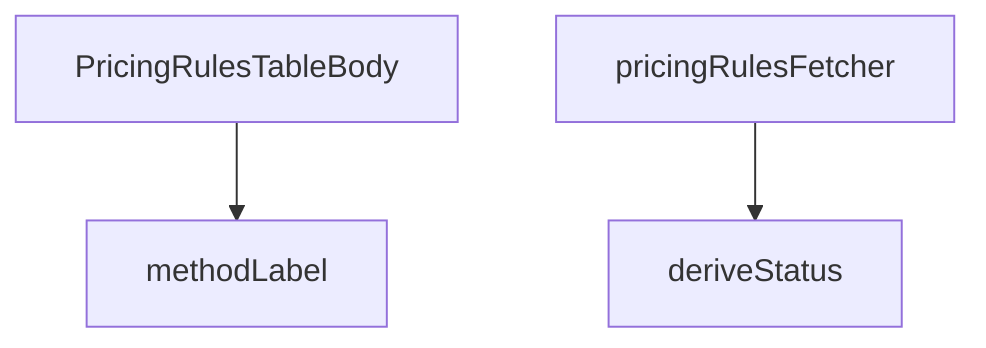

## Genel Bakış
Bu modül, yönetici panelinde fiyatlandırma kurallarının tablo görünümünü oluşturan bir React bileşenidir. Modül, Supabase üzerinden veri çekme sürecini yönetir, kural durumlarını tarihsel olarak hesaplar ve ödeme yöntemlerini okunabilir etiketlere dönüştüren yardımcı fonksiyonlar içerir.

## Fonksiyon Grupları
### Veri Çekme ve Yönetimi
Bu grup, fiyatlandırma kurallarının uzak veri kaynağından (Supabase) güvenilir bir şekilde çekilmesini ve bileşenin kullanabileceği formata dönüştürülmesini sağlar.
- pricingRulesFetcher

### Veri İşleme ve Dönüştürme
Bu grup, ham verileri kullanıcıya gösterim için anlamlı ve tutarlı biçimlere dönüştüren yardımcı fonksiyonları kapsar.
- deriveStatus
- methodLabel

### Ana Bileşen
Bu grup, modülün dışarıya sunduğu ve tüm diğer fonksiyonları bir araya getirerek arayüzü oluşturan temel React bileşenini ifade eder.
- PricingRulesTableBody

---

## AXIOMS – Mimari Varsayımlar
- Bu modül davranışsal mantık içermez (salt veri / konfigürasyon / tip tanımı).
- [Aksiyom 1]: Modülün dışa açtığı yapı (anahtar kümesi / şema) bir sözleşmedir; tüketiciler bu sabit yapıya bağlıdır — kırıcı değişiklik tüm tüketicileri etkiler.
- [Aksiyom 2]: Bir öğe ekleme/çıkarma yapısal-uyumlu olmalı; ilgili tipler ve seçiciler aynı commit'te güncel tutulmalıdır.

---

## FONKSİYON DETAYLARI

### methodLabel
**Ne yapar**: Verilen fiyatlandırma yöntemini (örn. `"cost_plus"`, `"fixed"`) kullanıcı arayüzünde gösterilecek yerelleştirilmiş (localized) metin etiketine dönüştürür. Eğer yöntem bilinmeyen bir değerse, ham method string'ini olduğu gibi döndürür.

**Nasıl yapar**: `METHOD_I18N_KEYS` adlı harita nesnesinde method parametresinin karşılığını arar. Bulunan anahtarı `t()` çeviri fonksiyonuna `"admin.pricing.common.method."` ön ekini ekleyerek传递 eder. Böylece i18n altyapısı tarafından doğru dildeki karşılığı çözümlenir. Haritada eşleşme yoksa method'un kendisini geri döndürerek hata oluşmasını engeller.

**Parametreler**:
- `method: string` — Çevrilecek olan fiyatlandırma yöntemi anahtarı (örn. `"cost_plus"`, `"fixed"` vb.). `METHOD_I18N_KEYS` haritasında tanımlı bir değere karşılık gelmeyebilir.
- `t: (key: string) => string` —Uluslararasılaştırma (i18n) çeviri fonksiyonu. Verilen anahtar dizisi karşılığında o dildeki metni döndürür.

**Dönüş**: `string` — Çevrilmiş kullanıcıya yönelik yöntem etiketi, veya method anahtarı haritada bulunamıyorsa ham method değeri.

### deriveStatus
**Ne yapar**: Geliştirildi ancak detay üretilemedi.

### pricingRulesFetcher
**Ne yapar**: Geliştirildi ancak detay üretilemedi.

### PricingRulesTableBody
**Ne yapar**: Geliştirildi ancak detay üretilemedi.

---

## İTHALATLAR (IMPORTS)
- import: ../../components/admin/AccessDenied::AccessDenied
- import: ../../components/admin/AdminEmptyState::AdminEmptyState
- import: ../../components/admin/AdminToolbar::AdminToolbar
- import: ../../components/admin/ExportMenu::ExportMenu
- import: ../../components/admin/data-table/BulkBar::BulkBar
- import: ../../components/admin/data-table/BulkBar::type BulkAction
- import: ../../components/admin/data-table/DataTableKit::DataTableKit
- import: ../../components/admin/data-table/FacetedFilter::FacetedFilter
- import: ../../components/admin/data-table/types::type { AdminColumn, DataTableFacet }
- import: ../../components/admin/overlay/ConfirmProvider::useConfirm
- import: ../../components/admin/pricing/CostRefreshModal::CostRefreshModal
- import: ../../components/admin/pricing/MaterializePricesModal::MaterializePricesModal
- import: ../../components/admin/pricing/PricingRuleFormModal::PricingRuleFormModal
- import: ../../hooks/useAdminTable::type FetchParams
- import: ../../hooks/useAdminTable::type FetchResult
- import: ../../hooks/useAdminTable::useAdminTable
- import: ../../hooks/useRole::useRole
- import: ../../i18n/I18nProvider::useI18n
- import: ../../i18n/datetime::formatDate
- import: ../../i18n/format::formatCurrency
- import: ../../i18n/format::formatNumber
- import: ../../lib/ensureSessionFresh::ensureSessionFresh
- import: ../../lib/services/pricing.service::type { PricingRuleRow }
- import: ../../types/database.types::type { Database }
- import: @/lib/admin/mutateWithAudit::AdminPermissionError
- import: @/lib/admin/mutateWithAudit::mutateWithAudit
- import: @/lib/supabase/client::supabaseBrowserClient
- import: @supabase/supabase-js::type { SupabaseClient }
- import: lucide-react::Coins
- import: lucide-react::Percent
- import: lucide-react::Plus
- import: lucide-react::RefreshCw
- import: lucide-react::SearchX
- import: next/link::Link
- import: next::type { Route }
- import: react::React
- import: react::useCallback
- import: react::useMemo
- import: react::useState
- import: sonner::toast

---

## INTERFACES

### RuleRow
- `id: string`
- `scope: number`
- `scopeKey: ScopeKey`
- `targetName: string`
- `method: string`
- `supported: boolean`
- `marginPct: number | null`
- `fixedPrice: number | null`
- `vatInclusive: boolean`
- `priority: number`
- `validFrom: string | null`
- `validTo: string | null`
- `status: RuleStatus`
- `productId: string | null`
- `raw: PricingRuleRow`

---

## TYPE ALIASES

### ScopeKey
Marj kuralları tablosu (W3-T2). Kural = fiyatın SSOT'u: burada yapılan her değişiklik vitrin fiyatını türetir. Bu yüzden tablo "hangi kural neyi kapsıyor + hangi oranla" sorusunu tek bakışta cevaplar; kanonik `margin_pct` yanında katsayı karşılığı (×1,40) da gösterilir — saha dili katsayıdır, veri d
```typescript
type ScopeKey = 'variant' | 'product' | 'brand' | 'category' | 'global'
```

### RuleStatus
```typescript
type RuleStatus = 'active' | 'scheduled' | 'expired'
```

---

## SABİTLER
- **SCOPE_KEYS** (object) — `{
  0: 'variant',
  1: 'product',
  2: 'brand',
  3: 'category',
  4: 'global...`
- **METHOD_I18N_KEYS** (object) — `{
  cost_plus: 'costPlus',
  fixed: 'fixed',
  percent_off_list: 'percentOffL...`

---

## AST POINTERS

### [N1_NASIL] AST Pointer: src/views/admin/PricingRulesTableBody.tsx::methodLabel
- **params**: `(method: string, t: (key: string) => string)`
- **ic_degiskenler**:
  - `key` — `METHOD_I18N_KEYS` objesinden `method` ile eşleşen i18n anahtarını alır
- **Dönüş**: `string` — Method etiketini i18n çeviri fonksiyonuyla döndürür

### [N2_NASIL] AST Pointer: src/views/admin/PricingRulesTableBody.tsx::deriveStatus
- **params**: `(rule: PricingRuleRow, today: string)`
- **ic_degiskenler**: (yok)
- **Dönüş**: `RuleStatus` — Kuralın bugün itibarıyla durumunu ('expired', 'scheduled' veya 'active') belirler

### [N3_NASIL] AST Pointer: src/views/admin/PricingRulesTableBody.tsx::pricingRulesFetcher
- **params**: `(supabase: SupabaseClient<Database>, _params: FetchParams)`
- **ic_degiskenler**:
  - `rules` — `listPricingRules` ile çekilen tüm fiyatlandırma kuralları
  - `brands` — `supabase.from('brands').select('id, name')` sorgusundan marka verileri
  - `categories` — `supabase.from('categories').select('id, name')` sorgusundan kategori verileri
  - `productIds` — Kurallardaki benzersiz `product_id` değerlerinin kümesi (null olmayan)
  - `products` — `productIds` varsa `supabase.from('products').select('id, name, sku').in('id', productIds)` ile ürün detayları
  - `brandName` — Marka ID→Adı eşlemesi (Map)
  - `categoryName` — Kategori ID→Adı eşlemesi (Map)
  - `productName` — Ürün ID→Adı(SKU) eşlemesi (Map)
  - `today` — Bugünün tarihi ISO formatında (YYYY-MM-DD)
  - `rows` — Her kural için hesaplanmış `RuleRow` dizisi
- **Dönüş**: `Promise<FetchResult<RuleRow>>` — rows dizisi ve toplam eşleşme sayısını döndürür

---


## MERMAID CALL GRAPH


## NODE ID STANDARD

  file: src\views\admin\PricingRulesTableBody.tsx
  function: src\views\admin\PricingRulesTableBody.tsx::methodLabel
  function: src\views\admin\PricingRulesTableBody.tsx::deriveStatus
  function: src\views\admin\PricingRulesTableBody.tsx::pricingRulesFetcher
  function: src\views\admin\PricingRulesTableBody.tsx::PricingRulesTableBody

---

## DISA AKTARILANLAR (EXPORTS)
  export: PricingRulesTableBody
  export: deriveStatus
  export: methodLabel
  export: pricingRulesFetcher

---

## STİL TOKENLERİ

### Arbitrary Değerler (token'a geçirilmemiş)
Yok — tüm stiller token'a geçirilmiş. ✅

### Kullanılan Token'lar (zaten token'a geçirilmiş)
- (yok)

### Tailwind Sınıf Özeti
- **Renkler:** `bg-amber-500/10`, `bg-blue-500/10`, `bg-cyan-500/10`, `bg-emerald-500/10`, `bg-slate-500/10`, `border-amber-500/20`, `border-blue-500/20`, `border-cyan-500/20`, `border-emerald-500/20`, `border-white/5`, `text-amber-400`, `text-blue-400`, `text-cyan-400`, `text-emerald-400`, `text-slate-300`
- **Layout:** `flex`, `flex-col`, `flex-wrap`, `gap-0.5`, `gap-1`, `gap-2`, `inline-flex`, `items-center`, `items-end`, `justify-end`, `w-fit`
- **Varyant/Responsive:** `:`, `disabled:` önekleri
- **Yardımcı Sınıflar:** `$`, `${adminTableActionClass`, `${adminTableActionDangerClass`, `:`, `===`, `active`, `border`, `disabled:cursor-not-allowed`, `disabled:opacity-40`, `expired`, `font-black`, `font-bold`, `opacity-50`, `px-2`, `px-2.5`