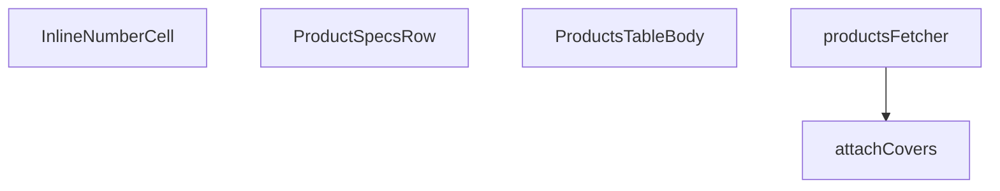

## Genel Bakış

Bu modül, admin panelindeki ürün tablosunun gövde (body) bölümünü yöneten React bileşenlerini ve bu tablonun veri ihtiyacını sağlayan Supabase veri çekme fonksiyonlarını içerir. Ürün listesinin paginasyonlu olarak çekilmesi, kapak görsellerinin eklenmesi ve her satırda satırlar arası genişletilebilir özellik detaylarının gösterilmesi modülün temel sorumlulukları arasındadır.

## Fonksiyon Grupları

### Veri Çekme ve Zenginleştirme

Bu grup, Supabase üzerinden ürün verilerinin çekildiği ve kapak görselleri ile zenginleştirildiği asenkron fonksiyonları kapsar. Sayfalama, filtreleme ve sonuç kümesinin tutarlı bir forma dönüştürülmesi burada gerçekleşir.

- `productsFetcher`, `attachCavers`

### Tablo Gövde ve Hücre Bileşenleri

Ana tablo gövdesini render eden üst düzey React bileşeni ile bu gövde içinde kullanılan yardımcı bileşenleri barındırır. Her bir ürün satırının genişletilmesiyle ortaya çıkan özellik satırları ve satır içi düzenlenebilir sayısal hücreler bu grubun parçalarıdır.

- `ProductsTableBody`, `ProductSpecsRow`, `InlineNumberCell`

---

## AXIOMS – Mimari Varsayımlar

Bu modül için temel mimari varsayımlar, fonksiyon imzaları ve sabitlerin yapısından çıkarılmıştır.

[A

---

## FONKSİYON DETAYLARI

### attachCovers
**Ne yapar**: Verilen ürün satırlarına ait kapak görsellerini (cover image) Supabase veritabanından toplu olarak çeker ve her satırın `cover_path` alanını doldurarak güncellenmiş satır listesini döndürür.

**Nasıl yapar**: Fonksiyon önce tüm satırların ID'lerini çıkarır ve boş bir liste gelirse doğrudan orijinal satırları döndürür. Ardından ID'leri 20'şerli gruplara (chunk) böler ve `Promise.all` kullanarak her chunk için `product_images` tablosuna eş zamanlı sorgular. Her sorguda `sort_order` alanına göre artan sıralama yapılarak en düşük sıraya sahip görsel (yani kapak görseli) elde edilir. Sonuçlar bir eşleme (map) yapısında `product_id -> path` şeklinde saklanır ve her satır `cover_path` alanı eklenmiş olarak spread operatörü ile kopyalanarak döndürülür. Hata oluşursa konsola uyarı yazdırılır ve orijinal satırlar değişiklik yapılmadan döndürülerek hata işleme (non-fatal) sağlanır.

**Parametreler**:
- `supabase`: `SupabaseClient<Database>` — Veritabanı işlemlerini yürütmek için kullanılan Supabase istemci nesnesi; TypeScript泛型 ile `Database` tipi ile tip güvenliği sağlar
- `rows`: `ProductRow[]` — Kapak görseli eklenecek ürün satırlarının dizisi; her elemanın `id` alanı ile veritabanında eşleştirme yapılır

**Dönüş**: `Promise<ProductRow[]>` — Kapak görseli bilgisi (`cover_path` alanı) eklenmiş ürün satırlarının dizisi; hata durumunda orijinal satırlar aynen döndürülür

### productsFetcher
**Ne yapar**: Geliştirildi ancak detay üretilemedi.

### ProductSpecsRow
**Ne yapar**: Geliştirildi ancak detay üretilemedi.

### InlineNumberCell
**Ne yapar**: Geliştirildi ancak detay üretilemedi.

### ProductsTableBody
**Ne yapar**: Geliştirildi ancak detay üretilemedi.

---

## INTERFACES

### CategoryOpt
- `id: string`
- `name: string`

### ProductSpecsRowProps
- `productId: string`

### InlineNumberCellProps
- `value: string`
- `display: React.ReactNode`
- `widthClass: string`
- `low?: boolean`
- `ariaLabel?: string`
- `onSave: (num: number) => Promise<void>`

---

## TYPE ALIASES

### ProductRow
```typescript
type ProductRow = DomainProduct & { cover_path?: string }
```

---

## SABİTLER
- **PRODUCT_SELECT** (str) — `'id,name,sku,model_code,brand,status,category_id,price,purchase_price,stock_q...`
- **STATUS_KEYS** (as_expression) — `['active', 'inactive', 'out_of_stock'] as const`
- **SORT_COLUMN_MAP** (object) — `{
  name: 'name',
  sku: 'sku',
  status: 'status',
  price: 'price',
  stock...`

---

## AST POINTERS

### [N1_NASIL] AST Pointer: `src/views/admin/ProductsTableBody.tsx`::attachCovers
- **params**: `(supabase: SupabaseClient<Database>, rows: ProductRow[])`
- **ic_degiskenler**:
  - `ids` — Her satırın `r.id` değerlerinden oluşan string dizisi; toplu görsel sorgusu için kullanılır
  - `chunkSize` — Sabit `20` değer; `ids` dizisinin parçalanma boyutu
  - `chunks` — `ids` dizisinin `chunkSize` uzunluğunda alt dizilere bölünmüş hali; her chunk ayrı sorgu olarak gönderilir
  - `results` — `Promise.all` ile paralel çalıştırılan `product_images` sorgularının sonuç dizisi; her eleman `{ data }` yapısındadır
  - `map` — `Record<string, string>`; `product_id` → `cover_path` eşlemesi, her ürünün ilk görselini tutar
- **Dönüş**: `Promise<ProductRow[]>` — Orijinal satırlara `cover_path` alanı eklenmiş olarak döner; hata durumunda orijinal satırlar değişiksiz döner

---

### [N2_NASIL] AST Pointer: `src/views/admin/ProductsTableBody.tsx`::productsFetcher
- **params**: `(supabase: SupabaseClient<Database>, params: FetchParams)`
- **ic_degiskenler**:
  - `category` — `params.filters.category?.[0]` değerinden çıkarılan ilk kategori ID'si; filtreleme için kullanılır
  - `featured` — `params.filters.featured?.[0] === '1'` karşılaştırmasıyla elde edilen boolean; öne çıkan ürün filtresi
  - `statuses` — `params.filters.status ?? []` ile alınan durum filtresi dizisi; boşsa tüm durumlar dahil
  - `term` — `params.query.trim()` ile temizlenmiş arama terimi; boşsa normal query yolu, doluysa FTS yolu seçilir
  - `offset` — `(params.page - 1) * params.pageSize` hesaplamasıyla elde edilen sayfalama başlangıç indeksi
  - `results` — `adminSearchProducts` API çağrısının sonucu; full-text arama modunda kullanılır
  - `filtered` — `results` dizisinin durum ve öne çıkan filtrelerinden geçirilmiş hali; FTS yolunda client-süzme uygulanır
  - `rows` — `filtered` dizisinin `toUIProductList` ile `ProductRow[]` formatına dönüştürülmüş hali
  - `totalMatched` — `results[0].total_count` veya `results.length` değerinden hesaplanan toplam eşleşme sayısı; yaklaşık olabilir
  - `withCovers` — `attachCovers` ile görselleri eklenmiş nihai satır dizisi
  - `query` — `supabase.from('products').select(...)` ile oluşturulan sorgu oluşturucu; filtre, sıralama ve sayfalama zincirlenir
  - `sortKey` — `params.sort?.key` sıralama anahtarı
  - `col` — `SORT_COLUMN_MAP[sortKey]` ile haritalanan veritabanı sütun adı; sıralama için kullanılır
  - `ascending` — `params.sort?.dir === 'asc'` karşılaştırmasıyla belirlenen sıralama yönü
  - `data` — Supabase sorgusundan dönen ham veri dizisi
  - `error` — Sorgu hatası; varsa `throw` edilir
  - `count` — Supabase'den dönen toplam satır sayısı; sayfalama için kullanılır
- **Dönüş**: `Promise<FetchResult<ProductRow>>` — `{ rows: ProductRow[], totalMatched: number }` yapısı

---

### [N3_NASIL] AST Pointer: `src/views/admin/ProductsTableBody.tsx`::ProductSpecsRow
- **params**: `({ productId })` — Tek bir `productId` string parametresi alır
- **ic_degiskenler**:
  - `t` — `useI18n()` hook'undan dönen çeviri fonksiyonu; UI metinlerini çevirir
  - `specs` — `useState<Record<string, unknown> | null>` state'i; ürünün `technical_specs` alanını tutar
  - `entries` — `specs` nesnesinin `Object.entries()` ile diziye dönüştürülmüş hali; `[key, val]` çiftleri olarak render edilir
  - `active` — useEffect içindeki cleanup flag'i; bileşen unmount edildiğinde state güncellemesini engeller
  - `data` — `supabaseBrowserClient.from('products').select('technical_specs')...` sorgusundan dönen `technical_specs` verisi
- **Dönüş**: `React.FC` — Teknik özellikleri grid formatında gösteren JSX; boşsa boş durum mesajı gösterir

---

### [N4_NASIL] AST Pointer: `src/views/admin/ProductsTableBody.tsx`::InlineNumberCell
- **params**: `({ value, display, widthClass, low, ariaLabel, onSave })` — Düzenlenebilir sayı hücresi için props
- **ic_degiskenler**:
  - `editing` — `useState(false)` boolean state'i; hücrenin düzenleme modunda olup olmadığını tutar
  - `draft` — `useState(value)` string state'i; input'taki geçerli düzenleme değerini tutar
  - `inputRef` — `useRef<HTMLInputElement>(null)` referansı; düzenleme moduna geçildiğinde input'a odaklanmak için kullanılır
  - `num` — `parseFloat(draft)` ile parse edilmiş sayısal değer; commit sırasında `isNaN` kontrolü yapılır
- **Dönüş**: `React.FC` — Düzenleme modunda input, normal modda button JSX'i döner

---

### [N5_NASIL] AST Pointer: `src/views/admin/ProductsTableBody.tsx`::ProductsTableBody
- **params**: Yok
- **ic_degiskenler**:
  - `t` — `useI18n()` hook'undan dönen çeviri fonksiyonu; tüm UI metinleri için kullanılır
  - `supabase` — `supabaseBrowserClient` global client instance'ı; tüm veritabanı işlemleri için kullanılır
  - `cats` — `useState<CategoryOpt[]>` state'i; kategoriler listesini tutar
  - `setCats` — Kategori listesini güncelleyen setter fonksiyonu
  - `catsMap` — `useMemo` ile oluşturulan `Map<string, string>`; kategori ID → kategori adı eşlemesi; tablo hücrelerinde isim gösterimi için kullanılır
  - `activeStatuses` — Durum filtresinde aktif olan durumların dizisi
  - `setFilter` — Filtreleri güncelleyen setter fonksiyonu; parametre olarak filtre adı ve değer alır
  - `setQuery` — Arama sorgusunu sıfırlayan setter fonksiyonu
  - `hasWriteAccess` — Boolean; kullanıcının yazma izni olup olmadığını belirler, hücre editörlerini ve silme butonlarını gösterir
  - `table` — Tablo instance'ı; `reload()`, `fetchAllForExport()`, `selection.selectedIds`, `selection.clear()` metodları kullanılır
  - `isModalOpen` — Boolean state; ürün ekleme/düzenleme modalının açık olup olmadığını tutar
  - `setIsModalOpen` — Modal durumunu güncelleyen setter
  - `editingId` — `string | null` state; düzenlenen ürünün ID'sini tutar
  - `setEditingId` — Düzenlenen ürün ID'sini güncelleyen setter
  - `cancelled` — useEffect cleanup flag'i; kategori yükleme async işleminin iptal durumunu tutar
  - `data` — Kategori listesi sorgusundan dönen `id, name` verisi
  - `error` — Kategori listesi sorgu hatası
  - `removed` — `removeSingle` handler içindeki silme işlemi sonucu
- **Dönüş**: `React.FC` — Ürün tablosunu, filtreleri, toplu işlem butonlarını ve modal'ı içeren ana admin paneli JSX'i

---


## MERMAID CALL GRAPH


## NODE ID STANDARD

  file: src\views\admin\ProductsTableBody.tsx
  function: src\views\admin\ProductsTableBody.tsx::attachCovers
  function: src\views\admin\ProductsTableBody.tsx::productsFetcher
  function: src\views\admin\ProductsTableBody.tsx::ProductSpecsRow
  function: src\views\admin\ProductsTableBody.tsx::InlineNumberCell
  function: src\views\admin\ProductsTableBody.tsx::ProductsTableBody

---

## DISA AKTARILANLAR (EXPORTS)
  export: InlineNumberCell
  export: ProductSpecsRow
  export: ProductsTableBody
  export: attachCovers
  export: productsFetcher

---

## STİL TOKENLERİ

### Arbitrary Değerler (token'a geçirilmemiş)
Yok — tüm stiller token'a geçirilmiş. ✅

### Kullanılan Token'lar (zaten token'a geçirilmiş)
- `tracking-hvac-relaxed`

### Tailwind Sınıf Özeti
- **Renkler:** `bg-cyan-400`, `bg-cyan-400/10`, `bg-emerald-500/10`, `bg-rose-500/10`, `bg-slate-500/10`, `bg-surface-deep`, `bg-white/3`, `bg-white/5`, `border-2`, `border-cyan-400/50`, `border-emerald-500/20`, `border-rose-500/20`, `border-white/5`, `group-hover/btn:text-cyan-400`, `group-hover/spec:text-cyan-400/70`
- **Layout:** `flex`, `flex-col`, `gap-0.5`, `gap-2`, `gap-3`, `gap-4`, `grid`, `grid-cols-2`, `h-0.5`, `h-12`, `h-full`, `inline-block`, `items-center`, `items-end`, `justify-center`
- **Varyant/Responsive:** `:`, `focus-visible:`, `group-hover/btn:`, `group-hover/spec:`, `group-hover:`, `hover:`, `lg:` önekleri
- **Yardımcı Sınıflar:** `$`, `${adminButtonPrimaryClass`, `${baseClass`, `${low`, `${widthClass`, `:`, `animate-in`, `border`, `duration-300`, `duration-500`, `duration-700`, `fade-in`, `focus-visible:outline-none`, `focus-visible:ring-4`, `focus-visible:ring-cyan-400/10`