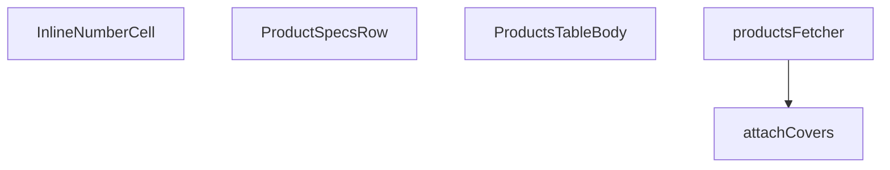

## Genel Bakış
Bu modül, admin panelindeki ürün tablosunun gövde bölümünü ve ilişkili veri gösterim mantığını yöneten React bileşenleri ile Supabase veri çekme yardımcı fonksiyonlarını içerir. Ürünlerin paginasyonlu olarak getirilmesi, kapak görsellerinin eklenmesi, satırlar arası genişletilebilir özellik gösterimi ve satır içi düzenlenebilir hücrelerin sunulması ana sorumluluklarıdır.

## Fonksiyon Grupları
### Veri Getirme ve Zenginleştirme
Bu grup, Supabase istemcisini kullanarak ürün verilerinin asenkron olarak çekilmesini ve kapak görselleriyle zenginleştirilmesini yönetir. Sayfalama parametrelerinin işlenmesi ve sonuç kümesinin formatlanması bu işlevlerde gerçekleştirilir.
- productsFetcher, attachCovers

### Tablo Gövde ve Hücre Bileşenleri
Bu grup, ürünler tablosunun ana gövde bileşenini ve satır içinde kullanılan yardımcı bileşenleri kapsar. Her bir ürün satırının gösterilmesi, satır genişletildiğinde detay özelliklerin sunulması ve düzenlenebilir hücrelerin render edilmesi bu bileşenlerin sorumluluğundadır.
- ProductsTableBody, ProductSpecsRow, InlineNumberCell

---

## AXIOMS – Mimari Varsayımlar

Bu modül, Supabase tabanlı ürün verisi çekme, görsel zenginleştirme ve düzenlenebilir tablo gövdesi bileşenlerini kapsar.

[Aksiyom 1]: Eğer `SupabaseClient<Database>` geçerli bir bağlantı içermiyorsa, `productsFetcher` fonksiyonu veri çekme işlemini başarısızlığa uğratır.

[Aksiyom 2]: Eğer `PRODUCT_SELECT` sabiti tanımlı değilse veya geçerli bir Supabase select sorgusu içermiyorsa, `productsFetcher` beklenen `ProductRow` yapısını döndüremez.

[Aksiyom 3]: Eğer `params: FetchParams` içinde geçerli sayfalama bilgisi (offset/limit veya eşdeğeri) yoksa, `productsFetcher` sonucu tam veya tutarsız ürün listesi döndürür.

[Aksiyom 4]: Eğer `attachCovers` fonksiyonuna verilen `rows: ProductRow[]` boş bir dizi ise, sonuç yine boş bir dizi olarak döner; kapak görseli zenginleştirme işlemi anlamsız olur.

[Aksiyom 5]: Eğer `ProductSpecsRow` bileşenine geçerli bir `productId` sağlanmıyorsa, ilgili satır için özellik detayları gösterilemez veya hatalı veri çekilir.

[Aksiyom 6]: Eğer `InlineNumberCell` bileşenine `onSave` callback'i sağlanmıyorsa, kullanıcı hücrede düzenleme yapamaz veya düzenleme sonucu üst bileşene iletilemez.

[Aksiyom 7]: Eğer `SORT_COLUMN_MAP` sabiti tanımlı değilse veya mevcut sütun adlarını Supabase alanlarıyla eşleştirmiyorsa, tabloda yapılan sıralama isteği yanlış alanlara veya hatalı sorgulara yol açar.

[Aksiyom 8]: Eğer `STATUS_KEYS` ifadesi tanımlı değilse, ürün durum filtreleme ve gösterimi beklenen şekilde çalışmaz.

[Aksiyom 9]: Eğer `ProductRow` tipi (`supabase` sorgu sonucu ile uyumlu değilse, `productsFetcher` dönüş tipi ile `attachCovers` giriş tipi arasında uyumsuzluk oluşur ve tip hatası meydana gelir.

[Aksiyom 10]: Eğer `attachCovers` fonksiyonu asenkron olarak tamamlanmadan `ProductsTableBody` bileşeni render edilirse, kapak görselleri henüz hazır olmadan kullanıcıya gösterilir.

---

## FONKSİYON DETAYLARI

### attachCovers
**Ne yapar**: Verilen ürün satırlarına ait kapak görsellerini (cover image) Supabase veritabanından toplu olarak çeker ve her satırın `cover_path` alanını doldurarak güncellenmiş satır listesini döndürür.

**Nasıl yapar**: Fonksiyon önce tüm satırların ID'lerini çıkarır ve boş bir liste gelirse doğrudan orijinal satırları döndürür. Ardından ID'leri 20'şerli gruplara (chunk) böler ve `Promise.all` kullanarak her chunk için `product_images` tablosuna eş zamanlı sorgular. Her sorguda `sort_order` alanına göre artan sıralama yapılarak en düşük sıraya sahip görsel (yani kapak görseli) elde edilir. Sonuçlar bir eşleme (map) yapısında `product_id -> path` şeklinde saklanır ve her satır `cover_path` alanı eklenmiş olarak spread operatörü ile kopyalanarak döndürülür. Hata oluşursa konsola uyarı yazdırılır ve orijinal satırlar değişiklik yapılmadan döndürülerek hata işleme (non-fatal) sağlanır.

**Parametreler**:
- `supabase`: `SupabaseClient<Database>` — Veritabanı işlemlerini yürütmek için kullanılan Supabase istemci nesnesi; TypeScript泛型 ile `Database` tipi ile tip güvenliği sağlar
- `rows`: `ProductRow[]` — Kapak görseli eklenecek ürün satırlarının dizisi; her elemanın `id` alanı ile veritabanında eşleştirme yapılır

**Dönüş**: `Promise<ProductRow[]>` — Kapak görseli bilgisi (`cover_path` alanı) eklenmiş ürün satırlarının dizisi; hata durumunda orijinal satırlar aynen döndürülür

### productsFetcher
**Ne yapar**: Geliştirildi ancak detay üretilemedi.

### ProductSpecsRow
**Ne yapar**: Geliştirildi ancak detay üretilemedi.

### InlineNumberCell
**Ne yapar**: Geliştirildi ancak detay üretilemedi.

### ProductsTableBody
**Ne yapar**: Geliştirildi ancak detay üretilemedi.

---

## İTHALATLAR (IMPORTS)
- import: ../../components/admin/AdminEmptyState::AdminEmptyState
- import: ../../components/admin/AdminToolbar::AdminToolbar
- import: ../../components/admin/BulkActionToolbar::BulkActionToolbar
- import: ../../components/admin/ExportMenu::ExportMenu
- import: ../../components/admin/data-table/DataTableKit::DataTableKit
- import: ../../components/admin/data-table/types::type { AdminColumn }
- import: ../../components/admin/overlay/ConfirmProvider::useConfirm
- import: ../../components/admin/products/ProductCsvImport::ProductCsvImport
- import: ../../components/admin/products/ProductFormModal::ProductFormModal
- import: ../../components/admin/products/ProductHealthBadge::ProductHealthBadge
- import: ../../hooks/useAdminTable::type FetchParams
- import: ../../hooks/useAdminTable::type FetchResult
- import: ../../hooks/useAdminTable::useAdminTable
- import: ../../hooks/useRole::useRole
- import: ../../i18n/I18nProvider::useI18n
- import: ../../i18n/format::formatCurrency
- import: ../../lib/ensureSessionFresh::ensureSessionFresh
- import: ../../lib/type-converters::toUIProductList
- import: ../../lib/type-converters::type DomainProduct
- import: ../../types/database.types::type { Database }
- import: ../../types/db-rows::type { DbProduct }
- import: @/components/ui/VentImage::VentImage
- import: @/lib/admin/mutateWithAudit::AdminPermissionError
- import: @/lib/admin/mutateWithAudit::mutateWithAudit
- import: @/lib/services/product.service::adminSearchProducts
- import: @/lib/supabase/client::supabaseBrowserClient
- import: @/types/db-rows::type { DbAdminSearchResult }
- import: @supabase/supabase-js::type { SupabaseClient }
- import: lucide-react::PackageSearch
- import: lucide-react::Pencil
- import: lucide-react::Plus
- import: lucide-react::SearchX
- import: react::React
- import: react::useCallback
- import: react::useEffect
- import: react::useMemo
- import: react::useRef
- import: react::useState
- import: sonner::toast

---

## INTERFACES

### CategoryOpt
- `id: string`
- `name: string`

### ProductSpecsRowProps
- `productId: string`

### InlineNumberCellProps
- `value: string`
- `display: React.ReactNode`
- `widthClass: string`
- `low?: boolean`
- `ariaLabel?: string`
- `onSave: (num: number) => Promise<void>`

---

## TYPE ALIASES

### ProductRow
```typescript
type ProductRow = DomainProduct & { cover_path?: string; price?: number | null }
```

---

## SABİTLER
- **PRODUCT_SELECT** (str) — `'id,name,sku,model_code,brand,status,category_id,price,purchase_price,stock_q...`
- **STATUS_KEYS** (as_expression) — `['active', 'inactive', 'out_of_stock'] as const`
- **SORT_COLUMN_MAP** (object) — `{
  name: 'name',
  sku: 'sku',
  status: 'status',
  price: 'price',
  stock...`

---

## AST POINTERS

### [N1_NASIL] AST Pointer: C:\Users\alize\venthub-wt-admin\src\views\admin\ProductsTableBody.tsx::attachCovers
- **params**: (supabase: SupabaseClient<Database>, rows: ProductRow[])
- **ic_degiskenler**:
  - `ids` — rows dizisindeki her elemanın id değerlerini içeren string dizisi
  - `chunkSize` — id'leri parçalara ayırmak için kullanılan sabit boyut (20)
  - `chunks` — ids dizisinin parçalara bölünmüş hali
  - `results` — her chunk için paralel olarak yapılan Supabase sorgularının sonuçları
  - `map` — product_id'yi cover_path'e eşleyen sözlük yapısı
  - `r` — map oluşturma sürecinde her bir sorgu sonucu elemanı
  - `err` — catch bloğunda yakalanan hata nesnesi
- **Dönüş**: Promise<ProductRow[]> — cover_path bilgisi eklenmiş product row dizisi

### [N2_NASIL] AST Pointer: C:\Users\alize\venthub-wt-admin\src\views\admin\ProductsTableBody.tsx::productsFetcher
- **params**: (supabase: SupabaseClient<Database>, params: FetchParams)
- **ic_degiskenler**:
  - `category` — params.filters.category dizisinin ilk elemanı (tek kategori filtresi)
  - `featured` — params.filters.featured'in ilk elemanı '1' ise true olan boolean değer
  - `statuses` — params.filters.status dizisi veya boş dizi
  - `term` — params.query değerinin trimlenmiş hali (arama terimi)
  - `offset` — sayfalama için hesaplanan başlangıç indeksi
  - `results` — adminSearchProducts fonksiyonunun dönüş değeri (FTS araması)
  - `filtered` — durum ve öne çıkan filtreleri uygulanmış sonuçlar
  - `rows` — DbAdminSearchResult[] dizisinin ProductRow[] formatına dönüştürülmüş hali
  - `totalMatched` — toplam eşleşen ürün sayısı
  - `withCovers` — cover image'leri eklenmiş satırlar
  - `query` — Supabase sorgu nesnesi
  - `sortKey` — params.sort?.key sıralama anahtarı
  - `col` — SORT_COLUMN_MAP ile eşleşen sütun adı
  - `ascending` — sıralama yönü (true ise artan)
  - `data` — Supabase sorgusunun data dönüşü
  - `error` — Supabase sorgusunun error dönüşü
  - `count` — Supabase sorgusunun exact count dönüşü
- **Dönüş**: Promise<FetchResult<ProductRow>> — satır listesi ve toplam eşleşme sayısı

### [N3_NASIL] AST Pointer: C:\Users\alize\venthub-wt-admin\src\views\admin\ProductsTableBody.tsx::ProductSpecsRow
- **params**: ({ productId })
- **ic_degiskenler**:
  - `specs` — ürünün teknik özelliklerini tutan state (Record<string, unknown> | null)
  - `setSpecs` — specs state'ini güncellemek için fonksiyon
  - `active` — useEffect cleanup fonksiyonu için bayrak
  - `data` — Supabase sorgusunun dönüşü (teknik özellikler)
  - `entries` — specs objesinin [key, value] çiftlerinden oluşan dizisi
- **Dönüş**: React.FC — ürün teknik özelliklerini gösteren JSX bileşeni

### [N4_NASIL] AST Pointer: C:\Users\alize\venthub-wt-admin\src\views\admin\ProductsTableBody.tsx::InlineNumberCell
- **params**: ({ value, display, widthClass, low, ariaLabel, onSave })
- **ic_degiskenler**:
  - `editing` — hücrenin düzenleme modunda olup olmadığını tutan state
  - `draft` — düzenleme modunda girilen geçici değeri tutan state
  - `inputRef` — input elementine referans
  - `num` — commit fonksiyonu içinde draft değerinin parse edilmiş hali
- **Dönüş**: React.FC — düzenlenebilir sayısal hücre bileşeni

### [N5_NASIL] AST Pointer: C:\Users\alize\venthub-wt-admin\src\views\admin\ProductsTableBody.tsx::ProductsTableBody
- **params**: () (parametre yok)
- **ic_degiskenler**:
  - `t` — useI18n hook'undan alınan çeviri fonksiyonu
  - `cats` — kategoriler listesi (CategoryOpt[])
  - `setCats` — cats state'ini güncellemek için fonksiyon
  - `activeStatuses` — aktif durum filtrelerini tutan dizi
  - `setFilter` — filtre değerlerini güncellemek için fonksiyon
  - `cancelled` — useEffect cleanup fonksiyonu için bayrak
  - `data` — Supabase'den gelen kategori verisi
  - `error` — Supabase sorgusu hatası
  - `editingId` — düzenlenecek ürünün ID'si
  - `setEditingId` — editingId state'ini güncellemek için fonksiyon
  - `isModalOpen` — modal'ın açık olup olmadığını tutan state
  - `setIsModalOpen` — isModalOpen state'ini güncellemek için fonksiyon
  - `table` — useTable hook'undan gelen tablo kontrol nesnesi
  - `hasWriteAccess` — yazma izni olup olmadığını tutan boolean değer
  - `confirm` — ConfirmDialog fonksiyonu (dialog onay bekler)
  - `toast` — sonner toast bildirim fonksiyonu
  - `removeSingle` — tek ürün silme fonksiyonu
  - `handleBulkStatusChange` — toplu durum değiştirme fonksiyonu
  - `handleBulkFeaturedChange` — toplu öne çıkan değiştirme fonksiyonu
  - `handleBulkDelete` — toplu silme fonksiyonu
  - `handleBulkPriceChange` — toplu fiyat değiştirme fonksiyonu
  - `saveInlineEdit` — satır içi düzenleme kaydetme fonksiyonu
  - `statusBadge` — durum rozeti oluşturma fonksiyonu
  - `columns` — tablo sütun tanımları
  - `statusFilter` — durum filtresi seçenekleri
  - `categoryOptions` — kategori seçenekleri
  - `resetFilters` — filtreleri sıfırlama fonksiyonu
  - `exportCSV` — CSV dışa aktarma fonksiyonu
  - `activeStatuses.includes(s)` — durum filtresinde aktif olan durum kontrolü
  - `next` — güncellenmiş durum filtresi dizisi
  - `ok` — onay dialog sonucu
  - `r` — tekil silme, durum değiştirme gibi işlemlerde mevcut ürün satırı
  - `ids` — toplu işlemlerde seçili satırların ID'leri
  - `status` — değiştirilmek istenen durum değeri
  - `featured` — öne çıkan durumu (true/false)
  - `mode` — fiyat değiştirme modu ('percent' veya 'fixed')
  - `value` — fiyat değiştirme değeri
  - `products` — fiyat güncellemesi için çekilen ürün listesi
  - `fetchErr` — fiyat güncellemesi sırasındaki hata
  - `updates` — güncellenecek ürün listesi
  - `currentPrice` — mevcut ürün fiyatı
  - `newPrice` — hesaplanan yeni fiyat
  - `results` — fiyat güncelleme sorgularının sonuçları
  - `errorResult` — hata içeren sonuç
  - `prev` — güncelleme öncesi değer (price veya stock_qty)
  - `payload` — güncelleme için kullanılacak veri nesnesi
  - `field` — güncellenen alan ('price' veya 'stock_qty')
  - `raw` — ham değer (string veya number)
  - `num` — parse edilmiş sayısal değer
  - `v` — durum değerinin küçük harfli hali
  - `baseClass` — durum rozeti için temel CSS sınıfı
  - `s` — durum parametresi (s?: string | null)
  - `a` — CSV dışa aktarma için oluşturulan DOM linki
  - `blob` — CSV dosyası için Blob nesnesi
  - `url` — Blob URL'si
  - `csv` — oluşturulmuş CSV string'i
  - `header` — CSV sütun başlıkları
  - `lines` — CSV satırları
  - `cols` — dışa aktarılacak sütun isimleri
- **Dönüş**: React.FC — ürün tablosu gövdesini ve ilgili kontrolleri gösteren bileşen

---


## MERMAID CALL GRAPH


## NODE ID STANDARD

  file: src\views\admin\ProductsTableBody.tsx
  function: src\views\admin\ProductsTableBody.tsx::attachCovers
  function: src\views\admin\ProductsTableBody.tsx::productsFetcher
  function: src\views\admin\ProductsTableBody.tsx::ProductSpecsRow
  function: src\views\admin\ProductsTableBody.tsx::InlineNumberCell
  function: src\views\admin\ProductsTableBody.tsx::ProductsTableBody

---

## DISA AKTARILANLAR (EXPORTS)
  export: InlineNumberCell
  export: ProductSpecsRow
  export: ProductsTableBody
  export: attachCovers
  export: productsFetcher

---

## STİL TOKENLERİ

### Arbitrary Değerler (token'a geçirilmemiş)
Yok — tüm stiller token'a geçirilmiş. ✅

### Kullanılan Token'lar (zaten token'a geçirilmiş)
- `tracking-hvac-relaxed`

### Tailwind Sınıf Özeti
- **Renkler:** `bg-cyan-400`, `bg-cyan-400/10`, `bg-emerald-500/10`, `bg-rose-500/10`, `bg-slate-500/10`, `bg-surface-deep`, `bg-white/3`, `bg-white/5`, `border-2`, `border-cyan-400/50`, `border-emerald-500/20`, `border-rose-500/20`, `border-white/5`, `group-hover/btn:text-cyan-400`, `group-hover/spec:text-cyan-400/70`
- **Layout:** `flex`, `flex-col`, `flex-wrap`, `gap-0.5`, `gap-2`, `gap-3`, `gap-4`, `grid`, `grid-cols-2`, `h-0.5`, `h-12`, `h-full`, `inline-block`, `items-center`, `items-end`
- **Varyant/Responsive:** `:`, `focus-visible:`, `group-hover/btn:`, `group-hover/spec:`, `group-hover:`, `hover:`, `lg:` önekleri
- **Yardımcı Sınıflar:** `$`, `${adminButtonPrimaryClass`, `${baseClass`, `${low`, `${widthClass`, `:`, `animate-in`, `border`, `duration-300`, `duration-500`, `duration-700`, `fade-in`, `focus-visible:outline-none`, `focus-visible:ring-4`, `focus-visible:ring-cyan-400/10`