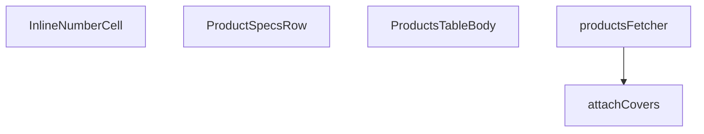

## Genel Bakış
Bu modül, admin panelinde ürünlerin listelendiği bir tablonun gövdesini oluşturur. Ürünlerin veritabanından çekilmesi, satırlara kapak (cover) eklenerek zenginleştirilmesi ve tablo içinde satır içi düzenleme yapılmasını sağlar.

## Fonksiyon Grupları
### Veri Erişim ve İşleme
Ürün verilerini veritabanından çeker ve satırlara kapak ekleyerek zenginleştirir.
- attachCovers, productsFetcher

### Arayüz Bileşenleri
Ürün tablosunun gövdesini ve alt bileşenlerini oluşturur, satır içi düzenleme imkanı sunar.
- ProductSpecsRow, InlineNumberCell, ProductsTableBody

---

## AXIOMS – Mimari Varsayımlar
- Bu modül davranışsal mantık içermez (salt veri / konfigürasyon / tip tanımı).
- [Aksiyom 1]: Modülün dışa açtığı yapı (anahtar kümesi / şema) bir sözleşmedir; tüketiciler bu sabit yapıya bağlıdır — kırıcı değişiklik tüm tüketicileri etkiler.
- [Aksiyom 2]: Bir öğe ekleme/çıkarma yapısal-uyumlu olmalı; ilgili tipler ve seçiciler aynı commit'te güncel tutulmalıdır.

---

## FONKSİYON DETAYLARI

### attachCovers
**Ne yapar**: Verilen ürün satırlarının her birine, `product_images` tablosundan gelen kapak görselinin yolunu (`cover_path`) ekler. Görsel bulunamayan ürünler orijinal haliyle döndürülür.

**Nasıl yapar**: Önce tüm satırların `id` değerlerini toplar. Eğer hiç ürün yoksa orijinal diziyi aynen döndürür. Ürün kimliklerini 20'lik parçalara (chunk) böler ve her parça için `product_images` tablosundan `product_id`, `path` ve `sort_order` alanlarını çeker. Çekilen sonuçlar `sort_order`'a göre artan sırayla sıralanır. Her ürün için yalnızca ilk bulunan görselin yolu alınır (yani `map[r.product_id] == null` kontrolü sayesinde aynı ürüne ait birden fazla görsel varsa en düşük `sort_order`'a sahip olanı seçilir). Son olarak her satıra `cover_path` alanı eklenerek yeni bir dizi oluşturulur. Görsel çekme sırasında hata oluşursa konsola uyarı yazdırılır ve orijinal satırlar `cover_path` eklenmeden döndürülür — hata fırlatılmaz.

**Parametreler**:
- supabase: `SupabaseClient<Database>` — Veritabanı bağlantısını temsil eden Supabase istemcisi.
- rows: `ProductRow[]` — Kapak görseli eklenecek ürün satırları dizisi.

**Dönüş**: `Promise<ProductRow[]>` — Her satıra `cover_path` alanı eklenmiş ürün satırları dizisi. Görsel bulunamayan satırlarda `cover_path` tanımsız olabilir. Hata durumunda orijinal `rows` dizisi aynen döndürülür.

### productsFetcher
**Ne yapar**: Geliştirildi ancak detay üretilemedi.

### ProductSpecsRow
**Ne yapar**: Geliştirildi ancak detay üretilemedi.

### InlineNumberCell
**Ne yapar**: Geliştirildi ancak detay üretilemedi.

### ProductsTableBody
**Ne yapar**: Geliştirildi ancak detay üretilemedi.

---

## İTHALATLAR (IMPORTS)
- import: ../../components/admin/AdminEmptyState::AdminEmptyState
- import: ../../components/admin/AdminToolbar::AdminToolbar
- import: ../../components/admin/ExportMenu::ExportMenu
- import: ../../components/admin/data-table/BulkBar::BulkBar
- import: ../../components/admin/data-table/BulkBar::type BulkAction
- import: ../../components/admin/data-table/BulkPricePanel::BulkPricePanel
- import: ../../components/admin/data-table/DataTableKit::DataTableKit
- import: ../../components/admin/data-table/types::type { AdminColumn }
- import: ../../components/admin/overlay/ConfirmProvider::useConfirm
- import: ../../components/admin/products/ProductCsvImport::ProductCsvImport
- import: ../../components/admin/products/ProductFormModal::ProductFormModal
- import: ../../components/admin/products/ProductHealthBadge::ProductHealthBadge
- import: ../../hooks/useAdminTable::type FetchParams
- import: ../../hooks/useAdminTable::type FetchResult
- import: ../../hooks/useAdminTable::useAdminTable
- import: ../../hooks/useRole::useRole
- import: ../../i18n/I18nProvider::useI18n
- import: ../../i18n/currency::SYSTEM_CURRENCY
- import: ../../i18n/format::formatCurrency
- import: ../../lib/ensureSessionFresh::ensureSessionFresh
- import: ../../lib/type-converters::toUIProductList
- import: ../../lib/type-converters::type DomainProduct
- import: ../../types/database.types::type { Database }
- import: ../../types/db-rows::type { DbProduct }
- import: @/components/ui/VentImage::VentImage
- import: @/lib/admin/mutateWithAudit::AdminPermissionError
- import: @/lib/admin/mutateWithAudit::mutateWithAudit
- import: @/lib/services/product.service::adminSearchProducts
- import: @/lib/supabase/client::supabaseBrowserClient
- import: @/types/db-rows::type { DbAdminSearchResult }
- import: @supabase/supabase-js::type { SupabaseClient }
- import: lucide-react::PackageSearch
- import: lucide-react::Pencil
- import: lucide-react::Plus
- import: lucide-react::SearchX
- import: react::React
- import: react::useCallback
- import: react::useEffect
- import: react::useMemo
- import: react::useRef
- import: react::useState
- import: sonner::toast

---

## INTERFACES

### CategoryOpt
NİÇİN slug + metadata DA ÇEKİLİYOR: CSV içe aktarımı kategoriyi SLUG ile eşler (cetvel: csv-import-export-standard.md §3). Bu sorgu yalnız `id,name` çekerken bileşene slug hiç ULAŞMIYORDU; eşleşme adla denenip sessizce başarısız oluyordu. Kanonik slug İngilizcedir; görünen slug `metadata.slug = { tr
- `id: string`
- `name: string`
- `slug?: string | null`
- `metadata?: unknown`

### ProductSpecsRowProps
- `productId: string`

### InlineNumberCellProps
- `value: string`
- `display: React.ReactNode`
- `widthClass: string`
- `low?: boolean`
- `ariaLabel?: string`
- `onSave: (num: number) => Promise<void>`

---

## TYPE ALIASES

### ProductRow
```typescript
type ProductRow = DomainProduct & { cover_path?: string; price?: number | null }
```

---

## SABİTLER
- **PRODUCT_SELECT** (str) — `'id,name,sku,model_code,brand,status,category_id,price,purchase_price,stock_q...`
- **STATUS_KEYS** (as_expression) — `['active', 'inactive', 'out_of_stock'] as const`
- **SORT_COLUMN_MAP** (object) — `{
  name: 'name',
  sku: 'sku',
  status: 'status',
  price: 'price',
  ...`

---

## AST POINTERS

### [N1_NASIL] AST Pointer: src/views/admin/ProductsTableBody.tsx::attachCovers
- **params**: `supabase` — SupabaseClient<Database> tipinde, veritabanı bağlantısı; `rows` — ProductRow[] tipinde, kapak görseli eklenecek ürün satırları dizisi
- **ic_degiskenler**:
  - `ids` — `rows.map((r) => r.id)` ile satırlardan çıkarılan ürün ID'lerinden oluşan dizi
  - `chunkSize` — 20 değerinde sabit; Supabase `.in()` sorgusunun parçalara bölünme boyutu
  - `chunks` — `string[][]` tipinde; `ids` dizisinin `chunkSize` boyutunda parçalara bölünmüş hali
  - `results` — `Promise.all` ile paralel olarak çalıştırılan Supabase sorgularının (product_images tablosu, product_id, path, sort_order alanları, sort_order'a göre artan sıralama) sonuçlarını tutan dizi
  - `map` — `Record<string, string>` tipinde; her `product_id` için ilk bulunan `path` değerini saklayan sözlük
  - `data` — `results` içindeki her sorgu sonucundan çıkarılan veri; `{ product_id: string; path: string; sort_order: number }[]` tipinde
  - `r` — `data` dizisi içindeki her bir kayıt; `r.product_id` ve `r.path` alanlarına erişilir
- **Dönüş**: `Promise<ProductRow[]>` — her satıra `cover_path` alanı eklenmiş ProductRow dizisi; hata durumunda orijinal `rows` döner

### [N2_NASIL] AST Pointer: src/views/admin/ProductsTableBody.tsx::productsFetcher
- **params**: `supabase` — SupabaseClient<Database> tipinde, veritabanı bağlantısı; `params` — FetchParams tipinde, sayfalama, filtre, sorgu ve sıralama parametreleri
- **ic_degiskenler**:
  - `category` — `params.filters.category?.[0]` ile filtre dizisinin ilk elemanı; kategori ID'si
  - `featured` — `params.filters.featured?.[0] === '1'` ile belirlenen boolean; ürünün öne çıkarılıp çıkarılmadığı
  - `statuses` — `params.filters.status ?? []` ile alınan durum filtresi dizisi
  - `term` — `params.query.trim()` ile boşlukları temizlenmiş arama terimi
  - `offset` — `(params.page - 1) * params.pageSize` ile hesaplanan sayfa başlangıç indeksi
  - `results` — `adminSearchProducts` fonksiyonundan dönen tam metin arama sonuçları (DbAdminSearchResult[])
  - `filtered` — `results` dizisinin `statuses` ve `featured` kriterlerine göre filtrelenmiş hali
  - `rows` — `toUIProductList(filtered)` ile UI formatına dönüştürülmüş ve `as ProductRow` ile tip ataması yapılmış satırlar
  - `totalMatched` — `results[0].total_count` veya `results.length` ile belirlenen toplam eşleşme sayısı; FTS yolunda yaklaşık değer olabilir
  - `withCovers` — `attachCovers(supabase, rows)` ile kapak görselleri eklenmiş satırlar
  - `query` — `supabase.from('products').select(PRODUCT_SELECT, { count: 'exact' })` ile başlatılan Supabase sorgu nesnesi
  - `sortKey` — `params.sort?.key` ile alınan sıralama anahtarı
  - `col` — `sortKey ? SORT_COLUMN_MAP[sortKey] : undefined` ile sıralama sütun adı
  - `ascending` — `params.sort?.dir === 'asc'` ile belirlenen sıralama yönü
  - `data` — `query.range()` sonucundan dönen ürün verileri (DbProduct[])
  - `error` — sorgu hatası; varsa `throw error` ile fırlatılır
  - `count` — `query` sonucundan dönen toplam kayıt sayısı (exact count)
- **Dönüş**: `Promise<FetchResult<ProductRow>>` — `{ rows: withCovers, totalMatched }` nesnesi

### [N3_NASIL] AST Pointer: src/views/admin/ProductsTableBody.tsx::ProductSpecsRow
- **params**: `productId` — ürünün benzersiz kimliği
- **ic_degiskenler**:
  - `t` — `useI18n()` hook'undan çıkarılan çeviri fonksiyonu
  - `specs` — `useState<Record<string, unknown> | null>(null)` ile tanımlanan durum; ürünün teknik özelliklerini tutar
  - `setSpecs` — `specs` durumunu güncelleyen setter fonksiyonu
  - `active` — `useEffect` içinde tanımlanan boolean bayrak; bileşen unmount olduğunda `false` yapılır, erken dönüş kontrolü sağlar
  - `data` — `supabaseBrowserClient.from('products').select('technical_specs').eq('id', productId).maybeSingle()` sorgusundan dönen veri
  - `entries` — `specs ? Object.entries(specs) : []` ile teknik özelliklerin `[key, val]` çiftlerine dönüştürülmüş hali
  - `key` — `entries.map` içindeki her özelliğin anahtar adı
  - `val` — `entries.map` içindeki her özelliğin değeri; `String(val)` ile metne dönüştürülür
- **Dönüş**: JSX.Element — teknik özellikleri grid düzeninde gösteren bileşen; boşsa "empty" mesajı gösterir

### [N4_NASIL] AST Pointer: src/views/admin/ProductsTableBody.tsx::InlineNumberCell
- **params**: `value` — mevcut sayısal değerin string gösterimi; `display` — buton modunda gösterilecek biçimlendirilmiş değer; `widthClass` — input genişlik sınıfı; `low` — boolean; stok düşükse true, buton arka plan rengini değiştirir; `ariaLabel` — erişilebilirlik etiketi; `onSave` — async fonksiyon; sayısal değer kaydedildiğinde çağrılır
- **ic_degiskenler**:
  - `editing` — `useState(false)` ile tanımlanan boolean; düzenleme modunun açık/kapalı durumu
  - `setEditing` — `editing` durumunu güncelleyen setter fonksiyonu
  - `draft` — `useState(value)` ile tanımlanan string; düzenleme sırasında input alanındaki geçici değer
  - `setDraft` — `draft` durumunu güncelleyen setter fonksiyonu
  - `inputRef` — `useRef<HTMLInputElement>(null)` ile tanımlanan referans; input elemanına odaklanmak için kullanılır
  - `num` — `parseFloat(draft)` ile `draft` değerinden dönüştürülen sayısal değer
  - `commit` — `useCallback` ile tanımlanan async fonksiyon; `draft` değerini sayıya çevirir, `onSave` çağrılır, hata durumunda `draft` eski `value` değerine geri alınır
  - `e` — `onKeyDown` olayındaki klavye olayı nesnesi; `e.key` ile 'Enter' ve 'Escape' tuşları kontrol edilir
- **Dönüş**: JSX.Element — düzenleme modunda input alanı, değilse tıklanabilir buton gösterir

### [N5_NASIL] AST Pointer: src/views/admin/ProductsTableBody.tsx::ProductsTableBody
- **params**: (parametre yok)
- **ic_degiskenler**:
  - `t` — `useI18n()` hook'undan çıkarılan çeviri fonksiyonu
  - `supabaseBrowserClient` — import edilen Supabase tarayıcı istemcisi
  - `table` — admin tablo hook'undan çıkarılan tablo nesnesi; `table.selection.selectedIds`, `table.selection.clear()`, `table.reload()`, `table.fetchAllForExport()` metotlarını içerir
  - `hasWriteAccess` — boolean; kullanıcının yazma yetkisi olup olmadığını belirtir
  - `confirm` — onay dialogu fonksiyonu; `description`, `confirmLabel`, `tone` parametreleri alır
  - `cats` — `useState` ile tanımlanan kategori listesi (CategoryOpt[])
  - `setCats` — `cats` durumunu güncelleyen setter fonksiyonu
  - `cancelled` — `useEffect` cleanup bayrağı; bileşen unmount olduğunda `true` yapılır
  - `data` — `supabaseBrowserClient.from('categories').select('id,name,slug,metadata').order('name')` sorgusundan dönen kategori verileri
  - `error` — kategori sorgu hatası
  - `catsMap` — `useMemo` ile oluşturulan `Map<string, string>`; kategori ID'sinden kategori adına eşleme haritası
  - `c` — `cats` dizisindeki her kategori nesnesi; `c.id` ve `c.name` alanlarına erişilir
  - `editingId` — `useState` ile tanımlanan string|null; düzenlenen ürünün ID'si
  - `setEditingId` — `editingId` durumunu güncelleyen setter fonksiyonu
  - `isModalOpen` — `useState` ile tanımlanan boolean; modal açık/kapalı durumu
  - `setIsModalOpen` — `isModalOpen` durumunu güncelleyen setter fonksiyonu
  - `activeStatuses` — aktif durum filtrelerini tutan dizi
  - `setQuery` — sorgu metnini güncelleyen setter fonksiyonu
  - `setFilter` — filtre güncelleyen fonksiyon; `setFilter('status', next)`, `setFilter('category', [])` gibi çağrılarla kullanılır
  - `lang` — mevcut dil kodu
  - `formatCurrency` — para birimi biçimlendirme fonksiyonu
  - `SYSTEM_CURRENCY` — sistem para birimi sabiti
  - `adminTableActionClass` — tablo aksiyon butonlarının CSS sınıfı
  - `adminTableActionDangerClass` — tehlikeli aksiyon butonlarının CSS sınıfı
  - `ProductHealthBadge` — ürün sağlık rozeti bileşeni; `stockQty`, `threshold`, `status`, `isFeatured` props alır
  - `BulkPricePanel` — toplu fiyat düzenleme paneli bileşeni; `onApply`, `onClose` props alır
  - `VentImage` — görsel bileşeni; `src`, `alt`, `fallbackType`, `className` props alır
  - `statusBadge` — `(s?: string | null) => JSX.Element` fonksiyonu; durum string'ine göre renkli rozet döndürür
  - `openEdit` — `(id: string) => void` fonksiyonu; `setEditingId(id)` ve `setIsModalOpen(true)` çağırır
  - `removeSingle` — `async (r: ProductRow) => void` fonksiyonu; onay dialogu gösterir, `mutateWithAudit` ile ürünü siler, `table.reload()` çağırır
  - `r` — `removeSingle` içindeki ProductRow parametresi; `r.id` ile ürün kimliğine erişilir
  - `ok` — `confirm()` dialogundan dönen boolean; kullanıcı onay verdiyse true
  - `e` — catch bloğundaki hata nesnesi; `AdminPermissionError` kontrolü yapılır
  - `bulkStatusChange` — `async (status: string) => void` fonksiyonu; seçili ürünlerin durumunu toplu değiştirir
  - `ids` — `table.selection.selectedIds` ile seçili ürün ID'leri
  - `bulkFeatureToggle` — `async (featured: boolean) => void` fonksiyonu; seçili ürünlerin öne çıkarma durumunu toplu değiştirir
  - `bulkDelete` — `async () => void` fonksiyonu; seçili ürünleri toplu siler
  - `bulkPriceAdjust` — `async (mode: 'percent' | 'fixed', value: number) => void` fonksiyonu; seçili ürünlerin fiyatlarını toplu ayarlar
  - `products` — `bulkPriceAdjust` içinde `supabaseBrowserClient.from('products').select('id,price').in('id', ids)` sorgusundan dönen veri
  - `fetchErr` — fiyat sorgu hatası
  - `updates` — `products` dizisinden hesaplanan yeni fiyat güncellemeleri; `{ id: string; price: number }` nesneleri
  - `p` — `updates.map` içindeki her ürün; `p.id` ve `p.price` alanlarına erişilir
  - `currentPrice` — `p.price ?? 0` ile mevcut fiyat; null ise 0 kabul edilir
  - `newPrice` — `mode` parametresine göre yüzde veya sabit artışla hesaplanan yeni fiyat; `Math.max(0, newPrice)` ile negatif değer engellenir
  - `results` — paralel fiyat güncelleme sorgularının sonuçları
  - `errorResult` — `results.find((r) => r.error)` ile bulunan hatalı sonuç
  - `saveInlineEdit` — `async (r: ProductRow, field: 'price' | 'stock_qty', raw: string | number) => void` fonksiyonu; satır içi düzenleme kaydı yapar
  - `num` — `saveInlineEdit` içinde `parseFloat(String(raw))` ile dönüştürülen sayısal değer
  - `prev` — `field === 'price' ? r.price : r.stock_qty` ile düzenlenen alanın önceki değeri
  - `payload` — `field === 'price' ? { price: num } : { stock_qty: num }` ile güncelleme verisi
  - `s` — `statusBadge` fonksiyonundaki durum parametresi; `toLowerCase()` ile küçük harfe dönüştürülür
  - `v` — `(s || '').toLowerCase()` ile normalize edilmiş durum string'i
  - `baseClass` — rozet bileşeninin temel CSS sınıfı
  - `columns` — `useMemo` ile oluşturulan tablo sütun tanımları dizisi; her sütun `key`, `header`, `sortable`, `hideable`, `align`, `cell` alanlarını içerir
  - `r` — `cell` fonksiyonlarındaki ProductRow parametresi; `r.cover_path`, `r.name`, `r.brand`, `r.sku`, `r.model_code`, `r.category_id`, `r.status`, `r.stock_qty`, `r.low_stock_threshold`, `r.is_featured`, `r.price` alanlarına erişilir
  - `low` — stok sütununda `Number(r.stock_qty) < (r.low_stock_threshold || 10)` ile hesaplanan boolean; stok düşükse true
  - `num` — `InlineNumberCell` onSave callback'indeki sayısal parametre
  - `statusOptions` — `STATUS_KEYS.map` ile oluşturulan durum filtre seçenekleri dizisi
  - `s` — `statusOptions` map'indeki her STATUS_KEYS elemanı
  - `next` — `activeStatuses.includes(s)` durumuna göre hesaplanan sonraki filtre dizisi
  - `categoryOptions` — kategori filtre seçenekleri dizisi; boş seçenek ve `cats.map` ile oluşturulur
  - `c` — `categoryOptions` map'indeki her kategori nesnesi
  - `resetFilters` — tüm filtreleri sıfırlayan fonksiyon; `setQuery('')` ve `setFilter` çağrılarını yapar
  - `exportCsv` — `async () => void` fonksiyonu; ürünleri CSV formatında dışa aktarır
  - `rows` — `exportCsv` içinde `table.fetchAllForExport()` ile alınan tüm satırlar
  - `cols` — CSV sütun adları dizisi: ['id', 'name', 'sku', 'category_id', 'status', 'price', 'stock_qty']
  - `header` — `cols.join(',')` ile oluşturulan CSV başlık satırı
  - `lines` — `rows.map` ile her satırdan oluşturulan CSV satırları
  - `csv` — BOM karakteri ve başlık+satırların birleşimi; `'' + [header, ...lines].join('\n')`
  - `blob` — `new Blob([csv], { type: 'text/csv;charset=utf-8;' })` ile oluşturulan dosya nesnesi
  - `url` — `URL.createObjectURL(blob)` ile oluşturulan geçici URL
  - `a` — `document.createElement('a')` ile oluşturulan indirme bağlantısı elemanı
- **Dönüş**: JSX.Element — ürün tablosunu, araç çubuğunu, filtreleri ve modal'ı içeren ana bileşen

---


## MERMAID CALL GRAPH


## NODE ID STANDARD

  file: ProductsTableBody.tsx
  function: ProductsTableBody.tsx::attachCovers
  function: ProductsTableBody.tsx::productsFetcher
  function: ProductsTableBody.tsx::ProductSpecsRow
  function: ProductsTableBody.tsx::InlineNumberCell
  function: ProductsTableBody.tsx::ProductsTableBody

---

## DISA AKTARILANLAR (EXPORTS)
  export: InlineNumberCell
  export: ProductSpecsRow
  export: ProductsTableBody
  export: attachCovers
  export: productsFetcher

---

## STİL TOKENLERİ

### Arbitrary Değerler (token'a geçirilmemiş)
Yok — tüm stiller token'a geçirilmiş. ✅

### Kullanılan Token'lar (zaten token'a geçirilmiş)
- (yok)

### Tailwind Sınıf Özeti
- **Renkler:** `bg-admin-accent`, `bg-admin-accent-weak`, `bg-admin-bg`, `bg-admin-danger-weak`, `bg-admin-success-weak`, `bg-admin-surface`, `bg-admin-surface-2`, `bg-admin-surface-3`, `border-2`, `border-admin-accent/30`, `border-admin-border`, `border-admin-danger/30`, `border-admin-success/30`, `group-hover/btn:text-admin-accent`, `group-hover/spec:text-admin-accent`
- **Layout:** `flex`, `flex-col`, `flex-wrap`, `gap-0.5`, `gap-2`, `gap-3`, `gap-4`, `grid`, `grid-cols-2`, `h-0.5`, `h-12`, `h-full`, `inline-block`, `items-center`, `items-end`
- **Varyant/Responsive:** `:`, `focus-visible:`, `group-hover/btn:`, `group-hover/spec:`, `group-hover:`, `hover:`, `lg:` önekleri
- **Yardımcı Sınıflar:** `$`, `${adminButtonPrimaryClass`, `${baseClass`, `${low`, `${widthClass`, `:`, `animate-in`, `border`, `duration-300`, `duration-500`, `duration-700`, `fade-in`, `focus-visible:outline-none`, `focus-visible:ring-4`, `focus-visible:ring-admin-accent/30`