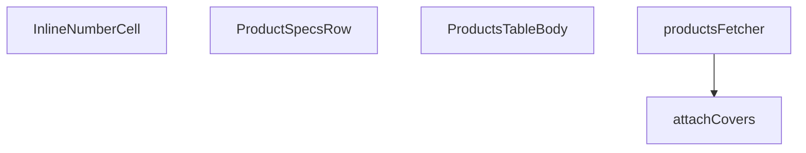

## Genel Bakış

Bu modül, admin panelindeki ürün tablosunun gövde (body) bölümünü yöneten React bileşenlerini ve bu tablonun veri ihtiyacını sağlayan Supabase veri çekme fonksiyonlarını içerir. Ürün listesinin paginasyonlu olarak çekilmesi, kapak görsellerinin eklenmesi ve her satırda satırlar arası genişletilebilir özellik detaylarının gösterilmesi modülün temel sorumlulukları arasındadır.

## Fonksiyon Grupları

### Veri Çekme ve Zenginleştirme

Bu grup, Supabase üzerinden ürün verilerinin çekildiği ve kapak görselleri ile zenginleştirildiği asenkron fonksiyonları kapsar. Sayfalama, filtreleme ve sonuç kümesinin tutarlı bir forma dönüştürülmesi burada gerçekleşir.

- `productsFetcher`, `attachCavers`

### Tablo Gövde ve Hücre Bileşenleri

Ana tablo gövdesini render eden üst düzey React bileşeni ile bu gövde içinde kullanılan yardımcı bileşenleri barındırır. Her bir ürün satırının genişletilmesiyle ortaya çıkan özellik satırları ve satır içi düzenlenebilir sayısal hücreler bu grubun parçalarıdır.

- `ProductsTableBody`, `ProductSpecsRow`, `InlineNumberCell`

---

## AXIOMS – Mimari Varsayımlar

Bu modül için temel mimari varsayımlar, fonksiyon imzaları ve sabitlerin yapısından çıkarılmıştır.

[A

---

## FONKSİYON DETAYLARI

### attachCovers
**Ne yapar**: Verilen ürün satırlarına ait kapak görsellerini (cover image) Supabase veritabanından toplu olarak çeker ve her satırın `cover_path` alanını doldurarak güncellenmiş satır listesini döndürür.

**Nasıl yapar**: Fonksiyon önce tüm satırların ID'lerini çıkarır ve boş bir liste gelirse doğrudan orijinal satırları döndürür. Ardından ID'leri 20'şerli gruplara (chunk) böler ve `Promise.all` kullanarak her chunk için `product_images` tablosuna eş zamanlı sorgular. Her sorguda `sort_order` alanına göre artan sıralama yapılarak en düşük sıraya sahip görsel (yani kapak görseli) elde edilir. Sonuçlar bir eşleme (map) yapısında `product_id -> path` şeklinde saklanır ve her satır `cover_path` alanı eklenmiş olarak spread operatörü ile kopyalanarak döndürülür. Hata oluşursa konsola uyarı yazdırılır ve orijinal satırlar değişiklik yapılmadan döndürülerek hata işleme (non-fatal) sağlanır.

**Parametreler**:
- `supabase`: `SupabaseClient<Database>` — Veritabanı işlemlerini yürütmek için kullanılan Supabase istemci nesnesi; TypeScript泛型 ile `Database` tipi ile tip güvenliği sağlar
- `rows`: `ProductRow[]` — Kapak görseli eklenecek ürün satırlarının dizisi; her elemanın `id` alanı ile veritabanında eşleştirme yapılır

**Dönüş**: `Promise<ProductRow[]>` — Kapak görseli bilgisi (`cover_path` alanı) eklenmiş ürün satırlarının dizisi; hata durumunda orijinal satırlar aynen döndürülür

### productsFetcher
**Ne yapar**: Geliştirildi ancak detay üretilemedi.

### ProductSpecsRow
**Ne yapar**: Geliştirildi ancak detay üretilemedi.

### InlineNumberCell
**Ne yapar**: Geliştirildi ancak detay üretilemedi.

### ProductsTableBody
**Ne yapar**: Geliştirildi ancak detay üretilemedi.

---

## İTHALATLAR (IMPORTS)
- import: ../../components/admin/AdminEmptyState::AdminEmptyState
- import: ../../components/admin/AdminToolbar::AdminToolbar
- import: ../../components/admin/BulkActionToolbar::BulkActionToolbar
- import: ../../components/admin/ExportMenu::ExportMenu
- import: ../../components/admin/data-table/DataTableKit::DataTableKit
- import: ../../components/admin/data-table/types::type { AdminColumn }
- import: ../../components/admin/products/ProductCsvImport::ProductCsvImport
- import: ../../components/admin/products/ProductFormModal::ProductFormModal
- import: ../../components/admin/products/ProductHealthBadge::ProductHealthBadge
- import: ../../hooks/useAdminTable::type FetchParams
- import: ../../hooks/useAdminTable::type FetchResult
- import: ../../hooks/useAdminTable::useAdminTable
- import: ../../hooks/useRole::useRole
- import: ../../i18n/I18nProvider::useI18n
- import: ../../i18n/format::formatCurrency
- import: ../../lib/ensureSessionFresh::ensureSessionFresh
- import: ../../lib/type-converters::toUIProductList
- import: ../../lib/type-converters::type DomainProduct
- import: ../../types/database.types::type { Database }
- import: ../../types/db-rows::type { DbProduct }
- import: @/components/ui/VentImage::VentImage
- import: @/lib/admin/mutateWithAudit::AdminPermissionError
- import: @/lib/admin/mutateWithAudit::mutateWithAudit
- import: @/lib/services/product.service::adminSearchProducts
- import: @/lib/supabase/client::supabaseBrowserClient
- import: @/types/db-rows::type { DbAdminSearchResult }
- import: @supabase/supabase-js::type { SupabaseClient }
- import: lucide-react::PackageSearch
- import: lucide-react::Pencil
- import: lucide-react::Plus
- import: lucide-react::SearchX
- import: react::React
- import: react::useCallback
- import: react::useEffect
- import: react::useMemo
- import: react::useRef
- import: react::useState
- import: sonner::toast

---

## INTERFACES

### CategoryOpt
- `id: string`
- `name: string`

### ProductSpecsRowProps
- `productId: string`

### InlineNumberCellProps
- `value: string`
- `display: React.ReactNode`
- `widthClass: string`
- `low?: boolean`
- `ariaLabel?: string`
- `onSave: (num: number) => Promise<void>`

---

## TYPE ALIASES

### ProductRow
```typescript
type ProductRow = DomainProduct & { cover_path?: string }
```

---

## SABİTLER
- **PRODUCT_SELECT** (str) — `'id,name,sku,model_code,brand,status,category_id,price,purchase_price,stock_q...`
- **STATUS_KEYS** (as_expression) — `['active', 'inactive', 'out_of_stock'] as const`
- **SORT_COLUMN_MAP** (object) — `{
  name: 'name',
  sku: 'sku',
  status: 'status',
  price: 'price',
  stock...`

---

## AST POINTERS

### [N1_NASIL] AST Pointer: `src/views/admin/ProductsTableBody.tsx`::attachCovers
- **params**: `(supabase: SupabaseClient<Database>, rows: ProductRow[])`
- **ic_degiskenler**:
  - `ids` — Her satırın `r.id` değerlerinden oluşan string dizisi; toplu görsel sorgusu için kullanılır
  - `chunkSize` — Sabit `20` değer; `ids` dizisinin parçalanma boyutu
  - `chunks` — `ids` dizisinin `chunkSize` uzunluğunda alt dizilere bölünmüş hali; her chunk ayrı sorgu olarak gönderilir
  - `results` — `Promise.all` ile paralel çalıştırılan `product_images` sorgularının sonuç dizisi; her eleman `{ data }` yapısındadır
  - `map` — `Record<string, string>`; `product_id` → `cover_path` eşlemesi, her ürünün ilk görselini tutar
- **Dönüş**: `Promise<ProductRow[]>` — Orijinal satırlara `cover_path` alanı eklenmiş olarak döner; hata durumunda orijinal satırlar değişiksiz döner

---


## MERMAID CALL GRAPH


## NODE ID STANDARD

  file: src\views\admin\ProductsTableBody.tsx
  function: src\views\admin\ProductsTableBody.tsx::attachCovers
  function: src\views\admin\ProductsTableBody.tsx::productsFetcher
  function: src\views\admin\ProductsTableBody.tsx::ProductSpecsRow
  function: src\views\admin\ProductsTableBody.tsx::InlineNumberCell
  function: src\views\admin\ProductsTableBody.tsx::ProductsTableBody

---

## DISA AKTARILANLAR (EXPORTS)
  export: InlineNumberCell
  export: ProductSpecsRow
  export: ProductsTableBody
  export: attachCovers
  export: productsFetcher

---

## STİL TOKENLERİ

### Arbitrary Değerler (token'a geçirilmemiş)
Yok — tüm stiller token'a geçirilmiş. ✅

### Kullanılan Token'lar (zaten token'a geçirilmiş)
- `tracking-hvac-relaxed`

### Tailwind Sınıf Özeti
- **Renkler:** `bg-cyan-400`, `bg-cyan-400/10`, `bg-emerald-500/10`, `bg-rose-500/10`, `bg-slate-500/10`, `bg-surface-deep`, `bg-white/3`, `bg-white/5`, `border-2`, `border-cyan-400/50`, `border-emerald-500/20`, `border-rose-500/20`, `border-white/5`, `group-hover/btn:text-cyan-400`, `group-hover/spec:text-cyan-400/70`
- **Layout:** `flex`, `flex-col`, `gap-0.5`, `gap-2`, `gap-3`, `gap-4`, `grid`, `grid-cols-2`, `h-0.5`, `h-12`, `h-full`, `inline-block`, `items-center`, `items-end`, `justify-center`
- **Varyant/Responsive:** `:`, `focus-visible:`, `group-hover/btn:`, `group-hover/spec:`, `group-hover:`, `hover:`, `lg:` önekleri
- **Yardımcı Sınıflar:** `$`, `${adminButtonPrimaryClass`, `${baseClass`, `${low`, `${widthClass`, `:`, `animate-in`, `border`, `duration-300`, `duration-500`, `duration-700`, `fade-in`, `focus-visible:outline-none`, `focus-visible:ring-4`, `focus-visible:ring-cyan-400/10`