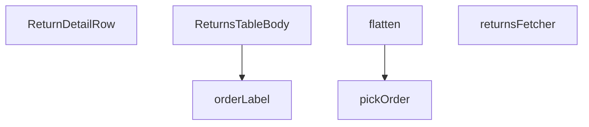

## Genel Bakış
Bu modül, yönetici panelindeki iade (return) işlemlerine ait verilerin çekildiği, dönüştürüldüğü ve son olarak bir React tablosu bileşeni olarak render edildiği merkezi bir görünümdür. Ham veritabanı satırlarını zenginleştirilmiş bir veri modeline çevirir ve kullanıcının iade detaylarını tablo formatında görmesini sağlar.

## Fonksiyon Grupları
### Veri Çekme ve Hazırlık
Bu grup, Supabase veritabanından hammadde niteliğindeki iade kayıtlarını sunucu tarafında çeker ve ilişkili sipariş bilgilerini doğru formata filtreler.
- returnsFetcher, pickOrder

### Veri Dönüşümü ve Biçimlendirme
Ham satır verilerini, bileşenlerin doğrudan kullanabileceği daha düz ve zenginleştirilmiş bir veri modeline dönüştürerek etiketleme işlemlerini yönetir.
- flatten, orderLabel

### Görünüm Bileşeni
İşlenmiş iade verilerini alarak tablonun her bir satırını ve gövdesini render eden React bileşenlerini barındırır.
- ReturnDetailRow, ReturnsTableBody

---

## AXIOMS – Mimari Varsayımlar

Bu modül, yönetici panelindeki iade işlemlerini gösteren bir tablonun gövdesini (body) oluşturmaktan sorumludur. Veri akışı: veritabanı → ham satır → düzleştirilmiş satır → tablo gövdesi şeklindedir.

[Aksiyom 1]: Eğer `returnsFetcher` fonksiyonu başarısız olursa veya boş bir `FetchResult` döndürürse, `ReturnsTableBody` bileşeni veri yok durumunda çalışır (boş tablo gövdesi render edilir).

[Aksiyom 2]: Eğer `pickOrder` fonksiyonuna `null` değer verilirse, `null` döner; `JoinedOrder[]` (dizi) verilirse, dizinin ilk elemanını (`[0]`) seçip `JoinedOrder` olarak döner; boş dizi verilirse `null` döner.

[Aksiyom 3]: Eğer `flatten` fonksiyonuna geçersiz veya eksik alanlara sahip bir `RawReturnRow` verilirse, `ReturnRow` dönüşünde eksik alanlar `undefined` değerlerle dolar (tip dönüşümü garanti edilir, ancak alan varlığı garanti edilmez).

[Aksiyom 4]: Eğer `orderLabel` fonksiyonuna verilen `ReturnRow`'ın ilişkili sipariş bilgisi (order) yoksa veya `pickOrder` tarafından `null` döndürülmüşse, string dönüşünde "bilinmeyen" veya boş string döner (belirli değer bilinmiyor).

[Aksiyom 5]: Eğer `RETURNS_SELECT` sabiti geçersiz bir Supabase `select` sorgusu içerirse, `returnsFetcher` veritabanı sorgusu başarısız olur veya hata fırlatır.

[Aksiyom 6]: Eğer `STATUS_VALUES` ifadesi geçerli bir durum değerleri seti içermiyorsa, iade durumlarına göre filtreleme veya gruplama düzgün çalışmaz veya beklenmeyen sonuçlar üretir.

[Aksiyom 7]: Eğer `ReturnsTableBody` bileşeni `row` prop'u almadan (veya `row` tanımsızken) render edilirse, `ReturnDetailRow` bileşeni hata verir veya boş render eder.

---

## FONKSİYON DETAYLARI

### pickOrder
**Ne yapar**: Supabase sorgularından dönen ilişkili sipariş verisini güvenli bir şekilde tek bir `JoinedOrder` nesnesine indirger. Supabase'in tekil ve çoğul sorgu sonuçları arasındaki belirsizliği ortadan kaldırarak her zaman tutarlı bir dönüş sağlar.

**Nasıl yapar**: Fonksiyon, gelen `joined` parametresinin bir `Array` olup olmadığını `Array.isArray()` ile kontrol eder. Eğer dizi ise ilk elemanı (`joined[0]`) döner; dizi boşsa `null` döner. Dizi değilse doğrudan gelen nesneyi veya `null` değerini geri verir. Bu sayede Supabase'in `'venthub_orders'` gibi ilişkili tabloları bazen tekil obje, bazen dizi olarak döndürmesi sorunsuz şekilde ele alınır.

**Parametreler**:
- `joined`: `JoinedOrder | JoinedOrder[] | null` — Supabase join sorgusundan dönen ilişkili sipariş verisi. Tek bir nesne, nesne dizisi veya `null` olabilir.

**Dönüş**: `JoinedOrder | null` — Düzenlenmiş tek bir sipariş nesnesi veya hiçbir eşleşme yoksa `null`.

### flatten
**Ne yapar**: Geliştirildi ancak detay üretilemedi.

### ReturnDetailRow
**Ne yapar**: Geliştirildi ancak detay üretilemedi.

### returnsFetcher
**Ne yapar**: Geliştirildi ancak detay üretilemedi.

### orderLabel
**Ne yapar**: Geliştirildi ancak detay üretilemedi.

### ReturnsTableBody
**Ne yapar**: Geliştirildi ancak detay üretilemedi.

---

## İTHALATLAR (IMPORTS)
- import: ../../components/admin/AdminEmptyState::AdminEmptyState
- import: ../../components/admin/AdminToolbar::AdminToolbar
- import: ../../components/admin/ExportMenu::ExportMenu
- import: ../../components/admin/data-table/BulkBar::BulkBar
- import: ../../components/admin/data-table/BulkBar::type BulkAction
- import: ../../components/admin/data-table/DataTableKit::DataTableKit
- import: ../../components/admin/data-table/FacetedFilter::FacetedFilter
- import: ../../components/admin/data-table/types::type { AdminColumn, DataTableFacet }
- import: ../../hooks/useAdminTable::type FetchParams
- import: ../../hooks/useAdminTable::type FetchResult
- import: ../../hooks/useAdminTable::useAdminTable
- import: ../../hooks/useRole::useRole
- import: ../../i18n/I18nProvider::useI18n
- import: ../../i18n/datetime::formatDate
- import: ../../i18n/datetime::formatDateTime
- import: ../../i18n/datetime::formatTime
- import: ../../i18n/format::formatCurrency
- import: ../../lib/ensureSessionFresh::ensureSessionFresh
- import: ../../lib/orderStatusService::syncOrderFromReturn
- import: ../../types/database.types::type { Database }
- import: @/lib/admin/mutateWithAudit::AdminPermissionError
- import: @/lib/admin/mutateWithAudit::mutateWithAudit
- import: @/lib/admin/returnStatusMachine::allowedNextStatuses
- import: @/lib/supabase/client::supabaseBrowserClient
- import: @supabase/supabase-js::type { SupabaseClient }
- import: next/navigation::useRouter
- import: react::React
- import: react::useCallback
- import: react::useEffect
- import: react::useMemo
- import: react::useState
- import: sonner::toast

---

## INTERFACES

### ReturnRow
- `id: string`
- `order_id: string`
- `user_id: string`
- `reason: string`
- `description: string | null`
- `status: string`
- `created_at: string`
- `updated_at: string`
- `order_number: string | null`
- `customer_name: string | null`
- `customer_email: string | null`
- `total_amount: number | null`

### JoinedOrder
join satırının ham şekli (Supabase ilişkiyi obje VEYA tek-elemanlı dizi olarak döndürebilir).
- `order_number: string | null`
- `customer_name: string | null`
- `customer_email: string | null`
- `total_amount: number | null`

### RawReturnRow
- `id: string`
- `order_id: string`
- `user_id: string`
- `reason: string`
- `description: string | null`
- `status: string`
- `created_at: string`
- `updated_at: string`
- `venthub_orders: JoinedOrder | JoinedOrder[] | null`

---

## SABİTLER
- **RETURNS_SELECT** (str) — `'id, order_id, user_id, reason, description, status, created_at, updated_at, ...`
- **STATUS_VALUES** (as_expression) — `['requested', 'approved', 'rejected', 'in_transit', 'received', 'refunded', '...`

---

## AST POINTERS

### [N1_NASIL] AST Pointer: `ReturnsTableBody.tsx`::pickOrder
- **params**: `(joined: JoinedOrder | JoinedOrder[] | null)`
- **ic_degiskenler**:
  - Yok — doğrudan parametre ve return ifadeleri kullanılır
- **Dönüş**: `JoinedOrder | null` — joined bir array ise ilk elemanı, değilse doğrudan değeri döner

---

### [N2_NASIL] AST Pointer: `ReturnsTableBody.tsx`::flatten
- **params**: `(row: RawReturnRow)`
- **ic_degiskenler**:
  - `order` — `pickOrder(row.venthub_orders)` çağrısıyla elde edilen tekil JoinedOrder nesnesi; sipariş bilgilerini (numara, müşteri adı, e-posta, tutar) ReturnRow'a taşır
- **Dönüş**: `ReturnRow` — ham satır verisini ve ilişkili sipariş bilgilerini birleştirilmiş düz形式 ReturnRow nesnesine dönüştürür

---

### [N3_NASIL] AST Pointer: `ReturnsTableBody.tsx`::ReturnDetailRow
- **params**: `({ row }: { row: ReturnRow })`
- **ic_degiskenler**:
  - `t` — `useI18n()` hook'undan gelen çeviri fonksiyonu; UI metinlerini uluslararası dilde render eder
  - `lang` — `useI18n()` hook'undan gelen dil kodu; tarih/saat formatlamada kullanılır
- **Dönüş**: `JSX.Element` — iade detay satırının kartlı, grid tabanlı detail view bileşeni; row.id, row.order_id, row.user_id, row.reason, row.description, row.updated_at alanlarını gösterir

---

### [N4_NASIL] AST Pointer: `ReturnsTableBody.tsx`::returnsFetcher
- **params**: `(supabase: SupabaseClient<Database>, params: FetchParams)`
- **ic_degiskenler**:
  - `query` — Supabase tablo sorgusu; `venthub_returns` tablosuna select eklenen, filtre/sıralama/sayfalama zinciri uygulanan zincirsel sorgu nesnesi
  - `statuses` — `params.filters.status ?? []` ile elde edilen filtrelenmek istenen durum dizisi; tek element eq, çoklu element in operatörü ile filtrelenir
  - `term` — `params.query.trim()` ile elde edilen global arama metni; reason, customer_name, customer_email, order_number üzerinde ilike araması yapar
  - `sortKey` — `params.sort?.key` sıralama anahtarı; order_number/customer_name/reason/status/created_at alanlarına göre sıralama yönünü belirler
  - `ascending` — `params.sort?.dir === 'asc'` sıralama yönü; true ise artan, false ise azalan sıralama yapar
  - `offset` — `(params.page - 1) * params.pageSize` sayfalama ofseti; veri aralığının başlangıç indisini hesaplar
  - `data` — Supabase sorgusundan dönen ham satır verisi dizisi (RawReturnRow[])
  - `error` — Supabase sorgu hatası; varsa throw edilir
  - `count` — Supabase tarafından hesaplanan toplam eşleşen satır sayısı; sayfalama toplamı için kullanılır
  - `raw` — `data ?? []` fallback'li ham satır dizisi
  - `rows` — `raw.map(flatten)` ile düzleştirilmiş ReturnRow dizisi
  - `totalMatched` — `count` sayı ise count, değilse `rows.length` fallback değeri; toplam eşleşen satır sayısını tutar
- **Dönüş**: `Promise<FetchResult<ReturnRow>>` — `{ rows, totalMatched }` nesnesi; sayfalı, filtreli, sıralı iade satırlarını ve toplam sayıyı döner

---

### [N5_NASIL] AST Pointer: `ReturnsTableBody.tsx`::orderLabel
- **params**: `(r: ReturnRow)`
- **ic_degiskenler**:
  - Yok — doğrudan parametre alanları kullanılır
- **Dönüş**: `string` — sipariş numarası varsa `#` prefix'li order_number'ın ikinci parçası (split('-')[1]), değilse order_id'nin son 8 karakteri ile oluşturulan etiket

---

### [N6_NASIL] AST Pointer: `ReturnsTableBody.tsx`::ReturnsTableBody (fetchStatusCounts inner async)
- **params**: Yok (arrow function, parametresiz)
- **ic_degiskenler**:
  - `data` — `supabaseBrowserClient.from('venthub_returns').select('status')` çağrısından dönen tüm iade kayıtlarının status alanları dizisi
  - `error` — Supabase sorgu hatası; varsa throw edilir
  - `counts` — `Record<string, number>` türünde durum bazlı sayaç sözlüğü; her status değerinin adedini tutar
- **Dönüş**: `Promise<void>` — yan etki olarak `setStatusCounts(counts)` state günceller

---

### [N7_NASIL] AST Pointer: `ReturnsTableBody.tsx`::ReturnsTableBody (fetchStatusCounts useEffect)
- **params**: Yok
- **ic_degiskenler**: Yok
- **Dönüş**: Yok — `void fetchStatusCounts()` çağrısı ile yan etki olarak durum sayaçlarını yükler

---

### [N8_NASIL] AST Pointer: `ReturnsTableBody.tsx`::ReturnsTableBody (getStatusIcon)
- **params**: `(status: string)`
- **ic_degiskenler**: Yok
- **Dönüş**: `React.ReactNode` — duruma göre icon bileşeni (Clock, CheckCircle, XCircle, Truck, Package, RefreshCw vb.); bilinmeyen durum için RefreshCw döner

---

### [N9_NASIL] AST Pointer: `ReturnsTableBody.tsx`::ReturnsTableBody (getStatusColor)
- **params**: `(status: string)`
- **ic_degiskenler**: Yok
- **Dönüş**: `string` — duruma göre Tailwind CSS class string'i (bg/text/border renk kombinasyonu); bilinmeyen durum için slate tonları döner

---

### [N10_NASIL] AST Pointer: `ReturnsTableBody.tsx`::ReturnsTableBody (handleStatusUpdate async)
- **params**: `(row: ReturnRow, newStatus: string)`
- **ic_degiskenler**:
  - `allowed` — `allowedNextStatuses(row.status)` ile elde edilen izin verilen bir sonraki durumlar dizisi; yeni durum bu dizide yoksa fonksiyon erken return ile çıkar
  - `oldStatus` — `row.status` mevcut durum değeri; audit before kaydı ve müşteri bildirimi için kullanılır
- **Dönüş**: `Promise<void>` — yan etkiler: Supabase status güncelleme, sipariş senkronizasyonu, mock refund, müşteri bildirimi, toast gösterimi, tablo yenileme

---

### [N11_NASIL] AST Pointer: `ReturnsTableBody.tsx`::ReturnsTableBody (handleStatusUpdate inner fn mutation callback)
- **params**: Yok
- **ic_degiskenler**:
  - `newStatus` — outer scope'tan gelen hedef durum; `venthub_returns` tablosunda `row.id` kaydının status alanını günceller
- **Dönüş**: `Promise<void>` — Supabase update, syncOrderFromReturn, refund-order-mock, return-status-notification yan etkilerini çalıştırır

---

### [N12_NASIL] AST Pointer: `ReturnsTableBody.tsx`::ReturnsTableBody (bulkStatusChange async)
- **params**: `(targetStatus: string)`
- **ic_degiskenler**:
  - `selected` — `table.selection.selectedIds` tablo seçiminden gelen seçili satır ID'leri dizisi
  - `targets` — `table.rows` içinden selected'da olan VE `allowedNextStatuses` ile hedef duruma geçişi izin verilen satırların filtrelenmiş dizisi (ReturnRow[])
- **Dönüş**: `Promise<void>` — yan etkiler: window.confirm onayı, mutateWithAudit ile toplu durum güncelleme, toast, seçim temizleme, tablo yenileme

---

### [N13_NASIL] AST Pointer: `ReturnsTableBody.tsx`::ReturnsTableBody (bulkStatusChange inner fn bulk mutation)
- **params**: Yok
- **ic_degiskenler**:
  - `targets` — outer scope'tan gelen hedef satırlar dizisi
  - `targetStatus` — outer scope'tan gelen hedef durum stringi
  - `dbUpdates` — `targets.map(async (row) => ...)` ile her satır için oluşturulan promise dizisi; her satır için Supabase update + sync + mock refund + bildirim çalıştırır
- **Dönüş**: `Promise<void>` — `Promise.all(dbUpdates)` ile tüm satır güncellemelerini paralel çalıştırır

---

### [N14_NASIL] AST Pointer: `ReturnsTableBody.tsx`::ReturnsTableBody (bulk per-row mutation callback)
- **params**: `(row)` — outer scope'taki targets dizisinden bir ReturnRow
- **ic_degiskenler**:
  - `targetStatus` — outer scope'tan gelen hedef durum stringi
- **Dönüş**: `Promise<void>` — tek bir satır için Supabase status update, syncOrderFromReturn, refund-order-mock, return-status-notification yan etkilerini çalıştırır

---

### [N15_NASIL] AST Pointer: `ReturnsTableBody.tsx`::ReturnsTableBody (columns getter)
- **params**: Yok
- **ic_degiskenler**:
  - `t` — outer scope'tan çeviri fonksiyonu
- **Dönüş**: Column nesnesi dizisi — order_number, customer_name, reason, status, created_at, actions olmak üzere 6 sütun tanımı; her biri header, sortable, cell renderer içerir

---

### [N16_NASIL] AST Pointer: `ReturnsTableBody.tsx`::ReturnsTableBody (order_number cell)
- **params**: `(r)` — ReturnRow satırı
- **ic_degiskenler**: Yok
- **Dönüş**: `JSX.Element` — sipariş etiketi butonu ve toplam tutar; order_label butonuna tıklanınca `/admin/orders?q=...` rotasına yönlendirme yapar

---

### [N17_NASIL] AST Pointer: `ReturnsTableBody.tsx`::ReturnsTableBody (customer_name cell)
- **params**: `(r)` — ReturnRow satırı
- **ic_degiskenler**: Yok
- **Dönüş**: `JSX.Element` — müşteri adı ve e-postasını gösteren dikey flex layout

---

### [N18_NASIL] AST Pointer: `ReturnsTableBody.tsx`::ReturnsTableBody (reason cell)
- **params**: `(r)` — ReturnRow satırı
- **ic_degiskenler**: Yok
- **Dönüş**: `JSX.Element` — iade nedeni ve açıklama metnini (truncated, hover title ile) gösteren bileşen

---

### [N19_NASIL] AST Pointer: `ReturnsTableBody.tsx`::ReturnsTableBody (status cell)
- **params**: `(r)` — ReturnRow satırı
- **ic_degiskenler**: Yok
- **Dönüş**: `JSX.Element` — getStatusColor ile renklendirilmiş, getStatusIcon ile ikonlanmış, getStatusLabel ile etiketlenmiş pill/badge bileşeni

---

### [N20_NASIL] AST Pointer: `ReturnsTableBody.tsx`::ReturnsTableBody (created_at cell)
- **params**: `(r)` — ReturnRow satırı
- **ic_degiskenler**: Yok
- **Dönüş**: `JSX.Element` — `formatDate(r.created_at, lang)` ve `formatTime(r.created_at, lang)` ile biçimlendirilmiş tarih ve saat gösterimi

---

### [N21_NASIL] AST Pointer: `ReturnsTableBody.tsx`::ReturnsTableBody (actions cell)
- **params**: `(r)` — ReturnRow satırı
- **ic_degiskenler**:
  - `next` — `allowedNextStatuses(r.status)` ile elde edilen izin verilen sonraki durumlar dizisi; buton olarak render edilir
- **Dönüş**: `JSX.Element` — her izin verilen durum için handleStatusUpdate çağıran butonlar; yükleniyor durumunda spinner gösterir, hasWriteAccess yoksa veya next boşsa dash döner

---

### [N22_NASIL] AST Pointer: `ReturnsTableBody.tsx`::ReturnsTableBody (actions cell button renderer)
- **params**: `(status)` — izin verilen bir sonraki durum stringi
- **ic_degiskenler**: Yok
- **Dönüş**: `JSX.Element` — handleStatusUpdate(r, status) onClick'li buton; updatingStatus === r.id ise spinner, değilse label + ChevronRight

---

### [N23_NASIL] AST Pointer: `ReturnsTableBody.tsx`::ReturnsTableBody (facets getter)
- **params**: Yok
- **ic_degiskenler**:
  - `t` — outer scope'tan çeviri fonksiyonu
  - `statusCounts` — outer scope'tan durum sayaçları sözlüğü
- **Dönüş**: Facet nesnesi dizisi — tek facet: 'status' key'li; STATUS_VALUES dizisi üzerinden value, label, count (statusCounts[value] ?? 0) oluşturur

---

### [N24_NASIL] AST Pointer: `ReturnsTableBody.tsx`::ReturnsTableBody (facets status option mapper)
- **params**: `(value)` — STATUS_VALUES dizisinden bir durum stringi
- **ic_degiskenler**:
  - `statusCounts` — outer scope'tan durum sayaçları sözlüğü
- **Dönüş**: `{ value, label: getStatusLabel(value), count: statusCounts[value] ?? 0 }` — FacetedFilter'a sunulan seçenek nesnesi

---

### [N25_NASIL] AST Pointer: `ReturnsTableBody.tsx`::ReturnsTableBody (handleCsvExport async)
- **params**: Yok
- **ic_degiskenler**:
  - `rows` — `table.fetchAllForExport()` ile yüklenen tüm iade satırları (sayfalama olmadan tam veri)
  - `header` — CSV başlık satırı dizisi; t() ile çevrilmiş sütun adlarını tutar
  - `escape` — `(v: unknown) => '"' + String(v ?? '').replace(/"/g, '""') + '"'` CSV için değer kaçış fonksiyonu
  - `lines` — `rows.map(r => [...].map(escape).join(','))` ile oluşturulmuş CSV satır dizisi
  - `bom` — `''` UTF-8 BOM karakteri; Excel'in doğru encoding'i tanımasını sağlar
  - `csv` — `[header.map(escape).join(','), ...lines].join('\n')` tam CSV stringi
  - `blob` — `new Blob([bom + csv], { type: 'text/csv;charset=utf-8;' })` indirilebilir CSV blob'u
  - `url` — `URL.createObjectURL(blob)` blob URL'i; geçici dosya indirme bağlantısı
  - `a` — `document.createElement('a')` tıklama tetikleyici anchor elementi
- **Dönüş**: `Promise<void>` — yan etki olarak CSV dosyasını tarayıcıda indirir, URL'i revoke eder

---

### [N26_NASIL] AST Pointer: `ReturnsTableBody.tsx`::ReturnsTableBody (handleCsvExport row mapper)
- **params**: `(r)` — ReturnRow satırı
- **ic_degiskenler**:
  - `escape` — outer scope CSV escape fonksiyonu
  - `lang` — outer scope dil kodu
- **Dönüş**: `string` — virgülle ayrılmış, escape'lenmiş tek CSV satırı

---

### [N27_NASIL] AST Pointer: `ReturnsTableBody.tsx`::ReturnsTableBody (handleExcelExport async)
- **params**: Yok
- **ic_degiskenler**:
  - `rows` — `table.fetchAllForExport()` ile yüklenen tüm iade satırları
  - `rowsHtml` — `rows.map(r => ...).join('')` ile oluşturulmuş HTML `<tr>` satırları stringi; her satır orderLabel, customer_name, customer_email, reason, status, created_at, total_amount içerir
  - `htmlTable` — tam HTML tablo stringi; DOCTYPE, meta charset, thead (t() başlıkları), tbody (rowsHtml) içerir
  - `blob` — `new Blob([htmlTable], { type: 'application/vnd.ms-excel' })` XLS formatında indirilebilir blob
  - `url` — `URL.createObjectURL(blob)` blob URL'i
  - `a` — `document.createElement('a')` tıklama tetikleyici anchor elementi
- **Dönüş**: `Promise<void>` — yan etki olarak XLS dosyasını tarayıcıda indirir, URL'i revoke eder

---

### [N28_NASIL] AST Pointer: `ReturnsTableBody.tsx`::ReturnsTableBody (handleExcelExport row mapper)
- **params**: `(r)` — ReturnRow satırı
- **ic_degiskenler**:
  - `amount` — `typeof r.total_amount === 'number' ? formatCurrency(Number(r.total_amount), lang) : ''` para formatlı tutar veya boş string
  - `lang` — outer scope dil kodu
- **Dönüş**: `string` — HTML `<tr>` satır stringi; orderLabel, customer_name, customer_email, reason, status, created_at, amount hücreleri

---

### [N29_NASIL] AST Pointer: `ReturnsTableBody.tsx`::ReturnsTableBody (bulkActions getter)
- **params**: Yok
- **ic_degiskenler**:
  - `t` — outer scope'tan çeviri fonksiyonu
  - `bulkStatus` — outer state; seçilen toplu durum değişikliği hedefini tutar
  - `setBulkStatus` — outer state setter; bulkStatus değerini günceller
  - `bulkStatusChange` — outer scope async fonksiyonu; toplu durum değişikliğini tetikler
  - `getStatusLabel` — outer scope durum etiketleyici fonksiyonu
- **Dönüş**: BulkAction nesnesi dizisi — tek action: 'apply-status' key'li; select ile 6 durum (approved/in_transit/received/refunded/cancelled/rejected) sunar, apply butonu ile bulkStatusChange çağırır

---

### [N30_NASIL] AST Pointer: `ReturnsTableBody.tsx`::ReturnsTableBody (bulkActions panel renderer)
- **params**: `(close)` — paneli kapatacak callback fonksiyonu
- **ic_degiskenler**:
  - `bulkStatus` — outer state; select input'unun değeri
  - `setBulkStatus` — outer state setter
  - `bulkStatusChange` — outer scope async fonksiyonu
- **Dönüş**: `JSX.Element` — glass-strong styled rounded-2xl panel; select (6 seçenek) ve apply butonu içerir

---

### [N31_NASIL] AST Pointer: `ReturnsTableBody.tsx`::ReturnsTableBody (bulkActions option mapper)
- **params**: `(s)` — durum stringi (approved, in_transit, received, refunded, cancelled, rejected)
- **ic_degiskenler**: Yok
- **Dönüş**: `JSX.Element` — `<option>` elementi; value ve label (getStatusLabel(s))

---

### [N32_NASIL] AST Pointer: `ReturnsTableBody.tsx`::ReturnsTableBody (bulkActions confirm handler)
- **params**: Yok
- **ic_degiskenler**:
  - `bulkStatus` — outer state; hedef durum
  - `bulkStatusChange` — outer scope async fonksiyonu
  - `close` — outer scope panel kapatma callback'i
- **Dönüş**: `void` — `void bulkStatusChange(bulkStatus)` ve `close()` çağırarak paneli kapatır ve toplu değişimi başlatır

---

### [N33_NASIL] AST Pointer: `ReturnsTableBody.tsx`::ReturnsTableBody (facet filter renderer)
- **params**: `(facet)` — facet nesnesi (key, label, options)
- **ic_degiskenler**:
  - `table` — outer scope tablo nesnesi; `table.filtering.filters[facet.key]` ile seçili filtreleri okur, `table.filtering.setFilter(facet.key, values)` ile günceller
  - `t` — outer scope çeviri fonksiyonu
- **Dönüş**: `JSX.Element` — `<FacetedFilter>` bileşeni; facet tanımı, seçili değerler, onChange callback, clearLabel ile render edilir

---

## MERMAID CALL GRAPH

## NODE ID STANDARD

  file: src\views\admin\ReturnsTableBody.tsx
  function: src\views\admin\ReturnsTableBody.tsx::pickOrder
  function: src\views\admin\ReturnsTableBody.tsx::flatten
  function: src\views\admin\ReturnsTableBody.tsx::ReturnDetailRow
  function: src\views\admin\ReturnsTableBody.tsx::returnsFetcher
  function: src\views\admin\ReturnsTableBody.tsx::orderLabel
  function: src\views\admin\ReturnsTableBody.tsx::ReturnsTableBody

---

## DISA AKTARILANLAR (EXPORTS)
  export: ReturnDetailRow
  export: ReturnsTableBody
  export: flatten
  export: orderLabel
  export: pickOrder
  export: returnsFetcher

---

## STİL TOKENLERİ

### Arbitrary Değerler (token'a geçirilmemiş)
Yok — tüm stiller token'a geçirilmiş. ✅

### Kullanılan Token'lar (zaten token'a geçirilmiş)
- (yok)

### Tailwind Sınıf Özeti
- **Renkler:** `bg-cyan-400`, `bg-surface-deep`, `bg-surface-deep/40`, `bg-white/10`, `border-b`, `border-current`, `border-t-transparent`, `border-white/5`, `hover:text-cyan-300`, `text-blue-600`, `text-cyan-400`, `text-gray-400`, `text-gray-600`, `text-green-600`, `text-green-700`
- **Layout:** `!h-10`, `!h-7`, `flex`, `flex-col`, `gap-0.5`, `gap-1`, `gap-1.5`, `gap-2`, `gap-3`, `gap-4`, `grid`, `h-0.5`, `h-3`, `h-px`, `inline-block`
- **Varyant/Responsive:** `disabled:`, `hover:`, `md:` önekleri
- **Yardımcı Sınıflar:** `!pl-3`, `!px-3`, `${adminButtonPrimaryClass`, `${adminSelectClass`, `${adminTableActionPrimaryClass`, `${getStatusColor`, `${glassStrongClass`, `align-middle`, `animate-in`, `animate-spin`, `border`, `break-words`, `disabled:opacity-50`, `duration-300`, `fade-in`