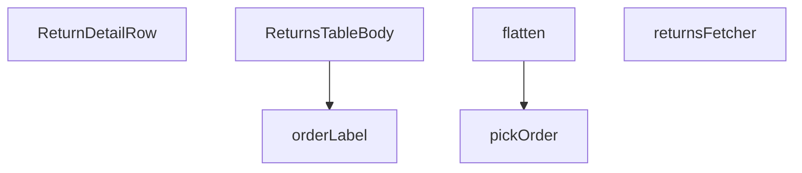

## Genel Bakış
Bu modül, yönetici panelindeki iade (return) işlemlerini gösteren bir tablonun veri çekme, işleme ve sunum katmanlarını yönetir. Ham veritabanı kayıtlarını alır, işlenmiş ve zenginleştirilmiş bir modele dönüştürür ve son olarak React bileşenleri aracılığıyla kullanıcılara sunar.

## Fonksiyon Grupları
### Veri Çekme ve Başlangıç İşlemleri
Bu grup, veritabanından ham iade verilerinin çekilmesini ve ilk filtreleme/düzenleme düzenlemelerini içerir. Supabase istemcisi ile sunucu tarafı veri çekme işlemini yönetir.
- returnsFetcher, pickOrder

### Veri Dönüşümü ve Biçimlendirme
Ham satır verisini, tablo ve bileşenlerin kullanacağı daha düz ve zenginleştirilmiş bir veri modeline dönüştürerek formatlar.
- flatten, orderLabel

### Görünüm Bileşenleri
İşlenmiş veriyi tablo satırları ve detay bileşenleri olarak render eden React bileşenleridir. Verileri alır ve kullanıcıya arayüz olarak sunar.
- ReturnsTableBody, ReturnDetailRow

---

## AXIOMS – Mimari Varsayımlar

Bu modül, veritabanından ham iade verilerini çekip sunuma hazır forma dönüştürerek yönetici paneli tablosunda göstermek üzere tasarlanmıştır.

---

**[Aksiyom 1]:** Eğer `supabase` parametresi geçerli bir SupabaseClient<Database> bağlantısı içermiyorsa, `returnsFetcher` veritabanı iletişim hatası ile karşılaşır.

**[Aksiyom 2]:** Eğer `RETURNS_SELECT` sabiti veritabanı şemasındaki geçerli alan adlarını içermiyorsa, `returnsFetcher` tarafından yapılan sorgu başarısız olur veya eksik veri döner.

**[Aksiyom 3]:** Eğer `STATUS_VALUES` sabiti geçerli durum ifadeleri içermiyorsa, Supabase sorgusundaki filtreleme beklenmeyen sonuçlar üretir.

**[Aksiyom 4]:** Eğer `joined` parametresi `null` ise, `pickOrder`fonksiyonu kesinlikle `null` döner; eğer dizi (`JoinedOrder[]`) ise, fonksiyon diziden bir eleman seçebilmelidir.

**[Aksiyom 5]:** Eğer `RawReturnRow` yapısında düzleştirilmesi beklenen temel alanlar (order ilişkisi, durum, tarih vb.) eksikse, `flatten`fonksiyonu eksik veya hatalı `ReturnRow` üretir.

**[Aksiyom 6]:** Eğer `ReturnRow` nesnesi `orderLabel` tarafından okunacak gerekli alanları içermiyorsa, fonksiyon geçersiz veya boş bir string döner.

**[Aksiyom 7]:** Eğer `FetchParams` geçerli sayfalama veya filtreleme parametreleri içermiyorsa, `returnsFetcher` beklenen formatta `FetchResult<ReturnRow>` dönemez.

**[Aksiyom 8]:** Eğer `ReturnsTableBody` bileşeni çağrılmadan önce iade verileri (`returnsFetcher`) başarıyla çekilmemişse, tablo boş veya hatalı durumda gösterilir.

---

## FONKSİYON DETAYLARI

### pickOrder
**Ne yapar**: Fonksiyon, veritabanından gelen join ile zenginleştirilmiş sipariş verisini (veya veri dizisini) tek bir `JoinedOrder` nesnesine indirger. Supabase'in tekil veya çoğul dizi formatında veri döndürmesi durumunda oluşabilecek belirsizliği çözer.
**Nasıl yapar**: Girdi olarak alınan `joined` parametresinin bir dizi olup olmadığını `Array.isArray` ile kontrol eder. Eğer bir dizi ise, dizinin ilk elemanını (`joined[0]`) döndürür; eleman yoksa `null` döndürür. Eğer girdi zaten bir nesne ise doğrudan onu döndürür.
**Parametreler**:
- joined: `JoinedOrder | JoinedOrder[] | null` — Supabase sorgusundan dönen, ilişkili sipariş verisini içeren nesne veya nesne dizisi.
**Dönüş**: `JoinedOrder | null` — Tek bir `JoinedOrder` nesnesini veya hiç veri yoksa `null` değerini döndürür.

### flatten
**Ne yapar**: Ham bir iade satırı (`RawReturnRow`) ile ilgili tüm ilişkili sipariş bilgilerini (sipariş numarası, müşteri adı, e-postası, toplam tutar gibi) tek bir düzleştirilmiş `ReturnRow` nesnesine dönüştürür.
**Nasıl yapar**: `pickOrder` fonksiyonunu kullanarak `row.venthub_orders` alanındaki ilişkili sipariş verisini tek bir nesneye indirir. Ardından, orijinal iade satırının (`row`) alanlarını ve indirgenmiş sipariş nesnesinin (`order`) alanlarını birleştirerek yeni, düz bir `ReturnRow` nesnesi oluşturur. Sipariş verisi mevcut değilse (`order` `null` ise), ilgili alanlar için `null` değeri kullanılır.
**Parametreler**:
- row: `RawReturnRow` — Veritabanından ham olarak çekilmiş, ilişkili sipariş verisi (`venthub_orders`) içeren iade satırı nesnesi.
**Dönüş**: `ReturnRow` — Düzleştirilmiş ve API bileşenleri tarafından doğrudan kullanılabilecek forma getirilmiş iade satırı nesnesi.

### ReturnDetailRow
**Ne yapar**: Bu bir React bileşenidir. Verilen `ReturnRow` verisini kullanarak bir iade talebinin detaylı satır görünümünü (bir tablo satırı) tarayıcıda render eder.
**Nasıl yapar**: Fonksiyonel bir React bileşenidir. `row` prop'u olarak gelen `ReturnRow` verisini alır ve bu veriyi ekranda göstermek için JSX döndürür. Görünümü oluşturmak için `orderLabel` yardımcı fonksiyonunu kullanarak sipariş etiketini oluşturabilir.
**Parametreler**:
- row: `ReturnRow` — Görüntülenecek iade talebine ait veriyi içeren nesne.
**Dönüş**: `React.FC<{ row: ReturnRow }>` — `row` prop'unu alan ve JSX (React elementi) döndüren bir React fonksiyonel bileşenidir.

### returnsFetcher
**Ne yapar**: Asenkron olarak veritabanından filtrelenmiş, sıralanmış ve sayfalara bölünmüş iade kayıtlarını (`ReturnRow`) getirir. Supabase istemcisini kullanarak complex bir sorgu oluşturur ve sonucu standart bir `FetchResult` formatında döndürür.
**Nasıl yapar**: 1) `ensureSessionFresh` çağrısı ile Supabase oturumunu yeniler. 2) `venthub_returns` tablosu üzerinden temel bir sorgu başlatır. 3) `params.filters.status` dizisine göre durum filtresi ekler. 4) `params.query` arama terimini, iade sebebi ve ilişkili siparişin müşteri adı/e-postası/sipariş numarası alanlarında `ILIKE` ile arar. 5) `params.sort` parametresine göre sıralama ekler (ilişkili tablo alanları için `foreignTable` seçeneğini kullanır). 6) `params.page` ve `params.pageSize` kullanarak `range` ile sayfalama yapar. 7) Ham `RawReturnRow` verisini `flatten` fonksiyonunu kullanarak `ReturnRow` dizisine dönüştürür.
**Parametreler**:
- supabase: `SupabaseClient<Database>` — Veritabanı erişimi için Supabase istemcisi.
- params: `FetchParams` — `page`, `pageSize`, `query`, `sort` ve `filters` alanlarını içeren istek parametreleri nesnesi.
**Dönüş**: `Promise<FetchResult<ReturnRow>>` — `{ rows: ReturnRow[], totalMatched: number }` yapısında bir promise döndürür. `rows`, sayfalı veriyi; `totalMatched`, filtreyle eşleşen toplam kayıt sayısını (tüm sayfalardaki) temsil eder.

### orderLabel
**Ne yapar**: Bir `ReturnRow` nesnesi için gösterilecek okunabilir ve kısa bir sipariş etiketi (ör. "#1234") oluşturur.
**Nasıl yapar**: Öncelikle `r.order_number` alanının varlığını ve içeriğini kontrol eder. Eğer sipariş numarası mevcutsa, onu tire (`-`) karakterinden bölerek ikinci parçasını (`split('-')[1]`) kullanır; bu parça yoksa tüm numarayı kullanarak `#` ekler. Sipariş numarası yoksa (`null`), `r.order_id` alanının son 8 karakterini büyük harflere çevirerek `#` ekler.
**Parametreler**:
- r: `ReturnRow` — Etiketi oluşturulacak iade kaydı nesnesi.
**Dönüş**: `string` — Oluşturulan sipariş etiketini içeren metin.

### ReturnsTableBody
**Ne yapar**: Geliştirildi ancak detay üretilemedi.

---

## İTHALATLAR (IMPORTS)
- import: ../../components/admin/AdminEmptyState::AdminEmptyState
- import: ../../components/admin/AdminToolbar::AdminToolbar
- import: ../../components/admin/ExportMenu::ExportMenu
- import: ../../components/admin/data-table/BulkBar::BulkBar
- import: ../../components/admin/data-table/BulkBar::type BulkAction
- import: ../../components/admin/data-table/DataTableKit::DataTableKit
- import: ../../components/admin/data-table/FacetedFilter::FacetedFilter
- import: ../../components/admin/data-table/types::type { AdminColumn, DataTableFacet }
- import: ../../hooks/useAdminTable::type FetchParams
- import: ../../hooks/useAdminTable::type FetchResult
- import: ../../hooks/useAdminTable::useAdminTable
- import: ../../hooks/useRole::useRole
- import: ../../i18n/I18nProvider::useI18n
- import: ../../i18n/datetime::formatDate
- import: ../../i18n/datetime::formatDateTime
- import: ../../i18n/datetime::formatTime
- import: ../../i18n/format::formatCurrency
- import: ../../lib/ensureSessionFresh::ensureSessionFresh
- import: ../../lib/orderStatusService::syncOrderFromReturn
- import: ../../types/database.types::type { Database }
- import: @/lib/admin/mutateWithAudit::AdminPermissionError
- import: @/lib/admin/mutateWithAudit::mutateWithAudit
- import: @/lib/admin/returnStatusMachine::allowedNextStatuses
- import: @/lib/supabase/client::supabaseBrowserClient
- import: @supabase/supabase-js::type { SupabaseClient }
- import: next/navigation::useRouter
- import: react::React
- import: react::useCallback
- import: react::useEffect
- import: react::useMemo
- import: react::useState
- import: sonner::toast

---

## INTERFACES

### ReturnRow
- `id: string`
- `order_id: string`
- `user_id: string`
- `reason: string`
- `description: string | null`
- `status: string`
- `created_at: string`
- `updated_at: string`
- `order_number: string | null`
- `customer_name: string | null`
- `customer_email: string | null`
- `total_amount: number | null`

### JoinedOrder
join satırının ham şekli (Supabase ilişkiyi obje VEYA tek-elemanlı dizi olarak döndürebilir).
- `order_number: string | null`
- `customer_name: string | null`
- `customer_email: string | null`
- `total_amount: number | null`

### RawReturnRow
- `id: string`
- `order_id: string`
- `user_id: string`
- `reason: string`
- `description: string | null`
- `status: string`
- `created_at: string`
- `updated_at: string`
- `venthub_orders: JoinedOrder | JoinedOrder[] | null`

---

## SABİTLER
- **RETURNS_SELECT** (str) — `'id, order_id, user_id, reason, description, status, created_at, updated_at, ...`
- **STATUS_VALUES** (as_expression) — `['requested', 'approved', 'rejected', 'in_transit', 'received', 'refunded', '...`

---

## AST POINTERS

### [N1_NASIL] AST Pointer: src/views/admin/ReturnsTableBody.tsx::pickOrder
- **params**: `joined: JoinedOrder | JoinedOrder[] | null` — joinlenmiş sipariş verisi; tek nesne veya dizi olabilir
- **ic_degiskenler**:
  - `Array.isArray(joined)` — parametrenin dizi olup olmadığını kontrol eder
  - `joined[0]` — dizinin ilk elemanı, dizi ise ilk siparişi alır
- **Dönüş**: `JoinedOrder | null` — diziyse ilk elemanı, değilse aynen döner; null ise null döner

---

### [N2_NASIL] AST Pointer: src/views/admin/ReturnsTableBody.tsx::flatten
- **params**: `row: RawReturnRow` — ham Supabase satır verisi, venturehub_orders join'i içerir
- **ic_degiskenler**:
  - `order` — `pickOrder(row.venthub_orders)` çağrısının sonucu; ilgili sipariş nesnesi veya null
  - `row.id` — iade kaydının benzersiz kimliği
  - `row.order_id` — ilişkili siparişin kimliği
  - `row.user_id` — iadeyi başlatan kullanıcının kimliği
  - `row.reason` — iade nedeni (short code veya etiket)
  - `row.description` — iade açıklaması (serbest metin)
  - `row.status` — iade durumu (requested, approved vb.)
  - `row.created_at` — iade talebinin oluşturulma zamanı
  - `row.updated_at` — iade kaydının son güncellenme zamanı
  - `order?.order_number` — sipariş numarası, sipariş yoksa null
  - `order?.customer_name` — müşteri adı, sipariş yoksa null
  - `order?.customer_email` — müşteri e-postası, sipariş yoksa null
  - `order?.total_amount` — sipariş toplam tutarı, sipariş yoksa null
- **Dönüş**: `ReturnRow` — düzleştirilmiş iade satırı nesnesi

---

### [N3_NASIL] AST Pointer: src/views/admin/ReturnsTableBody.tsx::ReturnDetailRow
- **params**: `{ row: ReturnRow }` — detayı gösterilecek iade satırı
- **ic_degiskenler**:
  - `t` — `useI18n()` hook'undan gelen çeviri fonksiyonu
  - `lang` — `useI18n()` hook'undan gelen dil kodu
  - `row.id` — iade kaydının kimliği, ekranda gösterilir
  - `row.order_id` — ilişkili siparişin kimliği, ekranda gösterilir
  - `row.user_id` — kullanıcının kimliği, ekranda gösterilir
  - `row.reason` — iade nedeni, ekranda gösterilir
  - `row.description` — iade açıklaması, boşsa tire gösterilir
  - `row.updated_at` — son güncellenme zamanı, `formatDateTime(row.updated_at, lang)` ile formatlanır
- **Dönüş**: `React.ReactNode` — iade detay JSX'i (başlık, kartlarda id/sipariş/kullanıcı bilgileri, neden/açıklama/tarih)

---

### [N4_NASIL] AST Pointer: src/views/admin/ReturnsTableBody.tsx::returnsFetcher
- **params**: `supabase: SupabaseClient<Database>, params: FetchParams` — Supabase istemcisi ve filtreleme/sayfalama parametreleri
- **ic_degiskenler**:
  - `query` — Supabase sorgu nesnesi, zincirleme method'larla filtre/sıralama/sayfalama eklenir
  - `statuses` — `params.filters.status ?? []` — filtrelenmesi istenen durumlar dizisi
  - `term` — `params.query.trim()` — global arama terimi, boşlukları temizlenmiş
  - `sortKey` — `params.sort?.key` — sıralama anahtarı (order_number, customer_name, reason, status, created_at)
  - `ascending` — `params.sort?.dir === 'asc'` — sıralama yönü
  - `offset` — `(params.page - 1) * params.pageSize` — sayfalama başlangıç ofseti
  - `data` — Supabase'den dönen ham satırlar dizisi
  - `error` — Supabase hata nesnesi
  - `count` — toplam eşleşen satır sayısı (exact count)
  - `raw` — `RawReturnRow[]` tipinde ham veri, data ?? []
  - `rows` — `raw.map(flatten)` ile dönüştürülmüş `ReturnRow[]` dizisi
  - `totalMatched` — count sayıysa onu, değilse rows.length kullanılır
- **Dönüş**: `Promise<FetchResult<ReturnRow>>` — `{ rows, totalMatched }` nesnesi

---

### [N5_NASIL] AST Pointer: src/views/admin/ReturnsTableBody.tsx::orderLabel
- **params**: `r: ReturnRow` — iade satırı
- **ic_degiskenler**:
  - `r.order_number` — sipariş numarası varsa kullanılır; `split('-')[1]` ile numaranın ikinci parçası alınır, yoksa tüm numara kullanılır
  - `r.order_id` — sipariş numarası yoksa son 8 karakteri `toUpperCase()` ile büyük harfe çevrilir
- **Dönüş**: `string` — `#` prefix'li sipariş etiketi (örn: `#1234` veya `#ABCD1234`)

---

### [N6_NASIL] AST Pointer: src/views/admin/ReturnsTableBody.tsx::ReturnsTableBody (fetchStatusCounts)
- **params**: yok (匿名 async fonksiyon)
- **ic_degiskenler**:
  - `data` — `supabaseBrowserClient.from('venthub_returns').select('status')` sonucu; tüm iade satırlarının status alanı
  - `error` — Supabase sorgu hatası
  - `counts` — `Record<string, number>` — her durumun sayacı, `{ status: count }` yapısında
  - `row` — `data || []` dizisi üzerindeki her bir iade satırı (sadece status alanı)
- **Dönüş**: yok — `setStatusCounts(counts)` ile state'i günceller; hata olursa `console.warn` ile logsizar

---

### [N7_NASIL] AST Pointer: src/views/admin/ReturnsTableBody.tsx::ReturnsTableBody (getStatusIcon)
- **params**: `status: string` — iade durumu stringi
- **ic_degiskenler**: yok (switch/if-else ile doğrudan JSX döner)
- **Dönüş**: `React.ReactNode` — duruma göre ikon bileşeni (Clock, CheckCircle, XCircle, Truck, Package, RefreshCw)

---

### [N8_NASIL] AST Pointer: src/views/admin/ReturnsTableBody.tsx::ReturnsTableBody (getStatusColor)
- **params**: `status: string` — iade durumu stringi
- **ic_degiskenler**: yok (switch/if-else ile doğrudan string döner)
- **Dönüş**: `string` — Tailwind CSS sınıf zinciri (bg/text/border renkleri duruma göre)

---

### [N9_NASIL] AST Pointer: src/views/admin/ReturnsTableBody.tsx::ReturnsTableBody (handleStatusUpdate)
- **params**: `row: ReturnRow, newStatus: string` — güncellenecek iade satırı ve hedef durum
- **ic_degiskenler**:
  - `hasWriteAccess` — yazma izni boolean'ı, false ise toast error ile çıkılır
  - `allowed` — `allowedNextStatuses(row.status)` ile hesaplanan izin verilen geçişler; newStatus bunun içinde değilse çıkılır
  - `oldStatus` — `row.status` — güncelleme öncesi mevcut durum
  - `row.id` — iade kaydının primary key'i
  - `row.order_id` — ilişkili siparişin kimliği, sync ve mock refund için kullanılır
  - `row.order_number` — sipariş numarası, bildirim için kullanılır
  - `row.customer_email` — müşteri e-postası, bildirim için kullanılır
  - `row.customer_name` — müşteri adı, bildirim için kullanılır
  - `row.reason` — iade nedeni, bildirim için kullanılır
  - `row.description` — iade açıklaması, bildirim için kullanılır
  - `newStatus` — hedef durum
  - `updatingStatus` — `setUpdatingStatus(row.id)` ile loading state yönetimi
  - `supabaseBrowserClient` — Supabase istemcisi (global import)
- **Dönüş**: `Promise<void>` — yan etkiler: toast mesajları, DB güncelleme, orders sync, mock refund, müşteri bildirimi

---

### [N10_NASIL] AST Pointer: src/views/admin/ReturnsTableBody.tsx::ReturnsTableBody (handleStatusUpdate::fn inner)
- **params**: yok (匿名 async fonksiyon, `mutateWithAudit` callback'i)
- **ic_degiskenler**:
  - `error` — `supabaseBrowserClient.from('venthub_returns').update(...)` sonucu hata
  - `row.id` — iade primary key, `.eq('id', row.id)` filtresi için
  - `row.order_id` — sipariş kimliği, `syncOrderFromReturn` çağrısı için
  - `row.id` — `return:${row.id}` formatında reason için
  - `row.order_number` — sipariş numarası, bildirim body'si için
  - `row.customer_email` — müşteri e-postası, bildirim body'si için
  - `row.customer_name` — müşteri adı, bildirim body'si için
  - `oldStatus` — eski durum, bildirim body'si için
  - `newStatus` — yeni durum, bildirim ve DB update için
  - `row.reason` — iade nedeni, bildirim body'si için
  - `row.description` — iade açıklaması, bildirim body'si için
- **Dönüş**: `Promise<void>` — yan etkiler: DB status güncelleme, orders sync, mock refund (refunded ise), müşteri bildirimi

---

### [N11_NASIL] AST Pointer: src/views/admin/ReturnsTableBody.tsx::ReturnsTableBody (bulkStatusChange)
- **params**: `targetStatus: string` — toplu olarak uygulanacak hedef durum
- **ic_degiskenler**:
  - `hasWriteAccess` — yazma izni boolean'ı
  - `selected` — `table.selection.selectedIds` — seçili satırların id'leri
  - `targets` — `table.rows.filter(...)` ile filtrelenmiş; seçili AND izin verilen geçişlere sahip satırlar
  - `targetStatus` — hedef durum
  - `row.id` — her hedef satırın primary key'i
  - `row.order_id` — sipariş kimliği, sync ve mock refund için
  - `row.order_number` — sipariş numarası, bildirim body'si için
  - `row.customer_email` — müşteri e-postası, bildirim body'si için
  - `row.customer_name` — müşteri adı, bildirim body'si için
  - `row.status` — her satırın eski durumu, bildirim body'si için (old_status)
  - `row.reason` — iade nedeni, bildirim body'si için
  - `row.description` — iade açıklaması, bildirim body'si için
  - `dbUpdates` — `targets.map(async (row) => {...})` — her satır için DB güncelleme promise dizisi
  - `targets.length` — geçerli hedef sayısı, toast ve confirm mesajları için
- **Dönüş**: `Promise<void>` — yan etkiler: toplu DB güncelleme, orders sync, mock refund, müşteri bildirimi, toast, selection temizleme, tablo reload

---

### [N12_NASIL] AST Pointer: src/views/admin/ReturnsTableBody.tsx::ReturnsTableBody (bulkStatusChange::fn inner)
- **params**: yok (匿名 async fonksiyon, `mutateWithAudit` callback'i)
- **ic_degiskenler**:
  - `dbUpdates` — `targets.map(async (row) => {...})` — her satır için DB güncelleme promise dizisi
  - `row.id` — her satırın primary key'i
  - `row.order_id` — sipariş kimliği, sync ve mock refund için
  - `row.order_number` — sipariş numarası, bildirim body'si için
  - `row.customer_email` — müşteri e-postası, bildirim body'si için
  - `row.customer_name` — müşteri adı, bildirim body'si için
  - `row.status` — satırın mevcut durumu (old_status)
  - `targetStatus` — hedef durum (new_status)
  - `row.reason` — iade nedeni, bildirim body'si için
  - `row.description` — iade açıklaması, bildirim body'si için
  - `error` — her satırın DB update hatası
- **Dönüş**: `Promise<void>` — `Promise.all(dbUpdates)` ile tüm güncellemeler tamamlanır

---

### [N13_NASIL] AST Pointer: src/views/admin/ReturnsTableBody.tsx::ReturnsTableBody (columns definition)
- **params**: yok (匿名 fonksiyon, columns array'i döner)
- **ic_degiskenler**:
  - `t` — çeviri fonksiyonu
  - `r` — her hücre renderer'ında parametre olarak gelen `ReturnRow` nesnesi
  - `lang` — dil kodu, `formatDate`, `formatTime`, `formatCurrency` çağrılırken kullanılır
  - `hasWriteAccess` — yazma izni, actions sütununda kontrol edilir
  - `updatingStatus` — şu an güncellenen satırın id'si, spinner göstermek için
  - `next` — `allowedNextStatuses(r.status)` ile hesaplanan sonraki izin verilen durumlar
  - `orderLabel(r)` — sipariş etiketi
  - `r.customer_name` — müşteri adı
  - `r.customer_email` — müşteri e-postası
  - `r.reason` — iade nedeni
  - `r.description` — iade açıklaması
  - `r.total_amount` — toplam tutar, number ise `formatCurrency(Number(r.total_amount), lang)` ile formatlanır
  - `r.created_at` — oluşturulma zamanı, `formatDate` ve `formatTime` ile formatlanır
  - `r.status` — durum, `getStatusColor` ve `getStatusIcon` ile render edilir
  - `r.order_id` — sipariş numarası yoksa link inşasında fallback olarak kullanılır
  - `EMPTY_DASH` — yazma izni yoksa gösterilen tire karakteri
  - `adminTableActionPrimaryClass` — buton için CSS sınıfı
- **Dönüş**: `Array<{ key, header, sortable?, hideable?, cell }>` — tablo sütun tanımı dizisi (order_number, customer_name, reason, status, created_at, actions)

---

### [N14_NASIL] AST Pointer: src/views/admin/ReturnsTableBody.tsx::ReturnsTableBody (filters definition)
- **params**: yok (匿名 fonksiyon, facet array'i döner)
- **ic_degiskenler**:
  - `t` — çeviri fonksiyonu
  - `STATUS_VALUES` — sabit durum değerleri dizisi (import edilmiş)
  - `statusCounts` — `Record<string, number>` — her durumun sayaç değeri
  - `getStatusLabel` — durum kodunu insan-okunabilir etikete çeviren fonksiyon
  - `value` — STATUS_VALUES dizisindeki her bir durum değeri
- **Dönüş**: `Array<{ key, label, options }>` — faceted filter tanımları; tek facet: status

---

### [N15_NASIL] AST Pointer: src/views/admin/ReturnsTableBody.tsx::ReturnsTableBody (exportCSV)
- **params**: yok (匿名 async fonksiyon)
- **ic_degiskenler**:
  - `rows` — `table.fetchAllForExport()` ile çekilen tüm iade satırları
  - `header` — CSV başlık satırı dizisi (order, customer, email, reason, status, date, amount)
  - `escape` — `""` ile csv injection koruması yapan fonksiyon; `String(v ?? '')` ile null safe
  - `lines` — her satırın CSV satırına dönüştürülmüş hali
  - `r` — `rows.map((r) => ...)` içindeki her iade satırı
  - `orderLabel(r)` — sipariş etiketi
  - `r.customer_name` — müşteri adı, null ise boş string
  - `r.customer_email` — müşteri e-postası, null ise boş string
  - `r.reason` — iade nedeni, null ise boş string
  - `r.status` — durum, `getStatusLabel` ile etiketlenir
  - `r.created_at` — tarih, `formatDateTime(r.created_at, lang)` ile formatlanır
  - `r.total_amount` — number ise `formatCurrency`, değilse boş string
  - `lang` — dil kodu
  - `bom` — UTF-8 BOM karakteri `''`
  - `csv` — birleştirilmiş CSV metni
  - `blob` — `Blob` nesnesi, `text/csv;charset=utf-8;` MIME tipi
  - `url` — `URL.createObjectURL(blob)` ile oluşturulan geçici URL
  - `a` — `document.createElement('a')` ile oluşturulan görünmez link
- **Dönüş**: `Promise<void>` — tarayıcıda CSV dosya indirimi tetikler, sonra URL revokes edilir

---

### [N16_NASIL] AST Pointer: src/views/admin/ReturnsTableBody.tsx::ReturnsTableBody (exportExcel)
- **params**: yok (匿名 async fonksiyon)
- **ic_degiskenler**:
  - `rows` — `table.fetchAllForExport()` ile çekilen tüm iade satırları
  - `rowsHtml` — her satırın HTML `<tr>` satırına dönüştürülmüş hali
  - `r` — `rows.map((r) => {...})` içindeki her iade satırı
  - `amount` — `typeof r.total_amount === 'number' ? formatCurrency(Number(r.total_amount), lang) : ''` — tutar formatlanmış hali
  - `orderLabel(r)` — sipariş etiketi
  - `r.customer_name` — müşteri adı, null ise boş string
  - `r.customer_email` — müşteri e-postası, null ise boş string
  - `r.reason` — iade nedeni, null ise boş string
  - `r.status` — durum, `getStatusLabel` ile etiketlenir
  - `r.created_at` — tarih, `formatDateTime(r.created_at, lang)` ile formatlanır
  - `lang` — dil kodu
  - `htmlTable` — tam HTML doküman stringi (doctype, head, body, tablo yapısı)
  - `t` — çeviri fonksiyonu, başlıklar için kullanılır
  - `blob` — `Blob` nesnesi, `application/vnd.ms-excel` MIME tipi
  - `url` — `URL.createObjectURL(blob)` ile oluşturulan geçici URL
  - `a` — `document.createElement('a')` ile oluşturulan görünmez link
- **Dönüş**: `Promise<void>` — tarayıcıda XLS dosya indirimi tetikler, sonra URL revokes edilir

---

### [N17_NASIL] AST Pointer: src/views/admin/ReturnsTableBody.tsx::ReturnsTableBody (bulkActions definition)
- **params**: yok (匿名 fonksiyon, bulk action array'i döner)
- **ic_degiskenler**:
  - `t` — çeviri fonksiyonu
  - `bulkStatus` — seçili toplu durum değeri (select input state)
  - `setBulkStatus` — bulkStatus state setter'ı
  - `bulkStatusChange` — toplu durum değiştirme fonksiyonu
  - `glassStrongClass` — glassmorphism CSS sınıfı
  - `adminSelectClass` — select input için CSS sınıfı
  - `adminSelectStyle` — select input için inline stil
  - `adminButtonPrimaryClass` — primary buton için CSS sınıfı
  - `getStatusLabel` — durum kodunu etikete çeviren fonksiyon
  - `s` — `['approved', 'in_transit', 'received', 'refunded', 'cancelled', 'rejected']` dizisindeki her durum
  - `close` — panel kapatma callback'i
  - `e.target.value` — select change event'inden gelen seçili değer
- **Dönüş**: `Array<{ key, label, tone, panel }>` — tek bulk action: apply-status

---

### [N18_NASIL] AST Pointer: src/views/admin/ReturnsTableBody.tsx::ReturnsTableBody (facet filter renderer)
- **params**: `facet` — facet nesnesi ({ key, label, options })
- **ic_degiskenler**:
  - `table.filtering.filters[facet.key] ?? []` — o facet için seçili değerler dizisi
  - `table.filtering.setFilter` — facet filtresini güncelleme fonksiyonu
  - `t` — çeviri fonksiyonu, `clearLabel` için
  - `facet.key` — facet anahtarı
  - `facet` — FacetedFilter bileşenine geçirilen facet nesnesi
  - `values` — onChange callback'indeki yeni seçili değerler
- **Dönüş**: `React.ReactNode` — `FacetedFilter` bileşeni

---

### [N19_NASIL] AST Pointer: src/views/admin/ReturnsTableBody.tsx::ReturnsTableBody
- **params**: yok
- **ic_degiskenler**:
  - `t` — `useI18n()` hook'undan çeviri fonksiyonu
  - `lang` — `useI18n()` hook'undan dil kodu
  - `router` — `useRouter()` hook'undan Next.js router
  - `supabaseBrowserClient` — Supabase browser istemcisi (global import)
  - `statusCounts` — `useState<Record<string, number>>({})` ile yönetilen durum sayaçları state'i
  - `setStatusCounts` — statusCounts state setter'ı
  - `bulkStatus` — `useState('approved')` ile yönetilen toplu durum seçimi state'i
  - `setBulkStatus` — bulkStatus state setter'ı
  - `updatingStatus` — `useState<string | null>(null)` ile yönetilen şu an güncellenen satır id'si
  - `setUpdatingStatus` — updatingStatus state setter'ı
  - `hasWriteAccess` — `useMemo` ile hesaplanan yazma izni boolean'ı
  - `table` — `useAdminTable` hook'undan tablo state yönetimi (selection, filtering, sorting, pagination, fetchAllForExport, reload)
  - `fetchStatusCounts` — durum sayaçlarını çeken async fonksiyon
  - `getStatusIcon` — duruma göre ikon döndüren fonksiyon
  - `getStatusColor` — duruma göre CSS sınıfı döndüren fonksiyon
  - `handleStatusUpdate` — tek satır durum güncelleme handler'ı
  - `bulkStatusChange` — toplu durum güncelleme handler'ı
  - `columns` — tablo sütun tanımları
  - `filters` — faceted filter tanımları
  - `exportCSV` — CSV dışa aktarma fonksiyonu
  - `exportExcel` — Excel dışa aktarma fonksiyonu
  - `bulkActions` — toplu aksiyon tanımları
  - `orderLabel(r)` — sipariş etiketi oluşturma fonksiyonu
- **Dönüş**: `React.FC` — `AdminToolbar` ve tablo JSX'i içeren admin iade tablosu bileşeni; yan etkiler: `useEffect` ile `fetchStatusCounts` çağrılır, statusCounts state'i güncellenir

---

## MERMAID CALL GRAPH

## NODE ID STANDARD

  file: src\views\admin\ReturnsTableBody.tsx
  function: src\views\admin\ReturnsTableBody.tsx::pickOrder
  function: src\views\admin\ReturnsTableBody.tsx::flatten
  function: src\views\admin\ReturnsTableBody.tsx::ReturnDetailRow
  function: src\views\admin\ReturnsTableBody.tsx::returnsFetcher
  function: src\views\admin\ReturnsTableBody.tsx::orderLabel
  function: src\views\admin\ReturnsTableBody.tsx::ReturnsTableBody

---

## DISA AKTARILANLAR (EXPORTS)
  export: ReturnDetailRow
  export: ReturnsTableBody
  export: flatten
  export: orderLabel
  export: pickOrder
  export: returnsFetcher

---

## STİL TOKENLERİ

### Arbitrary Değerler (token'a geçirilmemiş)
Yok — tüm stiller token'a geçirilmiş. ✅

### Kullanılan Token'lar (zaten token'a geçirilmiş)
- (yok)

### Tailwind Sınıf Özeti
- **Renkler:** `bg-cyan-400`, `bg-surface-deep`, `bg-surface-deep/40`, `bg-white/10`, `border-b`, `border-current`, `border-t-transparent`, `border-white/5`, `hover:text-cyan-300`, `text-blue-600`, `text-cyan-400`, `text-gray-400`, `text-gray-600`, `text-green-600`, `text-green-700`
- **Layout:** `!h-10`, `!h-7`, `flex`, `flex-col`, `gap-0.5`, `gap-1`, `gap-1.5`, `gap-2`, `gap-3`, `gap-4`, `grid`, `h-0.5`, `h-3`, `h-px`, `inline-block`
- **Varyant/Responsive:** `disabled:`, `hover:`, `md:` önekleri
- **Yardımcı Sınıflar:** `!pl-3`, `!px-3`, `${adminButtonPrimaryClass`, `${adminSelectClass`, `${adminTableActionPrimaryClass`, `${getStatusColor`, `${glassStrongClass`, `align-middle`, `animate-in`, `animate-spin`, `border`, `break-words`, `disabled:opacity-50`, `duration-300`, `fade-in`