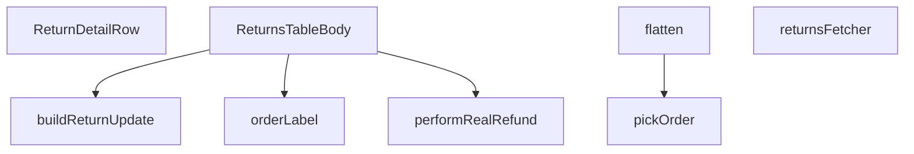

## Genel Bakış
Bu modül, yönetici panelindeki iade (return) verilerinin yönetimi için tasarlanmış merkezi bir görünümdür. Supabase veritabanından ham iade kayıtlarını çeker, ilişkili sipariş bilgileriyle zenginleştirerek bileşenlerin kullanabileceği düz bir veri modeline dönüştürür ve nihayetinde bir React tablosu olarak sunar. Ayrıca, bazı durumlarda gerçek geri ödeme işlemlerini tetikleme ve durum güncelleme gibi iş mantığını da içerir.

## Fonksiyon Grupları
### Veri Çekme ve Parametre Yönetimi
Veritabanından iade kayıtlarını sunucu tarafında çeker, ilişkili sipariş verisini alır ve gerekli sayfalama/parametreleri yöneterek bir sonraki aşama için ham veriyi hazırlar.
- `returnsFetcher`, `pickOrder`

### Veri Dönüşümü ve Biçimlendirme
Ham veritabanı satırlarını, gösterim için uygun düz ve zenginleştirilmiş veri modellerine dönüştürerek etiketleri ve düzeni yönetir.
- `flatten`, `orderLabel`

### Görünüm Bileşenleri (Tablo Gövdesi)
İşlenmiş iade verilerini alarak tablonun her bir satırını ve tüm gövdesini render eden React bileşenlerini barındırır.
- `ReturnDetailRow`, `ReturnsTableBody`

### İşlem ve Durum Yönetimi
İade durumunu güncellemek için gerekli nesneleri oluşturur ve gerektiğinde dış servislerle (örn. ödeme ağ geçidi) iletişime geçerek gerçek geri ödeme işlemini başlatır.
- `performRealRefund`, `buildReturnUpdate`

---

## AXIOMS – Mimari Varsayımlar

Bu modül, iade (return) verilerinin Supabase'den çekilip zenginleştirildiği ve tablo bileşenine sunulduğu merkezi görünümdür.

**[Aksiyom 1 – pickOrder null girdi varsayımı]:** Eğer `pickOrder`'a `joined` parametresi olarak `null` verilirse, dönüş değeri `null` olur.

**[Aksiyom 2 – pickOrder dizi girdi varsayımı]:** Eğer `pickOrder`'a bir `JoinedOrder[]` dizisi verilirse, diziden tek bir `JoinedOrder` seçilir (seçim mantığı modül içindedir, bilinmiyor).

**[Aksiyom 3 – flatten ham veri zorunluluğu]:** Eğer `flatten` fonksiyonuna verilen `RawReturnRow`'da `ReturnRow` yapısını oluşturacak zorunlu alanlar eksikse, sonuç eksik veya hatalı `ReturnRow` olur.

**[Aksiyom 4 – performRealRefund parametre zorunluluğu]:** Eğer `performRealRefund`'a `orderId` veya `returnId` boş string olarak verilirse, refund işlemi başarısız olur veya tanımsız sonuç döner.

**[Aksiyom 5 – buildReturnUpdate note zorunluluğu]:** Eğer `buildReturnUpdate`'e verilen `newStatus`, `STATUSES_REQUIRING_NOTE` kümesinde yer alıyorsa ve `note` parametresi sağlanmamışsa, oluşturulan `ReturnUpdate` geçersiz olur.

**[Aksiyom 6 – buildReturnUpdate statüs geçerliliği]:** Eğer `buildReturnUpdate`'e `STATUS_VALUES` kümesinde yer almayan bir `newStatus` verilirse, güncelleme tanımsız durumda olur.

**[Aksiyom 7 – returnsFetcher supabase bağımlılığı]:** Eğer `returnsFetcher`'a verilen `supabase` istemcisi `Database` tipiyle uyumlu yapılandırılmamışsa, veri çekme işlemi başarısız olur.

**[Aksiyom 8 – returnsFetcher select şeması uyumu]:** Eğer `RETURNS_SELECT` sabitindeki alan isimleri Supabase veritabanındaki gerçek tablo/sütun yapısıyla eşleşmiyorsa, sorgu hatası oluşur.

**[Aksiyom 9 – orderLabel ReturnRow bağımlılığı]:** Eğer `orderLabel`'a verilen `ReturnRow`'da sipariş bilgisini temsil eden alanlar (örn: order ilişkisi) eksikse, dönen etiket字符串 eksik veya anlamsız olur.

**[Aksiyom 10 – ReturnsTableBody veri akışı bağımlılığı]:** Eğer `returnsFetcher`'dan dönen `FetchResult<ReturnRow>` içindeki `ReturnRow` dizisi boşsa, `ReturnsTableBody` bileşeni boş tablo gövdesi render eder.

---

## FONKSİYON DETAYLARI

### pickOrder
**Ne yapar**: Fonksiyon, bir Supabase sorgusundan dönen (`JoinedOrder` tipinde) tek bir nesne veya bir nesne dizisi olabilen, belirsiz bir giriş değerini (`JoinedOrder | JoinedOrder[] | null`) alır ve her zaman tek bir `JoinedOrder` nesnesi veya `null` döndürerek bu belirsizliği çözer.
**Nasıl yapar**: Fonksiyon, giriş değerinin bir dizi (`Array`) olup olmadığını kontrol eder. Eğer dizi ise, dizinin ilk elemanını (`joined[0]`) döndürür; eğer dizi boşsa `null` döner. Dizi değilse, doğrudan girişi döndürür. Bu, Supabase'in tekil ve çoğul sorgu sonuçları arasındaki tutarsızlığını güvenli bir şekilde ele alır.
**Parametreler**:
- joined: `JoinedOrder | JoinedOrder[] | null` — Supabase'den dönen, tekil veya çoğul bir sipariş nesnesi ya da `null` olabilen ham veri.
**Dönüş**: `JoinedOrder | null` — Fonksiyon her zaman tek bir sipariş nesnesi veya `null` döndürür.

### flatten
**Ne yapar**: Ham bir iade satırını (`RawReturnRow`), gösterim için hazırlanmış, düzleştirilmiş ve zenginleştirilmiş bir iade satırına (`ReturnRow`) dönüştürür.
**Nasıl yapar**: Fonksiyon, ham satırdaki (`row`) iç içe geçmiş sipariş nesnesini (`row.venthub_orders`) almak için önce `pickOrder` yardımcı fonksiyonunu çağırır. Ardından, ham verileri alıp siparişten gelen ek bilgilerle (`order_number`, `customer_name`, vb.) birleştirerek `ReturnRow` yapısını oluşturur. Eksik veya tanımsız değerler için `null` varsayılanı kullanılır.
**Parametreler**:
- row: `RawReturnRow` — Veritabanından gelen, iç içe bir `venthub_orders` objesi içeren ham iade satırı verisi.
**Dönüş**: `ReturnRow` — Düzleştirilmiş, tüm gerekli alanları (sipariş numarası, müşteri adı, e-postası vb.) içeren iade satırı nesnesi.

### ReturnDetailRow
**Ne yapar**: Geliştirildi ancak detay üretilemedi.

### performRealRefund
**Ne yapar**: Belirtilen bir sipariş için gerçek (mock olmayan) bir geri ödeme işlemini tetikler ve sonucunu döndürür.
**Nasıl yapar**: Fonksiyon asenkron bir şekilde `supabaseBrowserClient.functions.invoke` kullanarak `'refund-order-mock'` adlı bir Supabase Edge Function'ı çağırır. Çağrıya `order_id` ve `return_id` parametrelerini bir gövde (`body`) içinde iletir. Fonksiyon, yanıtın.success olup olmadığını katmanlı bir hata kontrolü ile doğrular: önce HTTP seviyesindeki hataları, ardından yanıt gövdesindeki uygulama seviyesi hatalarını (`data?.error`) ve son olarak yanıt durumunu (`status`) kontrol eder. Beklenen durumlar (`refunded`, `partial_refunded`, `already_refunded`) dışında bir yanıt alınsa bile başarısızlık sonucu döndürür.
**Parametreler**:
- orderId: `string` — Geri ödemenin uygulanacağı siparişin benzersiz kimliği.
- returnId: `string` — İlgili iade isteğinin benzersiz kimliği. Geri ödeme nedeni olarak `return:${returnId}` formatında kullanılır.
**Dönüş**: `Promise<RefundOutcome>` — İşlemin başarı (`ok: true`) veya hata (`ok: false` ve bir `message`) ile sonuçlandığını belirten bir nesne.

### buildReturnUpdate
**Ne yapar**: Bir iade kaydının durumunu güncellemek için veritabanına gönderilecek güncelleme nesnesini (`ReturnUpdate`) oluşturur.
**Nasıl yapar**: Fonksiyon, gelen yeni duruma (`newStatus`) göre zaman damgası alanlarını (`approved_at`, `processed_at`, `completed_at`) otomatik olarak ayarlar. Örneğin, durum `'approved'` ise `approved_at` alanını mevcut UTC zaman damgasıyla doldurur. Ek olarak, varsa ve boş olmayan bir not (`note`) parametresi trim edilerek `admin_notes` alanına eklenir.
**Parametreler**:
- newStatus: `string` — İade kaydının atanacak yeni durum değeri (örn. 'approved', 'refunded').
- note?: `string` — Opsiyonel. İade sürecine eklenecek admin notu.
**Dönüş**: `ReturnUpdate` — Veritabanına gönderilecek, zaman damgaları ve not bilgileri eklenmiş güncelleme nesnesi.

### returnsFetcher
**Ne yapar**: Veritabanından iade kayıtlarını, verilen filtreleme, arama, sıralama ve sayfalama parametrelerine göre çeker, işler ve formatlanmış bir sonuç döndürür.
**Nasıl yapar**: Fonksiyon önce oturum tazeliğini sağlar (`ensureSessionFresh`). Ardından, `venthub_returns` tablosuna `RETURNS_SELECT` alanlarıyla bir sorgu başlatır. Gelen `FetchParams` içindeki `filters.status` dizisine göre durum filtresi, `query` alanına göre çoklu alanlarda (`reason`, müşteri bilgileri, sipariş numarası) arama (ILIKE ile büyük/küçük harf duyarsız), `sort` parametrelerine göre sıralama ve son olarak `page` ve `pageSize` kullanarak sayfalama uygulanır. Sorgu sonucu ham `RawReturnRow[]` dizisi, `flatten` fonksiyonu ile dönüştürülerek `ReturnRow` dizisine çevrilir ve toplam eşleşen kayıt sayısı (`count`) ile birlikte `FetchResult` nesnesi olarak döndürülür.
**Parametreler**:
- supabase: `SupabaseClient<Database>` — Veritabanı bağlantısı için kullanılan Supabase istemci nesnesi.
- params: `FetchParams` — Sorgu parametrelerini içeren nesne. Filtreler (`filters`), arama terimi (`query`), sıralama (`sort`) ve sayfalama (`page`, `pageSize`) bilgilerini barındırır.
**Dönüş**: `Promise<FetchResult<ReturnRow>>` — İşlenmiş iade satırlarını (`rows`) ve toplam eşleşen kayıt sayısını (`totalMatched`) içeren nesne.

### orderLabel
**Ne yapar**: Bir iade satırı (`ReturnRow`) için insan tarafından okunabilir bir sipariş etiketi (görüntülenebilir numara) oluşturur.
**Nasıl yapar**: Fonksiyon, önce `ReturnRow` nesnesindeki `order_number` alanının varlığını ve içeriğini kontrol eder. Eğer `order_number` mevcutsa, `-` karakterinden sonraki kısmı alarak `#` ile birleştirir (örn. 'INV-1234' -> '#1234'). Eğer `order_number` yoksa veya `-` içermiyorsa, `order_id`'nin son 8 karakterini büyük harflerle keserek bir etiket üretir (örn. 'abc123456789' -> '#56789').
**Parametreler**:
- r: `ReturnRow` — Etiketin oluşturulacağı iade satırı nesnesi.
**Dönüş**: `string` — Oluşturulan sipariş etiketi (örn. '#1234').

### ReturnsTableBody
**Ne yapar**: Geliştirildi ancak detay üretilemedi.

---

## İTHALATLAR (IMPORTS)
- import: ../../components/admin/AdminEmptyState::AdminEmptyState
- import: ../../components/admin/AdminToolbar::AdminToolbar
- import: ../../components/admin/ExportMenu::ExportMenu
- import: ../../components/admin/data-table/BulkBar::BulkBar
- import: ../../components/admin/data-table/BulkBar::type BulkAction
- import: ../../components/admin/data-table/DataTableKit::DataTableKit
- import: ../../components/admin/data-table/FacetedFilter::FacetedFilter
- import: ../../components/admin/data-table/types::type { AdminColumn, DataTableFacet }
- import: ../../components/admin/overlay/ConfirmProvider::useConfirmWithReason
- import: ../../hooks/useAdminTable::type FetchParams
- import: ../../hooks/useAdminTable::type FetchResult
- import: ../../hooks/useAdminTable::useAdminTable
- import: ../../hooks/useRole::useRole
- import: ../../i18n/I18nProvider::useI18n
- import: ../../i18n/datetime::formatDate
- import: ../../i18n/datetime::formatDateTime
- import: ../../i18n/datetime::formatTime
- import: ../../i18n/format::formatCurrency
- import: ../../lib/ensureSessionFresh::ensureSessionFresh
- import: ../../lib/orderStatusService::syncOrderFromReturn
- import: ../../types/database.types::type { Database }
- import: @/lib/admin/mutateWithAudit::AdminPermissionError
- import: @/lib/admin/mutateWithAudit::mutateWithAudit
- import: @/lib/admin/returnStatusMachine::allowedNextStatuses
- import: @/lib/supabase/client::supabaseBrowserClient
- import: @supabase/supabase-js::type { SupabaseClient }
- import: next/navigation::useRouter
- import: react::React
- import: react::useCallback
- import: react::useEffect
- import: react::useMemo
- import: react::useState
- import: sonner::toast

---

## INTERFACES

### ReturnRow
- `id: string`
- `order_id: string`
- `user_id: string`
- `reason: string`
- `description: string | null`
- `status: string`
- `created_at: string`
- `updated_at: string`
- `order_number: string | null`
- `customer_name: string | null`
- `customer_email: string | null`
- `total_amount: number | null`

### JoinedOrder
join satırının ham şekli (Supabase ilişkiyi obje VEYA tek-elemanlı dizi olarak döndürebilir).
- `order_number: string | null`
- `customer_name: string | null`
- `customer_email: string | null`
- `total_amount: number | null`

### RawReturnRow
- `id: string`
- `order_id: string`
- `user_id: string`
- `reason: string`
- `description: string | null`
- `status: string`
- `created_at: string`
- `updated_at: string`
- `venthub_orders: JoinedOrder | JoinedOrder[] | null`

### RefundResponse
- `status?: string`
- `error?: { code?: string; message?: string }`

---

## TYPE ALIASES

### ReturnUpdate
```typescript
type ReturnUpdate = Database['public']['Tables']['venthub_returns']['Update']
```

### RefundOutcome
GERÇEK PARA İADESİ — `iyzico-refund` ucu. 2026-08-16'ya kadar burada `refund-order-mock` çağrılıyordu ve o uç kendi başlığında "no real PSP call" diyordu. Denetimin "sessiz sahte-başarı" dediği sınıfın en pahalı örneğiydi: `payment_status='refunded'` yazılıyor, denetim kaydı düşüyor, müşteriye **"ia
```typescript
type RefundOutcome = { ok: true } | { ok: false; message: string }
```

---

## SABİTLER
- **RETURNS_SELECT** (str) — `'id, order_id, user_id, reason, description, status, created_at, updated_at, ...`
- **STATUS_VALUES** (as_expression) — `['requested', 'approved', 'rejected', 'in_transit', 'received', 'refunded', '...`
- **STATUSES_REQUIRING_NOTE** (new_expression) — `new Set(['rejected', 'cancelled'])`

---

## AST POINTERS

### [N1_NASIL] AST Pointer: C:\Users\alize\venthub-wt-admin\src\views\admin\ReturnsTableBody.tsx::pickOrder
- **params**: (`joined: JoinedOrder | JoinedOrder[] | null`)
- **ic_degiskenler**:
  - `joined` — Girdi parametresi: Tek bir JoinedOrder nesnesi, JoinedOrder dizisi veya null olabilir
- **Dönüş**: JoinedOrder veya null

### [N2_NASIL] AST Pointer: C:\Users\alize\venthub-wt-admin\src\views\admin\ReturnsTableBody.tsx::flatten
- **params**: (`row: RawReturnRow`)
- **ic_degiskenler**:
  - `row` — Ham iade satırı verisi, venthub_orders ilişkili veriyi içerir
  - `order` — pickOrder() ile elde edilen sipariş nesnesi, null olabilir
- **Dönüş**: ReturnRow nesnesi

### [N3_NASIL] AST Pointer: C:\Users\alize\venthub-wt-admin\src\views\admin\ReturnsTableBody.tsx::ReturnDetailRow
- **params**: (`{ row }` — ReturnRow tipinde satır nesnesi)
- **ic_degiskenler**:
  - `row` — Detay gösterilecek iade satırı
  - `t` — useI18n() hook'undan gelen çeviri fonksiyonu
  - `lang` — useI18n() hook'undan gelen dil ayarı
- **Dönüş**: JSX elementi (iade detay bileşeni)

### [N4_NASIL] AST Pointer: C:\Users\alize\venthub-wt-admin\src\views\admin\ReturnsTableBody.tsx::performRealRefund
- **params**: (`orderId: string`, `returnId: string`)
- **ic_degiskenler**:
  - `orderId` — İade yapılacak siparişin ID'si
  - `returnId` — İade kaydının ID'si
  - `data` — Edge function yanıtının gövdesi (RefundResponse tipinde)
  - `error` — Edge function yanıt hatası (varsa)
  - `status` — Edge function yanıtındaki iade durumu
- **Dönüş**: RefundOutcome nesnesi (ok: boolean, message?: string)

### [N5_NASIL] AST Pointer: C:\Users\alize\venthub-wt-admin\src\views\admin\ReturnsTableBody.tsx::buildReturnUpdate
- **params**: (`newStatus: string`, `note?: string`)
- **ic_degiskenler**:
  - `newStatus` — Yeni iade durumu
  - `note` — Opsiyonel admin notu
  - `now` — Güncel zaman damgası (ISO formatında)
  - `update` — Güncellenecek alanları tutan ReturnUpdate nesnesi
  - `trimmed` — Note'un trim edilmiş hali (boşluklar kaldırılmış)
- **Dönüş**: ReturnUpdate nesnesi

### [N6_NASIL] AST Pointer: C:\Users\alize\venthub-wt-admin\src\views\admin\ReturnsTableBody.tsx::returnsFetcher
- **params**: (`supabase: SupabaseClient<Database>`, `params: FetchParams`)
- **ic_degiskenler**:
  - `supabase` — Supabase istemcisi
  - `params` — Sayfalama, filtreleme ve sıralama parametreleri
  - `query` — Supabase sorgu nesnesi
  - `statuses` — Filtrelenecek durumlar dizisi
  - `term` — Arama terimi (trimmed)
  - `sortKey` — Sıralama anahtarı
  - `ascending` — Artan sıralama yönü
  - `offset` — Sayfalama için ofset değeri
  - `data` — Supabase sorgu sonuçları
  - `error` — Supabase sorgu hatası
  - `count` — Toplam eşleşen kayıt sayısı
  - `raw` — Ham ReturnRow dizisi
  - `rows` — Düzeltilmiş ReturnRow dizisi
  - `totalMatched` — Toplam eşleşen kayıt sayısı
- **Dönüş**: FetchResult<ReturnRow> nesnesi

### [N7_NASIL] AST Pointer: C:\Users\alize\venthub-wt-admin\src\views\admin\ReturnsTableBody.tsx::orderLabel
- **params**: (`r: ReturnRow`)
- **ic_degiskenler**:
  - `r` — Etiket üretilecek iade satırı
- **Dönüş**: string (Sipariş etiketi, # ile başlayan format)

### [N8_NASIL] AST Pointer: C:\Users\alize\venthub-wt-admin\src\views\admin\ReturnsTableBody.tsx::ReturnsTableBody
- **params**: (parametre yok)
- **ic_degiskenler**:
  - `t` — useI18n() hook'undan gelen çeviri fonksiyonu
  - `lang` — useI18n() hook'undan gelen dil ayarı
  - `router` — useRouter() hook'undan gelen Next.js yönlendirici
  - `table` — Tablo yönetimi için hook (useAdminTable veya benzeri)
  - `hasWriteAccess` — Yazma izni durumu (boolean)
  - `updatingStatus` — Güncellenen satır ID'si veya null
  - `setUpdatingStatus` — updatingStatus state setter'ı
  - `statusCounts` — Durum bazlı kayıt sayıları (Record<string, number>)
  - `setStatusCounts` — statusCounts state setter'ı
  - `bulkStatus` — Toplu işlem için seçilen durum
  - `setBulkStatus` — bulkStatus state setter'ı
  - `requestStatusChange` — Tek satır durum değişikliği işleyici fonksiyonu
  - `handleStatusChange` — Durum değişikliği onay dialogu ile işleyici
  - `handleStatusUpdate` — Asıl durum güncelleme işleyicisi
  - `bulkStatusChange` — Toplu durum değişikliği işleyicisi
  - `columns` — Tablo sütun tanımları dizisi
  - `filters` — Filtre tanımları (facet yapısı)
  - `exportToCsv` — CSV dışa aktarma fonksiyonu
  - `exportToXls` — XLS dışa aktarma fonksiyonu
  - `bulkActions` — Toplu işlem seçenekleri dizisi
  - `fetchStatusCounts` — Durum sayılarını çeken asenkron fonksiyon
  - `getStatusIcon` — Durum için ikon döndüren fonksiyon
  - `getStatusColor` — Durum için renk sınıfı döndüren fonksiyon
- **Dönüş**: React.FC (Ana bileşen)

---


## MERMAID CALL GRAPH


## NODE ID STANDARD

  file: src\views\admin\ReturnsTableBody.tsx
  function: src\views\admin\ReturnsTableBody.tsx::pickOrder
  function: src\views\admin\ReturnsTableBody.tsx::flatten
  function: src\views\admin\ReturnsTableBody.tsx::ReturnDetailRow
  function: src\views\admin\ReturnsTableBody.tsx::performRealRefund
  function: src\views\admin\ReturnsTableBody.tsx::buildReturnUpdate
  function: src\views\admin\ReturnsTableBody.tsx::returnsFetcher
  function: src\views\admin\ReturnsTableBody.tsx::orderLabel
  function: src\views\admin\ReturnsTableBody.tsx::ReturnsTableBody

---

## DISA AKTARILANLAR (EXPORTS)
  export: ReturnDetailRow
  export: ReturnsTableBody
  export: buildReturnUpdate
  export: flatten
  export: orderLabel
  export: performRealRefund
  export: pickOrder
  export: returnsFetcher

---

## STİL TOKENLERİ

### Arbitrary Değerler (token'a geçirilmemiş)
Yok — tüm stiller token'a geçirilmiş. ✅

### Kullanılan Token'lar (zaten token'a geçirilmiş)
- (yok)

### Tailwind Sınıf Özeti
- **Renkler:** `bg-admin-accent`, `bg-admin-bg`, `bg-admin-surface`, `bg-admin-surface-3`, `bg-surface-deep/40`, `border-admin-border`, `border-b`, `border-current`, `border-t-transparent`, `hover:text-admin-accent`, `text-admin-accent`, `text-admin-danger`, `text-admin-fg`, `text-admin-fg-muted`, `text-admin-fg-subtle`
- **Layout:** `!h-10`, `!h-7`, `flex`, `flex-col`, `flex-wrap`, `gap-0.5`, `gap-1`, `gap-1.5`, `gap-2`, `gap-3`, `gap-4`, `grid`, `h-0.5`, `h-3`, `h-px`
- **Varyant/Responsive:** `:`, `disabled:`, `hover:`, `md:` önekleri
- **Yardımcı Sınıflar:** `!pl-3`, `!px-3`, `$`, `${adminButtonPrimaryClass`, `${adminSelectClass`, `${getStatusColor`, `:`, `STATUSES_REQUIRING_NOTE.has(status`, `adminTableActionDangerClass`, `adminTableActionPrimaryClass`, `align-middle`, `animate-in`, `animate-spin`, `border`, `break-words`