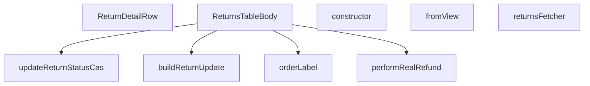

## Genel Bakış
Bu modül, admin panelindeki iade (return) işlemlerinin listelendiği bir tablo bileşenini ve ilgili veri işleme mantığını içerir. Supabase üzerinden iade verilerini çeker, durum güncellemeleri ve gerçek iade (refund) işlemlerini gerçekleştirir. Ayrıca, tablo satırlarının görüntülenmesi ve veri dönüşümleri için yardımcı fonksiyonlar sağlar.

## Fonksiyon Grupları
### Veri Dönüşümü ve Etiketleme
Bu grup, iade verilerinin farklı formatlar arasında dönüştürülmesinden ve kullanıcıya gösterilecek etiketlerin oluşturulmasından sorumludur.
- fromView, buildReturnUpdate, orderLabel

### Asenkron İşlemler ve Veri Çekme
Bu grup, Supabase veritabanından iade verilerini çekmek, iade durumlarını güncellemek ve gerçek iade (refund) işlemlerini yürütmek gibi asenkron veri işlemlerini yönetir.
- returnsFetcher, updateReturnStatusCas, performRealRefund

### React Bileşenleri
Bu grup, kullanıcı arayüzünde iade tablosunu ve tablo içindeki her bir satırın detayını render eden bileşenleri içerir.
- ReturnsTableBody, ReturnDetailRow

### Hata Yönetimi
Bu grup, iade durumu güncelleme işlemleri sırasında oluşabilecek eski veriye yazma (stale write) hatalarını temsil eden özel bir hata sınıfını tanımlar.
- StaleReturnWriteError (sınıf ve constructor metodu)

---

## AXIOMS – Mimari Varsayımlar

[Aksiyom 1]: Eğer `expectedStatus` parametresi mevcut iade durumuyla eşleşmiyorsa, `updateReturnStatusCas` fonksiyonu `StaleReturnWriteError` fırlatır ve güncelleme gerçekleşmez.

[Aksiyom 2]: Eğer `StaleReturnWriteError` fırlatılıyorsa, `staleMessage` parametresi hatanın mesajı olarak kullanılır.

[Aksiyom 3]: Eğer `performRealRefund` çağrılıyorsa, hem `orderId` hem de `returnId` parametreleri sağlanmalıdır; aksi takdirde para iadesi işlemi gerçekleştirilemez.

[Aksiyom 4]: Eğer `buildReturnUpdate` fonksiyonuna `note` parametresi verilmezse, `note` undefined olarak kabul edilir (opsiyonel parametre).

[Aksiyom 5]: Eğer `STATUSES_REQUIRING_NOTE` sabitinde tanımlı bir duruma geçiş yapılıyorsa, `note` parametresi sağlanmalıdır.

[Aksiyom 6]: Eğer `returnsFetcher` çağrılıyorsa, geçerli bir `SupabaseClient<Database>` örneği ve `FetchParams` sağlanmalıdır; aksi takdirde veri çekme işlemi gerçekleştirilemez.

[Aksiyom 7]: Eğer `RETURNS_SELECT` sabiti tanımlı değilse, Supabase sorguları gerekli alanları seçemez ve veri çekme başarısız olur.

[Aksiyom 8]: Eğer `STATUS_VALUES` sabiti tanımlı değilse, geçerli iade durumları belirlenemez ve durum doğrulaması yapılamaz.

---

## FONKSİYON DETAYLARI

### fromView
**Ne yapar**: `ReturnViewRow` tipindeki bir nesneyi `ReturnRow` tipine dönüştürür. Veritabanı görünümünden gelen ham satır verisini, uygulama katmanında kullanılacak temiz bir forma çevirir. Eksik alanlar için boş string (`''`) varsayılan değerleri atar; ancak `description`, `order_number`, `customer_name`, `customer_email` ve `total_amount` alanları için varsayılan değer atanmaz, oldukları gibi bırakılır.

**Nasıl yapar**: Gelen `row` parametresinin her alanını tek tek okur. `id`, `order_id`, `user_id`, `reason`, `status`, `created_at`, `updated_at` alanları için nullish coalescing operatörü (`??`) kullanılarak değer yoksa boş string atanır. Diğer alanlar doğrudan kopyalanır.

**Parametreler**:
- row: `ReturnViewRow` — Veritabanı görünümünden gelen ham iade satırı verisi

**Dönüş**: `ReturnRow` — Uygulama katmanında kullanılacak temizlenmiş iade satırı nesnesi

### ReturnDetailRow
**Ne yapar**: Geliştirildi ancak detay üretilemedi.

### performRealRefund
**Ne yapar**: Geliştirildi ancak detay üretilemedi.

### buildReturnUpdate
**Ne yapar**: Geliştirildi ancak detay üretilemedi.

### updateReturnStatusCas
**Ne yapar**: Geliştirildi ancak detay üretilemedi.

### returnsFetcher
**Ne yapar**: Geliştirildi ancak detay üretilemedi.

### orderLabel
**Ne yapar**: Geliştirildi ancak detay üretilemedi.

### ReturnsTableBody
**Ne yapar**: Geliştirildi ancak detay üretilemedi.

### constructor
**Ne yapar**: `StaleReturnWriteError` sınıfının yapıcı metodudur. Hata nesnesini oluştururken bir hata mesajı alır ve bu mesajı üst sınıfın yapıcısına aktarır. Ayrıca hata nesnesinin `name` özelliğini `'StaleReturnWriteError'` olarak ayarlayarak hata türünün tanımlanmasını sağlar.

**Nasıl yapar**: `super(message)` çağrısı ile üst sınıfın (muhtemelen `Error`) yapıcı metoduna iletilen mesaj parametresini aktarır. Ardından `this.name` özelliğini `'StaleReturnWriteError'` string değerine atayarak, hata yakalandığında hata türünün kolayca anlaşılmasını sağlar.

**Parametreler**:
- message: string — Hata nesnesine atanacak hata mesajıdır. `super()` çağrısına iletilerek üst sınıfın yapıcısına aktarılır.

**Dönüş**: Kaynak kodda dönüş tipi belirtilmemiştir.

---

## İTHALATLAR (IMPORTS)
- import: ../../components/admin/AdminEmptyState::AdminEmptyState
- import: ../../components/admin/AdminToolbar::AdminToolbar
- import: ../../components/admin/ExportMenu::ExportMenu
- import: ../../components/admin/data-table/BulkBar::BulkBar
- import: ../../components/admin/data-table/BulkBar::type BulkAction
- import: ../../components/admin/data-table/DataTableKit::DataTableKit
- import: ../../components/admin/data-table/FacetedFilter::FacetedFilter
- import: ../../components/admin/data-table/types::type { AdminColumn, DataTableFacet }
- import: ../../components/admin/overlay/ConfirmProvider::useConfirmWithReason
- import: ../../hooks/useAdminTable::type FetchParams
- import: ../../hooks/useAdminTable::type FetchResult
- import: ../../hooks/useAdminTable::useAdminTable
- import: ../../hooks/useRole::useRole
- import: ../../i18n/I18nProvider::useI18n
- import: ../../i18n/currency::SYSTEM_CURRENCY
- import: ../../i18n/datetime::formatDate
- import: ../../i18n/datetime::formatDateTime
- import: ../../i18n/datetime::formatTime
- import: ../../i18n/format::formatCurrency
- import: ../../lib/ensureSessionFresh::ensureSessionFresh
- import: ../../lib/orderStatusService::syncOrderFromReturn
- import: ../../types/database.types::type { Database }
- import: @/lib/admin/mutateWithAudit::AdminPermissionError
- import: @/lib/admin/mutateWithAudit::mutateWithAudit
- import: @/lib/admin/returnStatusMachine::allowedNextStatuses
- import: @/lib/supabase/client::supabaseBrowserClient
- import: @supabase/supabase-js::type { SupabaseClient }
- import: next/navigation::useRouter
- import: react::React
- import: react::useCallback
- import: react::useEffect
- import: react::useMemo
- import: react::useState
- import: sonner::toast

---

## INTERFACES

### ReturnRow
- `id: string`
- `order_id: string`
- `user_id: string`
- `reason: string`
- `description: string | null`
- `status: string`
- `created_at: string`
- `updated_at: string`
- `order_number: string | null`
- `customer_name: string | null`
- `customer_email: string | null`
- `total_amount: number | null`

### RefundResponse
- `status?: string`
- `error?: { code?: string; message?: string }`

---

## TYPE ALIASES

### ReturnViewRow
View satırının şekli. TÜM kolonlar nullable: tip üreticisi view kolonlarını daima nullable işaretler, çünkü Postgres NOT NULL kısıtını bir view üzerinden TAŞIMAZ. Taban tabloda id / order_id / user_id / reason / status / created_at / updated_at NOT NULL'dur (ölçüldü), yani aşağıdaki düşüşler pratikt
```typescript
type ReturnViewRow = Pick<
  Database['public']['Views']['view_admin_returns']['Row'],
  | 'id'
  | 'order_id'
  | 'user_id'
  | 'reason'
  | 'description'
  | 'status'
  | 'created_at'
  | 'updated_at'
  | 'ord
```

### ReturnUpdate
```typescript
type ReturnUpdate = Database['public']['Tables']['venthub_returns']['Update']
```

### RefundOutcome
GERÇEK PARA İADESİ — `iyzico-refund` ucu. 2026-08-16'ya kadar burada `refund-order-mock` çağrılıyordu ve o uç kendi başlığında "no real PSP call" diyordu. Denetimin "sessiz sahte-başarı" dediği sınıfın en pahalı örneğiydi: `payment_status='refunded'` yazılıyor, denetim kaydı düşüyor, müşteriye **"ia
```typescript
type RefundOutcome = { ok: true } | { ok: false; message: string }
```

---

## SABİTLER
- **RETURNS_SELECT** (str) — `'id, order_id, user_id, reason, description, status, created_at, updated_at, ...`
- **STATUS_VALUES** (as_expression) — `['requested', 'approved', 'rejected', 'in_transit', 'received', 'refunded', '...`
- **STATUSES_REQUIRING_NOTE** (new_expression) — `new Set(['rejected', 'cancelled'])`

---

## AST POINTERS

### [N1_NASIL] AST Pointer: ReturnsTableBody.tsx::fromView
- **params**: `row` (ReturnViewRow)
- **ic_degiskenler**: yok — doğrudan return ifadesi kullanılır
- **Dönüş**: ReturnRow nesnesi; `row` alanlarını `??` ile varsayılan boş string'e düşürerek haritalar (`id`, `order_id`, `user_id`, `reason`, `status`, `created_at`, `updated_at`); `description`, `order_number`, `customer_name`, `customer_email`, `total_amount` doğrudan geçirilir

### [N2_NASIL] AST Pointer: ReturnsTableBody.tsx::ReturnDetailRow
- **params**: `{ row }` (ReturnRow)
- **ic_degiskenler**:
  - `t` — `useI18n()` kancasından alınan çeviri fonksiyonu
  - `lang` — `useI18n()` kancasından alınan dil kodu
- **Dönüş**: JSX (React.FC); iade detay kartını render eder — `row.id`, `row.order_id`, `row.user_id`, `row.reason`, `row.description`, `row.updated_at` alanlarını görüntüler; `formatDateTime` ile tarih biçimlendirir

### [N3_NASIL] AST Pointer: ReturnsTableBody.tsx::performRealRefund
- **params**: `orderId` (string), `returnId` (string)
- **ic_degiskenler**:
  - `data` — `supabaseBrowserClient.functions.invoke<RefundResponse>('iyzico-refund', ...)` çağrısından dönen yanıt verisi
  - `error` — aynı çağrının ağ/HTTP hatası
  - `status` — `data?.status` değeri; `'refunded'`, `'partial_refunded'`, `'already_refunded'` dışında ise hata döner
  - `err` — `catch` bloğunda yakalanan hata nesnesi
- **Dönüş**: `Promise<RefundOutcome>`; `{ ok: true }` veya `{ ok: false, message: ... }`

### [N4_NASIL] AST Pointer: ReturnsTableBody.tsx::buildReturnUpdate
- **params**: `newStatus` (string), `note?` (string)
- **ic_degiskenler**:
  - `now` — `new Date().toISOString()` ile üretilen anlık zaman damgası
  - `update` — oluşturulacak `ReturnUpdate` nesnesi; `status: newStatus` ile başlatılır
  - `trimmed` — `note?.trim()` sonucu; boş değilse `update.admin_notes` alanına atanır
- **Dönüş**: `ReturnUpdate`; `newStatus` değerine göre `approved_at`, `processed_at`, `completed_at` alanlarını zaman damgasıyla ekler; `note` varsa `admin_notes` alanını ekler

### [N5_NASIL] AST Pointer: ReturnsTableBody.tsx::updateReturnStatusCas
- **params**: `returnId` (string), `expectedStatus` (string), `payload` (ReturnUpdate), `staleMessage` (string)
- **ic_degiskenler**:
  - `data` — `supabaseBrowserClient.from('venthub_returns').update(payload).eq('id', returnId).eq('status', expectedStatus).select('id')` sonucu
  - `error` — aynı sorgunun hatası
- **Dönüş**: `Promise<void>`; `error` varsa fırlatır; `data` boşsa (0 satır güncellendiyse) `StaleReturnWriteError(staleMessage)` fırlatır

### [N6_NASIL] AST Pointer: ReturnsTableBody.tsx::returnsFetcher
- **params**: `supabase` (SupabaseClient\<Database\>), `params` (FetchParams)
- **ic_degiskenler**:
  - `query` — `supabase.from(RETURNS_VIEW).select(RETURNS_SELECT, { count: 'exact' })` ile başlatılan sorgu zinciri
  - `statuses` — `params.filters.status ?? [];` durum filtresi dizisi
  - `term` — `params.query.trim()` global arama terimi; boş değilse `query.ilike('search_text', ...)` uygulanır
  - `sortKey` — `params.sort?.key` sıralama anahtarı
  - `ascending` — `params.sort?.dir === 'asc'` boolean değeri
  - `offset` — `(params.page - 1) * params.pageSize` sayfalama ofseti
  - `data` — `query.range(offset, offset + params.pageSize - 1)` sonucundaki satırlar
  - `error` — aynı sorgunun hatası
  - `count` — toplam eşleşen satır sayısı
  - `rows` — `(data ?? []).map(fromView)` ile ReturnRow dizisine dönüştürülen satırlar
  - `totalMatched` — `typeof count === 'number' ? count : rows.length`
- **Dönüş**: `Promise<FetchResult<ReturnRow>>`; `{ rows, totalMatched }` nesnesi; `error` varsa fırlatır

### [N7_NASIL] AST Pointer: ReturnsTableBody.tsx::orderLabel
- **params**: `r` (ReturnRow)
- **ic_degiskenler**: yok
- **Dönüş**: `string`; `r.order_number` varsa `#${r.order_number.split('-')[1] ?? r.order_number}`, yoksa `#${r.order_id.slice(-8).toUpperCase()}`

### [N8_NASIL] AST Pointer: ReturnsTableBody.tsx::StaleReturnWriteError.constructor
- **params**: `message` (string)
- **ic_degiskenler**: yok
- **Dönüş**: yok; `super(message)` çağrısı yapar ve `this.name = 'StaleReturnWriteError'` atar

### [N9_NASIL] AST Pointer: ReturnsTableBody.tsx::ReturnsTableBody
- **params**: yok
- **ic_degiskenler**:
  - `t` — `useI18n()` çeviri fonksiyonu
  - `lang` — `useI18n()` dil kodu
  - `router` — `useRouter()` Next.js yönlendirici nesnesi
  - `supabaseBrowserClient` — modül seviyesinde import edilen Supabase istemcisi
  - `table` — admin tablo kancasından alınan tablo durumu (satırlar, filtreleme, sıralama, sayfalama, seçim, yeniden yükleme, dışa aktarma)
  - `updatingStatus` / `setUpdatingStatus` — `useState<string | null>(null)`; güncellenen satırın ID'sini tutar
  - `statusCounts` / `setStatusCounts` — `useState<Record<string, number>>({})`; her durum için toplam sayı
  - `hasWriteAccess` — yazma yetkisi boolean değeri
  - `bulkStatus` / `setBulkStatus` — `useState<string>('approved')`; toplu durum geçişi için seçilen hedef durum
  - `fetchStatusCounts` — async fonksiyon; `supabaseBrowserClient.from('venthub_returns').select('status')` ile durum sayılarını çeker ve `setStatusCounts` ile günceller
  - `getStatusIcon` — `(status: string) => React.ReactNode`; duruma göre ikon bileşeni döndürür (Clock, CheckCircle, XCircle, Truck, Package, RefreshCw)
  - `getStatusColor` — `(status: string) => string`; duruma göre CSS sınıf string'i döndürür
  - `handleStatusUpdate` — `async (row: ReturnRow, newStatus: string, note?: string) => void`; tek satır durum güncelleme akışı: `allowedNextStatuses` kontrolü, `performRealRefund` (refunded ise), `updateReturnStatusCas`, `syncOrderFromReturn`, `return-status-notification` çağrısı; `StaleReturnWriteError` yakalanırsa tablo yeniden yüklenir
  - `requestStatusChange` — `async (row: ReturnRow, newStatus: string) => void`; `refunded` durumunda `confirmWithReason` ile onay ister; `STATUSES_REQUIRING_NOTE` içindeki durumlar için gerekçe zorunlu; ardından `handleStatusUpdate` çağırır
  - `bulkStatusChange` — `async (targetStatus: string) => void`; seçili satırlar üzerinde toplu durum geçişi; `Promise.allSettled` ile kısmi başarı yönetimi; `failures` dizisi ile düşen satırları takip eder
  - `columns` — `useMemo(() => [...], [...])` ile oluşturulan sütun tanımları dizisi; her sütun `key`, `header`, `sortable`, `cell` içerir
  - `filterFacets` — `useMemo(() => [...], [...])` ile oluşturulan filtre facet'leri; `status` facet'i `STATUS_VALUES` ve `statusCounts` kullanır
  - `handleExportCsv` — `async () => void`; `table.fetchAllForExport()` ile tüm satırları alır, CSV formatında Blob oluşturur ve indirir
  - `handleExportXls` — `async () => void`; `table.fetchAllForExport()` ile tüm satırları alır, HTML tablo formatında `.xls` Blob oluşturur ve indirir
  - `bulkActions` — `useMemo(() => [...], [...])` ile oluşturulan toplu işlem tanımları; `apply-status` action'ı select ve buton içerir
- **Dönüş**: JSX (React.FC); AdminToolbar ve tablo yapısını render eder

### [N10_NASIL] AST Pointer: ReturnsTableBody.tsx::fetchStatusCounts (ReturnsTableBody içinde)
- **params**: yok
- **ic_degiskenler**:
  - `data` — `supabaseBrowserClient.from('venthub_returns').select('status')` sonucu
  - `error` — aynı sorgunun hatası
  - `counts` — `Record<string, number>`; her `row.status` için sayaç tutar
  - `row` — `data` dizisindeki her satır; `row.status` değeri kullanılır
  - `err` — `catch` bloğunda yakalanan hata
- **Dönüş**: yok (void); yan etki olarak `setStatusCounts(counts)` çağırır; hata durumunda `console.warn` ile loglar

### [N11_NASIL] AST Pointer: ReturnsTableBody.tsx::getStatusIcon (ReturnsTableBody içinde)
- **params**: `status` (string)
- **ic_degiskenler**: yok — doğrudan switch-case ile JSX döndürür
- **Dönüş**: `React.ReactNode`; duruma göre ikon bileşeni: `'requested'` → Clock, `'approved'` → CheckCircle, `'rejected'` → XCircle, `'in_transit'` → Truck, `'received'` → Package, `'refunded'` → CheckCircle, `'cancelled'` → XCircle, varsayılan → RefreshCw

### [N12_NASIL] AST Pointer: ReturnsTableBody.tsx::getStatusColor (ReturnsTableBody içinde)
- **params**: `status` (string)
- **ic_degiskenler**: yok — doğrudan switch-case ile string döndürür
- **Dönüş**: `string`; duruma göre CSS sınıf adları (bg, text, border); varsayılan `'bg-admin-surface-3 text-admin-fg-muted border-admin-border'`

### [N13_NASIL] AST Pointer: ReturnsTableBody.tsx::handleStatusUpdate (ReturnsTableBody içinde)
- **params**: `row` (ReturnRow), `newStatus` (string), `note?` (string)
- **ic_degiskenler**:
  - `hasWriteAccess` — kapanış değişkeni; yazma yetkisi kontrolü
  - `allowed` — `allowedNextStatuses(row.status)` sonucu; izin verilen durumlar dizisi
  - `oldStatus` — `row.status` güncelleme öncesi durum
  - `refund` — `performRealRefund(row.order_id, row.id)` sonucu; `newStatus === 'refunded'` ise çağrılır
  - `err` — `catch` bloğunda yakalanan hata
- **Dönüş**: yok (void); yan etkiler: `setUpdatingStatus(row.id)`, `mutateWithAudit` ile veritabanı güncellemesi, `toast.success`/`toast.error`, `table.reload()`, `setUpdatingStatus(null)`

### [N14_NASIL] AST Pointer: ReturnsTableBody.tsx::requestStatusChange (ReturnsTableBody içinde)
- **params**: `row` (ReturnRow), `newStatus` (string)
- **ic_degiskenler**:
  - `confirmed` — `confirmWithReason` sonucu onay boolean'ı
  - `reason` — `confirmWithReason` sonucu gerekçe string'i
- **Dönüş**: yok (void); `newStatus === 'refunded'` ise onay dialogu gösterir; `STATUSES_REQUIRING_NOTE.has(newStatus)` ise gerekçe zorunlu dialogu gösterir; ardından `handleStatusUpdate` çağırır

### [N15_NASIL] AST Pointer: ReturnsTableBody.tsx::bulkStatusChange (ReturnsTableBody içinde)
- **params**: `targetStatus` (string)
- **ic_degiskenler**:
  - `hasWriteAccess` — kapanış değişkeni; yazma yetkisi kontrolü
  - `selected` — `table.selection.selectedIds`; seçili satır ID'leri
  - `targets` — `table.rows.filter(...)` sonucu; geçerli geçiş yapabilen satırlar
  - `needsNote` — `STATUSES_REQUIRING_NOTE.has(targetStatus)` boolean'ı
  - `confirmed` — `confirmWithReason` sonucu onay boolean'ı
  - `reason` — `confirmWithReason` sonucu gerekçe string'i
  - `failures` — `string[]`; başarısız olan satırların hata mesajları
  - `dbUpdates` — `targets.map(async (row) => {...})` ile oluşturulan Promise dizisi
  - `outcomes` — `Promise.allSettled(dbUpdates)` sonucu
  - `rejected` — `outcomes.filter(...)` ile reddedilen sonuçlar
  - `e` — dış `catch` bloğunda yakalanan hata
- **Dönüş**: yok (void); yan etkiler: `mutateWithAudit` ile toplu güncelleme, `toast.warning` (kısmi hata), `toast.success`, `table.selection.clear()`, `table.reload()`

### [N16_NASIL] AST Pointer: ReturnsTableBody.tsx::columns (ReturnsTableBody içinde, useMemo)
- **params**: yok
- **ic_degiskenler**:
  - `t` — kapanış değişkeni; çeviri fonksiyonu
  - `lang` — kapanış değişkeni; dil kodu
  - `router` — kapanış değişkeni; Next.js yönlendirici
  - `hasWriteAccess` — kapanış değişkeni; yazma yetkisi
  - `updatingStatus` — kapanış değişkeni; güncellenen satır ID'si
  - `requestStatusChange` — kapanış değişkeni; durum değiştirme fonksiyonu
  - `r` — her sütunun `cell` fonksiyonunda kullanılan satır parametresi (ReturnRow)
  - `next` — `allowedNextStatuses(r.status)` sonucu; izin verilen sonraki durumlar
  - `status` — `next.map(...)` içindeki her durum değeri
- **Dönüş**: sütun tanımları dizisi; her eleman `{ key, header, sortable?, hideable?, cell }` içerir

### [N17_NASIL] AST Pointer: ReturnsTableBody.tsx::filterFacets (ReturnsTableBody içinde, useMemo)
- **params**: yok
- **ic_degiskenler**:
  - `t` — kapanış değişkeni; çeviri fonksiyonu
  - `statusCounts` — kapanış değişkeni; durum sayıları
  - `value` — `STATUS_VALUES.map(...)` içindeki her durum değeri
- **Dönüş**: filtre facet'leri dizisi; `{ key: 'status', label, options: [{ value, label, count }] }`

### [N18_NASIL] AST Pointer: ReturnsTableBody.tsx::handleExportCsv (ReturnsTableBody içinde)
- **params**: yok
- **ic_degiskenler**:
  - `rows` — `table.fetchAllForExport()` sonucu; dışa aktarılacak tüm satırlar
  - `header` — CSV başlık satırı dizisi (çevrilmiş sütun adları)
  - `escape` — `(v: unknown) => string`; değerleri çift tırnak içinde escape eden fonksiyon
  - `lines` — `rows.map(...)` sonucu; her satırı CSV formatına dönüştüren string dizisi
  - `bom` — UTF-8 BOM karakteri `''`
  - `csv` — birleştirilmiş CSV string'i
  - `blob` — `new Blob([bom + csv], { type: 'text/csv;charset=utf-8;' })`
  - `url` — `URL.createObjectURL(blob)` ile oluşturulan geçici URL
  - `a` — `document.createElement('a')` ile oluşturulan indirme bağlantısı
- **Dönüş**: yok (void); yan etki olarak dosya indirme tetikler

### [N19_NASIL] AST Pointer: ReturnsTableBody.tsx::handleExportXls (ReturnsTableBody içinde)
- **params**: yok
- **ic_degiskenler**:
  - `rows` — `table.fetchAllForExport()` sonucu; dışa aktarılacak tüm satırlar
  - `rowsHtml` — `rows.map(...)` sonucu; her satırı HTML `<tr>` formatına dönüştüren string dizisi
  - `r` — `rows.map(...)` içindeki her satır (ReturnRow)
  - `amount` — `typeof r.total_amount === 'number' ? formatCurrency(...) : ''` para birimi formatlı değer
  - `htmlTable` — tam HTML tablo string'i
  - `blob` — `new Blob([htmlTable], { type: 'application/vnd.ms-excel' })`
  - `url` — `URL.createObjectURL(blob)` ile oluşturulan geçici URL
  - `a` — `document.createElement('a')` ile oluşturulan indirme bağlantısı
- **Dönüş**: yok (void); yan etki olarak `.xls` dosyası indirme tetikler

### [N20_NASIL] AST Pointer: ReturnsTableBody.tsx::bulkActions (ReturnsTableBody içinde, useMemo)
- **params**: yok
- **ic_degiskenler**:
  - `t` — kapanış değişkeni; çeviri fonksiyonu
  - `bulkStatus` — kapanış değişkeni; seçili hedef durum
  - `setBulkStatus` — kapanış değişkeni; hedef durum setter'ı
  - `bulkStatusChange` — kapanış değişkeni; toplu durum değiştirme fonksiyonu
  - `close` — panel fonksiyonu parametresi; paneli kapatır
  - `s` — select seçenekleri içindeki her durum değeri
- **Dönüş**: toplu işlem tanımları dizisi; `{ key: 'apply-status', label, tone, panel }` içerir

---


## MERMAID CALL GRAPH


## NODE ID STANDARD

  file: src\views\admin\ReturnsTableBody.tsx
  function: src\views\admin\ReturnsTableBody.tsx::fromView
  function: src\views\admin\ReturnsTableBody.tsx::ReturnDetailRow
  function: src\views\admin\ReturnsTableBody.tsx::performRealRefund
  function: src\views\admin\ReturnsTableBody.tsx::buildReturnUpdate
  function: src\views\admin\ReturnsTableBody.tsx::updateReturnStatusCas
  function: src\views\admin\ReturnsTableBody.tsx::returnsFetcher
  function: src\views\admin\ReturnsTableBody.tsx::orderLabel
  function: src\views\admin\ReturnsTableBody.tsx::ReturnsTableBody
  class: src\views\admin\ReturnsTableBody.tsx::StaleReturnWriteError

---

## DISA AKTARILANLAR (EXPORTS)
  export: ReturnDetailRow
  export: ReturnsTableBody
  export: StaleReturnWriteError
  export: buildReturnUpdate
  export: fromView
  export: orderLabel
  export: performRealRefund
  export: returnsFetcher
  export: updateReturnStatusCas

---

## STİL TOKENLERİ

### Arbitrary Değerler (token'a geçirilmemiş)
Yok — tüm stiller token'a geçirilmiş. ✅

### Kullanılan Token'lar (zaten token'a geçirilmiş)
- (yok)

### Tailwind Sınıf Özeti
- **Renkler:** `bg-admin-accent`, `bg-admin-bg`, `bg-admin-surface`, `bg-admin-surface-3`, `bg-surface-deep/40`, `border-admin-border`, `border-b`, `border-current`, `border-t-transparent`, `hover:text-admin-accent`, `text-admin-accent`, `text-admin-danger`, `text-admin-fg`, `text-admin-fg-muted`, `text-admin-fg-subtle`
- **Layout:** `!h-10`, `!h-7`, `flex`, `flex-col`, `flex-wrap`, `gap-0.5`, `gap-1`, `gap-1.5`, `gap-2`, `gap-3`, `gap-4`, `grid`, `h-0.5`, `h-3`, `h-px`
- **Varyant/Responsive:** `:`, `disabled:`, `hover:`, `md:` önekleri
- **Yardımcı Sınıflar:** `!pl-3`, `!px-3`, `$`, `${adminButtonPrimaryClass`, `${adminSelectClass`, `${getStatusColor`, `:`, `STATUSES_REQUIRING_NOTE.has(status`, `adminTableActionDangerClass`, `adminTableActionPrimaryClass`, `align-middle`, `animate-in`, `animate-spin`, `border`, `break-words`