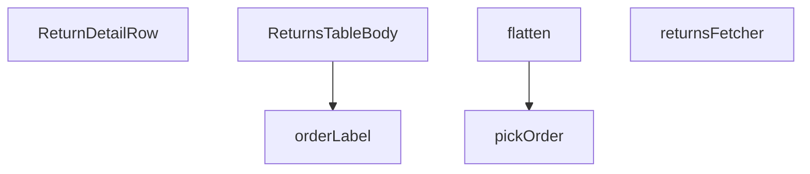

## Genel Bakış
Bu modül, yönetici panelindeki iade (return) işlemlerine ait verilerin sunucu tarafında çekildiği, ham satırların ilişkili sipariş bilgileriyle zenginleştirilerek dönüştürüldüğü ve nihayetinde bir React tablosunun gövdesi olarak render edildiği merkezi bir görünümdür. Temel sorumluluğu, Supabase veritabanından hammadde niteliğindeki iade kayıtlarını alıp bileşenlerin kullanabileceği zengin bir veri modeline dönüştürerek sunmaktır.

## Fonksiyon Grupları
### Veri Çekme ve Parametre Yönetimi
Bu grup, veritabanından iade kayıtlarını ve ilişkili sipariş bilgilerini sunucu tarafında çeker, ham veriyi bir sonraki aşama için hazırlar ve gerekli parametreleri (örn. sayfalama) yönetir.
- returnsFetcher, pickOrder

### Veri Dönüşümü ve Biçimlendirme
Ham veritabanı satırlarını, bileşenlerin doğrudan kullanabileceği daha düz ve zenginleştirilmiş bir veri modeline dönüştürerek gösterim etiketlerini ve düzenini yönetir.
- flatten, orderLabel

### Görünüm Bileşenleri (Tablo Gövdesi)
İşlenmiş ve zenginleştirilmiş iade verilerini alarak tablonun her bir satırını ve gövdesini render eden React bileşenlerini barındırır.
- ReturnDetailRow, ReturnsTableBody

---

## AXIOMS – Mimari Varsayımlar

Bu modül, iade (return) verilerinin çekilmesi, dönüştürülmesi ve bir React tablosu olarak sunulmasıyla ilgili bir görünümdür. Aşağıdaki varsayımlar sadece fonksiyon imzalarından ve modül sabitlerinden çıkarılmıştır.

---

**[Aksiyom 1]:** `RETURNS_SELECT` sabiti, `returnsFetcher` tarafından Supabase sorgusunda kullanılacak geçerli bir select ifadesi (column listesi/join tanımı) içermelidir. Eğer `RETURNS_SELECT` geçerli bir select ifadesi içermiyorsa, `returnsFetcher` çalışırken Supabase tarafında hata oluşur veya beklenen alanlar içeren ham veri (`RawReturnRow`) elde edilemez.

**[Aksiyom 2]:** `STATUS_VALUES` sabiti, iade kayıtlarının durum filtrelemeinde kullanılmak üzere geçerli bir Supabase `as_expression` yapılandırması içermelidir. Eğer `STATUS_VALUES` geçerli bir ifade içermiyorsa, duruma göre filtreleme yapılamaz ve tablo beklenmeyen durum değerleriyle doldurulabilir.

**[Aksiyom 3]:** `returnsFetcher`, çalışması için geçerli bir `SupabaseClient<Database>` ve `FetchParams` parametreleri almalıdır. Eğer `supabase` parametresi geçerli bir Supabase istemcisi değilse (örn. bağlanmamış veya yetkisiz), veritabanı sorgusu başarısız olur ve `FetchResult<ReturnRow>` yerine hata fırlatılır.

**[Aksiyom 4]:** `flatten` fonksiyonu, girdi olarak her zaman `RawReturnRow` tipinde bir nesne almalıdır. Eğer `row` parametresi `RawReturnRow` yapısına uymuyorsa (eksik veya yanlış tipte alanlar içeriyorsa), çıkan `ReturnRow` nesnesinde beklenmeyen `undefined` veya hatalı değerler oluşur.

**[Aksiyom 5]:** `pickOrder` fonksiyonu, girdi olarak `JoinedOrder`, `JoinedOrder[]` veya `null` alabilir. Fonksiyon, dizgi girdiğinde bile `null` döndürebilir. Eğer `ReturnsTableBody` bileşeni `pickOrder`'dan dönen `null` değeri için bir fallback (boş durum) sağlamıyorsa, `ReturnDetailRow` bileşenine geçersiz veri aktarılabilir.

**[Aksiyom 6]:** `orderLabel`, çalışması için geçerli bir `ReturnRow` nesnesi almalıdır. Eğer `ReturnRow` nesnesinde `orderLabel`'ın kullandığı alanlar (isimler/eminen Değerler bilinmiyor) eksik veya `undefined` ise, returned string boş veya beklenmeyen bir değer olur.

**[Aksiyom 7]:** `ReturnsTableBody` bileşeni, veri çekmek için `returnsFetcher`'ı çağırmalıdır ve bu çağrı sonucu elde edilen `ReturnRow[]` dizisi, `flatten` ile dönüştürülmüş olmalıdır. Eğer `returnsFetcher`'ın döndürdüğü ham veri `flatten`'a geçirilmeden doğrudan kullanılırsa, ham (`RawReturnRow`) ve zenginleştirilmiş (`ReturnRow`) veri yapıları arasındaki uyumsuzluk render hatalarına yol açar.

**[Aksiyom 8]:** `ReturnDetailRow` bileşeni, prop olarak her zaman bir `ReturnRow` nesnesi almalıdır. Eğer `row` prop'u eksik veya `ReturnRow` yapısına uymuyorsa, bileşen render aşamasında hata fırlatır.

---

## FONKSİYON DETAYLARI

### pickOrder
**Ne yapar**: Bu fonksiyon, veritabanından gelen ve bir dizi veya tek bir nesne olabilen `JoinedOrder` yapısını, her durumda güvenli bir şekilde tek bir `JoinedOrder` nesnesine veya `null` değerine indirger. Fonksiyon, Supabase istemcisinin ilişkili veriler için oluşturduğu çoğul/tekil belirsizliğini standart bir forma dönüştürerek consumers tarafından güvenle kullanılmasını sağlar.

**Nasıl yapar**: Fonksiyon, girdi olarak aldığı `joined` parametresinin bir dizi olup olmadığını kontrol eder. Eğer bir dizi ise, dizinin ilk elemanını döndürür; dizi boşsa `null` döndürür. Eğer girdi zaten bir nesne ise, doğrudan o nesneyi döndürür. Bu basit kontroller, fonksiyonun herhangi bir hata fırlatmadan veya veri kaybına neden olmadan çalışmasını garanti altına alır.

**Parametreler**:
- joined: `JoinedOrder | JoinedOrder[] | null` — Supabase'den çekilen, ilişkili sipariş bilgilerini içeren ham veri. Tek bir `JoinedOrder` nesnesi, bu türün bir dizisi veya `null` olabilir.

**Dönüş**: `JoinedOrder | null` — Fonksiyon, girdinin dizisi halinde gelmesi durumunda dizinin ilk elemanını, nesne halinde gelmesi durumunda o nesneyi, `null` veya boş dizi gelmesi durumunda ise `null` döndürür.

### flatten
**Ne yapar**: Bu fonksiyon, veritabanından doğrudan gelen, iç içe yapıya sahip ham bir iade satırını (`RawReturnRow`), uygulamanın geri kalanında kullanıma uygun, düz ve zenginleştirilmiş bir yapıya (`ReturnRow`) dönüştürür. Fonksiyon, iade kaydının temel alanlarını ve ilişkili sipariş bilgilerini tek bir seviyede birleştirir.

**Nasıl yapar**: Fonksiyon, ham satırın içindeki `venthub_orders` ilişkisini `pickOrder` fonksiyonunu kullanarak güvenli bir şekilde tek bir sipariş nesnesine indirger. Daha sonra, orijinal iade verisi ile elde edilen sipariş verisinden (sipariş numarası, müşteri adı, e-postası, toplam tutar) oluşan düz bir nesne oluşturur. Sipariş bilgisi mevcut değilse, ilgili alanlar için `null` değeri atanır.

**Parametreler**:
- row: `RawReturnRow` — Veritabanından ham olarak çekilen, ilişkili `venthub_orders` alanı içeren iade satırı verisi.

**Dönüş**: `ReturnRow` — Düzleştirilmiş ve zenginleştirilmiş iade satırı. İadeye ait temel alanların yanı sıra ilişkili siparişin `order_number`, `customer_name`, `customer_email` ve `total_amount` bilgilerini de içerir.

### ReturnDetailRow
**Ne yapar**: Geliştirildi ancak detay üretilemedi.

### returnsFetcher
**Ne yapar**: Bu asenkron fonksiyon, belirli filtreleme, arama, sıralama ve sayfalama parametrelerine göre `venthub_returns` tablosundan iade kayıtlarını çeker, işler ve standart bir formatta döndürür. Fonksiyon, veritabanı bağlantısını yönetir, karmaşık sorguları oluşturur ve sonucu uygulamanın arayüz bileşenleri için hazırlar.

**Nasıl yapar**: Fonksiyon, önce oturumun taze olmasının `ensureSessionFresh` ile garanti altına alır. Ardından, Supabase istemcisi üzerinde bir sorgu oluşturur. `params.filters.status` değerine göre durum filtresi (eşitlik veya içinde bulunma kontrolü) uygular. `params.query` değerine göre, iade sebebi ve ilişkili siparişin müşteri adı, e-postası veya sipariş numarası üzerinde büyük/küçük harfe duyarsız bir arama (`ilike`) yapar. Sıralama `params.sort` değerine göre, bazı alanların (`order_number`, `customer_name`) foreign tabloda olduğu belirtilerek uygulanır; belirtilmemişse varsayılan olarak `created_at` alanına göre azalan sıralama yapılır. Son olarak sayfalama için `params.page` ve `params.pageSize` kullanılarak `range` sorgusu yapılır. Ham veriler `flatten` fonksiyonu ile dönüştürülür.

**Parametreler**:
- supabase: `SupabaseClient<Database>` — Veritabanı işlemleri için kullanılacak, tipleri güvenli Supabase istemcisi örneği.
- params: `FetchParams` — İstekte bulunulan veriyi tanımlayan parametreleri içeren nesne. Bu nesne, `page` (sayfa numarası), `pageSize` (sayfa boyutu), `query` (arama terimi), `filters` (durum filtresi dizisi gibi) ve `sort` (sıralama anahtarı ve yönü) gibi alanları içerir.

**Dönüş**: `Promise<FetchResult<ReturnRow>>` — Fonksiyon, bir Promise döndürür ve çözümü `{ rows, totalMatched }` yapısındadır. `rows`, filtrelenmiş ve sayfalanmış `ReturnRow` dizisidir. `totalMatched`, filtreleme sonucunda eşleşen toplam kayıt sayısıdır ve sayfalama bilgisi için kullanılır.

### orderLabel
**Ne yapar**: Bu fonksiyon, bir `ReturnRow` nesnesinden, arayüzde gösterilmek üzere okunabilir ve kısa bir etiket (örn: "#12345") üretir. Fonksiyon, mevcut sipariş numarası varsa onu, yoksa iade ID'sinin son 8 karakterini kullanarak garantili bir etiket döndürür.

**Nasıl yapar**: Fonksiyon, `ReturnRow` içindeki `order_number` alanını kontrol eder. Eğer bu alan mevcutsa, tire (`-`) karakterinden sonraki kısmını alarak bir `#` işareti ile birleştirir. Eğer `order_number` alanının tire sonrası kısmı alınamazsa veya alan `null` ise, tüm `order_number` değerini kullanır. Eğer `order_number` alanı zaten `null` ise, bu durumda `order_id` alanının son 8 karakterini büyük harflere çevirerek bir etiket üretir.

**Parametreler**:
- r: `ReturnRow` — Etiket üretilecek iade satırı nesnesi. `order_number` ve `order_id` alanlarını içermelidir.

**Dönüş**: `string` — Oluşturulan etiket string'i. Her zaman bir `#` işareti ile başlar.

### ReturnsTableBody
**Ne yapar**: Geliştirildi ancak detay üretilemedi.

---

## İTHALATLAR (IMPORTS)
- import: ../../components/admin/AdminEmptyState::AdminEmptyState
- import: ../../components/admin/AdminToolbar::AdminToolbar
- import: ../../components/admin/ExportMenu::ExportMenu
- import: ../../components/admin/data-table/BulkBar::BulkBar
- import: ../../components/admin/data-table/BulkBar::type BulkAction
- import: ../../components/admin/data-table/DataTableKit::DataTableKit
- import: ../../components/admin/data-table/FacetedFilter::FacetedFilter
- import: ../../components/admin/data-table/types::type { AdminColumn, DataTableFacet }
- import: ../../components/admin/overlay/ConfirmProvider::useConfirm
- import: ../../hooks/useAdminTable::type FetchParams
- import: ../../hooks/useAdminTable::type FetchResult
- import: ../../hooks/useAdminTable::useAdminTable
- import: ../../hooks/useRole::useRole
- import: ../../i18n/I18nProvider::useI18n
- import: ../../i18n/datetime::formatDate
- import: ../../i18n/datetime::formatDateTime
- import: ../../i18n/datetime::formatTime
- import: ../../i18n/format::formatCurrency
- import: ../../lib/ensureSessionFresh::ensureSessionFresh
- import: ../../lib/orderStatusService::syncOrderFromReturn
- import: ../../types/database.types::type { Database }
- import: @/lib/admin/mutateWithAudit::AdminPermissionError
- import: @/lib/admin/mutateWithAudit::mutateWithAudit
- import: @/lib/admin/returnStatusMachine::allowedNextStatuses
- import: @/lib/supabase/client::supabaseBrowserClient
- import: @supabase/supabase-js::type { SupabaseClient }
- import: next/navigation::useRouter
- import: react::React
- import: react::useCallback
- import: react::useEffect
- import: react::useMemo
- import: react::useState
- import: sonner::toast

---

## INTERFACES

### ReturnRow
- `id: string`
- `order_id: string`
- `user_id: string`
- `reason: string`
- `description: string | null`
- `status: string`
- `created_at: string`
- `updated_at: string`
- `order_number: string | null`
- `customer_name: string | null`
- `customer_email: string | null`
- `total_amount: number | null`

### JoinedOrder
join satırının ham şekli (Supabase ilişkiyi obje VEYA tek-elemanlı dizi olarak döndürebilir).
- `order_number: string | null`
- `customer_name: string | null`
- `customer_email: string | null`
- `total_amount: number | null`

### RawReturnRow
- `id: string`
- `order_id: string`
- `user_id: string`
- `reason: string`
- `description: string | null`
- `status: string`
- `created_at: string`
- `updated_at: string`
- `venthub_orders: JoinedOrder | JoinedOrder[] | null`

---

## SABİTLER
- **RETURNS_SELECT** (str) — `'id, order_id, user_id, reason, description, status, created_at, updated_at, ...`
- **STATUS_VALUES** (as_expression) — `['requested', 'approved', 'rejected', 'in_transit', 'received', 'refunded', '...`

---

## AST POINTERS

### [N1_NASIL] AST Pointer: `src/views/admin/ReturnsTableBody.tsx::pickOrder`
- **params**: `(joined: JoinedOrder | JoinedOrder[] | null)`
- **ic_degiskenler**:
  - Yok — parametre doğrudan kontrol edilir ve döndürülür.
- **Dönüş**: `JoinedOrder | null` — Array ise ilk elemanı, değilse doğrudan `joined` değerini döndürür.

---

### [N2_NASIL] AST Pointer: `src/views/admin/ReturnsTableBody.tsx::flatten`
- **params**: `(row: RawReturnRow)`
- **ic_degiskenler**:
  - `order` — `pickOrder(row.venthub_orders)` çağrısından dönen `JoinedOrder | null` değeri; sipariş bilgilerini (order_number, customer_name, customer_email, total_amount) ham satırdan çıkarır.
- **Dönüş**: `ReturnRow` — Ham veriyi düzleştirilmiş, tek düzeyli bir nesneye dönüştürür.

---

### [N3_NASIL] AST Pointer: `src/views/admin/ReturnsTableBody.tsx::ReturnDetailRow`
- **params**: `({ row })` — `row: ReturnRow`
- **ic_degiskenler**:
  - `t` — `useI18n()` hook'undan gelen çeviri fonksiyonu; tüm metinlerin yerelleştirilmesinde kullanılır.
  - `lang` — `useI18n()` hook'undan gelen dil kodu; tarih formatlamada kullanılır (`formatDateTime(row.updated_at, lang)`).
- **Dönüş**: `JSX.Element` — İade detaylarının kartlar halinde gösterildiği bölüm.

---

### [N4_NASIL] AST Pointer: `src/views/admin/ReturnsTableBody.tsx::returnsFetcher`
- **params**: `(supabase: SupabaseClient<Database>, params: FetchParams)`
- **ic_degiskenler**:
  - `query` — Supabase sorgu zinciri; filtreleme, arama, sıralama ve sayfalama uygulanarak逐步 inşa edilir.
  - `statuses` — `params.filters.status ?? []`; uygulanacak durum filtreleri dizisi.
  - `term` — `params.query.trim()`; global arama terimi, boşlukları temizlenmiş.
  - `sortKey` — `params.sort?.key`; sıralama için kullanılacak sütun anahtarı.
  - `ascending` — `params.sort?.dir === 'asc'`; sıralama yönü (artan/artmayan).
  - `offset` — `(params.page - 1) * params.pageSize`; sayfalama için hesaplanan başlangıç indeksi.
  - `data` — Supabase'den dönen hata verisi (`VenthubReturns` satırları).
  - `error` — Supabase sorgu hatası varsa fırlatılır.
  - `count` — Supabase'den dönen toplam eşleşen satır sayısı.
  - `raw` — `data ?? []` — null-safe ham satır dizisi.
  - `rows` — `raw.map(flatten)` — her ham satırın `flatten` ile dönüştürülmüş hali.
  - `totalMatched` — `typeof count === 'number' ? count : rows.length`; toplam eşleşen kayıt sayısı.
- **Dönüş**: `Promise<FetchResult<ReturnRow>>` — `{ rows, totalMatched }` nesnesi.

---

### [N5_NASIL] AST Pointer: `src/views/admin/ReturnsTableBody.tsx::orderLabel`
- **params**: `(r: ReturnRow)`
- **ic_degiskenler**:
  - Yok — parametre özellikleri doğrudan `if` ve template literal içinde kullanılır.
- **Dönüş**: `string` — Sipariş etiketi; `order_number` varsa `#` + tireden sonraki kısım, yoksa `#` + `order_id`'nin son 8 karakteri.

---

### [N6_NASIL] AST Pointer: `src/views/admin/ReturnsTableBody.tsx::ReturnsTableBody`
- **params**: Yok (React FC, parametre almaz)
- **ic_degiskenler** (gövdeden çıkarılmış, iç içe tanımlanan callback/fonksiyonlar):
  - `fetchStatusCounts` — `async ()` arrow fonksiyonu; Supabase'den tüm iade kayıtlarının `status` alanını çekip `statusCounts` state'ini günceller.
  - `statusCounts` — `Record<string, number>` tipinde state; her durumun kaç kez geçtiğini tutar (`{ requested: 5, approved: 3, ... }`).
  - `useEffect(() => { void fetchStatusCounts() })` — Bileşen mount edildiğinde durum sayılarını çeker.
  - `getStatusIcon` — `(status: string) => React.ReactNode` arrow fonksiyonu; duruma göre ikon bileşeni döndürür (Clock, CheckCircle, XCircle, Truck, Package, RefreshW vb.).
  - `getStatusLabel` — `(status: string) => string` arrow fonksiyonu; durum anahtarını CSS renk sınıfı stringine dönüştürür (ör. `'bg-amber-500/10 text-amber-500 border-amber-500/20'`).
  - `handleStatusUpdate` — `async (row: ReturnRow, newStatus: string)` arrow fonksiyonu; tekil durum güncelleme mantığını yönetir:
    - `hasWriteAccess` — Boolean; yazma izni varsa devam eder.
    - `allowed` — `allowedNextStatuses(row.status)` sonucu; geçerli geçişler dizisi.
    - `oldStatus` — `row.status`; güncelleme öncesi eski durum.
    - `mutateWithAudit(...)` — Audit loglu Supabase mutation çağrısı; içinde `row.id`, `row.order_id`, `row.order_number`, `row.customer_email`, `row.customer_name`, `row.reason`, `row.description` alanları kullanılır.
    - `toast.success(...)` / `toast.error(...)` — Bildirim gösterimi.
    - `table.reload()` — Tabloyu yeniden yükler.
    - `setUpdatingStatus(null)` — finally bloğunda loading durumu temizlenir.
  - `bulkStatusChange` — `async (targetStatus: string)` arrow fonksiyonu; toplu durum güncelleme mantığını yönetir:
    - `selected` — `table.selection.selectedIds`; seçili satırların ID'leri.
    - `targets` — `table.rows.filter(...)` ile filtrelenmiş, seçili ve geçerli geçişe sahip satırlar.
    - `confirm(...)` — Onay dialogu; kullanıcının onaylaması beklenir.
    - `mutateWithAudit(...)` — Toplu mutation, içinde `targets.map(async (row) => ...)` döngüsü çalıştırılır.
    - Her `row` için: `row.id`, `row.order_id`, `row.order_number`, `row.customer_email`, `row.customer_name`, `row.status`, `row.reason`, `row.description` alanları kullanılır.
    - `Promise.all(dbUpdates)` — Tüm güncellemeler paralel olarak tamamlanır.
    - `table.selection.clear()` — Seçim temizlenir.
    - `table.reload()` — Tablo yeniden yüklenir.
  - `columns` — `() => [...]` arrow fonksiyonu; tablo sütun tanımlarını döndürür. Her sütun `key`, `header`, `sortable`, `hideable`, `cell` özelliklerine sahip:
    - `key: 'order_number'` sütunu — `orderLabel(r)`, `r.total_amount`, `formatCurrency(...)`, `router.push(...)` kullanır.
    - `key: 'customer_name'` sütunu — `r.customer_name`, `r.customer_email` kullanır.
    - `key: 'reason'` sütunu — `r.reason`, `r.description` kullanır.
    - `key: 'status'` sütunu — `r.status`, `getStatusColor(r.status)`, `getStatusIcon(r.status)`, `getStatusLabel(r.status)` kullanır.
    - `key: 'created_at'` sütunu — `r.created_at`, `formatDate(r.created_at, lang)`, `formatTime(r.created_at, lang)` kullanır.
    - `key: 'actions'` sütunu — `r.status`, `allowedNextStatuses(r.status)`, `hasWriteAccess`, `updatingStatus`, `handleStatusUpdate(r, status)` kullanır.
  - `handleExportCSV` — `async ()` arrow fonksiyonu; CSV dışa aktarma:
    - `rows` — `table.fetchAllForExport()` sonucu; tüm satırları çeker.
    - `header` — `t(...)` çağrılarıyla oluşturulmuş CSV başlık dizisi.
    - `escape` — `(v: unknown) => string` arrow fonksiyonu; CSV değerlerini escape eder (tırnak işaretlerini ikiye katlar).
    - `lines` — `rows.map((r) => ...)` ile her satırın CSV satırına dönüştürülmesi; `orderLabel(r)`, `r.customer_name`, `r.customer_email`, `r.reason`, `getStatusLabel(r.status)`, `formatDateTime(r.created_at, lang)`, `formatCurrency(Number(r.total_amount), lang)` kullanır.
    - `bom` — UTF-8 BOM karakteri `''`.
    - `csv` — Tam CSV metni.
    - `blob` — `new Blob([bom + csv], { type: 'text/csv;charset=utf-8;' })`.
    - `url` — `URL.createObjectURL(blob)`.
    - `a` — `document.createElement('a')` ile indirme bağlantısı oluşturulur, otomatik tıklanır, URL revoke edilir.
  - `handleExportXLSX` — `async ()` arrow fonksiyonu; XLSX (aslında HTML tabanlı Excel) dışa aktarma:
    - `rows` — `table.fetchAllForExport()` sonucu.
    - `rowsHtml` — `rows.map((r) => ...)` ile her satırın HTML `<tr>` satırına dönüştürülmesi; `orderLabel(r)`, `r.customer_name`, `r.customer_email`, `r.reason`, `getStatusLabel(r.status)`, `formatDateTime(r.created_at, lang)`, `formatCurrency(Number(r.total_amount), lang)` kullanır.
    - `htmlTable` — Tam HTML tablosu stringi.
    - `blob` — `new Blob([htmlTable], { type: 'application/vnd.ms-excel' })`.
    - `url`, `a` — Same download pattern as CSV.
  - `getBulkActions` — `() => [...]` arrow fonksiyonu; toplu işlem menüsü tanımlarını döndürür. İçinde `bulkStatusChange`, `bulkStatus`, `setBulkStatus`, `getStatusLabel`, `glassStrongClass`, `adminSelectClass`, `adminSelectStyle`, `adminButtonPrimaryClass` kullanılır.
  - `getFilterFacets` — `() => [...]` arrow fonksiyonu; filtre bileşenleri için facet tanımlarını döndürür. `STATUS_VALUES`, `getStatusLabel`, `statusCounts` kullanır.
- **Dönüş**: `React.FC` — Admin iadeleri tablosunu gösteren ana bileşen; tool bar, filtre, tablo, bulk actions ve detay satırı içerir. State'ler (`statusCounts`, `updatingStatus`, `bulkStatus`) ve callback'ler (`handleStatusUpdate`, `bulkStatusChange`, `handleExportCSV`, `handleExportXLSX`) tanımlanarak `AdminToolbar` ve tablo bileşenine bağlanır.

---

## MERMAID CALL GRAPH

## NODE ID STANDARD

  file: src\views\admin\ReturnsTableBody.tsx
  function: src\views\admin\ReturnsTableBody.tsx::pickOrder
  function: src\views\admin\ReturnsTableBody.tsx::flatten
  function: src\views\admin\ReturnsTableBody.tsx::ReturnDetailRow
  function: src\views\admin\ReturnsTableBody.tsx::returnsFetcher
  function: src\views\admin\ReturnsTableBody.tsx::orderLabel
  function: src\views\admin\ReturnsTableBody.tsx::ReturnsTableBody

---

## DISA AKTARILANLAR (EXPORTS)
  export: ReturnDetailRow
  export: ReturnsTableBody
  export: flatten
  export: orderLabel
  export: pickOrder
  export: returnsFetcher

---

## STİL TOKENLERİ

### Arbitrary Değerler (token'a geçirilmemiş)
Yok — tüm stiller token'a geçirilmiş. ✅

### Kullanılan Token'lar (zaten token'a geçirilmiş)
- (yok)

### Tailwind Sınıf Özeti
- **Renkler:** `bg-cyan-400`, `bg-surface-deep`, `bg-surface-deep/40`, `bg-white/10`, `border-b`, `border-current`, `border-t-transparent`, `border-white/5`, `hover:text-cyan-300`, `text-blue-600`, `text-cyan-400`, `text-gray-400`, `text-gray-600`, `text-green-600`, `text-green-700`
- **Layout:** `!h-10`, `!h-7`, `flex`, `flex-col`, `flex-wrap`, `gap-0.5`, `gap-1`, `gap-1.5`, `gap-2`, `gap-3`, `gap-4`, `grid`, `h-0.5`, `h-3`, `h-px`
- **Varyant/Responsive:** `disabled:`, `hover:`, `md:` önekleri
- **Yardımcı Sınıflar:** `!pl-3`, `!px-3`, `${adminButtonPrimaryClass`, `${adminSelectClass`, `${adminTableActionPrimaryClass`, `${getStatusColor`, `${glassStrongClass`, `align-middle`, `animate-in`, `animate-spin`, `border`, `break-words`, `disabled:opacity-50`, `duration-300`, `fade-in`