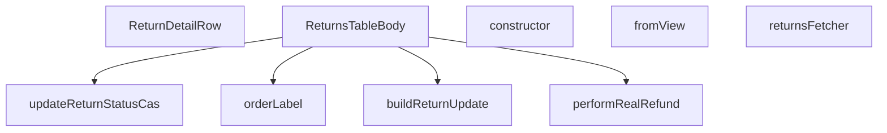

## Genel Bakış
Bu modül, admin panelindeki iade (return) işlemlerinin listelendiği bir tablo bileşenini ve ilgili veri işleme mantığını içerir. Supabase üzerinden iade verilerini çeker, durum güncellemeleri ve gerçek iade (refund) işlemlerini gerçekleştirir. Ayrıca, tablo satırlarının görüntülenmesi ve veri dönüşümleri için yardımcı fonksiyonlar sağlar.

## Fonksiyon Grupları
### Veri Dönüşümü ve Etiketleme
Bu grup, iade verilerinin farklı formatlar arasında dönüştürülmesinden ve kullanıcıya gösterilecek etiketlerin oluşturulmasından sorumludur.
- fromView, buildReturnUpdate, orderLabel

### Asenkron İşlemler ve Veri Çekme
Bu grup, Supabase veritabanından iade verilerini çekmek, iade durumlarını güncellemek ve gerçek iade (refund) işlemlerini yürütmek gibi asenkron veri işlemlerini yönetir.
- returnsFetcher, updateReturnStatusCas, performRealRefund

### React Bileşenleri
Bu grup, kullanıcı arayüzünde iade tablosunu ve tablo içindeki her bir satırın detayını render eden bileşenleri içerir.
- ReturnsTableBody, ReturnDetailRow

### Hata Yönetimi
Bu grup, iade durumu güncelleme işlemleri sırasında oluşabilecek eski veriye yazma (stale write) hatalarını temsil eden özel bir hata sınıfını tanımlar.
- StaleReturnWriteError (sınıf ve constructor metodu)

---

## AXIOMS – Mimari Varsayımlar

[Aksiyom 1]: Eğer `expectedStatus` parametresi mevcut iade durumuyla eşleşmiyorsa, `updateReturnStatusCas` fonksiyonu `StaleReturnWriteError` fırlatır ve güncelleme gerçekleşmez.

[Aksiyom 2]: Eğer `StaleReturnWriteError` fırlatılıyorsa, `staleMessage` parametresi hatanın mesajı olarak kullanılır.

[Aksiyom 3]: Eğer `performRealRefund` çağrılıyorsa, hem `orderId` hem de `returnId` parametreleri sağlanmalıdır; aksi takdirde para iadesi işlemi gerçekleştirilemez.

[Aksiyom 4]: Eğer `buildReturnUpdate` fonksiyonuna `note` parametresi verilmezse, `note` undefined olarak kabul edilir (opsiyonel parametre).

[Aksiyom 5]: Eğer `STATUSES_REQUIRING_NOTE` sabitinde tanımlı bir duruma geçiş yapılıyorsa, `note` parametresi sağlanmalıdır.

[Aksiyom 6]: Eğer `returnsFetcher` çağrılıyorsa, geçerli bir `SupabaseClient<Database>` örneği ve `FetchParams` sağlanmalıdır; aksi takdirde veri çekme işlemi gerçekleştirilemez.

[Aksiyom 7]: Eğer `RETURNS_SELECT` sabiti tanımlı değilse, Supabase sorguları gerekli alanları seçemez ve veri çekme başarısız olur.

[Aksiyom 8]: Eğer `STATUS_VALUES` sabiti tanımlı değilse, geçerli iade durumları belirlenemez ve durum doğrulaması yapılamaz.

---

## FONKSİYON DETAYLARI

### fromView
**Ne yapar**: `ReturnViewRow` tipindeki bir nesneyi `ReturnRow` tipine dönüştürür. Veritabanı görünümünden gelen ham satır verisini, uygulama katmanında kullanılacak temiz bir forma çevirir. Eksik alanlar için boş string (`''`) varsayılan değerleri atar; ancak `description`, `order_number`, `customer_name`, `customer_email` ve `total_amount` alanları için varsayılan değer atanmaz, oldukları gibi bırakılır.

**Nasıl yapar**: Gelen `row` parametresinin her alanını tek tek okur. `id`, `order_id`, `user_id`, `reason`, `status`, `created_at`, `updated_at` alanları için nullish coalescing operatörü (`??`) kullanılarak değer yoksa boş string atanır. Diğer alanlar doğrudan kopyalanır.

**Parametreler**:
- row: `ReturnViewRow` — Veritabanı görünümünden gelen ham iade satırı verisi

**Dönüş**: `ReturnRow` — Uygulama katmanında kullanılacak temizlenmiş iade satırı nesnesi

### ReturnDetailRow
**Ne yapar**: Geliştirildi ancak detay üretilemedi.

### performRealRefund
**Ne yapar**: Geliştirildi ancak detay üretilemedi.

### buildReturnUpdate
**Ne yapar**: Geliştirildi ancak detay üretilemedi.

### updateReturnStatusCas
**Ne yapar**: Geliştirildi ancak detay üretilemedi.

### returnsFetcher
**Ne yapar**: Geliştirildi ancak detay üretilemedi.

### orderLabel
**Ne yapar**: Geliştirildi ancak detay üretilemedi.

### ReturnsTableBody
**Ne yapar**: Geliştirildi ancak detay üretilemedi.

### constructor
**Ne yapar**: Geliştirildi ancak detay üretilemedi.

---

## İTHALATLAR (IMPORTS)
- import: ../../components/admin/AdminEmptyState::AdminEmptyState
- import: ../../components/admin/AdminToolbar::AdminToolbar
- import: ../../components/admin/ExportMenu::ExportMenu
- import: ../../components/admin/data-table/BulkBar::BulkBar
- import: ../../components/admin/data-table/BulkBar::type BulkAction
- import: ../../components/admin/data-table/DataTableKit::DataTableKit
- import: ../../components/admin/data-table/FacetedFilter::FacetedFilter
- import: ../../components/admin/data-table/types::type { AdminColumn, DataTableFacet }
- import: ../../components/admin/overlay/ConfirmProvider::useConfirmWithReason
- import: ../../hooks/useAdminTable::type FetchParams
- import: ../../hooks/useAdminTable::type FetchResult
- import: ../../hooks/useAdminTable::useAdminTable
- import: ../../hooks/useRole::useRole
- import: ../../i18n/I18nProvider::useI18n
- import: ../../i18n/currency::SYSTEM_CURRENCY
- import: ../../i18n/datetime::formatDate
- import: ../../i18n/datetime::formatDateTime
- import: ../../i18n/datetime::formatTime
- import: ../../i18n/format::formatCurrency
- import: ../../lib/ensureSessionFresh::ensureSessionFresh
- import: ../../lib/orderStatusService::syncOrderFromReturn
- import: ../../types/database.types::type { Database }
- import: @/lib/admin/mutateWithAudit::AdminPermissionError
- import: @/lib/admin/mutateWithAudit::mutateWithAudit
- import: @/lib/admin/returnStatusMachine::allowedNextStatuses
- import: @/lib/supabase/client::supabaseBrowserClient
- import: @supabase/supabase-js::type { SupabaseClient }
- import: next/navigation::useRouter
- import: react::React
- import: react::useCallback
- import: react::useEffect
- import: react::useMemo
- import: react::useState
- import: sonner::toast

---

## INTERFACES

### ReturnRow
- `id: string`
- `order_id: string`
- `user_id: string`
- `reason: string`
- `description: string | null`
- `status: string`
- `created_at: string`
- `updated_at: string`
- `order_number: string | null`
- `customer_name: string | null`
- `customer_email: string | null`
- `total_amount: number | null`

### RefundResponse
- `status?: string`
- `error?: { code?: string; message?: string }`

---

## TYPE ALIASES

### ReturnViewRow
View satırının şekli. TÜM kolonlar nullable: tip üreticisi view kolonlarını daima nullable işaretler, çünkü Postgres NOT NULL kısıtını bir view üzerinden TAŞIMAZ. Taban tabloda id / order_id / user_id / reason / status / created_at / updated_at NOT NULL'dur (ölçüldü), yani aşağıdaki düşüşler pratikt
```typescript
type ReturnViewRow = Pick<
  Database['public']['Views']['view_admin_returns']['Row'],
  | 'id'
  | 'order_id'
  | 'user_id'
  | 'reason'
  | 'description'
  | 'status'
  | 'created_at'
  | 'updated_at'
  | 'ord
```

### ReturnUpdate
```typescript
type ReturnUpdate = Database['public']['Tables']['venthub_returns']['Update']
```

### RefundOutcome
GERÇEK PARA İADESİ — `iyzico-refund` ucu. 2026-08-16'ya kadar burada `refund-order-mock` çağrılıyordu ve o uç kendi başlığında "no real PSP call" diyordu. Denetimin "sessiz sahte-başarı" dediği sınıfın en pahalı örneğiydi: `payment_status='refunded'` yazılıyor, denetim kaydı düşüyor, müşteriye **"ia
```typescript
type RefundOutcome = { ok: true } | { ok: false; message: string }
```

---

## SABİTLER
- **RETURNS_SELECT** (str) — `'id, order_id, user_id, reason, description, status, created_at, updated_at, ...`
- **STATUS_VALUES** (as_expression) — `['requested', 'approved', 'rejected', 'in_transit', 'received', 'refunded', '...`
- **STATUSES_REQUIRING_NOTE** (new_expression) — `new Set(['rejected', 'cancelled'])`

---

## AST POINTERS

### [N1_NASIL] AST Pointer: src/views/admin/ReturnsTableBody.tsx::fromView
- **params**: `row` — ReturnViewRow tipinde, veritabanından gelen ham satır verisi
- **ic_degiskenler**: (yok — doğrudan return ifadesi kullanılır)
- **Dönüş**: ReturnRow — `row` alanlarının nullish coalescing ile varsayılan değerlere dönüştürülmüş hali; `id`, `order_id`, `user_id`, `reason`, `status`, `created_at`, `updated_at` boş string'e, `description`, `order_number`, `customer_name`, `customer_email`, `total_amount` ise doğrudan kopyalanır

### [N2_NASIL] AST Pointer: src/views/admin/ReturnsTableBody.tsx::ReturnDetailRow
- **params**: `row` — ReturnRow tipinde, iade detayı gösterilecek satır
- **ic_degiskenler**:
  - `t` — i18n çeviri fonksiyonu, `useI18n()` ile alınır
  - `lang` — mevcut dil kodu, `useI18n()` ile alınır; `formatDateTime` çağrısında kullanılır
- **Dönüş**: React.FC — iade detay panelini render eden JSX; `row.id`, `row.order_id`, `row.user_id`, `row.reason`, `row.description`, `row.updated_at` alanlarını görüntüler

### [N3_NASIL] AST Pointer: src/views/admin/ReturnsTableBody.tsx::performRealRefund
- **params**: `orderId` — string, iade yapılacak sipariş kimliği; `returnId` — string, iade kaydı kimliği
- **ic_degiskenler**:
  - `data` — `supabaseBrowserClient.functions.invoke('iyzico-refund')` yanıtının veri kısmı
  - `error` — aynı çağrının hata kısmı; ağ/HTTP hatası varsa dolu gelir
  - `status` — `data?.status` — iyzico yanıtındaki iade durumu; `'refunded'`, `'partial_refunded'` veya `'already_refunded'` olmalı
  - `err` — catch bloğunda yakalanan hata nesnesi
- **Dönüş**: `Promise<RefundOutcome>` — `{ ok: true }` veya `{ ok: false, message: string }`; iyzico-refund edge function çağrısının sonucunu döndürür

### [N4_NASIL] AST Pointer: src/views/admin/ReturnsTableBody.tsx::buildReturnUpdate
- **params**: `newStatus` — string, yeni iade durumu; `note` — opsiyonel string, yönetici notu
- **ic_degiskenler**:
  - `now` — `new Date().toISOString()`, güncel zaman damgası
  - `update` — `ReturnUpdate` tipinde nesne; başlangıçta `{ status: newStatus }` olarak oluşturulur
  - `trimmed` — `note?.trim()` — notun boşluklardan arındırılmış hali; boş değilse `update.admin_notes` alanına atanır
- **Dönüş**: `ReturnUpdate` — duruma göre `approved_at`, `processed_at`, `completed_at` ve opsiyonel `admin_notes` alanlarını içeren güncelleme nesnesi

### [N5_NASIL] AST Pointer: src/views/admin/ReturnsTableBody.tsx::StaleReturnWriteError.constructor
- **params**: `message` — string, hata mesajı
- **ic_degiskenler**: (yok)
- **Dönüş**: yok — `super(message)` çağrısı yapar ve `this.name` değerini `'StaleReturnWriteError'` olarak atar

### [N6_NASIL] AST Pointer: src/views/admin/ReturnsTableBody.tsx::updateReturnStatusCas
- **params**: `returnId` — string, iade kaydı kimliği; `expectedStatus` — string, beklenen mevcut durum (CAS kontrolü); `payload` — ReturnUpdate, yapılacak güncelleme; `staleMessage` — string, bayat yazma hatası mesajı
- **ic_degiskenler**:
  - `data` — `supabaseBrowserClient.from('venthub_returns').update(payload).eq('id', returnId).eq('status', expectedStatus).select('id')` sorgusunun dönen satırları
  - `error` — aynı sorgunun hata nesnesi; varsa throw edilir
- **Dönüş**: `Promise<void>` — başarılıysa sessiz döner; `error` varsa throw eder, `data` boşsa `StaleReturnWriteError` fırlatır

### [N7_NASIL] AST Pointer: src/views/admin/ReturnsTableBody.tsx::returnsFetcher
- **params**: `supabase` — `SupabaseClient<Database>` tipinde, Supabase istemcisi; `params` — `FetchParams` tipinde, filtreleme/sayfalama/sıralama parametreleri
- **ic_degiskenler**:
  - `query` — Supabase sorgu zinciri; `RETURNS_VIEW` tablosundan `RETURNS_SELECT` ile veri çeker, `count: 'exact'` ile toplam sayıyı döndürür
  - `statuses` — `params.filters.status ?? []` — durum filtresi dizisi
  - `term` — `params.query.trim()` — global arama terimi; `search_text` kolonunda `ilike` ile aranır
  - `sortKey` — `params.sort?.key` — sıralama anahtarı
  - `ascending` — `params.sort?.dir === 'asc'` — sıralama yönü
  - `offset` — `(params.page - 1) * params.pageSize` — sayfalama ofseti
  - `data` — sorgu sonucu satırlar
  - `error` — sorgu hatası; varsa throw edilir
  - `count` — eşleşen toplam satır sayısı
  - `rows` — `(data ?? []).map(fromView)` ile ReturnRow dizisine dönüştürülen satırlar
  - `totalMatched` — `typeof count === 'number' ? count : rows.length` — toplam eşleşme sayısı
- **Dönüş**: `Promise<FetchResult<ReturnRow>>` — `{ rows, totalMatched }` nesnesi

### [N8_NASIL] AST Pointer: src/views/admin/ReturnsTableBody.tsx::orderLabel
- **params**: `r` — ReturnRow tipinde, iade satırı
- **ic_degiskenler**: (yok — doğrudan return ifadesi)
- **Dönüş**: `string` — `r.order_number` varsa `#` ve tire sonrasındaki kısmı, yoksa `r.order_id`'nin son 8 karakterinin büyük harfli hali

### [N9_NASIL] AST Pointer: src/views/admin/ReturnsTableBody.tsx::ReturnsTableBody
- **params**: (yok)
- **ic_degiskenler**:
  - `t` — i18n çeviri fonksiyonu
  - `lang` — mevcut dil kodu
  - `router` — `useRouter()` ile alınan Next.js router nesnesi
  - `hasWriteAccess` — yazma yetkisi olup olmadığını gösteren boolean
  - `updatingStatus` — şu an güncellenen satırın kimliği veya null; `useState` ile yönetilir
  - `setUpdatingStatus` — `updatingStatus` state setter fonksiyonu
  - `statusCounts` — durum bazlı sayımlar; `useState` ile yönetilen `Record<string, number>`
  - `setStatusCounts` — `statusCounts` state setter fonksiyonu
  - `bulkStatus` — toplu durum değişikliği için seçilen durum; `useState` ile yönetilir
  - `setBulkStatus` — `bulkStatus` state setter fonksiyonu
  - `fetchStatusCounts` — anonim async fonksiyon; `venthub_returns` tablosundan durum sayımlarını çeker ve `setStatusCounts` ile günceller
  - `getStatusIcon` — anonim fonksiyon; `status` string alır, duruma göre Clock/CheckCircle/XCircle/Truck/Package/RefreshCw ikonu döndürür
  - `getStatusColor` — anonim fonksiyon; `status` string alır, duruma göre CSS sınıf string'i döndürür
  - `handleStatusUpdate` — anonim async fonksiyon; `row`, `newStatus`, opsiyonel `note` alır; `allowedNextStatuses` kontrolü yapar, `refunded` durumunda `performRealRefund` çağırır, `updateReturnStatusCas` ile güncelleme yapar, `syncOrderFromReturn` ve `return-status-notification` çağırır, hata yönetimi yapar
  - `requestStatusChange` — anonim async fonksiyon; `row` ve `newStatus` alır; `refunded` durumunda `confirmWithReason` ile onay ister, `STATUSES_REQUIRING_NOTE` kontrolü yapar, `handleStatusUpdate` çağırır
  - `bulkStatusChange` — anonim async fonksiyon; `targetStatus` alır; seçili satırlar üzerinde toplu durum değişikliği yapar, `Promise.allSettled` kullanır, kısmi başarı/hata yönetimi yapar
  - `columns` — anonim fonksiyon; tablo sütun tanımlarını döndüren dizi; `order_number`, `customer_name`, `reason`, `status`, `created_at`, `actions` sütunlarını içerir
  - `filterFacets` — anonim fonksiyon; durum filtresi facet tanımı döndürür; `statusCounts` kullanır
  - `handleExportCsv` — anonim async fonksiyon; tabloyu CSV olarak dışa aktarır
  - `handleExportXls` — anonim async fonksiyon; tabloyu XLS (HTML tablo) olarak dışa aktarır
  - `bulkActions` — anonim fonksiyon; toplu işlem paneli tanımlarını döndüren dizi; `bulkStatus` select ve `bulkStatusChange` tetikleme butonu içerir
- **Dönüş**: `React.FC` — iade yönetimi tablosunu render eden bileşen; AdminToolbar ve tablo içerir

---


## MERMAID CALL GRAPH


## NODE ID STANDARD

  file: ReturnsTableBody.tsx
  function: ReturnsTableBody.tsx::fromView
  function: ReturnsTableBody.tsx::ReturnDetailRow
  function: ReturnsTableBody.tsx::performRealRefund
  function: ReturnsTableBody.tsx::buildReturnUpdate
  function: ReturnsTableBody.tsx::updateReturnStatusCas
  function: ReturnsTableBody.tsx::returnsFetcher
  function: ReturnsTableBody.tsx::orderLabel
  function: ReturnsTableBody.tsx::ReturnsTableBody
  class: ReturnsTableBody.tsx::StaleReturnWriteError

---

## DISA AKTARILANLAR (EXPORTS)
  export: ReturnDetailRow
  export: ReturnsTableBody
  export: StaleReturnWriteError
  export: buildReturnUpdate
  export: fromView
  export: orderLabel
  export: performRealRefund
  export: returnsFetcher
  export: updateReturnStatusCas

---

## STİL TOKENLERİ

### Arbitrary Değerler (token'a geçirilmemiş)
Yok — tüm stiller token'a geçirilmiş. ✅

### Kullanılan Token'lar (zaten token'a geçirilmiş)
- (yok)

### Tailwind Sınıf Özeti
- **Renkler:** `bg-admin-accent`, `bg-admin-bg`, `bg-admin-surface`, `bg-admin-surface-3`, `bg-surface-deep/40`, `border-admin-border`, `border-b`, `border-current`, `border-t-transparent`, `hover:text-admin-accent`, `text-admin-accent`, `text-admin-danger`, `text-admin-fg`, `text-admin-fg-muted`, `text-admin-fg-subtle`
- **Layout:** `!h-10`, `!h-7`, `flex`, `flex-col`, `flex-wrap`, `gap-0.5`, `gap-1`, `gap-1.5`, `gap-2`, `gap-3`, `gap-4`, `grid`, `h-0.5`, `h-3`, `h-px`
- **Varyant/Responsive:** `:`, `disabled:`, `hover:`, `md:` önekleri
- **Yardımcı Sınıflar:** `!pl-3`, `!px-3`, `$`, `${adminButtonPrimaryClass`, `${adminSelectClass`, `${getStatusColor`, `:`, `STATUSES_REQUIRING_NOTE.has(status`, `adminTableActionDangerClass`, `adminTableActionPrimaryClass`, `align-middle`, `animate-in`, `animate-spin`, `border`, `break-words`