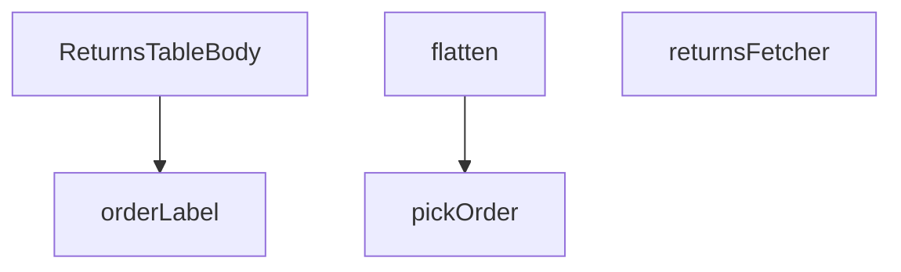

## Genel Bakış
Bu modül, yönetici panelindeki iade işlemlerini gösteren bir tablonun gövdesini (body) oluşturmaktan sorumludur. Ham iade verilerini işleyip sunuma hazır forma dönüştürür ve son olarak React bileşeni olarak arayüze teslim eder.

## Fonksiyon Grupları
### Veri Çekme ve Başlangıç İşlemleri
Bu grup, veritabanından ham iade verilerinin çekilmesini ve ilk filtreleme düzenlemelerini içerir. Supabase istemcisi ile konuşarak sunucu tarafı fetching işlemini yönetir.
- returnsFetcher, pickOrder

### Veri Dönüşümü ve Biçimlendirme
Ham satır verisini, bileşenlerin kullanacağı daha düz ve zenginleştirilmiş bir veri modeline dönüştürür.
- flatten, orderLabel

### Görünüm Bileşeni
İşlenmiş veriyi tablo satırları olarak render eden ana React bileşenidir. Verileri alır ve kullanıcıya sunar.
- ReturnsTableBody

---

## AXIOMS – Mimari Varsayımlar

Bu modül, iade (return) siparişlerinin listelenmesi ve gösterilmesiyle ilgili veri çekme, dönüştürme ve sunum işlerini yönetir.

**[Aksiyom 1 - pickOrder Boş Dizi]:** Eğer `joined` parametresi boş bir dizi (`[]`) olarak girilirse, `pickOrder` fonksiyonunun dönüş davranışı tanımsızdır veya `null` döner. Fonksiyon imzasında boş dizi durumu açıkça ele alınmamıştır.

**[Aksiyom 2 - pickOrder null Girdi]:** Eğer `joined` parametresi `null` ise, `pickOrder` fonksiyonunun `null` dönmesi gerekir (fonksiyon imzasının dönüş tipi `JoinedOrder | null` olarak tanımlıdır).

**[Aksiyom 3 - returnsFetcher Supabase Bağlantı]:** Eğer `returnsFetcher` fonksiyonuna geçilen `supabase` istemcisi geçerli bir veritabanı bağlantısına sahip değilse veya oturum açmamışsa, veri çekme işlemi başarısız olur (Promise reddedilir).

**[Aksiyom 4 - flatten Girdi Bütünlüğü]:** Eğer `flatten` fonksiyonuna geçilen `row` (RawReturnRow) parametresinde ReturnRow'a dönüştürmek için gerekli alanlardan herhangi biri eksikse, dönüşüm hatalı veri üretir veya hata fırlatır (fonksiyon imzasında validasyon belirtilmemiştir).

**[Aksiyom 5 - RETURNS_SELECT Şema Uyumu]:** Eğer `RETURNS_SELECT` sabitindeki Supabase select ifadesi, veritabanındaki gerçek tablo/sütun isimleriyle uyumsuzsa, `returnsFetcher` sorgusu başarısız olur.

**[Aksiyom 6 - STATUS_VALUES Geçerlilik]:** Eğer `STATUS_VALUES` sabitinde tanımlı değerler, veritabanındaki return kayıtlarının durum alanlarıyla (status) eşleşmiyorsa, filtreleme veya gösterim hatalı sonuç üretir.

---

## FONKSİYON DETAYLARI

### pickOrder
**Ne yapar**: Supabase sorgularından dönen join verisini güvenli bir şekilde tek bir `JoinedOrder` objesine dönüştürür. Supabase'in çoğul/tekil sorgu sonuçları arasındaki belirsizliği gidererek her zaman tutarlı bir veri yapısı sunar.

**Nasıl yapar**: Fonksiyon, gelen `joined` parametresinin bir dizi olup olmadığını kontrol eder. Dizi ise ilk elemanı (`joined[0]`) döndürür, eleman yoksa `null` döner. Dizi değilse doğrudan gelen objeyi olduğu gibi geri verir. Bu sayede Supabase'in bazen dizi bazen tekil obje dönme davranışı tek bir接口 ile yönetilir.

**Parametreler**:
- `joined: JoinedOrder | JoinedOrder[] | null` — Supabase join sorgusundan dönen ham veri. Tek bir `JoinedOrder` objesi, `JoinedOrder` dizisi veya `null` olabilir.

**Dönüş**: `JoinedOrder | null` — Düzeltilmiş tekil sipariş objesi veya veri yoksa `null`.

### flatten
**Ne yapar**: Geliştirildi ancak detay üretilemedi.

### returnsFetcher
**Ne yapar**: Geliştirildi ancak detay üretilemedi.

### orderLabel
**Ne yapar**: Geliştirildi ancak detay üretilemedi.

### ReturnsTableBody
**Ne yapar**: Geliştirildi ancak detay üretilemedi.

---

## INTERFACES

### ReturnRow
- `id: string`
- `order_id: string`
- `user_id: string`
- `reason: string`
- `description: string | null`
- `status: string`
- `created_at: string`
- `updated_at: string`
- `order_number: string | null`
- `customer_name: string | null`
- `customer_email: string | null`
- `total_amount: number | null`

### JoinedOrder
join satırının ham şekli (Supabase ilişkiyi obje VEYA tek-elemanlı dizi olarak döndürebilir).
- `order_number: string | null`
- `customer_name: string | null`
- `customer_email: string | null`
- `total_amount: number | null`

### RawReturnRow
- `id: string`
- `order_id: string`
- `user_id: string`
- `reason: string`
- `description: string | null`
- `status: string`
- `created_at: string`
- `updated_at: string`
- `venthub_orders: JoinedOrder | JoinedOrder[] | null`

---

## SABİTLER
- **RETURNS_SELECT** (str) — `'id, order_id, user_id, reason, description, status, created_at, updated_at, ...`
- **STATUS_VALUES** (as_expression) — `['requested', 'approved', 'rejected', 'in_transit', 'received', 'refunded', '...`

---

## AST POINTERS

### [N1_NASIL] AST Pointer: src/views/admin/ReturnsTableBody.tsx::pickOrder
- **params**: `joined: JoinedOrder | JoinedOrder[] | null`
- **ic_degiskenler**: (yok — sadece parametre kullanılır)
- **Dönüş**: `JoinedOrder | null`

---

### [N2_NASIL] AST Pointer: src/views/admin/ReturnsTableBody.tsx::flatten
- **params**: `row: RawReturnRow`
- **ic_degiskenler**:
  - `order` — pickOrder ile elde edilen ilişkili sipariş nesnesi; order_number, customer_name, customer_email, total_amount alanları buradan alınır
- **Dönüş**: `ReturnRow`

---

### [N3_NASIL] AST Pointer: src/views/admin/ReturnsTableBody.tsx::returnsFetcher
- **params**: `supabase: SupabaseClient<Database>`, `_params: FetchParams`
- **ic_degiskenler**:
  - `data` — Supabase sorgusundan dönen ham satır dizisi
  - `error` — Supabase sorgu hatası varsa fırlatılır
  - `raw` — data'nın RawReturnRow[] tipine dönüştürülmüş hali
  - `rows` — raw dizisinin flatten ile ReturnRow[] dizisine dönüştürülmüş hali
- **Dönüş**: `Promise<FetchResult<ReturnRow>>`

---

### [N4_NASIL] AST Pointer: src/views/admin/ReturnsTableBody.tsx::orderLabel
- **params**: `r: ReturnRow`
- **ic_degiskenler**: (yok — sadece parametre kullanılır)
- **Dönüş**: `string`

---

### [N5_NASIL] AST Pointer: src/views/admin/ReturnsTableBody.tsx::ReturnsTableBody
- **params**: (yok — React FC bileşeni)
- **ic_degiskenler**: (fonksiyon gövdesi tam verilmemiştir; anonymous fonksiyonlar içinde aşağıdaki değişkenler kullanılır)
  - `hasWriteAccess` — yazma yetkisi flag'i, durum güncelleme ve filtre actions kontrolünde kullanılır
  - `table` — useAdminTable hook'undan dönen tablo nesnesi; allRows, filtering, reload, fetchAllForExport metotları barındırır
  - `supabaseBrowserClient` — modül-level sabit Supabase istemcisi; update ve edge function invoke'ları için kullanılır
  - `updatingStatus` — şu anda durumu güncellenen iade satırının ID'si; spinner ve disabled state kontrolü için kullanılır
  - `counts` — (filters callback içinde) Map<string, number> — her durumun kaç kez göründüğünü sayar
  - `next` — (actions cell içinde) allowedNextStatuses ile elde edilen izin verilen sonraki durumlar dizisi
  - `rows` — (exportCsv içinde) table.fetchAllForExport ile elde edilen tüm satırlar; CSV satırlarına dönüştürülür
  - `header` — (exportCsv içinde) CSV başlık satırı dizisi
  - `escape` — (exportCsv içinde) CSV hücresi kaçış fonksiyonu
  - `lines` — (exportCsv içinde) her satırın CSV formatında string'e dönüştürülmüş hali
  - `bom` — (exportCsv içinde) UTF-8 BOM karakteri
  - `csv` — (exportCsv içinde) tam CSV içeriği
  - `blob` — (exportCsv/exportXls içinde) indirilebilir dosya nesnesi
  - `url` — (exportCsv/exportXls içinde) blob için oluşturulan nesne URL'i
  - `a` — (exportCsv/exportXls içinde) indirme tetikleyici HTMLAnchorElement
  - `rowsHtml` — (exportXls içinde) her satırın HTML <tr> satırına dönüştürülmüş hali
  - `htmlTable` — (exportXls içinde) tam HTML tablosu string'i
  - `amount` — (exportXls row callback içinde) formatCurrency ile biçimlendirilmiş tutar string'i
  - `oldStatus` — (handleStatusUpdate içinde) güncelleme öncesi mevcut durum
  - `newStatus` — (handleStatusUpdate parametresi) hedeflenen yeni durum
  - `allowed` — (handleStatusUpdate içinde) mevcut durumdan izin verilen sonraki durumlar
- **Dönüş**: `React.FC`

---

## MERMAID CALL GRAPH

## NODE ID STANDARD

  file: src\views\admin\ReturnsTableBody.tsx
  function: src\views\admin\ReturnsTableBody.tsx::pickOrder
  function: src\views\admin\ReturnsTableBody.tsx::flatten
  function: src\views\admin\ReturnsTableBody.tsx::returnsFetcher
  function: src\views\admin\ReturnsTableBody.tsx::orderLabel
  function: src\views\admin\ReturnsTableBody.tsx::ReturnsTableBody

---

## DISA AKTARILANLAR (EXPORTS)
  export: ReturnsTableBody
  export: flatten
  export: orderLabel
  export: pickOrder
  export: returnsFetcher

---

## STİL TOKENLERİ

### Arbitrary Değerler (token'a geçirilmemiş)
Yok — tüm stiller token'a geçirilmiş. ✅

### Kullanılan Token'lar (zaten token'a geçirilmiş)
- (yok)

### Tailwind Sınıf Özeti
- **Renkler:** `bg-white/10`, `border-current`, `border-t-transparent`, `hover:text-cyan-300`, `text-blue-600`, `text-cyan-400`, `text-gray-400`, `text-gray-600`, `text-green-600`, `text-green-700`, `text-left`, `text-purple-600`, `text-red-600`, `text-slate-200`, `text-slate-400`
- **Layout:** `!h-7`, `flex`, `flex-col`, `gap-0.5`, `gap-1`, `gap-1.5`, `gap-2`, `h-3`, `h-px`, `inline-block`, `inline-flex`, `items-center`, `max-w-xs`, `text-yellow-600`, `w-1`
- **Varyant/Responsive:** `disabled:`, `hover:` önekleri
- **Yardımcı Sınıflar:** `!px-3`, `${adminTableActionPrimaryClass`, `${getStatusColor`, `align-middle`, `animate-spin`, `border`, `disabled:opacity-50`, `font-black`, `font-bold`, `leading-relaxed`, `mr-1`, `px-3`, `py-1`, `r.status`, `rounded-full`