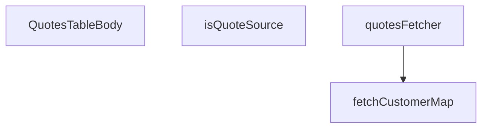

## Genel Bakış
Bu modül, admin panelindeki teklifler tablosunun gövdesini oluşturan ana React bileşenini ve bu bileşenin ihtiyaç duyduğu verileri sağlayan asenkron veri çekme fonksiyonlarını bir arada sunar. Temel sorumluluğu, teklif listesini veritabanından çekip ilgili müşteri bilgileriyle eşleştirmek ve sonuçları kullanıcının görüntüleyeceği şekilde bir araya getirmektir. Modül, teklif kaynak türlerinin doğrulanması gibi yardımcı işlevleri de içerir ve SOURCE_VALUES/STATUS_VALUES gibi harici sabitlere bağlıdır.

## Fonksiyon Grupları
### Veri Çekme ve Eşleştirme
Bu grup, asenkron olarak Supabase veritabanıyla etkileşime girerek ham teklif ve müşteri verilerini çeker. Teklif listesini alırken, her bir teklife ait müşteri kimliğini (CustomerIdentity) eşleştirerek zenginleştirilmiş bir veri kümesi oluşturur.
- fetchCustomerMap, quotesFetcher

### UI Bileşeni
Modülün ana çıktısı olan React bileşenidir. Sunucudan çekilen ve eşleştirilmiş teklif-veri setini alarak admin panelindeki tablonun gövdesini (satırlarını) render eder.
- QuotesTableBody

### Yardımcı Fonksiyonlar
Verilerin işlenmesi ve doğrulanması için kullanılan basit, saf yardımcı fonksiyonlar. Genellikle bir değer aralığına veya belirli bir tipe ait olup olmadığının kontrolü gibi tek amaçlı işleri yapar.
- isQuoteSource

---

## AXIOMS – Mimari Varsayımlar
Bu modül, Supabase veritabanından teklif ve müşteri verilerini çekerek admin tablosunu dolduran React bileşenidir. Veri çekme ve eşleştirme süreçleri kritik bağımlılıklara bağlıdır.

[Aksiyom 1]: Eğer `fetchCustomerMap` fonksiyonuna geçilen `userIds` dizisi boşsa, boş bir müşteri haritası ve `failed: false` durumu döner; eşleştirme yapılamaz.
[Aksiyom 2]: Eğer `fetchCustomerMap` fonksiyonuna geçilen `supabase` istemcisi geçersiz veya bağlantısaysa, Promise reddedilir veya `failed: true` ile sonuçlanır; müşteri bilgileri tam olarak yüklenemez.
[Aksiyom 3]: Eğer `quotesFetcher` fonksiyonuna geçilen `supabase` istemcisi geçersizse veya `params` geçerli bir sorgu parametresi içermiyse, teklif listesi çekilemez; bileşen boş veya hata durumunda kalır.
[Aksiyom 4]: Eğer `isQuoteSource` fonksiyonuna geçilen `value` parametresi `SOURCE_VALUES` sabitinde tanımlı bir değer değilse, `false` döner; bu durum filtreleme/gruplama mantığını etkiler.
[Aksiyom 5]: Eğer `QuotesTableBody` bileşeni render edilmeden önce `quotesFetcher` ve `fetchCustomerMap` çağrıları tamamlanmamışsa veya başarısız olmuşsa, tabloda veri gösterilemez veya eksik müşteri bilgileriyle gösterilir.
[Aksiyom 6]: Eğer `STATUS_VALUES` veya `SOURCE_VALUES` sabitleri modül içinde tanımsız veya boşsa, ilgili filtreleme ve sınıflandurma mantığı çalışmaz; bileşen beklenmeyen davranışı sergiler.

---

## FONKSİYON DETAYLARI

### isQuoteSource
**Ne yapar**: Verilen string değerinin `SOURCE_VALUES` sabit dizisi içinde yer alıp olmadığını kontrol ederek, o değerin geçerli bir `QuoteSource` tipi olup olmadığını doğrular. Fonksiyon, TypeScript'in tip daraltma (type narrowing) mekanizmasını tetikleyerek, çağrıldığı bağlamda `value` parametresinin `QuoteSource` tipine güvenli bir şekilde daraltılmasını sağlar.

**Nasıl yapar**: Fonksiyonun gövdesi, önceden tanımlanmış ve salt okunur (`readonly`) bir string dizisi olan `SOURCE_VALUES` sabitinin `.includes()` metodunu çağırır. Bu metod, `value` parametresinin dizide bulunup bulunmadığını kontrol eder. Fonksiyonun dönüş tipi `value is QuoteSource` olarak belirlenmiştir; bu bir TypeScript "tip predicate"ıdır. `true` döndüğünde, TypeScript derleyicisi bu fonksiyonun kullanıldığı herhangi bir koşul (if) bloğu içinde `value` parametresinin `QuoteSource` tipine安全 olduğunu (güvenli olduğunu) kabul eder ve buna göre_tip_state'_i günceller.

**Parametreler**:
- value: `string` — Kontrol edilecek ham string değeri. `SOURCE_VALUES` sabitindeki değerlerden biri olup olmadığı test edilir.

**Dönüş**: `value is QuoteSource` — Boole (`true`/`false`) döndürür. Ek olarak, dönüş tipi bir TypeScript tip predicate'ıdır; `true` sonucu, `value` parametresinin `QuoteSource` tipi ile uyumlu olduğunu ve ilgili kapsamda bu tipte kullanılabileceğini belirtir.

### fetchCustomerMap
**Ne yapar**: Verilen bir kullanıcı ID dizisi (`userIds`) için, her bir kullanıcının kimlik bilgilerini (ad ve e-posta) içeren bir `Map` nesnesi oluşturur ve bu verilerin başarıyla Fetch edilip edilemediğini belirten bir durum bayrağı (`failed`) ile birlikte döndürür. Fonksiyon, birincil veri kaynağının (RPC) başarısız olması durumunda alternatif bir veri kaynağına (fallback) geçerek hizmet sürekliliğini (service continuity) sağlamayı amaçlar.

**Nasıl yapar**: Fonksiyon, iki aşamalı bir veri zenginleştirmesi stratejisi izler. İlk olarak `userIds` dizisi boşsa, boş bir harita ile `failed: false` döndürerek hemen çıkar. Doluysa, Supabase istemcisi üzerinden `admin_list_all_users` RPC'sini çağırmayı dener. Bu RPC, kullanıcının `id`, `full_name` ve `email` bilgilerini döndürür. Eğer RPC başarılı olursa (`!error && data`), tüm bu bilgileri içeren bir harita oluşturulur ve `failed: false` ile birlikte döndürülür. Eğer RPC başarısız olursa (örn. 403 hatası, GRANT izni henüz prod ortamına uygulanmamış olabilir), fonksiyon sessizce bir fallback mekanizmasına geçer. Bu fallback, `user_profiles` tablosuna `id` ve `full_name` alanlarını sorgulayarak sadece isim bilgisini çekmeye çalışır. Bu durumda döndürülen haritada `email` alanları `null` olarak kalır ve `failed: true` döndürülerek, müşteri_lookup işleminin tam olarak gerçekleştirilemediği (sadece kısmi veri olduğu) çağrıya bildirilir.

**Parametreler**:
- supabase: `SupabaseClient<Database>` — Supabase istemci nesnesi. Generic olarak `Database` tipi ile parametrelenmiştir, bu sayede veritabanı şeması (tablolar, RPC'ler) hakkında tip bilgisine sahip olur ve güvenli sorgular yapılabilir.
- userIds: `string[]` — Kimlik bilgileri zenginleştirilecek kullanıcıların benzersiz tanımlayıcılarının (UUID'lerin) bulunduğu dizi.

**Dönüş**: `Promise<{ map: Map<string, CustomerIdentity>; failed: boolean }>` — Asenkron bir Promise döndürür. Çözülen değer bir nesnedir: `map`, kullanıcı ID'lerini (string) `CustomerIdentity` nesnelerine eşleyen bir `Map` koleksiyonudur (`CustomerIdentity` `{ name: string | null, email: string | null }` yapısındadır). `failed` alanı ise veri çekme işleminin (özellikle RPC'nin) başarıyla tamamlanıp tamamlanmadığını belirten bir boole değerdir; `true` olduğunda, `map` içindeki `email` alanlarının `null` olabileceği anlamına gelir.

### quotesFetcher
**Ne yapar**: Admin arayüzü için, filtreleme, arama, sıralama ve sayfalama parametrelerine göre `venthub_quotes` tablosundan satırları çeker; her bir alıntıya ait kalem maddelerini (`quote_items`) ve müşteri bilgilerini zenginleştirerek, toplam eşleşme sayısını da içeren [`FetchResult<QuoteAdminRow>`](<#>) formatında bir sonuç döndürür.

**Nasıl yapar**: Fonksiyon, bir dizi asenkron veritabanı işlemi ve veri birleştirme (enrichment) adımı izler. Öncelikle `ensureSessionFresh()` çağrısıyla mevcut oturumun (session) geçerliliğini doğrular. Ardından `venthub_quotes` tablosu üzerinde `count: 'exact'` ile bir sorgu başlatır. URL'den gelen `params.filters` içindeki `status` ve `source` dizileri, ilgili tip bekçileri (`isQuoteStatus`, [`isQuoteSource`](#isquotesource)) kullanılarak geçerli değerlere filtrelenir; bilinmeyen değerler atılır. Filtrelenmiş değerler `.eq()` (tek değer için) veya `.in()` (çoklu değer için) koşullarıyla sorguya eklenir. Arama terimi (`params.query`) varsa, `venthub_quote_items` tablosunda `product_name` alanı üzerinde `.ilike()` ile büyük/küçük harfe duyarsız arama yapılır ve eşleşen `quote_id`'ler ana sorguya `.in('id', ids)` koşulu olarak aktarılır. Sıralama, `params.sort.key` ve `params.sort.dir` değerlerine göre `status`, `source` veya `created_at` alanları üzerinde dinamik olarak `.order()` ile ayarlanır; belirtilmemişse `created_at` azalan sıralama varsayılır. Son olarak `.range()` ile sayfalama uygulanarak veriler ve toplam say (`count`) alınır. Alıntı satırları geldikten sonra, bu satırlara ait `venthub_quote_items` satırları toplu olarak çekilir ve `quote_id`'lere göre bir `Map`'te gruplanır. Ardından [`fetchCustomerMap`](#fetchcustomermap) fonksiyonu çağrılarak, alıntıların `user_id`'lerine karşılık gelen müşteri adı ve e-posta bilgileri alınır. Son adımda, orijinal alıntı verisi, gruplanmış kalem maddeleri ve müşteri bilgileri birleştirilerek `QuoteAdminRow` dizisi oluşturulur.

**Parametreler**:
- supabase: `SupabaseClient<Database>` — Supabase istemci nesnesi. Veritabanı şeması (`Database`) generic tipi ile parametrelenmiştir, bu sayede tablolar (`venthub_quotes`, `venthub_quote_items`, `user_profiles`), RPC'ler ve Relation (ilişki) tanımları hakkında derleme zamanı kontrolü sağlar.
- params: `FetchParams` — Fonksiyonun behaviour'unu (davranışını) tanımlayan, filtre, arama, sıralama ve sayfalama parametrelerini içeren nesne. Bu nesnenin yapısı şu alanları kapsar:
  - `filters`: `{ status?: string[]; source?: string[] }` — URL'den gelen ve sorguya uygulanacak filtre değerleri.
  - `query`: `string` — Arama terimi; kalem adları (`product_name`) üzerinde yapılacak arama için kullanılır.
  - `sort`: `{ key: string; dir: 'asc' | 'desc' } | null` — Sıralama kriteri ve yönü. `key` alanı sıralanacak sütun adını, `dir` alanı sıralama yönünü belirtir.
  - `page`: `number` — İstenen sayfa numarası (1'den başlar).
  - `pageSize`: `number` — Sayfa başına düşen satır sayısı.

**Dönüş**: `Promise<

### QuotesTableBody
**Ne yapar**: Admin panelindeki teklifler tablosunun gövde (tbody) bölümünü render eden React fonksiyonel bileşenidir. Tablodaki her bir teklif satırını, ilişkili kalemlerini ve müşteri bilgilerini görsel olarak sunar.

**Nasıl yapar**: Bir React Functional Component olarak tanımlanmıştır. Fonksiyon gövdesi boş bırakılmıştır; bileşenin gerçek implementasyonu belge kapsamında verilmemiştir. Genellikle bu tür bileşenler, üst bileşenden (ör. quotes listesi sayfası) gelen verileri props olarak alır veya bir hook kullanarak veri yönetimi yapar. Docstring'i de boş olan bu bileşen, tablonun satır yapısını ve hücre içeriğini render eden JSX'i döndürür.

**Parametreler**: Fonksiyon parametresi almaz. Bileşen düzeyinde olduğu için props'u parent bileşen tarafından belirlenir; ancak bu tanımda props yapısı verilmemiştir.

**Dönüş**: `React.FC` — React Functional Component tipinde, JSX içeriği döndüren bir bileşendir.

---

## İTHALATLAR (IMPORTS)
- import: ../../../components/admin/AdminEmptyState::AdminEmptyState
- import: ../../../components/admin/AdminToolbar::AdminToolbar
- import: ../../../components/admin/data-table/DataTableKit::DataTableKit
- import: ../../../components/admin/data-table/FacetedFilter::FacetedFilter
- import: ../../../components/admin/data-table/types::type { AdminColumn, DataTableFacet }
- import: ../../../hooks/useAdminTable::type FetchParams
- import: ../../../hooks/useAdminTable::type FetchResult
- import: ../../../hooks/useAdminTable::useAdminTable
- import: ../../../hooks/useRole::useRole
- import: ../../../i18n/I18nProvider::useI18n
- import: ../../../i18n/datetime::formatDate
- import: ../../../i18n/datetime::formatTime
- import: ../../../i18n/format::formatCurrency
- import: ../../../lib/ensureSessionFresh::ensureSessionFresh
- import: ../../../types/database.types::type { Database }
- import: ../../../utils/adminUi::adminTableActionPrimaryClass
- import: @/lib/admin/mutateWithAudit::AdminPermissionError
- import: @/lib/admin/mutateWithAudit::mutateWithAudit
- import: @/lib/quotes/quoteStatusMachine::allowedAdminQuoteActions
- import: @/lib/quotes/quoteStatusMachine::isQuoteStatus
- import: @/lib/supabase/client::supabaseBrowserClient
- import: @supabase/supabase-js::type { SupabaseClient }
- import: react::React
- import: react::useCallback
- import: react::useEffect
- import: react::useMemo
- import: react::useState
- import: sonner::toast

---

## INTERFACES

### QuoteAdminRow extends QuoteRow
Admin teklif kuyruğu — T067-VH (cetvel Q7: DataTableKit + useAdminTable + mutateWithAudit; yeni sayfa kendi dizininde, kit çekirdeğine dokunulmaz). Statü aksiyonları SSOT'tan çizilir (`allowedAdminQuoteActions`, R1); fiyatlama yalnız buradan yazılır (cetvel Q3/R5 — DB tarafı kolon-grant ile ayrıca k
- `items: QuoteItemRow[]`
- `customer_name: string | null`
- `customer_email: string | null`
- `customerLookupFailed: boolean`

### CustomerIdentity
- `name: string | null`
- `email: string | null`

### PriceDraft
Kalem fiyat taslağı — kaydedilene kadar yerel.
- `unit_price: string`
- `currency: string`
- `valid_until: string`

---

## SABİTLER
- **STATUS_VALUES** (as_expression) — `['requested', 'quoted', 'accepted', 'rejected', 'expired'] as const`
- **SOURCE_VALUES** (as_expression) — `['pdp', 'cart', 'project'] as const`

---

## AST POINTERS

### [N1_NASIL] AST Pointer: QuotesTableBody.tsx::isQuoteSource
- **params**: `value: string`
- **ic_degiskenler**: (yok — tek satırlık guard fonksiyonu)
- **Dönüş**: `value is QuoteSource` (type guard boolean)

### [N2_NASIL] AST Pointer: QuotesTableBody.tsx::fetchCustomerMap
- **params**: `supabase: SupabaseClient<Database>`, `userIds: string[]`
- **ic_degiskenler**:
  - `map` — `Map<string, CustomerIdentity>`, userId→{name,email} eşlemesi; hem rpc hem fallback yolunda doldurulur
  - `data` — `supabase.rpc('admin_list_all_users')` yanıtının successfully case'deki satırları
  - `error` — rpc çağrısının hata nesnesi; falsy ise ana yol çalışır
  - `profiles` — fallback yolu: `user_profiles` tablosundan dönen `{id, full_name}` satırları
  - `profileError` — fallback sorgusunun hata nesnesi
- **Dönüş**: `{ map: Map<string, CustomerIdentity>; failed: boolean }` — `failed=true` ise rpc başarısız olup fallback kullanılmıştır

### [N3_NASIL] AST Pointer: QuotesTableBody.tsx::quotesFetcher
- **params**: `supabase: SupabaseClient<Database>`, `params: FetchParams`
- **ic_degiskenler**:
  - `statuses` — `params.filters.status` dizisinin `isQuoteStatus` ile süzülmüş hali; geçerli enum değerleri
  - `sources` — `params.filters.source` dizisinin `isQuoteSource` ile süzülmüş hali; geçerli kaynak değerleri
  - `term` — `params.query` trimmed arama terimi; ürün adı üzerinden quote_id araması için kullanılır
  - `matches` — `venthub_quote_items` tablosunda `ilike` ile eşleşen satırlar `{quote_id}[]`
  - `matchError` — arama sorgusunun hata nesnesi
  - `ids` — eşleşen quote_id'lerin tekilleştirilmiş (unique) dizisi
  - `sortKey` — sıralama kolonu adı (`params.sort?.key`)
  - `ascending` — sıralama yönü (`params.sort?.dir === 'asc'`)
  - `offset` — sayfalama başlangıç indeksi: `(params.page - 1) * params.pageSize`
  - `data` — ana sorgunun döndürdüğü `venthub_quotes` satırları (sayfalı)
  - `error` — ana sorgu hata nesnesi
  - `count` — Supabase count exact sonucu; toplam eşleşme sayısı
  - `quotes` — `data ?? []`, boşsa erken dönüş yapılır
  - `totalMatched` — `count` sayıysa onu, değilse `quotes.length` kullanılır
  - `items` — ilgili quote'lara ait `venthub_quote_items` satırları (`quote_id IN (...)`)
  - `itemsError` — items sorgusunun hata nesnesi
  - `itemsByQuote` — `Map<string, QuoteItemRow[]>`, quote_id→items eşlemesi; döngüyle doldurulur
  - `list` — döngü içinde mevcut quote'a ait geçici item dizisi referansı
  - `customers` — `fetchCustomerMap` sonucundaki `map` alanı; user_id→{name,email}
  - `failed` — müşteri lookup'ının rpc ile başarısız olup olmadığını gösteren boolean
  - `rows` — birleştirilmiş `QuoteAdminRow[]` dizisi; quote + items + customer bilgisi
- **Dönüş**: `FetchResult<QuoteAdminRow>` — `{ rows: QuoteAdminRow[]; totalMatched: number }`

### [N4_NASIL] AST Pointer: QuotesTableBody.tsx::QuotesTableBody
- **params**: (yok — React functional component)
- **ic_degiskenler** (component gövdesinde derived/internal):
  - `status` — `Record<string, number>`, facetCounts içindeki status dağılımı; her durumdan kaç tane olduğunu tutar
  - `source` — `Record<string, number>`, facetCounts içindeki source dağılımı; her kaynaktan kaç tane olduğunu tutar
  - `row` — `QuoteAdminRow`, tablodaki tekil satır; detail/save/status cell render'larında kullanılır
  - `draft` — `{ unit_price, currency, valid_until }` nesnesi; item draft editörünün varsayılan veya mevcut değerleri
  - `price` — `draft.unit_price`'ten elde edilen parse edilmiş sayı veya `null` (boşsa)
  - `updates` — güncellenecek item listesi: `{ itemId, unit_price, currency, valid_until }[]`; savePrices callback'inde oluşturulur
  - `oldStatus` — durum güncellemeden önceki `row.status` değeri; audit before kaydı için kullanılır
  - `newStatus` — güncellenecek hedef durum string'i; handleStatusUpdate parametresi
  - `allowed` — `allowedAdminQuoteActions(row.status)` ile elde edilen izin verilen geçiş listesi
  - `next` — sütun actions hücresinde, mevcut duruma göre yapılabilecek sonraki durumlar dizisi (`allowedAdminQuoteActions(r.status)`)
  - `message` — müşteriye gönderilecek e-posta metni; quoted/expired durumuna göre Türkçe mesaj
  - `editable` — `hasWriteAccess && row.status === 'requested'` boolean'ı; item fiyat düzenleme modu aktif mi
  - `facet` — filtre panelinde tekil facet tanımı `{ key, label, options }`; FacetedFilter'a passed edilir
- **Dönüş**: `React.FC` — JSX (DataTableKit ile admin quote tablosu render eder); doğrudan JSX döner

### [N5_NASIL] AST Pointer: QuotesTableBody.tsx::savePrices (nested async callback)
- **params**: `row: QuoteAdminRow`
- **ic_degiskenler**:
  - `updates` — filtrelenmiş geçerli fiyat güncellemeleri dizisi: `{ itemId, unit_price, currency, valid_until }[]`
  - `item` — `row.items` üzerindeki her bir kalem; draft eşleştirilmesi yapılır
  - `draft` — `drafts[item.id]` erişimi ile elde edilen draft nesnesi
  - `price` — `draft.unit_price.trim()` boşsa `null`, değilse `Number()` ile parse
  - `u` — `updates` dizisi üzerindeki her bir güncelleme objesi
- **Dönüş**: yok (Promise<void>); yan etki: `mutateWithAudit` ile DB günceller, `toast.success` gösterir, `table.reload()` çağırır

### [N6_NASIL] AST Pointer: QuotesTableBody.tsx::handleStatusUpdate (nested async callback)
- **params**: `row: QuoteAdminRow`, `newStatus: string`
- **ic_degiskenler**:
  - `allowed` — `allowedAdminQuoteActions(row.status)` ile elde edilen izin verilen geçişler dizisi
  - `oldStatus` — `row.status`, güncelleme öncesi mevcut durum; audit `before` kaydı için
  - `message` — müşteri e-postası için metin; `newStatus` değerine göre quoted veya expired Türkçe bildirim
- **Dönüş**: yok (Promise<void>); yan etki: `mutateWithAudit` ile durum günceller, müşteri e-postası bildirimi gönderir, `toast` gösterir

### [N7_NASIL] AST Pointer: QuotesTableBody.tsx::renderItemDetails (nested callback — detail expand)
- **params**: `row: QuoteAdminRow`
- **ic_degiskenler**:
  - `editable` — `hasWriteAccess && row.status === 'requested'`, item edit modu aktif mi
  - `item` — `row.items.map()` içindeki her bir `QuoteItemRow`
  - `draft` — `drafts[item.id] ?? { ... }` fallback ile oluşturulan geçici edit draft nesnesi; `unit_price`, `currency`, `valid_until` alanları
- **Dönüş**: `React.ReactNode` — item düzenleme formu JSX'i; fiyat, para birimi ve geçerlilik tarihi input'ları

### [N8_NASIL] AST Pointer: QuotesTableBody.tsx::columns (nested callback — tablo sütun tanımları)
- **params**: (yok — useMemo/kapalı fonksiyon)
- **ic_degiskenler**:
  - `r` — her sütun `cell` callback'indeki `QuoteAdminRow` satır parametresi
  - `next` — `allowedAdminQuoteActions(r.status)` ile mevcut satır için izin verilen sonraki durumlar
- **Dönüş**: `ColumnDef[]` dizisi — 6 sütun: customer, items, source, status, created_at, actions

### [N9_NASIL] AST Pointer: QuotesTableBody.tsx::getStatusIcon (nested callback)
- **params**: `status: string`
- **ic_degiskenler**: (yok)
- **Dönüş**: `React.ReactNode` — lucide-react icon bileşeni (Clock, FileText, CheckCircle, XCircle, Hourglass)

### [N10_NASIL] AST Pointer: QuotesTableBody.tsx::getStatusColor (nested callback)
- **params**: `status: string`
- **ic_degiskenler**: (yok)
- **Dönüş**: `string` — Tailwind CSS class string'i; duruma göre bg/text/border renkleri

### [N11_NASIL] AST Pointer: QuotesTableBody.tsx::fetchFacetCounts (nested async callback)
- **params**: (yok)
- **ic_degiskenler**:
  - `data` — `venthub_quotes` tablosundan `{status, source}` seçilen satırlar
  - `error` — Supabase sorgu hata nesnesi
  - `status` — `Record<string, number>`, her status değerinin sayacı
  - `source` — `Record<string, number>`, her source değerinin sayacı
  - `row` — `data` üzerindeki her bir satır; status/source sayacı artırılır
- **Dönüş**: yok (Promise<void>); yan etki: `setFacetCounts` ile state günceller

### [N12_NASIL] AST Pointer: QuotesTableBody.tsx::facets (nested callback — filtre tanımları)
- **params**: (yok — useMemo/kapalı fonksiyon)
- **ic_degiskenler**:
  - `facet` — `FacetedFilter` bileşeninepassed edilen tekil facet nesnesi
- **Dönüş**: dizi — 2 facet tanımı: `status` ve `source`; her biri `{ key, label, options: { value, label, count }[] }`

---

## MERMAID CALL GRAPH

## NODE ID STANDARD

  file: src\views\admin\quotes\QuotesTableBody.tsx
  function: src\views\admin\quotes\QuotesTableBody.tsx::isQuoteSource
  function: src\views\admin\quotes\QuotesTableBody.tsx::fetchCustomerMap
  function: src\views\admin\quotes\QuotesTableBody.tsx::quotesFetcher
  function: src\views\admin\quotes\QuotesTableBody.tsx::QuotesTableBody

---

## DISA AKTARILANLAR (EXPORTS)
  export: QuotesTableBody
  export: fetchCustomerMap
  export: isQuoteSource
  export: quotesFetcher

---

## BILEŞIM (CONTAINS)
  contains: QuoteRow

---

## STİL TOKENLERİ

### Arbitrary Değerler (token'a geçirilmemiş)
Yok — tüm stiller token'a geçirilmiş. ✅

### Kullanılan Token'lar (zaten token'a geçirilmiş)
- (yok)

### Tailwind Sınıf Özeti
- **Renkler:** `bg-admin-accent`, `bg-admin-surface`, `border-admin-border`, `border-current`, `border-t-transparent`, `text-admin-accent`, `text-admin-danger`, `text-admin-fg`, `text-admin-fg-muted`, `text-admin-fg-subtle`, `text-admin-success`, `text-admin-warning`, `text-sm`, `text-xs`
- **Layout:** `!h-7`, `flex`, `flex-col`, `flex-wrap`, `gap-0.5`, `gap-1`, `gap-1.5`, `gap-2`, `gap-3`, `grid`, `grid-cols-1`, `h-0.5`, `h-3`, `h-9`, `inline-flex`
- **Varyant/Responsive:** `disabled:`, `focus-visible:`, `sm:` önekleri
- **Yardımcı Sınıflar:** `!px-3`, `!px-4`, `${adminTableActionPrimaryClass`, `${getStatusColor(r.status`, `animate-in`, `animate-spin`, `border`, `break-words`, `disabled:opacity-50`, `duration-300`, `fade-in`, `focus-visible:outline-none`, `focus-visible:ring-2`, `focus-visible:ring-admin-accent/40`, `font-bold`