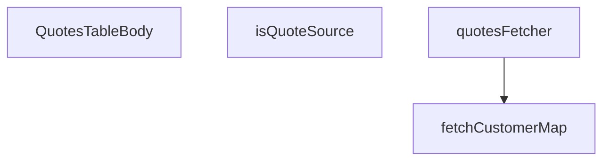

## Genel Bakış
Bu modül, admin panelindeki tekliflerin listelendiği tablonun gövde kısmını oluşturan React bileşenini ve ilgili veri çekme mantığını içerir. Supabase veritabanından teklif verilerini çeker, müşteri bilgilerini eşleştirerek tablo satırlarını hazırlar ve render eder.

## Fonksiyon Grupları
### Veri Çekme ve İşleme
Teklif ve müşteri verilerini Supabase veritabanından asenkron olarak çeker, işler ve bileşenin kullanıma hazır hale getirir.
- fetchCustomerMap, quotesFetcher

### Yardımcı Fonksiyonlar
Veri doğrulama ve kontrol gibi yardımcı işlemleri gerçekleştirir.
- isQuoteSource

### Ana Bileşen
Tablo gövdesini oluşturan ve render eden ana React bileşenidir.
- QuotesTableBody

### Bağımlılıklar
Modül, dışarıdan sağlanan SupabaseClient, Database, FetchParams, FetchResult, QuoteAdminRow ve CustomerIdentity gibi türlere bağlıdır. Dinamik veya lazy yüklenen modül bilgisi mevcut değildir.

---

## AXIOMS – Mimari Varsayımlar
- Bu modül davranışsal mantık içermez (salt veri / konfigürasyon / tip tanımı).
- [Aksiyom 1]: Modülün dışa açtığı yapı (anahtar kümesi / şema) bir sözleşmedir; tüketiciler bu sabit yapıya bağlıdır — kırıcı değişiklik tüm tüketicileri etkiler.
- [Aksiyom 2]: Bir öğe ekleme/çıkarma yapısal-uyumlu olmalı; ilgili tipler ve seçiciler aynı commit'te güncel tutulmalıdır.

---

## FONKSİYON DETAYLARI

### isQuoteSource
**Ne yapar**: Verilen string değerini `QuoteSource` tipine daraltan bir type guard fonksiyonudur. Geçerli kaynak değerlerini tanımlayan `SOURCE_VALUES` sabit dizisiyle eşleşme kontrolü yaparak, TypeScript derleyicisine bu değerin `QuoteSource` olduğunu garanti eder.

**Nasıl yapar**: `SOURCE_VALUES` sabitini `readonly string[]` tipine zorlayarak (type assertion) `includes` metodunu çağırır. Bu sayede hem derleme anında tip güvenliği hem de çalışma anında değer doğrulaması sağlanmış olur.

**Parametreler**:
- value: string — Doğrulanacak kaynak değeri

**Dönüş**: value is QuoteSource — TypeScript tip daraltma (type narrowing) dönüşü; değer `SOURCE_VALUES` içinde mevcutsa `true`, değilse `false` döner.

### fetchCustomerMap
**Ne yapar**: Geliştirildi ancak detay üretilemedi.

### quotesFetcher
**Ne yapar**: Geliştirildi ancak detay üretilemedi.

### QuotesTableBody
**Ne yapar**: Geliştirildi ancak detay üretilemedi.

---

## İTHALATLAR (IMPORTS)
- import: ../../../components/admin/AdminEmptyState::AdminEmptyState
- import: ../../../components/admin/AdminToolbar::AdminToolbar
- import: ../../../components/admin/data-table/DataTableKit::DataTableKit
- import: ../../../components/admin/data-table/FacetedFilter::FacetedFilter
- import: ../../../components/admin/data-table/types::type { AdminColumn, DataTableFacet }
- import: ../../../hooks/useAdminTable::type FetchParams
- import: ../../../hooks/useAdminTable::type FetchResult
- import: ../../../hooks/useAdminTable::useAdminTable
- import: ../../../hooks/useRole::useRole
- import: ../../../i18n/I18nProvider::useI18n
- import: ../../../i18n/datetime::formatDate
- import: ../../../i18n/datetime::formatTime
- import: ../../../i18n/format::formatCurrency
- import: ../../../lib/ensureSessionFresh::ensureSessionFresh
- import: ../../../types/database.types::type { Database }
- import: ../../../utils/adminUi::adminTableActionPrimaryClass
- import: @/lib/admin/mutateWithAudit::AdminPermissionError
- import: @/lib/admin/mutateWithAudit::mutateWithAudit
- import: @/lib/quotes/quoteStatusMachine::allowedAdminQuoteActions
- import: @/lib/quotes/quoteStatusMachine::isQuoteStatus
- import: @/lib/supabase/client::supabaseBrowserClient
- import: @supabase/supabase-js::type { SupabaseClient }
- import: react::React
- import: react::useCallback
- import: react::useEffect
- import: react::useMemo
- import: react::useState
- import: sonner::toast

---

## INTERFACES

### QuoteAdminRow extends QuoteRow
Admin teklif kuyruğu — T067-VH (cetvel Q7: DataTableKit + useAdminTable + mutateWithAudit; yeni sayfa kendi dizininde, kit çekirdeğine dokunulmaz). Statü aksiyonları SSOT'tan çizilir (`allowedAdminQuoteActions`, R1); fiyatlama yalnız buradan yazılır (cetvel Q3/R5 — DB tarafı kolon-grant ile ayrıca k
- `items: QuoteItemRow[]`
- `customer_name: string | null`
- `customer_email: string | null`
- `customerLookupFailed: boolean`

### CustomerIdentity
- `name: string | null`
- `email: string | null`

### PriceDraft
Kalem fiyat taslağı — kaydedilene kadar yerel.
- `unit_price: string`
- `currency: string`
- `valid_until: string`

---

## SABİTLER
- **STATUS_VALUES** (as_expression) — `['requested', 'quoted', 'accepted', 'rejected', 'expired'] as const`
- **SOURCE_VALUES** (as_expression) — `['pdp', 'cart', 'project'] as const`

---

## AST POINTERS

### [N1_NASIL] AST Pointer: src/views/admin/quotes/QuotesTableBody.tsx::isQuoteSource
- **params**: `value: string` — kontrol edilecek kaynak değeri
- **ic_degiskenler**: yok
- **Dönüş**: `boolean` — value'nun SOURCE_VALUES dizisinde bulunup bulunmadığı

---

### [N2_NASIL] AST Pointer: src/views/admin/quotes/QuotesTableBody.tsx::fetchCustomerMap
- **params**: `supabase: SupabaseClient<Database>` — Supabase istemcisi, `userIds: string[]` — müşteri kimlikleri dizisi
- **ic_degiskenler**:
  - `map` — `new Map<string, CustomerIdentity>()` ile oluşturulan, kullanıcı ID'sini müşteri kimliğine eşleyen harita
  - `data` — `supabase.rpc('admin_list_all_users')` çağrısından dönen kullanıcı listesi
  - `error` — RPC çağrısının hata durumu
  - `u` — döngüdeki her bir kullanıcı nesnesi; `u.id`, `u.full_name`, `u.email` alanlarına erişilir
  - `profiles` — `supabase.from('user_profiles').select('id, full_name').in('id', userIds)` sorgusundan dönen profil listesi (fallback)
  - `profileError` — user_profiles sorgusunun hata durumu
  - `p` — döngüdeki her bir profil nesnesi; `p.id`, `p.full_name` alanlarına erişilir
- **Dönüş**: `Promise<{ map: Map<string, CustomerIdentity>; failed: boolean }>` — müşteri haritası ve başarısızlık durumu

---

### [N3_NASIL] AST Pointer: src/views/admin/quotes/QuotesTableBody.tsx::quotesFetcher
- **params**: `supabase: SupabaseClient<Database>` — Supabase istemcisi, `params: FetchParams` — filtreleme, sayfalama ve sıralama parametreleri
- **ic_degiskenler**:
  - `query` — `supabase.from('venthub_quotes').select('*', { count: 'exact' })` ile oluşturulan temel sorgu
  - `statuses` — `params.filters.status` dizisinin `isQuoteStatus` ile daraltılmış hali
  - `sources` — `params.filters.source` dizisinin `isQuoteSource` ile daraltılmış hali
  - `term` — `params.query.trim()` ile elde edilen arama terimi
  - `matches` — `supabase.from('venthub_quote_items').select('quote_id').ilike('product_name', ...)` sorgusundan dönen eşleşen kalem listesi
  - `matchError` — kalem arama sorgusunun hata durumu
  - `ids` — eşleşen kalemlerden çıkarılan benzersiz quote_id dizisi (`new Set` ile)
  - `sortKey` — `params.sort?.key` ile elde edilen sıralama anahtarı
  - `ascending` — `params.sort?.dir === 'asc'` kontrolüyle belirlenen sıralama yönü
  - `offset` — `(params.page - 1) * params.pageSize` ile hesaplanan sayfa başlangıcı
  - `data` — `query.range(offset, offset + params.pageSize - 1)` sorgusundan dönen teklif satırları
  - `error` — ana sorgunun hata durumu
  - `count` — sorgudan dönen toplam eşleşme sayısı
  - `quotes` — `data ?? []` ile null-safe alınan teklif dizisi
  - `totalMatched` — `typeof count === 'number' ? count : quotes.length` ile belirlenen toplam eşleşme
  - `items` — `supabase.from('venthub_quote_items').select('*').in('quote_id', ...)` sorgusundan dönen kalem listesi
  - `itemsError` — kalem sorgusunun hata durumu
  - `itemsByQuote` — `new Map<string, QuoteItemRow[]>()` ile oluşturulan, quote_id'ye göre kalemleri gruplayan harita
  - `item` — döngüdeki her bir kalem nesnesi; `item.quote_id` alanına erişilir
  - `list` — `itemsByQuote.get(item.quote_id) ?? []` ile elde edilen geçici kalem listesi
  - `customers` — `fetchCustomerMap` çağrısından dönen müşteri haritası
  - `failed` — `fetchCustomerMap` çağrısının başarısızlık durumu
  - `rows` — `quotes.map((q) => ({...}))` ile oluşturulan nihai `QuoteAdminRow` dizisi
  - `q` — döngüdeki her bir teklif nesnesi; `q.id`, `q.user_id` alanlarına erişilir
- **Dönüş**: `Promise<FetchResult<QuoteAdminRow>>` — satırlar ve toplam eşleşme sayısı

---

### [N4_NASIL] AST Pointer: src/views/admin/quotes/QuotesTableBody.tsx::QuotesTableBody
- **params**: yok
- **ic_degiskenler**:
  - `supabaseBrowserClient` — import edilen Supabase tarayıcı istemcisi
  - `t` — çeviri fonksiyonu (i18n)
  - `lang` — mevcut dil kodu
  - `hasWriteAccess` — yazma yetkisi olup olmadığını gösteren boolean
  - `drafts` — kalem fiyat taslaklarını tutan state; anahtar olarak `item.id`, değer olarak `{ unit_price, currency, valid_until }` nesnesi
  - `setDrafts` — `drafts` state'ini güncelleyen setter fonksiyonu
  - `updatingId` — şu anda güncellenen satırın ID'sini tutan state
  - `setUpdatingId` — `updatingId` state'ini güncelleyen setter fonksiyonu
  - `facetCounts` — `{ status: Record<string, number>, source: Record<string, number> }` şeklinde facet sayımlarını tutan state
  - `setFacetCounts` — `facetCounts` state'ini güncelleyen setter fonksiyonu
  - `table` — `DataTableKit` bileşeninden dönen tablo nesnesi; `table.reload()`, `table.filtering.filters`, `table.filtering.setFilter` metotlarına erişilir
  - `fetchFacetCounts` — async fonksiyon; `supabaseBrowserClient.from('venthub_quotes').select('status, source')` sorgusuyla facet sayımlarını çeker
  - `data` — facet sorgusundan dönen satırlar dizisi; `row.status`, `row.source` alanlarına erişilir
  - `error` — facet sorgusunun hata durumu
  - `status` — durum sayımlarını tutan `Record<string, number>` nesnesi
  - `source` — kaynak sayımlarını tutan `Record<string, number>` nesnesi
  - `row` — döngüdeki her bir facet satırı
  - `getStatusIcon` — status parametresi alan fonksiyon; duruma göre lucide-react ikonu döner (`Clock`, `FileText`, `CheckCircle`, `XCircle`, `Hourglass`)
  - `getStatusColor` — status parametresi alan fonksiyon; duruma göre CSS sınıfı döner
  - `getStatusLabel` — status parametresi alan fonksiyon; duruma göre etiket döner
  - `savePrices` — async fonksiyon; `row: QuoteAdminRow` parametresi alır, kalem fiyatlarını kaydeder
  - `updates` — `row.items.map(...)` ile oluşturulan, geçerli fiyat güncellemelerini içeren dizi
  - `item` — döngüdeki her bir kalem nesnesi; `item.id` alanına erişilir
  - `draft` — `drafts[item.id]` ile elde edilen taslak nesne; `draft.unit_price`, `draft.currency`, `draft.valid_until` alanlarına erişilir
  - `price` — `draft.unit_price`'ın sayısal karşılığı (boşsa null)
  - `u` — döngüdeki her bir güncelleme nesnesi; `u.itemId`, `u.unit_price`, `u.currency`, `u.valid_until` alanlarına erişilir
  - `e` — yakalanan hata nesnesi; `AdminPermissionError` instance kontrolü yapılır
  - `handleStatusUpdate` — async fonksiyon; `row: QuoteAdminRow` ve `newStatus: string` parametreleri alır, teklif durumunu günceller
  - `allowed` — `allowedAdminQuoteActions(row.status)` ile elde edilen izin verilen durumlar dizisi
  - `oldStatus` — `row.status` ile elde edilen eski durum
  - `message` — müşteri bildirim mesajı; `newStatus === 'quoted'` veya `newStatus === 'expired` durumuna göre belirlenir
  - `renderDetail` — fonksiyon; `row: QuoteAdminRow` parametresi alır, detay görünümünü render eder
  - `editable` — `hasWriteAccess && row.status === 'requested'` kontrolüyle belirlenen düzenleme durumu
  - `columns` — fonksiyon; tablo sütun tanımlarını döner (`customer`, `items`, `source`, `status`, `created_at`, `actions`)
  - `r` — sütun cell fonksiyonlarındaki her bir satır nesnesi; `r.customer_name`, `r.user_id`, `r.customer_email`, `r.customerLookupFailed`, `r.items`, `r.source`, `r.status`, `r.created_at` alanlarına erişilir
  - `next` — `allowedAdminQuoteActions(r.status)` ile elde edilen sonraki durumlar dizisi
  - `status` — döngüdeki her bir durum değeri
  - `facets` — fonksiyon; facet filtre tanımlarını döner (`status`, `source`)
  - `facet` — döngüdeki her bir facet nesnesi; `facet.key` alanına erişilir
  - `values` — facet filtre değişikliğindeki yeni değerler dizisi
- **Dönüş**: `React.FC` — teklifler tablosu gövdesini render eden React bileşeni

---

## MERMAID CALL GRAPH

## NODE ID STANDARD

  file: QuotesTableBody.tsx
  function: QuotesTableBody.tsx::isQuoteSource
  function: QuotesTableBody.tsx::fetchCustomerMap
  function: QuotesTableBody.tsx::quotesFetcher
  function: QuotesTableBody.tsx::QuotesTableBody

---

## DISA AKTARILANLAR (EXPORTS)
  export: QuotesTableBody
  export: fetchCustomerMap
  export: isQuoteSource
  export: quotesFetcher

---

## BILEŞIM (CONTAINS)
  contains: QuoteRow

---

## STİL TOKENLERİ

### Arbitrary Değerler (token'a geçirilmemiş)
Yok — tüm stiller token'a geçirilmiş. ✅

### Kullanılan Token'lar (zaten token'a geçirilmiş)
- (yok)

### Tailwind Sınıf Özeti
- **Renkler:** `bg-admin-accent`, `bg-admin-surface`, `border-admin-border`, `border-current`, `border-t-transparent`, `text-admin-accent`, `text-admin-danger`, `text-admin-fg`, `text-admin-fg-muted`, `text-admin-fg-subtle`, `text-admin-success`, `text-admin-warning`, `text-sm`, `text-xs`
- **Layout:** `!h-7`, `flex`, `flex-col`, `flex-wrap`, `gap-0.5`, `gap-1`, `gap-1.5`, `gap-2`, `gap-3`, `grid`, `grid-cols-1`, `h-0.5`, `h-3`, `h-9`, `inline-flex`
- **Varyant/Responsive:** `disabled:`, `focus-visible:`, `sm:` önekleri
- **Yardımcı Sınıflar:** `!px-3`, `!px-4`, `${adminTableActionPrimaryClass`, `${getStatusColor(r.status`, `animate-in`, `animate-spin`, `border`, `break-words`, `disabled:opacity-50`, `duration-300`, `fade-in`, `focus-visible:outline-none`, `focus-visible:ring-2`, `focus-visible:ring-admin-accent/40`, `font-bold`