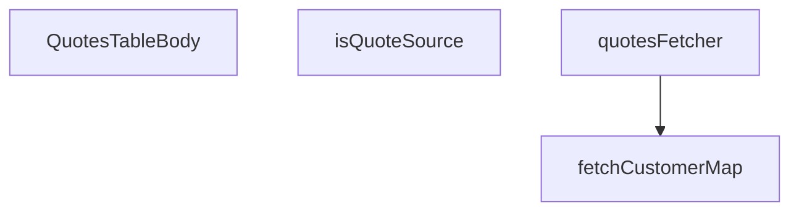

## Genel Bakış
Bu modül, admin panelindeki tekliflerin listelendiği tablonun gövde kısmını oluşturan React bileşenini ve ilgili veri çekme mantığını içerir. Supabase veritabanından teklif verilerini çeker, müşteri bilgilerini eşleştirerek tablo satırlarını hazırlar ve render eder.

## Fonksiyon Grupları
### Veri Çekme ve İşleme
Teklif ve müşteri verilerini Supabase veritabanından asenkron olarak çeker, işler ve bileşenin kullanıma hazır hale getirir.
- fetchCustomerMap, quotesFetcher

### Yardımcı Fonksiyonlar
Veri doğrulama ve kontrol gibi yardımcı işlemleri gerçekleştirir.
- isQuoteSource

### Ana Bileşen
Tablo gövdesini oluşturan ve render eden ana React bileşenidir.
- QuotesTableBody

### Bağımlılıklar
Modül, dışarıdan sağlanan SupabaseClient, Database, FetchParams, FetchResult, QuoteAdminRow ve CustomerIdentity gibi türlere bağlıdır. Dinamik veya lazy yüklenen modül bilgisi mevcut değildir.

---

## AXIOMS – Mimari Varsayımlar
- Bu modül davranışsal mantık içermez (salt veri / konfigürasyon / tip tanımı).
- [Aksiyom 1]: Modülün dışa açtığı yapı (anahtar kümesi / şema) bir sözleşmedir; tüketiciler bu sabit yapıya bağlıdır — kırıcı değişiklik tüm tüketicileri etkiler.
- [Aksiyom 2]: Bir öğe ekleme/çıkarma yapısal-uyumlu olmalı; ilgili tipler ve seçiciler aynı commit'te güncel tutulmalıdır.

---

## FONKSİYON DETAYLARI

### isQuoteSource
**Ne yapar**: Verilen string değerini `QuoteSource` tipine daraltan bir type guard fonksiyonudur. Geçerli kaynak değerlerini tanımlayan `SOURCE_VALUES` sabit dizisiyle eşleşme kontrolü yaparak, TypeScript derleyicisine bu değerin `QuoteSource` olduğunu garanti eder.

**Nasıl yapar**: `SOURCE_VALUES` sabitini `readonly string[]` tipine zorlayarak (type assertion) `includes` metodunu çağırır. Bu sayede hem derleme anında tip güvenliği hem de çalışma anında değer doğrulaması sağlanmış olur.

**Parametreler**:
- value: string — Doğrulanacak kaynak değeri

**Dönüş**: value is QuoteSource — TypeScript tip daraltma (type narrowing) dönüşü; değer `SOURCE_VALUES` içinde mevcutsa `true`, değilse `false` döner.

### fetchCustomerMap
**Ne yapar**: Geliştirildi ancak detay üretilemedi.

### quotesFetcher
**Ne yapar**: Admin panelindeki teklifler (quotes) tablosu için Supabase'den veri çeker. Filtreleme, arama, sıralama ve sayfalama işlemlerini uygulayarak her teklifin kalemlerini (items) ve müşteri bilgilerini birleştirip `QuoteAdminRow` formatında sonuç döndürür.

**Nasıl yapar**: Önce `ensureSessionFresh()` ile oturumun güncel olduğundan emin olur. `venthub_quotes` tablosu üzerinde `count: 'exact'` ile toplam kayıt sayısını da alacak bir sorgu oluşturur. URL'den gelen `status` ve `source` filtre değerlerini ilgili doğrulama fonksiyonları (`isQuoteStatus`, `isQuoteSource`) ile daraltır; bilinmeyen değerler sessizce süzülür ve sorguya sızmaz. Tek değer varsa `eq`, birden fazlaysa `in` operatörü kullanılır. Arama terimi (`params.query`) varsa `venthub_quote_items` tablosunda `product_name` alanı üzerinde `ilike` ile eşleşen `quote_id` değerleri bulunur; eşleşme yoksa boş sonuç dönülür. Sıralama `status`, `source` veya `created_at` anahtarlarına göre uygulanır; belirtilmemişse varsayılan olarak `created_at` azalan sıradadır. Sayfalama `offset` ve `range` ile gerçekleştirilir. Ana sorgu tamamlandıktan sonra, bulunan tekliflerin kalem bilgileri `venthub_quote_items` tablosundan toplu olarak çekilir ve `quote_id` bazlı bir `Map` yapısına gruplanır. Ardından `fetchCustomerMap` ile yalnızca `user_id` değeri null olmayan (yani hesaplı) tekliflerin müşteri adı ve e-posta bilgileri çekilir. Son olarak her teklif nesnesine kalem listesi, müşteri adı, müşteri e-postası ve müşteri arama başarısızlık durumu eklenerek `QuoteAdminRow` dizisi oluşturulur.

**Parametreler**:
- supabase: `SupabaseClient<Database>` — Supabase istemci nesnesi; veritabanı sorguları bu nesne üzerinden yapılır.
- params: `FetchParams` — Sayfalama (`page`, `pageSize`), filtreler (`filters.status`, `filters.source`), arama terimi (`query`) ve sıralama (`sort.key`, `sort.dir`) bilgilerini içeren yapı.

**Dönüş**: `Promise<FetchResult<QuoteAdminRow>>` — Asenkron olarak çözülen bir Promise. `rows` alanında `QuoteAdminRow` tipinde teklif dizisi, `totalMatched` alanında filtre ve arama koşullarına uyan toplam kayıt sayısı bulunur. Her `QuoteAdminRow` nesnesi orijinal teklif alanlarına ek olarak `items` (kalem listesi), `customer_name`, `customer_email` ve `customerLookupFailed` alanlarını içerir.

### QuotesTableBody
**Ne yapar**: Geliştirildi ancak detay üretilemedi.

---

## İTHALATLAR (IMPORTS)
- import: ../../../components/admin/AdminEmptyState::AdminEmptyState
- import: ../../../components/admin/AdminToolbar::AdminToolbar
- import: ../../../components/admin/data-table/DataTableKit::DataTableKit
- import: ../../../components/admin/data-table/FacetedFilter::FacetedFilter
- import: ../../../components/admin/data-table/types::type { AdminColumn, DataTableFacet }
- import: ../../../hooks/useAdminTable::type FetchParams
- import: ../../../hooks/useAdminTable::type FetchResult
- import: ../../../hooks/useAdminTable::useAdminTable
- import: ../../../hooks/useRole::useRole
- import: ../../../i18n/I18nProvider::useI18n
- import: ../../../i18n/datetime::formatDate
- import: ../../../i18n/datetime::formatTime
- import: ../../../i18n/format::formatCurrency
- import: ../../../lib/ensureSessionFresh::ensureSessionFresh
- import: ../../../types/database.types::type { Database }
- import: ../../../utils/adminUi::adminTableActionPrimaryClass
- import: @/lib/admin/mutateWithAudit::AdminPermissionError
- import: @/lib/admin/mutateWithAudit::mutateWithAudit
- import: @/lib/supabase/client::supabaseBrowserClient
- import: @supabase/supabase-js::type { SupabaseClient }
- import: react::React
- import: react::useCallback
- import: react::useEffect
- import: react::useMemo
- import: react::useState
- import: sonner::toast

---

## INTERFACES

### QuoteAdminRow extends QuoteRow
Admin teklif kuyruğu — T067-VH (cetvel Q7: DataTableKit + useAdminTable + mutateWithAudit; yeni sayfa kendi dizininde, kit çekirdeğine dokunulmaz). Statü aksiyonları SSOT'tan çizilir (`allowedAdminQuoteActions`, R1); fiyatlama yalnız buradan yazılır (cetvel Q3/R5 — DB tarafı kolon-grant ile ayrıca k
- `items: QuoteItemRow[]`
- `customer_name: string | null`
- `customer_email: string | null`
- `customerLookupFailed: boolean`

### CustomerIdentity
- `name: string | null`
- `email: string | null`

### PriceDraft
Kalem fiyat taslağı — kaydedilene kadar yerel.
- `unit_price: string`
- `currency: string`
- `valid_until: string`

---

## SABİTLER
- **QUOTE_STATUSES** (unknown)
- **SOURCE_VALUES** (as_expression) — `['pdp', 'cart', 'project'] as const`

---

## AST POINTERS

### [N1_NASIL] AST Pointer: src/views/admin/quotes/QuotesTableBody.tsx::isQuoteSource
- **params**: `value: string`
- **ic_degiskenler**: yok
- **Dönüş**: `boolean` — `value`'nun `SOURCE_VALUES` dizisi içinde bulunup bulunmadığını döndürür (type guard: `value is QuoteSource`)

### [N2_NASIL] AST Pointer: src/views/admin/quotes/QuotesTableBody.tsx::fetchCustomerMap
- **params**: `supabase: SupabaseClient<Database>`, `userIds: string[]`
- **ic_degiskenler**:
  - `map` — `new Map<string, CustomerIdentity>()` ile oluşturulur; müşteri kimlik bilgilerini (isim, e-posta) saklar
  - `data` — `supabase.rpc('admin_list_all_users')` çağrısından dönen kullanıcı listesi
  - `error` — RPC çağrısının hata nesnesi
  - `u` — `data` dizisindeki her bir kullanıcı nesnesi; `u.id`, `u.full_name`, `u.email` alanlarına erişilir
  - `profiles` — `supabase.from('user_profiles').select('id, full_name').in('id', userIds)` sorgusundan dönen profil listesi (fallback)
  - `profileError` — `user_profiles` sorgusunun hata nesnesi
  - `p` — `profiles` dizisindeki her bir profil nesnesi; `p.id`, `p.full_name` alanlarına erişilir
- **Dönüş**: `Promise<{ map: Map<string, CustomerIdentity>; failed: boolean }>` — müşteri kimlik haritası ve arama başarısızlık durumu

### [N3_NASIL] AST Pointer: src/views/admin/quotes/QuotesTableBody.tsx::quotesFetcher
- **params**: `supabase: SupabaseClient<Database>`, `params: FetchParams`
- **ic_degiskenler**:
  - `query` — `supabase.from('venthub_quotes').select('*', { count: 'exact' })` ile başlatılan Supabase sorgu zinciri
  - `statuses` — `params.filters.status` dizisinin `isQuoteStatus` ile süzülmüş hali
  - `sources` — `params.filters.source` dizisinin `isQuoteSource` ile süzülmüş hali
  - `term` — `params.query.trim()` ile elde edilen arama terimi
  - `matches` — `supabase.from('venthub_quote_items').select('quote_id').ilike('product_name', ...)` sorgusundan dönen eşleşen kalem kayıtları
  - `matchError` — kalem arama sorgusunun hata nesnesi
  - `ids` — `matches` dizisinden çıkarılan benzersiz `quote_id` değerleri (`new Set` ile tekrarlar kaldırılır)
  - `sortKey` — `params.sort?.key` alanından gelen sıralama anahtarı (`'status'`, `'source'`, `'created_at'`)
  - `ascending` — `params.sort?.dir === 'asc'` koşulunun sonucu; sıralama yönü
  - `offset` — `(params.page - 1) * params.pageSize` hesaplamasıyla bulunan sayfa ofseti
  - `data` — `query.range(offset, offset + params.pageSize - 1)` sorgusundan dönen satır dizisi
  - `error` — ana sorgunun hata nesnesi
  - `count` — ana sorgudan dönen toplam eşleşen kayıt sayısı
  - `quotes` — `data ?? []` ile güvenli hale getirilen teklif satırları
  - `totalMatched` — `typeof count === 'number' ? count : quotes.length` hesaplaması
  - `items` — `supabase.from('venthub_quote_items').select('*').in('quote_id', ...)` sorgusundan dönen kalem satırları
  - `itemsError` — kalem sorgusunun hata nesnesi
  - `itemsByQuote` — `new Map<string, QuoteItemRow[]>()`; `quote_id` anahtarına göre gruplanmış kalemler haritası
  - `item` — `items` dizisindeki her bir kalem nesnesi; `item.quote_id` ile gruplanır
  - `list` — `itemsByQuote.get(item.quote_id)` ile alınan geçici liste; her iterasyonda güncellenir
  - `customers` — `fetchCustomerMap` fonksiyonundan dönen `map` (müşteri kimlik haritası)
  - `failed` — `fetchCustomerMap` fonksiyonundan dönen `failed` (arama başarısızlık durumu)
  - `rows` — `quotes.map(...)` ile oluşturulan `QuoteAdminRow[]` dizisi; her satıra `items`, `customer_name`, `customer_email`, `customerLookupFailed` eklenir
  - `q` — `quotes` dizisindeki her bir teklif nesnesi; `q.id`, `q.user_id` alanlarına erişilir
- **Dönüş**: `Promise<FetchResult<QuoteAdminRow>>` — `{ rows, totalMatched }` yapısında

### [N4_NASIL] AST Pointer: src/views/admin/quotes/QuotesTableBody.tsx::QuotesTableBody
- **params**: yok
- **ic_degiskenler**:
  - `drafts`, `setDrafts` — `useState` ile yönetilen kalem fiyat taslakları durumu (her `item.id` için `unit_price`, `currency`, `valid_until` alanları)
  - `updatingId`, `setUpdatingId` — `useState<string | null>` ile yönetilen, güncelleme işlemi yapılan satırın ID'si
  - `facetCounts`, `setFacetCounts` — `useState` ile yönetilen `status` ve `source` facet sayıları (`Record<string, number>` yapısı)
  - `table` — `DataTableKit` bileşeninden dönen tablo örneği; `table.reload()`, `table.filtering.filters`, `table.filtering.setFilter` erişimleri kullanılır
  - `hasWriteAccess` — admin yazma yetkisi kontrol sonucu (boolean)
  - `t` — i18n çeviri fonksiyonu
  - `lang` — mevcut dil kodu
  - `supabaseBrowserClient` — tarayıcı tarafı Supabase istemcisi
  - `fetchFacetCounts` — async arrow fonksiyonu; `supabaseBrowserClient.from('venthub_quotes').select('status, source')` ile facet sayılarını çeker, `status` ve `source` nesnelerini oluşturup `setFacetCounts` ile günceller
  - `getStatusIcon` — `status: string` parametreli fonksiyon; durum ikonu bileşeni döndürür (`Clock`, `FileText`, `CheckCircle`, `XCircle`, `Hourglass`)
  - `getStatusColor` — `status: string` parametreli fonksiyon; duruma göre CSS sınıfı dizesi döndürür
  - `savePrices` — `row: QuoteAdminRow` parametreli async arrow fonksiyonu; `drafts` içindeki fiyat taslaklarını `mutateWithAudit` ile `venthub_quote_items` tablosuna yazar
  - `updates` — `row.items.map(...)` ile oluşturulan güncelleme dizisi; her eleman `itemId`, `unit_price`, `currency`, `valid_until` içerir
  - `draft` — `drafts[item.id]` ile erişilen tek bir kalem taslağı
  - `price` — `draft.unit_price`'ın sayısal dönüşümü; boşsa `null`, geçersizse filtrelenir
  - `u` — `updates` dizisindeki her bir güncelleme nesnesi
  - `handleStatusUpdate` — `row: QuoteAdminRow`, `newStatus: string` parametreli async arrow fonksiyonu; teklif durumunu `mutateWithAudit` ile günceller, müşteri bildirimi gönderir
  - `allowed` — `allowedAdminQuoteActions(row.status)` ile elde edilen izin verilen durum geçişleri dizisi
  - `oldStatus` — güncelleme öncesi mevcut durum (`row.status`)
  - `message` — müşteriye gönderilecek e-posta bildirim metni; `newStatus`'a göre `'quoted'` veya `'expired'` içeriği seçilir
  - `renderDetailPanel` — `row: QuoteAdminRow` parametreli fonksiyon; kalemlerin fiyat düzenleme arayüzünü render eder
  - `editable` — `hasWriteAccess && row.status === 'quoted'` koşulu; fiyat düzenlemenin etkin olup olmadığını belirler
  - `item` — `row.items` dizisindeki her bir kalem nesnesi; `item.id`, `item.product_name`, `item.qty`, `item.note`, `item.unit_price`, `item.currency`, `item.valid_until` alanlarına erişilir
  - `columns` — tablo sütun tanımlarını döndüren arrow fonksiyonu; `customer`, `items`, `source`, `status`, `created_at`, `actions` sütunlarını içerir
  - `r` — sütun `cell` fonksiyonlarındaki her bir satır nesnesi (`QuoteAdminRow`); `r.contact_name`, `r.customer_name`, `r.user_id`, `r.contact_email`, `r.customer_email`, `r.customerLookupFailed`, `r.items`, `r.source`, `r.status`, `r.created_at` alanlarına erişilir
  - `next` — `allowedAdminQuoteActions(r.status)` ile elde edilen izin verilen durum geçişleri (actions sütununda)
  - `status` — `next.map(...)` içindeki her bir hedef durum değeri
  - `filterFacets` — facet filtre tanımlarını döndüren arrow fonksiyonu; `status` ve `source` facet'lerini içerir
  - `facet` — `filterFacets` dizisindeki her bir facet nesnesi; `facet.key`, `facet.label`, `facet.options` alanlarına erişilir
  - `value` — facet seçeneklerindeki her bir değer; `STATUS_VALUES` veya `SOURCE_VALUES` dizilerinden gelir
- **Dönüş**: `React.FC` — React fonksiyonel bileşeni

### [N5_NASIL] AST Pointer: src/views/admin/quotes/QuotesTableBody.tsx::fetchFacetCounts (QuotesTableBody içinde)
- **params**: yok
- **ic_degiskenler**:
  - `data` — `supabaseBrowserClient.from('venthub_quotes').select('status, source')` sorgusundan dönen satır dizisi
  - `error` — sorgu hatası
  - `status` — `Record<string, number>`; her durum değerinden kaç adet olduğunu tutar
  - `source` — `Record<string, number>`; her kaynak değerinden kaç adet olduğunu tutar
  - `row` — `data` dizisindeki her bir satır; `row.status` ve `row.source` alanlarına erişilir
  - `err` — `catch` bloğunda yakalanan hata; `console.warn` ile loglanır
- **Dönüş**: `Promise<void>` — yan etki olarak `setFacetCounts({ status, source })` çağrısı yapar

### [N6_NASIL] AST Pointer: src/views/admin/quotes/QuotesTableBody.tsx::getStatusIcon (QuotesTableBody içinde)
- **params**: `status: string`
- **ic_degiskenler**: yok (switch-case ile doğrudan JSX döndürür)
- **Dönüş**: `React.ReactNode` — duruma göre ikon bileşeni (`Clock`, `FileText`, `CheckCircle`, `XCircle`, `Hourglass`)

### [N7_NASIL] AST Pointer: src/views/admin/quotes/QuotesTableBody.tsx::getStatusColor (QuotesTableBody içinde)
- **params**: `status: string`
- **ic_degiskenler**: yok (switch-case ile doğrudan CSS sınıfı dizesi döndürür)
- **Dönüş**: `string` — duruma göre Tailwind CSS sınıf dizesi

### [N8_NASIL] AST Pointer: src/views/admin/quotes/QuotesTableBody.tsx::savePrices (QuotesTableBody içinde)
- **params**: `row: QuoteAdminRow`
- **ic_degiskenler**:
  - `updates` — `row.items.map(...)` ile oluşturulan geçerli fiyat güncelleme dizisi; `null` olmayan elemanlar filtrelenir
  - `item` — `row.items` dizisindeki her bir kalem; `item.id` ile `drafts` içindeki taslağa erişilir
  - `draft` — `drafts[item.id]` ile erişilen kalem taslağı; bulunamazsa `null` döner
  - `price` — `draft.unit_price`'ın sayısal dönüşümü; boşsa `null`, negatif veya sonlu değilse eleme yapılır
  - `u` — `updates` dizisindeki her bir güncelleme nesnesi; `u.itemId`, `u.unit_price`, `u.currency`, `u.valid_until` alanlarına sahiptir
  - `e` — `catch` bloğunda yakalanan hata; `AdminPermissionError` türü kontrol edilir
- **Dönüş**: `Promise<void>` — yan etki olarak `mutateWithAudit` ile `venthub_quote_items` satırlarını günceller, `toast` bildirimi gösterir, `table.reload()` çağrısı yapar

### [N9_NASIL] AST Pointer: src/views/admin/quotes/QuotesTableBody.tsx::handleStatusUpdate (QuotesTableBody içinde)
- **params**: `row: QuoteAdminRow`, `newStatus: string`
- **ic_degiskenler**:
  - `allowed` — `allowedAdminQuoteActions(row.status)` ile elde edilen izin verilen durum geçişleri dizisi
  - `oldStatus` — güncelleme öncesi mevcut durum (`row.status`)
  - `message` — müşteriye gönderilecek Türkçe e-posta bildirim metni; `'quoted'` veya `'expired'` durumuna göre içerik seçilir
  - `e` — `catch` bloğunda yakalanan hata; `AdminPermissionError` türü kontrol edilir
- **Dönüş**: `Promise<void>` — yan etki olarak `mutateWithAudit` ile `venthub_quotes` durumunu günceller, müşteri e-posta bildirimi gönderir (`supabaseBrowserClient.functions.invoke('notification-service', ...)`), `toast` bildirimi gösterir, `table.reload()` çağrısı yapar

### [N10_NASIL] AST Pointer: src/views/admin/quotes/QuotesTableBody.tsx::renderDetailPanel (QuotesTableBody içinde)
- **params**: `row: QuoteAdminRow`
- **ic_degiskenler**:
  - `editable` — `hasWriteAccess && row.status === 'requested'` koşulu; fiyat düzenlemenin etkin olup olmadığını belirler
  - `item` — `row.items` dizisindeki her bir kalem nesnesi; `item.id`, `item.product_name`, `item.qty`, `item.note`, `item.unit_price`, `item.currency`, `item.valid_until` alanlarına erişilir
  - `draft` — `drafts[item.id]` ile erişilen kalem taslağı; bulunamazsa varsayılan değerler kullanılır (`unit_price`, `currency: 'TRY'`, `valid_until`)
- **Dönüş**: `JSX.Element` — kalem fiyat düzenleme arayüzü; `editable` true ise input alanları ve kaydet butonu gösterilir

### [N11_NASIL] AST Pointer: src/views/admin/quotes/QuotesTableBody.tsx::columns (QuotesTableBody içinde)
- **params**: yok
- **ic_degiskenler**:
  - `r` — sütun `cell` fonksiyonlarındaki her bir satır nesnesi (`QuoteAdminRow`); `r.contact_name`, `r.customer_name`, `r.user_id`, `r.contact_email`, `r.customer_email`, `r.customerLookupFailed`, `r.items`, `r.source`, `r.status`, `r.created_at` alanlarına erişilir
  - `next` — `allowedAdminQuoteActions(r.status)` ile elde edilen izin verilen durum geçişleri dizisi (actions sütununda)
  - `status` — `next.map(...)` içindeki her bir hedef durum değeri
- **Dönüş**: `Array` — tablo sütun tanımları dizisi (`customer`, `items`, `source`, `status`, `created_at`, `actions` sütunları)

### [N12_NASIL] AST Pointer: src/views/admin/quotes/QuotesTableBody.tsx::filterFacets (QuotesTableBody içinde)
- **params**: yok
- **ic_degiskenler**:
  - `value` — `STATUS_VALUES.map(...)` ve `SOURCE_VALUES.map(...)` içindeki her bir facet değeri; `getStatusLabel(value)` veya `t(...)` ile etiketlenir, `facetCounts.status[value]` veya `facetCounts.source[value]` ile sayı alınır
- **Dönüş**: `Array` — facet filtre tanımları dizisi (`status` ve `source` facet'leri; her biri `key`, `label`, `options` içerir)

---

## MERMAID CALL GRAPH

## NODE ID STANDARD

  file: src\views\admin\quotes\QuotesTableBody.tsx
  function: src\views\admin\quotes\QuotesTableBody.tsx::isQuoteSource
  function: src\views\admin\quotes\QuotesTableBody.tsx::fetchCustomerMap
  function: src\views\admin\quotes\QuotesTableBody.tsx::quotesFetcher
  function: src\views\admin\quotes\QuotesTableBody.tsx::QuotesTableBody

---

## DISA AKTARILANLAR (EXPORTS)
  export: QuotesTableBody
  export: fetchCustomerMap
  export: isQuoteSource
  export: quotesFetcher

---

## BILEŞIM (CONTAINS)
  contains: QuoteRow

---

## STİL TOKENLERİ

### Arbitrary Değerler (token'a geçirilmemiş)
Yok — tüm stiller token'a geçirilmiş. ✅

### Kullanılan Token'lar (zaten token'a geçirilmiş)
- (yok)

### Tailwind Sınıf Özeti
- **Renkler:** `bg-admin-accent`, `bg-admin-surface`, `border-admin-border`, `border-current`, `border-t-transparent`, `text-admin-accent`, `text-admin-danger`, `text-admin-fg`, `text-admin-fg-muted`, `text-admin-fg-subtle`, `text-admin-success`, `text-admin-warning`, `text-sm`, `text-xs`
- **Layout:** `!h-7`, `flex`, `flex-col`, `flex-wrap`, `gap-0.5`, `gap-1`, `gap-1.5`, `gap-2`, `gap-3`, `grid`, `grid-cols-1`, `h-0.5`, `h-3`, `h-9`, `inline-flex`
- **Varyant/Responsive:** `disabled:`, `focus-visible:`, `sm:` önekleri
- **Yardımcı Sınıflar:** `!px-3`, `!px-4`, `${adminTableActionPrimaryClass`, `${getStatusColor(r.status`, `animate-in`, `animate-spin`, `border`, `break-words`, `disabled:opacity-50`, `duration-300`, `fade-in`, `focus-visible:outline-none`, `focus-visible:ring-2`, `focus-visible:ring-admin-accent/40`, `font-bold`