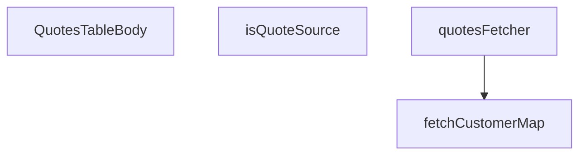

## Genel Bakış
Bu modül, admin panelindeki teklifler tablosunun gövdesini oluşturan React bileşenini ve onun veri ihtiyaçlarını karşılama mantığını içerir. Teklif listesini çekip müşteri bilgileriyle eşleştirerek tabloda gösterilmesini sağlar. Tekliflerin kaynak türlerini sınıflandırmak için yardımcı bir fonksiyon da sunar.

## Fonksiyon Grupları
### Veri Çekme ve Eşleştirme
Müşteri ve teklif verilerini Supabase veritabanından çeken asenkron fonksiyonlar. Teklif listesini alırken müşteri kimliklerini eşleştirip zenginleştirilmiş bir görünüm oluşturur.
- fetchCustomerMap, quotesFetcher

### UI Bileşeni
Admin panelindeki teklifler tablosunun gövdesini render eden ana React bileşeni. Çekilen verileri kullanıcıya sunar.
- QuotesTableBody

### Yardımcı Fonksiyonlar
Verilerin işlenmesinde kullanılan küçük yardımcı fonksiyonlar. Kaynak türünün doğrulanması gibi basit kontrolleri gerçekleştirir.
- isQuoteSource

---

## AXIOMS – Mimari Varsayımlar

Bu modül, tekliflerin tablo halinde gösterilmesini sağlayan bir React bileşeni ve ilgili veri çekme fonksiyonlarından oluşur. Aşağıda modülün doğru çalışması için gerekli mimari varsayımlar listelenmektedir.

---

**[Aksiyom 1]:** Eğer `SOURCE_VALUES` sabiti tanımlı değilse veya boş bir ifade ise, `isQuoteSource()` fonksiyonu herhangi bir değer için geçerli kaynak doğrulaması yapamaz ve hatalı kaynak değerleri tabloda hata ile gösterilebilir.

**[Aksiyom 2]:** Eğer `STATUS_VALUES` sabiti tanımlı değilse veya boş bir ifade ise, teklif durumlarının filtrelenmesi veya doğru şekilde gösterilmesi çalışmayabilir.

**[Aksiyom 3]:** Eğer `supabase` istemcisi (`SupabaseClient<Database>`) düzgün başlatılmamışsa veya geçersiz bir yapıdaysa, `fetchCustomerMap()` ve `quotesFetcher()` fonksiyonları veritabanı sorgularında başarısız olur ve sayfa yüklenemez.

**[Aksiyom 4]:** Eğer `fetchCustomerMap()` için `userIds` dizisi boş (`[]`) ise, müşteri eşleştirme haritası (`map`) boş döner; bu durumda teklif satırlarında müşteri bilgileri gösterilemez ancak `failed` alanı `false` kalır.

**[Aksiyom 5]:** Eğer `fetchCustomerMap()` fonksiyonu başarısız olursa (`failed: true`), müşteri bilgilerinin gösterildiği alanlarda `QuotesTableBody` bileşeni hata durumu veya boş değer göstermek zorundadır; aksi halde bileşen hata fırlatır.

**[Aksiyom 6]:** Eğer `quotesFetcher()` için `FetchParams` parametresi geçersiz veya eksik alanlar içeriyorsa, fonksiyon `FetchResult` dönmeyebilir ve `QuotesTableBody` bileşeni veri olmadan render edilir.

**[Aksiyom 7]:** Eğer veritabanında `quotes` tablosu veya ilgili tablolar (örn: customer, users) yoksa veya beklenen şemaya sahip değilse, hem `fetchCustomerMap()` hem de `quotesFetcher()` fonksiyonları başarısız olur.

**[Aksiyom 8]:** Eğer `QuotesTableBody` bileşeni React bağlamı (`React.FC`) dışında çağrılıyorsa veya geçersiz prop'larla besleniyorsa, bileşen render hataları verir.

**[Aksiyom 9]:** Eğer `isQuoteSource()` fonksiyonuna `string` dışı bir değer (örn: `number`, `null`, `undefined`) geçilirse, fonksiyonun davranışı belirsizdir; bu yalnızca `string` tipi için tanımlıdır.

---

> **Not:** Bu aksiyomlar yalnızca verilen fonksiyon imzaları ve modül sabitlerinden türetilmiştir. Docstring, yorum veya değişken isimlerinden ek bilgi çıkarılmamıştır.

---

## FONKSİYON DETAYLARI

### isQuoteSource
**Ne yapar**: Verilen bir string değerinin geçerli bir `QuoteSource` tipi olup olmadığını kontrol eden ve TypeScript type guard olarak davranan bir bekçi fonksiyondur. Bu fonksiyon sayesinde URL'den gelen filtre parametreleri doğrulanarak, bilinmeyen veya geçersiz değerler sorguya sızmaması sağlanır.

**Nasıl yapar**: `SOURCE_VALUES` adlı readonly string array'inde verilen `value` değerinin bulunup bulunmadığını `Array.includes()` metoduyla test eder. Dönüş tipi `value is QuoteSource` olarak belirlenmiştir; bu bir type predicate'tir ve TypeScript derleyicisine, fonksiyon `true` döndüğünde `value`'nun artık `QuoteSource` tipinde olduğunu garanti eder. Bu mekanizma, `quotesFetcher` içindeki `.filter(isQuoteSource)` çağrısında kullanılarak filtre listelerinin tip güvenli olmasını sağlar.

**Parametreler**:
- `value`: `string` — Test edilecek kaynak değeri; URL'den veya dış kaynaktan gelebilecek ham string

**Dönüş**: `value is QuoteSource` — Değer `SOURCE_VALUES` içinde mevcutsa `true`, aksi halde `false` döner. TypeScript type predicate dönüşüdür.

### fetchCustomerMap
**Ne yapar**: Verilen kullanıcı ID'leri için müşteri kimliği bilgilerini (isim ve e-posta) çekerek bir harita (Map) döndüren asenkron fonksiyondur. Admin panelindeki teklif listeleme sayfasında her bir teklif satırının müşteri adı ve e-postasıyla zenginleştirilmesini sağlar.

**Nasıl yapar**: Önce `admin_list_all_users` RPC çağrısı yaparak tüm kullanıcı bilgilerini tek seferde almaya çalışır. Bu RPC, ilgili GRANT izni (PR #566) henüz production ortamında aktif değilse 403 hatası verebilir; bu durum "veri yokluğu" değil, "gösterememe" durumudur ve `failed` flag'i `true` olarak ayarlanır. RPC başarısız olduğunda fallback olarak `user_profiles` tablosuna `select('id, full_name')` sorgusu yapılır; bu yol sadece isim bilgisini verebilir, e-posta içermeyen bir tablodur. Boş `userIds` array'i gelirse doğrudan boş harita ve `failed: false` ile erkenden dönüş yapılır.

**Parametreler**:
- `supabase`: `SupabaseClient<Database>` — Supabase veritabanı istemcisi; `Database` generic tipi ile şema güvenliği sağlanmıştır
- `userIds`: `string[]` — Bilgileri çekilecek kullanıcıların benzersiz ID listesi

**Dönüş**: `Promise<{ map: Map<string, CustomerIdentity>; failed: boolean }>` — `map` alanı kullanıcı ID'lerinden `CustomerIdentity` (name ve email alanlarını içeren obje) değerlerine eşlenen bir Map nesnesidir; `failed` alanı müşteri lookup işleminin tam mı kısmen mi başarısız olduğunu belirtir. Bu flag, arayüzde `customerLookupFailed` durumunu tetikler.

### quotesFetcher
**Ne yapar**: Admin panelindeki teklif listeleme sayfası için ana veri çekme fonksiyonudur. Filtreleme, arama, sıralama ve sayfalama (pagination) işlemlerini koordine ederek, zenginleştirilmiş teklif satırlarını ve toplam eşleşme sayısını döndürür.

**Nasıl yapar**: Fonksiyon önce `ensureSessionFresh()` çağrısıyla oturumun güncel olmasını sağlar, ardından `withQuotesSchema(supabase)` ile şema yönlendirmesi yapar. URL parametrelerinden gelen `status` ve `source` filtreleri önce `isQuoteStatus` ve `isQuoteSource` bekçileriyle doğrulanarak bilinmeyen değerler sessizce elenir, sonra `.eq()` veya `.in()` ile sorguya eklenir. Arama işlevi doğrudan teklif başlığında değil, `venthub_quote_items` tablosundaki `product_name` kolonu üzerinde `ilike` ile çalışır; eşleşen kalemlerin `quote_id'leri` toplanarak benzersizleştirilir ve teklif sorgusuna `.in('id', ids)` olarak eklenir. Sıralama `status`, `source` veya `created_at` alanlarından birine göre yapılır; belirtilmemişse `created_at` azalan sırada kullanılır. Sayfalama `.range()` ile uygulanır. Son olarak, tekliflerin kalemleri `venthub_quote_items` tablosundan tek sorguyla çekilerek `quote_id` bazında bir Map'e gruplanır ve `fetchCustomerMap` ile müşteri bilgileri eklenerek `QuoteAdminRow` dizisi oluşturulur.

**Parametreler**:
- `supabase`: `SupabaseClient<Database>` — Supabase veritabanı istemcisi
- `params`: `FetchParams` — Filtre, arama terimi, sıralama ve sayfalama bilgilerini içeren parametre nesnesi

**Dönüş**: `Promise<FetchResult<QuoteAdminRow>>` — `rows`, zenginleştirilmiş teklif satırlarının dizisi (her biri kalemler, müşteri adı, e-posta ve `customerLookupFailed` flag'ini içerir); `totalMatched`, filtreleme ve arama sonucunda eşleşen toplam teklif sayısıdır.

### QuotesTableBody
**Ne yapar**: Admin panelindeki teklifler tablosunun gövde (tbody) bölümünü render eden React fonksiyonel bileşenidir. Tablodaki her bir teklif satırını, ilişkili kalemlerini ve müşteri bilgilerini görsel olarak sunar.

**Nasıl yapar**: Bir React Functional Component olarak tanımlanmıştır. Fonksiyon gövdesi boş bırakılmıştır; bileşenin gerçek implementasyonu belge kapsamında verilmemiştir. Genellikle bu tür bileşenler, üst bileşenden (ör. quotes listesi sayfası) gelen verileri props olarak alır veya bir hook kullanarak veri yönetimi yapar. Docstring'i de boş olan bu bileşen, tablonun satır yapısını ve hücre içeriğini render eden JSX'i döndürür.

**Parametreler**: Fonksiyon parametresi almaz. Bileşen düzeyinde olduğu için props'u parent bileşen tarafından belirlenir; ancak bu tanımda props yapısı verilmemiştir.

**Dönüş**: `React.FC` — React Functional Component tipinde, JSX içeriği döndüren bir bileşendir.

---

## İTHALATLAR (IMPORTS)
- import: ../../../components/admin/AdminEmptyState::AdminEmptyState
- import: ../../../components/admin/AdminToolbar::AdminToolbar
- import: ../../../components/admin/data-table/DataTableKit::DataTableKit
- import: ../../../components/admin/data-table/FacetedFilter::FacetedFilter
- import: ../../../components/admin/data-table/types::type { AdminColumn, DataTableFacet }
- import: ../../../hooks/useAdminTable::type FetchParams
- import: ../../../hooks/useAdminTable::type FetchResult
- import: ../../../hooks/useAdminTable::useAdminTable
- import: ../../../hooks/useRole::useRole
- import: ../../../i18n/I18nProvider::useI18n
- import: ../../../i18n/datetime::formatDate
- import: ../../../i18n/datetime::formatTime
- import: ../../../i18n/format::formatCurrency
- import: ../../../lib/ensureSessionFresh::ensureSessionFresh
- import: ../../../types/database.types::type { Database }
- import: ../../../utils/adminUi::adminTableActionPrimaryClass
- import: @/lib/admin/mutateWithAudit::AdminPermissionError
- import: @/lib/admin/mutateWithAudit::mutateWithAudit
- import: @/lib/quotes/quoteStatusMachine::allowedAdminQuoteActions
- import: @/lib/quotes/quoteStatusMachine::isQuoteStatus
- import: @/lib/supabase/client::supabaseBrowserClient
- import: @supabase/supabase-js::type { SupabaseClient }
- import: react::React
- import: react::useCallback
- import: react::useEffect
- import: react::useMemo
- import: react::useState
- import: sonner::toast

---

## INTERFACES

### QuoteAdminRow extends QuoteRow
Admin teklif kuyruğu — T067-VH (cetvel Q7: DataTableKit + useAdminTable + mutateWithAudit; yeni sayfa kendi dizininde, kit çekirdeğine dokunulmaz). Statü aksiyonları SSOT'tan çizilir (`allowedAdminQuoteActions`, R1); fiyatlama yalnız buradan yazılır (cetvel Q3/R5 — DB tarafı kolon-grant ile ayrıca k
- `items: QuoteItemRow[]`
- `customer_name: string | null`
- `customer_email: string | null`
- `customerLookupFailed: boolean`

### CustomerIdentity
- `name: string | null`
- `email: string | null`

### PriceDraft
Kalem fiyat taslağı — kaydedilene kadar yerel.
- `unit_price: string`
- `currency: string`
- `valid_until: string`

---

## SABİTLER
- **STATUS_VALUES** (as_expression) — `['requested', 'quoted', 'accepted', 'rejected', 'expired'] as const`
- **SOURCE_VALUES** (as_expression) — `['pdp', 'cart', 'project'] as const`

---

## AST POINTERS

### [N1_NASIL] AST Pointer: `src/views/admin/quotes/QuotesTableBody.tsx`::isQuoteSource
- **params**: `(value: string)`
- **ic_degiskenler**: (yok)
- **Dönüş**: `value is QuoteSource` — value'nun SOURCE_VALUES dizisi içinde olup olmadığını kontrol eden type guard fonksiyonu

---

### [N2_NASIL] AST Pointer: `src/views/admin/quotes/QuotesTableBody.tsx`::fetchCustomerMap
- **params**: `(supabase: SupabaseClient<Database>, userIds: string[])`
- **ic_degiskenler**:
  - `map` — `Map<string, CustomerIdentity>` yapısında, user ID'lerden müşteri bilgilerine (name, email) eşleme sağlayan harita
  - `data` — `supabase.rpc('admin_list_all_users')` çağrısından dönen tüm kullanıcı listesi
  - `error` — rpc çağrısındaki olası hata nesnesi
  - `u` — for döngüsündeki her bir kullanıcı nesnesi (id, full_name, email alanları)
  - `profiles` — fallback olarak `user_profiles` tablosundan sorgulanan profil verisi (id, full_name)
  - `profileError` — fallback sorgusundaki olası hata
  - `p` — for döngüsündeki her bir profil nesnesi (id, full_name)
- **Dönüş**: `Promise<{ map: Map<string, CustomerIdentity>; failed: boolean }>` — harita ve rpc başarısızsa failed=true

---

### [N3_NASIL] AST Pointer: `src/views/admin/quotes/QuotesTableBody.tsx`::quotesFetcher
- **params**: `(supabase: SupabaseClient<Database>, params: FetchParams)`
- **ic_degiskenler**:
  - `db` — `withQuotesSchema(supabase)` ile sarılmış, quote şemasına özel supabase istemcisi
  - `query` — `venthub_quotes` tablosu üzerinde filtre/sıralama/sayfalama uygulanan zincirli supabase sorgu nesnesi
  - `statuses` — `params.filters.status` dizisinin `isQuoteStatus` ile filtrelenmiş geçerli durum değerleri
  - `sources` — `params.filters.source` dizisinin `isQuoteSource` ile filtrelenmiş geçerli kaynak değerleri
  - `term` — `params.query` değerinin trim edilmiş arama terimi (kalem adı üzerinden arama)
  - `matches` — `venthub_quote_items` tablosunda product_name'e ilike ile eşleşen satırlar (quote_id alanı)
  - `matchError` — arama sorgusundaki olası hata
  - `ids` — eşleşen kalem quote_id'lerinin benzersiz kümesi (diziye çevrilmiş)
  - `sortKey` — `params.sort?.key` sıralama anahtarı (status/source/created_at)
  - `ascending` — sıralama yönü, `params.sort?.dir === 'asc'` ise true
  - `offset` — sayfalama için hesaplanan başlangıç indeksi: `(params.page - 1) * params.pageSize`
  - `data` — filtrelenmiş ve sıralanmış teklif satırları
  - `error` — ana sorgudaki olası hata
  - `count` — sorgunun toplam eşleşme sayısı (count: 'exact')
  - `quotes` — `data ?? []` olarak normalize edilmiş teklif dizisi
  - `totalMatched` — count sayısal ise count, değilse quotes.length
  - `items` — teklif kalemleri tablosundan çekilen tüm kalem satırları
  - `itemsError` — kalem sorgusundaki olası hata
  - `itemsByQuote` — `Map<string, QuoteItemRow[]>` — quote_id bazında gruplanmış kalem haritası
  - `list` — mevcut quote_id için kalem dizisi (push ile büyütülür)
  - `item` — for döngüsündeki her bir kalem satırı
  - `customers` — `fetchCustomerMap` sonucundaki müşteri bilgi haritası
  - `failed` — müşteri bilgisi çekme işleminin başarısızlık bayrağı
  - `rows` — quotes.map ile her quote'a items/customer_name/customer_email/customerLookupFailed eklenmiş nihai QuoteAdminRow dizisi
  - `q` — quotes.map callback'indeki her bir quote satırı
- **Dönüş**: `Promise<FetchResult<QuoteAdminRow>>` — rows ve totalMatched içeren sonuç nesnesi

---

### [N4_NASIL] AST Pointer: `src/views/admin/quotes/QuotesTableBody.tsx`::QuotesTableBody
- **params**: (yok)
- **ic_degiskenler** (bileşen içindeki state/effect/callback tanımları ve JSX scope'undaki değişkenler):
  - `hasWriteAccess` — kullanıcının yazma izni olup olmadığını belirleyen boolean (bileşen scope'undan gelen prop/permission)
  - `t` — i18n çeviri fonksiyonu
  - `supabaseBrowserClient` — import edilmiş tarayıcı supabase istemcisi
  - `table` — DataTableKit tarafından döndürülen tablo kontrol nesnesi (filtering, reload vb. metodlar içerir)
  - `updatingId` — şu an güncellenmekte olan teklifin ID'si (null veya satır ID'si); `setUpdatingId` ile set edilir
  - `drafts` — `Record<string, { unit_price, currency, valid_until }>` yapısında, her kalem ID'sine karşılık gelen draft(fiyat/döviz/geçerlilik) düzenleme değerleri; `setDrafts` ile güncellenir
  - `facetCounts` — `{ status: Record<string, number>, source: Record<string, number> }` — her durum ve kaynak değerinin sayısını tutan facet sayacı; `setFacetCounts` ile set edilir
  - `lang` — mevcut dil ayarı, formatCurrency/formatDate/formatTime fonksiyonlarına geçirilir
  - `fetchFacetCounts` — async callback; `venthub_quotes` tablosundan status ve source alanlarını çekip facetCounts state'ini günceller
  - `getStatusLabel` — durum string'ini insan-okunabilir Türkçe etikete çeviren fonksiyon
  - `getStatusColor` — durum string'ine göre Tailwind CSS sınıf dizesi döndüren fonksiyon
  - `getStatusIcon` — durum string'ine göre React icon bileşeni (Clock/FileText/CheckCircle/XCircle/Hourglass) döndüren fonksiyon
  - `savePrices` — async callback; draft değerlerini validate edip `mutateWithAudit` ile `venthub_quote_items` tablosunda unit_price/currency/valid_until günceller
    - `updates` — row.items.map/filter ile oluşmuş, `Array<{ itemId, unit_price, currency, valid_until }>` yapıdaki geçerli güncelleme listesi
    - `draft` — `drafts[item.id]` erişimiyle elde edilen mevcut kalem draft'ı
    - `price` — `draft.unit_price` string'inin Number'a çevrilmiş hali (boşsa null)
    - `row` — parametre olarak alınan QuoteAdminRow nesnesi
    - `item` — map callback'indeki her bir QuoteItemRow
    - `u` — updates.map callback'indeki her bir güncelleme objesi
  - `handleStatusUpdate` — async callback; teklif durumunu değiştirir
    - `row` — parametre olarak alınan QuoteAdminRow nesnesi
    - `newStatus` — parametre olarak alınan hedef durum string'i
    - `allowed` — `allowedAdminQuoteActions(row.status)` ile elde edilen izin verilen geçişler dizisi
    - `oldStatus` — `row.status` mevcut durum değeri
    - `message` — müşteriye gönderilecek e-posta mesajı içeriği (quoted veya expired durumuna göre)
  - `renderDetail` — `(row: QuoteAdminRow) => React.ReactNode` — her satırın genişletilmiş detay bölümünü render eder
    - `editable` — `hasWriteAccess && row.status === 'requested'` — düzenleme modunun aktif olup olmadığı
    - `item` — row.items.map callback'indeki her bir QuoteItemRow
    - `draft` — `drafts[item.id] ?? { default değerler }` — draft yoksa item'dan türeyen varsayılan değerler
  - `columns` — tablo sütun tanımları dizisi (customer/items/source/status/created_at/actions)
    - `r` — her sütunun cell callback'indeki QuoteAdminRow parametresi
    - `next` — actions sütununda `allowedAdminQuoteActions(r.status)` ile belirlenen sonraki durumlar
    - `status` — next.map callback'indeki her bir izin verilen hedef durum string'i
  - `facets` — FacetedFilter bileşenleri için tanımlar dizisi (status ve source facet'leri)
    - `value` — STATUS_VALUES/SOURCE_VALUES map callback'indeki her bir değer
    - `facet` — facets.map callback'indeki her bir facet tanımı nesnesi
- **Dönüş**: `React.FC` — AdminToolbar, DataTableKit ve AdminEmptyState bileşenlerinden oluşan admin_quotes tablosu JSX'i; yan etkiler: veritabanı okuma (quotes, items, users, user_profiles), facet sayacı çekme, fiyat/durum güncelleme, müşteriye e-posta bildirimi gönderme, toast gösterme

---

## MERMAID CALL GRAPH

## NODE ID STANDARD

  file: src\views\admin\quotes\QuotesTableBody.tsx
  function: src\views\admin\quotes\QuotesTableBody.tsx::isQuoteSource
  function: src\views\admin\quotes\QuotesTableBody.tsx::fetchCustomerMap
  function: src\views\admin\quotes\QuotesTableBody.tsx::quotesFetcher
  function: src\views\admin\quotes\QuotesTableBody.tsx::QuotesTableBody

---

## DISA AKTARILANLAR (EXPORTS)
  export: QuotesTableBody
  export: fetchCustomerMap
  export: isQuoteSource
  export: quotesFetcher

---

## BILEŞIM (CONTAINS)
  contains: QuoteRow

---

## STİL TOKENLERİ

### Arbitrary Değerler (token'a geçirilmemiş)
Yok — tüm stiller token'a geçirilmiş. ✅

### Kullanılan Token'lar (zaten token'a geçirilmiş)
- (yok)

### Tailwind Sınıf Özeti
- **Renkler:** `bg-admin-accent`, `bg-admin-surface`, `border-admin-border`, `border-current`, `border-t-transparent`, `text-admin-accent`, `text-admin-danger`, `text-admin-fg`, `text-admin-fg-muted`, `text-admin-fg-subtle`, `text-admin-success`, `text-admin-warning`, `text-slate-500`, `text-sm`, `text-xs`
- **Layout:** `!h-7`, `flex`, `flex-col`, `flex-wrap`, `gap-0.5`, `gap-1`, `gap-1.5`, `gap-2`, `gap-3`, `grid`, `grid-cols-1`, `h-0.5`, `h-3`, `h-9`, `inline-flex`
- **Varyant/Responsive:** `disabled:`, `focus-visible:`, `sm:` önekleri
- **Yardımcı Sınıflar:** `!px-3`, `!px-4`, `${adminTableActionPrimaryClass`, `${getStatusColor(r.status`, `animate-in`, `animate-spin`, `border`, `break-words`, `disabled:opacity-50`, `duration-300`, `fade-in`, `focus-visible:outline-none`, `focus-visible:ring-2`, `focus-visible:ring-admin-accent/40`, `font-bold`