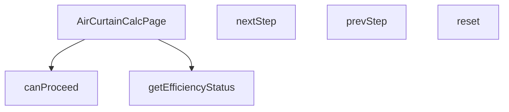

## Genel Bakış
Bu modül, VentHub HVAC platformu için hava perdesi hesaplama arayüzünü sunan React sayfasıdır. Kullanıcılara adım adım bilgi girmelerini ve hesaplama yapmalarını sağlayan çok adımlı bir süreç yönetir. Hesaplanan verimlilik değerlerini arayüzde anlamlı durum kategorilerine dönüştürerek kullanıcıya geri bildirim sunar.

## Fonksiyon Grupları

### Ana Sayfa Bileşeni
Modülün giriş noktası olan ana React bileşenidir. Tüm hesaplama sayfasının arayüzünü, durum yönetimini ve iş mantığını bir arada barındırır.
- `AirCurtainCalcPage`

### Adım Yönetimi
Çok adımlı hesaplama sürecinde kullanıcının ileri veya geri gitmesini, sonraki adıma geçiş yapabilme koşullarını kontrol etmesini ve gerektiğinde tüm süreci başlangıç değerlerine döndürmesini sağlar. Fonksiyonlar birbirini tamamlayarak tutarlı bir gezinme akışı sunar.
- `canProceed`, `nextStep`, `prevStep`, `reset`

### Verimlilik Değerlendirme
Hesaplama sonucunda ortaya çıkan verimlilik oranını, arayüzde gösterilmek üzere kabul edilebilirlik seviyelerine sınıflandırır. Bu sayede kullanıcıya sonuçların kalitesi hakkında net bir geri bildirim verilir.
- `getEfficiencyStatus`

---

## AXIOMS – Mimari Varsayımlar

Bu modül, çok adımlı bir hava perdesi hesaplama sihirbazını (wizard) yöneten React bileşenidir. Aşağıdaki varsayımlar fonksiyon imzalarından çıkarılmıştır.

[Aksiyom 1]: Eğer `canProceed()` çağrıldığında geçerli adımın tüm zorunlu girdileri sağlanmamışsa, `True` dönmez (kullanıcı bir sonraki adıma geçemez).

[Aksiyom 2]: Eğer `nextStep()` çağrıldığında zaten son adımda olunuyorsa, adım ilerlemez (modül durumu değiştirmez).

[Aksiyom 3]: Eğer `prevStep()` çağrıldığında ilk adımda olunuyorsa, adım geri gitmez (modül durumu değiştirmez).

[Aksiyom 4]: Eğer `getEfficiencyStatus()` fonksiyonuna `undefined` değer girdiyse, `'optimal'` veya `'acceptable'` veya `'warning'` değerlerinden biri döner (hangisinin döndüğü bilinmiyor — eşik değerleri fonksiyon gövdesinde tanımlıdır).

[Aksiyom 5]: Eğer `getEfficiencyStatus()` fonksiyonuna `string` tipinde bir `eff` parametresi girdiyse, geçerli bir verimlilik aralığının dışındaysa `'warning'`, kabul edilebilir aralıktaysa `'acceptable'`, optimal aralıktaysa `'optimal'` döner (kesin eşik değerleri bilinmiyor — fonksiyon gövdesinden çıkarılmalıdır).

[Aksiyom 6]: Eğer `reset()` fonksiyonu çağrılırsa, modülün tüm adım durumu ve girilen veriler sıfırlanır.

---

**Not:** Fonksiyon gövdesi kodu paylaşılmadığı için eşik değerler (örn. verimlilik oranı %85 ise `'optimal'` döner gibi) belirlenememiştir. Bu değerler `getEfficiencyStatus` gövdesinden çıkarılmalıdır.

---

## FONKSİYON DETAYLARI

### AirCurtainCalcPage
**Ne yapar**: Hava perdesi hesaplama sayfası için ana React bileşenini (component) oluşturur. Bu bileşen, kullanıcının adım adım ilerleyerek hava perdesi hesaplaması yapmasını sağlayan arayüzü ve iş mantığını yönetir.
**Nasıl yapar**: Fonksiyon, React fonksiyonel bileşeni (React.FC) olarak tanımlanır. Bileşenin iç mantığı verilmediği için, genel bir React bileşeni yapısı ile çalıştığı varsayılır. Bileşen, adım ilerleme (step) durumunu, form değerlerini ve hesaplama mantığını kendi içinde yönetir.
**Parametreler**:
(Parametre almaz)
**Dönüş**: React.FC — Hava perdesi hesaplama sayfasını temsil eden React bileşeni.

### canProceed
**Ne yapar**: Mevcut hesaplama adımında ilerlemenin (sonraki adıma geçmenin) uygun olup olmadığını kontrol eder.
**Nasıl yapar**: Fonksiyon, içinde bulunduğu bağlama (muhtemelen bileşen durumu) göre mantıksal bir değerlendirme yapar. Verilen kod parçasında, `currentStep` 4'ten küçükse ve `canProceed()` true döndürürse adımın artırılacağı görülüyor. Bu durum, `canProceed`'in geçerli adımın (örn. form alanlarının doldurulması) bir ön koşulunu kontrol ettiğini gösterir.
**Parametreler**:
(Parametre almaz)
**Dönüş**: void — Fonksiyon doğrudan bir değer döndürmez, ancak içinde bulunduğu bağlamda (bir kontrol ifadesinde kullanıldığında) mantıksal bir değer (true/false) üretir. Verilen tanım "void veya bilinmiyor" olarak belirtildiği için dönüş tipi resmi olarak void kabul edilir.

### nextStep
**Ne yapar**: Hesaplama sürecinde bir sonraki adıma (form sayfasına) geçişi tetikler.
**Nasıl yapar**: Fonksiyon, mevcut adım sayısını (`currentStep`) bir artırarak bileşenin durumunu günceller. Bu güncelleme, arayüzde bir sonraki formun veya adımın gösterilmesini sağlar. Genellikle bir buton tıklaması gibi bir etkinlik sonucu çağrılır.
**Parametreler**:
(Parametre almaz)
**Dönüş**: void — Fonksiyon durumu (state) değiştirir ancak herhangi bir değer döndürmez.

### prevStep
**Ne yapar**: Hesaplama sürecinde bir önceki adıma (form sayfasına) geri dönmeyi tetikler.
**Nasıl yapar**: Fonksiyon, mevcut adım sayısını (`currentStep`) bir azaltarak bileşenin durumunu günceller. Bu güncelleme, arayüzde bir önceki formun veya adımın yeniden gösterilmesini sağlar. Kullanıcının hatalı girişleri düzeltmesi veya önceki adımları gözden geçirmesi için kullanılır.
**Parametreler**:
(Parametre almaz)
**Dönüş**: void — Fonksiyon durumu (state) değiştirir ancak herhangi bir değer döndürmez.

### reset
**Ne yapar**: Hesaplama sürecini ve form verilerini başlangıç durumuna sıfırlar.
**Nasıl yapar**: Fonksiyon, bileşenin tüm ilgili durum değişkenlerini (örn. `currentStep`, form değerleri) başlangıç değerlerine geri alır. Bu işlem, kullanıcının hesaplamayı sıfırdan başlatmasını sağlar.
**Parametreler**:
(Parametre almaz)
**Dönüş**: void — Fonksiyon durumları (state) sıfırlar ancak herhangi bir değer döndürmez.

### getEfficiencyStatus
**Ne yapar**: Verilen bir verimlilik (efficiency) değerine göre, hava perdesinin performans durumunu kategorize eder.
**Nasıl yapar**: Fonksiyon, `eff` parametresini (string veya undefined) alır ve bu değeri önceden tanımlanmış eşik değerlerle karşılaştırır. Sonuç olarak, durumu 'optimal' (en iyi), 'acceptable' (kabul edilebilir) veya 'warning' (uyarı) olarak sınıflandırır. Bu sınıflandırma, muhtemelen arayüzde farklı renk veya ikonlarla görsel bir geri bildirim sağlamak için kullanılır.
**Parametreler**:
- eff: string | undefined — Değerlendirilecek verimlilik değeri. String formatında bir sayı veya metin olabilir; undefined ise değerlendirilmeyen bir durumu temsil eder.
**Dönüş**: 'optimal' | 'acceptable' | 'warning' — Değerin durumuna göre üç olası string değerden birini döndürür.

---

## İTHALATLAR (IMPORTS)
- import: ../../i18n/I18nProvider::useI18n
- import: lucide-react::ArrowLeft
- import: lucide-react::ArrowRight
- import: lucide-react::DoorOpen
- import: lucide-react::RotateCcw
- import: lucide-react::Thermometer
- import: lucide-react::Wind
- import: lucide-react::Zap
- import: next/navigation::usePathname
- import: next/navigation::useRouter
- import: next/navigation::useSearchParams
- import: react::React
- import: react::useEffect
- import: react::useMemo
- import: react::useState

---

## AST POINTERS

### [N1_NASIL] AST Pointer: src/views/calculators/AirCurtainCalcPage.tsx::getSteps
- **params**: ()
- **ic_degiskenler**: (yok)
- **Dönüş**: Array of { id: number, label: string, description: string }

### [N2_NASIL] AST Pointer: src/views/calculators/AirCurtainCalcPage.tsx::getApplicationOptions
- **params**: ()
- **ic_degiskenler**: (yok)
- **Dönüş**: Array of { value: string, label: string, description: string, icon: JSX.Element }

### [N3_NASIL] AST Pointer: src/views/calculators/AirCurtainCalcPage.tsx::getWindConditions
- **params**: ()
- **ic_degiskenler**: (yok)
- **Dönüş**: Array of { value: string, label: string, description: string }

### [N4_NASIL] AST Pointer: src/views/calculators/AirCurtainCalcPage.tsx::getTrafficOptions
- **params**: ()
- **ic_degiskenler**: (yok)
- **Dönüş**: Array of { value: string, label: string, description: string }

### [N5_NASIL] AST Pointer: src/views/calculators/AirCurtainCalcPage.tsx::syncUrlParams
- **params**: ()
- **ic_degiskenler**:
  - `params` — URL sorgu parametrelerini tutmak ve güncellemek için oluşturulan URLSearchParams nesnesi
  - `query` — params nesnesinin string karşılığı, URL'e eklenecek kısım
- **Dönüş**: yok (yan etki: URL'i günceller)

### [N6_NASIL] AST Pointer: src/views/calculators/AirCurtainCalcPage.tsx::performCalculation
- **params**: ()
- **ic_degiskenler**:
  - `width` — parseFloat(doorWidth) ile elde edilen kapı genişliği numerik değeri
  - `height` - parseFloat(doorHeight) ile elde edilen kapı yüksekliği numerik değeri
  - `calculationResult` - calculateAirCurtain fonksiyonu ile hesaplanan sonuç nesnesi
- **Dönüş**: yok (yan etki: setResult ile sonucu günceller)

### [N7_NASIL] AST Pointer: src/views/calculators/AirCurtainCalcPage.tsx::canProceed
- **params**: ()
- **ic_degiskenler**:
  - `w` — parseFloat(doorWidth) ile elde edilen kapı genişliği numerik değeri (case 1 içinde)
  - `h` — parseFloat(doorHeight) ile elde edilen kapı yüksekliği numerik değeri (case 1 içinde)
- **Dönüş**: boolean (adımın devam edip edemeyeceğini belirler)

### [N8_NASIL] AST Pointer: src/views/calculators/AirCurtainCalcPage.tsx::resetForm
- **params**: ()
- **ic_degiskenler**: (yok)
- **Dönüş**: yok (yan etki: tüm form state'lerini başlangıç değerlerine sıfırlar)

### [N9_NASIL] AST Pointer: src/views/calculators/AirCurtainCalcPage.tsx::getEfficiencyStatus
- **params**: (eff: string | undefined)
- **ic_degiskenler**: (yok)
- **Dönüş**: 'optimal' | 'acceptable' | 'warning'

### [N10_NASIL] AST Pointer: src/views/calculators/AirCurtainCalcPage.tsx::renderGraphTick
- **params**: (x, i)
- **ic_degiskenler**: (yok)
- **Dönüş**: JSX.Element (grafik ekseni çizgi ve ok işaretini render eden bileşen)

---

## MERMAID CALL GRAPH

## NODE ID STANDARD

  file: src\views\calculators\AirCurtainCalcPage.tsx
  function: src\views\calculators\AirCurtainCalcPage.tsx::AirCurtainCalcPage
  function: src\views\calculators\AirCurtainCalcPage.tsx::canProceed
  function: src\views\calculators\AirCurtainCalcPage.tsx::nextStep
  function: src\views\calculators\AirCurtainCalcPage.tsx::prevStep
  function: src\views\calculators\AirCurtainCalcPage.tsx::reset
  function: src\views\calculators\AirCurtainCalcPage.tsx::getEfficiencyStatus

---

## DISA AKTARILANLAR (EXPORTS)
  export: AirCurtainCalcPage

---

## STİL TOKENLERİ

### Arbitrary Değerler (token'a geçirilmemiş)
Yok — tüm stiller token'a geçirilmiş. ✅

### Kullanılan Token'lar (zaten token'a geçirilmiş)
- (yok)

### Tailwind Sınıf Özeti
- **Renkler:** `bg-gray-200`, `bg-gray-50`, `bg-primary-navy`, `bg-primary-navy/10`, `bg-secondary-blue`, `bg-secondary-blue/10`, `bg-secondary-blue/5`, `bg-success-green`, `bg-success-green/10`, `bg-warning-orange`, `bg-warning-orange/10`, `bg-white`, `border-2`, `border-light-gray`, `border-secondary-blue/30`
- **Layout:** `flex`, `flex-wrap`, `gap-2`, `gap-3`, `gap-4`, `gap-6`, `grid`, `h-12`, `items-center`, `justify-between`, `justify-center`, `max-w-xs`, `md:grid-cols-2`, `md:p-8`, `p-2`
- **Varyant/Responsive:** `:`, `hover:`, `md:` önekleri
- **Yardımcı Sınıflar:** `${canProceed`, `${currentStep`, `${result.efficiency`, `1`, `:`, `===`, `acceptable`, `border`, `cursor-not-allowed`, `font-medium`, `font-semibold`, `mb-2`, `mb-6`, `mt-6`, `mt-8`