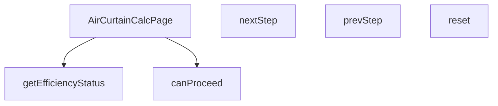

## Genel Bakış
Bu modül, VentHub HVAC platformu için hava perdesi (air curtain) hesaplama arayüzünü sunan React sayfasıdır. Çok adımlı bir hesaplama sürecini yöneterek kullanıcıların adım adım bilgi girmesini ve hesaplama yapmasını sağlar. Hesaplanan verimlilik değerlerini arayüzde anlamlı durum kategorilerine dönüştürerek kullanıcıya geri bildirim sunar.

## Fonksiyon Grupları

### Ana Sayfa Bileşeni
Modülün giriş noktası olan ana React bileşenidir. Tüm hesaplama sayfasının arayüzünü, durum yönetimini ve iş mantığını bir arada barındırır.
- `AirCurtainCalcPage`

### Adım Yönetimi
Çok adımlı hesaplama sürecinde kullanıcının ileri veya geri gitmesini, sonraki adıma geçiş yapabilme koşullarını kontrol etmesini ve gerektiğinde tüm süreci başlangıç değerlerine döndürmesini sağlar.
- `canProceed`, `nextStep`, `prevStep`, `reset`

### Verimlilik Değerlendirme
Hesaplama sonucunda ortaya çıkan verimlilik oranını, arayüzde gösterilmek üzere kabul edilebilirlik seviyelerine (optimal, acceptable, warning) sınıflandırır.
- `getEfficiencyStatus`

---

## AXIOMS – Mimari Varsayımlar

Bu modül için sadece fonksiyon imzalarından türetilebilecek temel mimari varsayımlar aşağıdadır. Fonksiyon gövdelerine erişim olmadığı için aksiyomlar kasıtlı olarak kısıtlıdır.

**[Aksiyom 1]:** Eğer `getEfficiencyStatus` fonksiyonuna `undefined` değer verilirse veya hiç verilmezse,fonksiyon geçerli bir durum döndürmelidir (hata fırlatmamalıdır). **Neden:** Fonksiyon imzası `eff: string | undefined` olarak tanımlıdır; bu, efficiency değerinin her zaman mevcut olmadığının kanıtıdır.

**[Aksiyom 2]:** Eğer `canProceed` fonksiyonu çağrıldığında mevcut adımın zorunlu koşulları sağlanmıyorsa, `false` döndürülmelidir ve `nextStep` bir sonraki adıma geçmemelidir. **Neden:** `canProceed` ve `nextStep`'in birlikte varlığı, adımlar arası geçişin koşula bağlı olduğunu gösterir.

**[Aksiyom 3]:** Eğer `reset` fonksiyonu çağrılırsa, tüm adımlar arası geçiş durumu (mevcut adım numarası, girilen değerler) başlangıç değerlerine döndürülmelidir. **Neden:** `reset` fonksiyonunun varlığı, modülün mutable stateful yapıda olduğunu ve bu state'in sıfırlanabilir olması gerektiğini varsayar.

**[Aksiyon 4]:** Eğer `prevStep` ilk adımda çağrılırsa, bir önceki adıma geçilmemelidir (mevcut adımda kalmalı veya hiçbir işlem yapmamalıdır). **Neden:** `prevStep`'in `nextStep` ile birlikte tanımlı olması, adımların sonlu ve sıralı bir aralıkta olduğunu varsayar; ancak bu aralığın başlangıç ve bitiş değerleri fonksiyon imzalarından bilinmemektedir.

---

## FONKSİYON DETAYLARI

### AirCurtainCalcPage
**Ne yapar**: Hava perdesi hesaplama sayfası için ana React bileşenini (component) oluşturur. Bu bileşen, kullanıcının adım adım ilerleyerek hava perdesi hesaplaması yapmasını sağlayan arayüzü ve iş mantığını yönetir.
**Nasıl yapar**: Fonksiyon, React fonksiyonel bileşeni (React.FC) olarak tanımlanır. Bileşenin iç mantığı verilmediği için, genel bir React bileşeni yapısı ile çalıştığı varsayılır. Bileşen, adım ilerleme (step) durumunu, form değerlerini ve hesaplama mantığını kendi içinde yönetir.
**Parametreler**:
(Parametre almaz)
**Dönüş**: React.FC — Hava perdesi hesaplama sayfasını temsil eden React bileşeni.

### canProceed
**Ne yapar**: Mevcut hesaplama adımında ilerlemenin (sonraki adıma geçmenin) uygun olup olmadığını kontrol eder.
**Nasıl yapar**: Fonksiyon, içinde bulunduğu bağlama (muhtemelen bileşen durumu) göre mantıksal bir değerlendirme yapar. Verilen kod parçasında, `currentStep` 4'ten küçükse ve `canProceed()` true döndürürse adımın artırılacağı görülüyor. Bu durum, `canProceed`'in geçerli adımın (örn. form alanlarının doldurulması) bir ön koşulunu kontrol ettiğini gösterir.
**Parametreler**:
(Parametre almaz)
**Dönüş**: void — Fonksiyon doğrudan bir değer döndürmez, ancak içinde bulunduğu bağlamda (bir kontrol ifadesinde kullanıldığında) mantıksal bir değer (true/false) üretir. Verilen tanım "void veya bilinmiyor" olarak belirtildiği için dönüş tipi resmi olarak void kabul edilir.

### nextStep
**Ne yapar**: Hesaplama sürecinde bir sonraki adıma (form sayfasına) geçişi tetikler.
**Nasıl yapar**: Fonksiyon, mevcut adım sayısını (`currentStep`) bir artırarak bileşenin durumunu günceller. Bu güncelleme, arayüzde bir sonraki formun veya adımın gösterilmesini sağlar. Genellikle bir buton tıklaması gibi bir etkinlik sonucu çağrılır.
**Parametreler**:
(Parametre almaz)
**Dönüş**: void — Fonksiyon durumu (state) değiştirir ancak herhangi bir değer döndürmez.

### prevStep
**Ne yapar**: Hesaplama sürecinde bir önceki adıma (form sayfasına) geri dönmeyi tetikler.
**Nasıl yapar**: Fonksiyon, mevcut adım sayısını (`currentStep`) bir azaltarak bileşenin durumunu günceller. Bu güncelleme, arayüzde bir önceki formun veya adımın yeniden gösterilmesini sağlar. Kullanıcının hatalı girişleri düzeltmesi veya önceki adımları gözden geçirmesi için kullanılır.
**Parametreler**:
(Parametre almaz)
**Dönüş**: void — Fonksiyon durumu (state) değiştirir ancak herhangi bir değer döndürmez.

### reset
**Ne yapar**: Hesaplama sürecini ve form verilerini başlangıç durumuna sıfırlar.
**Nasıl yapar**: Fonksiyon, bileşenin tüm ilgili durum değişkenlerini (örn. `currentStep`, form değerleri) başlangıç değerlerine geri alır. Bu işlem, kullanıcının hesaplamayı sıfırdan başlatmasını sağlar.
**Parametreler**:
(Parametre almaz)
**Dönüş**: void — Fonksiyon durumları (state) sıfırlar ancak herhangi bir değer döndürmez.

### getEfficiencyStatus
**Ne yapar**: Verilen bir verimlilik (efficiency) değerine göre, hava perdesinin performans durumunu kategorize eder.
**Nasıl yapar**: Fonksiyon, `eff` parametresini (string veya undefined) alır ve bu değeri önceden tanımlanmış eşik değerlerle karşılaştırır. Sonuç olarak, durumu 'optimal' (en iyi), 'acceptable' (kabul edilebilir) veya 'warning' (uyarı) olarak sınıflandırır. Bu sınıflandırma, muhtemelen arayüzde farklı renk veya ikonlarla görsel bir geri bildirim sağlamak için kullanılır.
**Parametreler**:
- eff: string | undefined — Değerlendirilecek verimlilik değeri. String formatında bir sayı veya metin olabilir; undefined ise değerlendirilmeyen bir durumu temsil eder.
**Dönüş**: 'optimal' | 'acceptable' | 'warning' — Değerin durumuna göre üç olası string değerden birini döndürür.

---

## AST POINTERS

### [N1_NASIL] AST Pointer: AirCurtainCalcPage.tsx::stepsArray
- **params**: ()
- **ic_degiskenler**:
- **Dönüş**: Array of step objects
  - `t` — i18n çeviri fonksiyonu, adım başlıklarını ve açıklamalarını çevirir

### [N2_NASIL] AST Pointer: AirCurtainCalcPage.tsx::applicationsArray
- **params**: ()
- **ic_degiskenler**:
- **Dönüş**: Array of application option objects
  - `t` — i18n çeviri fonksiyonu, uygulama etiketlerini ve açıklamalarını çevirir
  - `Thermometer` — Lucide ikon bileşeni,comfort ve coldRoom uygulamaları için kullanılır
  - `Wind` — Lucide ikon bileşeni, insect uygulaması için kullanılır

### [N3_NASIL] AST Pointer: AirCurtainCalcPage.tsx::windConditionsArray
- **params**: ()
- **ic_degiskenler**:
- **Dönüş**: Array of wind condition option objects
  - `t` — i18n çeviri fonksiyonu, rüzgar koşulu etiketlerini ve açıklamalarını çevirir

### [N4_NASIL] AST Pointer: AirCurtainCalcPage.tsx::trafficIntensityArray
- **params**: ()
- **ic_degiskenler**:
- **Dönüş**: Array of traffic intensity option objects
  - `t` — i18n çeviri fonksiyonu, trafik yoğunluğu etiketlerini ve açıklamalarını çevirir

### [N5_NASIL] AST Pointer: AirCurtainCalcPage.tsx::updateUrlParams
- **params**: ()
- **ic_degiskenler**:
  - `params` — URLSearchParams nesnesi, query parametrelerini tutar
  - `query` — string, params nesnesinin string karşılığı, URL'ye eklenir
  - `currentStep` — number, mevcut adım numarası (harici state)
  - `doorWidth` — string, kapı genişliği değeri (harici state)
  - `doorHeight` — string, kapı yüksekliği değeri (harici state)
  - `application` — string, seçilen uygulama türü (harici state)
  - `windCondition` — string, rüzgar koşulu seçimi (harici state)
  - `trafficIntensity` — string, trafik yoğunluğu seçimi (harici state)
  - `router` — Next.js router nesnesi, URL değişikliği için kullanılır
  - `pathname` — string, mevcut URL yolu (harici)
- **Dönüş**: yok

### [N6_NASIL] AST Pointer: AirCurtainCalcPage.tsx::calculateResult
- **params**: ()
- **ic_degiskenler**:
  - `width` — number, doorWidth'ın float karşılığı, kapı genişliği (metre)
  - `height` — number, doorHeight'ın float karşılığı, kapı yüksekliği (metre)
  - `calculationResult` — object, calculateAirCurtain fonksiyonunun dönüş değeri, hesaplama sonuçlarını tutar
  - `currentStep` — number, mevcut adım numarası (harici state)
  - `doorWidth` — string, kapı genişliği değeri (harici state)
  - `doorHeight` — string, kapı yüksekliği değeri (harici state)
  - `application` — string, seçilen uygulama türü (harici state)
  - `windCondition` — string, rüzgar koşulu seçimi (harici state)
  - `trafficIntensity` — string, trafik yoğunluğu seçimi (harici state)
  - `calculateAirCurtain` — fonksiyon, hava perdesi hesaplamasını yapar
  - `setResult` — setter fonksiyonu, sonucu state'e kaydeder
- **Dönüş**: yok

### [N7_NASIL] AST Pointer: AirCurtainCalcPage.tsx::canProceed
- **params**: ()
- **ic_degiskenler**:
  - `w` — number, doorWidth'ın float karşılığı (adım 1 için)
  - `h` — number, doorHeight'ın float karşılığı (adım 1 için)
  - `currentStep` — number, mevcut adım numarası (harici state)
  - `doorWidth` — string, kapı genişliği değeri (harici state)
  - `doorHeight` — string, kapı yüksekliği değeri (harici state)
  - `application` — string, seçilen uygulama türü (harici state)
  - `windCondition` — string, rüzgar koşulu seçimi (harici state)
  - `trafficIntensity` — string, trafik yoğunluğu seçimi (harici state)
- **Dönüş**: boolean — devam edilebilirlik durumu

### [N8_NASIL] AST Pointer: AirCurtainCalcPage.tsx::reset
- **params**: ()
- **ic_degiskenler**:
  - `setCurrentStep` — setter fonksiyonu, adım state'ini sıfırlar
  - `setDoorWidth` — setter fonksiyonu, kapı genişliği state'ini sıfırlar
  - `setDoorHeight` — setter fonksiyonu, kapı yüksekliği state'ini sıfırlar
  - `setApplication` — setter fonksiyonu, uygulama state'ini sıfırlar
  - `setWindCondition` — setter fonksiyonu, rüzgar koşulu state'ini sıfırlar
  - `setTrafficIntensity` — setter fonksiyonu, trafik yoğunluğu state'ini sıfırlar
  - `setResult` — setter fonksiyonu, sonuç state'ini null yapar
- **Dönüş**: yok

### [N9_NASIL] AST Pointer: AirCurtainCalcPage.tsx::getEfficiencyStatus
- **params**: `(eff: string | undefined)`
- **ic_degiskenler**:
- **Dönüş**: 'optimal' | 'acceptable' | 'warning'

### [N10_NASIL] AST Pointer: AirCurtainCalcPage.tsx::renderGridLine
- **params**: `(x, i)`
- **ic_degiskenler**:
  - `x` — number, grid çizgisi yatay pozisyonu
  - `i` — number, grid çizgisi indeksi
- **Dönüş**: JSX element (g bileşeni)

---

## MERMAID CALL GRAPH

## NODE ID STANDARD

  file: src\views\calculators\AirCurtainCalcPage.tsx
  function: src\views\calculators\AirCurtainCalcPage.tsx::AirCurtainCalcPage
  function: src\views\calculators\AirCurtainCalcPage.tsx::canProceed
  function: src\views\calculators\AirCurtainCalcPage.tsx::nextStep
  function: src\views\calculators\AirCurtainCalcPage.tsx::prevStep
  function: src\views\calculators\AirCurtainCalcPage.tsx::reset
  function: src\views\calculators\AirCurtainCalcPage.tsx::getEfficiencyStatus

---

## DISA AKTARILANLAR (EXPORTS)
  export: AirCurtainCalcPage

---

## STİL TOKENLERİ

### Arbitrary Değerler (token'a geçirilmemiş)
Yok — tüm stiller token'a geçirilmiş. ✅

### Kullanılan Token'lar (zaten token'a geçirilmiş)
- (yok)

### Tailwind Sınıf Özeti
- **Renkler:** `bg-gray-200`, `bg-gray-50`, `bg-primary-navy`, `bg-primary-navy/10`, `bg-secondary-blue`, `bg-secondary-blue/10`, `bg-secondary-blue/5`, `bg-success-green`, `bg-success-green/10`, `bg-warning-orange`, `bg-warning-orange/10`, `bg-white`, `border-2`, `border-light-gray`, `border-secondary-blue/30`
- **Layout:** `flex`, `flex-wrap`, `gap-2`, `gap-3`, `gap-4`, `gap-6`, `grid`, `h-12`, `items-center`, `justify-between`, `justify-center`, `max-w-xs`, `md:grid-cols-2`, `md:p-8`, `p-2`
- **Varyant/Responsive:** `:`, `hover:`, `md:` önekleri
- **Yardımcı Sınıflar:** `${canProceed`, `${currentStep`, `${result.efficiency`, `1`, `:`, `===`, `acceptable`, `border`, `cursor-not-allowed`, `font-medium`, `font-semibold`, `mb-2`, `mb-6`, `mt-6`, `mt-8`