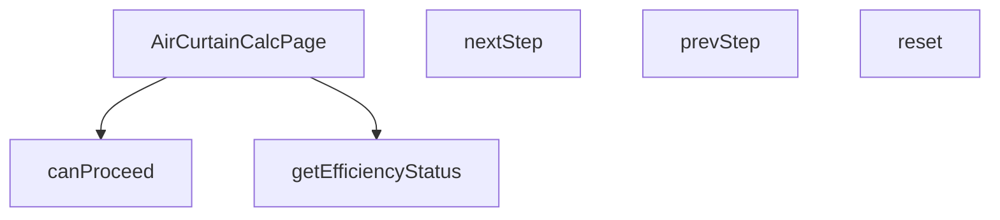

## Genel Bakış
Bu modül, VentHub HVAC platformu için havalı perde hesaplamaları yapan kullanıcı arayüzü sayfasını barındıran React bileşenidir. Çok adımlı hesaplama akışını yöneterek kullanıcının adımlar arasında gezinmesini sağlar ve hesaplanan verimlilik değerlerini kullanıcıya sunulacak anlamlı durum kategorilerine dönüştürür.

## Fonksiyon Grupları
### Ana Sayfa Bileşeni
Modülün ana giriş noktası olup tüm hesaplayıcı sayfasının işleyişini ve kullanıcı arayüzünü bir araya getirir.
- AirCurtainCalcPage

### Adım Yönetimi Fonksiyonları
Çok adımlı hesaplama sürecindeki kullanıcı gezintisini ve geçiş koşullarını yönetir, ileri/geri adım atma ile süreci sıfırlama işlemlerini kontrol eder.
- canProceed, nextStep, prevStep, reset

### Verimlilik Sınıflandırma Fonksiyonu
Hesaplanan verimlilik değerini alarak arayüzde kullanılmak üzere belirli performans seviyelerine sınıflandırır.
- getEfficiencyStatus

---

---

## FONKSİYON DETAYLARI

### AirCurtainCalcPage
**Ne yapar**: Hava perdesi hesaplama sayfası için ana React bileşenini (component) oluşturur. Bu bileşen, kullanıcının adım adım ilerleyerek hava perdesi hesaplaması yapmasını sağlayan arayüzü ve iş mantığını yönetir.
**Nasıl yapar**: Fonksiyon, React fonksiyonel bileşeni (React.FC) olarak tanımlanır. Bileşenin iç mantığı verilmediği için, genel bir React bileşeni yapısı ile çalıştığı varsayılır. Bileşen, adım ilerleme (step) durumunu, form değerlerini ve hesaplama mantığını kendi içinde yönetir.
**Parametreler**:
(Parametre almaz)
**Dönüş**: React.FC — Hava perdesi hesaplama sayfasını temsil eden React bileşeni.

### canProceed
**Ne yapar**: Mevcut hesaplama adımında ilerlemenin (sonraki adıma geçmenin) uygun olup olmadığını kontrol eder.
**Nasıl yapar**: Fonksiyon, içinde bulunduğu bağlama (muhtemelen bileşen durumu) göre mantıksal bir değerlendirme yapar. Verilen kod parçasında, `currentStep` 4'ten küçükse ve `canProceed()` true döndürürse adımın artırılacağı görülüyor. Bu durum, `canProceed`'in geçerli adımın (örn. form alanlarının doldurulması) bir ön koşulunu kontrol ettiğini gösterir.
**Parametreler**:
(Parametre almaz)
**Dönüş**: void — Fonksiyon doğrudan bir değer döndürmez, ancak içinde bulunduğu bağlamda (bir kontrol ifadesinde kullanıldığında) mantıksal bir değer (true/false) üretir. Verilen tanım "void veya bilinmiyor" olarak belirtildiği için dönüş tipi resmi olarak void kabul edilir.

### nextStep
**Ne yapar**: Hesaplama sürecinde bir sonraki adıma (form sayfasına) geçişi tetikler.
**Nasıl yapar**: Fonksiyon, mevcut adım sayısını (`currentStep`) bir artırarak bileşenin durumunu günceller. Bu güncelleme, arayüzde bir sonraki formun veya adımın gösterilmesini sağlar. Genellikle bir buton tıklaması gibi bir etkinlik sonucu çağrılır.
**Parametreler**:
(Parametre almaz)
**Dönüş**: void — Fonksiyon durumu (state) değiştirir ancak herhangi bir değer döndürmez.

### prevStep
**Ne yapar**: Hesaplama sürecinde bir önceki adıma (form sayfasına) geri dönmeyi tetikler.
**Nasıl yapar**: Fonksiyon, mevcut adım sayısını (`currentStep`) bir azaltarak bileşenin durumunu günceller. Bu güncelleme, arayüzde bir önceki formun veya adımın yeniden gösterilmesini sağlar. Kullanıcının hatalı girişleri düzeltmesi veya önceki adımları gözden geçirmesi için kullanılır.
**Parametreler**:
(Parametre almaz)
**Dönüş**: void — Fonksiyon durumu (state) değiştirir ancak herhangi bir değer döndürmez.

### reset
**Ne yapar**: Hesaplama sürecini ve form verilerini başlangıç durumuna sıfırlar.
**Nasıl yapar**: Fonksiyon, bileşenin tüm ilgili durum değişkenlerini (örn. `currentStep`, form değerleri) başlangıç değerlerine geri alır. Bu işlem, kullanıcının hesaplamayı sıfırdan başlatmasını sağlar.
**Parametreler**:
(Parametre almaz)
**Dönüş**: void — Fonksiyon durumları (state) sıfırlar ancak herhangi bir değer döndürmez.

### getEfficiencyStatus
**Ne yapar**: Verilen bir verimlilik (efficiency) değerine göre, hava perdesinin performans durumunu kategorize eder.
**Nasıl yapar**: Fonksiyon, `eff` parametresini (string veya undefined) alır ve bu değeri önceden tanımlanmış eşik değerlerle karşılaştırır. Sonuç olarak, durumu 'optimal' (en iyi), 'acceptable' (kabul edilebilir) veya 'warning' (uyarı) olarak sınıflandırır. Bu sınıflandırma, muhtemelen arayüzde farklı renk veya ikonlarla görsel bir geri bildirim sağlamak için kullanılır.
**Parametreler**:
- eff: string | undefined — Değerlendirilecek verimlilik değeri. String formatında bir sayı veya metin olabilir; undefined ise değerlendirilmeyen bir durumu temsil eder.
**Dönüş**: 'optimal' | 'acceptable' | 'warning' — Değerin durumuna göre üç olası string değerden birini döndürür.

---

## AST POINTERS

### [N1_NASIL] AST Pointer: src\views\calculators\AirCurtainCalcPage.tsx::AirCurtainCalcPage
- **params**: (parametre yok)
- **ic_degiskenler**: (fonksiyon gövdesi verilmemiş)
- **Dönüş**: React.FC (React functional component)

### [N2_NASIL] AST Pointer: src\views\calculators\AirCurtainCalcPage.tsx::canProceed
- **params**: (parametre yok)
- **ic_degiskenler**:
  - `w` — doorWidth string değerini parseFloat ile number'a çevrilmiş hali, kapı genişliği
  - `h` — doorHeight string değerini parseFloat ile number'a çevrilmiş hali, kapı yüksekliği
  - `currentStep` — mevcut adım numarası, hangi adımda olduğunu belirler
  - `doorWidth` — kapı genişliği string olarak (örn: '1.5')
  - `doorHeight` — kapı yüksekliği string olarak (örn: '2.5')
  - `application` — uygulama tipi string olarak (örn: 'comfort', 'insect', 'coldRoom')
  - `windCondition` — rüzgar durumu string olarak (örn: 'none', 'light', 'moderate', 'strong')
  - `trafficIntensity` — trafik yoğunluğu string olarak (örn: 'low', 'medium', 'high')
- **Dönüş**: boolean (adım ilerlemek için şart sağlanıyorsa true)

### [N3_NASIL] AST Pointer: src\views\calculators\AirCurtainCalcPage.tsx::nextStep
- **params**: (parametre yok)
- **ic_degiskenler**:
  - `currentStep` — mevcut adım numarası
- **Dönüş**: yok

### [N4_NASIL] AST Pointer: src\views\calculators\AirCurtainCalcPage.tsx::prevStep
- **params**: (parametre yok)
- **ic_degiskenler**:
  - `currentStep` — mevcut adım numarası
- **Dönüş**: yok

### [N5_NASIL] AST Pointer: src\views\calculators\AirCurtainCalcPage.tsx::reset
- **params**: (parametre yok)
- **ic_degiskenler**: (sadece state setter'ları kullanılıyor, değişken yok)
- **Dönüş**: yok

### [N6_NASIL] AST Pointer: src\views\calculators\AirCurtainCalcPage.tsx::getEfficiencyStatus
- **params**: eff (string | undefined) — verimlilik durumu string değeri
- **ic_degiskenler**: (yok)
- **Dönüş**: 'optimal' | 'acceptable' | 'warning'

### [N7_NASIL] AST Pointer: src\views\calculators\AirCurtainCalcPage.tsx::(URL senkronizasyonu useEffect)
- **params**: (parametre yok)
- **ic_degiskenler**:
  - `params` — URL parametrelerini tutan URLSearchParams nesnesi
  - `currentStep` — mevcut adım numarası
  - `doorWidth` — kapı genişliği string olarak
  - `doorHeight` — kapı yüksekliği string olarak
  - `application` — uygulama tipi string olarak
  - `windCondition` — rüzgar durumu string olarak
  - `trafficIntensity` — trafik yoğunluğu string olarak
  - `query` — params.toString() ile oluşturulmuş URL sorgu string'i
  - `pathname` — mevcut URL yolu
  - `router` — Next.js router nesnesi
- **Dönüş**: yok

### [N8_NASIL] AST Pointer: src\views\calculators\AirCurtainCalcPage.tsx::(hesaplama useEffect)
- **params**: (parametre yok)
- **ic_degiskenler**:
  - `currentStep` — mevcut adım numarası (4. adım kontrolü için)
  - `width` — doorWidth string değerini parseFloat ile number'a çevrilmiş hali, kapı genişliği
  - `height` — doorHeight string değerini parseFloat ile number'a çevrilmiş hali, kapı yüksekliği
  - `application` — uygulama tipi string olarak
  - `windCondition` — rüzgar durumu string olarak
  - `trafficIntensity` — trafik yoğunluğu string olarak
  - `calculationResult` — calculateAirCurtain fonksiyonu ile elde edilmiş hesaplama sonucu nesnesi
- **Dönüş**: yok

### [N9_NASIL] AST Pointer: src\views\calculators\AirCurtainCalcPage.tsx::(adım gösterici JSX)
- **params**: x (number) — çizgi x koordinatı, i (number) — harita index
- **ic_degiskenler**: (yok)
- **Dönüş**: JSX element (SVG çizgi ve ok polygon)

---

## MERMAID CALL GRAPH

## NODE ID STANDARD

  file: src\views\calculators\AirCurtainCalcPage.tsx
  function: src\views\calculators\AirCurtainCalcPage.tsx::AirCurtainCalcPage
  function: src\views\calculators\AirCurtainCalcPage.tsx::canProceed
  function: src\views\calculators\AirCurtainCalcPage.tsx::nextStep
  function: src\views\calculators\AirCurtainCalcPage.tsx::prevStep
  function: src\views\calculators\AirCurtainCalcPage.tsx::reset
  function: src\views\calculators\AirCurtainCalcPage.tsx::getEfficiencyStatus

---

## DISA AKTARILANLAR (EXPORTS)
  export: AirCurtainCalcPage

---

## STİL TOKENLERİ

### Arbitrary Değerler (token'a geçirilmemiş)
Yok — tüm stiller token'a geçirilmiş. ✅

### Kullanılan Token'lar (zaten token'a geçirilmiş)
- (yok)

### Tailwind Sınıf Özeti
- **Renkler:** `bg-gray-200`, `bg-gray-50`, `bg-primary-navy`, `bg-primary-navy/10`, `bg-secondary-blue`, `bg-secondary-blue/10`, `bg-secondary-blue/5`, `bg-success-green`, `bg-success-green/10`, `bg-warning-orange`, `bg-warning-orange/10`, `bg-white`, `border-2`, `border-light-gray`, `border-secondary-blue/30`
- **Layout:** `flex`, `flex-wrap`, `gap-2`, `gap-3`, `gap-4`, `gap-6`, `grid`, `h-12`, `items-center`, `justify-between`, `justify-center`, `max-w-xs`, `md:grid-cols-2`, `md:p-8`, `p-2`
- **Varyant/Responsive:** `:`, `hover:`, `md:` önekleri
- **Yardımcı Sınıflar:** `${canProceed`, `${currentStep`, `${result.efficiency`, `1`, `:`, `===`, `acceptable`, `border`, `cursor-not-allowed`, `font-medium`, `font-semibold`, `mb-2`, `mb-6`, `mt-6`, `mt-8`