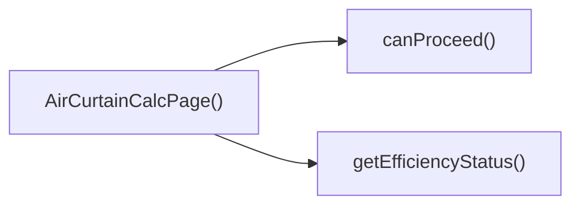

## Genel Bakış
Bu modül, VentHub HVAC platformu için havalı perde hesaplamaları yapan kullanıcı arayüzü sayfasını barındıran React bileşenidir. Çok adımlı hesaplama akışını tamamen yöneterek kullanıcının adımlar arasında sorunsuzca gezinmesini sağlar, ayrıca hesaplanan verimlilik verilerini kullanıcı dostu kategorilere ayırır.

## Fonksiyon Grupları
### Ana Sayfa Bileşeni
Modülün ana giriş noktası olarak tüm hesaplayıcı sayfasının işleyişini ve kullanıcı arayüzünü bir araya getirir, tüm alt fonksiyonları çalıştıracak ortamı sağlar.
- AirCurtainCalcPage

### Adım Yönetimi Fonksiyonları
Çok adımlı hesaplama sürecindeki kullanıcı gezintisini yönetir, bir sonraki adıma geçme koşullarını kontrol eder, ileri/geri adım atma ve tüm süreci sıfırlama işlemlerini gerçekleştirir.
- canProceed, nextStep, prevStep, reset

### Verimlilik Sınıflandırma Fonksiyonu
Hesaplanan verimlilik değerini alarak kullanıcı arayüzünde kullanılmak üzere üç performans seviyesinden birine sınıflandırır, sistemin uygun bildirim veya görselleştirmeyi sunmasına olanak tanır.
- getEfficiencyStatus

---

## AXIOMS – Mimari Varsayımlar
Bu modül, Venthub HVAC platformu için hava perdesi hesaplama işlemlerini adım adım yöneten React ön yüz sayfa bileşenidir; tüm işlevlerinin sorunsuz çalışması için modülün bağımlı olduğu yerel state yönetim mekanizmaları ve iç fonksiyon erişilebilirliği zorunludur.

[Aksiyom 1]: Eğer hesaplama akışındaki mevcut adımı tutan yerel state yapısı yoksa, canProceed(), nextStep() ve prevStep() adım yönetimi fonksiyonları çalışmaz, adım geçişleri gerçekleştirilemez.
[Aksiyom 2]: Eğer getEfficiencyStatus() fonksiyonuna geçirilen eff parametresi tanımlı bir string değeri değilse, hava perdesinin verimlilik durumu hesaplanamaz, kullanıcıya geçerli durum bilgisi sunulamaz.
[Aksiyom 3]: Eğer tüm hesaplama girdi ve ara sonuçlarını tutan yerel state yapısı erişilebilir değilse, reset() fonksiyonu hesaplama verilerini sıfırlayamaz, sıfırlama işlemi başarısız olur.
[Aksiyom 4]: Eğer mevcut adımdaki zorunlu girdilerin doğruluğunu kontrol eden mekanizma yoksa, canProceed() fonksiyonu hatalı değer döndürür, eksik/hatalı verilerle ileri adım geçilebilir veya doğru durumda geçiş engellenir.

---

## FONKSIYON DETAYLARI

### AirCurtainCalcPage
**Ne yapar**: VentHub HVAC projesinin hava perdesi hesaplayıcı arayüzünü sunan ana React bileşenidir. Tüm hesaplama akışını, kullanıcı girdilerini, ara adımları ve nihai sonuç görüntülemesini tek bir sayfa üzerinde toplar.
**Nasıl yapar**: İçerisinde adım yönetimi, form doğrulama, verimlilik analizi gibi tüm alt mantıkları barındıran yerleşik yardımcı fonksiyonları entegre ederek, kullanıcıya kesintisiz bir hesaplama deneyimi sunar. Tüm kullanıcı etkileşimlerini ve durum güncellemelerini bu ana bileşen üzerinden yönetir.
**Parametreler**: Fonksiyona herhangi bir parametre aktarılmaz.
**Dönüş**: React.FC türünde, uygulamada ekranlarda render edilebilen bir React bileşeni döndürür.

### canProceed
**Ne yapar**: Hava perdesi hesaplama akışında bir sonraki adıma geçiş için gerekli koşulların sağlanıp sağlanmadığını kontrol eden dahili bir yardımcı fonksiyondur. Yalnızca geçişin güvenli ve tam verilerle yapılmasını garanti altına almak için kullanılır.
**Nasıl yapar**: Mevcut hesaplama adımında girilmesi gereken tüm zorunlu form alanlarının doldurulduğunu, girdilerin doğrulama kurallarına uyduğunu ve hesaplamaya devam etmek için gereken minimum verinin tamamlandığını denetler.
**Parametreler**: Fonksiyona herhangi bir parametre aktarılmaz.
**Dönüş**: Fonksiyonun dönüş tipi tanımlarda belirtilmemiştir, yalnızca dahili geçiş koşulu denetimi için kullanılır.

### nextStep
**Ne yapar**: Hava perdesi hesaplama akışında mevcut adımdan sonraki adıma geçişi sağlayan durum yönetimi fonksiyonudur. Kullanıcının hesaplamadaki adımları ilerletmesini sağlar.
**Nasıl yapar**: canProceed fonksiyonundan geçiş onayı aldığında mevcut adım sayacını bir artırır, mevcut adımdaki kullanıcı girdilerini ara depolama alanına kaydeder ve bir sonraki adımın form veya içerik alanlarını ekrana getirir.
**Parametreler**: Fonksiyona herhangi bir parametre aktarılmaz.
**Dönüş**: Fonksiyonun dönüş tipi tanımlarda belirtilmemiştir, yalnızca dahili adım yönetimi işlemleri için kullanılır.

### prevStep
**Ne yapar**: Hava perdesi hesaplama akışında mevcut adımdan önceki adıma dönüşü sağlayan durum yönetimi fonksiyonudur. Kullanıcının önceki adımlardaki girdilerini düzenlemesine izin verir.
**Nasıl yapar**: Kullanıcı ilk adımda olmadığı sürece mevcut adım sayacını bir azaltır, önceki adımda kaydedilen kullanıcı girdilerini tekrar form alanlarına yükler ve ilgili adımın içeriğini ekrana getirir.
**Parametreler**: Fonksiyona herhangi bir parametre aktarılmaz.
**Dönüş**: Fonksiyonun dönüş tipi tanımlarda belirtilmemiştir, yalnızca dahili adım yönetimi işlemleri için kullanılır.

### reset
**Ne yapar**: Hava perdesi hesaplama akışındaki tüm kullanıcı girdilerini, ara durumları ve hesaplanmış sonuçları tamamen sıfırlayan fonksiyondur. Hesaplayıcıyı ilk açılış durumuna döndürür.
**Nasıl yapar**: Tüm form alanlarındaki kullanıcı verilerini temizler, adım sayacını başlangıç değerine ayarlar, daha önce hesaplanan tüm verimlilik analizleri ve ara sonuçları siler, tüm uyarı ve hata durumlarını ortadan kaldırır.
**Parametreler**: Fonksiyona herhangi bir parametre aktarılmaz.
**Dönüş**: Fonksiyonun dönüş tipi tanımlarda belirtilmemiştir, yalnızca dahili durum sıfırlama işlemleri için kullanılır.

### getEfficiencyStatus
**Ne yapar**: Hava perdesi için hesaplanan verimlilik değerine göre üç seviyeli bir durum sınıflandırması yapan analiz yardımcı fonksiyonudur. Arayüzde verimlilik seviyesinin uygun şekilde etiketlenmesini sağlar.
**Nasıl yapar**: Girdi olarak aldığı verimlilik değerini önceden tanımlanmış eşik değerleriyle karşılaştırır, bu karşılaştırma sonucuna göre verimliliğin hangi sınıfa ait olduğunu tespit eder ve ilgili sınıf etiketini döndürür.
**Parametreler**:
- name: eff, type: string | undefined — Hava perdesi için hesaplanan verimlilik değeri, tanımlanmamış olması durumunda da uyumlu şekilde çalışacak şekilde yapılandırılmıştır.
**Dönüş**: 'optimal', 'acceptable' veya 'warning' sabit string değerlerinden birini döndürür. Bu döndürülen değer, arayüzde verimlilik seviyesini görsel veya metinsel olarak işaretlemek için kullanılır.

---

## AST POINTERS

### [N1_NASIL] AST Pointer: C:\Users\alize\venthub-hvac\src\views\calculators\AirCurtainCalcPage.tsx::adımListesiDöndürenAnonimFonksiyon
- **params**: (parametre yok)
- **ic_degiskenler**:
  - `t` — Çeviri fonksiyonu, adım etiket ve açıklamalarını yerelleştirmek için kullanılır
- **Dönüş**: {id: number, label: string, description: string}[] tipinde hesaplayıcı adımlarını içeren dizi

### [N2_NASIL] AST Pointer: C:\Users\alize\venthub-hvac\src\views\calculators\AirCurtainCalcPage.tsx::uygulamaSecenekleriDöndürenAnonimFonksiyon
- **params**: (parametre yok)
- **ic_degiskenler**:
  - `t` — Çeviri fonksiyonu, uygulama seçeneklerinin etiket ve açıklamalarını yerelleştirmek için kullanılır
  - `Thermometer` — Lucide react termometre ikonu, soğuk oda ve konfor uygulamaları için simge olarak kullanılır
  - `Wind` — Lucide react rüzgar ikonu, böcek önleme uygulaması için simge olarak kullanılır
- **Dönüş**: {value: string, label: string, description: string, icon: JSX.Element}[] tipinde hava perdesi uygulama seçeneklerini içeren dizi

### [N3_NASIL] AST Pointer: C:\Users\alize\venthub-hvac\src\views\calculators\AirCurtainCalcPage.tsx::ruzgarKoşuluSecenekleriDöndürenAnonimFonksiyon
- **params**: (parametre yok)
- **ic_degiskenler**:
  - `t` — Çeviri fonksiyonu, rüzgar koşulu seçeneklerinin etiket ve açıklamalarını yerelleştirmek için kullanılır
- **Dönüş**: {value: string, label: string, description: string}[] tipinde rüzgar şiddeti seçeneklerini içeren dizi

### [N4_NASIL] AST Pointer: C:\Users\alize\venthub-hvac\src\views\calculators\AirCurtainCalcPage.tsx::trafikYogunluguSecenekleriDöndürenAnonimFonksiyon
- **params**: (parametre yok)
- **ic_degiskenler**:
  - `t` — Çeviri fonksiyonu, trafik yoğunluğu seçeneklerinin etiket ve açıklamalarını yerelleştirmek için kullanılır
- **Dönüş**: {value: string, label: string, description: string}[] tipinde kapı trafik yoğunluğu seçeneklerini içeren dizi

### [N5_NASIL] AST Pointer: C:\Users\alize\venthub-hvac\src\views\calculators\AirCurtainCalcPage.tsx::urlGuncellemeFonksiyonu
- **params**: (parametre yok)
- **ic_degiskenler**:
  - `window` — Tarayıcı pencere nesnesi, sunucu tarafı çalışmayı kontrol etmek için kullanılır
  - `params` — URL sorgu parametrelerini yönetmek için oluşturulan URLSearchParams nesnesi
  - `currentStep` — Mevcut hesaplayıcı adım numarası, URL'de adım bilgisini saklamak için kullanılır
  - `doorWidth` — Kullanıcının girdiği kapı genişliği değeri, URL'de saklanmak üzere kullanılır
  - `doorHeight` — Kullanıcının girdiği kapı yüksekliği değeri, URL'de saklanmak üzere kullanılır
  - `application` — Seçilen hava perdesi uygulaması türü, URL'de saklanmak üzere kullanılır
  - `windCondition` — Seçilen ortam rüzgar koşulu, URL'de saklanmak üzere kullanılır
  - `trafficIntensity` — Seçilen kapı trafik yoğunluğu, URL'de saklanmak üzere kullanılır
  - `query` - Oluşturulan sorgu stringi, URL'ye eklenmek üzere kullanılır
  - `router` — Next.js router nesnesi, URL'yi güncellemek için replace metodu çağrılır
  - `pathname` — Mevcut sayfa yolu, yeni URL oluşturmak için kullanılır
- **Dönüş**: yok (tarayıcı dışı ortamda erken return, sunucu tarafında çalışmayı engeller)

### [N6_NASIL] AST Pointer: C:\Users\alize\venthub-hvac\src\views\calculators\AirCurtainCalcPage.tsx::hesaplamaCalistirmaFonksiyonu
- **params**: (parametre yok)
- **ic_degiskenler**:
  - `currentStep` — Mevcut hesaplayıcı adımı, sadece son adımda hesaplama yapmak için kontrol edilir
  - `doorWidth` — String tipinde kapı genişliği, sayısal değere dönüştürülmek için kullanılır
  - `doorHeight` — String tipinde kapı yüksekliği, sayısal değere dönüştürülmek için kullanılır
  - `width` — parseFloat ile dönüştürülmüş sayısal kapı genişliği, hesaplamaya giriş olarak verilir
  - `height` — parseFloat ile dönüştürülmüş sayısal kapı yüksekliği, hesaplamaya giriş olarak verilir
  - `calculationResult` — Hava perdesi hesaplama fonksiyonundan dönen sonuç, state'e kaydedilmek üzere kullanılır
  - `calculateAirCurtain` — Ana hesaplama fonksiyonu, tüm giriş parametreleri ile çağrılarak sonuç üretilir
  - `application` — Seçilen uygulama türü, hesaplamaya giriş olarak verilir
  - `windCondition` — Seçilen rüzgar koşulu, hesaplamaya giriş olarak verilir
  - `trafficIntensity` — Seçilen trafik yoğunluğu, hesaplamaya giriş olarak verilir
  - `setResult` — Sonuç state'ini güncelleyen setter fonksiyonu, hesaplama sonucunu kaydetmek için kullanılır
- **Dönüş**: yok

### [N7_NASIL] AST Pointer: C:\Users\alize\venthub-hvac\src\views\calculators\AirCurtainCalcPage.tsx::canProceed
- **params**: (parametre yok)
- **ic_degiskenler**:
  - `currentStep` — Mevcut adım numarası, adım özel doğrulama koşullarını seçmek için kullanılır
  - `w` — parseFloat ile dönüştürülmüş kapı genişliği, boyut doğrulaması için kullanılır
  - `h` — parseFloat ile dönüştürülmüş kapı yüksekliği, boyut doğrulaması için kullanılır
  - `doorWidth` — String tipindeki ham kapı genişliği değeri, sayısal dönüşüm için kullanılır
  - `doorHeight` — String tipindeki ham kapı yüksekliği değeri, sayısal dönüşüm için kullanılır
  - `application` — Seçilen uygulama türü, 2. adım doğrulaması için doluluğu kontrol edilir
  - `windCondition` — Seçilen rüzgar koşulu, 3. adım doğrulaması için doluluğu kontrol edilir
  - `trafficIntensity` — Seçilen trafik yoğunluğu, 3. adım doğrulaması için doluluğu kontrol edilir
- **Dönüş**: boolean (adım arasına geçişe izin verilip verilmeyeceğini belirten değer)

### [N8_NASIL] AST Pointer: C:\Users\alize\venthub-hvac\src\views\calculators\AirCurtainCalcPage.tsx::reset
- **params**: (parametre yok)
- **ic_degiskenler**:
  - `setCurrentStep` — Mevcut adım state'ini sıfırlayan setter fonksiyonu, ilk adıma döndürmek için kullanılır
  - `setDoorWidth` — Kapı genişliği state'ini varsayılan değere sıfırlayan setter
  - `setDoorHeight` — Kapı yüksekliği state'ini varsayılan değere sıfırlayan setter
  - `setApplication` — Uygulama türü state'ini varsayılan değere sıfırlayan setter
  - `setWindCondition` — Rüzgar koşulu state'ini varsayılan değere sıfırlayan setter
  - `setTrafficIntensity` — Trafik yoğunluğu state'ini varsayılan değere sıfırlayan setter
  - `setResult` — Hesaplama sonucu state'ini null olarak sıfırlayan setter
- **Dönüş**: yok

### [N9_NASIL] AST Pointer: C:\Users\alize\venthub-hvac\src\views\calculators\AirCurtainCalcPage.tsx::getEfficiencyStatus
- **params**: [eff: string | undefined]
- **ic_degiskenler**:
  - `eff` — Giriş olarak alınan ham verimlilik durumu değeri, standart duruma dönüştürülmek için kullanılır
- **Dönüş**: 'optimal' | 'acceptable' | 'warning'

### [N10_NASIL] AST Pointer: C:\Users\alize\venthub-hvac\src\views\calculators\AirCurtainCalcPage.tsx::svgCizimFonksiyonu
- **params**: [x: any, i: number]
- **ic_degiskenler**:
  - `x` — SVG çiziminin x ekseni konumu, çizgi ve poligonun konumunu belirlemek için kullanılır
  - `i` — Dizi indeksi, SVG grubu için benzersiz key değeri olarak kullanılır
- **Dönüş**: JSX.Element (içinde çizgi ve ok işareti içeren SVG grubu)

---

## ÇAĞRI HARİTASI

### Disariya Cagrilar (Outgoing)
AirCurtainCalcPage() ana fonksiyonu, hava perdesi hesaplama sürecinde verimlilik durumunu almak için getEfficiencyStatus, işleme devam edilip edilemeyeceğini kontrol etmek içinse canProceed fonksiyonlarını çağırır.

### Disaridan Cagrilanlar (Incoming)
Sağlanan çağrı verisinde bu modülü kullanan herhangi bir dış dosya veya fonksiyon belirtilmemiştir.

### Ic Ice Fonksiyonlar (Nested)
Yok

---

## DOSYA-İÇİ ÇAĞRI GRAFİĞİ
  AirCurtainCalcPage() → canProceed()
  AirCurtainCalcPage() → getEfficiencyStatus()

---

## NODE ID STANDARD

  file: src\views\calculators\AirCurtainCalcPage.tsx
  function: src\views\calculators\AirCurtainCalcPage.tsx::AirCurtainCalcPage
  function: src\views\calculators\AirCurtainCalcPage.tsx::canProceed
  function: src\views\calculators\AirCurtainCalcPage.tsx::nextStep
  function: src\views\calculators\AirCurtainCalcPage.tsx::prevStep
  function: src\views\calculators\AirCurtainCalcPage.tsx::reset
  function: src\views\calculators\AirCurtainCalcPage.tsx::getEfficiencyStatus

---

## DISA AKTARILANLAR (EXPORTS)
  export: AirCurtainCalcPage