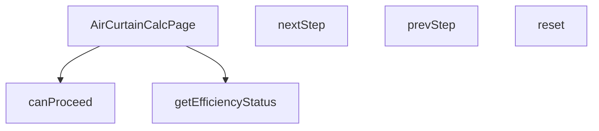

## Genel Bakış
Bu modül, VentHub HVAC platformu için hava perdesi hesaplama arayüzünü sunan bir React sayfasıdır. Çok adımlı bir sihirbaz (wizard) yapısıyla kullanıcıdan gerekli bilgileri toplar ve adım geçişlerini yönetir. Hesaplama sonucunda elde edilen verimlilik değerini kullanıcıya anlamlı durum kategorileriyle geri bildirir.

## Fonksiyon Grupları

### Ana Sayfa Bileşeni
Modülün giriş noktasıdır. Tüm hesaplama sayfasının arayüzünü, durum yönetimini ve alt fonksiyonların kullanımını bir arada barındıran üst düzey React bileşenidir.
- AirCurtainCalcPage

### Adım Yönetimi
Çok adımlı hesaplama sürecinde kullanıcının ileri-geri gezinmesini, sonraki adıma geçiş koşullarının denetlenmesini ve tüm sürecin başlangıç durumuna sıfırlanmasını sağlar. `canProceed` fonksiyonu, geçerli adımın zorunlu girdileri sağlanmadığı sürece `True` dönmez; bu sayede eksik bilgiyle ilerleme engellenir.
- canProceed, nextStep, prevStep, reset

### Verimlilik Değerlendirme
Hesaplama sonucu ortaya çıkan verimlilik oranını, arayüzde gösterilecek kabul edilebilirlik seviyelerine (optimal, acceptable, warning) sınıflandırır. Kullanıcıya sonuçların kalitesi hakkında net ve anında geri bildirim sunar.
- getEfficiencyStatus

---

## AXIOMS – Mimari Varsayımlar
- Bu modül davranışsal mantık içermez (salt veri / konfigürasyon / tip tanımı).
- [Aksiyom 1]: Modülün dışa açtığı yapı (anahtar kümesi / şema) bir sözleşmedir; tüketiciler bu sabit yapıya bağlıdır — kırıcı değişiklik tüm tüketicileri etkiler.
- [Aksiyom 2]: Bir öğe ekleme/çıkarma yapısal-uyumlu olmalı; ilgili tipler ve seçiciler aynı commit'te güncel tutulmalıdır.

---

## FONKSİYON DETAYLARI

### AirCurtainCalcPage
**Ne yapar**: Hava perdesi hesaplama sayfası için ana React bileşenini (component) oluşturur. Bu bileşen, kullanıcının adım adım ilerleyerek hava perdesi hesaplaması yapmasını sağlayan arayüzü ve iş mantığını yönetir.
**Nasıl yapar**: Fonksiyon, React fonksiyonel bileşeni (React.FC) olarak tanımlanır. Bileşenin iç mantığı verilmediği için, genel bir React bileşeni yapısı ile çalıştığı varsayılır. Bileşen, adım ilerleme (step) durumunu, form değerlerini ve hesaplama mantığını kendi içinde yönetir.
**Parametreler**:
(Parametre almaz)
**Dönüş**: React.FC — Hava perdesi hesaplama sayfasını temsil eden React bileşeni.

### canProceed
**Ne yapar**: Mevcut hesaplama adımında ilerlemenin (sonraki adıma geçmenin) uygun olup olmadığını kontrol eder.
**Nasıl yapar**: Fonksiyon, içinde bulunduğu bağlama (muhtemelen bileşen durumu) göre mantıksal bir değerlendirme yapar. Verilen kod parçasında, `currentStep` 4'ten küçükse ve `canProceed()` true döndürürse adımın artırılacağı görülüyor. Bu durum, `canProceed`'in geçerli adımın (örn. form alanlarının doldurulması) bir ön koşulunu kontrol ettiğini gösterir.
**Parametreler**:
(Parametre almaz)
**Dönüş**: void — Fonksiyon doğrudan bir değer döndürmez, ancak içinde bulunduğu bağlamda (bir kontrol ifadesinde kullanıldığında) mantıksal bir değer (true/false) üretir. Verilen tanım "void veya bilinmiyor" olarak belirtildiği için dönüş tipi resmi olarak void kabul edilir.

### nextStep
**Ne yapar**: Hesaplama sürecinde bir sonraki adıma (form sayfasına) geçişi tetikler.
**Nasıl yapar**: Fonksiyon, mevcut adım sayısını (`currentStep`) bir artırarak bileşenin durumunu günceller. Bu güncelleme, arayüzde bir sonraki formun veya adımın gösterilmesini sağlar. Genellikle bir buton tıklaması gibi bir etkinlik sonucu çağrılır.
**Parametreler**:
(Parametre almaz)
**Dönüş**: void — Fonksiyon durumu (state) değiştirir ancak herhangi bir değer döndürmez.

### prevStep
**Ne yapar**: Hesaplama sürecinde bir önceki adıma (form sayfasına) geri dönmeyi tetikler.
**Nasıl yapar**: Fonksiyon, mevcut adım sayısını (`currentStep`) bir azaltarak bileşenin durumunu günceller. Bu güncelleme, arayüzde bir önceki formun veya adımın yeniden gösterilmesini sağlar. Kullanıcının hatalı girişleri düzeltmesi veya önceki adımları gözden geçirmesi için kullanılır.
**Parametreler**:
(Parametre almaz)
**Dönüş**: void — Fonksiyon durumu (state) değiştirir ancak herhangi bir değer döndürmez.

### reset
**Ne yapar**: Hesaplama sürecini ve form verilerini başlangıç durumuna sıfırlar.
**Nasıl yapar**: Fonksiyon, bileşenin tüm ilgili durum değişkenlerini (örn. `currentStep`, form değerleri) başlangıç değerlerine geri alır. Bu işlem, kullanıcının hesaplamayı sıfırdan başlatmasını sağlar.
**Parametreler**:
(Parametre almaz)
**Dönüş**: void — Fonksiyon durumları (state) sıfırlar ancak herhangi bir değer döndürmez.

### getEfficiencyStatus
**Ne yapar**: Verilen bir verimlilik (efficiency) değerine göre, hava perdesinin performans durumunu kategorize eder.
**Nasıl yapar**: Fonksiyon, `eff` parametresini (string veya undefined) alır ve bu değeri önceden tanımlanmış eşik değerlerle karşılaştırır. Sonuç olarak, durumu 'optimal' (en iyi), 'acceptable' (kabul edilebilir) veya 'warning' (uyarı) olarak sınıflandırır. Bu sınıflandırma, muhtemelen arayüzde farklı renk veya ikonlarla görsel bir geri bildirim sağlamak için kullanılır.
**Parametreler**:
- eff: string | undefined — Değerlendirilecek verimlilik değeri. String formatında bir sayı veya metin olabilir; undefined ise değerlendirilmeyen bir durumu temsil eder.
**Dönüş**: 'optimal' | 'acceptable' | 'warning' — Değerin durumuna göre üç olası string değerden birini döndürür.

---

## İTHALATLAR (IMPORTS)
- import: ../../hooks/useCalculatorUsage::useCalculatorUsage
- import: ../../i18n/I18nProvider::useI18n
- import: lucide-react::ArrowLeft
- import: lucide-react::ArrowRight
- import: lucide-react::DoorOpen
- import: lucide-react::RotateCcw
- import: lucide-react::Thermometer
- import: lucide-react::Wind
- import: lucide-react::Zap
- import: next/navigation::usePathname
- import: next/navigation::useRouter
- import: next/navigation::useSearchParams
- import: react::React
- import: react::useEffect
- import: react::useMemo
- import: react::useState

---

## AST POINTERS

### [N1_NASIL] AST Pointer: src/views/calculators/AirCurtainCalcPage.tsx::AirCurtainCalcPage
- **params**: yok
- **ic_degiskenler**:
  - `t` — i18n çeviri fonksiyonu, metinleri yerelleştirir
  - `router` — Next.js useRouter ile alınan navigasyon nesnesi
  - `pathname` — usePathname ile alınan mevcut URL yolu
  - `searchParams` — useSearchParams ile alınan URL sorgu parametreleri
  - `currentStep` — useState ile tutulan mevcut adım numarası (1-4 arası)
  - `setCurrentStep` — currentStep state'ini güncelleyen setter fonksiyonu
  - `doorWidth` — useState ile tutulan kapı genişliği değeri (varsayılan '1.5')
  - `setDoorWidth` — doorWidth state'ini güncelleyen setter fonksiyonu
  - `doorHeight` — useState ile tutulan kapı yüksekliği değeri (varsayılan '2.5')
  - `setDoorHeight` — doorHeight state'ini güncelleyen setter fonksiyonu
  - `application` — useState ile tutulan uygulama tipi ('comfort', 'insect', 'coldRoom')
  - `setApplication` — application state'ini güncelleyen setter fonksiyonu
  - `windCondition` — useState ile tutulan rüzgar koşulu ('none', 'light', 'moderate', 'strong')
  - `setWindCondition` — windCondition state'ini güncelleyen setter fonksiyonu
  - `trafficIntensity` — useState ile tutulan trafik yoğunluğu ('low', 'medium', 'high')
  - `setTrafficIntensity` — trafficIntensity state'ini güncelleyen setter fonksiyonu
  - `result` — useState ile tutulan hesaplama sonucu nesnesi
  - `setResult` — result state'ini güncelleyen setter fonksiyonu
  - `steps` — useMemo ile oluşturulan adım tanımları dizisi (id, label, description)
  - `applicationsOptions` — useMemo ile oluşturulan uygulama seçenekleri dizisi (value, label, description, icon)
  - `windOptions` — useMemo ile oluşturulan rüzgar koşulu seçenekleri dizisi (value, label, description)
  - `trafficOptions` — useMemo ile oluşturulan trafik yoğunluğu seçenekleri dizisi (value, label, description)
  - `updateURL` — URL sorgu parametrelerini güncelleyen fonksiyon
  - `canProceed` — mevcut adımın geçiş kriterlerini kontrol eden fonksiyon
  - `nextStep` — bir sonraki adıma geçiş yapan fonksiyon
  - `prevStep` — bir önceki adıma geçiş yapan fonksiyon
  - `reset` — tüm form state'lerini varsayılan değerlere sıfırlayan fonksiyon
  - `getEfficiencyStatus` — verimlilik durumu string'ini güvenli tipe dönüştüren fonksiyon
  - `useCalculatorUsage` — hesaplama kullanımını takip eden hook
- **Dönüş**: React.FC (JSX elementi)

### [N2_NASIL] AST Pointer: src/views/calculators/AirCurtainCalcPage.tsx::canProceed
- **params**: yok
- **ic_degiskenler**:
  - `currentStep` — kontrol edilen mevcut adım numarası (1, 2, 3 veya diğer)
  - `doorWidth` — parseFloat ile sayıya dönüştürülen kapı genişliği string'i
  - `doorHeight` — parseFloat ile sayıya dönüştürülen kapı yüksekliği string'i
  - `w` — parseFloat(doorWidth) sonucu, kapı genişliğinin sayısal değeri
  - `h` — parseFloat(doorHeight) sonucu, kapı yüksekliğinin sayısal değeri
  - `application` — uygulama tipi, 2. adımda varlığı kontrol edilir
  - `windCondition` — rüzgar koşulu, 3. adımda varlığı kontrol edilir
  - `trafficIntensity` — trafik yoğunluğu, 3. adımda varlığı kontrol edilir
- **Dönüş**: boolean — adım kriterleri sağlanıyorsa true, sağlanmıyorsa false

### [N3_NASIL] AST Pointer: src/views/calculators/AirCurtainCalcPage.tsx::nextStep
- **params**: yok
- **ic_degiskenler**:
  - `currentStep` — mevcut adım numarası, setCurrentStep ile artırılır
  - `setCurrentStep` — currentStep state'ini güncelleyen setter fonksiyonu
- **Dönüş**: yok

### [N4_NASIL] AST Pointer: src/views/calculators/AirCurtainCalcPage.tsx::prevStep
- **params**: yok
- **ic_degiskenler**:
  - `currentStep` — mevcut adım numarası, setCurrentStep ile azaltılır
  - `setCurrentStep` — currentStep state'ini güncelleyen setter fonksiyonu
- **Dönüş**: yok

### [N5_NASIL] AST Pointer: src/views/calculators/AirCurtainCalcPage.tsx::reset
- **params**: yok
- **ic_degiskenler**:
  - `setCurrentStep` — currentStep'i 1'e sıfırlayan setter fonksiyonu
  - `setDoorWidth` — doorWidth'i '1.5' değerine sıfırlayan setter fonksiyonu
  - `setDoorHeight` — doorHeight'i '2.5' değerine sıfırlayan setter fonksiyonu
  - `setApplication` — application'ı 'comfort' değerine sıfırlayan setter fonksiyonu
  - `setWindCondition` — windCondition'ı 'none' değerine sıfırlayan setter fonksiyonu
  - `setTrafficIntensity` — trafficIntensity'ı 'medium' değerine sıfırlayan setter fonksiyonu
  - `setResult` — result'ı null'a sıfırlayan setter fonksiyonu
- **Dönüş**: yok

### [N6_NASIL] AST Pointer: src/views/calculators/AirCurtainCalcPage.tsx::getEfficiencyStatus
- **params**: `eff` — string | undefined tipinde verimlilik durumu değeri
- **ic_degiskenler**:
  - `eff` — 'optimal', 'acceptable' veya undefined olabilen girdi parametresi
- **Dönüş**: 'optimal' | 'acceptable' | 'warning' — eff 'optimal' ise 'optimal', 'acceptable' ise 'acceptable', diğer tüm durumlarda 'warning' döner

---

## MERMAID CALL GRAPH

## NODE ID STANDARD

  file: src\views\calculators\AirCurtainCalcPage.tsx
  function: src\views\calculators\AirCurtainCalcPage.tsx::AirCurtainCalcPage
  function: src\views\calculators\AirCurtainCalcPage.tsx::canProceed
  function: src\views\calculators\AirCurtainCalcPage.tsx::nextStep
  function: src\views\calculators\AirCurtainCalcPage.tsx::prevStep
  function: src\views\calculators\AirCurtainCalcPage.tsx::reset
  function: src\views\calculators\AirCurtainCalcPage.tsx::getEfficiencyStatus

---

## DISA AKTARILANLAR (EXPORTS)
  export: AirCurtainCalcPage

---

## STİL TOKENLERİ

### Arbitrary Değerler (token'a geçirilmemiş)
Yok — tüm stiller token'a geçirilmiş. ✅

### Kullanılan Token'lar (zaten token'a geçirilmiş)
- (yok)

### Tailwind Sınıf Özeti
- **Renkler:** `bg-gray-200`, `bg-gray-50`, `bg-primary-navy`, `bg-primary-navy/10`, `bg-secondary-blue`, `bg-secondary-blue/10`, `bg-secondary-blue/5`, `bg-success-green`, `bg-success-green/10`, `bg-warning-orange`, `bg-warning-orange/10`, `bg-white`, `border-2`, `border-light-gray`, `border-secondary-blue/30`
- **Layout:** `flex`, `flex-wrap`, `gap-2`, `gap-3`, `gap-4`, `gap-6`, `grid`, `h-12`, `items-center`, `justify-between`, `justify-center`, `max-w-xs`, `md:grid-cols-2`, `md:p-8`, `p-2`
- **Varyant/Responsive:** `:`, `hover:`, `md:` önekleri
- **Yardımcı Sınıflar:** `${canProceed`, `${currentStep`, `${result.efficiency`, `1`, `:`, `===`, `acceptable`, `border`, `cursor-not-allowed`, `font-medium`, `font-semibold`, `mb-2`, `mb-6`, `mt-6`, `mt-8`