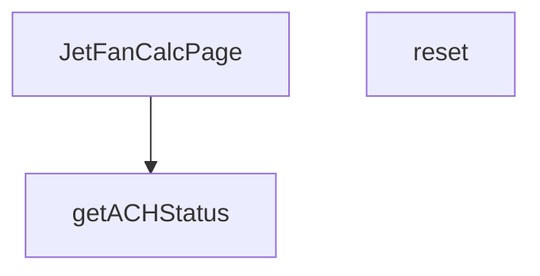

## Genel Bakış
Bu modül, VentHub HVAC projesi kapsamında jet fan havalandırma hesaplamaları yapan tek sayfalık bir React bileşenidir. Kullanıcıların parametreleri girerek hava değişim sayısını hesaplamasını, formu sıfırlamasını ve sonucun performans seviyesini (ACH durumunu) gerçek zamanlı olarak görmesini sağlar. Modül, arayüz oluşturımı, durum yönetimi ve hesaplama sonuçlarının yorumlanmasını tek bir yapıda merkezileştirir.

## Fonksiyon Grupları
### Ana Sayfa Bileşeni
Tüm jet fan hesaplayıcı arayüzünü, form alanlarını, hesaplama mantığını ve sonuç gösterimini yöneten ana React bileşenidir. Kullanıcı etkileşimini ve modülün genel akışını kontrol eder.

- JetFanCalcPage

### Yardımcı İşlevler
Sayfa içindeki belirli görevleri yerine getiren yardımcı fonksiyonlardır. Formun sıfırlanması ve hesaplanan hava değişim sayısının (ACH) performans durumunun (örneğin: optimal, kabul edilebilir) belirlenmesi gibi işlemleri desteklerler.

- reset, getACHStatus

---

## AXIOMS – Mimari Varsayımlar

Bu modül için fonksiyon gövdesi mevcut olmadığı için sadece fonksiyon imzalarından ve parametre tiplerinden çıkarılabilecek sınırlı mimari varsayımlar tanımlanmıştır.

**[Aksiyom 1]**: `getACHStatus` fonksiyonuna iletilen `ach` parametresi, hesaplanmış bir sayısal değer olmalıdır. Eğer geçerli bir sayısal değer (number) yoksa, fonksiyon beklenmedik bir davranış sergileyebilir veya "optimal", "acceptable", "warning", "critical" değerlerinden uygun birini döndüremeyebilir.

**[Aksiyom 2]**: `getACHStatus` fonksiyonunun döndürebileceği değerler sabit ve kapalı bir kümedir: `{'optimal', 'acceptable', 'warning', 'critical'}`. Eğer fonksiyon imzasında belirtilen bu değerlerden farklı bir değer döndürmeye yönelik bir mantık varsa, bu durum tip güvenliğini ihlal eder ve istemci tarafında hatalara yol açar.

**[Aksiyom 3]**: `JetFanCalcPage` React bileşeni olarak render edilmeli ve React runtime ortamında (tarayıcı veya React-native ortamı) çalışmalıdır. Eğer React ortamı (veya ReactFC'yi destekleyen bir ortam) yoksa, bileşen oluşturulamaz.

**[Aksiyom 4]**: `reset` fonksiyonu, bileşenin iç durumunu (state) ve/veya form alanlarını başlangıç değerlerine döndürmelidir. Eğer bu fonksiyon bileşenin durum yönetim sistemiyle (örn. useState, useRef) doğrudan veya dolaylı olarak entegre değilse, form alanları beklenen şekilde sıfırlanamaz.

---

## FONKSİYON DETAYLARI

### JetFanCalcPage
**Ne yapar**: Jet Fan hesaplama sayfasının ana React bileşenidir. HVAC (Isıtma, Havalandırma ve Klima) sistemi için jet fan hesaplamalarını kullanıcı arayüzünde sunar. Bu bileşen, hesaplama formunu, sonuçları ve ilgili durum göstergelerini yönetir.

**Nasıl yapar**: Fonksiyon bir React fonksiyonel bileşenidir (React.FC). İçerisinde hesaplama mantığını, form durumunu (state) ve kullanıcı etkileşimlerini yönetir. Jet fan sistemi için gerekli parametreleri (hava debisi, kanal boyutları, ACH değeri vb.) işleyerek hesaplama sonuçlarını oluşturur ve sayfada gösterir. Kullanıcının değerleri girip hesaplayabilmesini sağlar.

**Parametreler**:
Bu fonksiyon parametre almaz, çünkü bir React bileşenidir ve props üzerinden veri alması beklenir (ancak bu spesifikasyonda props tanımlanmamıştır).

**Dönüş**: `React.FC` tipinde bir JSX bileşeni döndürür. Bu, React Functional Component anlamına gelir ve hesaplama sayfasının tüm arayüzünü render eder.

### reset
**Ne yapar**: JetFanCalcPage sayfasındaki tüm kullanıcı girişlerini, mevcut hesaplama sonuçlarını ve sayfa durum değerlerini varsayılan ilk hallerine döndüren sıfırlama fonksiyonudur. Kullanıcının mevcut hesaplamasını sıfırlayarak tamamen yeni bir hesaplama süreci başlatmasını mümkün kılar. Formdaki tüm doldurulmuş alanları temizleyerek hata veya yanlış giriş durumlarında kolayca sıfırlama imkanı sunar.
**Nasıl yapar**: JetFanCalcPage bileşeni içinde yönetilen state nesnesindeki tüm form değerlerini, hesaplanmış performans verilerini ve tüm uyarı/hata mesajlarını ilk yükleme durumundaki varsayılan değerlerle günceller. Sayfa içindeki tüm durum bilgilerini sıfırlayarak kullanıcının baştan hesaplama yapmasına imkan tanır.
**Parametreler**: Bu fonksiyon herhangi bir giriş parametresi almaz.
**Dönüş**: Herhangi bir değer döndürmez, yalnızca sayfa içi durumu değiştirmek üzere çalışan void işlevidir, tanımında dönüş tipi belirtilmemiştir.

### getACHStatus
**Ne yapar**: Hesaplanan saatlik hava değişim sayısı (ACH - Air Change per Hour) değerine göre sistemin hava değişim performansını dört farklı risk kategorisinden birine sınıflandıran yardımcı doğrulama fonksiyonudur. Elde edilen durum değeri, kullanıcı arayüzünde uygun görsel ipuçları veya bilgilendirme mesajları ile kullanıcıya sunulmak üzere kullanılır. HVAC sistemlerinin yeterli hava değişimi sağlamasını kontrol etmek için temel bir kontrol mekanizmasıdır.
**Nasıl yapar**: Girdi olarak aldığı sayısal ach değerini önceden tanımlanmış endüstri standartlarındaki eşik değerlerle karşılaştırır, karşılaştırma sonucunda performansın hangi kategoriye ait olduğunu belirler. Belirlenen durum metni, arayüzde uygun renk, ikon veya uyarı metni ile gösterilerek kullanıcının sistem durumunu kolayca anlamasını sağlar.
**Parametreler**:
- name: ach — type: number — Sınıflandırma yapılacak temel girdi olan hesaplanmış saatlik hava değişim sayısını temsil eden sayısal değer, performans seviyesini belirlemek için eşiklerle karşılaştırılır.
**Dönüş**: Sadece dört farklı string değerden birini döndürür: 'optimal', 'acceptable', 'warning' veya 'critical'. Bu değerler sırasıyla mükemmel, kabul edilebilir, dikkat gerektiren ve kritik düzeyde hava değişim performansını ifade eder.

---

## İTHALATLAR (IMPORTS)
- import: ../../i18n/I18nProvider::useI18n
- import: ../../i18n/format::formatNumber
- import: lucide-react::ArrowDownUp
- import: lucide-react::Car
- import: lucide-react::Gauge
- import: lucide-react::MapPin
- import: lucide-react::RotateCcw
- import: lucide-react::Wind
- import: react::React
- import: react::useMemo
- import: react::useState

---

## AST POINTERS

### [N1_NASIL] AST Pointer: JetFanCalcPage.tsx::匿名計算函數
- **params**: ()
- **ic_degiskenler**:
  - `lenVal` — `length` state'inin parseFloat ile sayısal değerine dönüştürülmüş hali; hesaplama için uzunluk değeri olarak kullanılır
  - `widVal` — `width` state'inin parseFloat ile sayısal değerine dönüştürülmüş hali; hesaplama için genişlik değeri olarak kullanılır
  - `heiVal` — `height` state'inin parseFloat ile sayısal değerine dönüştürülmüş hali; hesaplama için yükseklik değeri olarak kullanılır
  - `carVal` — `carCapacity` state'inin parseFloat ile sayısal değerine dönüştürülmüş hali; otopark uygulaması için araç kapasitesi değeri
  - `trafficVal` — `trafficFlow` state'inin parseFloat ile sayısal değerine dönüştürülmüş hali; saatlik trafik akışı değeri
- **Dönüş**: `calculateJetFan(...)` çağrı sonucu veya `null` (geçersiz girdi durumunda)

### [N2_NASIL] AST Pointer: JetFanCalcPage.tsx::reset
- **params**: ()
- **ic_degiskenler**: (yok — tüm satırlar state setter çağrılarıdır)
- **Dönüş**: yok (yan etki: tüm form state'lerini varsayılan değerlere sıfırlar)

### [N3_NASIL] AST Pointer: JetFanCalcPage.tsx::getACHStatus
- **params**: `(ach: number)`
- **ic_degiskenler**: (yok — sadece parametre `ach` kullanılır)
- **Dönüş**: `'optimal' | 'acceptable' | 'warning'` (string literal — `applicationType`'a bağlı mantıksal dallanma ile dönen durum etiketi)

### [N4_NASIL] AST Pointer: JetFanCalcPage.tsx::匿名SVG_map_callback
- **params**: `(_, i)` — `_` kullanılmayan ilk parametre (eleman), `i` harita indeksi
- **ic_degiskenler**:
  - `x` — her fan görseli için `40 + (i * 28)` formülüyle hesaplanan yatay koordinat; SVG içinde fan çizimlerinin x konumunu belirler
- **Dönüş**: JSX `<g>` elemanı (içinde `<ellipse>` ve `<line>` bulunan SVG grubu)

---

## MERMAID CALL GRAPH

## NODE ID STANDARD

  file: src\views\calculators\JetFanCalcPage.tsx
  function: src\views\calculators\JetFanCalcPage.tsx::JetFanCalcPage
  function: src\views\calculators\JetFanCalcPage.tsx::reset
  function: src\views\calculators\JetFanCalcPage.tsx::getACHStatus

---

## DISA AKTARILANLAR (EXPORTS)
  export: JetFanCalcPage

---

## STİL TOKENLERİ

### Arbitrary Değerler (token'a geçirilmemiş)
Yok — tüm stiller token'a geçirilmiş. ✅

### Kullanılan Token'lar (zaten token'a geçirilmiş)
- (yok)

### Tailwind Sınıf Özeti
- **Renkler:** `bg-gray-100`, `bg-primary-navy/10`, `bg-secondary-blue/5`, `bg-success-green/10`, `bg-warning-orange/10`, `bg-white`, `border-light-gray`, `border-warning-orange/30`, `fill-steel-gray`, `hover:text-industrial-gray`, `text-7px`, `text-center`, `text-industrial-gray`, `text-lg`, `text-primary-navy`
- **Layout:** `flex`, `flex-col`, `flex-shrink-0`, `gap-2`, `gap-3`, `gap-4`, `gap-8`, `grid`, `grid-cols-2`, `grid-cols-3`, `items-center`, `items-start`, `justify-center`, `lg:grid-cols-2`, `max-w-md`
- **Varyant/Responsive:** `hover:`, `lg:` önekleri
- **Yardımcı Sınıflar:** `border`, `font-medium`, `font-semibold`, `mb-3`, `mb-4`, `mb-6`, `ml-2`, `mt-0.5`, `mt-1`, `mt-4`, `py-12`, `rounded-2xl`, `rounded-full`, `rounded-lg`, `rounded-xl`