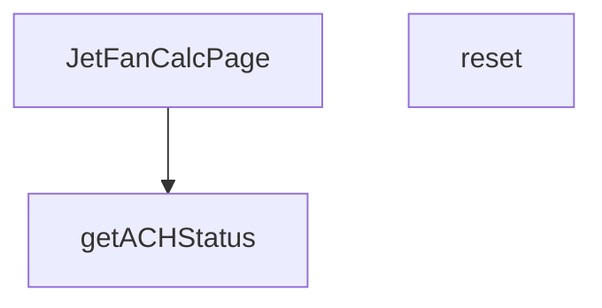

## Genel Bakış
VentHub HVAC projesinin hesaplayıcılar bölümünde yer alan bu React modülü, jet fan sistemleri için hesaplama arayüzü sunan bir sayfa bileşenidir. Kullanıcıların jet fan hesaplarını yapmasına, formu sıfırlamasına ve hesaplanan hava değişim sayısının (ACH) performans durumunu görmesine olanak tanır.

## Fonksiyon Grupları
### Ana Sayfa Bileşeni
Tüm jet fan hesaplayıcı sayfasının temel yapısını oluşturan ana React bileşenidir, arayüzü ve tüm ilişkili işlevleri bir araya getirerek çalıştırır.
- JetFanCalcPage

### Kullanıcı İşlemleri Fonksiyonları
Kullanıcı tarafından tetiklenen sayfa içi eylemleri yönetir, mevcut tüm hesap değerlerini varsayılan başlangıç durumuna döndürmek için kullanılır.
- reset

### Performans Durumu Değerlendirme Fonksiyonları
Hesaplanan hava değişim sayısı (ACH) değerine göre sistemin çalışma durumunu sınıflandırır, optimallik ve uygunluk seviyesini belirler.
- getACHStatus

---

## AXIOMS – Mimari Varsayımlar
Bu modül için, jet fan hesaplayıcı sayfasının doğru çalışması ve kullanıcıya tutarlı bir deneyim sunması aşağıdaki mimari varsayımlara bağlıdır.

[Aksiyom 1]: Eğer APPLICATION_OPTIONS veya VENTILATION_MODE_OPTIONS sabitleri tanımlı değilse veya boş bir diziye sahipse, bileşen düzgün şekilde oluşturulamaz veya kullanıcıya sunulan seçenekler eksik kalır.

[Aksiyom 2]: Eğer reset fonksiyonu çağrıldığında, bileşenin ilgili tüm state değişkenlerine (örn. hesap girdileri, sonuçlar) erişimi yoksa veya bunlar sıfırlanamıyorsa, kullanıcı arayüzü önceki hesaplama verileriyle tutarsız bir durumda kalır.

[Aksiyom 3]: Eğer getACHStatus fonksiyonu, `ach` parametresi olarak `number` tipinde geçerli (pozitif) bir değer almıyorsa (örn. negatif, NaN veya null), fonksiyon anlamlı bir çalışma durumu (status

---

## FONKSİYON DETAYLARI

### JetFanCalcPage
**Ne yapar**: Jet Fan hesaplama sayfasının ana React bileşenidir. HVAC (Isıtma, Havalandırma ve Klima) sistemi için jet fan hesaplamalarını kullanıcı arayüzünde sunar. Bu bileşen, hesaplama formunu, sonuçları ve ilgili durum göstergelerini yönetir.

**Nasıl yapar**: Fonksiyon bir React fonksiyonel bileşenidir (React.FC). İçerisinde hesaplama mantığını, form durumunu (state) ve kullanıcı etkileşimlerini yönetir. Jet fan sistemi için gerekli parametreleri (hava debisi, kanal boyutları, ACH değeri vb.) işleyerek hesaplama sonuçlarını oluşturur ve sayfada gösterir. Kullanıcının değerleri girip hesaplayabilmesini sağlar.

**Parametreler**:
Bu fonksiyon parametre almaz, çünkü bir React bileşenidir ve props üzerinden veri alması beklenir (ancak bu spesifikasyonda props tanımlanmamıştır).

**Dönüş**: `React.FC` tipinde bir JSX bileşeni döndürür. Bu, React Functional Component anlamına gelir ve hesaplama sayfasının tüm arayüzünü render eder.

### reset
**Ne yapar**: JetFanCalcPage sayfasındaki tüm kullanıcı girişlerini, mevcut hesaplama sonuçlarını ve sayfa durum değerlerini varsayılan ilk hallerine döndüren sıfırlama fonksiyonudur. Kullanıcının mevcut hesaplamasını sıfırlayarak tamamen yeni bir hesaplama süreci başlatmasını mümkün kılar. Formdaki tüm doldurulmuş alanları temizleyerek hata veya yanlış giriş durumlarında kolayca sıfırlama imkanı sunar.
**Nasıl yapar**: JetFanCalcPage bileşeni içinde yönetilen state nesnesindeki tüm form değerlerini, hesaplanmış performans verilerini ve tüm uyarı/hata mesajlarını ilk yükleme durumundaki varsayılan değerlerle günceller. Sayfa içindeki tüm durum bilgilerini sıfırlayarak kullanıcının baştan hesaplama yapmasına imkan tanır.
**Parametreler**: Bu fonksiyon herhangi bir giriş parametresi almaz.
**Dönüş**: Herhangi bir değer döndürmez, yalnızca sayfa içi durumu değiştirmek üzere çalışan void işlevidir, tanımında dönüş tipi belirtilmemiştir.

### getACHStatus
**Ne yapar**: Hesaplanan saatlik hava değişim sayısı (ACH - Air Change per Hour) değerine göre sistemin hava değişim performansını dört farklı risk kategorisinden birine sınıflandıran yardımcı doğrulama fonksiyonudur. Elde edilen durum değeri, kullanıcı arayüzünde uygun görsel ipuçları veya bilgilendirme mesajları ile kullanıcıya sunulmak üzere kullanılır. HVAC sistemlerinin yeterli hava değişimi sağlamasını kontrol etmek için temel bir kontrol mekanizmasıdır.
**Nasıl yapar**: Girdi olarak aldığı sayısal ach değerini önceden tanımlanmış endüstri standartlarındaki eşik değerlerle karşılaştırır, karşılaştırma sonucunda performansın hangi kategoriye ait olduğunu belirler. Belirlenen durum metni, arayüzde uygun renk, ikon veya uyarı metni ile gösterilerek kullanıcının sistem durumunu kolayca anlamasını sağlar.
**Parametreler**:
- name: ach — type: number — Sınıflandırma yapılacak temel girdi olan hesaplanmış saatlik hava değişim sayısını temsil eden sayısal değer, performans seviyesini belirlemek için eşiklerle karşılaştırılır.
**Dönüş**: Sadece dört farklı string değerden birini döndürür: 'optimal', 'acceptable', 'warning' veya 'critical'. Bu değerler sırasıyla mükemmel, kabul edilebilir, dikkat gerektiren ve kritik düzeyde hava değişim performansını ifade eder.

---

## SABİTLER
- **APPLICATION_OPTIONS** (array) — `[

  {

    value: 'parking',

    label: 'Otopark',

    description: 'Kapal...`
- **VENTILATION_MODE_OPTIONS** (array) — `[

  { value: 'normal', label: 'Normal', description: 'Günlük havalandırma' }...`

---

## AST POINTERS

### [N1_NASIL] AST Pointer: src/views/calculators/JetFanCalcPage.tsx::JetFanCalcPage
- **params**: (parametre yok)
- **ic_degiskenler**:
  - `lenVal` — length state'inin parseFloat ile number'a çevrilmiş hali, 0'dan küçükse hesaplama yapılmaz
  - `widVal` — width state'inin parseFloat ile number'a çevrilmiş hali, 0'dan küçükse hesaplama yapılmaz
  - `heiVal` — height state'inin parseFloat ile number'a çevrilmiş hali, 0'dan küçükse hesaplama yapılmaz
  - `carVal` — carCapacity state'inin parseFloat ile number'a çevrilmiş hali, parking uygulamasında 0'dan küçükse hesaplama yapılmaz
  - `trafficVal` — trafficFlow state'inin parseFloat ile number'a çevrilmiş hali
- **Kullanılan State'ler**: `length`, `width`, `height`, `carCapacity`, `trafficFlow`, `applicationType`, `ventilationMode`
- **API Çağrıları**: `calculateJetFan({ applicationType, ventilationMode, length: lenVal, width: widVal, height: heiVal, carCapacity: carVal, trafficFlowPerHour: trafficVal })`
- **Dönüş**: `calculateJetFan(...)` sonucu veya validasyon başarısızsa `null`

---

### [N2_NASIL] AST Pointer: src/views/calculators/JetFanCalcPage.tsx::reset
- **params**: (parametre yok)
- **ic_degiskenler**: (yok)
- **Yan Etkiler**: `setApplicationType('parking')`, `setVentilationMode('normal')`, `setLength('100')`, `setWidth('30')`, `setHeight('3')`, `setCarCapacity('100')`, `setTrafficFlow('50')` ile tüm state'leri varsayılan değerlere sıfırlar
- **Dönüş**: yok

---

### [N3_NASIL] AST Pointer: src/views/calculators/JetFanCalcPage.tsx::getACHStatus
- **params**: `ach: number` — hesaplanan hava değişim oranı
- **ic_degiskenler**: (yok)
- **Kullanılan State'ler**: `applicationType` — otopark mı tünel mi olduğunu belirler
- **Dönüş**: `'optimal' | 'acceptable' | 'warning'` — parking için: 6-10 optimal, 4-12 acceptable, diğer warning; tunnel için: ≥20 optimal, ≥15 acceptable, diğer warning
- **Not**: `applicationType === 'parking'` kontrolü ile `critical` durumu hiçbir kolda dönmüyor, sadece imza tarafında tanımlı

---

### [N4_NASIL] AST Pointer: src/views/calculators/JetFanCalcPage.tsx::(map dots callback)
- **params**: `(_, i)` — _ kullanılmayan argüman, `i` iterasyon indeksi
- **ic_degiskenler**:
  - `x` — her noktanın yatay konumu, `40 + (i * 28)` formülü ile hesaplanır
- **Dönüş**: `<g key={i}>` JSX elemanı — `<ellipse>` (nokta) ve `<line>` (dashed dikey çizgi) içeren SVG grubu

---

## MERMAID CALL GRAPH

## NODE ID STANDARD

  file: src\views\calculators\JetFanCalcPage.tsx
  function: src\views\calculators\JetFanCalcPage.tsx::JetFanCalcPage
  function: src\views\calculators\JetFanCalcPage.tsx::reset
  function: src\views\calculators\JetFanCalcPage.tsx::getACHStatus

---

## DISA AKTARILANLAR (EXPORTS)
  export: JetFanCalcPage

---

## STİL TOKENLERİ

### Arbitrary Değerler (token'a geçirilmemiş)
Yok — tüm stiller token'a geçirilmiş. ✅

### Kullanılan Token'lar (zaten token'a geçirilmiş)
- (yok)

### Tailwind Sınıf Özeti
- **Renkler:** `bg-gray-100`, `bg-primary-navy/10`, `bg-secondary-blue/5`, `bg-success-green/10`, `bg-warning-orange/10`, `bg-white`, `border-light-gray`, `border-warning-orange/30`, `fill-steel-gray`, `hover:text-industrial-gray`, `text-7px`, `text-center`, `text-industrial-gray`, `text-lg`, `text-primary-navy`
- **Layout:** `flex`, `flex-col`, `flex-shrink-0`, `gap-2`, `gap-3`, `gap-4`, `gap-8`, `grid`, `grid-cols-2`, `grid-cols-3`, `items-center`, `items-start`, `justify-center`, `lg:grid-cols-2`, `max-w-md`
- **Varyant/Responsive:** `hover:`, `lg:` önekleri
- **Yardımcı Sınıflar:** `border`, `font-medium`, `font-semibold`, `mb-3`, `mb-4`, `mb-6`, `ml-2`, `mt-0.5`, `mt-1`, `mt-4`, `py-12`, `rounded-2xl`, `rounded-full`, `rounded-lg`, `rounded-xl`