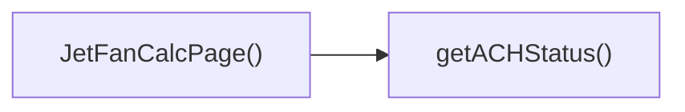

## Genel Bakış
VentHub HVAC projesinin hesaplayıcılar bölümünde yer alan bu React modülü, jet fan sistemleri için hesaplama arayüzü sunan bir sayfa bileşenidir. Kullanıcıların jet fan hesaplarını yönetmesine, sıfırlamasına ve hesaplanan performans metriklerinin çalışma durumunu görmesine olanak tanır.

## Fonksiyon Grupları
### Ana Sayfa Bileşeni
Tüm jet fan hesaplayıcı sayfasının temel yapısını oluşturan ana React bileşenidir, arayüzü ve tüm ilişkili işlevleri bir araya getirerek çalıştırır.
- JetFanCalcPage

### Kullanıcı İşlemleri Fonksiyonları
Kullanıcı tarafından tetiklenen sayfa içi eylemleri yönetir, mevcut tüm hesap değerlerini varsayılan başlangıç durumuna döndürmek için kullanılır.
- reset

### Performans Durumu Değerlendirme Fonksiyonları
Hesaplanan hava akışı metriklerinin uygunluğunu sınıflandırır, hava değişim sayısı (ACH) değerine göre sistemin çalışma durumunu belirler.
- getACHStatus

---

## AXIOMS – Mimari Varsayımlar
Bu modül, HVAC sistemleri için jetfan hesaplamaları sunan bir React sayfa bileşenidir, tüm işlevlerinin sorunsuz çalışması için dahili tanımlı sabit ve metotlarının erişilebilir olması zorunludur.

[Aksiyom 1]: Eğer APPLICATION_OPTIONS sabiti geçerli bir dizi olarak tanımlı değilse, kullanıcıya sunulacak uygulama seçenekleri listelenemez, form girişleri hatalı çalışır.
[Aksiyom 2]: Eğer VENTILATION_MODE_OPTIONS sabiti geçerli bir dizi olarak tanımlı değilse, havalandırma modu seçenekleri kullanıcıya sunulamaz, hesaplama akışı başlatılamaz.
[Aksiyom 3]: Eğer reset() metodu tanımlı değilse, kullanıcı mevcut hesaplama formunu sıfırlayarak yeni hesaplama yapamaz, eski girdi değerleri kalıcı olarak ekranda kalır.
[Aksiyom 4]: Eğer getACHStatus(ach: number) metodu tanımlı değilse, hesaplanan ACH değerinin durum kontrolü yapılamaz, kullanıcıya hesaplama sonucu sunulamaz.
[Aksiyom 5]: Eğer getACHStatus() metoduna iletilen ach parametresi sayısal bir değer değilse, ACH durumu doğru hesaplanamaz, modül hata fırlatır veya kullanıcıya yanlış sonuç sunar.

---

## FONKSIYON DETAYLARI

### JetFanCalcPage
**Ne yapar**: VentHub HVAC projesinin jet fan hesaplama arayüzünü oluşturan ana React bileşenidir. Kullanıcının jet fan seçimi, performans hesaplamaları ve hava değişim değerlerini görüntülemesi için gerekli tüm arayüz elemanlarını bir araya getirir. HVAC sistemleri için özel olarak geliştirilen bu hesaplama sayfası, endüstri standartlarına uygun hesaplamaların yapılmasına olanak tanır.
**Nasıl yapar**: Sayfa içinde yer alan form alanları, hesaplama mantıkları ve kendi bünyesindeki yardımcı fonksiyonları birleştirerek tam işlevsel bir hesaplama ortamı sunar. React bileşeni olarak sayfa durumunu yönetir, kullanıcı girişlerini işler ve hesaplama sonuçlarını kullanıcıya sunacak şekilde işler. Tüm alt bileşenleri sarmalayarak tek bir hesaplama sayfası olarak çalışmasını sağlar.
**Parametreler**: Bu fonksiyon herhangi bir giriş parametresi almaz.
**Dönüş**: React.FC türünde bir React bileşeni döndürür, bu bileşen uygulama içindeki rota tarafından çağrıldığında tarayıcıda işlenerek jet fan hesaplama sayfasının kullanıcıya sunulmasını sağlar.

### reset
**Ne yapar**: JetFanCalcPage sayfasındaki tüm kullanıcı girişlerini, mevcut hesaplama sonuçlarını ve sayfa durum değerlerini varsayılan ilk hallerine döndüren sıfırlama fonksiyonudur. Kullanıcının mevcut hesaplamasını sıfırlayarak tamamen yeni bir hesaplama süreci başlatmasını mümkün kılar. Formdaki tüm doldurulmuş alanları temizleyerek hata veya yanlış giriş durumlarında kolayca sıfırlama imkanı sunar.
**Nasıl yapar**: JetFanCalcPage bileşeni içinde yönetilen state nesnesindeki tüm form değerlerini, hesaplanmış performans verilerini ve tüm uyarı/hata mesajlarını ilk yükleme durumundaki varsayılan değerlerle günceller. Sayfa içindeki tüm durum bilgilerini sıfırlayarak kullanıcının baştan hesaplama yapmasına imkan tanır.
**Parametreler**: Bu fonksiyon herhangi bir giriş parametresi almaz.
**Dönüş**: Herhangi bir değer döndürmez, yalnızca sayfa içi durumu değiştirmek üzere çalışan void işlevidir, tanımında dönüş tipi belirtilmemiştir.

### getACHStatus
**Ne yapar**: Hesaplanan saatlik hava değişim sayısı (ACH - Air Change per Hour) değerine göre sistemin hava değişim performansını dört farklı risk kategorisinden birine sınıflandıran yardımcı doğrulama fonksiyonudur. Elde edilen durum değeri, kullanıcı arayüzünde uygun görsel ipuçları veya bilgilendirme mesajları ile kullanıcıya sunulmak üzere kullanılır. HVAC sistemlerinin yeterli hava değişimi sağlamasını kontrol etmek için temel bir kontrol mekanizmasıdır.
**Nasıl yapar**: Girdi olarak aldığı sayısal ach değerini önceden tanımlanmış endüstri standartlarındaki eşik değerlerle karşılaştırır, karşılaştırma sonucunda performansın hangi kategoriye ait olduğunu belirler. Belirlenen durum metni, arayüzde uygun renk, ikon veya uyarı metni ile gösterilerek kullanıcının sistem durumunu kolayca anlamasını sağlar.
**Parametreler**:
- name: ach — type: number — Sınıflandırma yapılacak temel girdi olan hesaplanmış saatlik hava değişim sayısını temsil eden sayısal değer, performans seviyesini belirlemek için eşiklerle karşılaştırılır.
**Dönüş**: Sadece dört farklı string değerden birini döndürür: 'optimal', 'acceptable', 'warning' veya 'critical'. Bu değerler sırasıyla mükemmel, kabul edilebilir, dikkat gerektiren ve kritik düzeyde hava değişim performansını ifade eder.

---

## SABİTLER
- **APPLICATION_OPTIONS** (array) — `[
  {
    value: 'parking',
    label: 'Otopark',
    description: 'Kapal...`
- **VENTILATION_MODE_OPTIONS** (array) — `[
  { value: 'normal', label: 'Normal', description: 'Günlük havalandırma' }...`

---

## AST POINTERS

### [N1_NASIL] AST Pointer: C:\Users\alize\venthub-hvac\src\views\calculators\JetFanCalcPage.tsx::JetFanCalcPage_internal_calculate
- **params**: (parametre yok)
- **ic_degiskenler**:
  - `lenVal` — length string girdisinin parseFloat ile dönüştürülmüş sayısal değeri, geçersizse 0 olarak varsayılır
  - `widVal` — width string girdisinin parseFloat ile dönüştürülmüş sayısal değeri, geçersizse 0 olarak varsayılır
  - `heiVal` — height string girdisinin parseFloat ile dönüştürülmüş sayısal değeri, geçersizse 0 olarak varsayılır
  - `carVal` — carCapacity string girdisinin parseFloat ile dönüştürülmüş sayısal değeri, geçersizse 0 olarak varsayılır
  - `trafficVal` — trafficFlow string girdisinin parseFloat ile dönüştürülmüş sayısal değeri, geçersizse 0 olarak varsayılır
  - `applicationType` — seçilen uygulama tipi (parking/tunnel), otopark girdi doğrulaması ve hesaplama parametresi olarak kullanılır
  - `ventilationMode` — seçilen havalandırma modu, hesaplama fonksiyonuna parametre olarak gönderilir
  - `length` — girdi olarak alınan mekan uzunluğu string değeri
  - `width` — girdi olarak alınan mekan genişliği string değeri
  - `height` — girdi olarak alınan mekan yüksekliği string değeri
  - `carCapacity` — otopark araç kapasitesini tutan string girdi değeri
  - `trafficFlow` — saatlik trafik akışını tutan string girdi değeri
  - `calculateJetFan` — jet fan ihtiyacını hesaplayan ana fonksiyon, doğrulanmış parametrelerle çağrılır
- **Dönüş**: calculateJetFan sonucu veya geçersiz girdilerde null

### [N2_NASIL] AST Pointer: C:\Users\alize\venthub-hvac\src\views\calculators\JetFanCalcPage.tsx::reset
- **params**: (parametre yok)
- **ic_degiskenler**:
  - `setApplicationType` — uygulama tipi state'ini güncelleyen React state setter fonksiyonu
  - `setVentilationMode` — havalandırma modu state'ini güncelleyen React state setter fonksiyonu
  - `setLength` — mekan uzunluğu state'ini varsayılan değere sıfırlayan React state setter fonksiyonu
  - `setWidth` — mekan genişliği state'ini varsayılan değere sıfırlayan React state setter fonksiyonu
  - `setHeight` — mekan yüksekliği state'ini varsayılan değere sıfırlayan React state setter fonksiyonu
  - `setCarCapacity` — otopark araç kapasitesi state'ini varsayılan değere sıfırlayan React state setter fonksiyonu
  - `setTrafficFlow` — saatlik trafik akışı state'ini varsayılan değere sıfırlayan React state setter fonksiyonu
- **Dönüş**: yok

### [N3_NASIL] AST Pointer: C:\Users\alize\venthub-hvac\src\views\calculators\JetFanCalcPage.tsx::getACHStatus
- **params**: (ach: number)
- **ic_degiskenler**:
  - `ach` — fonksiyona parametre olarak gelen saatlik hava değişimi (ACH) sayısal değeri, durum sınıflandırması için kullanılır
  - `applicationType` — aktif uygulama tipi (parking/tunnel), ACH durum eşiğilerini belirlemek için kullanılır
- **Dönüş**: 'optimal' | 'acceptable' | 'warning'

### [N4_NASIL] AST Pointer: C:\Users\alize\venthub-hvac\src\views\calculators\JetFanCalcPage.tsx::JetFanCalcPage_svg_fan_render_callback
- **params**: (_: any, i: number)
- **ic_degiskenler**:
  - `i` — map fonksiyonundan gelen indeks parametresi, SVG konumu hesaplamak ve JSX anahtarı olarak kullanılır
  - `x` — her bir fan öğesinin SVG üzerindeki x merkez koordinatı, 40 + (i * 28) formülüyle hesaplanır
- **Dönüş**: İçinde ellipse ve line SVG öğeleri barındıran <g> JSX elemanı

---

## ÇAĞRI HARİTASI

### Disariya Cagrilar (Outgoing)
JetFanCalcPage() fonksiyonu, jet fan hesaplama akışı sırasında havalandırma (ACH) durumunu sorgulamak için dosya içindeki getACHStatus fonksiyonunu çağırır.

### Disaridan Cagrilanlar (Incoming)
Verilen veri setinde bu modülü kullanan herhangi bir dış dosya veya fonksiyon bilgisi paylaşılmamıştır.

### Ic Ice Fonksiyonlar (Nested)
Yok

---

## DOSYA-İÇİ ÇAĞRI GRAFİĞİ
  JetFanCalcPage() → getACHStatus()

---

## NODE ID STANDARD

  file: src\views\calculators\JetFanCalcPage.tsx
  function: src\views\calculators\JetFanCalcPage.tsx::JetFanCalcPage
  function: src\views\calculators\JetFanCalcPage.tsx::reset
  function: src\views\calculators\JetFanCalcPage.tsx::getACHStatus

---

## DISA AKTARILANLAR (EXPORTS)
  export: JetFanCalcPage