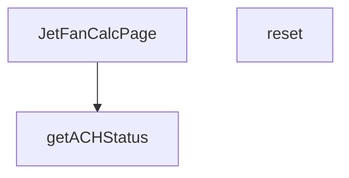

## Genel Bakış
VentHub HVAC projesinde yer alan bu modül, jet fan havalandırma sistemleri için hesaplama yapan bir sayfa bileşenidir. Kullanıcıların jet fan parametrelerini girerek hesaplama yapmasını, formu sıfırlamasını ve hesaplanan hava değişim sayısının (ACH) performans durumunu görsel olarak değerlendirmesini sağlar. Modül, form durumu yönetimi ve hesaplama sonuçlarının yorumlanması gibi temel sorumlulukları tek bir yapıda birleştirir.

## Fonksiyon Grupları
### Sayfa Bileşeni
Tüm jet fan hesaplayıcı arayüzünü oluşturan ana React bileşenidir. Form alanlarını, hesaplama mantığını ve sonuç gösterimini tek bir yapıda birleştirerek kullanıcıya sunar.

- JetFanCalcPage

### Yardımcı Fonksiyonlar
Sayfa içindeki hesaplama ve durum değerlendirme işlemlerini destekleyen yardımcı işlevlerdir. Kullanıcının formu sıfırlamasına ve ACH değerinin performans seviyesini belirlenmesine olanak tanır.

- reset, getACHStatus

---

## AXIOMS – Mimari Varsayımlar

Bu modül için minimum aksiyomlar fonksiyon imzalarından türetilebilir. Fonksiyon gövdeleri mevcut olmadığı için eşik değerleri ve iç mantık bilinmemektedir.

---

**[Aksiyom 1]**: Eğer `getACHStatus` fonksiyonu çağrılacaksa, `ach` parametresi bir `number` (sayısal) değeri olmalıdır.
*Eğer `ach` parametresi sayısal bir değer değilse, fonksiyon beklenmeyen bir davranış sergileyebilir veya hata üretebilir.*

**[Aksiyom 2]**: Eğer `getACHStatus` fonksiyonu başarılı şekilde çalışırsa, dönüş değeri yalnızca şu dört değerden biri olmalıdır: `'optimal'`, `'acceptable'`, `'warning'` veya `'critical'`.
*Eğer dönüş değeri bu değerlerden biri değilse, UI bileşeninin durum gösterimi bozulur.*

**[Aksiyom 3]**: Eğer `JetFanCalcPage` bileşeni çağrılacaksa, geçerli bir React ortamının (React runtime) mevcut olması gerekir.
*Eğer React ortamı yoksa, bileşen render edilemez.*

---

### Bilinmeyenler / Doğrulanamayanlar
| Değer | Durum |
|-------|-------|
| `getACHStatus` içindeki eşik değerleri (optimal/acceptable/warning/critical aralıkları) | **Bilinmiyor** — fonksiyon gövdesi mevcut değil |
| `reset()` fonksiyonunun hangi state'leri sıfırladığı | **Bilinmiyor** — fonksiyon gövdesi mevcut değil |
| `ach` parametresinin geçerli aralığı (min/max) | **Bilinmiyor** — fonksiyon gövdesi mevcut değil |
| Formda hangi input alanlarının bulunduğu | **Bilinmiyor** — değişken tanımları mevcut değil |

---

## FONKSİYON DETAYLARI

### JetFanCalcPage
**Ne yapar**: Jet Fan hesaplama sayfasının ana React bileşenidir. HVAC (Isıtma, Havalandırma ve Klima) sistemi için jet fan hesaplamalarını kullanıcı arayüzünde sunar. Bu bileşen, hesaplama formunu, sonuçları ve ilgili durum göstergelerini yönetir.

**Nasıl yapar**: Fonksiyon bir React fonksiyonel bileşenidir (React.FC). İçerisinde hesaplama mantığını, form durumunu (state) ve kullanıcı etkileşimlerini yönetir. Jet fan sistemi için gerekli parametreleri (hava debisi, kanal boyutları, ACH değeri vb.) işleyerek hesaplama sonuçlarını oluşturur ve sayfada gösterir. Kullanıcının değerleri girip hesaplayabilmesini sağlar.

**Parametreler**:
Bu fonksiyon parametre almaz, çünkü bir React bileşenidir ve props üzerinden veri alması beklenir (ancak bu spesifikasyonda props tanımlanmamıştır).

**Dönüş**: `React.FC` tipinde bir JSX bileşeni döndürür. Bu, React Functional Component anlamına gelir ve hesaplama sayfasının tüm arayüzünü render eder.

### reset
**Ne yapar**: JetFanCalcPage sayfasındaki tüm kullanıcı girişlerini, mevcut hesaplama sonuçlarını ve sayfa durum değerlerini varsayılan ilk hallerine döndüren sıfırlama fonksiyonudur. Kullanıcının mevcut hesaplamasını sıfırlayarak tamamen yeni bir hesaplama süreci başlatmasını mümkün kılar. Formdaki tüm doldurulmuş alanları temizleyerek hata veya yanlış giriş durumlarında kolayca sıfırlama imkanı sunar.
**Nasıl yapar**: JetFanCalcPage bileşeni içinde yönetilen state nesnesindeki tüm form değerlerini, hesaplanmış performans verilerini ve tüm uyarı/hata mesajlarını ilk yükleme durumundaki varsayılan değerlerle günceller. Sayfa içindeki tüm durum bilgilerini sıfırlayarak kullanıcının baştan hesaplama yapmasına imkan tanır.
**Parametreler**: Bu fonksiyon herhangi bir giriş parametresi almaz.
**Dönüş**: Herhangi bir değer döndürmez, yalnızca sayfa içi durumu değiştirmek üzere çalışan void işlevidir, tanımında dönüş tipi belirtilmemiştir.

### getACHStatus
**Ne yapar**: Hesaplanan saatlik hava değişim sayısı (ACH - Air Change per Hour) değerine göre sistemin hava değişim performansını dört farklı risk kategorisinden birine sınıflandıran yardımcı doğrulama fonksiyonudur. Elde edilen durum değeri, kullanıcı arayüzünde uygun görsel ipuçları veya bilgilendirme mesajları ile kullanıcıya sunulmak üzere kullanılır. HVAC sistemlerinin yeterli hava değişimi sağlamasını kontrol etmek için temel bir kontrol mekanizmasıdır.
**Nasıl yapar**: Girdi olarak aldığı sayısal ach değerini önceden tanımlanmış endüstri standartlarındaki eşik değerlerle karşılaştırır, karşılaştırma sonucunda performansın hangi kategoriye ait olduğunu belirler. Belirlenen durum metni, arayüzde uygun renk, ikon veya uyarı metni ile gösterilerek kullanıcının sistem durumunu kolayca anlamasını sağlar.
**Parametreler**:
- name: ach — type: number — Sınıflandırma yapılacak temel girdi olan hesaplanmış saatlik hava değişim sayısını temsil eden sayısal değer, performans seviyesini belirlemek için eşiklerle karşılaştırılır.
**Dönüş**: Sadece dört farklı string değerden birini döndürür: 'optimal', 'acceptable', 'warning' veya 'critical'. Bu değerler sırasıyla mükemmel, kabul edilebilir, dikkat gerektiren ve kritik düzeyde hava değişim performansını ifade eder.

---

## İTHALATLAR (IMPORTS)
- import: ../../i18n/I18nProvider::useI18n
- import: lucide-react::ArrowDownUp
- import: lucide-react::Car
- import: lucide-react::Gauge
- import: lucide-react::MapPin
- import: lucide-react::RotateCcw
- import: lucide-react::Wind
- import: react::React
- import: react::useMemo
- import: react::useState

---

## AST POINTERS

### [N1_NASIL] AST Pointer: JetFanCalcPage.tsx::useMemo_hesaplama_callback
- **params**: (parametre yok)
- **ic_degiskenler**:
  - `lenVal` — `length` state'inin parseFloat karşılığı; hesaplamada kullanılmak üzere sayısal boyut
  - `widVal` — `width` state'inin parseFloat karşılığı; hesaplamada kullanılmak üzere sayısal genişlik
  - `heiVal` — `height` state'inin parseFloat karşılığı; hesaplamada kullanılmak üzere sayısal yükseklik
  - `carVal` — `carCapacity` state'inin parseFloat karşılığı; otopark uygulaması için araç kapasitesi
  - `trafficVal` — `trafficFlow` state'inin parseFloat karşılığı; tünel uygulaması için saatlik trafik akışı
- **Erişilen state'ler**: `length`, `width`, `height`, `carCapacity`, `trafficFlow`, `applicationType`, `ventilationMode`
- **Erişilen dış fonksiyon**: `calculateJetFan` — hesaplama sonuç nesnesini döndürür
- **Dönüş**: `calculateJetFan({...})` sonucu veya `null` (geçersiz boyut/kapasite durumunda)

---

### [N2_NASIL] AST Pointer: JetFanCalcPage.tsx::reset
- **params**: (parametre yok)
- **ic_degiskenler**: (yok)
- **Yan etkiler**: Tüm form state'lerini varsayılan değerlere sıfırlar:
  - `setApplicationType('parking')`
  - `setVentilationMode('normal')`
  - `setLength('100')`
  - `setWidth('30')`
  - `setHeight('3')`
  - `setCarCapacity('100')`
  - `setTrafficFlow('50')`
- **Dönüş**: yok (void)

---

### [N3_NASIL] AST Pointer: JetFanCalcPage.tsx::getACHStatus
- **params**: `ach: number` — hesaplanan hava değişim sayısı
- **ic_degiskenler**: (yok)
- **Erişilen state**: `applicationType` — uygulama türüne göre eşik değerleri belirler
- **Dönüş**: `'optimal' | 'acceptable' | 'warning' | 'critical'`
  - `applicationType === 'parking'` için: `ach >= 6 && ach <= 10` → optimal, `ach >= 4 && ach <= 12` → acceptable, diğer → warning
  - tünel (`else`) için: `ach >= 20` → optimal, `ach >= 15` → acceptable, diğer → warning

---

### [N4_NASIL] AST Pointer: JetFanCalcPage.tsx::svg_map_callback
- **params**: `(_, i)` — `_`: dizgi elemanı (kullanılmıyor), `i`: indeks
- **ic_degiskenler**:
  - `x` — `40 + (i * 28)` ifadesinden hesaplanan her fan için yatay (x) koordinatı
- **Dönüş**: JSX `<g>` elemanı — `ellipse` (fan sembolü) ve `line` (bağlantı çizgisi, `strokeDasharray` ile kesikli) elemanlarından oluşan SVG grubu

---

## MERMAID CALL GRAPH

## NODE ID STANDARD

  file: src\views\calculators\JetFanCalcPage.tsx
  function: src\views\calculators\JetFanCalcPage.tsx::JetFanCalcPage
  function: src\views\calculators\JetFanCalcPage.tsx::reset
  function: src\views\calculators\JetFanCalcPage.tsx::getACHStatus

---

## DISA AKTARILANLAR (EXPORTS)
  export: JetFanCalcPage

---

## STİL TOKENLERİ

### Arbitrary Değerler (token'a geçirilmemiş)
Yok — tüm stiller token'a geçirilmiş. ✅

### Kullanılan Token'lar (zaten token'a geçirilmiş)
- (yok)

### Tailwind Sınıf Özeti
- **Renkler:** `bg-gray-100`, `bg-primary-navy/10`, `bg-secondary-blue/5`, `bg-success-green/10`, `bg-warning-orange/10`, `bg-white`, `border-light-gray`, `border-warning-orange/30`, `fill-steel-gray`, `hover:text-industrial-gray`, `text-7px`, `text-center`, `text-industrial-gray`, `text-lg`, `text-primary-navy`
- **Layout:** `flex`, `flex-col`, `flex-shrink-0`, `gap-2`, `gap-3`, `gap-4`, `gap-8`, `grid`, `grid-cols-2`, `grid-cols-3`, `items-center`, `items-start`, `justify-center`, `lg:grid-cols-2`, `max-w-md`
- **Varyant/Responsive:** `hover:`, `lg:` önekleri
- **Yardımcı Sınıflar:** `border`, `font-medium`, `font-semibold`, `mb-3`, `mb-4`, `mb-6`, `ml-2`, `mt-0.5`, `mt-1`, `mt-4`, `py-12`, `rounded-2xl`, `rounded-full`, `rounded-lg`, `rounded-xl`